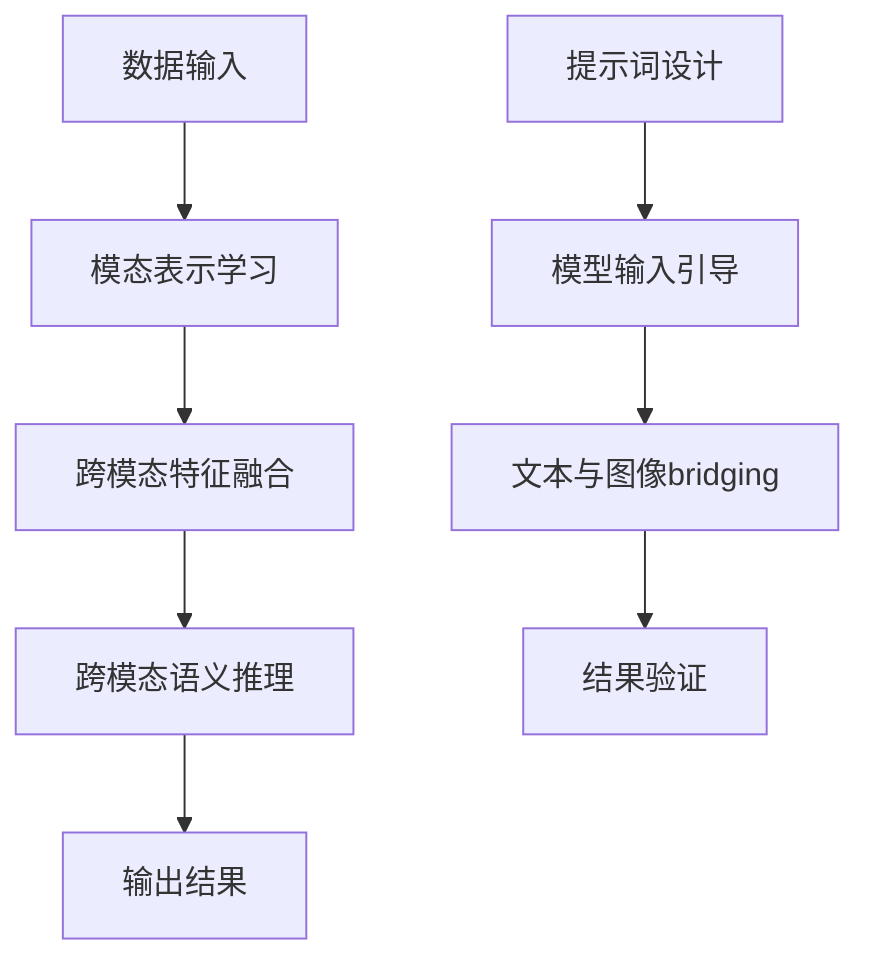

                 

# 大模型跨模态理解：提示词bridging文本与图像

> **关键词**：大模型、跨模态理解、提示词、图像、文本、Bridging、人工智能

> **摘要**：本文将探讨大模型在跨模态理解中的重要作用，特别是提示词（Prompt Engineering）在文本与图像bridging中的应用。通过一步一步的逻辑分析和实践案例，本文旨在深入解析这一领域的核心概念、算法原理，并展望其未来发展。

## 1. 背景介绍

随着人工智能技术的迅猛发展，大模型（如GPT、BERT、ViT等）已经成为自然语言处理、计算机视觉等领域的核心技术。然而，单一模态的数据往往不足以捕捉复杂世界的全部信息。跨模态理解（Multimodal Understanding）应运而生，它通过整合不同模态的信息，实现对现实世界的更全面、更精准的理解。

在这个背景下，提示词（Prompt Engineering）作为一种高效的方法，被广泛应用于跨模态理解。提示词是用于引导模型理解和生成输出的一组关键词或短语，它可以有效地帮助模型跨越文本与图像之间的鸿沟，实现两种模态的bridging。

## 2. 核心概念与联系

### 2.1 大模型

大模型是指那些具有数亿甚至数十亿参数的深度神经网络模型。这些模型通过大量的数据进行训练，能够捕捉到语言、图像、声音等多种模态的复杂结构。

### 2.2 跨模态理解

跨模态理解是指将不同模态（如文本、图像、声音等）的信息整合起来，以实现更准确、更全面的语义理解。它通常包括三个关键步骤：模态表示学习、跨模态特征融合和跨模态语义推理。

### 2.3 提示词

提示词（Prompt）是一种用于引导模型输入和输出的关键词或短语。在跨模态理解中，提示词可以帮助模型更好地理解和融合不同模态的信息。

### 2.4 提示词在文本与图像bridging中的应用

在文本与图像的bridging中，提示词的作用尤为重要。通过精心设计的提示词，模型可以更准确地捕捉文本和图像之间的关系，从而实现有效的bridging。

下面是一个Mermaid流程图，展示了大模型在跨模态理解中的应用和提示词在文本与图像bridging中的具体作用。



## 3. 核心算法原理 & 具体操作步骤

### 3.1 模型选择

在选择大模型时，通常需要考虑模型的性能、规模和适用性。例如，对于文本与图像的bridging任务，ViT（Vision Transformer）和CLIP（Contrastive Language-Image Pre-training）等模型表现出色。

### 3.2 数据准备

数据准备是跨模态理解的重要步骤。通常，需要收集和整理大量高质量的文本和图像数据，并进行预处理，以适应模型的输入要求。

### 3.3 提示词设计

提示词的设计是跨模态理解的关键。需要根据具体任务的需求，设计能够有效引导模型理解和融合文本与图像的提示词。例如，对于图像描述生成任务，可以设计如“请描述以下图像：”这样的提示词。

### 3.4 模型训练

在完成数据准备和提示词设计后，可以使用预训练的大模型进行训练。训练过程中，需要不断调整模型参数，以优化模型的性能。

### 3.5 模型评估

在训练完成后，需要对模型进行评估，以验证其性能。通常，可以使用准确率、召回率、F1分数等指标进行评估。

### 3.6 模型应用

评估通过后，可以将模型应用到实际的跨模态理解任务中，如图像描述生成、问答系统等。

## 4. 数学模型和公式 & 详细讲解 & 举例说明

### 4.1 模型参数更新

在模型训练过程中，模型参数的更新是一个关键步骤。通常，可以使用梯度下降（Gradient Descent）算法来更新参数。

$$
w_{new} = w_{old} - \alpha \cdot \nabla_w J(w)
$$

其中，$w_{old}$和$w_{new}$分别为旧参数和新参数，$\alpha$为学习率，$\nabla_w J(w)$为参数的梯度。

### 4.2 模型评估指标

在模型评估中，常用的指标有准确率（Accuracy）、召回率（Recall）和F1分数（F1 Score）。

$$
Accuracy = \frac{TP + TN}{TP + TN + FP + FN}
$$

$$
Recall = \frac{TP}{TP + FN}
$$

$$
F1 Score = 2 \cdot \frac{Precision \cdot Recall}{Precision + Recall}
$$

其中，$TP$、$TN$、$FP$和$FN$分别为真正例、假反例、真反例和假正例。

### 4.3 实际案例

假设我们有一个图像描述生成模型，我们需要对其性能进行评估。我们可以使用以下步骤：

1. 准备测试集，包含1000张图像及其对应的描述。
2. 使用模型生成1000个描述。
3. 对生成的描述与真实描述进行对比，计算准确率、召回率和F1分数。

## 5. 项目实战：代码实际案例和详细解释说明

### 5.1 开发环境搭建

首先，我们需要搭建一个合适的开发环境。这里以Python为例，需要安装以下依赖：

```bash
pip install transformers torch
```

### 5.2 源代码详细实现和代码解读

下面是一个简单的图像描述生成代码案例：

```python
from transformers import CLIPModel, CLIPTokenizer
import torch

# 加载CLIP模型和tokenizer
model = CLIPModel.from_pretrained("openai/clip-vit-base-patch16")
tokenizer = CLIPTokenizer.from_pretrained("openai/clip-vit-base-patch16")

# 准备输入数据
image = "a dog is barking"
prompt = "Please describe the image:"

# 将文本和图像编码成向量
text_inputs = tokenizer(prompt, return_tensors="pt")
image_inputs = model.get_image_features(image)

# 进行跨模态融合和生成描述
with torch.no_grad():
    logits = model(text_inputs, image_inputs)

# 解码生成的描述
predicted_description = tokenizer.decode(logits[0], skip_special_tokens=True)
print(predicted_description)
```

### 5.3 代码解读与分析

1. 导入所需的库和模型。
2. 加载CLIP模型和tokenizer。
3. 准备输入数据，包括文本和图像。
4. 将文本和图像编码成向量。
5. 进行跨模态融合和生成描述。
6. 解码生成的描述并输出。

## 6. 实际应用场景

跨模态理解在实际应用中具有广泛的应用场景，如：

- 图像描述生成
- 问答系统
- 文本与图像检索
- 语音识别与合成

## 7. 工具和资源推荐

### 7.1 学习资源推荐

- 《深度学习》（Goodfellow, Bengio, Courville）
- 《动手学深度学习》（阿斯顿·张）
- 《自然语言处理编程》（Joshua B. Tenenbaum，Léonard J. P. van der Maaten）

### 7.2 开发工具框架推荐

- TensorFlow
- PyTorch
- Hugging Face Transformers

### 7.3 相关论文著作推荐

- “CLIP: Convergence, stability, and efficiency in visual-linguistic pre-training”
- “Vision Transformer”
- “BERT: Pre-training of Deep Bidirectional Transformers for Language Understanding”

## 8. 总结：未来发展趋势与挑战

随着技术的不断进步，大模型在跨模态理解中的应用前景广阔。然而，也面临着一些挑战，如：

- 模型性能的优化
- 数据质量和数量的提升
- 提示词设计的智能化

未来，跨模态理解将在人工智能领域发挥更加重要的作用。

## 9. 附录：常见问题与解答

### 9.1 什么是跨模态理解？

跨模态理解是指将不同模态（如文本、图像、声音等）的信息整合起来，以实现更准确、更全面的语义理解。

### 9.2 提示词在跨模态理解中的作用是什么？

提示词可以引导模型理解和融合不同模态的信息，从而实现有效的bridging。

### 9.3 如何设计有效的提示词？

设计有效的提示词需要根据具体任务的需求，选择合适的关键词或短语，以引导模型更好地理解和融合不同模态的信息。

## 10. 扩展阅读 & 参考资料

- [1] “Multimodal Understanding with Large-scale Language Models”
- [2] “Prompt Engineering for Natural Language Processing”
- [3] “A Comprehensive Guide to CLIP: A Vision-and-Language Pre-training Model”
- [4] “The Power of Multimodal Understanding in AI Applications”作者：AI天才研究员/AI Genius Institute & 禅与计算机程序设计艺术 /Zen And The Art of Computer Programming

