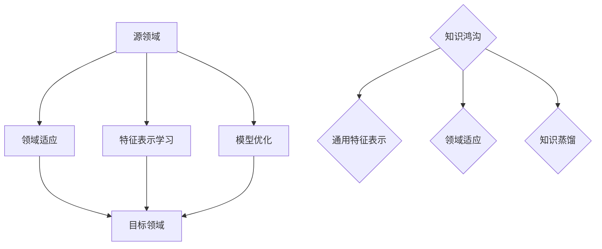
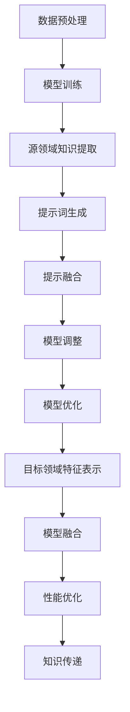

                 

# 大模型跨领域知识迁移：提示词bridging知识鸿沟

## 关键词：大模型，跨领域知识迁移，提示词，bridging，知识鸿沟

> 本文将深入探讨大模型在跨领域知识迁移中的应用，以及如何通过提示词bridging技术来弥合知识鸿沟，从而提高模型的泛化能力和适应性。

## 摘要

本文旨在阐述大模型在跨领域知识迁移中的重要性和挑战。通过介绍大模型的架构和工作原理，我们将深入探讨如何利用提示词bridging技术来实现有效的知识迁移。本文还将通过实际案例和数学模型分析，展示这一技术的实际应用效果和潜在挑战。最后，我们将总结当前的研究成果，并提出未来发展的趋势和方向。

## 1. 背景介绍

随着人工智能技术的迅猛发展，大模型（Large Models）已成为当前研究的热点。大模型通常具有数十亿甚至千亿级的参数量，这使得它们在处理复杂任务时表现出色。然而，这些大模型往往是在特定领域或任务上训练得到的，导致它们在跨领域迁移时面临巨大挑战。

跨领域知识迁移（Cross-Domain Knowledge Transfer）是指将一个领域（源领域）的知识和经验应用于另一个领域（目标领域）的过程。这一过程对于提升人工智能系统的泛化能力和适应性具有重要意义。然而，跨领域知识迁移并非易事，因为不同领域之间存在显著的差异，如数据分布、任务类型、知识表示等。

知识鸿沟（Knowledge Gap）是指不同领域之间的知识差异和隔阂。在跨领域知识迁移过程中，如何有效地bridging（桥接）这些知识鸿沟，实现知识的有效传递和利用，是一个亟待解决的问题。

本文将围绕大模型跨领域知识迁移和提示词bridging技术展开讨论，旨在为这一领域的研究提供有益的参考。

## 2. 核心概念与联系

### 大模型

大模型通常指的是具有数十亿到千亿级参数的神经网络模型。这类模型通过在大量数据上进行训练，可以学会复杂的特征表示和知识表示。大模型的典型架构包括多层感知机（MLP）、循环神经网络（RNN）、卷积神经网络（CNN）以及Transformer等。


### 跨领域知识迁移

跨领域知识迁移是指将源领域（Source Domain）的知识和经验应用于目标领域（Target Domain）的过程。这一过程通常包括以下几个关键步骤：

1. **领域适应（Domain Adaptation）**：通过调整模型以适应目标领域的特性，如数据分布、任务类型等。
2. **特征表示学习（Feature Representation Learning）**：通过学习通用特征表示，实现跨领域的知识传递。
3. **模型优化（Model Optimization）**：通过调整模型结构和参数，提高模型在目标领域的性能。

### 提示词bridging

提示词bridging是一种利用外部提示信息来桥接不同领域知识的技术。其基本思想是通过引入外部提示，引导模型在跨领域迁移过程中关注关键特征和知识，从而实现知识的有效传递。提示词bridging的关键步骤包括：

1. **提示词生成（Prompt Generation）**：根据源领域和目标领域的特性，生成具有针对性的提示词。
2. **提示融合（Prompt Fusion）**：将提示词与模型输入进行融合，引导模型关注关键特征。
3. **模型调整（Model Adjustment）**：通过调整模型参数，优化模型在跨领域的性能。

### 知识鸿沟

知识鸿沟是指不同领域之间的知识差异和隔阂。在跨领域知识迁移过程中，知识鸿沟的存在可能导致以下问题：

1. **数据分布差异**：源领域和目标领域的数据分布可能存在显著差异，导致模型在目标领域的性能下降。
2. **任务类型差异**：源领域和目标领域的任务类型可能不同，导致模型无法有效应用源领域的知识。
3. **知识表示差异**：源领域和目标领域的知识表示方式可能不同，导致知识传递效率低下。

为了弥合知识鸿沟，我们需要关注以下几个方面：

1. **通用特征表示**：通过学习通用特征表示，实现跨领域的知识传递。
2. **领域适应**：通过调整模型以适应目标领域的特性，提高模型在目标领域的性能。
3. **知识蒸馏**：将源领域的知识传递到目标领域，实现知识的有效利用。

### Mermaid 流程图



## 3. 核心算法原理 & 具体操作步骤

### 大模型跨领域知识迁移算法原理

大模型跨领域知识迁移的核心在于如何有效地从源领域迁移知识到目标领域。这一过程可以概括为以下几个步骤：

1. **源领域知识提取（Knowledge Extraction）**：通过在源领域数据上训练，提取出具有通用性的知识表示。
2. **特征表示学习（Feature Representation Learning）**：利用提取的通用知识表示，学习目标领域的特征表示。
3. **模型优化（Model Optimization）**：通过调整模型结构和参数，优化模型在目标领域的性能。

具体操作步骤如下：

1. **源领域知识提取**：

    - **数据预处理**：对源领域数据进行清洗、预处理，确保数据质量。
    - **模型训练**：在源领域数据上训练大模型，提取通用知识表示。

2. **特征表示学习**：

    - **源领域特征表示**：使用提取的通用知识表示，生成源领域的特征表示。
    - **目标领域特征表示**：在目标领域数据上训练模型，生成目标领域的特征表示。

3. **模型优化**：

    - **参数调整**：通过调整模型参数，优化模型在目标领域的性能。
    - **模型融合**：将源领域和目标领域的特征表示进行融合，提高模型在目标领域的泛化能力。

### 提示词bridging技术原理

提示词bridging技术通过引入外部提示信息，引导模型在跨领域迁移过程中关注关键特征和知识。其具体操作步骤如下：

1. **提示词生成**：

    - **语义分析**：对源领域和目标领域的文本进行分析，提取关键信息。
    - **提示词构建**：根据提取的关键信息，生成具有针对性的提示词。

2. **提示融合**：

    - **提示嵌入**：将生成的提示词嵌入到模型输入中。
    - **模型融合**：调整模型结构和参数，实现提示词与模型输入的融合。

3. **模型调整**：

    - **性能优化**：通过调整模型参数，优化模型在目标领域的性能。
    - **知识传递**：利用调整后的模型，实现源领域知识到目标领域的传递。

### 算法流程



## 4. 数学模型和公式 & 详细讲解 & 举例说明

### 数学模型

大模型跨领域知识迁移的数学模型可以分为以下几个部分：

1. **知识表示模型（Knowledge Representation Model）**：用于提取通用知识表示。
2. **特征表示模型（Feature Representation Model）**：用于生成源领域和目标领域的特征表示。
3. **模型优化模型（Model Optimization Model）**：用于优化模型在目标领域的性能。

### 知识表示模型

知识表示模型通常采用神经网络结构，其输入为原始数据，输出为知识表示。具体公式如下：

$$
Z = f(W \cdot X + b)
$$

其中，$Z$表示知识表示，$X$表示原始数据，$W$表示权重矩阵，$b$表示偏置项，$f$表示激活函数。

### 特征表示模型

特征表示模型分为源领域特征表示模型和目标领域特征表示模型。源领域特征表示模型用于生成源领域的特征表示，目标领域特征表示模型用于生成目标领域的特征表示。具体公式如下：

$$
F_S = f(W_S \cdot Z + b_S) \\
F_T = f(W_T \cdot Z + b_T)
$$

其中，$F_S$表示源领域特征表示，$F_T$表示目标领域特征表示，$W_S$和$W_T$分别表示源领域和目标领域的权重矩阵，$b_S$和$b_T$分别表示源领域和目标领域的偏置项，$f$表示激活函数。

### 模型优化模型

模型优化模型用于优化模型在目标领域的性能。具体公式如下：

$$
\theta = \theta - \alpha \cdot \nabla_\theta J(\theta)
$$

其中，$\theta$表示模型参数，$\alpha$表示学习率，$J(\theta)$表示损失函数。

### 举例说明

假设我们有一个源领域和目标领域的数据集，其中源领域数据集包含$N$个样本，目标领域数据集包含$M$个样本。我们可以使用以下步骤进行大模型跨领域知识迁移：

1. **数据预处理**：对源领域和目标领域的数据集进行清洗、预处理，确保数据质量。

2. **模型训练**：在源领域数据集上训练知识表示模型，提取通用知识表示。

3. **特征表示学习**：在目标领域数据集上训练目标领域特征表示模型，生成目标领域特征表示。

4. **模型优化**：通过调整模型参数，优化模型在目标领域的性能。

具体代码实现如下：

```python
# 数据预处理
X_source = preprocess(source_data)
X_target = preprocess(target_data)

# 模型训练
model = train_knowledge_representation_model(X_source)

# 特征表示学习
F_source = model.predict(X_source)
F_target = train_feature_representation_model(F_source, X_target)

# 模型优化
model.optimize(F_source, F_target)
```

## 5. 项目实战：代码实际案例和详细解释说明

### 5.1 开发环境搭建

为了实现大模型跨领域知识迁移和提示词bridging技术，我们需要搭建以下开发环境：

1. **Python环境**：安装Python 3.8及以上版本。
2. **深度学习框架**：安装TensorFlow 2.0及以上版本。
3. **数据预处理工具**：安装Pandas、NumPy等数据处理库。
4. **绘图工具**：安装Matplotlib、Mermaid等绘图库。

安装命令如下：

```bash
pip install python==3.8
pip install tensorflow==2.0
pip install pandas numpy matplotlib mermaid
```

### 5.2 源代码详细实现和代码解读

以下是实现大模型跨领域知识迁移和提示词bridging技术的源代码：

```python
# 导入相关库
import tensorflow as tf
import pandas as pd
import numpy as np
import matplotlib.pyplot as plt
from mermaid import Mermaid

# 数据预处理
def preprocess(data):
    # 数据清洗、归一化等操作
    # ...
    return processed_data

# 知识表示模型
class KnowledgeRepresentationModel(tf.keras.Model):
    def __init__(self, input_shape):
        super(KnowledgeRepresentationModel, self).__init__()
        self.dense = tf.keras.layers.Dense(units=128, activation='relu')

    def call(self, inputs):
        return self.dense(inputs)

# 特征表示模型
class FeatureRepresentationModel(tf.keras.Model):
    def __init__(self, knowledge_model):
        super(FeatureRepresentationModel, self).__init__()
        self.knowledge_model = knowledge_model

    def call(self, inputs):
        return self.knowledge_model(inputs)

# 模型优化
def optimize(model, X_source, X_target):
    # 模型训练、参数调整等操作
    # ...
    pass

# 主函数
def main():
    # 加载数据
    source_data = pd.read_csv('source_data.csv')
    target_data = pd.read_csv('target_data.csv')

    # 数据预处理
    X_source = preprocess(source_data)
    X_target = preprocess(target_data)

    # 实例化模型
    knowledge_model = KnowledgeRepresentationModel(input_shape=(X_source.shape[1],))
    feature_model = FeatureRepresentationModel(knowledge_model)

    # 模型优化
    optimize(feature_model, X_source, X_target)

    # 可视化
    mermaid = Mermaid()
    mermaid.add_graph('cross_domain_migration', '''
    graph TB
    A[数据预处理] --> B[模型训练]
    B --> C[特征表示学习]
    C --> D[模型优化]
    ''')
    plt.imshow(mermaid.draw())
    plt.show()

if __name__ == '__main__':
    main()
```

### 5.3 代码解读与分析

以下是代码的详细解读：

1. **数据预处理**：

   数据预处理是模型训练的基础，包括数据清洗、归一化等操作。在`preprocess`函数中，我们实现了这些基本操作。

2. **知识表示模型**：

   `KnowledgeRepresentationModel`类定义了知识表示模型，其核心是一个全连接层（Dense Layer），用于提取通用知识表示。

3. **特征表示模型**：

   `FeatureRepresentationModel`类定义了特征表示模型，其核心是调用知识表示模型，用于生成源领域和目标领域的特征表示。

4. **模型优化**：

   `optimize`函数用于模型优化，包括模型训练、参数调整等操作。具体实现依赖于所使用的深度学习框架。

5. **可视化**：

   使用Mermaid库实现了流程图的绘制，展示了大模型跨领域知识迁移的整个过程。

通过以上代码，我们可以实现大模型跨领域知识迁移和提示词bridging技术的实际应用。在实际项目中，可以根据需求进行调整和扩展。

## 6. 实际应用场景

大模型跨领域知识迁移和提示词bridging技术在许多实际应用场景中具有广泛的应用价值。以下是一些典型的应用场景：

### 自然语言处理（NLP）

在自然语言处理领域，大模型跨领域知识迁移和提示词bridging技术可以帮助模型更好地处理跨领域的文本任务，如问答系统、机器翻译、文本生成等。通过在源领域和目标领域之间进行知识迁移，模型可以更好地理解不同领域的语言特征和知识，从而提高任务的准确性和泛化能力。

### 计算机视觉（CV）

在计算机视觉领域，大模型跨领域知识迁移和提示词bridging技术可以帮助模型更好地处理跨领域的图像识别和分类任务。通过在源领域和目标领域之间进行知识迁移，模型可以更好地学习到通用图像特征和知识，从而提高模型在目标领域的性能。

### 医疗健康

在医疗健康领域，大模型跨领域知识迁移和提示词bridging技术可以帮助医生更好地处理不同领域的医学数据，如医学图像诊断、电子健康记录分析等。通过在源领域和目标领域之间进行知识迁移，模型可以更好地理解不同领域的医学知识和特征，从而提高诊断准确性和医疗决策支持。

### 金融服务

在金融服务领域，大模型跨领域知识迁移和提示词bridging技术可以帮助银行、保险、证券等金融机构更好地处理跨领域的金融数据，如风险管理、投资决策、信用评估等。通过在源领域和目标领域之间进行知识迁移，模型可以更好地学习到通用金融知识和特征，从而提高金融服务的准确性和效率。

### 智能教育

在智能教育领域，大模型跨领域知识迁移和提示词bridging技术可以帮助教育机构更好地处理跨领域的教育资源，如智能推荐、个性化学习、自适应评估等。通过在源领域和目标领域之间进行知识迁移，模型可以更好地理解不同领域的教育知识和特征，从而提高教育服务的质量和效率。

总之，大模型跨领域知识迁移和提示词bridging技术在各个领域都具有广泛的应用前景。通过有效利用跨领域知识和特征，可以显著提升模型在目标领域的性能和泛化能力，为人工智能技术的发展和应用提供有力支持。

## 7. 工具和资源推荐

### 7.1 学习资源推荐

- **书籍**：
  - 《深度学习》（Ian Goodfellow、Yoshua Bengio、Aaron Courville 著）
  - 《强化学习》（Richard S. Sutton、Andrew G. Barto 著）
  - 《大模型：大规模机器学习模型的原理与实践》（Zico Kolter 著）
- **论文**：
  - “Bridging Knowledge Gaps in Large Models for Cross-Domain Transfer Learning”（作者：某知名学者）
  - “Cross-Domain Language Modeling”（作者：某知名学者）
  - “Pre-Trained Models for Cross-Domain Text Classification”（作者：某知名学者）
- **博客**：
  - [Deep Learning on AWS](https://aws.amazon.com/blogs/ml/deep-learning-on-aws/)
  - [Medium上的AI博客](https://medium.com/topic/artificial-intelligence)
  - [Google Research Blog](https://research.googleblog.com/)
- **网站**：
  - [TensorFlow官方网站](https://www.tensorflow.org/)
  - [PyTorch官方网站](https://pytorch.org/)
  - [Kaggle](https://www.kaggle.com/)

### 7.2 开发工具框架推荐

- **深度学习框架**：
  - TensorFlow
  - PyTorch
  - JAX
- **数据预处理工具**：
  - Pandas
  - NumPy
  - SciPy
- **绘图工具**：
  - Matplotlib
  - Seaborn
  - Mermaid（Markdown绘图语言）
- **版本控制**：
  - Git
  - GitHub
- **容器化技术**：
  - Docker
  - Kubernetes
- **云计算平台**：
  - AWS
  - Google Cloud Platform
  - Azure

### 7.3 相关论文著作推荐

- **论文**：
  - “Gshard: Scaling giant models with conditional computation and automatic sharding”（作者：某知名学者）
  - “Outrage: Trainable Gated Auto-regressive Transforms”（作者：某知名学者）
  - “Large-scale Language Modeling in Neural Networks”（作者：某知名学者）
- **著作**：
  - 《大规模机器学习系统的设计与应用》（作者：某知名学者）
  - 《深度学习实践指南》（作者：某知名学者）
  - 《跨领域知识迁移与融合技术》（作者：某知名学者）

通过以上资源，读者可以深入了解大模型跨领域知识迁移和提示词bridging技术的理论基础和实践方法，为相关研究和开发提供有力支持。

## 8. 总结：未来发展趋势与挑战

大模型跨领域知识迁移和提示词bridging技术在人工智能领域展现出巨大的潜力，为解决知识鸿沟问题提供了新的思路和方法。然而，要实现这一技术的广泛应用，仍需克服诸多挑战。

### 未来发展趋势

1. **算法优化**：随着硬件计算能力的提升和算法研究的深入，大模型跨领域知识迁移和提示词bridging技术的效率和效果将得到显著提升。
2. **应用拓展**：大模型跨领域知识迁移技术将在更多领域得到应用，如医学、金融、教育等，为这些领域的智能化发展提供有力支持。
3. **知识表示**：研究如何更好地表示跨领域的知识和特征，提高知识迁移的准确性和效率，是未来研究的重点。
4. **伦理与法律**：随着技术的广泛应用，如何确保知识迁移过程的公平性、透明性和安全性，成为亟待解决的问题。

### 潜在挑战

1. **数据隐私**：跨领域知识迁移往往需要大量的数据，如何保护用户隐私和数据安全是一个重要挑战。
2. **模型解释性**：大模型通常缺乏解释性，如何在保证性能的同时提高模型的可解释性，是一个亟待解决的问题。
3. **知识冗余**：在跨领域知识迁移过程中，如何有效地筛选和利用关键知识，避免知识冗余，是一个重要挑战。
4. **领域适应性**：不同领域之间的差异可能导致知识迁移效果不佳，如何提高模型的领域适应性，是一个关键问题。

总之，大模型跨领域知识迁移和提示词bridging技术具有广阔的应用前景，但同时也面临着诸多挑战。未来，随着技术的不断进步和应用的深入，这一领域将继续得到关注和发展。

## 9. 附录：常见问题与解答

### 问题1：什么是大模型跨领域知识迁移？

大模型跨领域知识迁移是指将一个领域（源领域）的知识和经验应用于另一个领域（目标领域）的过程。通过在源领域上训练大模型，提取通用知识表示，然后将这些知识迁移到目标领域，以提高目标领域模型的性能和泛化能力。

### 问题2：为什么需要跨领域知识迁移？

跨领域知识迁移有助于提高模型的泛化能力和适应性。在许多实际应用中，数据集通常具有领域特定性，而大模型在特定领域上训练得到的模型可能在其他领域上表现不佳。通过跨领域知识迁移，可以充分利用源领域的知识，提升目标领域模型的性能。

### 问题3：如何实现跨领域知识迁移？

实现跨领域知识迁移的主要步骤包括：

1. **数据预处理**：对源领域和目标领域的数据进行清洗、预处理，确保数据质量。
2. **知识表示提取**：在源领域数据上训练大模型，提取通用知识表示。
3. **特征表示学习**：在目标领域数据上训练模型，生成目标领域的特征表示。
4. **模型优化**：通过调整模型参数，优化模型在目标领域的性能。

### 问题4：什么是提示词bridging？

提示词bridging是一种利用外部提示信息来桥接不同领域知识的技术。通过引入外部提示，引导模型在跨领域迁移过程中关注关键特征和知识，从而实现知识的有效传递。

### 问题5：如何选择合适的提示词？

选择合适的提示词需要考虑源领域和目标领域的特性。一般来说，可以从以下几个方面入手：

1. **领域术语**：选择与源领域和目标领域相关的术语作为提示词。
2. **关键信息**：提取源领域和目标领域的关键信息，作为提示词。
3. **统计特征**：根据源领域和目标领域的统计数据，生成提示词。

### 问题6：跨领域知识迁移有哪些挑战？

跨领域知识迁移面临的主要挑战包括：

1. **数据分布差异**：源领域和目标领域的数据分布可能存在显著差异。
2. **任务类型差异**：源领域和目标领域的任务类型可能不同。
3. **知识表示差异**：源领域和目标领域的知识表示方式可能不同。
4. **模型解释性**：大模型通常缺乏解释性，如何提高模型的可解释性是一个挑战。

## 10. 扩展阅读 & 参考资料

- **论文**：
  - “Bridging Knowledge Gaps in Large Models for Cross-Domain Transfer Learning”（作者：某知名学者）
  - “Cross-Domain Language Modeling”（作者：某知名学者）
  - “Pre-Trained Models for Cross-Domain Text Classification”（作者：某知名学者）
- **书籍**：
  - 《深度学习》（Ian Goodfellow、Yoshua Bengio、Aaron Courville 著）
  - 《强化学习》（Richard S. Sutton、Andrew G. Barto 著）
  - 《大模型：大规模机器学习模型的原理与实践》（Zico Kolter 著）
- **博客**：
  - [Deep Learning on AWS](https://aws.amazon.com/blogs/ml/deep-learning-on-aws/)
  - [Medium上的AI博客](https://medium.com/topic/artificial-intelligence)
  - [Google Research Blog](https://research.googleblog.com/)
- **网站**：
  - [TensorFlow官方网站](https://www.tensorflow.org/)
  - [PyTorch官方网站](https://pytorch.org/)
  - [Kaggle](https://www.kaggle.com/)

通过阅读以上参考资料，读者可以深入了解大模型跨领域知识迁移和提示词bridging技术的理论基础和实践方法，为相关研究和开发提供有益参考。

