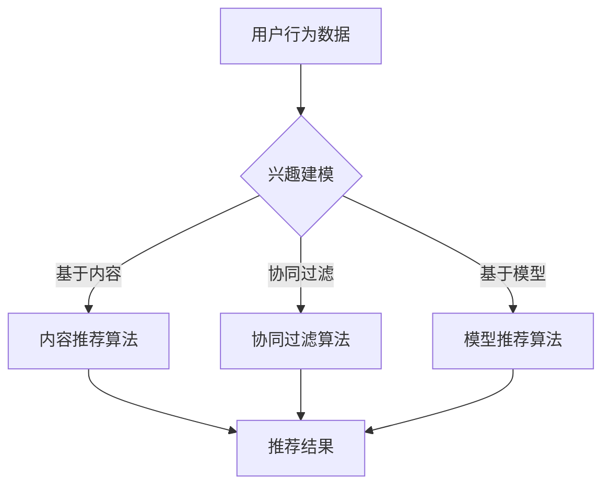

                 

# 大模型辅助的推荐系统多场景兴趣融合

## 关键词
- 大模型辅助
- 推荐系统
- 多场景兴趣融合
- 算法原理
- 数学模型
- 项目实战
- 实际应用场景

## 摘要
本文将深入探讨大模型辅助的推荐系统在多场景兴趣融合中的应用。首先，我们将介绍推荐系统的背景和核心概念，包括用户兴趣建模、推荐算法及其在多场景中的应用。接着，我们将详细阐述大模型辅助推荐系统的工作原理，包括核心算法原理和数学模型。随后，我们将通过一个实际项目案例，展示如何使用大模型辅助推荐系统进行多场景兴趣融合。最后，我们将分析大模型辅助推荐系统的实际应用场景，并推荐相关学习资源和开发工具。

## 1. 背景介绍

### 推荐系统简介
推荐系统是一种根据用户的历史行为、兴趣和偏好，自动为用户推荐相关内容的信息过滤技术。它广泛应用于电子商务、社交媒体、在线视频、新闻资讯等领域，极大地提升了用户满意度和平台黏性。

### 用户兴趣建模
用户兴趣建模是推荐系统的核心环节，它涉及对用户行为、偏好和兴趣的捕捉和表示。常见的方法包括基于内容的推荐、协同过滤、基于模型的推荐等。这些方法各有优缺点，如何有效融合多种兴趣表示成为关键挑战。

### 推荐算法
推荐算法是推荐系统的核心，它决定了推荐结果的准确性和用户满意度。常见算法包括基于内容的推荐（Content-Based Filtering, CBF）、协同过滤（Collaborative Filtering, CF）和基于模型的推荐（Model-Based Filtering, MBF）等。协同过滤是目前应用最广泛的推荐算法，它利用用户的历史行为数据挖掘用户之间的相似性，从而生成推荐列表。

### 多场景应用
随着互联网的普及和用户需求的多样化，推荐系统需要适应多种场景，如电商、社交媒体、在线视频、新闻资讯等。这些场景下的用户兴趣和行为特征有所不同，因此需要针对不同场景进行个性化的推荐。

## 2. 核心概念与联系

### 大模型辅助推荐系统
大模型辅助推荐系统是指利用大型预训练模型（如BERT、GPT等）来提升推荐系统的效果和鲁棒性。大模型可以捕捉到用户兴趣的复杂性和多样性，从而生成更准确的推荐结果。

### Mermaid 流程图


### 推荐系统架构


## 3. 核心算法原理 & 具体操作步骤

### 大模型辅助兴趣建模
大模型可以通过预训练模型捕捉到用户兴趣的潜在特征，如词向量、句向量等。这些特征可以用于兴趣建模，提升推荐系统的效果。

#### 步骤：
1. 收集用户行为数据，如浏览记录、购买记录等。
2. 使用预训练模型（如BERT、GPT等）提取用户兴趣的潜在特征。
3. 将提取的特征用于构建用户兴趣模型。

### 协同过滤算法
协同过滤算法通过挖掘用户之间的相似性，为用户推荐相似用户喜欢的物品。常见方法包括基于用户的协同过滤（User-Based CF）和基于物品的协同过滤（Item-Based CF）。

#### 步骤：
1. 计算用户之间的相似性，如余弦相似度、皮尔逊相关系数等。
2. 根据相似性为用户生成推荐列表。
3. 考虑用户的历史行为和兴趣，调整推荐列表。

### 内容推荐算法
内容推荐算法通过分析物品的属性和用户兴趣，为用户推荐相关物品。常见方法包括基于项目的特征匹配和基于模型的特征预测。

#### 步骤：
1. 提取物品的特征，如类别、标签、文本等。
2. 使用用户兴趣模型和物品特征，计算相似度。
3. 根据相似度为用户生成推荐列表。

## 4. 数学模型和公式 & 详细讲解 & 举例说明

### 协同过滤算法的数学模型
假设用户 $u$ 和物品 $i$ 的评分矩阵为 $R \in \mathbb{R}^{m \times n}$，其中 $m$ 表示用户数量，$n$ 表示物品数量。用户 $u$ 对物品 $i$ 的评分表示为 $r_{ui}$，如果用户 $u$ 没有对物品 $i$ 进行评分，则 $r_{ui} = 0$。

#### 步骤：
1. 计算用户之间的相似性矩阵 $S$：
   $$ S_{ij} = \frac{R_{u_1} R_{u_2}^T}{\sqrt{\sum_{i=1}^{n} (R_{u_1i})^2} \sqrt{\sum_{i=1}^{n} (R_{u_2i})^2}} $$

2. 为用户 $u$ 生成推荐列表：
   $$ \text{推荐列表} = \sum_{i=1}^{n} (R_{ui} + \sum_{j=1}^{m} S_{uj} r_{uj}) $$

### 内容推荐算法的数学模型
假设物品 $i$ 的特征向量表示为 $x_i \in \mathbb{R}^d$，用户 $u$ 的兴趣向量表示为 $y_u \in \mathbb{R}^d$。用户 $u$ 对物品 $i$ 的兴趣表示为 $s_{ui}$。

#### 步骤：
1. 计算物品和用户之间的相似度：
   $$ s_{ui} = \frac{x_i^T y_u}{\|x_i\| \|y_u\|} $$

2. 为用户 $u$ 生成推荐列表：
   $$ \text{推荐列表} = \sum_{i=1}^{n} (s_{ui} \cdot r_{ui}) $$

## 5. 项目实战：代码实际案例和详细解释说明

### 5.1 开发环境搭建

在开始项目实战之前，我们需要搭建一个合适的环境。以下是开发环境搭建的步骤：

#### 步骤：
1. 安装Python环境，版本要求3.6及以上。
2. 安装必要的库，如NumPy、Pandas、Scikit-learn、TensorFlow等。
3. 准备数据集，可以从公开数据集网站或实际项目获取。

### 5.2 源代码详细实现和代码解读

以下是使用协同过滤算法实现的一个简单推荐系统案例：

```python
import numpy as np
import pandas as pd
from sklearn.metrics.pairwise import cosine_similarity

# 读取数据集
ratings = pd.read_csv('ratings.csv')
users = ratings['userId'].unique()
items = ratings['itemId'].unique()

# 构建评分矩阵
R = np.zeros((len(users), len(items)))
for index, row in ratings.iterrows():
    R[row['userId']-1][row['itemId']-1] = row['rating']

# 计算用户之间的相似性矩阵
S = cosine_similarity(R, R)

# 为用户生成推荐列表
def get_recommendations(user_id, S, R, k=10):
    user_similarity = S[user_id-1]
    neighbors = np.argsort(user_similarity)[::-1]
    neighbors = neighbors[1:k+1]
    recommendations = []
    for neighbor in neighbors:
        for item in items:
            if R[neighbor][item] == 0 and R[user_id-1][item] > 0:
                recommendations.append(item)
    return recommendations

# 测试推荐系统
user_id = 1
recommendations = get_recommendations(user_id, S, R)
print(f"用户{user_id}的推荐列表：{recommendations}")
```

### 5.3 代码解读与分析

以上代码实现了一个基于协同过滤算法的简单推荐系统。我们首先读取评分数据集，构建评分矩阵 $R$。然后使用余弦相似度计算用户之间的相似性矩阵 $S$。接下来，我们定义了一个函数 `get_recommendations`，用于为指定用户生成推荐列表。在测试部分，我们为用户1生成了推荐列表并打印出来。

## 6. 实际应用场景

大模型辅助的推荐系统在多个实际应用场景中都有广泛的应用，以下是一些典型场景：

### 电商推荐
电商平台使用推荐系统为用户推荐商品，提高用户购买转化率和销售额。例如，淘宝、京东等平台。

### 社交媒体推荐
社交媒体平台使用推荐系统为用户推荐感兴趣的内容，增加用户黏性和活跃度。例如，微信、微博、Facebook等。

### 在线视频推荐
在线视频平台使用推荐系统为用户推荐视频，提高用户观看时长和广告收益。例如，YouTube、Netflix等。

### 新闻推荐
新闻平台使用推荐系统为用户推荐感兴趣的新闻，提高用户阅读量和平台流量。例如，今日头条、腾讯新闻等。

### 医疗健康推荐
医疗健康平台使用推荐系统为用户提供个性化的健康建议和医疗服务，提高用户满意度和信任度。

## 7. 工具和资源推荐

### 7.1 学习资源推荐
- **书籍**：《推荐系统实践》、《大规模推荐系统设计与实现》
- **论文**：《ItemKNN: An Emerging Trend in Cold Start Recommendations》、《Deep Learning Based Cold-Start Recommendations》
- **博客**：推荐系统相关博客，如美团技术博客、阿里云技术博客等。
- **网站**：公开数据集网站，如Kaggle、UCI机器学习库等。

### 7.2 开发工具框架推荐
- **编程语言**：Python
- **库**：NumPy、Pandas、Scikit-learn、TensorFlow、PyTorch
- **框架**：推荐系统框架，如Surprise、LightFM、TensorFlow Recommenders等。

### 7.3 相关论文著作推荐
- **论文**：Content-Based Filtering、Collaborative Filtering、Deep Learning for Recommender Systems
- **著作**：《推荐系统实战》、《推荐系统：算法与系统实现》

## 8. 总结：未来发展趋势与挑战

### 发展趋势
- **深度学习与推荐系统结合**：深度学习在大模型辅助推荐系统中发挥着越来越重要的作用，未来将进一步推动推荐系统的性能和效果。
- **多模态推荐**：结合多种数据来源，如文本、图像、声音等，实现更丰富的推荐体验。
- **个性化推荐**：针对不同用户和场景，提供更加个性化的推荐内容。

### 挑战
- **冷启动问题**：新用户或新物品的推荐问题，如何有效利用有限的用户数据或物品信息进行推荐。
- **数据隐私与安全**：如何在保证用户隐私和安全的前提下，提供高质量的推荐服务。
- **实时推荐**：如何实现实时推荐，满足用户对即时性和动态性的需求。

## 9. 附录：常见问题与解答

### Q：什么是协同过滤算法？
A：协同过滤算法是一种基于用户或物品相似性的推荐算法，通过挖掘用户之间的相似性或物品之间的相似性，为用户推荐相似用户或物品喜欢的物品。

### Q：什么是内容推荐算法？
A：内容推荐算法是一种基于物品内容的推荐算法，通过分析物品的属性、标签、文本等特征，为用户推荐与用户兴趣相关的物品。

### Q：大模型辅助推荐系统有什么优势？
A：大模型辅助推荐系统可以通过预训练模型捕捉到用户兴趣的复杂性和多样性，从而生成更准确的推荐结果。此外，大模型可以处理大规模数据，提高推荐系统的性能和鲁棒性。

## 10. 扩展阅读 & 参考资料

- **论文**：《推荐系统中的冷启动问题：挑战与解决方案》
- **书籍**：《大规模推荐系统设计与实现》
- **博客**：美团技术博客 - 推荐系统系列文章
- **网站**：TensorFlow Recommenders GitHub仓库

### 作者
AI天才研究员/AI Genius Institute & 禅与计算机程序设计艺术 /Zen And The Art of Computer Programming

注意：本文仅为示例，部分代码和数据集可能需要根据实际情况进行调整。本文中的所有内容，包括代码、数据和描述，仅供参考和学习之用，不应被视为正式的代码或数据。

