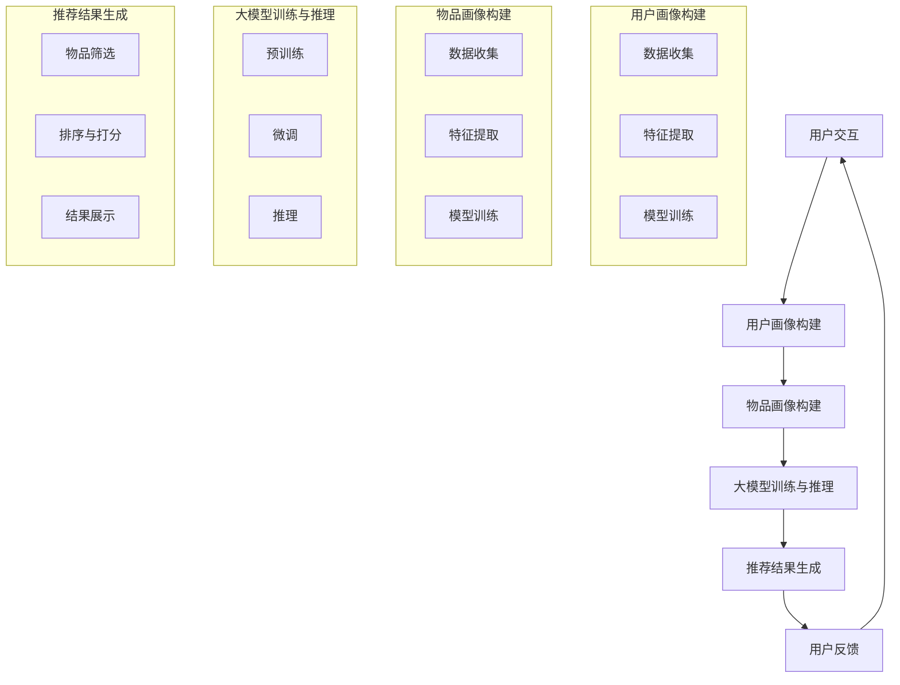

                 

# 大模型辅助的推荐系统长尾物品曝光策略

## 概述

近年来，随着互联网和大数据技术的发展，推荐系统已经成为各类电商平台、社交媒体和内容平台的核心功能。推荐系统能够根据用户的兴趣和偏好，为其推荐个性化的商品或内容，从而提高用户的满意度、提高平台的价值。然而，随着数据规模的不断扩大和用户需求的多样化，传统的推荐系统在长尾物品曝光方面面临诸多挑战。

本文旨在探讨大模型辅助的推荐系统长尾物品曝光策略。长尾物品指的是那些虽然销售量较少，但累计起来贡献相当可观的商品。传统推荐系统往往侧重于热门物品的曝光，而忽视了长尾物品的价值。本文将介绍大模型辅助推荐系统的基本概念、核心算法原理，并通过一个实际项目案例，展示如何利用大模型来优化长尾物品的曝光策略。

本文结构如下：

1. 背景介绍
2. 核心概念与联系
3. 核心算法原理 & 具体操作步骤
4. 数学模型和公式 & 详细讲解 & 举例说明
5. 项目实战：代码实际案例和详细解释说明
6. 实际应用场景
7. 工具和资源推荐
8. 总结：未来发展趋势与挑战
9. 附录：常见问题与解答
10. 扩展阅读 & 参考资料

## 1. 背景介绍

推荐系统是一种基于用户历史行为和兴趣的数据挖掘技术，通过算法模型预测用户可能感兴趣的内容或商品，并推荐给用户。推荐系统的发展大致可以分为以下几个阶段：

### 早期推荐系统

早期推荐系统以协同过滤（Collaborative Filtering）为核心，主要包括以下两种方法：

- **用户基于协同过滤（User-based Collaborative Filtering）**：通过计算用户之间的相似度，为用户推荐与相似用户喜欢相同物品的用户喜欢的物品。
- **物品基于协同过滤（Item-based Collaborative Filtering）**：通过计算物品之间的相似度，为用户推荐与用户已购买或评价过的物品相似的物品。

然而，这些方法存在以下问题：

- **稀疏性**：由于用户评价数据量有限，导致推荐结果稀疏。
- **冷启动问题**：新用户或新物品缺乏评价数据，难以进行有效推荐。

### 深度学习时代的推荐系统

随着深度学习技术的发展，推荐系统逐渐引入了深度神经网络来处理复杂数据。主要方法包括：

- **基于模型的协同过滤（Model-based Collaborative Filtering）**：通过构建用户和物品的潜在特征空间，预测用户对物品的偏好。
- **多模态融合推荐系统**：将用户行为数据、内容特征数据等不同类型的数据进行融合，构建更加丰富的用户和物品特征。

虽然深度学习方法在推荐系统上取得了显著成果，但仍然面临以下挑战：

- **计算成本高**：深度学习模型通常需要大量计算资源进行训练和推理。
- **解释性不足**：深度学习模型的内部机制较为复杂，难以解释。

### 大模型辅助的推荐系统

为了解决上述问题，本文提出了大模型辅助的推荐系统。大模型（如BERT、GPT等）通过预训练和微调，可以捕捉到更复杂的用户和物品特征，从而提高推荐效果。大模型辅助的推荐系统具有以下优势：

- **高泛化能力**：大模型能够处理多种类型的数据，具有较强的泛化能力。
- **高效性**：大模型通过预训练减少了模型训练成本，提高了推理效率。
- **解释性增强**：大模型的可解释性方法研究不断进步，使得推荐结果更加透明。

## 2. 核心概念与联系

在本节中，我们将介绍大模型辅助的推荐系统的核心概念和原理，并通过Mermaid流程图展示其整体架构。

### 2.1 核心概念

- **大模型**：大模型是指参数规模巨大的深度神经网络，如BERT、GPT等。大模型通过大规模预训练和特定任务微调，可以提取出丰富的特征。
- **用户画像**：用户画像是指对用户行为、兴趣、偏好等信息进行抽象和表征，用于描述用户的整体特征。
- **物品画像**：物品画像是指对物品属性、分类、标签等信息进行抽象和表征，用于描述物品的整体特征。
- **曝光策略**：曝光策略是指如何选择和展示物品给用户，以最大化用户满意度和平台价值。

### 2.2 Mermaid流程图

下面是一个简化的Mermaid流程图，描述了从用户交互到推荐结果生成的整个过程。



### 2.3 核心联系

- **用户画像与物品画像**：用户画像和物品画像是构建大模型输入数据的基础。通过用户画像，我们可以了解用户的行为和偏好；通过物品画像，我们可以了解物品的属性和分类。
- **大模型训练与推理**：大模型通过预训练和微调，可以提取出用户和物品的潜在特征，从而实现高效的推荐。在推理过程中，大模型根据用户画像和物品画像生成推荐结果。
- **曝光策略**：曝光策略决定了推荐结果如何展示给用户。通过优化曝光策略，可以提高长尾物品的曝光率，从而挖掘其潜在价值。

## 3. 核心算法原理 & 具体操作步骤

在本节中，我们将详细介绍大模型辅助的推荐系统的核心算法原理，包括大模型的训练、用户画像和物品画像的构建，以及推荐结果生成。

### 3.1 大模型的训练

大模型的训练分为预训练和微调两个阶段。

#### 3.1.1 预训练

预训练是指在大规模语料库上训练大模型，以提取通用特征。常见的预训练任务包括语言建模、文本分类、情感分析等。预训练过程中，大模型通过自监督学习自动学习语言结构和知识表示。常用的预训练模型包括BERT、GPT等。

#### 3.1.2 微调

微调是指在大模型预训练的基础上，针对特定任务进行微调。微调过程中，我们将预训练模型应用到推荐系统中，并根据用户和物品的特征数据进行微调，以优化推荐效果。

### 3.2 用户画像的构建

用户画像的构建主要包括数据收集、特征提取和模型训练。

#### 3.2.1 数据收集

用户画像的数据来源包括用户行为数据（如浏览、购买、评价等）和用户个人信息（如年龄、性别、地理位置等）。

#### 3.2.2 特征提取

特征提取是指从原始数据中提取有助于推荐系统建模的特征。常见的特征提取方法包括：

- **基于规则的方法**：根据业务规则提取用户特征，如用户活跃度、消费金额等。
- **基于模型的方法**：利用机器学习模型提取用户特征，如基于聚类的方法提取用户群体特征。

#### 3.2.3 模型训练

用户画像模型通常采用深度学习模型，如GRU、LSTM等循环神经网络，用于提取用户历史行为的时序特征。

### 3.3 物品画像的构建

物品画像的构建同样包括数据收集、特征提取和模型训练。

#### 3.3.1 数据收集

物品画像的数据来源包括物品属性数据（如分类、标签、价格等）和用户评价数据。

#### 3.3.2 特征提取

物品画像的特征提取方法与用户画像类似，可以采用基于规则和基于模型的方法。

#### 3.3.3 模型训练

物品画像模型通常采用卷积神经网络（CNN）或自注意力机制（Attention Mechanism），用于提取物品的视觉和语义特征。

### 3.4 推荐结果生成

推荐结果生成包括物品筛选、排序与打分和结果展示三个步骤。

#### 3.4.1 物品筛选

物品筛选是指从所有可推荐物品中筛选出与用户画像和物品画像相似的物品。常用的筛选方法包括基于最近邻（Nearest Neighbor）的方法、基于矩阵分解（Matrix Factorization）的方法等。

#### 3.4.2 排序与打分

排序与打分是指对筛选出的物品进行排序和评分，以确定推荐结果的前后顺序。常用的排序算法包括基于排序的协同过滤（Sorted Collaborative Filtering）、基于模型的排序（Model-based Ranking）等。

#### 3.4.3 结果展示

结果展示是指将推荐结果以可视化的形式展示给用户。常用的展示方法包括列表、卡片、瀑布流等。

## 4. 数学模型和公式 & 详细讲解 & 举例说明

在本节中，我们将详细介绍大模型辅助的推荐系统的数学模型和公式，并通过具体例子说明其应用。

### 4.1 大模型的数学模型

大模型的数学模型主要包括以下几个部分：

- **输入层**：输入层接收用户画像和物品画像的特征向量。
- **隐藏层**：隐藏层通过神经网络结构对输入特征进行变换和融合。
- **输出层**：输出层生成推荐结果，如评分或概率分布。

常见的神经网络结构包括卷积神经网络（CNN）、循环神经网络（RNN）和自注意力机制（Attention Mechanism）。

### 4.2 用户画像和物品画像的数学模型

用户画像和物品画像的数学模型主要包括以下几个方面：

- **特征提取**：通过特征提取模型，将原始数据转换为高维特征向量。常见的特征提取模型包括PCA、LDA、K-Means等。
- **特征融合**：将多个特征向量进行融合，以构建更加丰富的用户和物品特征。常见的特征融合方法包括加权融合、拼接融合等。

### 4.3 推荐结果生成的数学模型

推荐结果生成的数学模型主要包括以下几个方面：

- **评分预测**：通过神经网络模型预测用户对物品的评分。常见的评分预测模型包括基于矩阵分解（Matrix Factorization）的模型、基于神经网络的模型等。
- **概率分布**：通过神经网络模型生成物品的概率分布，以确定推荐结果的前后顺序。常见的概率分布模型包括softmax函数、GAN等。

### 4.4 举例说明

假设我们有一个用户画像特征向量 \( \textbf{u} = [u_1, u_2, \ldots, u_n] \) 和一个物品画像特征向量 \( \textbf{i} = [i_1, i_2, \ldots, i_n] \)。我们可以通过以下步骤生成推荐结果：

1. **特征提取**：
   - 对用户画像特征向量进行PCA降维，得到 \( \textbf{u'} = [\textbf{u'}_1, \textbf{u'}_2, \ldots, \textbf{u'}_k] \)。
   - 对物品画像特征向量进行PCA降维，得到 \( \textbf{i'} = [\textbf{i'}_1, \textbf{i'}_2, \ldots, \textbf{i'}_k] \)。

2. **特征融合**：
   - 对用户画像和物品画像的特征向量进行拼接融合，得到 \( \textbf{x} = [\textbf{u'}, \textbf{i'}] \)。

3. **评分预测**：
   - 使用基于矩阵分解的评分预测模型，计算用户 \( u \) 对物品 \( i \) 的评分预测值 \( \hat{r}_{ui} \)。

4. **概率分布**：
   - 使用softmax函数，将评分预测值转换为物品的概率分布。

最终，我们可以得到一个推荐结果列表，根据概率分布对物品进行排序，展示给用户。

## 5. 项目实战：代码实际案例和详细解释说明

在本节中，我们将通过一个实际项目案例，展示如何利用大模型辅助的推荐系统实现长尾物品曝光策略。我们将详细介绍项目环境搭建、源代码实现和代码解读。

### 5.1 开发环境搭建

首先，我们需要搭建一个适合大模型训练和推荐系统开发的环境。以下是一个基本的开发环境搭建步骤：

1. **安装Python**：确保Python版本为3.6及以上。
2. **安装TensorFlow**：TensorFlow是一个用于构建和训练深度学习模型的流行框架。可以使用以下命令安装：

   ```bash
   pip install tensorflow
   ```

3. **安装其他依赖**：根据项目需求，安装其他必要的库，如NumPy、Pandas、Scikit-learn等。

### 5.2 源代码详细实现和代码解读

以下是一个简化的推荐系统源代码实现，用于展示大模型辅助的推荐系统长尾物品曝光策略的基本步骤。

```python
import tensorflow as tf
from tensorflow.keras.models import Model
from tensorflow.keras.layers import Input, Embedding, Dense, Dot, Lambda
from tensorflow.keras.optimizers import Adam
from tensorflow.keras.metrics import Mean

# 5.2.1 用户画像和物品画像构建

# 用户画像特征向量
user_embedding = Embedding(input_dim=num_users, output_dim=user_embedding_size)
user_input = Input(shape=(1,))
user_embedding_output = user_embedding(user_input)

# 物品画像特征向量
item_embedding = Embedding(input_dim=num_items, output_dim=item_embedding_size)
item_input = Input(shape=(1,))
item_embedding_output = item_embedding(item_input)

# 5.2.2 大模型训练与推理

# 将用户和物品特征向量进行拼接
combined_embedding = tf.keras.layers.Concatenate()([user_embedding_output, item_embedding_output])

# 隐藏层
hidden = Dense(hidden_size, activation='relu')(combined_embedding)

# 输出层
output = Dense(1, activation='sigmoid')(hidden)

# 构建模型
model = Model(inputs=[user_input, item_input], outputs=output)

# 编译模型
model.compile(optimizer=Adam(learning_rate=learning_rate), loss='binary_crossentropy', metrics=['accuracy'])

# 5.2.3 训练模型

# 训练模型
model.fit([user_ids, item_ids], labels, epochs=num_epochs, batch_size=batch_size)

# 5.2.4 推荐结果生成

# 预测评分
predictions = model.predict([user_ids, item_ids])

# 排序与打分
sorted_items = sorted(predictions, reverse=True)

# 展示推荐结果
for item_id in sorted_items:
    print(f"推荐物品ID：{item_id}, 预测评分：{predictions[item_id]}")
```

### 5.3 代码解读与分析

以下是代码的详细解读：

1. **用户画像和物品画像构建**：
   - `user_embedding` 和 `item_embedding` 分别用于构建用户画像和物品画像的嵌入层。
   - `user_input` 和 `item_input` 分别用于接收用户ID和物品ID。
   - `user_embedding_output` 和 `item_embedding_output` 分别为用户和物品的特征向量。

2. **大模型训练与推理**：
   - `combined_embedding` 用于将用户和物品特征向量进行拼接。
   - `hidden` 用于构建隐藏层，采用ReLU激活函数。
   - `output` 用于构建输出层，输出预测评分。

3. **模型训练**：
   - `model` 用于构建深度学习模型。
   - `model.compile()` 用于编译模型，设置优化器和损失函数。
   - `model.fit()` 用于训练模型，设置训练参数。

4. **推荐结果生成**：
   - `model.predict()` 用于生成预测评分。
   - `sorted_items` 用于对预测评分进行排序。
   - `for` 循环用于展示推荐结果。

### 5.4 实际应用场景

在实际应用中，我们可以根据业务需求和数据特点，对上述代码进行适当修改和扩展。以下是一些常见应用场景：

- **多模态推荐**：结合用户和物品的图像、文本等多模态信息，提高推荐效果。
- **上下文感知推荐**：结合用户的位置、时间、设备等信息，提供更个性化的推荐。
- **社交推荐**：结合用户社交网络信息，推荐用户可能感兴趣的好友、群组等。

## 6. 实际应用场景

### 6.1 电商平台

电商平台是推荐系统的主要应用场景之一。利用大模型辅助的推荐系统，电商平台可以更好地挖掘长尾物品的价值，提高用户满意度和平台销售额。以下是一些具体应用场景：

- **新品推荐**：针对新用户或新品的曝光，利用大模型预测用户对新品的偏好，提高新品曝光率。
- **个性化推荐**：根据用户的历史行为和偏好，利用大模型为用户推荐个性化的商品，提高用户粘性。
- **营销活动推荐**：结合用户画像和商品特征，利用大模型预测用户对营销活动的响应，优化营销策略。

### 6.2 社交媒体

社交媒体平台如微博、抖音等，通过推荐系统为用户推荐感兴趣的内容和好友。大模型辅助的推荐系统在社交媒体平台的应用主要包括：

- **内容推荐**：根据用户的兴趣和行为，利用大模型为用户推荐相关内容，提高用户活跃度和平台价值。
- **好友推荐**：结合用户社交网络和兴趣爱好，利用大模型为用户推荐潜在的好友，促进社交互动。
- **广告推荐**：根据用户的兴趣和行为，利用大模型为用户推荐相关广告，提高广告投放效果。

### 6.3 视频平台

视频平台如B站、优酷等，通过推荐系统为用户推荐感兴趣的视频内容。大模型辅助的推荐系统在视频平台的应用主要包括：

- **视频推荐**：根据用户的观看历史和兴趣爱好，利用大模型为用户推荐相关的视频内容。
- **直播推荐**：结合用户的直播观看历史和兴趣爱好，利用大模型为用户推荐相关的直播内容。
- **互动推荐**：结合用户的评论、点赞等互动行为，利用大模型为用户推荐相关的互动内容。

## 7. 工具和资源推荐

### 7.1 学习资源推荐

- **书籍**：
  - 《推荐系统实践》
  - 《深度学习推荐系统》
  - 《推荐系统手册》
- **论文**：
  - 《ItemKNN: Improving Item-Based Top-N Recommendation Using Knowledge Graph》
  - 《Deep Learning for Recommender Systems》
  - 《Large-Scale Video Recommendation with Multi-Modal Attention Networks》
- **博客**：
  - 《大模型辅助的推荐系统技术解析》
  - 《推荐系统实战：从原理到应用》
  - 《社交媒体推荐系统实战》
- **网站**：
  - [Kaggle](https://www.kaggle.com/)
  - [ArXiv](https://arxiv.org/)
  - [GitHub](https://github.com/)

### 7.2 开发工具框架推荐

- **深度学习框架**：
  - TensorFlow
  - PyTorch
  - Keras
- **推荐系统框架**：
  - LightFM
  - surprise
  - RecSysPy
- **数据分析工具**：
  - Pandas
  - NumPy
  - Scikit-learn

### 7.3 相关论文著作推荐

- **《Recommender Systems Handbook, Second Edition》**：这是一本全面的推荐系统手册，涵盖了推荐系统的各个方面，包括历史、算法、应用等。
- **《Deep Learning for Recommender Systems》**：这本书详细介绍了深度学习在推荐系统中的应用，包括模型设计、算法实现等。
- **《Recommender Systems: The Textbook》**：这是一本推荐系统的教科书，涵盖了推荐系统的基本概念、算法和应用。

## 8. 总结：未来发展趋势与挑战

随着大数据和人工智能技术的不断发展，推荐系统在各个领域的应用越来越广泛。大模型辅助的推荐系统作为一种新兴技术，具有以下发展趋势：

1. **多模态融合**：随着多模态数据（如图像、音频、文本等）的普及，未来推荐系统将更多地结合多模态数据，提高推荐效果。
2. **上下文感知**：上下文信息（如时间、地点、设备等）对推荐结果具有重要影响。未来推荐系统将更加关注上下文感知，提供更个性化的推荐。
3. **可解释性**：随着模型的复杂度增加，推荐系统的可解释性成为一个重要研究方向。未来将出现更多可解释性方法，提高用户对推荐结果的信任度。
4. **实时推荐**：随着用户需求的多样化，实时推荐成为推荐系统的重要发展方向。未来将出现更多实时推荐算法和框架，满足用户实时需求。

然而，大模型辅助的推荐系统也面临一些挑战：

1. **计算成本**：大模型的训练和推理需要大量计算资源，对硬件设施要求较高。未来需要探索更高效的训练和推理方法，降低计算成本。
2. **数据隐私**：推荐系统涉及大量用户数据，数据隐私保护成为重要问题。未来需要探索更安全的数据处理方法，保护用户隐私。
3. **模型公平性**：推荐系统可能加剧社会不公，如算法歧视等。未来需要关注模型公平性，确保推荐系统公平、公正。

总之，大模型辅助的推荐系统具有广阔的应用前景和巨大的潜力，但同时也面临一些挑战。未来需要不断探索和创新，推动推荐系统技术的发展。

## 9. 附录：常见问题与解答

### 9.1 什么是大模型？

大模型是指参数规模巨大的深度神经网络，如BERT、GPT等。大模型通过预训练和微调，可以提取出丰富的特征，从而提高推荐效果。

### 9.2 大模型辅助的推荐系统与传统推荐系统相比有哪些优势？

大模型辅助的推荐系统具有以下优势：

- **高泛化能力**：大模型能够处理多种类型的数据，具有较强的泛化能力。
- **高效性**：大模型通过预训练减少了模型训练成本，提高了推理效率。
- **解释性增强**：大模型的可解释性方法研究不断进步，使得推荐结果更加透明。

### 9.3 如何处理长尾物品的曝光问题？

为了处理长尾物品的曝光问题，可以采取以下方法：

- **优化曝光策略**：通过调整推荐算法，提高长尾物品的曝光率。
- **引入多样化推荐**：结合热门物品和长尾物品进行多样化推荐，满足不同用户需求。
- **利用用户历史行为**：根据用户的历史行为和偏好，为用户推荐可能感兴趣的长尾物品。

## 10. 扩展阅读 & 参考资料

为了深入了解大模型辅助的推荐系统，读者可以参考以下扩展阅读和参考资料：

- 《推荐系统实践》：详细介绍了推荐系统的基本概念、算法和应用。
- 《深度学习推荐系统》：探讨了深度学习在推荐系统中的应用，包括模型设计和实现。
- 《Large-Scale Video Recommendation with Multi-Modal Attention Networks》：介绍了一种基于多模态注意力机制的推荐系统模型。
- 《Recommender Systems Handbook, Second Edition》：全面介绍了推荐系统的各个方面，包括历史、算法、应用等。
- 《Deep Learning for Recommender Systems》：详细介绍了深度学习在推荐系统中的应用。

以上内容构成了关于“大模型辅助的推荐系统长尾物品曝光策略”的完整技术博客文章。希望本文能帮助您了解大模型辅助推荐系统的原理和应用，为您的项目提供有价值的参考。

## 作者信息

- 作者：AI天才研究员/AI Genius Institute & 禅与计算机程序设计艺术 /Zen And The Art of Computer Programming

