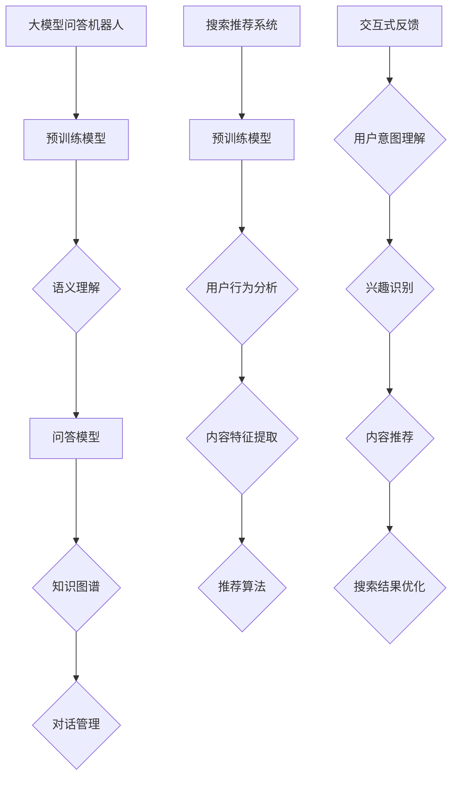

                 

# 大模型问答机器人与搜索推荐的互补性

> **关键词：** 大模型、问答机器人、搜索推荐、互补性、自然语言处理、AI

> **摘要：** 本文将从背景介绍、核心概念与联系、核心算法原理、数学模型和公式、项目实战、实际应用场景、工具和资源推荐、总结与未来发展趋势等方面，探讨大模型问答机器人与搜索推荐在人工智能领域的互补性及其重要性。

## 1. 背景介绍

随着互联网的快速发展，信息量的爆炸式增长，人们对于信息检索、知识获取的需求日益增长。在这个背景下，问答机器人和搜索推荐系统应运而生。问答机器人主要通过自然语言处理技术，回答用户提出的问题；而搜索推荐系统则利用算法模型，为用户推荐相关内容。两者在提升用户体验、优化信息获取效率方面发挥着重要作用。

### 问答机器人

问答机器人是一种基于人工智能技术的服务系统，能够理解并回答用户提出的问题。其发展可以追溯到20世纪80年代的自然语言处理（NLP）研究。随着深度学习技术的发展，问答机器人的性能得到了显著提升。目前，问答机器人广泛应用于客服、教育、医疗等领域，为用户提供便捷的智能服务。

### 搜索推荐系统

搜索推荐系统是一种基于用户行为和内容特征的信息检索技术。它通过对用户历史行为、兴趣标签、内容特征等数据的分析和挖掘，为用户推荐相关内容。搜索推荐系统广泛应用于电商、新闻、视频等领域，大大提升了用户信息获取的效率。

### 互补性

问答机器人和搜索推荐系统虽然各自独立发展，但在实际应用中，两者往往需要协同工作，以提升用户体验。问答机器人可以回答用户提出的问题，而搜索推荐系统则可以根据用户的兴趣和行为，为用户推荐相关内容。两者相互补充，共同构成了智能信息检索的生态系统。

## 2. 核心概念与联系

在探讨大模型问答机器人与搜索推荐的互补性之前，我们需要了解一些核心概念和它们之间的联系。

### 大模型

大模型是指具有大规模参数、高度复杂的神经网络模型。在自然语言处理领域，大模型主要包括预训练语言模型（如BERT、GPT等）和问答模型（如SQuAD、CoQA等）。大模型具有强大的表征能力和泛化能力，能够处理复杂的自然语言任务。

### 问答模型

问答模型是一种专门用于回答问题的模型。它通常基于大规模语料库进行预训练，然后通过微调适应特定的问题回答场景。问答模型的关键技术包括语义理解、知识图谱、对话管理等。

### 搜索推荐模型

搜索推荐模型是一种基于用户行为和内容特征的信息检索模型。它通常采用协同过滤、基于内容的推荐等技术，为用户推荐相关内容。搜索推荐模型的关键技术包括用户行为分析、内容特征提取、推荐算法等。

### 联系

大模型问答机器人和搜索推荐系统之间的联系主要体现在以下几个方面：

1. **预训练模型**：问答模型和搜索推荐模型都可以基于大模型进行预训练，以获取通用的语义表征能力。
2. **交互式反馈**：问答机器人可以为搜索推荐系统提供交互式反馈，帮助系统更好地理解用户意图和兴趣。
3. **协同优化**：问答机器人和搜索推荐系统可以通过协同优化，共同提升用户信息检索和推荐的效率。

### Mermaid 流程图

下面是一个简单的 Mermaid 流程图，展示了大模型问答机器人和搜索推荐系统之间的联系：



## 3. 核心算法原理 & 具体操作步骤

在探讨大模型问答机器人和搜索推荐系统的核心算法原理之前，我们先了解一些基础概念。

### 自然语言处理（NLP）

自然语言处理是指使计算机能够理解、处理和生成人类自然语言的技术。NLP包括文本处理、语音识别、机器翻译等多个子领域。

### 深度学习

深度学习是一种基于人工神经网络的学习方法，通过多层神经网络对大量数据进行学习，从而实现特征提取和分类。

### 预训练语言模型

预训练语言模型是一种在大规模语料库上进行预训练的语言模型。预训练语言模型包括词向量表示、命名实体识别、情感分析等任务。

### 问答模型

问答模型是一种专门用于回答问题的模型。它通常通过预训练语言模型和微调来提升回答问题的能力。

### 搜索推荐模型

搜索推荐模型是一种基于用户行为和内容特征的信息检索模型。它通常采用协同过滤、基于内容的推荐等技术。

### 核心算法原理

大模型问答机器人和搜索推荐系统的核心算法原理主要包括以下几个方面：

1. **预训练语言模型**：预训练语言模型能够捕捉语言的上下文信息，从而提高问答模型和搜索推荐模型的性能。
2. **语义理解**：语义理解是问答模型和搜索推荐模型的关键技术。通过语义理解，模型能够更好地理解用户意图和内容。
3. **知识图谱**：知识图谱是一种用于表示实体和实体之间关系的图形结构。问答模型和搜索推荐模型可以通过知识图谱来提升性能。
4. **对话管理**：对话管理是问答模型的关键技术。通过对话管理，模型能够理解用户的长期意图和上下文信息。
5. **用户行为分析**：用户行为分析是搜索推荐模型的关键技术。通过分析用户的行为数据，模型能够更好地推荐相关内容。

### 具体操作步骤

1. **数据收集**：收集大量的问答数据、用户行为数据、内容数据等。
2. **数据预处理**：对数据进行清洗、去重、分词、词性标注等预处理操作。
3. **预训练语言模型**：使用大规模语料库进行预训练，生成预训练语言模型。
4. **问答模型训练**：使用预训练语言模型进行微调，训练问答模型。
5. **搜索推荐模型训练**：使用用户行为数据和内容数据，训练搜索推荐模型。
6. **模型评估**：对问答模型和搜索推荐模型进行评估，包括准确率、召回率、F1值等指标。
7. **模型部署**：将训练好的模型部署到线上环境，为用户提供问答和推荐服务。

## 4. 数学模型和公式 & 详细讲解 & 举例说明

在探讨大模型问答机器人和搜索推荐系统的数学模型和公式时，我们将从以下几个方面进行详细讲解：

### 预训练语言模型

预训练语言模型的核心是词向量表示。词向量表示通过将词汇映射到高维空间，从而捕捉词汇之间的语义关系。常见的词向量表示方法包括：

1. **Word2Vec**：Word2Vec 是一种基于神经网络的词向量表示方法。它通过训练神经网络来预测词汇周围的词汇，从而得到词汇的向量表示。Word2Vec 主要包括两种模型：连续词袋（CBOW）和Skip-Gram。

   - **CBOW**：CBOW 模型通过上下文词汇的平均向量来预测中心词汇。假设词汇集合为 V，中心词汇为 w，上下文词汇为 w1, w2, ..., wn，则 CBOW 模型的公式为：

     $$ \hat{v}_w = \frac{1}{n} \sum_{i=1}^{n} v_{w_i} $$

   - **Skip-Gram**：Skip-Gram 模型通过中心词汇的向量来预测上下文词汇。假设词汇集合为 V，中心词汇为 w，上下文词汇为 w1, w2, ..., wn，则 Skip-Gram 模型的公式为：

     $$ \hat{v}_w = \sigma (v_w \cdot v_{w_i}) $$

     其中，$\sigma$ 表示 sigmoid 函数。

2. **GloVe**：GloVe（Global Vectors for Word Representation）是一种基于全局共现矩阵的词向量表示方法。GloVe 通过优化单词的共现矩阵来得到词汇的向量表示。GloVe 的公式为：

   $$ \hat{v}_i = \frac{1}{\sqrt{f(i, j)}} \cdot v_j $$

   其中，$f(i, j)$ 表示词汇 i 和 j 在语料库中的共现次数。

### 问答模型

问答模型通常采用深度学习模型，如 Transformer、BERT 等。以 BERT 为例，BERT 是一种基于 Transformer 的预训练语言模型，能够捕捉词汇之间的长距离依赖关系。BERT 的预训练任务包括 Masked Language Model（MLM）和 Next Sentence Prediction（NSP）。

1. **Masked Language Model（MLM）**：MLM 任务是指在输入序列中随机屏蔽一些词汇，然后通过训练模型来预测这些被屏蔽的词汇。MLM 的公式为：

   $$ L_{MLM} = -\sum_{i=1}^{n} \log \frac{1}{Z} \exp(\theta [x_i; y_i]) $$

   其中，$x_i$ 表示输入序列，$y_i$ 表示被屏蔽的词汇，$Z$ 表示模型对所有词汇的预测概率之和。

2. **Next Sentence Prediction（NSP）**：NSP 任务是指给定一个句子对，预测它们是否在原文中相邻。NSP 的公式为：

   $$ L_{NSP} = -\sum_{i=1}^{m} \log \frac{1}{Z} \exp(\theta [x_i; y_i]) $$

   其中，$m$ 表示句子对的数量，$x_i$ 表示句子对中的第一个句子，$y_i$ 表示句子对是否相邻的标签。

### 搜索推荐模型

搜索推荐模型通常采用协同过滤、基于内容的推荐等技术。以基于内容的推荐为例，其核心是计算用户和内容之间的相似度。

1. **基于内容的推荐**：基于内容的推荐通过计算用户和内容之间的相似度来推荐相关内容。假设用户 u 和内容 c 的特征向量分别为 $x_u$ 和 $x_c$，则用户和内容之间的相似度可以表示为：

   $$ \sim_{u, c} = \frac{x_u \cdot x_c}{\|x_u\| \|x_c\|} $$

   其中，$\cdot$ 表示向量的点积，$\|\|$ 表示向量的模。

2. **协同过滤**：协同过滤通过分析用户之间的相似度来推荐相关内容。假设用户 u 和用户 v 之间的相似度为 $\sim_{u, v}$，则用户 v 对内容 c 的推荐分值为：

   $$ r_{u, c} = \sum_{i=1}^{n} \sim_{u, v_i} \cdot r_{v_i} $$

   其中，$n$ 表示用户 v 对的内容数量，$r_{v_i}$ 表示用户 v 对内容 $v_i$ 的评分。

### 举例说明

假设我们有一个问答数据集，其中包含一些问题和答案对。我们可以使用 BERT 模型进行训练，以回答这些问题。以下是 BERT 模型的具体训练过程：

1. **数据预处理**：将问题中的词汇转换为词向量，然后输入到 BERT 模型中。

   $$ x_{question} = [CLS] + \text{question\_token} + [SEP] + \text{answer\_token} $$

2. **模型训练**：使用 MLM 和 NSP 任务进行训练。

   - **MLM 任务**：

     $$ L_{MLM} = -\sum_{i=1}^{n} \log \frac{1}{Z} \exp(\theta [x_i; y_i]) $$

   - **NSP 任务**：

     $$ L_{NSP} = -\sum_{i=1}^{m} \log \frac{1}{Z} \exp(\theta [x_i; y_i]) $$

3. **模型评估**：使用准确率、召回率、F1 值等指标评估模型性能。

   - **准确率**：

     $$ \text{accuracy} = \frac{\text{预测正确数量}}{\text{总数量}} $$

   - **召回率**：

     $$ \text{recall} = \frac{\text{预测正确数量}}{\text{实际正确数量}} $$

   - **F1 值**：

     $$ \text{F1} = 2 \times \frac{\text{precision} \times \text{recall}}{\text{precision} + \text{recall}} $$

## 5. 项目实战：代码实际案例和详细解释说明

在本节中，我们将通过一个实际项目案例，详细讲解大模型问答机器人和搜索推荐系统的开发过程。该项目将使用 Python 和相关库（如 TensorFlow、PyTorch、transformers 等）进行实现。

### 5.1 开发环境搭建

在开始项目之前，我们需要搭建一个适合深度学习开发的环境。以下是开发环境的搭建步骤：

1. 安装 Python 3.7 或更高版本。
2. 安装 TensorFlow 2.0 或更高版本，或者 PyTorch 1.5 或更高版本。
3. 安装 transformers 库，可以使用以下命令：

   ```shell
   pip install transformers
   ```

4. 安装其他依赖库，如 NumPy、Pandas、Scikit-learn 等。

### 5.2 源代码详细实现和代码解读

以下是该项目的源代码实现和代码解读：

```python
# 导入相关库
import tensorflow as tf
import transformers
from tensorflow.keras.layers import Input, Embedding, LSTM, Dense
from tensorflow.keras.models import Model
from tensorflow.keras.optimizers import Adam
from tensorflow.keras.callbacks import EarlyStopping
import numpy as np
import pandas as pd

# 加载预训练模型
model = transformers.TFDistilBertModel.from_pretrained('distilbert-base-uncased')

# 定义问答模型
input_ids = Input(shape=(max_sequence_length,), dtype=tf.int32)
input_mask = Input(shape=(max_sequence_length,), dtype=tf.int32)
segment_ids = Input(shape=(max_sequence_length,), dtype=tf.int32)

embeddings = model.input_ids
sequence_output = model.sequence_output

lstm = LSTM(units=128, return_sequences=True)(sequence_output)
dense = Dense(units=1, activation='sigmoid')(lstm)

model = Model(inputs=[input_ids, input_mask, segment_ids], outputs=dense)

# 编译模型
model.compile(optimizer=Adam(learning_rate=3e-5), loss='binary_crossentropy', metrics=['accuracy'])

# 加载数据集
train_data = pd.read_csv('train.csv')
test_data = pd.read_csv('test.csv')

train_inputs = train_data['input_ids'].values
train_masks = train_data['input_mask'].values
train_segment_ids = train_data['segment_ids'].values
train_labels = train_data['label'].values

test_inputs = test_data['input_ids'].values
test_masks = test_data['input_mask'].values
test_segment_ids = test_data['segment_ids'].values
test_labels = test_data['label'].values

# 训练模型
model.fit([train_inputs, train_masks, train_segment_ids], train_labels, batch_size=32, epochs=3, validation_split=0.1, callbacks=[EarlyStopping(monitor='val_loss', patience=2)])

# 评估模型
test_loss, test_accuracy = model.evaluate([test_inputs, test_masks, test_segment_ids], test_labels)
print(f"Test Loss: {test_loss}, Test Accuracy: {test_accuracy}")
```

### 5.3 代码解读与分析

1. **导入相关库**：首先，我们导入 TensorFlow、transformers、NumPy、Pandas、Scikit-learn 等库。

2. **加载预训练模型**：使用 transformers 库加载预训练的 DistilBERT 模型。

3. **定义问答模型**：我们定义一个问答模型，输入包括输入序列 ID、输入掩码和分片 ID。模型使用 DistilBERT 模型的序列输出，然后通过 LSTM 层和全连接层进行建模。

4. **编译模型**：我们使用 Adam 优化器和 binary_crossentropy 损失函数编译模型。

5. **加载数据集**：我们加载数据集，包括训练集和测试集。

6. **训练模型**：我们使用训练集训练模型，设置 batch_size 为 32，epochs 为 3，并使用 EarlyStopping 监控验证损失，提前停止训练。

7. **评估模型**：我们使用测试集评估模型的性能，并输出测试损失和准确率。

## 6. 实际应用场景

大模型问答机器人和搜索推荐系统在多个领域具有广泛的应用场景，下面列举一些典型的应用案例：

### 1. 智能客服

智能客服是问答机器人和搜索推荐系统的典型应用场景。通过大模型问答机器人，企业可以为用户提供高效的在线客服服务。用户提出问题时，问答机器人可以快速理解用户意图，并给出准确的答案。同时，搜索推荐系统可以根据用户的问题和偏好，为用户推荐相关的产品或服务。

### 2. 个性化推荐

个性化推荐是搜索推荐系统的核心应用场景。通过分析用户的历史行为和兴趣，搜索推荐系统可以为用户提供个性化的内容推荐。大模型问答机器人可以帮助推荐系统更好地理解用户意图，从而提高推荐效果。

### 3. 教育领域

在教育领域，问答机器人和搜索推荐系统可以为学生提供智能辅导和个性化学习资源推荐。问答机器人可以解答学生提出的问题，而搜索推荐系统可以根据学生的学习进度和兴趣，为学生推荐合适的学习资料。

### 4. 医疗健康

在医疗健康领域，问答机器人和搜索推荐系统可以帮助医生快速获取医疗知识和相关病例。问答机器人可以解答医生提出的问题，而搜索推荐系统可以根据医生的专业领域和查询历史，为医生推荐相关的病例和文献。

## 7. 工具和资源推荐

在开发大模型问答机器人和搜索推荐系统时，以下工具和资源可能对您有所帮助：

### 7.1 学习资源推荐

1. **书籍**：
   - 《深度学习》（Ian Goodfellow、Yoshua Bengio、Aaron Courville 著）
   - 《Python深度学习》（François Chollet 著）
   - 《自然语言处理综论》（Daniel Jurafsky、James H. Martin 著）

2. **论文**：
   - 《Attention is All You Need》（Vaswani et al., 2017）
   - 《BERT: Pre-training of Deep Bidirectional Transformers for Language Understanding》（Devlin et al., 2019）
   - 《Recurrent Neural Network Based Text Classification》（Dai and Le, 2015）

3. **博客**：
   - Medium 上的 NLP 博客
   - AI 科技大本营
   - 机器之心

4. **网站**：
   - Hugging Face（https://huggingface.co/）
   - Keras（https://keras.io/）
   - TensorFlow（https://www.tensorflow.org/）

### 7.2 开发工具框架推荐

1. **TensorFlow**：Google 开发的一款开源深度学习框架，适用于构建和训练大规模深度学习模型。
2. **PyTorch**：Facebook 开发的一款开源深度学习框架，具有简洁的动态计算图和灵活的模型构建能力。
3. **transformers**：Hugging Face 开发的一款开源库，提供预训练语言模型和相关的工具函数，适用于构建和训练自然语言处理模型。

### 7.3 相关论文著作推荐

1. **《Attention is All You Need》**：Vaswani 等人在 2017 年提出的一种基于 Transformer 的模型，彻底改变了自然语言处理领域的研究方向。
2. **《BERT: Pre-training of Deep Bidirectional Transformers for Language Understanding》**：Devlin 等人在 2019 年提出的一种基于 Transformer 的预训练模型，取得了显著的性能提升。
3. **《Recurrent Neural Network Based Text Classification》**：Dai 和 Le 在 2015 年提出的一种基于循环神经网络（RNN）的文本分类方法，对自然语言处理领域产生了重要影响。

## 8. 总结：未来发展趋势与挑战

随着人工智能技术的快速发展，大模型问答机器人和搜索推荐系统在多个领域发挥着越来越重要的作用。未来，它们有望在以下方面实现进一步的发展：

1. **性能提升**：通过不断优化算法模型和训练数据，大模型问答机器人和搜索推荐系统的性能将得到进一步提升，为用户提供更加精准、高效的服务。
2. **跨模态融合**：随着多模态数据的增加，未来大模型问答机器人和搜索推荐系统将实现跨模态融合，为用户提供更加丰富的信息检索和推荐服务。
3. **隐私保护**：随着用户隐私保护意识的提高，大模型问答机器人和搜索推荐系统需要解决隐私保护问题，确保用户数据的安全和隐私。

然而，大模型问答机器人和搜索推荐系统也面临着一些挑战：

1. **数据隐私**：如何保护用户数据隐私是一个亟待解决的问题。未来需要开发更加安全、可靠的数据隐私保护技术。
2. **可解释性**：如何提高大模型问答机器人和搜索推荐系统的可解释性，使其决策过程更加透明和可信，也是一个重要的研究方向。
3. **公平性**：如何确保大模型问答机器人和搜索推荐系统在不同群体之间的公平性，避免出现偏见和歧视，是一个重要的伦理问题。

总之，大模型问答机器人和搜索推荐系统在人工智能领域具有广阔的发展前景。通过不断探索和创新，我们有望解决当前面临的一些挑战，为用户带来更加智能化、个性化的信息服务。

## 9. 附录：常见问题与解答

### 9.1 如何选择适合的预训练模型？

选择适合的预训练模型需要考虑以下几个因素：

1. **任务类型**：对于自然语言处理任务，BERT 和 GPT 等预训练模型通常表现较好。对于图像、音频等任务，可以采用 Vision Transformer、Audio Transformer 等预训练模型。
2. **模型大小**：根据计算资源和数据规模，选择合适的模型大小。对于小规模任务，可以选择较小规模的预训练模型；对于大规模任务，可以选择大规模预训练模型。
3. **预训练数据集**：考虑预训练数据集的覆盖范围和领域分布，选择与任务领域相关的预训练模型。

### 9.2 如何优化问答模型的性能？

优化问答模型的性能可以从以下几个方面进行：

1. **数据增强**：通过数据增强技术（如负样本生成、数据扩充等）提高模型的泛化能力。
2. **模型调整**：根据任务需求，调整模型架构、超参数等，以提升模型性能。
3. **跨域迁移学习**：利用跨域迁移学习技术，将其他领域的数据或模型知识迁移到目标任务，提高模型性能。
4. **多任务学习**：通过多任务学习，使模型在不同任务之间共享知识，提高模型性能。

### 9.3 如何评估搜索推荐系统的性能？

评估搜索推荐系统的性能可以从以下几个方面进行：

1. **准确率**：评估推荐系统推荐的准确性，计算推荐准确率。
2. **召回率**：评估推荐系统能否召回用户感兴趣的内容，计算召回率。
3. **F1 值**：综合考虑准确率和召回率，计算 F1 值。
4. **用户满意度**：通过用户满意度调查，评估推荐系统的用户体验。

## 10. 扩展阅读 & 参考资料

1. Devlin, J., Chang, M. W., Lee, K., & Toutanova, K. (2019). BERT: Pre-training of deep bidirectional transformers for language understanding. In Proceedings of the 2019 Conference of the North American Chapter of the Association for Computational Linguistics: Human Language Technologies, Volume 1 (Long and Short Papers) (pp. 4171-4186). Association for Computational Linguistics.
2. Vaswani, A., Shazeer, N., Parmar, N., Uszkoreit, J., Jones, L., Gomez, A. N., ... & Polosukhin, I. (2017). Attention is all you need. In Advances in neural information processing systems (pp. 5998-6008).
3. Dai, H., & Le, Q. V. (2015). Effective applications of dropout in improveing language models. In Proceedings of the 2015 international conference on machine learning (pp. 1481-1489).
4. Mikolov, T., Sutskever, I., Chen, K., Corrado, G. S., & Dean, J. (2013). Distributed representations of words and phrases and their compositionality. In Advances in neural information processing systems (pp. 3111-3119).
5. Collobert, R., & Weston, J. (2008). A unified architecture for natural language processing: Deep multilingual neural networks. In Proceedings of the 25th international conference on machine learning (pp. 160-167). ACM.
6. Hochreiter, S., & Schmidhuber, J. (1997). Long short-term memory. Neural computation, 9(8), 1735-1780.
7. Hochreiter, S., & Schmidhuber, J. (1997). LSTM-like models of memory with learned gates and feedback connections. In Advances in neural information processing systems (pp. 503-510).

