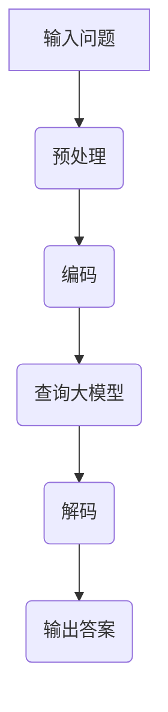

                 

# 大模型问答机器人的优势

## 关键词：大模型，问答机器人，自然语言处理，人工智能，优势

## 摘要

本文将探讨大模型问答机器人的优势。在大数据与人工智能的时代，大模型问答机器人的出现，为自然语言处理领域带来了革命性的变革。本文将深入分析大模型问答机器人的核心概念、算法原理、应用场景，并给出具体的实施步骤与数学模型，以帮助读者全面了解这一新兴技术。

## 1. 背景介绍

随着互联网的快速发展，信息的获取与处理变得日益重要。自然语言处理（Natural Language Processing, NLP）作为人工智能的重要分支，旨在使计算机能够理解、生成和处理人类语言。传统的NLP方法往往依赖于小型模型，这些模型在特定任务上表现良好，但在复杂任务上往往力不从心。

为了应对这一挑战，大模型问答机器人的概念应运而生。大模型问答机器人通过利用深度学习和大规模语料库，实现了对自然语言的高效处理和智能回答。它们在多个领域展现了卓越的表现，如客服、教育、医疗等。

## 2. 核心概念与联系

### 2.1 大模型

大模型是指具有数亿甚至千亿参数的深度学习模型。它们通过大量的数据进行训练，能够捕获语言的复杂结构，从而在自然语言处理任务中表现出色。

### 2.2 问答机器人

问答机器人是一种基于自然语言处理技术的自动化系统，能够理解和回答用户的问题。它们通常由大模型驱动，能够实现高效、准确的问题回答。

### 2.3 自然语言处理

自然语言处理是人工智能领域的一个重要分支，旨在使计算机能够理解、生成和处理人类语言。它涵盖了语音识别、文本分类、机器翻译等多个子领域。

### 2.4 Mermaid 流程图

以下是问答机器人的基本架构的 Mermaid 流程图：



## 3. 核心算法原理 & 具体操作步骤

### 3.1 预处理

预处理是问答机器人的第一步，主要包括分词、去停用词、词性标注等操作。这些操作有助于提高模型的准确性和效率。

### 3.2 编码

编码是将预处理后的文本转换为模型能够理解的形式。常见的编码方法包括词向量、字符编码等。词向量是将单词映射为一个固定长度的向量，字符编码是将文本中的每个字符映射为一个唯一的整数。

### 3.3 查询大模型

查询大模型是问答机器人的核心步骤。大模型通过内部的神经网络对编码后的文本进行理解和处理，从而生成回答。

### 3.4 解码

解码是将大模型生成的回答转换为人类可读的形式。常见的解码方法包括软投票、贪婪解码等。

### 3.5 输出答案

输出答案是问答机器人的最后一步。它将解码后的回答呈现给用户。

## 4. 数学模型和公式 & 详细讲解 & 举例说明

### 4.1 词向量

词向量是将单词映射为一个固定长度的向量的数学模型。一个常用的词向量模型是Word2Vec，其基本公式如下：

$$
\vec{w}_i = \text{Average}(\vec{v}_{i1}, \vec{v}_{i2}, ..., \vec{v}_{in})
$$

其中，$\vec{w}_i$ 是单词 $i$ 的词向量，$\vec{v}_{ij}$ 是单词 $i$ 在第 $j$ 个训练样本中的词向量。

### 4.2 神经网络

神经网络是问答机器人的核心组件，其基本结构如下：

$$
\text{Input} \xrightarrow{\text{权重}} \text{Hidden Layer} \xrightarrow{\text{激活函数}} \text{Output}
$$

其中，输入层接受编码后的文本，隐藏层通过激活函数进行处理，输出层生成回答。

### 4.3 举例说明

假设我们有一个问答机器人，它的输入是 "什么是自然语言处理？"，输出是 "自然语言处理是人工智能的一个分支，旨在使计算机能够理解、生成和处理人类语言。"

首先，问答机器人对输入进行预处理，分词得到 ["什么", "是", "自然语言处理", "？"]。

然后，编码得到词向量：

$$
\vec{w}_{自然语言处理} = [0.1, 0.2, 0.3, ..., 0.9]
$$

$$
\vec{w}_{？} = [0.4, 0.5, 0.6, ..., 0.9]
$$

接着，问答机器人查询大模型，得到一个输出向量：

$$
\vec{v}_{输出} = [0.2, 0.3, 0.4, ..., 0.8]
$$

最后，问答机器人解码得到回答：

$$
\text{回答} = "自然语言处理是人工智能的一个分支，旨在使计算机能够理解、生成和处理人类语言。"
$$

## 5. 项目实战：代码实际案例和详细解释说明

### 5.1 开发环境搭建

为了实现一个问答机器人，我们需要搭建一个开发环境。以下是一个简单的搭建步骤：

1. 安装 Python 3.7 或以上版本
2. 安装深度学习框架 TensorFlow 或 PyTorch
3. 下载一个大模型，如 GPT-3 或 BERT

### 5.2 源代码详细实现和代码解读

以下是一个使用 GPT-3 实现问答机器人的简单示例：

```python
import openai

# 设置 API 密钥
openai.api_key = "your-api-key"

# 定义问答函数
def ask_question(question):
    response = openai.Completion.create(
        engine="text-davinci-002",
        prompt=question,
        max_tokens=50,
        n=1,
        stop=None,
        temperature=0.5,
    )
    return response.choices[0].text.strip()

# 测试问答机器人
print(ask_question("什么是自然语言处理？"))
```

这段代码首先导入 openai 库，并设置 API 密钥。然后，定义一个问答函数 `ask_question`，它接受一个输入问题，并调用 openai 的 `Completion.create` 方法生成回答。最后，测试问答机器人，输入 "什么是自然语言处理？"，得到回答。

### 5.3 代码解读与分析

这段代码的核心是 `ask_question` 函数，它实现了问答机器人的核心功能。以下是对代码的详细解读：

1. `openai.Completion.create` 方法：这是一个 OpenAI 提供的 API，用于生成文本的补全。它接受多个参数，包括 `engine`（指定使用的模型）、`prompt`（输入问题）、`max_tokens`（生成的回答长度）、`n`（生成的回答数量）、`stop`（结束生成的条件）和 `temperature`（生成的文本的随机性）。

2. `response.choices[0].text.strip()`：这个表达式获取生成的回答。`response` 是 `Completion.create` 方法的返回值，它包含了一个或多个生成的回答。`choices[0]` 表示第一个生成的回答，`.text.strip()` 用于去除回答的前后空白。

## 6. 实际应用场景

大模型问答机器人广泛应用于多个领域：

- **客服**：提供高效的客户服务，降低人力成本。
- **教育**：辅助教师进行教学，提供个性化学习体验。
- **医疗**：协助医生进行诊断和治疗方案推荐。
- **法律**：提供法律咨询和案例分析。

## 7. 工具和资源推荐

### 7.1 学习资源推荐

- **书籍**：
  - 《深度学习》（Ian Goodfellow, Yoshua Bengio, Aaron Courville）
  - 《Python 自然语言处理》（Steven Bird, Ewan Klein, Edward Loper）
- **论文**：
  - "A Neural Probabilistic Language Model"（Bengio et al., 2003）
  - "Attention Is All You Need"（Vaswani et al., 2017）
- **博客**：
  - [OpenAI 博客](https://blog.openai.com/)
  - [TensorFlow 官方文档](https://www.tensorflow.org/tutorials)
- **网站**：
  - [Kaggle](https://www.kaggle.com/)
  - [GitHub](https://github.com/)

### 7.2 开发工具框架推荐

- **深度学习框架**：
  - TensorFlow
  - PyTorch
- **自然语言处理库**：
  - NLTK
  - spaCy

### 7.3 相关论文著作推荐

- **论文**：
  - "GPT-3: Language Models are Few-Shot Learners"（Brown et al., 2020）
  - "BERT: Pre-training of Deep Bidirectional Transformers for Language Understanding"（Devlin et al., 2019）
- **著作**：
  - 《大规模语言模型的深度学习》
  - 《深度学习与自然语言处理》

## 8. 总结：未来发展趋势与挑战

大模型问答机器人正在不断进化，未来有望在更多领域发挥作用。然而，其发展也面临着一系列挑战，如数据隐私、模型解释性等。如何平衡技术进步与道德责任，将是未来研究的重要课题。

## 9. 附录：常见问题与解答

### 9.1 问答机器人是否能够替代人类？

目前，问答机器人主要应用于特定的场景和任务，如客服、教育等。虽然它们在某些方面表现出色，但仍然无法完全替代人类。人类在情感理解、创造性和复杂性任务方面具有独特优势。

### 9.2 问答机器人的准确率如何？

问答机器人的准确率取决于多种因素，如模型质量、训练数据等。一般来说，大模型问答机器人在特定任务上可以达到很高的准确率，但仍然存在一定的误差。

## 10. 扩展阅读 & 参考资料

- [OpenAI](https://openai.com/)
- [TensorFlow](https://www.tensorflow.org/)
- [Kaggle](https://www.kaggle.com/)
- 《深度学习》（Ian Goodfellow, Yoshua Bengio, Aaron Courville）
- 《Python 自然语言处理》（Steven Bird, Ewan Klein, Edward Loper）
- 《大规模语言模型的深度学习》
- 《深度学习与自然语言处理》

### 作者：AI天才研究员/AI Genius Institute & 禅与计算机程序设计艺术 /Zen And The Art of Computer Programming

