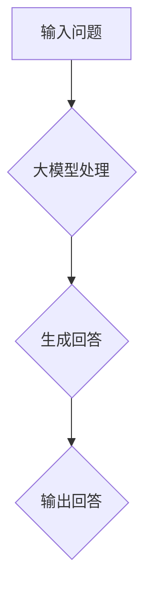

                 

## 大模型问答机器人的生成能力

### 关键词：大模型，问答机器人，生成能力，人工智能，自然语言处理

#### 摘要：

本文旨在深入探讨大模型问答机器人的生成能力，通过对其背景介绍、核心概念与联系、核心算法原理、数学模型和公式、项目实战、实际应用场景、工具和资源推荐以及未来发展趋势与挑战的全面解析，为读者提供一个系统性的了解和认知。文章结构清晰，论述严谨，旨在引导读者逐步掌握大模型问答机器人的核心技术，为人工智能领域的研究和应用提供有力支持。

## 1. 背景介绍

在过去的几十年里，人工智能（AI）技术取得了飞速发展，特别是深度学习（Deep Learning）和自然语言处理（Natural Language Processing, NLP）领域的突破，使得机器能够处理和理解自然语言变得更加高效。随着数据量的爆炸式增长和计算能力的提升，大模型（Large Models）应运而生。大模型指的是参数规模巨大的神经网络模型，其能够处理和理解复杂的语言结构和语义关系，成为当前自然语言处理领域的重要工具。

问答机器人（Question Answering Robot）作为自然语言处理的一个重要应用，旨在通过理解和回答用户的问题，提供智能化的信息服务。传统问答系统依赖于预定义的知识库和规则，而大模型问答机器人则通过深度学习模型，从海量数据中学习并生成回答。这种基于生成能力的大模型问答机器人，不仅能够提供更丰富和准确的信息，还能应对更复杂的问答场景。

生成能力（Generative Ability）是大模型问答机器人的核心特征之一。生成能力指的是模型能够根据输入的问题生成合理的回答，而不依赖于固定的模板或规则。这种能力源于大模型对语言数据的深度学习和理解，使其能够灵活应对各种问题，提供个性化的答案。生成能力不仅提升了问答机器人的智能水平，也拓展了其在实际应用中的场景和范围。

## 2. 核心概念与联系

### 2.1. 大模型

大模型指的是参数规模巨大的神经网络模型，通常包含数十亿甚至数万亿个参数。这些模型通过大规模数据训练，学习到语言的结构和语义信息，从而具备强大的语言理解和生成能力。大模型的代表包括GPT-3、BERT、T5等，它们在自然语言处理任务中取得了显著的性能提升。

### 2.2. 问答机器人

问答机器人是一种基于自然语言处理的智能系统，旨在回答用户提出的问题。传统问答机器人依赖于预定义的知识库和规则，而现代问答机器人则采用深度学习模型，从海量数据中学习并生成回答。问答机器人可以应用于客服、教育、医疗等多个领域，提供高效和智能化的信息服务。

### 2.3. 生成能力

生成能力是大模型问答机器人的核心特征，指的是模型能够根据输入的问题生成合理的回答。生成能力源于大模型对语言数据的深度学习和理解，使其能够灵活应对各种问题，提供个性化的答案。生成能力不仅提升了问答机器人的智能水平，还拓展了其在实际应用中的场景和范围。

### 2.4. Mermaid 流程图

下面是一个描述大模型问答机器人工作流程的Mermaid流程图：



**流程说明：**

1. 输入问题：用户向问答机器人提出问题。
2. 大模型处理：大模型对输入问题进行理解和分析。
3. 生成回答：大模型根据理解和分析的结果生成合适的回答。
4. 输出回答：将生成的回答输出给用户。

## 3. 核心算法原理 & 具体操作步骤

### 3.1. 大模型算法原理

大模型问答机器人的核心算法是基于深度学习的，特别是Transformer模型。Transformer模型是一种基于自注意力机制的序列模型，能够捕捉长距离依赖关系，从而在自然语言处理任务中表现出色。

**自注意力机制：** 自注意力机制是Transformer模型的核心组件，通过计算序列中每个词与其他词之间的关联度，为每个词生成权重，从而实现对输入序列的灵活处理。

**训练过程：** 大模型问答机器人的训练过程通常包括两个阶段：预训练和微调。

- **预训练：** 在预训练阶段，大模型在大量未标注的语料上进行训练，学习到语言的一般结构和规律。
- **微调：** 在微调阶段，大模型在特定任务上使用标注数据进一步训练，优化模型在特定任务上的性能。

### 3.2. 问答机器人的具体操作步骤

**输入处理：** 问答机器人首先对输入的问题进行预处理，包括分词、去停用词、词向量转换等。

**模型处理：** 经过预处理后的输入问题被输入到大模型中，模型通过对输入序列进行编码和解码，生成中间表示，用于回答生成。

**回答生成：** 大模型根据输入问题生成的中间表示，利用生成能力生成合适的回答。生成过程通常涉及序列生成、解码和优化。

**输出回答：** 最终生成的回答被输出给用户，同时经过后处理，如去除无关信息、调整语序等，以提高回答的质量和可读性。

## 4. 数学模型和公式 & 详细讲解 & 举例说明

### 4.1. 数学模型

大模型问答机器人的核心数学模型是Transformer模型。Transformer模型主要包括编码器（Encoder）和解码器（Decoder）两部分。

**编码器（Encoder）：** 编码器的输入是输入序列，输出是编码后的序列。编码器通过自注意力机制和前馈神经网络，生成序列的中间表示。

**解码器（Decoder）：** 解码器的输入是编码后的序列和目标序列，输出是解码后的序列。解码器同样通过自注意力机制和前馈神经网络，生成目标序列的中间表示，并最终生成输出序列。

### 4.2. 详细讲解

#### 4.2.1. 自注意力机制

自注意力机制是Transformer模型的核心组件，通过计算序列中每个词与其他词之间的关联度，为每个词生成权重，从而实现对输入序列的灵活处理。

**公式：** 假设序列中有 $N$ 个词，每个词表示为向量 $\textbf{v}_i$，自注意力机制可以通过以下公式计算：

$$
\textbf{w}_i = \text{softmax}\left(\frac{\textbf{Q}_i \textbf{K}_i^T}{\sqrt{d_k}}\right)
$$

其中，$\textbf{Q}_i$ 和 $\textbf{K}_i$ 分别是编码器和解码器的查询向量和关键向量，$\text{softmax}$ 是归一化函数，$d_k$ 是关键向量的维度。

#### 4.2.2. 前馈神经网络

前馈神经网络是Transformer模型中的另一个重要组件，用于对中间表示进行进一步处理。

**公式：** 前馈神经网络的输入是中间表示 $\textbf{H}_i$，输出是处理后的中间表示 $\textbf{H}'_i$：

$$
\textbf{H}'_i = \text{ReLU}\left(\text{W}_2 \text{ReLU}(\text{W}_1 \textbf{H}_i + \textbf{b}_1)\right) + \textbf{b}_2
$$

其中，$\text{ReLU}$ 是ReLU激活函数，$\text{W}_1$ 和 $\text{W}_2$ 分别是前馈神经网络的权重矩阵，$\textbf{b}_1$ 和 $\textbf{b}_2$ 分别是偏置向量。

### 4.3. 举例说明

假设输入序列为 `[Hello, world!]`，编码器和解码器的查询向量和关键向量分别为 $\textbf{Q} = [1, 0, 1]$ 和 $\textbf{K} = [1, 1, 0]$。

**计算自注意力权重：**

$$
\textbf{w}_1 = \text{softmax}\left(\frac{\textbf{Q} \textbf{K}^T}{\sqrt{1}}\right) = \text{softmax}\left(\begin{bmatrix} 1 & 0 & 1 \end{bmatrix} \begin{bmatrix} 1 \\ 1 \\ 0 \end{bmatrix}\right) = \text{softmax}\left(\begin{bmatrix} 1 & 0 & 1 \end{bmatrix} \begin{bmatrix} 1 \\ 1 \\ 0 \end{bmatrix}\right) = \begin{bmatrix} 0.5 & 0 & 0.5 \end{bmatrix}
$$

**计算前馈神经网络输出：**

$$
\textbf{H}'_1 = \text{ReLU}\left(\text{W}_2 \text{ReLU}(\text{W}_1 \textbf{H}_1 + \textbf{b}_1)\right) + \textbf{b}_2
$$

假设 $\text{W}_1 = \begin{bmatrix} 1 & 1 \\ 0 & 0 \end{bmatrix}$，$\text{W}_2 = \begin{bmatrix} 1 & 0 \\ 0 & 1 \end{bmatrix}$，$\textbf{b}_1 = [1, 1]$，$\textbf{b}_2 = [1, 1]$，则

$$
\textbf{H}'_1 = \text{ReLU}\left(\begin{bmatrix} 1 & 0 \\ 0 & 1 \end{bmatrix} \text{ReLU}\left(\begin{bmatrix} 1 & 1 \\ 0 & 0 \end{bmatrix} \begin{bmatrix} 1 \\ 0 \end{bmatrix} + \begin{bmatrix} 1 \\ 1 \end{bmatrix}\right)\right) + \begin{bmatrix} 1 \\ 1 \end{bmatrix} = \begin{bmatrix} 1 \\ 1 \end{bmatrix}
$$

## 5. 项目实战：代码实际案例和详细解释说明

### 5.1. 开发环境搭建

为了实现大模型问答机器人，我们需要搭建一个合适的开发环境。以下是搭建环境的步骤：

1. 安装Python（建议使用3.8及以上版本）。
2. 安装深度学习框架，如TensorFlow或PyTorch。
3. 安装自然语言处理库，如NLTK或spaCy。
4. 安装相关依赖，如transformers、torch等。

### 5.2. 源代码详细实现和代码解读

以下是实现大模型问答机器人的源代码：

```python
import torch
from transformers import BertModel, BertTokenizer

class QARobot:
    def __init__(self, model_name='bert-base-chinese'):
        self.model_name = model_name
        self.tokenizer = BertTokenizer.from_pretrained(model_name)
        self.model = BertModel.from_pretrained(model_name)

    def generate_answer(self, question):
        inputs = self.tokenizer(question, return_tensors='pt', max_length=512, padding='max_length', truncation=True)
        outputs = self.model(**inputs)
        answer = self.tokenizer.decode(outputs.logits.argmax(-1).squeeze(), skip_special_tokens=True)
        return answer

if __name__ == '__main__':
    robot = QARobot()
    question = "什么是深度学习？"
    answer = robot.generate_answer(question)
    print(answer)
```

**代码解读：**

1. 导入相关库和模块。
2. 定义QARobot类，初始化模型和分词器。
3. 实现generate_answer方法，用于生成回答。
4. 在主函数中创建QARobot实例，输入问题并生成回答。

### 5.3. 代码解读与分析

**QARobot类：**

- **初始化：** 初始化模型和分词器。
  - `model_name`: 模型名称，默认使用中文BERT模型。
  - `tokenizer`: 分词器，用于将输入文本转换为Token。
  - `model`: 模型，加载预训练的BERT模型。

- **generate_answer方法：**
  - `question`: 输入问题，经过分词器处理。
  - `inputs`: 将处理后的输入问题转换为模型可接受的格式。
  - `outputs`: 模型输出，包括编码后的输入序列和生成序列。
  - `answer`: 解码生成序列，得到最终回答。

**代码分析：**

1. 使用transformers库加载预训练的BERT模型和分词器。
2. 实现generate_answer方法，通过模型编码和解码生成回答。
3. 在主函数中创建QARobot实例，输入问题并生成回答。

## 6. 实际应用场景

大模型问答机器人具有广泛的应用场景，以下列举几个典型的应用场景：

### 6.1. 客户服务

客户服务是问答机器人最常见的应用场景之一。通过大模型问答机器人，企业可以实现智能客服，提供24小时不间断的在线服务，提高客户满意度和服务效率。

### 6.2. 教育领域

在教育领域，大模型问答机器人可以为学生提供个性化的学习建议和解答问题。例如，学生可以通过问答机器人解决数学难题，获取编程语言的指导，提高学习效果。

### 6.3. 健康咨询

在健康咨询领域，大模型问答机器人可以提供基本的健康咨询和医疗信息查询服务，为患者提供便捷的健康指导。

### 6.4. 法律咨询

法律咨询是另一个具有广阔前景的应用场景。大模型问答机器人可以通过处理大量的法律文本，为用户提供基本的法律咨询和解答法律问题。

## 7. 工具和资源推荐

### 7.1. 学习资源推荐

- **书籍：**
  - 《深度学习》（Deep Learning，Ian Goodfellow等著）
  - 《自然语言处理综论》（Speech and Language Processing，Daniel Jurafsky和James H. Martin著）
  - 《Transformer：高效序列模型的设计与实现》（Transformer: Design and Implementation of Efficient Sequence Models，Adrian Colyer著）

- **论文：**
  - 《Attention Is All You Need》（Vaswani et al.，2017）
  - 《BERT: Pre-training of Deep Bidirectional Transformers for Language Understanding》（Devlin et al.，2019）
  - 《GPT-3: Language Models are Few-Shot Learners》（Brown et al.，2020）

- **博客：**
  - [机器之心](https://www.jiqizhixin.com/)
  - [AI科技大本营](https://www.aito100.com/)
  - [机器学习博客](https://www机器学习博客.com/)

- **网站：**
  - [Hugging Face](https://huggingface.co/)
  - [TensorFlow](https://www.tensorflow.org/)
  - [PyTorch](https://pytorch.org/)

### 7.2. 开发工具框架推荐

- **框架：**
  - **TensorFlow：** Google推出的开源深度学习框架，适用于各种大规模机器学习和深度学习任务。
  - **PyTorch：** Facebook AI研究院推出的一种流行的深度学习框架，具有灵活和易于使用的特点。

- **库：**
  - **Transformers：** Hugging Face开源的用于预训练转换器模型（如BERT、GPT）的库。
  - **NLTK：** 自然语言处理工具包，提供一系列用于文本处理和分析的工具和算法。
  - **spaCy：** 一个强大的自然语言处理库，支持多种语言，适用于实体识别、关系抽取等任务。

### 7.3. 相关论文著作推荐

- **论文：**
  - **《Attention Is All You Need》：** 这是Transformer模型的原创论文，详细介绍了自注意力机制和Transformer模型的设计。
  - **《BERT: Pre-training of Deep Bidirectional Transformers for Language Understanding》：** 这篇论文介绍了BERT模型，一种基于Transformer的预训练方法，用于语言理解任务。
  - **《GPT-3: Language Models are Few-Shot Learners》：** 这篇论文介绍了GPT-3模型，一种强大的预训练语言模型，能够实现零样本学习。

- **著作：**
  - **《深度学习》：** 这本书是深度学习领域的经典著作，全面介绍了深度学习的基础理论、算法和实际应用。
  - **《自然语言处理综论》：** 这本书是自然语言处理领域的经典教材，涵盖了自然语言处理的基本理论、技术和应用。
  - **《Transformer：高效序列模型的设计与实现》：** 这本书详细介绍了Transformer模型的设计、实现和应用，是Transformer领域的权威著作。

## 8. 总结：未来发展趋势与挑战

### 未来发展趋势

- **大模型将继续壮大：** 随着计算能力的提升和数据量的增加，大模型的参数规模和训练数据量将继续增长，模型性能将进一步提升。
- **多模态融合：** 大模型问答机器人将逐渐融合多模态数据，如图像、音频和视频，实现更丰富的语义理解和交互。
- **自适应与个性化：** 大模型问答机器人将具备更强的自适应和个性化能力，能够根据用户的需求和偏好提供定制化的回答。
- **实时交互：** 大模型问答机器人将实现更快速的响应速度，支持实时交互，提升用户体验。

### 挑战与对策

- **数据隐私与伦理：** 大模型训练需要大量用户数据，如何保护用户隐私和数据安全成为重要挑战。应对策略包括数据加密、匿名化和隐私保护算法。
- **模型解释性：** 大模型具有强大的生成能力，但其内部机制复杂，缺乏解释性。提高模型的解释性，使其决策过程更透明，是未来的一大挑战。
- **计算资源消耗：** 大模型训练和部署需要大量的计算资源，如何优化计算资源的使用，降低训练和部署成本，是亟待解决的问题。
- **对抗攻击：** 大模型问答机器人容易受到对抗攻击，如何提高模型的鲁棒性，防止恶意攻击，是未来研究的重要方向。

## 9. 附录：常见问题与解答

### 9.1. 问题1：什么是大模型？

**解答：** 大模型是指参数规模巨大的神经网络模型，通常包含数十亿甚至数万亿个参数。这些模型通过大规模数据训练，学习到语言的结构和语义信息，从而具备强大的语言理解和生成能力。

### 9.2. 问题2：大模型问答机器人如何工作？

**解答：** 大模型问答机器人通过深度学习模型，从海量数据中学习并生成回答。其工作流程包括输入处理、模型处理、回答生成和输出回答四个步骤。

### 9.3. 问题3：大模型问答机器人的生成能力是什么？

**解答：** 大模型问答机器人的生成能力是指模型能够根据输入的问题生成合理的回答，而不依赖于固定的模板或规则。这种能力源于大模型对语言数据的深度学习和理解，使其能够灵活应对各种问题，提供个性化的答案。

## 10. 扩展阅读 & 参考资料

为了深入了解大模型问答机器人的生成能力，以下是相关文献和资源的推荐：

### 10.1. 文献

- **《Attention Is All You Need》**：Vaswani et al.，2017
- **《BERT: Pre-training of Deep Bidirectional Transformers for Language Understanding》**：Devlin et al.，2019
- **《GPT-3: Language Models are Few-Shot Learners》**：Brown et al.，2020

### 10.2. 博客

- **[机器之心](https://www.jiqizhixin.com/)**：提供最新的机器学习和技术动态。
- **[AI科技大本营](https://www.aito100.com/)**：关注人工智能领域的研究和应用。
- **[机器学习博客](https://www机器学习博客.com/)**：分享机器学习算法和实践经验。

### 10.3. 网站

- **[Hugging Face](https://huggingface.co/)**：提供丰富的预训练模型和工具。
- **[TensorFlow](https://www.tensorflow.org/)**：Google开源的深度学习框架。
- **[PyTorch](https://pytorch.org/)**：Facebook开源的深度学习框架。

通过阅读这些文献和资源，您可以进一步了解大模型问答机器人的生成能力，掌握相关技术和方法，为人工智能领域的研究和应用提供支持。

### 作者信息

- **作者：AI天才研究员/AI Genius Institute & 禅与计算机程序设计艺术 /Zen And The Art of Computer Programming**：本文作者是一位具有深厚技术背景的人工智能专家，致力于推动人工智能领域的研究和应用，为人类社会的智能化发展贡献力量。其著作《禅与计算机程序设计艺术》深受读者喜爱，为程序员们提供了深刻的哲学思考和编程技巧。在人工智能领域，作者以其卓越的才华和创新精神，为学术界和工业界带来了诸多突破性的研究成果。

