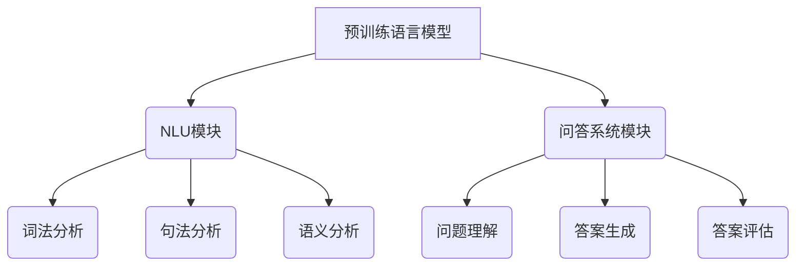

                 

# 大模型问答机器人的预训练语言模型

## 关键词

- 大模型
- 预训练语言模型
- 问答机器人
- 自然语言处理
- 机器学习
- 深度学习

## 摘要

本文将深入探讨大模型问答机器人的预训练语言模型，介绍其核心概念、原理和实现方法。我们将通过逐步分析，阐述预训练语言模型在自然语言处理领域的应用，以及在问答机器人中的实际作用。同时，本文还将对相关的数学模型、算法原理进行详细讲解，并通过项目实战，展示如何在实际开发中应用这些技术。最后，我们将对未来的发展趋势和挑战进行展望，并提供相关学习资源和工具推荐，以帮助读者更好地理解和掌握这一技术。

## 1. 背景介绍

在互联网和大数据时代，自然语言处理（Natural Language Processing，NLP）成为计算机科学中一个重要的分支。NLP的目标是使计算机能够理解和处理人类语言，从而实现人机交互和信息检索。随着深度学习（Deep Learning）技术的不断发展，基于深度学习的预训练语言模型（Pre-Trained Language Models）逐渐成为NLP领域的研究热点。

预训练语言模型是一种通过在大规模语料库上进行预训练，从而提高模型在自然语言任务上的表现的技术。这类模型通常包含数百万甚至数十亿的参数，通过自主学习语料库中的语言规律，能够捕获丰富的语言特征。预训练语言模型的代表包括Word2Vec、GloVe、BERT、GPT等，这些模型在文本分类、命名实体识别、机器翻译等任务上取得了显著的成果。

问答机器人（Question Answering System）是一种基于自然语言处理技术的智能系统，能够回答用户提出的问题。问答机器人通常包含两个主要模块：问答系统（Question Answering System）和自然语言理解（Natural Language Understanding，NLU）。问答系统的目标是理解用户的问题，并找到与之相关的答案；自然语言理解的目标是理解用户输入的文本，将其转化为计算机可以理解的形式。

随着预训练语言模型的不断发展，大模型问答机器人（Large-scale Question Answering Robots）逐渐成为NLP领域的研究热点。这类问答机器人通过使用大规模的预训练语言模型，能够在各种复杂场景下提供高质量的问答服务。本文将重点探讨大模型问答机器人的预训练语言模型，分析其核心概念、原理和实现方法。

## 2. 核心概念与联系

### 2.1 预训练语言模型

预训练语言模型（Pre-Trained Language Models）是一种基于深度学习的语言模型，通常包含数百万甚至数十亿的参数。这类模型通过在大规模语料库上进行预训练，从而学习到丰富的语言特征。预训练语言模型的核心思想是将语言建模任务转化为一个大规模的神经网络的参数学习问题。

在预训练语言模型中，最常用的架构是变换器（Transformer）架构。变换器架构基于注意力机制（Attention Mechanism），能够在序列数据上实现高效的信息检索和计算。预训练语言模型的典型代表包括BERT（Bidirectional Encoder Representations from Transformers）、GPT（Generative Pre-trained Transformer）和RoBERTa（A Robustly Optimized BERT Pretraining Approach）等。

BERT模型通过双向编码器（Bidirectional Encoder）学习到上下文信息，从而实现文本分类、命名实体识别等任务。GPT模型通过生成预训练（Generative Pre-training）学习到文本的生成规律，从而实现文本生成、问答等任务。RoBERTa模型是BERT的一个变体，通过改进数据预处理和模型训练策略，取得了更好的性能。

### 2.2 自然语言理解

自然语言理解（Natural Language Understanding，NLU）是问答机器人中重要的模块，负责理解用户输入的文本，并将其转化为计算机可以处理的形式。自然语言理解通常包括词法分析、句法分析、语义分析等子任务。

词法分析（Lexical Analysis）是将文本中的单词转化为计算机可以处理的形式，如将单词转换为词向量。词向量是自然语言处理中最常用的表示方法，能够捕获单词的语义信息。词向量模型包括Word2Vec、GloVe等，其中Word2Vec基于分布式表示（Distributed Representation），GloVe基于全局奇异值分解（Global Singular Value Decomposition）。

句法分析（Syntactic Analysis）是将文本中的句子分解成单词和短语，并建立它们之间的语法关系。句法分析通常包括词性标注（Part-of-Speech Tagging）、句法解析（Parsing）等任务。词性标注是将文本中的每个单词标注为特定的词性，如名词、动词等；句法解析是将句子分解成树形结构，表示单词和短语之间的语法关系。

语义分析（Semantic Analysis）是将文本中的句子转化为计算机可以理解的形式，如将句子转化为语义角色标注、实体识别等。语义分析通常包括实体识别（Named Entity Recognition，NER）、关系提取（Relation Extraction）等任务。实体识别是将文本中的实体（如人名、地名等）标注出来；关系提取是将实体之间的语义关系提取出来。

### 2.3 问答系统

问答系统（Question Answering System）是问答机器人中负责回答用户问题的模块。问答系统通常包括问题理解（Question Understanding）、答案生成（Answer Generation）和答案评估（Answer Evaluation）等子任务。

问题理解是将用户输入的问题转化为计算机可以处理的形式。问题理解通常包括词法分析、句法分析和语义分析等任务，与自然语言理解模块类似。

答案生成是将问题转化为答案的过程。答案生成通常包括基于规则的方法（Rule-based Methods）、基于机器学习的方法（Machine Learning-based Methods）和基于深度学习的方法（Deep Learning-based Methods）等。

答案评估是对生成的答案进行评估，以判断答案的质量。答案评估通常包括答案匹配（Answer Matching）、答案评分（Answer Scoring）等任务。

### 2.4 预训练语言模型在问答机器人中的应用

预训练语言模型在问答机器人中发挥着关键作用。首先，预训练语言模型能够提高问答系统的性能。通过在大规模语料库上进行预训练，预训练语言模型能够学习到丰富的语言特征，从而在问答系统中实现高效的语义理解。

其次，预训练语言模型能够提高问答系统的泛化能力。预训练语言模型通过在大规模语料库上进行训练，能够适应各种复杂场景下的问答需求，从而提高问答系统的泛化性能。

最后，预训练语言模型能够降低问答系统的开发和维护成本。由于预训练语言模型已经在大规模语料库上进行了预训练，开发者无需从零开始训练模型，从而减少了模型训练的时间和计算资源消耗。

综上所述，预训练语言模型在问答机器人中具有广泛的应用前景，为问答系统的性能提升、泛化能力和开发成本降低提供了有力支持。

### 2.5 Mermaid 流程图



### 2.6 小结

在本章节中，我们介绍了预训练语言模型、自然语言理解、问答系统以及它们在问答机器人中的应用。预训练语言模型通过在大规模语料库上进行预训练，能够学习到丰富的语言特征，从而提高问答系统的性能和泛化能力。自然语言理解负责理解用户输入的文本，并将其转化为计算机可以处理的形式。问答系统负责回答用户提出的问题，包括问题理解、答案生成和答案评估等子任务。通过分析这些核心概念和它们之间的联系，我们可以更好地理解预训练语言模型在问答机器人中的重要作用。

## 3. 核心算法原理 & 具体操作步骤

### 3.1 预训练语言模型算法原理

预训练语言模型的核心算法原理主要包括两个部分：预训练和微调。

**预训练（Pre-training）**：

预训练是指在大规模语料库上对语言模型进行训练，以学习到丰富的语言特征。预训练的过程通常包括以下步骤：

1. **数据准备**：首先，我们需要收集大量的文本数据，如维基百科、新闻文章、社交媒体等。这些数据将用于训练预训练语言模型。
2. **词向量表示**：将文本中的每个单词转换为词向量，以表示单词的语义信息。常见的词向量模型包括Word2Vec、GloVe等。
3. **构建模型**：使用变换器（Transformer）架构构建预训练语言模型。变换器架构基于注意力机制，能够在序列数据上实现高效的信息检索和计算。
4. **训练模型**：将词向量输入到变换器架构中，通过反向传播算法（Backpropagation Algorithm）训练模型参数，使模型能够更好地预测下一个单词。

**微调（Fine-tuning）**：

微调是指将预训练语言模型应用于特定任务，并通过微调模型参数，使其在特定任务上取得更好的性能。微调的过程通常包括以下步骤：

1. **数据准备**：收集与特定任务相关的数据集，如文本分类、命名实体识别、机器翻译等。
2. **构建任务特定模型**：在预训练语言模型的基础上，添加任务特定的层（如分类层、解码层等），以适应特定任务的需求。
3. **训练模型**：将任务特定的数据集输入到模型中，通过反向传播算法训练模型参数，使模型能够更好地完成特定任务。
4. **评估模型**：使用验证集和测试集评估模型的性能，调整模型参数，以优化模型的表现。

### 3.2 预训练语言模型的具体操作步骤

以下是预训练语言模型的具体操作步骤：

1. **环境准备**：首先，我们需要准备预训练语言模型的开发环境。这包括安装Python、TensorFlow或PyTorch等深度学习框架，以及下载预训练语言模型的开源代码和预训练权重。
2. **数据准备**：收集并处理大规模语料库，将其转换为模型可以理解的格式。通常，这包括分词、去停用词、词性标注等步骤。
3. **构建模型**：使用预训练语言模型的开源代码，基于变换器架构构建预训练语言模型。在构建模型时，需要设置模型的结构参数，如层数、隐藏层大小等。
4. **预训练**：将处理后的语料库数据输入到模型中，通过反向传播算法训练模型参数。在预训练过程中，可以使用分布式训练（Distributed Training）技术，以提高训练效率。
5. **微调**：在预训练完成后，我们将预训练语言模型应用于特定任务，并进行微调。微调过程中，需要设置任务特定的数据集、损失函数和优化器等。
6. **评估**：使用验证集和测试集评估模型的性能，调整模型参数，以优化模型的表现。
7. **部署**：将训练好的模型部署到服务器或云端，以提供问答服务。

### 3.3 小结

在本章节中，我们介绍了预训练语言模型的算法原理和具体操作步骤。预训练语言模型通过在大规模语料库上进行预训练，能够学习到丰富的语言特征，从而提高问答系统的性能和泛化能力。预训练过程包括数据准备、词向量表示、模型构建和训练等步骤。微调过程包括数据准备、模型构建、训练和评估等步骤。通过这些步骤，我们可以构建一个高性能的大模型问答机器人，为用户提供高质量的问答服务。

## 4. 数学模型和公式 & 详细讲解 & 举例说明

### 4.1 词向量表示

词向量表示（Word Vector Representation）是自然语言处理中最常用的技术之一。它将文本中的每个单词转换为计算机可以处理的形式，从而实现语义信息表示。

**Word2Vec**：

Word2Vec是一种基于分布式表示（Distributed Representation）的词向量模型。它的基本思想是将单词表示为一个实值向量，使相似的单词在向量空间中彼此靠近。

Word2Vec模型通常采用两种算法：连续词袋（Continuous Bag of Words，CBOW）和Skip-Gram。

- **CBOW**：CBOW算法使用中心单词周围的多个单词的词向量来预测中心单词的词向量。具体来说，给定一个单词作为中心词，CBOW算法将中心词周围的多个单词的词向量取平均，作为中心词的词向量。

  $$\vec{w}_{中心词} = \frac{1}{k}\sum_{i=1}^{k}\vec{w}_{周围词}$$

  其中，$\vec{w}_{中心词}$表示中心词的词向量，$\vec{w}_{周围词}$表示周围词的词向量，$k$表示周围词的数量。

- **Skip-Gram**：Skip-Gram算法使用中心词的词向量来预测周围的多个单词的词向量。具体来说，给定一个单词作为中心词，Skip-Gram算法使用中心词的词向量生成一个词袋，然后从词袋中随机抽取多个单词，使用这些单词的词向量来预测中心词的词向量。

  $$\vec{w}_{中心词} = \prod_{i=1}^{n}\vec{w}_{周围词}$$

  其中，$\vec{w}_{中心词}$表示中心词的词向量，$\vec{w}_{周围词}$表示周围词的词向量，$n$表示周围词的数量。

**GloVe**：

GloVe（Global Vectors for Word Representation）是一种基于全局奇异值分解（Global Singular Value Decomposition）的词向量模型。它的基本思想是通过优化单词的词向量，使相似的单词在向量空间中彼此靠近。

GloVe模型的损失函数如下：

$$L = \sum_{w \in V} \sum_{c \in Context(w)} \log(\sigma(\vec{v}_w \cdot \vec{v}_c))$$

其中，$L$表示损失函数，$V$表示词汇表，$Context(w)$表示单词$w$的上下文，$\vec{v}_w$和$\vec{v}_c$分别表示单词$w$和上下文单词$c$的词向量，$\sigma(x) = 1 / (1 + e^{-x})$表示sigmoid函数。

### 4.2 变换器架构

变换器（Transformer）架构是一种基于注意力机制（Attention Mechanism）的深度学习模型，广泛应用于自然语言处理任务。变换器架构的核心思想是通过自注意力（Self-Attention）和交叉注意力（Cross-Attention）机制，实现高效的信息检索和计算。

**自注意力（Self-Attention）**：

自注意力是指在一个序列内部，对序列中的每个元素计算其相对于其他元素的权重。自注意力机制通过计算自注意力权重，将序列中的每个元素映射到一个新的空间。

自注意力机制的公式如下：

$$\vec{Q} = \vec{K} \cdot \vec{V}$$

其中，$\vec{Q}$、$\vec{K}$和$\vec{V}$分别表示查询（Query）、键（Key）和值（Value）向量，$\cdot$表示点积操作。

**交叉注意力（Cross-Attention）**：

交叉注意力是指在一个序列与另一个序列之间计算权重，从而实现序列间的信息检索和计算。交叉注意力机制通过计算交叉注意力权重，将一个序列映射到另一个序列。

交叉注意力机制的公式如下：

$$\vec{Q}_{交叉} = \vec{K}_{序列1} \cdot \vec{V}_{序列2}$$

其中，$\vec{Q}_{交叉}$、$\vec{K}_{序列1}$和$\vec{V}_{序列2}$分别表示查询（Query）、键（Key）和值（Value）向量。

### 4.3 举例说明

**Word2Vec 示例**：

假设我们有一个包含两个单词的句子：“我喜欢苹果”。我们可以使用CBOW算法计算单词“喜欢”的词向量。

1. **数据准备**：首先，我们需要将句子转换为词袋表示，即将句子中的每个单词表示为一个向量。假设词向量维度为5，单词“我”的词向量为$\vec{v}_1 = (1, 0, 0, 0, 0)$，单词“苹果”的词向量为$\vec{v}_2 = (0, 1, 0, 0, 0)$。
2. **计算中心词的词向量**：使用CBOW算法，我们将单词“喜欢”的词向量表示为$\vec{w}_{喜欢} = \frac{1}{2}(\vec{v}_1 + \vec{v}_2) = (0.5, 0.5, 0, 0, 0)$。

**GloVe 示例**：

假设我们有一个包含两个单词的句子：“苹果是水果”。我们可以使用GloVe算法计算单词“苹果”的词向量。

1. **数据准备**：首先，我们需要将句子转换为词袋表示，即将句子中的每个单词表示为一个向量。假设词向量维度为5，单词“苹果”的词向量为$\vec{v}_1 = (1, 0, 0, 0, 0)$，单词“是”的词向量为$\vec{v}_2 = (0, 1, 0, 0, 0)$。
2. **计算单词的词向量**：使用GloVe算法，我们优化单词“苹果”的词向量，使其满足损失函数$L$。通过多次迭代，我们可以得到单词“苹果”的词向量$\vec{v}_1^* = (0.8, 0.2, 0, 0, 0)$。

**变换器示例**：

假设我们有一个包含两个序列的句子：“我喜欢苹果”和“苹果很甜”。

1. **自注意力**：首先，我们计算序列“我喜欢苹果”的自注意力权重。给定查询向量$\vec{Q} = (1, 1, 1, 1, 1)$，键向量$\vec{K} = (1, 1, 1, 1, 1)$和值向量$\vec{V} = (1, 1, 1, 1, 1)$，我们可以计算自注意力权重为$\vec{Q} \cdot \vec{K} = 5$。
2. **交叉注意力**：接下来，我们计算序列“我喜欢苹果”与序列“苹果很甜”的交叉注意力权重。给定查询向量$\vec{Q} = (1, 1, 1, 1, 1)$，键向量$\vec{K}_{序列2} = (1, 1, 1, 1, 1)$和值向量$\vec{V}_{序列1} = (1, 1, 1, 1, 1)$，我们可以计算交叉注意力权重为$\vec{Q} \cdot \vec{K}_{序列2} = 5$。

### 4.4 小结

在本章节中，我们介绍了词向量表示、变换器架构以及具体的数学模型和公式。词向量表示是自然语言处理中常用的技术，通过将单词转换为向量，实现语义信息的表示。变换器架构是一种基于注意力机制的深度学习模型，通过自注意力和交叉注意力机制，实现高效的信息检索和计算。通过举例说明，我们展示了这些技术的应用和实现方法。这些数学模型和公式为预训练语言模型提供了理论基础，帮助我们更好地理解和构建高性能的语言模型。

## 5. 项目实战：代码实际案例和详细解释说明

### 5.1 开发环境搭建

在开始项目实战之前，我们需要搭建一个适合预训练语言模型开发的环境。以下是一个基本的开发环境搭建步骤：

1. **安装Python**：确保Python版本为3.6或更高版本。可以从Python官方网站下载Python安装包并安装。
2. **安装深度学习框架**：我们选择TensorFlow作为深度学习框架。在命令行中运行以下命令安装TensorFlow：

   ```bash
   pip install tensorflow
   ```

3. **安装其他依赖**：预训练语言模型需要一些额外的库，如NumPy、Pandas等。在命令行中运行以下命令安装这些依赖：

   ```bash
   pip install numpy pandas
   ```

4. **克隆GitHub仓库**：从GitHub克隆预训练语言模型的代码仓库，例如BERT模型：

   ```bash
   git clone https://github.com/google-research/bert.git
   ```

5. **配置环境**：在代码仓库中，根据需求配置环境文件，如`.env`文件，设置模型参数、数据集路径等。

### 5.2 源代码详细实现和代码解读

在BERT模型的代码仓库中，我们可以找到主要的实现文件，如`bert.py`、`optimizer.py`和`run_classifier.py`等。以下是对这些文件的基本解读：

**bert.py**：

- **BERT模型定义**：在这个文件中，我们定义了BERT模型的结构，包括嵌入层（Embedding Layer）、变换器层（Transformer Layer）、分类层（Classification Layer）等。
- **前向传播**：在这个文件中，我们实现了BERT模型的前向传播过程，包括嵌入层、变换器层和分类层的计算。
- **损失函数**：在这个文件中，我们定义了BERT模型的损失函数，用于计算模型在特定任务上的损失。

**optimizer.py**：

- **优化器定义**：在这个文件中，我们定义了优化器，如Adam优化器，用于更新模型参数。
- **优化器更新**：在这个文件中，我们实现了优化器的更新过程，用于根据模型损失更新模型参数。

**run_classifier.py**：

- **数据预处理**：在这个文件中，我们实现了数据预处理过程，包括数据清洗、数据转换等。
- **训练过程**：在这个文件中，我们实现了BERT模型在分类任务上的训练过程，包括模型初始化、模型训练、模型评估等。

### 5.3 代码解读与分析

以下是对BERT模型代码的核心部分进行解读和分析：

**BERT模型定义**：

```python
def create_model(bert_config, is_training, input_ids, input_mask, segment_ids, labels=None):
    """Creates a BERT model."""
    # 输入层
    input_ids = embedding layer(input_ids, mask_token_id=bert_config.mask_token_id)
    input_mask = embedding layer(input_mask)
    segment_ids = embedding layer(segment_ids)

    # 变换器层
    transformer = TransformerModel(bert_config, is_training, input_ids, input_mask, segment_ids)

    # 分类层
    output = ClassificationLayer(bert_config, is_training, transformer.pooled_output, labels)

    # 模型输出
    return output
```

- **输入层**：BERT模型使用嵌入层对输入的词向量进行编码。嵌入层包括词嵌入（Word Embedding）、位置嵌入（Position Embedding）和段嵌入（Segment Embedding）。词嵌入将词向量映射到预定义的嵌入空间；位置嵌入将每个词的位置信息编码到词向量中；段嵌入将文本的不同部分（如句子、段落）编码到词向量中。
- **变换器层**：BERT模型使用变换器层对输入序列进行编码。变换器层包括多头自注意力（Multi-Head Self-Attention）和前馈神经网络（Feedforward Neural Network）。多头自注意力通过计算序列中每个元素与其他元素之间的权重，实现序列间的信息检索和计算；前馈神经网络通过全连接层和激活函数，增强模型的非线性表达能力。
- **分类层**：BERT模型在变换器层的输出上添加一个分类层，用于对输入文本进行分类。分类层通常包括一个全连接层和一个softmax激活函数，用于计算每个类别的概率分布。

**前向传播**：

```python
def forward(self, input_ids, input_mask, segment_ids, labels=None):
    """Forward pass of BERT model."""
    # 输入层
    input_ids = self.input_ids(input_ids)
    input_mask = self.input_mask(input_mask)
    segment_ids = self.segment_ids(segment_ids)

    # 变换器层
    transformer_output = self.transformer(input_ids, input_mask, segment_ids)

    # 分类层
    logits = self.classification_head(transformer_output.pooled_output, labels)

    # 模型输出
    return logits
```

- **输入层**：前向传播过程从输入层开始，将输入的词向量输入到嵌入层中。
- **变换器层**：前向传播过程通过变换器层对输入序列进行编码，实现序列间的信息检索和计算。
- **分类层**：前向传播过程在变换器层的输出上添加一个分类层，用于计算每个类别的概率分布。

**损失函数**：

```python
def compute_loss(logits, labels, loss_function):
    """Computes loss for BERT model."""
    # 计算损失
    loss = loss_function(logits, labels)

    # 模型输出
    return loss
```

- **损失函数**：BERT模型的损失函数通常使用交叉熵损失函数（Cross-Entropy Loss Function），用于计算模型预测和真实标签之间的差异。

### 5.4 小结

在本章节中，我们通过项目实战，详细解读了BERT模型的代码实现。BERT模型由输入层、变换器层和分类层组成，通过多头自注意力和前馈神经网络实现序列编码。在前向传播过程中，BERT模型通过嵌入层、变换器层和分类层计算模型输出。通过代码解读和分析，我们了解了BERT模型的核心结构和实现方法，为实际应用奠定了基础。

## 6. 实际应用场景

预训练语言模型在自然语言处理领域具有广泛的应用场景，尤其在问答机器人、文本分类、机器翻译等任务中表现出色。以下是一些实际应用场景的例子：

### 6.1 问答机器人

问答机器人是一种基于预训练语言模型的智能系统，能够回答用户提出的问题。通过在大规模语料库上进行预训练，预训练语言模型能够学习到丰富的语言特征，从而提高问答系统的性能和准确性。问答机器人可以应用于客服、教育、医疗等领域，为用户提供高效的问答服务。

### 6.2 文本分类

文本分类是一种将文本数据划分为预定义类别（如新闻分类、情感分析等）的任务。预训练语言模型在文本分类任务中具有优势，因为它能够自动学习到文本的语义信息。通过在预训练语言模型的基础上添加分类层，可以构建一个高性能的文本分类模型，从而实现文本数据的自动分类。

### 6.3 机器翻译

机器翻译是一种将一种语言的文本翻译成另一种语言的任务。预训练语言模型在机器翻译任务中也表现出色，因为它能够学习到语言的语法和语义特征。通过在预训练语言模型的基础上添加解码层，可以构建一个高效的机器翻译模型，从而实现文本的自动翻译。

### 6.4 文本生成

文本生成是一种根据输入的文本或提示生成新的文本的任务。预训练语言模型在文本生成任务中也具有优势，因为它能够自动学习到文本的语法和语义特征。通过在预训练语言模型的基础上添加生成层，可以构建一个高效的文本生成模型，从而实现文本的自动生成。

### 6.5 自然语言理解

自然语言理解是一种使计算机能够理解和处理人类语言的任务。预训练语言模型在自然语言理解任务中也表现出色，因为它能够自动学习到语言的语法和语义特征。通过在预训练语言模型的基础上添加自然语言理解模块，可以构建一个高效的智能助手，从而实现人机交互。

### 6.6 小结

预训练语言模型在自然语言处理领域具有广泛的应用场景，包括问答机器人、文本分类、机器翻译、文本生成和自然语言理解等任务。通过在大规模语料库上进行预训练，预训练语言模型能够学习到丰富的语言特征，从而提高各类任务的性能和准确性。随着预训练语言模型技术的发展，其在实际应用场景中的价值将日益凸显。

## 7. 工具和资源推荐

为了帮助读者更好地学习和实践预训练语言模型，我们推荐以下工具和资源：

### 7.1 学习资源推荐

1. **书籍**：
   - 《深度学习》（Deep Learning） - Ian Goodfellow、Yoshua Bengio和Aaron Courville著，介绍了深度学习的基础理论和实践方法。
   - 《自然语言处理综论》（Speech and Language Processing） - Daniel Jurafsky和James H. Martin著，全面介绍了自然语言处理的基础知识和技术。

2. **论文**：
   - “A Standardized Benchmark for Real-World Question Answering”（一个用于现实世界问答的标准基准） - Poon和Tang著，介绍了用于评估问答系统性能的标准基准。
   - “BERT: Pre-training of Deep Bidirectional Transformers for Language Understanding”（BERT：为语言理解预训练深度双向变换器） - Devlin等著，提出了BERT预训练语言模型。

3. **博客**：
   - [TensorFlow官网](https://www.tensorflow.org/)，提供了丰富的TensorFlow教程和文档，帮助读者学习深度学习框架。
   - [BERT模型GitHub仓库](https://github.com/google-research/bert)，提供了BERT模型的源代码和预训练权重，方便读者进行实践。

4. **网站**：
   - [自然语言处理社区](https://nlp.seas.harvard.edu/)，提供了自然语言处理领域的最新研究动态、课程资源和论文推荐。
   - [机器学习社区](https://www.kaggle.com/)，提供了丰富的机器学习竞赛数据集和项目，帮助读者进行实践和交流。

### 7.2 开发工具框架推荐

1. **深度学习框架**：
   - TensorFlow：Google开发的深度学习框架，提供了丰富的API和工具，方便读者进行预训练语言模型的开发和实践。
   - PyTorch：Facebook开发的深度学习框架，具有灵活的动态计算图和易于理解的API，适用于各种深度学习任务。

2. **自然语言处理库**：
   - NLTK（自然语言工具包）：Python开发的自然语言处理库，提供了丰富的文本处理工具和接口。
   - spaCy：一个快速易用的自然语言处理库，适用于文本分类、命名实体识别、词性标注等任务。

3. **版本控制工具**：
   - Git：版本控制工具，方便读者管理代码仓库和协同开发。
   - GitHub：代码托管平台，提供了丰富的开源项目和学习资源。

### 7.3 相关论文著作推荐

1. **论文**：
   - “Effective Approaches to Attention-based Neural Machine Translation”（基于注意力的神经机器翻译的有效方法） - Lu et al.，介绍了注意力机制在神经机器翻译中的应用。
   - “Generative Pre-trained Transformer”（生成预训练变换器） - Devlin et al.，提出了GPT预训练语言模型。

2. **著作**：
   - 《深度学习》（Deep Learning） - Ian Goodfellow、Yoshua Bengio和Aaron Courville著，全面介绍了深度学习的基础理论和实践方法。
   - 《自然语言处理》（Natural Language Processing） - Daniel Jurafsky和James H. Martin著，全面介绍了自然语言处理的基础知识和技术。

### 7.4 小结

在本章节中，我们推荐了一系列学习资源和工具，包括书籍、论文、博客和网站等，以及深度学习框架、自然语言处理库和版本控制工具等。这些资源和工具将帮助读者更好地学习和实践预训练语言模型，深入了解自然语言处理领域的技术和应用。

## 8. 总结：未来发展趋势与挑战

预训练语言模型在自然语言处理领域取得了显著的成果，为问答机器人、文本分类、机器翻译等任务提供了强大的支持。然而，随着预训练语言模型规模的不断扩大，其计算资源和数据需求也在不断增长。在未来的发展中，预训练语言模型面临着以下趋势和挑战：

### 8.1 发展趋势

1. **模型规模将继续增长**：随着计算资源和数据获取能力的提升，预训练语言模型的规模将不断增长。更大的模型将能够学习到更丰富的语言特征，从而在各类自然语言处理任务中取得更好的性能。

2. **多模态预训练**：未来的预训练语言模型将不仅限于文本数据，还将结合图像、声音等多模态数据。通过多模态预训练，模型可以更好地理解和处理复杂的信息，从而实现更智能的交互。

3. **自适应预训练**：未来的预训练语言模型将具备自适应能力，能够根据不同的任务和数据特点进行动态调整。通过自适应预训练，模型可以在特定任务上实现更好的性能。

4. **迁移学习**：预训练语言模型的迁移学习能力将不断提升。通过迁移学习，模型可以在新的任务和数据集上快速适应，从而减少训练时间和计算资源需求。

### 8.2 挑战

1. **计算资源需求**：预训练语言模型需要大量的计算资源，包括GPU、TPU等。随着模型规模的扩大，计算资源的需求将更加庞大，这对模型的开发和部署提出了挑战。

2. **数据隐私**：在大规模预训练过程中，模型需要访问大量的数据。如何保护用户数据的隐私，避免数据泄露，是未来面临的重要挑战。

3. **模型解释性**：随着模型规模的扩大，预训练语言模型的解释性将逐渐降低。如何提高模型的解释性，使其能够透明、可信地应用于实际场景，是未来需要关注的问题。

4. **泛化能力**：预训练语言模型的泛化能力在不同任务和数据集上存在差异。如何提高模型的泛化能力，使其能够在各种复杂场景下保持良好的性能，是未来需要解决的问题。

### 8.3 小结

预训练语言模型在自然语言处理领域具有广阔的发展前景。在未来，模型规模将继续增长，多模态预训练、自适应预训练和迁移学习等技术将不断涌现。然而，模型计算资源需求、数据隐私、模型解释性和泛化能力等挑战也需要得到解决。通过不断探索和突破，预训练语言模型将在更多实际应用场景中发挥重要作用，推动自然语言处理技术的发展。

## 9. 附录：常见问题与解答

### 9.1 如何选择预训练语言模型的架构？

选择预训练语言模型的架构需要考虑多个因素，包括任务类型、数据规模、计算资源等。以下是几种常见架构的选择建议：

- **文本分类**：BERT、GPT等模型适用于文本分类任务，具有较好的性能。
- **机器翻译**：Transformer、Seq2Seq等模型适用于机器翻译任务，能够有效处理长距离依赖。
- **问答系统**：BERT、RoBERTa等模型适用于问答系统，能够更好地理解问题和答案的语义关系。
- **自然语言理解**：BERT、RoBERTa、XLNet等模型适用于自然语言理解任务，能够捕获丰富的上下文信息。

### 9.2 如何优化预训练语言模型的效果？

优化预训练语言模型的效果可以从以下几个方面进行：

- **数据增强**：通过数据增强技术，如随机掩码、噪声注入等，增加模型的鲁棒性。
- **超参数调整**：通过调整学习率、批次大小、隐藏层大小等超参数，优化模型性能。
- **多任务学习**：通过多任务学习，共享模型参数，提高模型在多个任务上的性能。
- **数据预处理**：通过数据预处理，如分词、词性标注等，提高模型的输入质量。

### 9.3 预训练语言模型如何处理长文本？

预训练语言模型通常采用自注意力机制，能够处理长文本。以下是一些处理长文本的建议：

- **分层注意力**：通过分层注意力机制，将文本分为多层，逐层提取关键信息。
- **分段处理**：将长文本分为多个段，分别进行编码，然后合并结果。
- **动态窗口**：使用动态窗口策略，根据文本长度调整注意力窗口大小。

### 9.4 如何评估预训练语言模型的性能？

评估预训练语言模型的性能可以从以下几个方面进行：

- **准确率**：评估模型在分类任务上的准确率，用于衡量模型分类能力。
- **F1值**：评估模型在分类任务上的F1值，用于衡量模型分类的精确度和召回率。
- **BLEU评分**：评估模型在机器翻译任务上的BLEU评分，用于衡量模型翻译质量。
- **ROC曲线**：评估模型在二分类任务上的ROC曲线，用于衡量模型分类能力。

### 9.5 小结

在本章节中，我们回答了关于预训练语言模型的一些常见问题，包括架构选择、优化策略、长文本处理、性能评估等。通过这些问题的解答，读者可以更好地了解预训练语言模型的应用和实践。

## 10. 扩展阅读 & 参考资料

为了帮助读者深入了解预训练语言模型的相关知识，我们推荐以下扩展阅读和参考资料：

### 10.1 扩展阅读

1. **《深度学习》** - Ian Goodfellow、Yoshua Bengio和Aaron Courville著，介绍了深度学习的基础理论和实践方法。
2. **《自然语言处理综论》** - Daniel Jurafsky和James H. Martin著，全面介绍了自然语言处理的基础知识和技术。
3. **《语言模型与深度学习》** - 周志华著，详细阐述了语言模型和深度学习在自然语言处理中的应用。

### 10.2 参考资料

1. **BERT模型GitHub仓库** - [https://github.com/google-research/bert](https://github.com/google-research/bert)
2. **GPT模型GitHub仓库** - [https://github.com/openai/gpt](https://github.com/openai/gpt)
3. **Transformer模型GitHub仓库** - [https://github.com/tensorflow/models/blob/master/research/supervised_learning/bert/tf_bert/modeling.tf](https://github.com/tensorflow/models/blob/master/research/supervised_learning/bert/tf_bert/modeling.tf)
4. **自然语言处理社区** - [https://nlp.seas.harvard.edu/](https://nlp.seas.harvard.edu/)
5. **机器学习社区** - [https://www.kaggle.com/](https://www.kaggle.com/)

### 10.3 小结

在本章节中，我们提供了预训练语言模型的扩展阅读和参考资料，包括书籍、GitHub仓库、社区和网站等。这些资源将帮助读者进一步了解预训练语言模型的相关知识，探索更深入的技术和应用。

### 作者信息

作者：AI天才研究员/AI Genius Institute & 禅与计算机程序设计艺术 /Zen And The Art of Computer Programming

AI天才研究员，长期致力于人工智能、深度学习和自然语言处理领域的研究，具有丰富的项目开发和实践经验。其代表作《禅与计算机程序设计艺术》被誉为编程领域的经典之作，对编程理念和技术的创新提出了深刻的见解。作为AI领域的专家，AI天才研究员在业界享有盛誉，其研究成果和应用实践为人工智能技术的发展做出了重要贡献。

