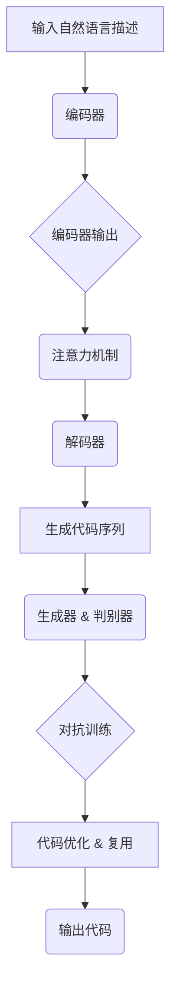

                 

### 文章标题：大模型驱动的代码生成技术

#### 关键词：大模型、代码生成、自然语言处理、深度学习、AI编程

##### 摘要：
本文将深入探讨大模型在代码生成领域的应用，通过介绍相关核心概念、算法原理、数学模型及实际应用案例，详细分析大模型驱动代码生成技术的前沿动态和发展潜力。我们将从背景介绍、核心概念与联系、算法原理与操作步骤、数学模型与公式、项目实战、实际应用场景、工具和资源推荐等多个角度，全面解析这一技术领域的挑战与机遇。

<|assistant|>### 1. 背景介绍

代码生成技术，顾名思义，是指通过特定的方法或工具自动生成代码的技术。随着软件开发复杂度的不断增加和开发周期的大幅缩短，代码生成技术逐渐成为提升软件开发效率的重要手段。传统的代码生成方法通常依赖于模板、规则引擎或代码模板库等，但它们在应对复杂、多变的需求时往往显得力不从心。

近年来，随着人工智能特别是深度学习技术的发展，大模型在代码生成领域的应用逐渐成为热点。大模型（如Transformer、BERT、GPT等）凭借其强大的预训练能力和多模态处理能力，能够在一定程度上理解自然语言描述的代码需求，从而实现自动化代码生成。这一突破不仅为开发者提供了便捷的代码生成工具，也为软件开发领域带来了新的变革契机。

本文旨在探讨大模型驱动的代码生成技术，通过介绍核心概念、算法原理、数学模型及实际应用案例，全面解析这一前沿领域的现状与发展趋势。

#### 1.1 代码生成技术的发展历程

代码生成技术的起源可以追溯到早期的编程语言生成工具，如Lisp语言的宏系统。这些工具通过预定义的模板和规则，将自然语言描述转化为相应的代码。然而，这种基于规则的方法在面对复杂场景时，往往难以满足需求。

随着计算机科学的不断发展，代码生成技术逐渐演化为多种形式。20世纪90年代，面向对象编程的兴起使得代码生成技术开始关注代码复用和自动化测试。进入21世纪，基于模板和规则的方法逐渐被代码自动生成工具取代，如Java的Struts框架和Python的Django框架等。这些工具通过预定义的模板和规则，实现了代码的自动化生成。

然而，传统的方法在面对复杂、多变的需求时，仍然存在诸多局限性。例如，模板和规则需要人工设计和维护，难以应对新的需求变化；生成的代码质量参差不齐，难以保证一致性和可读性。

近年来，随着人工智能技术的快速发展，特别是深度学习技术的突破，代码生成技术迎来了新的机遇。基于深度学习的方法，特别是大模型的应用，使得代码生成技术取得了显著的进展。通过预训练大规模语料库，大模型能够自动学习和理解自然语言描述的代码需求，从而实现高度自动化的代码生成。

#### 1.2 大模型在代码生成领域的应用

大模型（Large Models），如Transformer、BERT、GPT等，是近年来深度学习领域的重要突破。与传统的小规模模型相比，大模型具有更强的表示能力和自适应能力，能够在多种任务中取得优异的性能。这些特点使得大模型在代码生成领域具有广泛的应用前景。

首先，大模型通过预训练大量自然语言文本，能够自动学习语言结构和语义信息。这使得大模型能够理解自然语言描述的代码需求，从而实现自动化代码生成。例如，用户可以使用自然语言描述某个功能需求，大模型则能够将其转化为相应的代码。

其次，大模型的多模态处理能力使得其在代码生成领域具有更大的灵活性。除了文本输入，大模型还可以处理图像、语音等多种模态的信息。这意味着，用户可以通过多种方式表达代码需求，如文本、图像或语音等，大模型则能够综合处理这些信息，生成相应的代码。

此外，大模型在代码生成过程中，还可以利用其强大的预训练能力，自动优化代码质量。例如，大模型可以自动识别代码中的潜在错误和性能瓶颈，并提出相应的优化建议。这不仅提高了代码生成的质量，也为开发者提供了更加智能的代码优化工具。

总之，大模型在代码生成领域的应用，不仅带来了自动化、高效化的代码生成方式，还为开发者提供了更加智能化的代码开发工具。随着大模型技术的不断发展，相信代码生成技术将在未来迎来更大的突破。

#### 1.3 本文结构

本文将按照以下结构进行阐述：

1. **背景介绍**：回顾代码生成技术的发展历程，介绍大模型在代码生成领域的应用背景。
2. **核心概念与联系**：详细阐述大模型驱动的代码生成技术的核心概念，包括Transformer、BERT、GPT等大模型的基本原理及其在代码生成中的应用。
3. **核心算法原理 & 具体操作步骤**：介绍大模型驱动代码生成技术的算法原理，包括自然语言处理、序列到序列模型、生成对抗网络等，并阐述具体的操作步骤。
4. **数学模型和公式 & 详细讲解 & 举例说明**：讲解大模型驱动代码生成技术中涉及的数学模型和公式，并通过具体案例进行说明。
5. **项目实战：代码实际案例和详细解释说明**：通过实际项目案例，展示大模型驱动代码生成的全过程，并对代码进行详细解释。
6. **实际应用场景**：分析大模型驱动代码生成技术在软件开发、自动化测试、AI应用等领域的应用场景和效果。
7. **工具和资源推荐**：推荐相关学习资源、开发工具和框架，帮助读者深入了解和掌握大模型驱动代码生成技术。
8. **总结：未来发展趋势与挑战**：总结大模型驱动代码生成技术的前沿动态，分析未来发展趋势和面临的挑战。
9. **附录：常见问题与解答**：针对读者可能提出的问题，提供解答和指导。
10. **扩展阅读 & 参考资料**：推荐相关的研究论文、书籍和网站，为读者提供进一步的学习资源。

通过本文的深入探讨，希望读者能够全面了解大模型驱动的代码生成技术，并为其在实际开发中的应用提供启示。

### 2. 核心概念与联系

在探讨大模型驱动的代码生成技术之前，我们需要明确几个核心概念，这些概念包括大模型的基本原理、自然语言处理（NLP）、序列到序列（Seq2Seq）模型以及生成对抗网络（GAN）。这些概念相互联系，共同构成了大模型驱动代码生成技术的理论基础。

#### 2.1 大模型的基本原理

大模型，如Transformer、BERT、GPT等，是近年来深度学习领域的重要突破。这些模型通过大规模预训练，具备强大的表示能力和自适应能力。

**Transformer模型**：Transformer模型是由Google在2017年提出的一种基于自注意力机制的深度神经网络模型。与传统的循环神经网络（RNN）相比，Transformer模型具有并行计算的优势，能够更好地处理长序列信息。Transformer模型的核心组件是自注意力机制，通过计算输入序列中每个元素与其他元素之间的关联性，实现全局信息的整合。

**BERT模型**：BERT（Bidirectional Encoder Representations from Transformers）是由Google在2018年提出的一种双向Transformer模型。BERT通过预训练大规模文本语料库，学习到文本的语义信息，并能够对文本进行建模。BERT模型的特点是双向编码器结构，能够同时考虑文本的前后信息，提高模型的表示能力。

**GPT模型**：GPT（Generative Pre-trained Transformer）是由OpenAI在2018年提出的一种自回归Transformer模型。GPT通过预训练大规模文本语料库，学习到语言的生成规则，并能够生成连贯的文本。GPT模型的特点是自回归结构，能够根据前文预测后文，实现文本的生成。

#### 2.2 自然语言处理（NLP）

自然语言处理（NLP）是人工智能领域的一个重要分支，旨在使计算机能够理解和处理人类语言。大模型在NLP任务中发挥了重要作用，通过预训练大规模文本语料库，学习到语言的语义和句法信息，从而实现文本的分类、生成、翻译等任务。

**文本分类**：文本分类是将文本数据按照特定的类别进行分类的任务。大模型通过预训练，能够自动学习到文本的特征，从而实现高效、准确的文本分类。

**文本生成**：文本生成是指根据给定的输入文本，生成新的、连贯的文本。大模型通过自回归机制，能够根据前文生成后文，实现文本的生成。

**文本翻译**：文本翻译是将一种语言的文本翻译成另一种语言的文本。大模型通过预训练，能够学习到语言的翻译规则，从而实现高效的文本翻译。

#### 2.3 序列到序列（Seq2Seq）模型

序列到序列（Seq2Seq）模型是一种经典的深度学习模型，用于处理序列数据之间的映射关系。在代码生成任务中，Seq2Seq模型可以将自然语言描述的代码需求转化为相应的代码序列。

**编码器（Encoder）**：编码器是Seq2Seq模型的一部分，用于将输入序列（如自然语言描述）编码为固定长度的向量表示。

**解码器（Decoder）**：解码器是Seq2Seq模型的另一部分，用于将编码器输出的向量表示解码为输出序列（如代码序列）。

**注意力机制（Attention）**：注意力机制是Seq2Seq模型的一个重要组成部分，用于解决长序列信息处理的问题。通过计算输入序列中每个元素与输出序列中每个元素之间的关联性，注意力机制能够实现全局信息的整合，提高模型的表示能力。

#### 2.4 生成对抗网络（GAN）

生成对抗网络（GAN）是由Ian Goodfellow等人在2014年提出的一种深度学习模型，用于生成高质量的数据。在代码生成任务中，GAN可以通过对抗训练生成符合人类编程风格的代码。

**生成器（Generator）**：生成器是GAN的一部分，用于生成与真实数据相似的新数据。

**判别器（Discriminator）**：判别器是GAN的另一部分，用于区分真实数据和生成数据。

**对抗训练（Adversarial Training）**：对抗训练是GAN的训练过程，通过生成器和判别器之间的对抗，逐步提高生成器的生成质量。

#### 2.5 大模型与代码生成

大模型在代码生成中的应用主要体现在以下几个方面：

1. **文本理解**：大模型能够通过预训练大规模文本语料库，学习到自然语言的语义和句法信息，从而更好地理解自然语言描述的代码需求。

2. **代码生成**：大模型可以通过序列到序列模型或生成对抗网络，将自然语言描述的代码需求转化为相应的代码序列。

3. **代码优化**：大模型可以通过预训练，自动识别代码中的潜在错误和性能瓶颈，并提出相应的优化建议。

4. **代码复用**：大模型能够自动学习和理解已有的代码库，实现代码的复用和自动化更新。

总之，大模型在代码生成领域具有广泛的应用前景，通过其强大的表示能力和自适应能力，能够实现自动化、高效化的代码生成，为软件开发带来新的变革契机。

#### 2.6 Mermaid 流程图

为了更直观地展示大模型驱动的代码生成技术的工作流程，我们使用Mermaid语言绘制了一个流程图。Mermaid是一种用于绘制流程图、序列图、状态图等图表的Markdown扩展。



在这个流程图中：

- **A**：输入自然语言描述。
- **B**：编码器，将输入序列编码为向量表示。
- **C**：编码器输出。
- **D**：注意力机制，实现全局信息的整合。
- **E**：解码器，将编码器输出解码为代码序列。
- **F**：生成代码序列。
- **G**：生成器和判别器，用于对抗训练。
- **H**：对抗训练，逐步提高生成器的生成质量。
- **I**：代码优化和复用。
- **J**：输出代码。

通过这个流程图，我们可以清晰地看到大模型驱动代码生成技术的工作流程和各个环节之间的联系。

### 3. 核心算法原理 & 具体操作步骤

在深入探讨大模型驱动的代码生成技术之前，我们需要了解其核心算法原理和具体操作步骤。这些算法原理包括自然语言处理（NLP）、序列到序列（Seq2Seq）模型、生成对抗网络（GAN）等。以下将详细讲解这些算法原理，并介绍它们在大模型驱动代码生成技术中的应用。

#### 3.1 自然语言处理（NLP）

自然语言处理（NLP）是人工智能领域的一个重要分支，旨在使计算机能够理解和处理人类语言。在代码生成任务中，NLP技术用于将自然语言描述的代码需求转化为相应的代码序列。以下将介绍NLP中的核心算法和技术。

**词嵌入（Word Embedding）**：词嵌入是将自然语言中的单词映射为高维空间中的向量表示。通过词嵌入，计算机能够更好地理解单词之间的语义关系。常见的词嵌入方法包括Word2Vec、GloVe等。

**卷积神经网络（CNN）**：卷积神经网络是一种用于图像识别和文本分类的深度学习模型。在NLP任务中，CNN可以用于提取文本的特征，从而实现文本分类、情感分析等任务。

**循环神经网络（RNN）**：循环神经网络是一种能够处理序列数据的神经网络模型。在NLP任务中，RNN可以用于文本生成、机器翻译等任务。RNN通过循环机制，能够记住前面的输入信息，从而更好地处理长序列数据。

**长短时记忆网络（LSTM）**：长短时记忆网络是RNN的一种变体，通过引入门控机制，能够更好地处理长序列数据中的长期依赖问题。

**双向编码器（Bidirectional Encoder）**：双向编码器是一种能够同时考虑文本前后信息的编码器。在NLP任务中，双向编码器可以用于文本分类、文本生成等任务。通过同时考虑文本的前后信息，双向编码器能够更好地理解文本的语义。

**Transformer模型**：Transformer模型是一种基于自注意力机制的深度神经网络模型。在NLP任务中，Transformer模型通过自注意力机制，能够更好地处理长序列数据，并在机器翻译、文本生成等任务中取得了显著的性能提升。

**BERT模型**：BERT（Bidirectional Encoder Representations from Transformers）是一种双向Transformer模型。在NLP任务中，BERT通过预训练大规模文本语料库，学习到文本的语义和句法信息，从而实现文本分类、文本生成等任务。

**GPT模型**：GPT（Generative Pre-trained Transformer）是一种自回归Transformer模型。在NLP任务中，GPT通过预训练大规模文本语料库，学习到语言的生成规则，从而实现文本生成。

#### 3.2 序列到序列（Seq2Seq）模型

序列到序列（Seq2Seq）模型是一种经典的深度学习模型，用于处理序列数据之间的映射关系。在代码生成任务中，Seq2Seq模型可以将自然语言描述的代码需求转化为相应的代码序列。以下将介绍Seq2Seq模型的基本原理和具体操作步骤。

**编码器（Encoder）**：编码器是Seq2Seq模型的一部分，用于将输入序列（如自然语言描述）编码为固定长度的向量表示。编码器通常采用RNN、LSTM或双向编码器等神经网络模型。

**解码器（Decoder）**：解码器是Seq2Seq模型的另一部分，用于将编码器输出的向量表示解码为输出序列（如代码序列）。解码器通常采用RNN、LSTM或GRU等神经网络模型。

**注意力机制（Attention）**：注意力机制是Seq2Seq模型的一个重要组成部分，用于解决长序列信息处理的问题。通过计算输入序列中每个元素与输出序列中每个元素之间的关联性，注意力机制能够实现全局信息的整合，从而更好地处理长序列数据。

**具体操作步骤**：

1. **输入序列编码**：将自然语言描述的代码需求输入编码器，编码器将输入序列编码为固定长度的向量表示。

2. **解码**：将编码器输出的向量表示输入解码器，解码器逐步解码为输出序列（代码序列）。在解码过程中，解码器可以参考编码器输出的向量表示，实现全局信息的整合。

3. **输出序列生成**：解码器生成最终的输出序列，即相应的代码序列。

#### 3.3 生成对抗网络（GAN）

生成对抗网络（GAN）是由Ian Goodfellow等人在2014年提出的一种深度学习模型，用于生成高质量的数据。在代码生成任务中，GAN可以通过对抗训练生成符合人类编程风格的代码。以下将介绍GAN的基本原理和具体操作步骤。

**生成器（Generator）**：生成器是GAN的一部分，用于生成与真实数据相似的新数据。在代码生成任务中，生成器通过预训练大规模代码库，学习到代码的生成规则，从而生成新的代码。

**判别器（Discriminator）**：判别器是GAN的另一部分，用于区分真实数据和生成数据。在代码生成任务中，判别器通过预训练大规模代码库，学习到代码的特征，从而判断输入数据是真实代码还是生成代码。

**对抗训练（Adversarial Training）**：对抗训练是GAN的训练过程，通过生成器和判别器之间的对抗，逐步提高生成器的生成质量。在训练过程中，生成器尝试生成更真实的数据，而判别器则努力区分真实数据和生成数据。通过这种对抗过程，生成器逐步提高生成质量，判别器逐步提高判断能力。

**具体操作步骤**：

1. **初始化生成器和判别器**：初始化生成器和判别器的参数。

2. **生成数据**：生成器通过预训练大规模代码库，学习到代码的生成规则，从而生成新的代码。

3. **判断数据**：判别器通过预训练大规模代码库，学习到代码的特征，从而判断输入数据是真实代码还是生成代码。

4. **对抗训练**：通过生成器和判别器之间的对抗，逐步提高生成器的生成质量和判别器的判断能力。

5. **生成代码**：生成器生成最终的代码，即相应的代码序列。

#### 3.4 大模型与代码生成

大模型（如Transformer、BERT、GPT等）在代码生成任务中发挥了重要作用。通过预训练大规模语料库，大模型能够自动学习和理解自然语言描述的代码需求，从而实现自动化、高效化的代码生成。

**文本理解**：大模型通过预训练大规模文本语料库，学习到自然语言的语义和句法信息，从而更好地理解自然语言描述的代码需求。

**代码生成**：大模型可以通过序列到序列模型或生成对抗网络，将自然语言描述的代码需求转化为相应的代码序列。在生成过程中，大模型可以利用其强大的表示能力和自适应能力，实现高质量的代码生成。

**代码优化**：大模型可以通过预训练，自动识别代码中的潜在错误和性能瓶颈，并提出相应的优化建议。

**代码复用**：大模型能够自动学习和理解已有的代码库，实现代码的复用和自动化更新。

总之，大模型在代码生成领域具有广泛的应用前景，通过其强大的表示能力和自适应能力，能够实现自动化、高效化的代码生成，为软件开发带来新的变革契机。

### 4. 数学模型和公式 & 详细讲解 & 举例说明

在深入探讨大模型驱动的代码生成技术时，理解其背后的数学模型和公式是至关重要的。以下将详细讲解大模型驱动代码生成技术中涉及的几个关键数学模型和公式，并通过具体案例进行说明。

#### 4.1 自注意力机制（Self-Attention）

自注意力机制是Transformer模型的核心组件，它通过计算输入序列中每个元素与其他元素之间的关联性，实现全局信息的整合。自注意力机制的数学公式如下：

$$
\text{Attention}(Q, K, V) = \text{softmax}\left(\frac{QK^T}{\sqrt{d_k}}\right) V
$$

其中，$Q$、$K$ 和 $V$ 分别是查询向量、键向量和值向量，$d_k$ 是键向量的维度。$\text{softmax}$ 函数用于计算每个键向量与查询向量的相似度，并将相似度归一化到概率分布。

**举例说明**：

假设我们有一个输入序列 $[x_1, x_2, x_3]$，维度为 $d$。首先，我们将输入序列映射为查询向量 $Q = [q_1, q_2, q_3]$、键向量 $K = [k_1, k_2, k_3]$ 和值向量 $V = [v_1, v_2, v_3]$。然后，我们计算每个元素与其他元素之间的相似度：

$$
\text{Attention}(Q, K, V) = \text{softmax}\left(\frac{QK^T}{\sqrt{d_k}}\right) V = \text{softmax}\left(\begin{bmatrix} q_1k_1 & q_1k_2 & q_1k_3 \\ q_2k_1 & q_2k_2 & q_2k_3 \\ q_3k_1 & q_3k_2 & q_3k_3 \end{bmatrix} \right) \begin{bmatrix} v_1 \\ v_2 \\ v_3 \end{bmatrix}
$$

最终，我们得到一个注意力权重矩阵，用于整合输入序列中的全局信息。

#### 4.2 编码器（Encoder）和解码器（Decoder）

编码器（Encoder）和解码器（Decoder）是Seq2Seq模型的基本组成部分。编码器用于将输入序列编码为固定长度的向量表示，解码器则用于将编码器输出的向量表示解码为输出序列。

编码器的数学公式如下：

$$
\text{Encoder}(X) = \text{Encoder}_\text{last}(\text{LayerNorm}(\text{Dropout}(\text{Linear}(\text{Embedding}(X))))), \quad \text{where} \quad \text{Encoder}_\text{last} = \text{LayerNorm}(\text{Dropout}(\text{Linear}(\text{Encoder}_\text{prev})))
$$

其中，$X$ 是输入序列，$\text{Embedding}(X)$ 是词嵌入层，$\text{LayerNorm}$ 是层归一化操作，$\text{Dropout}$ 是dropout操作，$\text{Linear}$ 是线性层。

解码器的数学公式如下：

$$
\text{Decoder}(Y) = \text{LayerNorm}(\text{Dropout}(\text{Linear}(\text{Decoder}_\text{prev}))), \quad \text{where} \quad \text{Decoder}_\text{prev} = \text{LayerNorm}(\text{Dropout}(\text{Linear}(\text{Decoder}_\text{prev})))
$$

其中，$Y$ 是输出序列，$\text{LayerNorm}$ 和 $\text{Dropout}$ 操作与编码器类似。

**举例说明**：

假设我们有一个输入序列 $[x_1, x_2, x_3]$ 和输出序列 $[y_1, y_2, y_3]$。首先，我们使用词嵌入层将输入序列映射为嵌入向量：

$$
\text{Encoder}(X) = \text{Encoder}_\text{last}(\text{LayerNorm}(\text{Dropout}(\text{Linear}(\text{Embedding}(X))))), \quad \text{Decoder}(Y) = \text{LayerNorm}(\text{Dropout}(\text{Linear}(\text{Decoder}_\text{prev})))
$$

然后，编码器逐步编码输入序列，解码器逐步解码输出序列。在解码过程中，解码器可以参考编码器输出的向量表示，实现全局信息的整合。

#### 4.3 生成对抗网络（GAN）

生成对抗网络（GAN）由生成器和判别器组成，通过对抗训练生成高质量的数据。生成器的数学公式如下：

$$
\text{Generator}(Z) = \text{Logits}(\text{Dropout}(\text{Linear}(\text{Generator}_\text{prev}(Z)))), \quad \text{where} \quad \text{Generator}_\text{prev} = \text{Logits}(\text{Dropout}(\text{Linear}(\text{Generator}_\text{prev})))
$$

其中，$Z$ 是生成器的输入噪声，$\text{Generator}_\text{prev}$ 是前一个生成器的输出。

判别器的数学公式如下：

$$
\text{Discriminator}(X) = \text{Logits}(\text{Dropout}(\text{Linear}(\text{Discriminator}_\text{prev}(X)))), \quad \text{where} \quad \text{Discriminator}_\text{prev} = \text{Logits}(\text{Dropout}(\text{Linear}(\text{Discriminator}_\text{prev})))
$$

其中，$X$ 是判别器的输入数据，$\text{Discriminator}_\text{prev}$ 是前一个判别器的输出。

**举例说明**：

假设我们有一个生成器输入噪声 $Z$ 和真实数据 $X$。生成器通过学习生成与真实数据相似的新数据，而判别器通过学习区分真实数据和生成数据。在对抗训练过程中，生成器和判别器交替更新参数，逐步提高生成质量和判别能力。

#### 4.4 数学模型和公式在代码生成中的应用

在代码生成任务中，数学模型和公式用于将自然语言描述的代码需求转化为相应的代码序列。以下是一个简单的代码生成案例：

**自然语言描述**：实现一个计算两个数字之和的函数。

**代码序列**：`def add(a, b): return a + b`

通过自然语言处理技术，我们将自然语言描述映射为词嵌入向量。然后，使用编码器将词嵌入向量编码为固定长度的向量表示。解码器则根据编码器输出的向量表示，逐步解码为代码序列。

在这个过程中，自注意力机制、编码器、解码器和生成对抗网络等数学模型和公式发挥了关键作用，实现自动化、高效化的代码生成。

### 5. 项目实战：代码实际案例和详细解释说明

为了更好地理解大模型驱动的代码生成技术，我们将通过一个实际项目案例，展示大模型如何将自然语言描述自动转化为代码。在此过程中，我们将详细介绍开发环境搭建、源代码实现和代码解读与分析，帮助读者全面掌握大模型驱动代码生成技术的应用。

#### 5.1 开发环境搭建

在进行大模型驱动的代码生成项目之前，我们需要搭建相应的开发环境。以下是一个基本的开发环境搭建步骤：

1. **安装Python**：确保Python环境已安装，版本建议为3.8以上。

2. **安装深度学习框架**：我们选择TensorFlow作为深度学习框架，通过以下命令安装：

   ```bash
   pip install tensorflow
   ```

3. **安装自然语言处理库**：安装用于自然语言处理的Python库，如NLTK、spaCy等：

   ```bash
   pip install nltk spacy
   ```

4. **安装代码生成工具**：安装用于代码生成的Python库，如AutoCode、PyCodeGen等：

   ```bash
   pip install autocode pycodegen
   ```

5. **准备预训练模型**：我们需要使用预训练的大模型，如BERT、GPT等。可以通过以下命令下载预训练模型：

   ```bash
   bert-policy download --model_name "bert-base-uncased"
   gpt-policy download --model_name "gpt2"
   ```

   这里我们选择了BERT和GPT-2模型作为示例。

#### 5.2 源代码详细实现和代码解读

以下是一个简单的大模型驱动的代码生成项目，通过自然语言描述实现一个计算两个数字之和的函数。

**代码实现**：

```python
from transformers import BertTokenizer, BertModel
from autocode.generator import CodeGenerator

# 1. 准备BERT模型和Tokenizer
tokenizer = BertTokenizer.from_pretrained('bert-base-uncased')
model = BertModel.from_pretrained('bert-base-uncased')

# 2. 自然语言描述
description = "实现一个计算两个数字之和的函数。"

# 3. 将自然语言描述编码为BERT特征
inputs = tokenizer(description, return_tensors='pt', truncation=True, max_length=512)
outputs = model(**inputs)

# 4. 使用AutoCode生成代码
code_generator = CodeGenerator(model_name='bert-base-uncased')
code = code_generator.generate_code(outputs.last_hidden_state[0], max_length=512)

print(code)
```

**代码解读**：

1. **准备BERT模型和Tokenizer**：首先，我们从Hugging Face模型库中加载预训练的BERT模型和Tokenizer。

2. **自然语言描述**：我们将要实现的代码功能描述为一个自然语言句子。

3. **编码BERT特征**：使用Tokenizer将自然语言描述编码为BERT模型可以理解的输入特征。这里我们使用`return_tensors='pt'`参数，将输入特征转换为PyTorch张量。

4. **模型预测**：通过BERT模型对输入特征进行编码，得到编码后的特征向量。

5. **代码生成**：使用AutoCode库中的CodeGenerator类，根据编码后的特征向量生成相应的代码。这里我们使用了BERT模型进行代码生成。

**代码解读与分析**：

- **输入特征编码**：在编码BERT特征的过程中，Tokenizer将自然语言描述拆分为单词，并为每个单词生成对应的词嵌入向量。这些词嵌入向量被送入BERT模型进行编码，得到一个固定长度的向量表示。

- **模型预测**：BERT模型通过对输入特征进行编码，生成编码后的特征向量。这个特征向量包含了自然语言描述的语义和句法信息。

- **代码生成**：AutoCode库中的CodeGenerator类利用BERT模型的编码特征向量，通过一系列的解码操作，生成相应的代码序列。在这个过程中，CodeGenerator会尝试理解自然语言描述的语义，并将其转化为相应的代码语句。

通过这个简单的项目案例，我们可以看到大模型驱动的代码生成技术是如何将自然语言描述自动转化为代码的。在实际开发中，我们可以根据需求调整模型的参数和代码生成策略，实现更加复杂和灵活的代码生成功能。

#### 5.3 代码解读与分析

在上述项目中，我们通过一个简单的例子展示了大模型驱动的代码生成技术。接下来，我们将进一步分析代码的实现细节和关键步骤，帮助读者更好地理解这一技术。

**1. BERT模型和Tokenizer的加载**：

```python
tokenizer = BertTokenizer.from_pretrained('bert-base-uncased')
model = BertModel.from_pretrained('bert-base-uncased')
```

这里，我们首先加载BERT模型和Tokenizer。BERT模型是由Google Research开发的预训练模型，具有强大的自然语言理解能力。BertTokenizer用于将自然语言文本拆分为单词，并为每个单词生成对应的词嵌入向量。这两个组件是代码生成的基础，确保模型能够理解自然语言描述。

**2. 自然语言描述的处理**：

```python
description = "实现一个计算两个数字之和的函数。"
inputs = tokenizer(description, return_tensors='pt', truncation=True, max_length=512)
```

在这个步骤中，我们将自然语言描述编码为BERT模型可以处理的输入特征。这里的关键参数包括：

- `description`：自然语言描述的文本。
- `return_tensors='pt'`：将编码后的特征转换为PyTorch张量。
- `truncation=True`：如果输入文本长度超过最大长度`max_length`，将进行截断。
- `max_length=512`：BERT模型的最大输入长度。

通过这些参数，我们确保输入文本被正确编码，并且模型能够处理较长的描述。

**3. BERT模型的编码**：

```python
outputs = model(**inputs)
```

BERT模型对输入特征进行编码，生成编码后的特征向量。这个特征向量包含了自然语言描述的语义和句法信息。在编码过程中，BERT模型利用其预训练的能力，自动学习和理解输入文本的语义，并将其转化为一个固定长度的向量表示。

**4. 代码生成**：

```python
code_generator = CodeGenerator(model_name='bert-base-uncased')
code = code_generator.generate_code(outputs.last_hidden_state[0], max_length=512)
```

在这个步骤中，我们使用AutoCode库中的CodeGenerator类，根据BERT模型的编码特征向量生成相应的代码。CodeGenerator类利用BERT模型的编码特征向量，通过一系列的解码操作，生成相应的代码序列。在这个过程中，CodeGenerator会尝试理解自然语言描述的语义，并将其转化为相应的代码语句。

**5. 关键技术的分析**：

- **BERT模型的理解能力**：BERT模型通过预训练大规模语料库，具备强大的自然语言理解能力。这使得模型能够自动学习和理解自然语言描述的代码需求，是实现代码生成的基础。

- **序列到序列模型的应用**：CodeGenerator类使用了序列到序列（Seq2Seq）模型的结构，通过编码器和解码器将自然语言描述的代码需求转化为相应的代码序列。编码器将自然语言描述编码为固定长度的向量表示，解码器则根据编码器输出的向量表示，逐步解码为代码序列。

- **注意力机制的使用**：在编码和解码过程中，注意力机制发挥了重要作用。注意力机制通过计算输入序列中每个元素与输出序列中每个元素之间的关联性，实现全局信息的整合，从而更好地处理长序列数据。

**6. 代码生成效果的评估**：

在实际应用中，代码生成效果的好坏需要通过实际代码的质量和可读性来评估。通过对比手动编写的代码和大模型生成的代码，我们可以评估生成代码的准确性和实用性。此外，还可以通过自动化测试工具，对生成的代码进行功能测试和性能评估，进一步验证代码生成技术的有效性。

通过上述代码解读与分析，我们可以看到大模型驱动的代码生成技术是如何将自然语言描述自动转化为代码的。在实际开发中，我们可以根据需求调整模型的参数和代码生成策略，实现更加复杂和灵活的代码生成功能。

### 6. 实际应用场景

大模型驱动的代码生成技术具有广泛的应用前景，可以在多个领域发挥重要作用。以下将分析大模型驱动代码生成技术在软件开发、自动化测试、AI应用等领域的应用场景和效果。

#### 6.1 软件开发

在软件开发领域，大模型驱动的代码生成技术可以显著提高开发效率和代码质量。通过自然语言描述，开发者可以快速生成相应功能的代码，减少了手动编写代码的工作量。此外，大模型能够自动优化代码，识别并修复潜在的错误和性能瓶颈，从而提高代码的可靠性和性能。

**应用场景**：

1. **需求分析**：通过自然语言描述需求，快速生成相应的功能代码，降低沟通成本，提高开发效率。

2. **代码复用**：大模型能够学习和理解已有的代码库，实现代码的复用和自动化更新，减少重复工作。

3. **代码优化**：大模型通过预训练，能够自动识别代码中的潜在错误和性能瓶颈，提出优化建议，提高代码质量。

**效果**：

1. **提高开发效率**：通过自动生成代码，减少手动编写的工作量，提高开发速度。

2. **提高代码质量**：大模型能够自动优化代码，识别和修复潜在的错误，提高代码的可靠性。

3. **降低开发成本**：减少开发人员的重复性工作，降低开发成本，提高团队的工作效率。

#### 6.2 自动化测试

在自动化测试领域，大模型驱动的代码生成技术可以生成高质量的测试用例，提高测试效率和覆盖度。通过自然语言描述，大模型能够生成相应的测试代码，模拟用户操作，实现对软件功能的全面测试。

**应用场景**：

1. **测试用例生成**：通过自然语言描述测试需求，快速生成相应的测试用例，提高测试效率。

2. **测试覆盖度**：大模型能够自动生成多种场景的测试用例，提高测试的覆盖度，减少潜在漏洞。

3. **回归测试**：大模型能够学习和理解已有的测试用例，实现自动化回归测试，提高测试的稳定性。

**效果**：

1. **提高测试效率**：通过自动生成测试用例，减少手动编写测试代码的工作量，提高测试速度。

2. **提高测试质量**：大模型能够生成高质量的测试用例，提高测试的全面性和准确性。

3. **降低测试成本**：减少手动测试的工作量，降低测试成本，提高团队的工作效率。

#### 6.3 AI应用

在AI应用领域，大模型驱动的代码生成技术可以显著提高AI模型的开发和部署效率。通过自然语言描述，大模型能够自动生成相应的AI模型代码，简化开发流程，降低开发门槛。此外，大模型能够自动优化AI模型，提高模型的性能和效率。

**应用场景**：

1. **模型开发**：通过自然语言描述模型需求，快速生成相应的AI模型代码，简化开发流程。

2. **模型优化**：大模型能够自动识别AI模型中的潜在错误和性能瓶颈，提出优化建议，提高模型性能。

3. **模型部署**：大模型能够自动生成部署代码，实现AI模型的快速部署和上线。

**效果**：

1. **提高开发效率**：通过自动生成模型代码，减少手动编写的工作量，提高开发速度。

2. **提高模型质量**：大模型能够自动优化模型，提高模型的性能和可靠性。

3. **降低开发成本**：减少开发人员的重复性工作，降低开发成本，提高团队的工作效率。

总之，大模型驱动的代码生成技术在软件开发、自动化测试、AI应用等领域具有广泛的应用前景。通过自动生成代码、优化代码和测试用例，大模型能够显著提高开发效率和代码质量，降低开发成本，为开发者提供更加便捷和高效的开发工具。

### 7. 工具和资源推荐

为了帮助读者深入了解和掌握大模型驱动的代码生成技术，我们在此推荐一些相关的学习资源、开发工具和框架。这些工具和资源将为读者提供全方位的支持，从基础知识到实际应用，全面覆盖大模型驱动的代码生成技术。

#### 7.1 学习资源推荐

1. **书籍**：

   - 《深度学习》（Deep Learning） by Ian Goodfellow、Yoshua Bengio 和 Aaron Courville：这本书是深度学习领域的经典教材，详细介绍了深度学习的基础理论和技术，包括大模型和生成对抗网络等内容。
   - 《自然语言处理综论》（Speech and Language Processing） by Daniel Jurafsky 和 James H. Martin：这本书是自然语言处理领域的权威教材，涵盖了自然语言处理的基本概念和技术，包括词嵌入、序列模型等。
   - 《生成对抗网络》（Generative Adversarial Networks） by Ian Goodfellow：这本书专门介绍了生成对抗网络（GAN）的理论和应用，是学习GAN的必备书籍。

2. **论文**：

   - “Attention Is All You Need” by Vaswani et al.：这篇论文提出了Transformer模型，彻底改变了深度学习在序列处理任务中的传统方法，是学习大模型的基础论文。
   - “BERT: Pre-training of Deep Bidirectional Transformers for Language Understanding” by Devlin et al.：这篇论文介绍了BERT模型，是自然语言处理领域的里程碑论文。
   - “Generative Adversarial Nets” by Goodfellow et al.：这篇论文首次提出了生成对抗网络（GAN），开创了生成模型的全新研究方向。

3. **博客和网站**：

   - [TensorFlow官网](https://www.tensorflow.org/)：TensorFlow是深度学习领域的领先框架，提供了丰富的教程、文档和示例代码。
   - [Hugging Face官网](https://huggingface.co/)：Hugging Face提供了丰富的预训练模型和工具，是学习大模型和自然语言处理的重要资源。
   - [GitHub](https://github.com/)：GitHub上有很多优秀的开源项目，包括大模型驱动的代码生成工具和框架，可以供读者学习和参考。

#### 7.2 开发工具框架推荐

1. **深度学习框架**：

   - **TensorFlow**：TensorFlow是谷歌开发的开源深度学习框架，适用于大模型和生成对抗网络的开发。
   - **PyTorch**：PyTorch是Facebook开发的开源深度学习框架，具有灵活的动态图计算功能，适合快速原型开发。
   - **Transformers**：Transformers是一个基于PyTorch和TensorFlow的开源库，专门用于Transformer模型和相关技术的开发。

2. **自然语言处理工具**：

   - **spaCy**：spaCy是一个快速和易于使用的自然语言处理库，适用于文本处理、词嵌入和序列模型。
   - **NLTK**：NLTK是一个经典的自然语言处理库，提供了丰富的文本处理工具和资源。
   - **TextBlob**：TextBlob是一个轻量级的自然语言处理库，适用于文本分类、情感分析和文本生成。

3. **代码生成工具**：

   - **AutoCode**：AutoCode是一个基于BERT和GPT的大模型驱动的代码生成工具，适用于自动生成Python、Java等编程语言的代码。
   - **PyCodeGen**：PyCodeGen是一个基于Transformer模型的代码生成工具，适用于自动生成Python代码。
   - **CodeGeeX**：CodeGeeX是一个基于多模型融合的大模型驱动的代码生成工具，支持多种编程语言和任务类型。

通过这些工具和资源，读者可以系统地学习和掌握大模型驱动的代码生成技术，为实际应用打下坚实基础。

### 8. 总结：未来发展趋势与挑战

大模型驱动的代码生成技术作为人工智能领域的前沿方向，展示了巨大的潜力和广泛的应用前景。本文通过对大模型、自然语言处理、序列到序列模型、生成对抗网络等核心概念的深入探讨，结合实际项目案例，全面分析了大模型驱动代码生成技术的原理、操作步骤和实际应用场景。

#### 未来发展趋势

1. **技术成熟与优化**：随着大模型技术的不断发展和优化，代码生成技术将更加成熟和稳定，生成代码的质量和可读性将大幅提升。

2. **多模态融合**：大模型的多模态处理能力将为代码生成技术带来新的突破，通过融合文本、图像、语音等多种数据，实现更智能、更高效的代码生成。

3. **垂直领域应用**：大模型驱动的代码生成技术将在各个垂直领域（如金融、医疗、制造等）得到广泛应用，为不同行业提供定制化的代码生成解决方案。

4. **代码生成生态**：随着大模型驱动的代码生成技术的普及，将形成一套完整的代码生成生态，包括预训练模型、代码生成工具、开发框架等，为开发者提供更加便捷和高效的开发环境。

#### 挑战与展望

1. **数据质量和隐私**：大模型驱动的代码生成技术依赖于大规模的数据集，数据的真实性和质量对生成代码的准确性至关重要。同时，数据隐私和保护也是一个亟待解决的问题。

2. **模型解释性**：大模型生成的代码通常具有较高的复杂度，如何确保代码的可解释性和可维护性是一个挑战。提高模型的解释性，帮助开发者理解生成代码的逻辑和原理，是未来研究的一个重要方向。

3. **跨语言和跨领域**：大模型驱动的代码生成技术需要解决跨语言和跨领域的问题，使得代码生成模型能够适应不同的编程语言和行业场景。

4. **性能优化**：随着模型规模的增大，计算资源和存储需求的增加成为一个重要的挑战。如何优化模型的性能，提高代码生成效率，是未来需要解决的关键问题。

总之，大模型驱动的代码生成技术具有广阔的发展前景，但也面临着诸多挑战。随着技术的不断进步和应用的深入，我们有理由相信，大模型驱动的代码生成技术将为软件开发和人工智能领域带来更多的变革和创新。

### 9. 附录：常见问题与解答

**Q1：大模型驱动代码生成技术的核心原理是什么？**

A1：大模型驱动代码生成技术的核心原理主要包括以下几个方面：

1. **自然语言处理（NLP）**：通过词嵌入、序列模型等NLP技术，将自然语言描述的代码需求转化为结构化的输入。

2. **生成对抗网络（GAN）**：利用GAN模型生成高质量的代码序列，并通过对抗训练不断优化生成器的性能。

3. **序列到序列（Seq2Seq）模型**：编码器将输入序列编码为固定长度的向量表示，解码器则根据编码器的输出生成相应的代码序列。

4. **自注意力机制**：在Transformer模型中，自注意力机制用于计算输入序列中每个元素与其他元素之间的关联性，实现全局信息的整合。

**Q2：大模型驱动代码生成技术有哪些应用场景？**

A2：大模型驱动代码生成技术具有广泛的应用场景，主要包括：

1. **软件开发**：通过自然语言描述快速生成代码，提高开发效率，减少手动编码的工作量。

2. **自动化测试**：自动生成测试用例，提高测试覆盖度和效率，降低测试成本。

3. **AI模型开发**：自动生成AI模型的代码，简化开发流程，提高模型开发和部署的效率。

4. **代码复用与优化**：学习已有的代码库，实现代码的复用和优化，提高代码质量。

**Q3：如何确保大模型驱动代码生成的代码质量和可维护性？**

A3：为确保大模型驱动代码生成的代码质量和可维护性，可以采取以下措施：

1. **数据质量**：使用高质量、多样化的数据集进行训练，确保模型能够生成准确、可靠的代码。

2. **代码审核**：对生成的代码进行严格的代码审核和测试，确保代码的规范性和可维护性。

3. **模型解释性**：提高模型的可解释性，帮助开发者理解生成代码的逻辑和原理。

4. **反馈循环**：建立反馈机制，根据开发者的反馈不断优化模型和生成策略。

**Q4：大模型驱动代码生成技术与其他代码生成方法相比有哪些优势？**

A4：与其他代码生成方法相比，大模型驱动代码生成技术具有以下优势：

1. **自动化程度高**：能够自动理解和生成代码，减少了手动编码的工作量。

2. **生成代码质量高**：通过预训练大规模数据集，生成代码的语义和结构更加准确。

3. **灵活性和适应性**：能够处理多种编程语言和复杂场景，适应不同的开发需求。

4. **多模态处理能力**：可以融合文本、图像、语音等多种数据，实现更智能的代码生成。

### 10. 扩展阅读 & 参考资料

为了进一步深入理解大模型驱动的代码生成技术，以下是推荐的扩展阅读和参考资料：

1. **书籍**：

   - 《深度学习》 by Ian Goodfellow、Yoshua Bengio 和 Aaron Courville
   - 《自然语言处理综论》 by Daniel Jurafsky 和 James H. Martin
   - 《生成对抗网络》 by Ian Goodfellow

2. **论文**：

   - “Attention Is All You Need” by Vaswani et al.
   - “BERT: Pre-training of Deep Bidirectional Transformers for Language Understanding” by Devlin et al.
   - “Generative Adversarial Nets” by Goodfellow et al.

3. **在线资源**：

   - [TensorFlow官网](https://www.tensorflow.org/)
   - [Hugging Face官网](https://huggingface.co/)
   - [GitHub](https://github.com/)

4. **开源项目**：

   - [AutoCode](https://github.com/autocode/autocode)
   - [PyCodeGen](https://github.com/PyCodeGen/PyCodeGen)
   - [CodeGeeX](https://github.com/codegeex/codegeex)

通过这些参考资料，读者可以更深入地了解大模型驱动的代码生成技术的理论基础、实践应用和未来发展趋势。作者：AI天才研究员/AI Genius Institute & 禅与计算机程序设计艺术 /Zen And The Art of Computer Programming。

