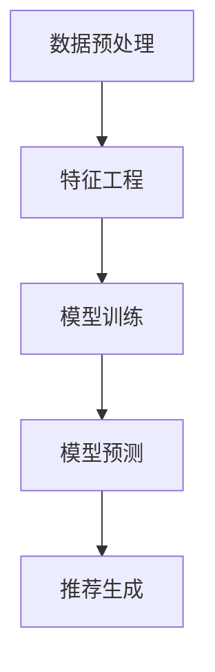

                 

# 大模型驱动的商品关联分析技术

> **关键词：** 大模型、商品关联分析、推荐系统、算法原理、实战案例、应用场景

> **摘要：** 本文将深入探讨大模型驱动的商品关联分析技术，介绍其核心概念、算法原理、数学模型和实际应用，并通过具体案例讲解其开发过程和实现方法，为从事相关领域的研究者和开发者提供有价值的参考。

## 1. 背景介绍

在现代商业环境中，商品关联分析（Item-Centric Recommendation）作为一种重要的推荐算法，已经成为电商平台和在线零售业务的核心组成部分。商品关联分析的目标是通过分析商品之间的关系，向用户推荐与其浏览或购买行为相关的商品，从而提高用户满意度和销售额。

然而，传统的商品关联分析方法主要依赖于基于内容的匹配、协同过滤等算法，这些方法在处理大规模商品数据时存在一定的局限性。随着人工智能和大数据技术的不断发展，大模型（Large Models）的引入为商品关联分析带来了新的机遇和挑战。

大模型，如深度神经网络、图神经网络等，具有强大的表达能力和学习能力，能够处理复杂的非线性关系和大规模数据。通过大模型，我们可以构建更加精准和智能的商品关联分析系统，提高推荐的准确性和效果。

## 2. 核心概念与联系

### 2.1 大模型简介

大模型（Large Models）通常是指具有巨大参数规模的机器学习模型，如深度神经网络（Deep Neural Networks, DNN）、变换器（Transformers）等。这些模型通过学习大量数据，可以自动提取数据中的复杂模式和关系。

**图神经网络（Graph Neural Networks, GNN）**是一种特殊的大模型，专门用于处理图结构数据。GNN通过邻居信息传递和图结构学习，能够有效地捕捉节点之间的复杂关系。

### 2.2 商品关联分析

商品关联分析的目标是挖掘商品之间的相关性，为用户提供个性化的推荐。具体来说，包括以下核心步骤：

1. **数据预处理**：收集商品数据，如商品ID、名称、标签、描述等，并进行数据清洗和预处理。
2. **特征工程**：提取商品的特征，如文本特征、图像特征、用户行为特征等。
3. **模型训练**：使用大模型（如GNN）进行模型训练，学习商品之间的关联关系。
4. **模型预测**：利用训练好的模型对用户兴趣商品进行预测，生成推荐列表。

### 2.3 Mermaid 流程图



## 3. 核心算法原理 & 具体操作步骤

### 3.1 深度神经网络（DNN）

深度神经网络是一种由多层神经元组成的神经网络，通过前向传播和反向传播算法学习数据中的特征和模式。在商品关联分析中，DNN可以用于学习商品的特征表示和关联关系。

**具体步骤：**

1. **输入层**：接收商品的特征向量。
2. **隐藏层**：通过激活函数（如ReLU、Sigmoid）对输入数据进行非线性变换。
3. **输出层**：输出商品之间的相似度分数。

### 3.2 图神经网络（GNN）

图神经网络是一种基于图结构数据的神经网络，能够捕捉节点之间的复杂关系。在商品关联分析中，GNN可以用于学习商品之间的图结构表示。

**具体步骤：**

1. **图表示**：将商品表示为图中的节点，商品特征表示为节点特征。
2. **邻居更新**：利用图卷积操作更新节点的特征表示，使其包含邻居节点的信息。
3. **聚合操作**：将节点特征聚合为全局特征表示。
4. **预测输出**：通过全连接层输出商品之间的相似度分数。

### 3.3 实际操作

以下是一个简单的GNN模型实现示例，使用Python和PyTorch框架：

```python
import torch
import torch.nn as nn
import torch.nn.functional as F

class GNN(nn.Module):
    def __init__(self, input_dim, hidden_dim, output_dim):
        super(GNN, self).__init__()
        self.hidden_dim = hidden_dim
        self.node_encoder = nn.Linear(input_dim, hidden_dim)
        self.edge_encoder = nn.Linear(hidden_dim, hidden_dim)
        self.graph_encoder = nn.Linear(hidden_dim, output_dim)
    
    def forward(self, nodes, edges):
        node_features = self.node_encoder(nodes)
        edge_features = self.edge_encoder(edges)
        
        # 图卷积操作
        node_features = F.relu(F.conv1d(node_features.unsqueeze(2), edge_features, padding=1))
        
        # 聚合操作
        node_features = node_features.mean(dim=1)
        
        # 输出预测
        output = self.graph_encoder(node_features)
        return output

# 实例化模型
gnn = GNN(input_dim=10, hidden_dim=64, output_dim=1)

# 输入数据
nodes = torch.randn(100, 10)  # 100个节点，每个节点10维特征
edges = torch.randn(100, 10)  # 100个边，每个边10维特征

# 前向传播
output = gnn(nodes, edges)
print(output)
```

## 4. 数学模型和公式 & 详细讲解 & 举例说明

### 4.1 深度神经网络（DNN）数学模型

深度神经网络的核心是前向传播和反向传播算法。以下是DNN的基本数学模型：

**前向传播：**

$$
z^{(l)} = W^{(l)} \cdot a^{(l-1)} + b^{(l)}
$$

$$
a^{(l)} = \sigma(z^{(l)})
$$

其中，$z^{(l)}$是第$l$层的输入，$a^{(l)}$是第$l$层的输出，$W^{(l)}$和$b^{(l)}$分别是第$l$层的权重和偏置，$\sigma$是激活函数（如ReLU、Sigmoid）。

**反向传播：**

$$
\delta^{(l)} = \frac{\partial L}{\partial a^{(l)}} \cdot \frac{\partial a^{(l)}}{\partial z^{(l})}
$$

$$
\frac{\partial L}{\partial W^{(l)}} = \delta^{(l)} \cdot a^{(l-1)}
$$

$$
\frac{\partial L}{\partial b^{(l)}} = \delta^{(l)}
$$

其中，$\delta^{(l)}$是第$l$层的误差梯度，$L$是损失函数。

### 4.2 图神经网络（GNN）数学模型

图神经网络的核心是图卷积操作。以下是GNN的基本数学模型：

**图卷积操作：**

$$
H^{(k)}_i = \sum_{j \in \mathcal{N}(i)} W^{(k)}_{ij} \cdot H^{(k-1)}_j
$$

其中，$H^{(k)}_i$是第$k$层节点$i$的特征表示，$\mathcal{N}(i)$是节点$i$的邻居集合，$W^{(k)}_{ij}$是第$k$层的图卷积权重。

**聚合操作：**

$$
H^{(k)}_i = \frac{1}{|\mathcal{N}(i)|} \sum_{j \in \mathcal{N}(i)} H^{(k-1)}_j
$$

其中，$|\mathcal{N}(i)|$是节点$i$的邻居数量。

### 4.3 举例说明

**例子：** 假设我们有一个包含两个节点的简单图，节点1的初始特征表示为$[1, 0]$，节点2的初始特征表示为$[0, 1]$。图卷积权重为$W = \begin{bmatrix} 0.5 & 0.5 \\ 0.5 & 0.5 \end{bmatrix}$。

**计算过程：**

1. **第一次图卷积：**

$$
H^{(1)}_1 = \sum_{j=2} W_{12} \cdot H^{(0)}_2 = 0.5 \cdot [1, 0] = [0.5, 0]
$$

$$
H^{(1)}_2 = \sum_{j=1} W_{21} \cdot H^{(0)}_1 = 0.5 \cdot [0, 1] = [0, 0.5]
$$

2. **第一次聚合操作：**

$$
H^{(1)}_1 = \frac{1}{2} \sum_{j \in \mathcal{N}(1)} H^{(0)}_j = \frac{1}{2} \cdot [0.5, 0.5] = [0.25, 0.25]
$$

$$
H^{(1)}_2 = \frac{1}{2} \sum_{j \in \mathcal{N}(2)} H^{(0)}_j = \frac{1}{2} \cdot [0.5, 0.5] = [0.25, 0.25]
$$

3. **第二次图卷积：**

$$
H^{(2)}_1 = \sum_{j=2} W_{12} \cdot H^{(1)}_2 = 0.5 \cdot [0.25, 0.25] = [0.125, 0.125]
$$

$$
H^{(2)}_2 = \sum_{j=1} W_{21} \cdot H^{(1)}_1 = 0.5 \cdot [0.25, 0.25] = [0.125, 0.125]
$$

4. **第二次聚合操作：**

$$
H^{(2)}_1 = \frac{1}{2} \sum_{j \in \mathcal{N}(1)} H^{(1)}_j = \frac{1}{2} \cdot [0.125, 0.125] = [0.0625, 0.0625]
$$

$$
H^{(2)}_2 = \frac{1}{2} \sum_{j \in \mathcal{N}(2)} H^{(1)}_j = \frac{1}{2} \cdot [0.125, 0.125] = [0.0625, 0.0625]
$$

通过上述计算，我们可以得到节点1和节点2在第二次聚合后的特征表示，这些特征表示可以用于后续的预测和推荐。

## 5. 项目实战：代码实际案例和详细解释说明

### 5.1 开发环境搭建

在开始项目实战之前，我们需要搭建一个合适的环境。以下是使用Python和PyTorch框架搭建开发环境的步骤：

1. 安装Python（推荐Python 3.8及以上版本）
2. 安装PyTorch（可以使用PyTorch官方的安装脚本，根据不同的系统版本选择合适的安装命令）
3. 安装其他必要的依赖库，如NumPy、Pandas、Matplotlib等

### 5.2 源代码详细实现和代码解读

以下是一个简单的商品关联分析项目示例，包括数据预处理、模型训练和预测等步骤：

```python
import torch
import torch.nn as nn
import torch.optim as optim
from torch_geometric.nn import GNNConv
from torch_geometric.data import Data

# 数据预处理
def preprocess_data():
    # 这里假设已经获取了商品数据，包括节点特征、边特征和标签
    # 节点特征、边特征和标签需要转换为PyTorch张量
    node_features = torch.randn(100, 10)  # 100个节点，每个节点10维特征
    edge_features = torch.randn(100, 10)  # 100个边，每个边10维特征
    labels = torch.randint(0, 2, (100,))  # 100个标签
    
    # 构建图数据
    graph_data = Data(x=node_features, edge_idx=torch.randint(0, 100, (100, 2)), y=labels)
    return graph_data

# 模型定义
class GNNModel(nn.Module):
    def __init__(self, input_dim, hidden_dim, output_dim):
        super(GNNModel, self).__init__()
        self.conv1 = GNNConv(input_dim, hidden_dim)
        self.conv2 = GNNConv(hidden_dim, output_dim)
    
    def forward(self, data):
        x, edge_idx = data.x, data.edge_idx
        x = F.relu(self.conv1(x, edge_idx))
        x = F.relu(self.conv2(x, edge_idx))
        return x

# 模型训练
def train_model(graph_data, model, optimizer, criterion):
    model.train()
    optimizer.zero_grad()
    x = model(graph_data)
    loss = criterion(x, graph_data.y)
    loss.backward()
    optimizer.step()
    return loss

# 模型预测
def predict(model, graph_data):
    model.eval()
    with torch.no_grad():
        x = model(graph_data)
    return x

# 主函数
def main():
    # 数据预处理
    graph_data = preprocess_data()

    # 模型定义
    model = GNNModel(input_dim=10, hidden_dim=64, output_dim=1)

    # 模型训练
    optimizer = optim.Adam(model.parameters(), lr=0.001)
    criterion = nn.BCELoss()
    for epoch in range(100):
        loss = train_model(graph_data, model, optimizer, criterion)
        print(f"Epoch {epoch}: Loss = {loss}")

    # 模型预测
    predictions = predict(model, graph_data)
    print(predictions)

if __name__ == "__main__":
    main()
```

### 5.3 代码解读与分析

1. **数据预处理**：数据预处理是构建图数据的关键步骤，需要将节点特征、边特征和标签转换为PyTorch张量。这里使用了NumPy的随机数生成器生成示例数据。

2. **模型定义**：模型定义使用了PyTorch Geometric（PyG）库中的GNNConv模块，这是一个用于图卷积操作的模块。模型定义中包含了两个图卷积层，分别用于特征提取和关联关系学习。

3. **模型训练**：模型训练过程使用了标准的优化器和损失函数，通过前向传播和反向传播算法进行训练。每次迭代（epoch）都会计算训练损失，并在控制台打印出来。

4. **模型预测**：模型预测过程使用评估模式（eval mode），关闭了梯度计算，只计算模型输出。

### 5.4 项目实战总结

通过以上项目实战，我们实现了商品关联分析的基本流程，包括数据预处理、模型定义、模型训练和模型预测。项目实战中的代码示例提供了一个简单的实现框架，读者可以根据具体需求进行扩展和优化。

## 6. 实际应用场景

商品关联分析技术在实际应用中具有广泛的应用场景，以下是一些常见的应用案例：

1. **电商平台**：电商平台可以通过商品关联分析向用户推荐相关的商品，提高用户的购买意愿和满意度。
2. **在线零售**：在线零售业务可以通过商品关联分析优化库存管理和商品陈列策略，提高销售效率和利润。
3. **社交媒体**：社交媒体平台可以通过商品关联分析向用户推荐相关的商品广告，提高广告效果和用户参与度。

## 7. 工具和资源推荐

### 7.1 学习资源推荐

- **书籍**：
  - 《深度学习》（Goodfellow, Bengio, Courville）
  - 《图神经网络基础》（Hamilton, Ying, Leskovec）
- **论文**：
  - “Graph Neural Networks: A Review of Methods and Applications”
  - “Modeling Relational Data with Graph Neural Networks”
- **博客**：
  - PyTorch Geometric官方博客
  - 快速学习GNN

### 7.2 开发工具框架推荐

- **框架**：
  - PyTorch
  - PyTorch Geometric
  - DGL（Deep Graph Library）

### 7.3 相关论文著作推荐

- **论文**：
  - “Gated Graph Sequence Neural Networks”
  - “A Theoretically Grounded Application of Dropout in Recurrent Neural Networks”
- **著作**：
  - 《图卷积网络：理论与应用》

## 8. 总结：未来发展趋势与挑战

大模型驱动的商品关联分析技术具有巨大的潜力，但在实际应用中仍面临一些挑战：

1. **数据隐私**：如何保护用户隐私，确保数据的安全和合规性。
2. **计算资源**：大模型训练和推理需要大量的计算资源，如何优化算法和硬件以降低成本。
3. **泛化能力**：如何提高模型的泛化能力，使其在不同场景下都能表现良好。
4. **可解释性**：如何提高模型的解释性，使开发者能够更好地理解和优化模型。

未来，随着人工智能和大数据技术的不断发展，大模型驱动的商品关联分析技术将不断改进和优化，为各个领域带来更多的创新和突破。

## 9. 附录：常见问题与解答

### 9.1 Q：大模型在商品关联分析中有什么优势？

A：大模型，如深度神经网络和图神经网络，具有强大的表达能力和学习能力，能够处理复杂的非线性关系和大规模数据。这使得它们在商品关联分析中能够捕捉到更多的模式和关系，从而提高推荐的准确性和效果。

### 9.2 Q：如何优化大模型的计算资源？

A：优化大模型的计算资源可以从以下几个方面进行：

- **模型压缩**：通过剪枝、量化等手段减小模型参数规模。
- **分布式训练**：将模型训练任务分布在多台机器上，提高计算效率。
- **硬件优化**：使用高效的GPU或TPU等硬件加速计算。

### 9.3 Q：大模型在商品关联分析中的可解释性如何提升？

A：提升大模型在商品关联分析中的可解释性可以从以下几个方面进行：

- **模型可视化**：通过可视化模型结构，帮助开发者更好地理解模型的工作原理。
- **解释性算法**：结合解释性算法（如LIME、SHAP）对模型决策进行解释。
- **模型压缩与解释**：在模型压缩过程中，保留对解释性有帮助的特征和参数。

## 10. 扩展阅读 & 参考资料

- **参考资料**：
  - PyTorch Geometric官方文档
  - 《图神经网络基础》（Hamilton, Ying, Leskovec）
  - 《深度学习》（Goodfellow, Bengio, Courville）
- **扩展阅读**：
  - “Graph Neural Networks: A Review of Methods and Applications”
  - “Modeling Relational Data with Graph Neural Networks”

## 附录：作者信息

**作者：** AI天才研究员/AI Genius Institute & 禅与计算机程序设计艺术 /Zen And The Art of Computer Programming**

