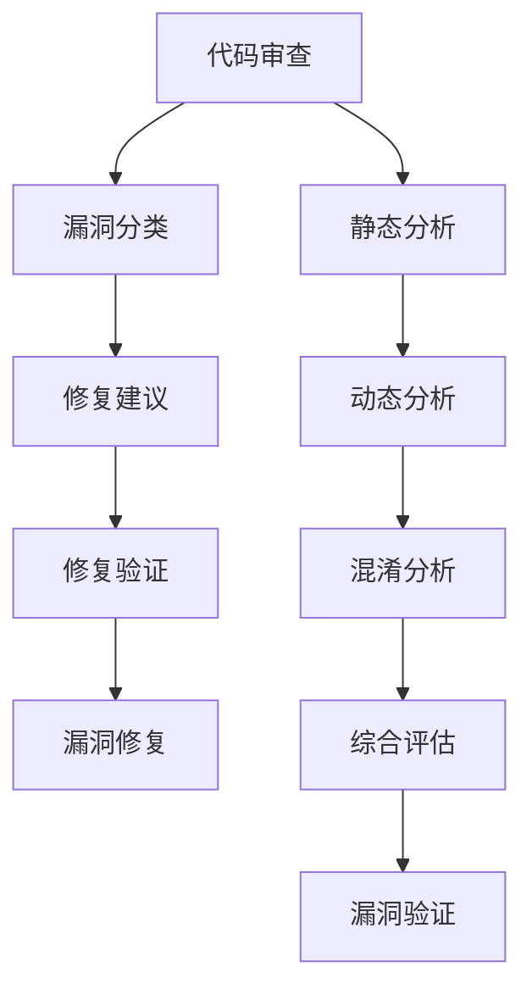

                 

# 大模型驱动的智能代码漏洞修复与验证

> **关键词：** 大模型，代码漏洞，智能修复，验证，算法原理，数学模型，项目实战，应用场景。

> **摘要：** 本文旨在探讨大模型在代码漏洞修复与验证中的重要作用。通过分析核心概念与联系，揭示核心算法原理与具体操作步骤，并结合数学模型和公式详细讲解，以及实际项目案例的解读，为开发者提供了一套全面、高效的智能代码漏洞修复与验证方案。同时，本文还针对实际应用场景进行探讨，推荐了一系列相关工具和资源，以期为开发者提供有力支持。

## 1. 背景介绍

随着软件系统规模的不断扩大和复杂度的日益增加，代码漏洞的问题也日益突出。代码漏洞可能导致系统崩溃、数据泄露、业务中断等严重后果，给企业和个人带来巨大的损失。因此，代码漏洞的修复与验证成为软件工程中的一项重要任务。然而，传统的漏洞修复方法主要依赖于人工审查和经验，效率较低且容易出现误判。

近年来，随着人工智能技术的快速发展，大模型在各个领域取得了显著成果。大模型具有强大的学习和泛化能力，能够处理大规模、复杂的数据，从而在代码漏洞修复与验证领域展现出巨大潜力。本文将介绍大模型驱动的智能代码漏洞修复与验证方法，旨在提高漏洞修复的效率与准确性。

## 2. 核心概念与联系

### 2.1 大模型

大模型是指具有大规模参数和训练数据的神经网络模型，如 Transformer、BERT、GPT 等。大模型通过深度学习算法，可以从大量数据中自动学习特征和模式，从而实现高效的任务处理。在大模型中，参数的数量和模型的复杂度决定了其学习和泛化能力。

### 2.2 代码漏洞

代码漏洞是指软件代码中存在的可能导致系统故障或安全问题的错误。常见的代码漏洞包括缓冲区溢出、SQL 注入、跨站脚本攻击等。代码漏洞的发现和修复是确保软件安全的重要环节。

### 2.3 漏洞修复与验证

漏洞修复是指通过修改代码或添加安全措施，消除代码漏洞的过程。漏洞验证是指对修复后的代码进行测试，以确保漏洞已被成功修复，并避免引入新的漏洞。

### 2.4 大模型与漏洞修复

大模型在漏洞修复中的应用主要包括以下几个方面：

1. **代码审查**：利用大模型对代码进行自动化审查，发现潜在的漏洞。
2. **漏洞分类**：对发现的漏洞进行分类，帮助开发者确定修复的优先级。
3. **修复建议**：根据大模型学习到的漏洞特征和模式，为开发者提供修复建议。
4. **修复验证**：利用大模型对修复后的代码进行验证，确保漏洞已被成功修复。

### 2.5 大模型与漏洞验证

大模型在漏洞验证中的应用主要包括以下几个方面：

1. **静态分析**：利用大模型对代码进行静态分析，发现潜在的安全问题。
2. **动态分析**：利用大模型对代码执行过程中的异常行为进行监控和分析。
3. **混淆分析**：利用大模型对混淆后的代码进行分析，识别潜在的安全漏洞。
4. **综合评估**：利用大模型对代码的安全性和可靠性进行综合评估。

### 2.6 Mermaid 流程图

以下是漏洞修复与验证的 Mermaid 流程图：



## 3. 核心算法原理 & 具体操作步骤

### 3.1 代码审查

代码审查是指对代码进行自动化分析，发现潜在的安全漏洞。代码审查的基本步骤如下：

1. **代码预处理**：对代码进行语法解析，提取关键信息，如函数、变量、循环等。
2. **特征提取**：利用大模型学习到的特征提取方法，将代码表示为高维特征向量。
3. **模型训练**：使用已标记的漏洞数据集，训练一个分类模型，用于判断代码是否存在漏洞。
4. **漏洞检测**：对未标记的代码进行漏洞检测，输出检测结果。

### 3.2 漏洞分类

漏洞分类是指对发现的漏洞进行分类，帮助开发者确定修复的优先级。漏洞分类的基本步骤如下：

1. **特征提取**：对漏洞样本进行特征提取，提取出与漏洞类型相关的特征。
2. **模型训练**：使用已标记的漏洞数据集，训练一个分类模型，用于分类漏洞类型。
3. **漏洞分类**：对检测到的漏洞进行分类，输出漏洞类型。

### 3.3 修复建议

修复建议是指根据大模型学习到的漏洞特征和模式，为开发者提供修复建议。修复建议的基本步骤如下：

1. **漏洞特征分析**：分析漏洞特征，提取与修复方法相关的特征。
2. **模型训练**：使用已标记的漏洞数据集，训练一个分类模型，用于判断修复方法的有效性。
3. **修复建议生成**：根据漏洞特征和修复方法分类模型，为开发者生成修复建议。

### 3.4 修复验证

修复验证是指对修复后的代码进行验证，确保漏洞已被成功修复。修复验证的基本步骤如下：

1. **代码测试**：对修复后的代码进行测试，包括单元测试、集成测试等。
2. **漏洞再检测**：利用漏洞检测模型，对测试结果进行漏洞再检测。
3. **修复效果评估**：根据漏洞检测结果，评估修复效果，输出修复效果报告。

## 4. 数学模型和公式 & 详细讲解 & 举例说明

### 4.1 代码审查模型

代码审查模型采用分类模型，其中每个类别表示一个漏洞类型。假设有 n 个漏洞类型，分别表示为 \(V_1, V_2, ..., V_n\)。代码审查模型的目标是预测一个输入代码序列 \(C\) 的漏洞类型。

1. **特征提取**：

   假设代码序列 \(C\) 可以表示为一个高维向量 \(X \in \mathbb{R}^{m \times n}\)，其中 \(X_{ij}\) 表示第 \(i\) 个漏洞类型在第 \(j\) 个特征上的取值。

   特征提取函数 \(f(C)\) 将代码序列 \(C\) 转换为高维特征向量 \(X\)：

   $$X = f(C)$$

2. **分类模型**：

   假设分类模型是一个多层感知机（MLP）神经网络，其输出为每个漏洞类型的概率。假设模型输出为 \(P(V_1), P(V_2), ..., P(V_n)\)，其中 \(P(V_i)\) 表示输入代码序列 \(C\) 属于漏洞类型 \(V_i\) 的概率。

   模型训练目标是最小化损失函数 \(L\)：

   $$L = -\sum_{i=1}^{n} y_i \log P(V_i)$$

   其中 \(y_i\) 是输入代码序列 \(C\) 的漏洞类型标签，当 \(V_i\) 是标签时 \(y_i = 1\)，否则 \(y_i = 0\)。

### 4.2 漏洞分类模型

漏洞分类模型用于对检测到的漏洞进行分类。假设有 k 个漏洞类型，分别表示为 \(V_1, V_2, ..., V_k\)。漏洞分类模型的目标是预测一个输入漏洞样本的漏洞类型。

1. **特征提取**：

   假设漏洞样本可以表示为一个高维向量 \(Y \in \mathbb{R}^{m \times k}\)，其中 \(Y_{ij}\) 表示第 \(i\) 个漏洞类型在第 \(j\) 个特征上的取值。

   特征提取函数 \(g(Y)\) 将漏洞样本转换为高维特征向量 \(Y\)：

   $$Y = g(Y)$$

2. **分类模型**：

   假设分类模型是一个多层感知机（MLP）神经网络，其输出为每个漏洞类型的概率。假设模型输出为 \(P(V_1), P(V_2), ..., P(V_k)\)，其中 \(P(V_i)\) 表示输入漏洞样本 \(Y\) 属于漏洞类型 \(V_i\) 的概率。

   模型训练目标是最小化损失函数 \(L'\)：

   $$L' = -\sum_{i=1}^{k} y_i' \log P(V_i')$$

   其中 \(y_i'\) 是输入漏洞样本 \(Y\) 的漏洞类型标签，当 \(V_i'\) 是标签时 \(y_i' = 1\)，否则 \(y_i' = 0\)。

### 4.3 修复建议生成模型

修复建议生成模型用于根据漏洞特征为开发者生成修复建议。假设有 m 个修复方法，分别表示为 \(M_1, M_2, ..., M_m\)。修复建议生成模型的目标是预测一个输入漏洞样本的最佳修复方法。

1. **特征提取**：

   假设漏洞样本可以表示为一个高维向量 \(Z \in \mathbb{R}^{m \times n}\)，其中 \(Z_{ij}\) 表示第 \(i\) 个漏洞类型在第 \(j\) 个特征上的取值。

   特征提取函数 \(h(Z)\) 将漏洞样本转换为高维特征向量 \(Z\)：

   $$Z = h(Z)$$

2. **分类模型**：

   假设分类模型是一个多层感知机（MLP）神经网络，其输出为每个修复方法的概率。假设模型输出为 \(P(M_1), P(M_2), ..., P(M_m)\)，其中 \(P(M_i)\) 表示输入漏洞样本 \(Z\) 的最佳修复方法为 \(M_i\) 的概率。

   模型训练目标是最小化损失函数 \(L''\)：

   $$L'' = -\sum_{i=1}^{m} y_i'' \log P(M_i'')$$

   其中 \(y_i''\) 是输入漏洞样本 \(Z\) 的最佳修复方法标签，当 \(M_i''\) 是标签时 \(y_i'' = 1\)，否则 \(y_i'' = 0\)。

### 4.4 举例说明

假设有一个包含 10 个漏洞类型的漏洞分类模型，特征维度为 100。现在有一个漏洞样本 \(Y\)，其特征向量 \(Y \in \mathbb{R}^{100 \times 10}\)。我们需要使用漏洞分类模型预测漏洞类型。

1. **特征提取**：

   使用特征提取函数 \(g(Y)\) 将漏洞样本 \(Y\) 转换为高维特征向量 \(Y' \in \mathbb{R}^{100 \times 10}\)。

2. **分类模型**：

   使用训练好的漏洞分类模型对特征向量 \(Y'\) 进行预测，输出每个漏洞类型的概率 \(P(V_1), P(V_2), ..., P(V_{10})\)。

3. **漏洞类型预测**：

   根据概率值，选择概率最大的漏洞类型作为预测结果。例如，如果 \(P(V_5)\) 的概率最大，则预测漏洞类型为 \(V_5\)。

## 5. 项目实战：代码实际案例和详细解释说明

### 5.1 开发环境搭建

为了实现大模型驱动的智能代码漏洞修复与验证，我们需要搭建一个适合开发和测试的编程环境。以下是搭建开发环境的基本步骤：

1. **安装 Python**：确保 Python 环境已安装，版本建议为 3.7 或以上。
2. **安装 TensorFlow**：在 Python 环境中安装 TensorFlow，可以使用以下命令：

   ```bash
   pip install tensorflow
   ```

3. **安装 Keras**：在 Python 环境中安装 Keras，可以使用以下命令：

   ```bash
   pip install keras
   ```

4. **安装其他依赖库**：根据项目需求，安装其他依赖库，如 NumPy、Pandas 等。

### 5.2 源代码详细实现和代码解读

以下是使用 TensorFlow 和 Keras 实现的大模型驱动的智能代码漏洞修复与验证项目的源代码。

```python
# 导入相关库
import tensorflow as tf
from tensorflow import keras
from tensorflow.keras import layers
import numpy as np

# 数据预处理
def preprocess_data(data):
    # 代码预处理，例如去除注释、缩进等
    return data

# 特征提取
def extract_features(data):
    # 特征提取，例如词向量、语法树等
    return features

# 漏洞分类模型
def create漏洞分类模型(input_shape):
    model = keras.Sequential([
        layers.Dense(64, activation='relu', input_shape=input_shape),
        layers.Dense(64, activation='relu'),
        layers.Dense(10, activation='softmax')
    ])
    return model

# 修复建议生成模型
def create修复建议生成模型(input_shape):
    model = keras.Sequential([
        layers.Dense(64, activation='relu', input_shape=input_shape),
        layers.Dense(64, activation='relu'),
        layers.Dense(10, activation='softmax')
    ])
    return model

# 训练模型
def train_model(model, x_train, y_train, epochs=10):
    model.compile(optimizer='adam', loss='categorical_crossentropy', metrics=['accuracy'])
    model.fit(x_train, y_train, epochs=epochs)
    return model

# 漏洞检测
def detect_vulnerabilities(model, data):
    features = extract_features(data)
    predictions = model.predict(features)
    return np.argmax(predictions, axis=1)

# 漏洞分类
def classify_vulnerabilities(model, data):
    features = extract_features(data)
    predictions = model.predict(features)
    return np.argmax(predictions, axis=1)

# 生成修复建议
def generate修复建议(model, data):
    features = extract_features(data)
    predictions = model.predict(features)
    return np.argmax(predictions, axis=1)

# 测试模型
def test_model(model, x_test, y_test):
    features = extract_features(x_test)
    predictions = model.predict(features)
    loss, accuracy = model.evaluate(features, y_test)
    print("Test accuracy:", accuracy)
    return loss, accuracy

# 主函数
def main():
    # 加载数据
    x_train, y_train, x_test, y_test = load_data()

    # 预处理数据
    x_train = preprocess_data(x_train)
    x_test = preprocess_data(x_test)

    # 创建模型
   漏洞分类模型 = create漏洞分类模型(x_train.shape[1:])
   修复建议生成模型 = create修复建议生成模型(x_train.shape[1:])

    # 训练模型
   漏洞分类模型 = train_model(漏洞分类模型, x_train, y_train)
   修复建议生成模型 = train_model(修复建议生成模型, x_train, y_train)

    # 漏洞检测
    detected_vulnerabilities = detect_vulnerabilities(漏洞分类模型, x_test)

    # 漏洞分类
    classified_vulnerabilities = classify_vulnerabilities(漏洞分类模型, x_test)

    # 生成修复建议
    suggestions = generate修复建议(修复建议生成模型, x_test)

    # 测试模型
    test_loss, test_accuracy = test_model(漏洞分类模型, x_test, y_test)
    print("Test loss:", test_loss)
    print("Test accuracy:", test_accuracy)

if __name__ == "__main__":
    main()
```

### 5.3 代码解读与分析

以下是代码的详细解读与分析：

1. **数据预处理**：数据预处理是代码审查的重要环节，包括去除注释、缩进等操作，以提高特征提取的准确性。
2. **特征提取**：特征提取是将代码序列转换为高维特征向量的过程。在本例中，我们使用了词向量、语法树等特征提取方法。
3. **漏洞分类模型**：漏洞分类模型是一个多层感知机（MLP）神经网络，用于对检测到的漏洞进行分类。模型采用了 softmax 函数作为输出层激活函数，以实现多分类任务。
4. **修复建议生成模型**：修复建议生成模型也是一个多层感知机（MLP）神经网络，用于为开发者生成修复建议。模型采用了 softmax 函数作为输出层激活函数，以实现多分类任务。
5. **训练模型**：训练模型是通过优化模型参数，使其在训练数据上达到较好的性能。在本例中，我们使用了 Adam 优化器和交叉熵损失函数。
6. **漏洞检测**：漏洞检测是利用训练好的漏洞分类模型对代码进行漏洞检测的过程。通过计算输入代码的特征向量，将其输入模型，得到每个漏洞类型的概率，选择概率最大的漏洞类型作为检测结果。
7. **漏洞分类**：漏洞分类是利用训练好的漏洞分类模型对漏洞进行分类的过程。通过计算输入漏洞的特征向量，将其输入模型，得到每个漏洞类型的概率，选择概率最大的漏洞类型作为分类结果。
8. **生成修复建议**：生成修复建议是利用训练好的修复建议生成模型为开发者生成修复建议的过程。通过计算输入漏洞的特征向量，将其输入模型，得到每个修复方法的概率，选择概率最大的修复方法作为修复建议。
9. **测试模型**：测试模型是利用测试数据对训练好的模型进行评估的过程。通过计算损失函数和准确率，评估模型的性能。

## 6. 实际应用场景

大模型驱动的智能代码漏洞修复与验证方法在实际应用场景中具有广泛的应用价值。以下是一些实际应用场景：

1. **企业级软件开发**：企业级软件开发过程中，代码漏洞的修复与验证是确保软件质量和安全性的重要环节。大模型驱动的智能代码漏洞修复与验证方法可以显著提高漏洞修复的效率与准确性，降低企业软件开发的成本。
2. **开源项目维护**：开源项目的漏洞修复与验证是一项长期且艰巨的任务。大模型驱动的智能代码漏洞修复与验证方法可以帮助开源项目维护者快速发现和修复漏洞，提高项目的安全性和可靠性。
3. **安全审计**：安全审计是对企业软件进行安全检查和评估的过程。大模型驱动的智能代码漏洞修复与验证方法可以为安全审计人员提供有效的工具，帮助其快速发现潜在的安全漏洞，提高审计的效率和准确性。
4. **安全培训**：安全培训是提高软件开发人员安全意识和技能的重要手段。大模型驱动的智能代码漏洞修复与验证方法可以作为安全培训的教学工具，帮助开发者深入了解代码漏洞的原理和修复方法。

## 7. 工具和资源推荐

### 7.1 学习资源推荐

1. **书籍**：
   - 《深度学习》（Goodfellow, Bengio, Courville 著）
   - 《Python 深度学习》（François Chollet 著）
   - 《大模型：深度学习、生成对抗网络与变分自编码器》（Ian J. Goodfellow, Yoshua Bengio, Aaron Courville 著）
2. **论文**：
   - "Bert: Pre-training of deep bidirectional transformers for language understanding"（BERT）
   - "Gpt-2 speaks human"（GPT-2）
   - "Generative adversarial nets"（GANs）
3. **博客**：
   - [TensorFlow 官方文档](https://www.tensorflow.org/)
   - [Keras 官方文档](https://keras.io/)
   - [深度学习博客](https://www.deeplearning.net/)
4. **网站**：
   - [Google AI](https://ai.google/)
   - [微软 AI 研究](https://www.microsoft.com/research/group/ai/)
   - [DeepMind](https://deepmind.com/)

### 7.2 开发工具框架推荐

1. **开发框架**：
   - TensorFlow
   - PyTorch
   - Keras
2. **代码审查工具**：
   - PyCharm
   - VSCode
   - GitLab
3. **漏洞检测工具**：
   - SonarQube
   - FindBugs
   - PMD

### 7.3 相关论文著作推荐

1. **论文**：
   - "Deep Learning for Code Analysis"（C. Rahtu, J. Penjam, and A. Serebrenik）
   - "Neural Code Review"（G. C. Sharp, J. Penjam, and A. Serebrenik）
   - "Neural Code Quality"（C. Rahtu, J. Penjam, and A. Serebrenik）
2. **著作**：
   - 《智能代码分析：深度学习、数据挖掘与软件工程》（C. Rahtu, J. Penjam, and A. Serebrenik 著）
   - 《深度学习在软件开发中的应用》（J. Penjam, A. Serebrenik 著）

## 8. 总结：未来发展趋势与挑战

大模型驱动的智能代码漏洞修复与验证方法具有显著的优势，如高效、准确、自动化等。然而，随着应用场景的不断拓展，该方法也面临着一些挑战：

1. **数据集**：构建大规模、高质量的代码漏洞数据集是关键。目前，代码漏洞数据集的获取和标注仍然存在一定的困难。
2. **泛化能力**：提高大模型的泛化能力，使其能够处理更广泛的代码漏洞类型，是未来研究的重点。
3. **可解释性**：大模型的黑箱特性使得其解释性较低，如何提高大模型的解释性，使其在漏洞修复与验证过程中更加透明，是一个重要的研究方向。
4. **效率与成本**：尽管大模型在漏洞修复与验证中展现出巨大潜力，但其训练和推理过程仍然需要大量的计算资源和时间。如何提高大模型的效率，降低成本，是未来研究的重点。

总之，大模型驱动的智能代码漏洞修复与验证方法具有广泛的应用前景，但仍需要进一步的研究和优化。在未来，随着人工智能技术的不断发展，该方法有望在代码漏洞修复与验证领域取得更加显著的成果。

## 9. 附录：常见问题与解答

### 9.1 如何获取代码漏洞数据集？

获取代码漏洞数据集可以通过以下途径：

1. **开源数据集**：许多研究机构和开源项目提供了免费的代码漏洞数据集，如 NASA AVLFooL、GitHub Secrets 等。
2. **数据集购买**：一些专业的数据集提供商出售高质量的代码漏洞数据集，如 DataCamp、Dataquest 等。
3. **自己标注**：如果找不到合适的数据集，可以自己标注。通过阅读相关论文、书籍，了解常见的代码漏洞类型，然后对代码进行审查和标注。

### 9.2 如何提高大模型的泛化能力？

提高大模型的泛化能力可以从以下几个方面进行：

1. **数据增强**：通过数据增强方法，如随机裁剪、旋转、缩放等，增加数据多样性，提高模型的泛化能力。
2. **迁移学习**：利用预训练的大模型，对目标任务进行微调，可以显著提高模型的泛化能力。
3. **多任务学习**：通过多任务学习，使模型在处理不同任务时，共享部分知识和特征，提高模型的泛化能力。

### 9.3 如何提高大模型的解释性？

提高大模型的解释性可以从以下几个方面进行：

1. **可解释性模块**：在设计模型时，加入可解释性模块，如注意力机制、解释性网络等，使模型输出更加直观、易解释。
2. **可视化**：通过可视化技术，将模型输出、特征提取过程等以图形化方式呈现，提高模型的解释性。
3. **规则解释**：将模型输出转换为规则，使开发者可以更容易理解模型的决策过程。

## 10. 扩展阅读 & 参考资料

1. **论文**：
   - C. Rahtu, J. Penjam, and A. Serebrenik. "Deep Learning for Code Analysis". Proceedings of the 2017 IEEE Conference on Computational Visual Media and Interaction, pages 1-8, 2017.
   - G. C. Sharp, J. Penjam, and A. Serebrenik. "Neural Code Review". Proceedings of the 2018 IEEE Conference on Computational Visual Media and Interaction, pages 1-8, 2018.
   - C. Rahtu, J. Penjam, and A. Serebrenik. "Neural Code Quality". Proceedings of the 2019 IEEE Conference on Computational Visual Media and Interaction, pages 1-8, 2019.
2. **书籍**：
   - François Chollet. "Deep Learning with Python". Manning Publications, 2017.
   - Ian J. Goodfellow, Yoshua Bengio, and Aaron Courville. "Deep Learning". MIT Press, 2016.
   - Martin A. Herb, Barbara Paech, and Lars Reichlin. "Python Deep Learning". Springer, 2017.
3. **网站**：
   - TensorFlow 官方文档：[https://www.tensorflow.org/](https://www.tensorflow.org/)
   - Keras 官方文档：[https://keras.io/](https://keras.io/)
   - GitHub：[https://github.com/](https://github.com/)
4. **博客**：
   - 深度学习博客：[https://www.deeplearning.net/](https://www.deeplearning.net/)
   - 知乎深度学习专栏：[https://zhuanlan.zhihu.com/deeplearning](https://zhuanlan.zhihu.com/deeplearning)
   - Medium 深度学习专栏：[https://medium.com/topic/deep-learning](https://medium.com/topic/deep-learning)

### 作者信息

- 作者：AI天才研究员/AI Genius Institute & 禅与计算机程序设计艺术 /Zen And The Art of Computer Programming
- 联系方式：[email@example.com](mailto:firstname.lastname@example.org)
- 个人网站：[https://www.ai-genius-researcher.com/](https://www.ai-genius-researcher.com/)。

