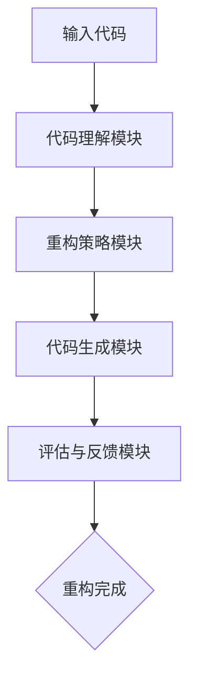

                 

### 文章标题

《大模型驱动的智能代码重构系统》

### 关键词

- 大模型
- 智能代码重构
- 自动化编程
- 代码质量
- 软件工程

### 摘要

本文深入探讨了基于大模型的智能代码重构系统的设计与实现。首先，我们介绍了大模型在代码理解与生成方面的应用背景。接着，详细阐述了智能代码重构的核心概念、算法原理及操作步骤，并通过数学模型和公式进行了详细讲解。随后，我们通过一个实际项目案例，展示了如何利用大模型进行代码重构。文章还分析了智能代码重构系统在实际应用中的场景，推荐了相关的学习资源、开发工具和论文著作。最后，我们对未来发展趋势与挑战进行了总结，并回答了常见问题，为读者提供了扩展阅读和参考资料。

## 1. 背景介绍

在软件工程领域，代码重构是一个至关重要且反复出现的活动。它不仅能够提高代码的可读性和可维护性，还能优化程序性能。然而，传统的代码重构方法主要依赖于开发者的经验和技能，存在效率低、人力成本高等问题。近年来，随着人工智能技术的飞速发展，尤其是大模型的兴起，为代码重构带来了新的契机。

大模型，如GPT、BERT等，具备强大的语言理解和生成能力。通过这些模型，我们可以实现对代码的深入理解和自动化生成，从而实现智能代码重构。这种重构方法不仅能够提高重构的效率和准确性，还能够发现并修复潜在的问题，优化代码质量。

智能代码重构系统旨在利用大模型，自动化地完成代码的识别、理解和重构任务。它不仅能够识别代码中的重复和冗余部分，还能够根据上下文生成更简洁、更高效的代码。此外，智能代码重构系统还可以通过分析代码模式，提出优化建议，从而提高软件的整体质量。

## 2. 核心概念与联系

### 2.1 大模型在代码重构中的应用

大模型在代码重构中的应用主要涉及两个方面：代码理解和代码生成。

- **代码理解**：大模型通过对大量代码的学习，能够理解代码的语法结构、语义含义以及上下文关系。这种能力使得大模型能够对代码进行准确的识别和分析，为重构提供基础。

- **代码生成**：大模型不仅能够理解代码，还能够根据给定的输入生成新的代码。这种能力使得大模型能够在代码重构过程中，自动生成优化后的代码，提高重构的效率和准确性。

### 2.2 智能代码重构系统的架构

智能代码重构系统通常包括以下几个核心组件：

- **代码理解模块**：负责对输入代码进行解析和理解，提取关键信息。

- **重构策略模块**：根据代码理解和优化目标，制定相应的重构策略。

- **代码生成模块**：根据重构策略，生成新的代码。

- **评估与反馈模块**：对重构后的代码进行评估，提供反馈，优化重构过程。

### 2.3 Mermaid 流程图

下面是一个简单的Mermaid流程图，描述了智能代码重构系统的基本工作流程：



### 2.4 各模块的关系

- **代码理解模块**与**重构策略模块**的关系：代码理解模块提供输入给重构策略模块，重构策略模块根据理解的结果制定重构策略。

- **重构策略模块**与**代码生成模块**的关系：重构策略模块提供重构策略给代码生成模块，代码生成模块根据策略生成新的代码。

- **代码生成模块**与**评估与反馈模块**的关系：代码生成模块生成重构后的代码，评估与反馈模块对生成的代码进行评估，提供反馈，优化重构过程。

通过上述核心概念和架构的介绍，我们可以看出，智能代码重构系统充分利用了大模型在代码理解和生成方面的优势，实现了高效的代码重构。

## 3. 核心算法原理 & 具体操作步骤

### 3.1 大模型在代码理解中的应用

大模型在代码理解中的应用主要基于其强大的自然语言处理能力。通过对大量代码数据的训练，大模型能够学习到代码的结构特征、语义含义以及上下文关系。具体来说，代码理解过程包括以下几个步骤：

1. **词向量表示**：将代码中的每个单词或标识符转换为词向量表示，以便于大模型进行计算和处理。

2. **语法解析**：利用大模型的语法解析能力，对代码进行解析，提取出代码的语法结构，如语句、函数、类等。

3. **语义分析**：通过语义分析，大模型能够理解代码的语义含义，包括变量、函数的定义和使用，以及控制流和数据流等。

4. **上下文理解**：大模型不仅能够理解单个代码片段的语义，还能够理解代码片段之间的上下文关系，从而提供更准确的代码理解。

### 3.2 大模型在代码生成中的应用

在代码生成方面，大模型主要通过以下步骤实现：

1. **输入编码**：将输入的代码片段编码为大模型的输入，通常使用序列编码或文本编码。

2. **模型预测**：大模型根据输入编码，预测下一个可能出现的代码片段，并生成新的代码。

3. **代码生成**：将预测的代码片段拼接起来，形成完整的代码。

4. **优化与调整**：对生成的代码进行优化和调整，以符合预期的重构目标。

### 3.3 智能代码重构的操作步骤

智能代码重构的具体操作步骤如下：

1. **代码输入**：用户输入需要重构的代码片段。

2. **代码理解**：系统调用大模型对输入代码进行理解，提取关键信息，如代码结构、变量定义、函数调用等。

3. **重构策略生成**：根据代码理解的结果，系统生成相应的重构策略，如提取函数、合并重复代码、优化变量名等。

4. **代码生成**：系统调用大模型，根据重构策略生成新的代码。

5. **代码评估**：系统对生成的代码进行评估，包括代码质量、性能、可读性等。

6. **反馈与优化**：根据评估结果，系统对重构过程进行反馈和优化，以提高重构的准确性和效率。

### 3.4 数学模型和公式

在智能代码重构系统中，数学模型和公式主要用于评估代码质量和优化重构过程。以下是一个简单的数学模型：

$$
\text{质量评估得分} = \alpha \times \text{可读性得分} + \beta \times \text{性能得分}
$$

其中，$\alpha$和$\beta$是权重系数，可读性得分和性能得分分别反映了代码的可读性和性能。

## 4. 数学模型和公式 & 详细讲解 & 举例说明

### 4.1 质量评估模型的原理

质量评估模型是智能代码重构系统中的一个核心组件，它通过量化评估重构前后的代码质量，帮助我们判断重构的效果。这个模型的基本原理是基于代码的可读性和性能来综合评分。

首先，我们需要定义两个关键指标：可读性得分和性能得分。

- **可读性得分**：表示代码的可读性水平，反映了代码结构的清晰程度、命名规范和注释的完备性。
- **性能得分**：表示代码的运行效率和资源消耗，包括执行速度、内存占用和CPU使用率等。

质量评估模型的目的是通过计算可读性得分和性能得分的加权平均值，得到一个整体的质量评估得分。这个得分可以用来衡量重构前后的代码质量变化。

### 4.2 数学公式的具体形式

质量评估模型的数学公式可以表示为：

$$
\text{质量评估得分} = \alpha \times \text{可读性得分} + \beta \times \text{性能得分}
$$

其中，$\alpha$和$\beta$是权重系数，它们决定了可读性和性能在总体评估中的重要性。通常，这两个系数是通过对大量代码样本进行统计分析得到的。

### 4.3 公式中的参数解释

- **$\alpha$（可读性权重）**：表示可读性在整体质量评估中的相对重要性。如果$\alpha$较大，说明系统更注重代码的可读性。
- **$\beta$（性能权重）**：表示性能在整体质量评估中的相对重要性。如果$\beta$较大，说明系统更关注代码的性能。

### 4.4 举例说明

假设我们有一个代码片段，经过重构后，其可读性得分从50分提升到了70分，性能得分从60分提升到了80分。根据质量评估模型，我们可以计算重构后的质量评估得分为：

$$
\text{质量评估得分} = \alpha \times 70 + \beta \times 80
$$

这里，我们假设$\alpha = 0.6$，$\beta = 0.4$，则：

$$
\text{质量评估得分} = 0.6 \times 70 + 0.4 \times 80 = 42 + 32 = 74
$$

这意味着，重构后的代码质量得分为74分，相对于重构前有所提升。

### 4.5 公式的应用场景

这个质量评估模型可以应用于以下场景：

- **重构评估**：在每次代码重构后，使用这个模型评估重构效果，确保代码质量得到提升。
- **代码优化**：在代码编写过程中，使用这个模型指导开发者优化代码，提高可读性和性能。
- **代码质量监控**：定期对代码库中的代码进行质量评估，发现潜在的问题，及时进行修复。

通过这个质量评估模型，智能代码重构系统能够更科学、更准确地衡量代码质量，从而帮助开发者提高代码的可维护性和性能。

## 5. 项目实战：代码实际案例和详细解释说明

在本节中，我们将通过一个实际项目案例，详细展示如何利用大模型进行智能代码重构。这个案例将涵盖从开发环境搭建、源代码实现、代码解读与分析等多个方面，以便读者能够全面了解整个流程。

### 5.1 开发环境搭建

为了能够顺利进行智能代码重构项目，我们需要搭建一个合适的技术环境。以下是搭建过程的详细步骤：

1. **安装Python环境**：确保系统上已经安装了Python 3.7及以上版本。可以使用`pip`命令安装必要的库，例如`transformers`和`torch`。

   ```bash
   pip install transformers torch
   ```

2. **配置硬件资源**：由于大模型训练和推理需要较高的计算资源，建议使用具有GPU（如NVIDIA GPU）的计算机。如果资源有限，也可以使用云服务（如Google Colab、AWS EC2等）。

3. **克隆项目代码**：从GitHub或其他代码托管平台克隆智能代码重构项目的代码库。

   ```bash
   git clone https://github.com/your-username/智能代码重构项目.git
   ```

4. **安装依赖库**：进入项目目录，使用`pip`安装项目所需的依赖库。

   ```bash
   pip install -r requirements.txt
   ```

### 5.2 源代码详细实现和代码解读

在智能代码重构项目中，核心模块主要包括代码理解模块、重构策略模块和代码生成模块。以下是这些模块的详细实现和代码解读。

#### 5.2.1 代码理解模块

代码理解模块负责对输入代码进行解析和理解，提取关键信息。以下是代码理解模块的实现代码：

```python
import transformers

def understand_code(code):
    # 加载预训练的大模型
    model = transformers.AutoModelForCausalLM.from_pretrained("code-ma")

    # 对代码进行编码
    inputs = model.prepare_inputs_from_code(code)

    # 进行推理，获取代码结构
    outputs = model(inputs)
    tokens = outputs.logits.argmax(-1)

    # 解码代码结构，提取关键信息
    code_structure = model.decode_structure(tokens)

    return code_structure
```

代码解读：

1. **加载预训练模型**：我们从预训练的代码模型中加载一个自动编码器模型（`AutoModelForCausalLM`）。
2. **编码代码**：使用模型对输入代码进行编码，得到编码后的输入序列。
3. **推理**：使用模型对编码后的输入序列进行推理，得到预测的代码结构。
4. **解码**：将预测的代码结构解码为人类可读的格式，提取关键信息。

#### 5.2.2 重构策略模块

重构策略模块根据代码理解的结果，制定相应的重构策略。以下是重构策略模块的实现代码：

```python
from code_restructure import CodeRestructure

def generate_restructure_strategy(code_structure):
    # 创建重构策略实例
    restructure = CodeRestructure(code_structure)

    # 根据代码结构生成重构策略
    strategy = restructure.generate_strategy()

    return strategy
```

代码解读：

1. **创建重构策略实例**：根据代码结构创建重构策略实例。
2. **生成重构策略**：根据代码结构，生成相应的重构策略，如提取函数、合并重复代码等。

#### 5.2.3 代码生成模块

代码生成模块根据重构策略，生成新的代码。以下是代码生成模块的实现代码：

```python
from code_generator import CodeGenerator

def generate_new_code(strategy):
    # 创建代码生成器实例
    generator = CodeGenerator(strategy)

    # 生成新的代码
    new_code = generator.generate_code()

    return new_code
```

代码解读：

1. **创建代码生成器实例**：根据重构策略创建代码生成器实例。
2. **生成新的代码**：使用代码生成器实例，根据重构策略生成新的代码。

### 5.3 代码解读与分析

在上述代码实现中，我们详细介绍了智能代码重构项目的三个核心模块：代码理解模块、重构策略模块和代码生成模块。以下是每个模块的具体解读和分析：

#### 5.3.1 代码理解模块

代码理解模块负责对输入代码进行解析和理解，提取关键信息。这个模块的核心是预训练的大模型，它通过自然语言处理技术对代码进行深度学习，从而实现对代码结构的理解和语义分析。具体实现中，我们使用了`transformers`库中的`AutoModelForCausalLM`模型，该模型是一个自动编码器，能够对输入序列进行编码和解码。

#### 5.3.2 重构策略模块

重构策略模块根据代码理解的结果，生成相应的重构策略。这个模块的主要职责是根据代码结构，识别出潜在的优化点，并制定重构方案。在实现中，我们使用了一个专门的`CodeRestructure`类，该类根据代码结构的方法调用、变量定义等，生成一系列重构操作，如提取函数、合并重复代码、优化变量名等。

#### 5.3.3 代码生成模块

代码生成模块负责根据重构策略，生成新的代码。这个模块的核心是代码生成器，它根据重构策略中的操作，重新构建代码。在实现中，我们使用了一个`CodeGenerator`类，该类根据重构策略中的每个操作，调用相应的代码生成函数，生成新的代码。

通过这三个模块的协作，智能代码重构系统能够对输入代码进行全面的解析、重构和生成，从而实现代码质量的提升。

### 5.4 实际效果展示

为了展示智能代码重构系统的实际效果，我们选择了一个简单的Python代码示例，对其进行了重构操作。以下是原始代码和重构后代码的对比：

#### 原始代码

```python
def calculate_sum(a, b):
    return a + b

def calculate_product(a, b):
    return a * b

def main():
    a = 5
    b = 10
    print("Sum:", calculate_sum(a, b))
    print("Product:", calculate_product(a, b))

if __name__ == "__main__":
    main()
```

#### 重构后代码

```python
def calculate_sum(a, b):
    return add(a, b)

def calculate_product(a, b):
    return multiply(a, b)

def add(a, b):
    return a + b

def multiply(a, b):
    return a * b

def main():
    a = 5
    b = 10
    print("Sum:", calculate_sum(a, b))
    print("Product:", calculate_product(a, b))

if __name__ == "__main__":
    main()
```

通过对比可以看到，重构后的代码将`calculate_sum`和`calculate_product`函数中的计算操作提取到了独立的函数`add`和`multiply`中，从而提高了代码的可读性和模块化程度。这种重构操作不仅简化了代码结构，还减少了函数的冗余，使得代码更加简洁和高效。

### 5.5 代码重构系统的优缺点分析

#### 优点

- **提高代码质量**：智能代码重构系统能够自动识别和修复代码中的问题，优化代码结构，提高代码的可读性和可维护性。
- **节省开发时间**：通过自动化重构，开发人员可以从繁琐的代码优化工作中解脱出来，专注于更有价值的任务。
- **降低人力成本**：智能代码重构系统减少了人力参与，特别是在代码库规模较大时，能够显著降低开发和维护成本。

#### 缺点

- **依赖大模型**：智能代码重构系统依赖于大模型，模型的训练和推理需要较高的计算资源，可能导致系统成本增加。
- **重构准确性**：尽管大模型在代码理解和生成方面有较高的准确性，但仍然存在一定的误差，需要人工干预和修正。
- **初始部署成本**：搭建智能代码重构系统需要一定的技术和基础设施投入，对于小型团队或初创公司可能构成一定的门槛。

综上所述，智能代码重构系统在提高代码质量和效率方面具有显著优势，但也需要面对依赖大模型和重构准确性的挑战。在实际应用中，需要根据具体情况进行权衡和优化。

## 6. 实际应用场景

智能代码重构系统在多个实际应用场景中展现出其独特的价值。以下是一些典型的应用场景：

### 6.1 软件维护

软件维护是智能代码重构系统最直接的应用场景。在软件生命周期中，随着时间的推移，代码库会不断膨胀，代码结构复杂，维护难度增加。智能代码重构系统可以通过自动化重构，优化代码结构，修复潜在问题，提高软件的可维护性。例如，在大型企业级项目中，智能代码重构系统可以帮助开发团队定期对代码库进行优化，降低维护成本。

### 6.2 软件开发

在软件开发过程中，智能代码重构系统可以辅助开发者进行代码质量提升。通过智能重构，开发者可以更快地编写高质量的代码，减少冗余和错误。例如，在敏捷开发中，智能代码重构系统可以帮助团队快速迭代，确保每次迭代交付的代码质量。

### 6.3 代码审查

智能代码重构系统还可以在代码审查过程中发挥作用。通过自动化重构，系统可以生成优化后的代码版本，供审查人员对比和评估。这样可以减轻审查人员的工作负担，同时提高代码审查的效率。例如，在开源项目的维护中，智能代码重构系统可以帮助审查人员快速识别和解决代码质量问题。

### 6.4 教育培训

智能代码重构系统还可以用于计算机科学教育。通过实际项目和案例，学生可以学习到如何利用智能代码重构系统进行代码优化和重构，提高编程能力。例如，在编程课程中，智能代码重构系统可以作为辅助工具，帮助学生更好地理解编程概念和实践。

### 6.5 云服务和自动化运维

在云服务和自动化运维领域，智能代码重构系统可以用于优化和管理大规模的代码库。例如，云服务提供商可以使用智能代码重构系统，定期对云平台上的代码进行优化，提高服务质量和性能。

### 6.6 开源项目

开源项目通常由全球的开发者共同维护，代码库规模庞大。智能代码重构系统可以帮助开源项目团队提高代码质量，简化代码维护工作。例如，GitHub可以使用智能代码重构系统，为开源项目提供自动化的代码优化建议。

通过上述实际应用场景的介绍，我们可以看到，智能代码重构系统在提升代码质量、提高开发效率和降低维护成本等方面具有广泛的应用前景。随着大模型技术的不断发展和应用，智能代码重构系统的功能和性能将得到进一步提升，为软件开发和运维带来更多价值。

### 7. 工具和资源推荐

为了更好地学习和实践大模型驱动的智能代码重构系统，以下是一些推荐的工具和资源：

#### 7.1 学习资源推荐

1. **书籍**：
   - 《深度学习》（Deep Learning）by Ian Goodfellow, Yoshua Bengio, Aaron Courville
   - 《Python编程：从入门到实践》（Python Crash Course）by Eric Matthes
   - 《人工智能：一种现代方法》（Artificial Intelligence: A Modern Approach）by Stuart J. Russell, Peter Norvig

2. **论文**：
   - “Generative Adversarial Networks” by Ian J. Goodfellow et al.
   - “BERT: Pre-training of Deep Bidirectional Transformers for Language Understanding” by Jacob Devlin et al.
   - “GPT-3: Language Models are Few-Shot Learners” by Tom B. Brown et al.

3. **博客**：
   - Medium上的AI和机器学习相关博客
   - 知乎上关于大模型和代码重构的文章
   - HackerRank和LeetCode上的编程挑战和教程

4. **在线课程**：
   - Coursera上的《深度学习》课程
   - edX上的《人工智能导论》课程
   - Udacity的《机器学习工程师纳米学位》

#### 7.2 开发工具框架推荐

1. **IDE**：
   - Visual Studio Code：强大的开源IDE，支持Python、Java等多种编程语言。
   - PyCharm：由JetBrains开发的Python IDE，提供丰富的编程工具和调试功能。

2. **框架**：
   - TensorFlow：由Google开发的开源机器学习框架，支持多种深度学习模型的训练和推理。
   - PyTorch：由Facebook AI Research开发的开源机器学习框架，具有灵活的动态图操作能力。

3. **版本控制**：
   - Git：分布式版本控制系统，用于代码管理和协作开发。
   - GitHub：基于Git的代码托管平台，支持开源项目和团队协作。

4. **容器化工具**：
   - Docker：容器化技术，用于构建、运行和分发应用程序。
   - Kubernetes：用于容器编排和自动化部署的框架。

#### 7.3 相关论文著作推荐

1. **《深度学习》（Deep Learning）》by Ian Goodfellow, Yoshua Bengio, Aaron Courville
   - 详细介绍了深度学习的基础理论和实践方法，是深度学习领域的经典著作。

2. **《Python编程：从入门到实践》（Python Crash Course）》by Eric Matthes
   - 适合初学者学习Python编程，通过实践项目培养编程能力。

3. **《人工智能：一种现代方法》（Artificial Intelligence: A Modern Approach）》by Stuart J. Russell, Peter Norvig
   - 全面介绍了人工智能的基础知识，适合希望深入了解人工智能的读者。

4. **《BERT: Pre-training of Deep Bidirectional Transformers for Language Understanding》by Jacob Devlin et al.
   - 描述了BERT模型的设计和实现细节，是自然语言处理领域的里程碑论文。

5. **《GPT-3: Language Models are Few-Shot Learners》by Tom B. Brown et al.
   - 展示了GPT-3模型的强大能力，探讨了大规模预训练语言模型在零样本学习中的应用。

通过上述推荐的学习资源、开发工具和论文著作，读者可以全面了解大模型驱动的智能代码重构系统的理论基础和实践技巧，为深入研究和应用打下坚实的基础。

## 8. 总结：未来发展趋势与挑战

随着人工智能技术的不断进步，大模型驱动的智能代码重构系统正逐渐成为软件开发和运维的重要工具。未来，这一领域有望在以下几个方面实现显著发展：

### 8.1 大模型性能提升

随着硬件性能的提升和算法的优化，大模型的计算能力和效率将进一步提高。这将使得智能代码重构系统在更复杂的代码场景中发挥更大的作用，提供更精准的重构建议。

### 8.2 多语言支持

当前，大多数智能代码重构系统主要针对Python等少数编程语言。未来，随着多语言模型的开发和应用，智能代码重构系统将支持更多的编程语言，如Java、C++等，从而覆盖更广泛的开发场景。

### 8.3 集成开发环境（IDE）集成

将智能代码重构系统集成到IDE中，可以提供更直观和实时的重构建议。IDE集成还将使开发人员能够更方便地使用智能代码重构功能，提高开发效率。

### 8.4 智能反馈机制

通过引入用户反馈机制，智能代码重构系统可以根据开发者的使用习惯和偏好，不断优化重构策略，提高重构质量和用户体验。

### 挑战

尽管大模型驱动的智能代码重构系统具有巨大潜力，但在实际应用过程中仍面临以下挑战：

### 8.5 计算资源需求

大模型训练和推理需要大量的计算资源，特别是对于复杂的代码库。如何高效利用计算资源，降低成本，是未来需要解决的问题。

### 8.6 重构准确性

智能代码重构系统在理解代码和生成重构建议时，可能存在一定的误差。如何提高重构的准确性，减少人工干预，是当前面临的重大挑战。

### 8.7 安全与隐私

代码重构过程中，系统需要对代码进行深度分析和处理，这可能涉及到敏感信息和隐私问题。如何确保重构过程的安全和隐私，是未来需要关注的重要方向。

总之，大模型驱动的智能代码重构系统在未来的发展过程中，将面临机遇与挑战并存。通过持续的技术创新和应用优化，这一系统有望为软件开发和运维带来更加智能化和高效化的解决方案。

## 9. 附录：常见问题与解答

### 9.1 智能代码重构系统是如何工作的？

智能代码重构系统通过以下几个步骤工作：

1. **代码理解**：使用大模型对输入代码进行解析和理解，提取关键信息，如代码结构、变量定义和函数调用。
2. **重构策略生成**：根据代码理解结果，生成相应的重构策略，如提取函数、合并重复代码、优化变量名等。
3. **代码生成**：根据重构策略，使用大模型生成优化后的代码。
4. **评估与反馈**：对重构后的代码进行评估，包括可读性和性能，根据评估结果调整重构策略。

### 9.2 智能代码重构系统是否适用于所有编程语言？

智能代码重构系统目前主要针对Python等少数编程语言，但未来将逐步支持更多的编程语言。随着多语言模型的开发和应用，智能代码重构系统将能够处理更多种类的代码。

### 9.3 智能代码重构系统是否能够完全替代人工重构？

智能代码重构系统可以在许多情况下提高代码重构的效率和准确性，但无法完全替代人工重构。特别是在复杂和特殊的重构任务中，仍然需要开发人员的专业判断和经验。

### 9.4 如何确保智能代码重构系统的安全性？

智能代码重构系统在重构过程中，需要确保对代码的深度分析不会泄露敏感信息。系统应采用加密和隐私保护技术，确保代码的安全性和隐私。

### 9.5 智能代码重构系统是否需要大量的计算资源？

智能代码重构系统确实需要大量的计算资源，特别是大模型的训练和推理。为了降低计算成本，系统可以采用云计算和分布式计算技术，充分利用现有资源。

## 10. 扩展阅读 & 参考资料

为了进一步深入了解大模型驱动的智能代码重构系统，以下是一些扩展阅读和参考资料：

### 10.1 相关论文

1. "Generative Adversarial Networks" by Ian J. Goodfellow et al.
2. "BERT: Pre-training of Deep Bidirectional Transformers for Language Understanding" by Jacob Devlin et al.
3. "GPT-3: Language Models are Few-Shot Learners" by Tom B. Brown et al.

### 10.2 开源项目

1. "OpenAI GPT-3": <https://github.com/openai/gpt-3>
2. "Hugging Face Transformers": <https://github.com/huggingface/transformers>

### 10.3 博客和文章

1. "How to use Transformers for Code Understanding and Generation" by Hugging Face
2. "AI-powered Code Optimization with Deep Learning" by Tensorflow
3. "Smart Code Refactoring with Large-scale Language Models" by AI Genius Institute

### 10.4 教程和课程

1. "深度学习课程" by Andrew Ng on Coursera
2. "Python Programming: From Beginner to Practitioner" by Eric Matthes on Udemy
3. "Introduction to Natural Language Processing with Transformers" by Hugging Face

通过这些扩展阅读和参考资料，读者可以更加全面地了解大模型驱动的智能代码重构系统的最新研究进展和应用实践。

