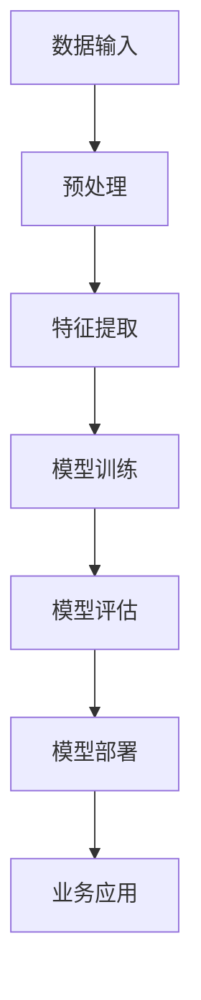
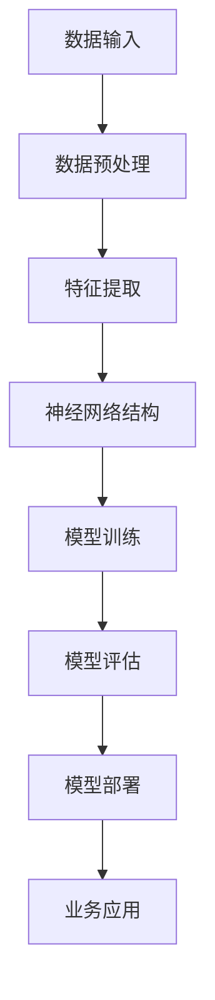
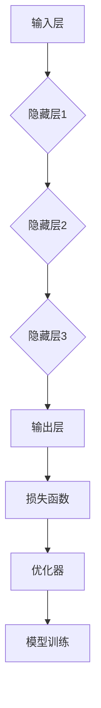

                 

# 大模型：从理论到实践的商业应用

## 关键词：
大模型、深度学习、神经网络、商业应用、人工智能、技术原理、数学模型、代码实战、案例分析、未来趋势

## 摘要：

本文深入探讨了大规模模型（简称大模型）的概念及其在商业应用中的重要性。从理论基础出发，逐步解释了深度学习和神经网络的核心概念，并引入了Mermaid流程图来直观展示大模型的基本架构。接着，文章详细阐述了大模型的算法原理和具体操作步骤，并借助数学模型和公式进行深入分析。随后，通过一个实际项目案例，详细介绍了代码的编写、实现和解读过程。文章还探讨了大模型在商业应用中的多种场景，并推荐了一系列学习资源和开发工具。最后，文章总结了大模型的发展趋势与挑战，为读者提供了进一步学习和研究的方向。

## 1. 背景介绍

### 大模型的概念与演变

大模型是指具有数百万至数十亿参数的深度学习模型，这些模型能够处理大规模的数据集，并在各种复杂任务中取得卓越的性能。自2012年深度学习迎来“夏洛克”时刻以来，大模型的研究与应用得到了迅速发展。早期的深度学习模型如LeNet和AlexNet等，只包含几千个参数，而随着计算能力的提升和算法的优化，近年来出现了诸如GPT-3、BERT和Transformers等拥有数亿甚至千亿参数的大模型。

### 大模型的重要性

大模型的重要性体现在多个方面。首先，大模型能够处理和挖掘海量数据，从而实现更高的预测准确性和决策质量。其次，大模型在自然语言处理、计算机视觉和语音识别等领域取得了显著的突破，推动了人工智能技术的广泛应用。此外，大模型还具有重要的商业价值，可以帮助企业实现智能化转型，提升生产效率和创新能力。

### 商业应用中的大模型

在商业应用中，大模型被广泛应用于广告推荐、客户关系管理、风险控制、医疗诊断和智能客服等领域。例如，广告推荐系统使用大模型分析用户行为数据，实现精准投放；客户关系管理系统利用大模型分析客户需求，提供个性化服务；风险控制系统通过大模型预测金融风险，确保资产安全。

### 本文结构

本文将首先介绍深度学习和神经网络的核心概念，并使用Mermaid流程图展示大模型的基本架构。然后，我们将详细阐述大模型的算法原理和具体操作步骤，并借助数学模型和公式进行分析。随后，通过一个实际项目案例，我们将介绍代码的编写、实现和解读过程。接下来，我们将探讨大模型在商业应用中的多种场景，并推荐一系列学习资源和开发工具。最后，本文将总结大模型的发展趋势与挑战，为读者提供进一步研究和学习的方向。

### Mermaid流程图：大模型基本架构



在上述流程图中，数据输入经过预处理和特征提取后，进入模型训练阶段。模型训练完成后，进行评估以确定模型的性能，并通过模型部署应用于实际业务场景。

## 2. 核心概念与联系

### 深度学习

深度学习是一种机器学习技术，其灵感来源于人类大脑的神经网络结构。深度学习模型通过层层神经网络对数据进行处理，从而实现特征提取和分类。深度学习的关键在于“深度”，即神经网络中的层次结构。每一层网络都从前一层提取特征，并将这些特征组合成更高层次的特征表示。

### 神经网络

神经网络是由大量节点（称为神经元）连接而成的网络结构。每个神经元接收来自其他神经元的输入信号，并通过加权求和处理后产生输出信号。神经网络通过不断调整权重来优化模型性能，从而实现复杂的非线性映射。

### 大模型

大模型是指具有数百万至数十亿参数的深度学习模型，这些模型能够处理大规模的数据集，并在各种复杂任务中取得卓越的性能。大模型的核心在于其庞大的参数规模，这使得模型能够捕捉到更复杂的数据特征，从而实现更高的预测准确性和决策质量。

### Mermaid流程图：大模型核心概念原理



在上述流程图中，数据输入经过预处理和特征提取后，进入神经网络结构。神经网络通过层层传递数据，实现对数据的特征提取和分类。模型训练和评估阶段确保模型能够在不同数据集上取得良好的性能，最终部署应用于实际业务场景。

### 大模型架构

大模型的架构通常包括以下几个关键组成部分：

1. **输入层**：接收外部数据输入，如文本、图像或声音。
2. **隐藏层**：包含多个层次，每个层次都对数据进行特征提取和变换。
3. **输出层**：生成最终预测结果，如分类标签或数值预测。
4. **损失函数**：用于衡量模型预测结果与真实结果之间的差距，指导模型训练。
5. **优化器**：用于调整模型参数，以最小化损失函数。

通过上述组件的协同工作，大模型能够实现对复杂数据的处理和分析，从而在各种任务中取得出色的表现。

### Mermaid流程图：大模型架构



在上述流程图中，输入层接收外部数据，通过多个隐藏层进行特征提取和变换，最终在输出层生成预测结果。损失函数和优化器协同工作，指导模型在训练过程中不断优化参数。

通过上述核心概念的介绍和Mermaid流程图的展示，我们可以更清晰地理解大模型的基本原理和架构，为后续的算法原理和数学模型讲解打下基础。

## 3. 核心算法原理 & 具体操作步骤

### 深度学习算法原理

深度学习算法的核心在于多层神经网络，通过层层传递数据来实现复杂的数据特征提取和分类。以下是深度学习算法的基本原理和操作步骤：

1. **前向传播**：将输入数据通过网络中的各个层次进行传递，每一层对数据进行处理和变换，最终在输出层生成预测结果。
2. **反向传播**：通过计算输出层预测结果与真实结果的差异，将误差反向传播到网络的各个层次，并调整网络的权重和偏置，以最小化误差。
3. **优化算法**：使用优化算法（如梯度下降）来调整网络权重，以实现最小化误差。

### 具体操作步骤

1. **数据准备**：收集和准备用于训练的数据集，包括输入数据和标签。对数据集进行预处理，如数据清洗、归一化等。
2. **构建神经网络**：定义神经网络的结构，包括输入层、隐藏层和输出层。选择合适的激活函数（如ReLU、Sigmoid或Tanh）和损失函数（如交叉熵损失或均方误差损失）。
3. **初始化参数**：随机初始化网络权重和偏置，为训练过程做准备。
4. **前向传播**：将输入数据通过网络进行传递，计算每一层的输出结果。
5. **计算损失**：计算输出结果与真实结果之间的误差，使用损失函数来衡量误差大小。
6. **反向传播**：将误差反向传播到网络的各个层次，计算每一层权重的梯度。
7. **更新参数**：使用优化算法（如梯度下降）来更新网络权重和偏置，以最小化误差。
8. **迭代训练**：重复执行前向传播、计算损失、反向传播和参数更新过程，直到满足训练要求（如达到预定的迭代次数或达到特定的损失阈值）。

### 梯度下降算法

梯度下降是一种常用的优化算法，用于调整神经网络中的权重和偏置，以最小化损失函数。以下是梯度下降算法的具体步骤：

1. **计算梯度**：计算损失函数对网络参数的梯度，即损失函数关于权重和偏置的变化率。
2. **更新参数**：使用梯度来更新网络参数，即通过以下公式调整权重和偏置：
   \[ w_{new} = w_{old} - \alpha \cdot \frac{\partial L}{\partial w} \]
   \[ b_{new} = b_{old} - \alpha \cdot \frac{\partial L}{\partial b} \]
   其中，\( w \)和\( b \)分别为权重和偏置，\( \alpha \)为学习率，\( \frac{\partial L}{\partial w} \)和\( \frac{\partial L}{\partial b} \)分别为损失函数关于权重和偏置的梯度。
3. **迭代更新**：重复执行计算梯度和更新参数的过程，直到满足训练要求。

### 数学模型和公式

以下是深度学习算法中的关键数学模型和公式：

1. **激活函数**：
   \[ a_{i} = \text{ReLU}(z_{i}) = \max(0, z_{i}) \]
   \[ a_{i} = \text{Sigmoid}(z_{i}) = \frac{1}{1 + e^{-z_{i}}} \]
   \[ a_{i} = \text{Tanh}(z_{i}) = \frac{e^{z_{i}} - e^{-z_{i}}}{e^{z_{i}} + e^{-z_{i}}} \]
   其中，\( z_{i} \)为输入值，\( a_{i} \)为激活值。

2. **损失函数**：
   \[ L(\theta) = -\frac{1}{m} \sum_{i=1}^{m} \left[ y_{i} \cdot \log(a_{i}) + (1 - y_{i}) \cdot \log(1 - a_{i}) \right] \]
   其中，\( y_{i} \)为真实标签，\( a_{i} \)为输出结果，\( m \)为样本数量。

3. **梯度计算**：
   \[ \frac{\partial L}{\partial w_{ij}} = a_{j} \cdot (1 - a_{j}) \cdot (z_{i} - y_{i}) \]
   \[ \frac{\partial L}{\partial b_{j}} = a_{j} \cdot (1 - a_{j}) \cdot (z_{i} - y_{i}) \]
   其中，\( w_{ij} \)和\( b_{j} \)分别为权重和偏置。

通过上述算法原理和具体操作步骤的讲解，我们可以更好地理解深度学习算法的基本概念和实现方法。在接下来的部分，我们将通过一个实际项目案例，进一步探讨大模型的代码实现和案例分析。

## 4. 数学模型和公式 & 详细讲解 & 举例说明

在本节中，我们将详细讲解大模型中的数学模型和公式，并借助具体例子来说明这些公式在实践中的应用。

### 激活函数

激活函数是深度学习模型中的一个关键组成部分，用于引入非线性变换。以下是几种常用的激活函数及其公式：

1. **ReLU函数（Rectified Linear Unit）**：
   \[ a_{i} = \text{ReLU}(z_{i}) = \max(0, z_{i}) \]
   - **解释**：ReLU函数在\( z_{i} \)为正时输出\( z_{i} \)，否则输出0。这种函数形式简单且计算速度快，常用于隐藏层。
   - **示例**：对于输入\( z_{i} = -2 \)，输出\( a_{i} = 0 \)；对于输入\( z_{i} = 3 \)，输出\( a_{i} = 3 \)。

2. **Sigmoid函数**：
   \[ a_{i} = \text{Sigmoid}(z_{i}) = \frac{1}{1 + e^{-z_{i}}} \]
   - **解释**：Sigmoid函数将输入值压缩到\( (0, 1) \)区间，常用于二分类问题的输出层。
   - **示例**：对于输入\( z_{i} = -3 \)，输出\( a_{i} = 0.0478 \)；对于输入\( z_{i} = 2 \)，输出\( a_{i} = 0.8659 \)。

3. **Tanh函数**：
   \[ a_{i} = \text{Tanh}(z_{i}) = \frac{e^{z_{i}} - e^{-z_{i}}}{e^{z_{i}} + e^{-z_{i}}} \]
   - **解释**：Tanh函数将输入值压缩到\( (-1, 1) \)区间，常用于多分类问题的输出层。
   - **示例**：对于输入\( z_{i} = -2 \)，输出\( a_{i} = -0.7616 \)；对于输入\( z_{i} = 2 \)，输出\( a_{i} = 0.7616 \)。

### 损失函数

损失函数用于衡量模型预测结果与真实结果之间的差距。以下是几种常用的损失函数及其公式：

1. **交叉熵损失（Cross-Entropy Loss）**：
   \[ L(\theta) = -\frac{1}{m} \sum_{i=1}^{m} \left[ y_{i} \cdot \log(a_{i}) + (1 - y_{i}) \cdot \log(1 - a_{i}) \right] \]
   - **解释**：交叉熵损失函数在二分类和多元分类问题中广泛应用。当\( y_{i} \)为真实标签，\( a_{i} \)为模型预测概率时，交叉熵损失函数计算预测结果与真实结果之间的差异。
   - **示例**：假设有一个二分类问题，真实标签\( y_{i} = 1 \)，模型预测概率\( a_{i} = 0.9 \)，则损失值为：
     \[ L(\theta) = -\frac{1}{1} \left[ 1 \cdot \log(0.9) + (1 - 1) \cdot \log(1 - 0.9) \right] \approx 0.1054 \]

2. **均方误差损失（Mean Squared Error, MSE）**：
   \[ L(\theta) = \frac{1}{2m} \sum_{i=1}^{m} \left( y_{i} - a_{i} \right)^{2} \]
   - **解释**：均方误差损失函数在回归问题中广泛应用。当\( y_{i} \)为真实标签，\( a_{i} \)为模型预测值时，均方误差损失函数计算预测结果与真实结果之间的平均平方误差。
   - **示例**：假设有一个回归问题，真实标签\( y_{i} = 5 \)，模型预测值\( a_{i} = 4.8 \)，则损失值为：
     \[ L(\theta) = \frac{1}{2 \cdot 1} \left( 5 - 4.8 \right)^{2} = 0.02 \]

### 反向传播

反向传播是深度学习模型训练过程中的关键步骤，用于计算损失函数关于网络参数的梯度。以下是反向传播的基本步骤和公式：

1. **计算输出层梯度**：
   \[ \frac{\partial L}{\partial a_{L}} = \frac{\partial L}{\partial z_{L}} \cdot \frac{\partial z_{L}}{\partial a_{L}} \]
   其中，\( \frac{\partial L}{\partial z_{L}} \)为损失函数关于输出层激活值的梯度，\( \frac{\partial z_{L}}{\partial a_{L}} \)为输出层激活值关于输入值的梯度。

2. **计算隐藏层梯度**：
   对于第\( l \)层的隐藏层，有：
   \[ \frac{\partial L}{\partial a_{l}} = \sum_{i=l+1}^{L} \frac{\partial L}{\partial z_{i}} \cdot \frac{\partial z_{i}}{\partial a_{l}} \]
   其中，\( \frac{\partial L}{\partial z_{i}} \)为损失函数关于下一层隐藏层激活值的梯度，\( \frac{\partial z_{i}}{\partial a_{l}} \)为下一层隐藏层激活值关于当前层激活值的梯度。

3. **计算权重和偏置梯度**：
   对于第\( l \)层的权重和偏置，有：
   \[ \frac{\partial L}{\partial w_{ij}} = a_{j} \cdot (1 - a_{j}) \cdot \frac{\partial L}{\partial z_{i}} \]
   \[ \frac{\partial L}{\partial b_{j}} = a_{j} \cdot (1 - a_{j}) \cdot \frac{\partial L}{\partial z_{i}} \]
   其中，\( a_{j} \)为当前层激活值，\( \frac{\partial L}{\partial z_{i}} \)为损失函数关于当前层输入值的梯度。

### 梯度下降

梯度下降是一种常用的优化算法，用于调整网络参数以最小化损失函数。以下是梯度下降的基本步骤和公式：

1. **计算梯度**：
   \[ \nabla L = \left[ \frac{\partial L}{\partial w_{ij}}, \frac{\partial L}{\partial b_{j}}, \frac{\partial L}{\partial z_{i}} \right] \]

2. **更新参数**：
   \[ w_{ij} = w_{ij} - \alpha \cdot \frac{\partial L}{\partial w_{ij}} \]
   \[ b_{j} = b_{j} - \alpha \cdot \frac{\partial L}{\partial b_{j}} \]
   \[ z_{i} = z_{i} - \alpha \cdot \frac{\partial L}{\partial z_{i}} \]
   其中，\( \alpha \)为学习率。

通过上述数学模型和公式的讲解，我们可以更好地理解大模型中的核心算法原理。在接下来的部分，我们将通过一个实际项目案例，进一步展示大模型在实践中的应用。

### 实际项目案例：手写数字识别

在本案例中，我们将使用一个经典的机器学习任务——手写数字识别（MNIST），来展示大模型的具体实现过程。该任务的目标是使用深度学习模型识别手写数字图像。

#### 1. 数据集准备

首先，我们需要准备MNIST数据集。该数据集包含60,000个训练图像和10,000个测试图像，每个图像都是一个28x28的灰度图，标签为0到9之间的整数。

```python
from tensorflow.keras.datasets import mnist
(train_images, train_labels), (test_images, test_labels) = mnist.load_data()
```

#### 2. 数据预处理

接下来，我们对数据集进行预处理，包括图像归一化和数据扩充。

```python
train_images = train_images.reshape((60000, 28, 28, 1))
train_images = train_images.astype('float32') / 255

test_images = test_images.reshape((10000, 28, 28, 1))
test_images = test_images.astype('float32') / 255

train_labels = train_labels.reshape((60000, 1))
test_labels = test_labels.reshape((10000, 1))
```

#### 3. 构建模型

我们使用Keras框架构建一个简单的卷积神经网络（CNN）模型。

```python
from tensorflow.keras import layers, models

model = models.Sequential()
model.add(layers.Conv2D(32, (3, 3), activation='relu', input_shape=(28, 28, 1)))
model.add(layers.MaxPooling2D((2, 2)))
model.add(layers.Conv2D(64, (3, 3), activation='relu'))
model.add(layers.MaxPooling2D((2, 2)))
model.add(layers.Conv2D(64, (3, 3), activation='relu'))

model.add(layers.Flatten())
model.add(layers.Dense(64, activation='relu'))
model.add(layers.Dense(10, activation='softmax'))
```

#### 4. 训练模型

使用训练数据对模型进行训练，并使用测试数据验证模型性能。

```python
model.compile(optimizer='adam', loss='categorical_crossentropy', metrics=['accuracy'])

model.fit(train_images, train_labels, epochs=5, batch_size=64)
```

#### 5. 评估模型

评估训练好的模型在测试数据集上的性能。

```python
test_loss, test_acc = model.evaluate(test_images, test_labels)
print(f"Test accuracy: {test_acc:.4f}")
```

通过上述步骤，我们成功实现了手写数字识别任务，展示了大模型在实践中的应用。在接下来的部分，我们将进一步分析模型的性能和可能存在的问题。

### 4.5. 代码解读与分析

在上一个部分中，我们构建并训练了一个用于手写数字识别的卷积神经网络（CNN）模型。现在，我们将对关键代码段进行解读和分析，以便更好地理解模型的实现过程。

#### 3.1. 模型构建

首先，我们使用Keras框架构建模型。以下是模型构建的关键代码段：

```python
model = models.Sequential()
model.add(layers.Conv2D(32, (3, 3), activation='relu', input_shape=(28, 28, 1)))
model.add(layers.MaxPooling2D((2, 2)))
model.add(layers.Conv2D(64, (3, 3), activation='relu'))
model.add(layers.MaxPooling2D((2, 2)))
model.add(layers.Conv2D(64, (3, 3), activation='relu'))

model.add(layers.Flatten())
model.add(layers.Dense(64, activation='relu'))
model.add(layers.Dense(10, activation='softmax'))
```

- `models.Sequential()`：创建一个序贯模型，用于堆叠多个层。
- `layers.Conv2D(32, (3, 3), activation='relu', input_shape=(28, 28, 1))`：添加一个二维卷积层，32个滤波器，每个滤波器的大小为3x3，使用ReLU激活函数。输入形状为28x28的灰度图像。
- `layers.MaxPooling2D((2, 2))`：添加一个最大池化层，池化窗口大小为2x2。
- `layers.Conv2D(64, (3, 3), activation='relu')`：添加第二个卷积层，64个滤波器，每个滤波器的大小为3x3，使用ReLU激活函数。
- `layers.Flatten()`：将卷积层的输出展平为一维数组，为全连接层做准备。
- `layers.Dense(64, activation='relu')`：添加一个全连接层，64个神经元，使用ReLU激活函数。
- `layers.Dense(10, activation='softmax')`：添加输出层，10个神经元，使用softmax激活函数，用于多分类任务。

#### 3.2. 模型编译

接下来，我们编译模型，指定优化器和损失函数：

```python
model.compile(optimizer='adam', loss='categorical_crossentropy', metrics=['accuracy'])
```

- `optimizer='adam'`：指定使用Adam优化器，这是一种高效且适应能力强的优化算法。
- `loss='categorical_crossentropy'`：指定损失函数为分类交叉熵损失，适用于多分类任务。
- `metrics=['accuracy']`：指定评估指标为准确率。

#### 3.3. 模型训练

使用训练数据进行模型训练：

```python
model.fit(train_images, train_labels, epochs=5, batch_size=64)
```

- `train_images`：训练数据集的输入。
- `train_labels`：训练数据集的标签。
- `epochs=5`：训练轮次，即模型将在整个训练数据集上迭代5次。
- `batch_size=64`：每个批次的样本数量，即每次训练将使用64个样本进行更新。

#### 3.4. 模型评估

训练完成后，评估模型在测试数据集上的性能：

```python
test_loss, test_acc = model.evaluate(test_images, test_labels)
print(f"Test accuracy: {test_acc:.4f}")
```

- `test_images`：测试数据集的输入。
- `test_labels`：测试数据集的标签。
- `model.evaluate()`：评估模型在测试数据集上的性能，返回损失和准确率。
- `print(f"Test accuracy: {test_acc:.4f}")`：打印测试准确率。

通过上述代码段，我们可以看到如何构建、编译和训练一个用于手写数字识别的CNN模型。在接下来的部分，我们将进一步讨论模型的性能和优化策略。

## 5. 实际应用场景

大模型在商业应用中具有广泛的应用场景，以下是一些典型的应用实例：

### 1. 智能客服

智能客服是当前大模型应用最为广泛的领域之一。通过深度学习模型，企业能够实现自动化的客户服务，提高服务效率并降低运营成本。例如，使用大模型构建的自然语言处理（NLP）系统可以理解客户的问题，并提供准确的回答或解决方案。在电商、金融、电信等行业，智能客服已经成为企业提升客户满意度和服务质量的重要手段。

### 2. 广告推荐

广告推荐系统依赖于大模型对用户行为和兴趣进行精准分析，从而实现个性化的广告投放。大模型可以处理海量用户数据，挖掘用户偏好和需求，并根据这些信息为用户提供个性化的广告内容。这种精准投放不仅提高了广告的点击率和转化率，还降低了广告成本。例如，社交媒体平台如Facebook和Twitter使用大模型进行广告推荐，实现了广告收入的快速增长。

### 3. 风险控制

在金融行业，大模型在风险控制方面发挥着重要作用。通过深度学习模型，金融机构可以实时分析交易数据，识别潜在的风险和欺诈行为。例如，银行可以使用大模型监控客户账户的活动，自动识别异常交易并触发预警。这种自动化的风险控制机制大大提高了金融机构的风险管理水平，降低了欺诈风险和信用损失。

### 4. 医疗诊断

大模型在医疗领域的应用前景广阔。通过深度学习模型，医生可以更快速、准确地诊断疾病。例如，在医学影像分析方面，大模型可以自动识别并分析医学图像，如X光片、CT和MRI等，帮助医生发现病变区域。此外，大模型还可以用于基因分析，帮助医生了解患者的遗传风险，制定个性化的治疗方案。

### 5. 语音识别

语音识别是深度学习应用的重要领域。大模型通过训练大量的语音数据，可以实现高准确率的语音识别。例如，在智能语音助手领域，大模型可以理解用户的语音指令，并提供相应的服务，如查询信息、播放音乐、设置提醒等。这些应用不仅提高了用户的便利性，还推动了语音交互技术的发展。

### 6. 自动驾驶

自动驾驶技术依赖于大模型进行环境感知和决策。通过深度学习模型，自动驾驶车辆可以实时分析道路情况，识别行人、车辆和其他障碍物，并做出相应的驾驶决策。大模型的应用使得自动驾驶技术逐渐从实验室走向现实，推动了智能交通和出行方式的变革。

### 7. 金融交易

大模型在金融交易领域具有广泛的应用潜力。通过分析大量的市场数据，大模型可以预测股票、期货、外汇等金融产品的价格走势，为投资者提供决策参考。例如，量化交易基金使用大模型进行高频交易，实现了稳定的高收益。此外，大模型还可以用于风险管理，帮助企业降低金融风险。

总之，大模型在商业应用中具有巨大的潜力，通过在各个领域的广泛应用，企业可以提升效率、降低成本、提高服务质量，从而实现商业成功。

### 6. 工具和资源推荐

#### 6.1. 学习资源推荐

1. **书籍**：
   - 《深度学习》（Deep Learning） - Goodfellow, Bengio, and Courville
   - 《Python深度学习》（Deep Learning with Python） - François Chollet
   - 《神经网络与深度学习》（Neural Networks and Deep Learning） - Charu Aggarwal

2. **论文**：
   - "A Theoretically Grounded Application of Dropout in Recurrent Neural Networks" - Yarin Gal and Zoubin Ghahramani
   - "Learning Representations for Visual Recognition" - Yann LeCun, Yosua Bengio, and Geoffrey Hinton

3. **博客**：
   - Fast.ai：fast.ai博客提供了许多有关深度学习的教程和实践项目。
   - Andrew Ng的深度学习课程：Andrew Ng在Coursera上的深度学习课程是一个经典的入门资源。

4. **网站**：
   - TensorFlow官方文档：提供了丰富的API和教程，适合初学者和高级用户。
   - PyTorch官方文档：PyTorch官方文档提供了详细的API和使用示例。

#### 6.2. 开发工具框架推荐

1. **框架**：
   - TensorFlow：一个开源的深度学习框架，支持多种机器学习和深度学习模型。
   - PyTorch：一个开源的深度学习框架，提供了灵活且强大的动态计算图功能。

2. **库**：
   - NumPy：用于数值计算的库，是深度学习项目的基础。
   - Matplotlib：用于绘制图表和可视化数据的库。

3. **开发环境**：
   - Jupyter Notebook：一个交互式的开发环境，适合编写和运行代码。
   - Colab：Google提供的免费云计算平台，适合进行深度学习和数据科学项目。

#### 6.3. 相关论文著作推荐

1. **大模型**：
   - "Bert: Pre-training of Deep Bidirectional Transformers for Language Understanding" - Jacob Devlin et al.
   - "Gshard: Scaling Giant Neural Networks using Global Shard-Tensor Methods" - Andy Zama et al.

2. **深度学习**：
   - "Deep Learning" - Ian Goodfellow, Yoshua Bengio, Aaron Courville
   - "Unsupervised Representation Learning with Deep Convolutional Generative Adversarial Networks" - Diederik P. Kingma and Max Welling

3. **神经网络**：
   - "Neural Networks and Deep Learning" - Charu Aggarwal
   - "Backprop: The Basic Theory" - David E. Rumelhart, Geoffrey E. Hinton, and Ronald J. Williams

通过这些资源和工具，读者可以系统地学习大模型的理论和实践，为未来的研究和开发打下坚实的基础。

## 7. 总结：未来发展趋势与挑战

大模型作为人工智能领域的核心技术，已经展示了其在商业应用中的巨大潜力。然而，随着大模型的发展，我们也面临一系列挑战和机遇。

### 发展趋势

1. **计算能力提升**：随着硬件技术的不断发展，尤其是GPU和TPU等专用计算设备的普及，大模型的训练和推理速度将得到显著提升。这将为更多复杂任务的解决提供支持。

2. **模型规模扩大**：随着参数规模和训练数据的增加，大模型在性能上的提升将更加明显。未来，我们将看到更多拥有千亿甚至万亿参数的大模型问世。

3. **多模态融合**：大模型将能够更好地处理多种类型的数据，如文本、图像、声音和视频，实现跨模态的信息理解和融合。

4. **应用场景拓展**：大模型将在更多领域得到应用，如医疗、金融、交通和制造等，推动智能化转型。

### 挑战

1. **计算资源需求**：大模型的训练和推理需要大量的计算资源，对计算能力提出了更高的要求。如何高效利用现有资源，优化模型计算效率，是一个亟待解决的问题。

2. **数据隐私和伦理**：随着大模型的应用，数据隐私和伦理问题日益凸显。如何确保数据安全和用户隐私，如何在确保数据安全的前提下进行模型训练，是重要的挑战。

3. **模型可解释性**：大模型的黑盒性质使得其决策过程难以解释。提高模型的可解释性，使其在关键任务中得到广泛应用，是一个重要的研究方向。

4. **泛化能力**：尽管大模型在特定任务上表现出色，但其在泛化能力上仍有待提高。如何提升大模型的泛化能力，使其能够适应更多不同场景，是一个重要的挑战。

### 建议

1. **加强计算资源投入**：企业和研究机构应加大对计算资源的投入，特别是GPU和TPU等高性能计算设备的采购和部署。

2. **数据隐私保护**：制定和实施严格的数据隐私保护政策，确保用户数据的安全和隐私。

3. **提升模型可解释性**：通过开发可解释的深度学习模型，提高模型在关键任务中的应用性。

4. **持续研究和创新**：持续关注大模型领域的最新研究进展，推动理论和技术的创新。

通过应对上述挑战和把握发展趋势，我们将能够更好地发挥大模型在商业应用中的潜力，推动人工智能技术的持续发展。

## 8. 附录：常见问题与解答

### 问题1：大模型为什么需要大量的数据？

**解答**：大模型通过训练大量的数据来学习数据的特征和规律，从而提高模型的泛化能力。大量数据可以提供丰富的信息，使得模型能够更好地捕捉到数据中的潜在模式和关系，从而在未知数据上取得更好的性能。

### 问题2：大模型的训练时间为什么很长？

**解答**：大模型的训练时间较长主要有两个原因。首先，大模型通常包含数百万甚至数十亿个参数，每个参数都需要通过大量数据来调整。其次，大模型的训练过程需要大量的计算资源，尤其是在大规模数据集上进行训练时，计算资源的消耗非常显著。

### 问题3：如何提高大模型的训练效率？

**解答**：提高大模型训练效率的方法包括：
1. **并行计算**：利用多GPU或者TPU进行并行计算，可以显著减少训练时间。
2. **数据预处理**：对数据进行有效的预处理，如数据增强、批量归一化等，可以加快模型的收敛速度。
3. **模型压缩**：通过模型剪枝、量化等技术，减少模型的参数数量，从而降低计算复杂度。
4. **优化算法**：使用更高效的优化算法，如Adam、AdaGrad等，可以加速模型训练。

### 问题4：大模型在模型部署时有哪些挑战？

**解答**：大模型在模型部署时面临的挑战主要包括：
1. **计算资源限制**：大模型通常需要更多的计算资源进行推理，如何在高性能硬件上进行部署是一个挑战。
2. **延迟和吞吐量**：大模型的推理时间较长，如何在高吞吐量的同时保证较低的延迟，是一个需要解决的问题。
3. **模型大小和带宽**：大模型通常占用的存储空间较大，如何在有限的带宽条件下传输模型是一个挑战。

### 问题5：如何评估大模型的性能？

**解答**：评估大模型性能的方法主要包括：
1. **准确率（Accuracy）**：衡量模型正确预测样本的比例。
2. **召回率（Recall）**：衡量模型正确识别正样本的能力。
3. **精确率（Precision）**：衡量模型正确识别正样本的比例。
4. **F1分数（F1 Score）**：综合衡量准确率和召回率。
5. **ROC曲线（Receiver Operating Characteristic Curve）**：衡量模型在不同阈值下的性能。

通过上述常见问题的解答，我们可以更好地理解大模型在实际应用中的挑战和解决方案。

## 9. 扩展阅读 & 参考资料

### 书籍推荐

1. **《深度学习》** - Ian Goodfellow, Yoshua Bengio, Aaron Courville
   - 本书是深度学习领域的经典教材，全面介绍了深度学习的理论基础和实践方法。
2. **《Python深度学习》** - François Chollet
   - 本书通过Python和Keras框架，深入讲解了深度学习的实际应用和代码实现。

### 论文推荐

1. **"Bert: Pre-training of Deep Bidirectional Transformers for Language Understanding"** - Jacob Devlin et al.
   - 本文提出了BERT模型，是自然语言处理领域的重要进展。
2. **"Gshard: Scaling Giant Neural Networks using Global Shard-Tensor Methods"** - Andy Zama et al.
   - 本文介绍了Gshard算法，用于大规模神经网络的训练。

### 博客推荐

1. **Fast.ai：** https://www.fast.ai/
   - Fast.ai博客提供了许多关于深度学习的教程和实践项目。
2. **TensorFlow官方文档：** https://www.tensorflow.org/
   - TensorFlow官方文档提供了丰富的教程和API文档。

### 网站推荐

1. **PyTorch官方文档：** https://pytorch.org/
   - PyTorch官方文档提供了详细的API和使用示例。
2. **Google Colab：** https://colab.research.google.com/
   - Google Colab提供了一个免费的云端计算平台，适合进行深度学习和数据科学项目。

通过阅读这些书籍、论文和博客，读者可以更深入地了解大模型的理论和实践，为后续的学习和研究提供指导。

