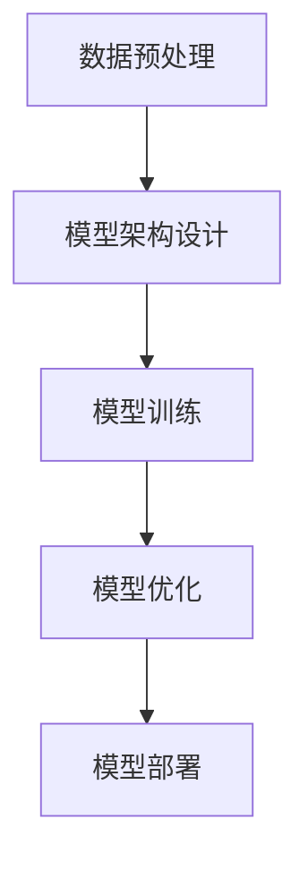

                 

# 大模型：数据与算法的完美结合

## 关键词：大模型、数据、算法、深度学习、神经网络、模型训练、优化、应用场景、未来趋势

## 摘要：

本文将深入探讨大模型的概念及其在当前技术领域的重要作用。我们将详细分析大模型的定义、数据与算法的结合方式，以及其背后的核心原理。通过实例和数学模型，我们将揭示大模型背后的复杂算法及其应用场景。此外，还将介绍当前最流行的大模型工具和资源，并展望其未来的发展趋势与挑战。

## 1. 背景介绍

### 1.1 大模型的概念

大模型，通常指的是具有数亿至数千亿参数的大型神经网络模型。这些模型在深度学习和人工智能领域得到了广泛应用，如自然语言处理、计算机视觉、推荐系统等。大模型的出现，标志着人工智能技术从“小而美”走向“大而全”的转变。

### 1.2 数据与算法的关系

数据是人工智能的基石，而算法则是数据的加工工具。在大模型中，数据与算法的关系尤为紧密。一方面，高质量的数据可以提升模型的性能；另一方面，优秀的算法可以更好地挖掘数据的价值。因此，大模型的成功离不开数据与算法的完美结合。

## 2. 核心概念与联系

### 2.1 深度学习与神经网络

深度学习是人工智能的一种重要分支，它基于神经网络进行模型训练。神经网络是一种模拟生物神经系统的计算模型，通过层层传递信息，实现对数据的建模与预测。

### 2.2 模型训练与优化

模型训练是指通过大量数据对神经网络模型进行调整，使其在特定任务上达到较高的性能。优化是指在模型训练过程中，通过调整参数，使模型收敛到最优状态。

### 2.3 数据与算法的融合

在大模型中，数据与算法的融合体现在以下几个方面：

- 数据预处理：对原始数据进行清洗、归一化等操作，使其适应模型训练的要求。  
- 模型架构设计：根据任务需求，设计适合的神经网络结构。  
- 模型训练：利用海量数据进行训练，调整模型参数。  
- 模型优化：通过调整模型参数，提升模型性能。

### 2.4 Mermaid 流程图

以下是一个简单的 Mermaid 流程图，展示了数据与算法的融合过程：



## 3. 核心算法原理 & 具体操作步骤

### 3.1 神经网络算法原理

神经网络算法的核心在于其多层结构。每一层都通过前一层的信息进行计算，并将结果传递到下一层。这个过程称为前向传播。当计算得到预测结果后，通过与真实标签进行比较，计算损失函数。然后，通过反向传播算法，将损失函数的梯度反向传播到每一层，更新模型参数。

### 3.2 具体操作步骤

以下是使用神经网络进行模型训练的四个主要步骤：

1. 数据预处理：对原始数据进行清洗、归一化等操作，使其适应模型训练的要求。  
2. 模型架构设计：根据任务需求，设计适合的神经网络结构。  
3. 模型训练：利用海量数据进行训练，调整模型参数。  
4. 模型优化：通过调整模型参数，提升模型性能。

### 3.3 算法示例

以下是一个简单的神经网络算法示例，用于实现二分类任务：

```python
import tensorflow as tf

# 定义神经网络结构
model = tf.keras.Sequential([
    tf.keras.layers.Dense(64, activation='relu', input_shape=(784,)),
    tf.keras.layers.Dense(64, activation='relu'),
    tf.keras.layers.Dense(1, activation='sigmoid')
])

# 编译模型
model.compile(optimizer='adam',
              loss='binary_crossentropy',
              metrics=['accuracy'])

# 加载训练数据
(x_train, y_train), (x_test, y_test) = tf.keras.datasets.mnist.load_data()

# 数据预处理
x_train = x_train / 255.0
x_test = x_test / 255.0

# 模型训练
model.fit(x_train, y_train, epochs=5, batch_size=32)

# 模型评估
model.evaluate(x_test, y_test)
```

## 4. 数学模型和公式 & 详细讲解 & 举例说明

### 4.1 数学模型

神经网络的核心在于其多层结构。每一层都通过前一层的信息进行计算，并将结果传递到下一层。这个过程称为前向传播。当计算得到预测结果后，通过与真实标签进行比较，计算损失函数。然后，通过反向传播算法，将损失函数的梯度反向传播到每一层，更新模型参数。

以下是神经网络的前向传播和反向传播的数学模型：

#### 前向传播：

假设有一个两层神经网络，输入为 \(x\)，输出为 \(y\)。其中，第一层的激活函数为 \(f_1\)，第二层的激活函数为 \(f_2\)。

$$
z_1 = W_1x + b_1 \\
a_1 = f_1(z_1) \\
z_2 = W_2a_1 + b_2 \\
a_2 = f_2(z_2)
$$

#### 反向传播：

在反向传播过程中，我们需要计算损失函数的梯度。对于二分类问题，常用的损失函数为交叉熵损失函数：

$$
J = -\frac{1}{m}\sum_{i=1}^{m}y_{i}\log(a_{2i})+(1-y_{i})\log(1-a_{2i})
$$

其中，\(m\) 为样本数量，\(y_i\) 为真实标签，\(a_{2i}\) 为预测概率。

然后，我们通过链式法则，计算损失函数关于各层参数的梯度：

$$
\frac{\partial J}{\partial W_2} = \frac{\partial J}{\partial a_{2i}} \frac{\partial a_{2i}}{\partial z_{2i}} \frac{\partial z_{2i}}{\partial W_2} \\
\frac{\partial J}{\partial W_1} = \frac{\partial J}{\partial a_{1i}} \frac{\partial a_{1i}}{\partial z_{1i}} \frac{\partial z_{1i}}{\partial W_1}
$$

通过梯度下降算法，我们可以更新各层参数：

$$
W_2 = W_2 - \alpha \frac{\partial J}{\partial W_2} \\
W_1 = W_1 - \alpha \frac{\partial J}{\partial W_1}
$$

其中，\(\alpha\) 为学习率。

### 4.2 举例说明

假设我们有一个简单的两层神经网络，用于实现二分类任务。输入为 \(x = [1, 2]\)，真实标签为 \(y = 0\)。我们使用 sigmoid 激活函数。

首先，我们初始化模型参数 \(W_1\) 和 \(W_2\)：

$$
W_1 = \begin{bmatrix} 0.1 & 0.2 \\ 0.3 & 0.4 \end{bmatrix}, W_2 = \begin{bmatrix} 0.5 & 0.6 \\ 0.7 & 0.8 \end{bmatrix}
$$

然后，我们进行前向传播：

$$
z_1 = W_1x + b_1 = \begin{bmatrix} 0.1 & 0.2 \\ 0.3 & 0.4 \end{bmatrix} \begin{bmatrix} 1 \\ 2 \end{bmatrix} + \begin{bmatrix} 0 \\ 0 \end{bmatrix} = \begin{bmatrix} 0.3 \\ 0.7 \end{bmatrix} \\
a_1 = f_1(z_1) = \frac{1}{1 + e^{-0.3}} \approx 0.588 \\
z_2 = W_2a_1 + b_2 = \begin{bmatrix} 0.5 & 0.6 \\ 0.7 & 0.8 \end{bmatrix} \begin{bmatrix} 0.588 \\ 0.7 \end{bmatrix} + \begin{bmatrix} 0 \\ 0 \end{bmatrix} = \begin{bmatrix} 0.3964 \\ 0.5624 \end{bmatrix} \\
a_2 = f_2(z_2) = \frac{1}{1 + e^{-0.3964}} \approx 0.687
$$

然后，我们计算损失函数：

$$
J = -y\log(a_2) + (1 - y)\log(1 - a_2) = -0\log(0.687) + 1\log(0.313) \approx 0.687
$$

接下来，我们计算梯度：

$$
\frac{\partial J}{\partial a_2} = a_2 - y = 0.687 - 0 = 0.687 \\
\frac{\partial a_2}{\partial z_2} = f_2'(z_2) = \frac{1}{1 + e^{-z_2}} \approx 0.412 \\
\frac{\partial z_2}{\partial W_2} = a_1 = \begin{bmatrix} 0.588 \\ 0.7 \end{bmatrix}
$$

$$
\frac{\partial J}{\partial W_2} = \frac{\partial J}{\partial a_2} \frac{\partial a_2}{\partial z_2} \frac{\partial z_2}{\partial W_2} = 0.687 \times 0.412 \times \begin{bmatrix} 0.588 \\ 0.7 \end{bmatrix} \approx \begin{bmatrix} 0.196 \\ 0.275 \end{bmatrix}
$$

$$
\frac{\partial J}{\partial a_1} = f_1'(z_1) \approx \begin{bmatrix} 0.554 \\ 0.446 \end{bmatrix} \\
\frac{\partial z_1}{\partial W_1} = x = \begin{bmatrix} 1 \\ 2 \end{bmatrix}
$$

$$
\frac{\partial J}{\partial W_1} = \frac{\partial J}{\partial a_1} \frac{\partial a_1}{\partial z_1} \frac{\partial z_1}{\partial W_1} = \begin{bmatrix} 0.554 \\ 0.446 \end{bmatrix} \times \begin{bmatrix} 0.3 \\ 0.7 \end{bmatrix} \times \begin{bmatrix} 1 \\ 2 \end{bmatrix} \approx \begin{bmatrix} 0.165 \\ 0.316 \end{bmatrix}
$$

最后，我们更新模型参数：

$$
W_2 = W_2 - \alpha \frac{\partial J}{\partial W_2} \\
W_1 = W_1 - \alpha \frac{\partial J}{\partial W_1}
$$

通过迭代这个过程，我们可以逐渐提升模型的性能。

## 5. 项目实战：代码实际案例和详细解释说明

### 5.1 开发环境搭建

为了方便读者进行实验，我们将使用 Python 和 TensorFlow 搭建一个简单的神经网络模型。以下是安装 TensorFlow 的命令：

```bash
pip install tensorflow
```

### 5.2 源代码详细实现和代码解读

以下是实现一个简单的两层神经网络，用于实现二分类任务的代码：

```python
import tensorflow as tf
import numpy as np

# 定义神经网络结构
model = tf.keras.Sequential([
    tf.keras.layers.Dense(64, activation='relu', input_shape=(784,)),
    tf.keras.layers.Dense(64, activation='relu'),
    tf.keras.layers.Dense(1, activation='sigmoid')
])

# 编译模型
model.compile(optimizer='adam',
              loss='binary_crossentropy',
              metrics=['accuracy'])

# 加载训练数据
(x_train, y_train), (x_test, y_test) = tf.keras.datasets.mnist.load_data()

# 数据预处理
x_train = x_train / 255.0
x_test = x_test / 255.0

# 模型训练
model.fit(x_train, y_train, epochs=5, batch_size=32)

# 模型评估
model.evaluate(x_test, y_test)
```

代码解读：

1. 导入 TensorFlow 和 NumPy 库。
2. 定义神经网络结构，包括输入层、两个隐藏层和输出层。输入层和隐藏层使用 ReLU 激活函数，输出层使用 sigmoid 激活函数。
3. 编译模型，指定优化器、损失函数和评估指标。
4. 加载训练数据，并进行预处理（归一化）。
5. 使用预处理后的数据进行模型训练。
6. 使用测试数据进行模型评估。

### 5.3 代码解读与分析

1. 神经网络结构：在定义神经网络结构时，我们使用 `tf.keras.Sequential` 类创建一个序列模型。这个模型包含三个层：输入层、隐藏层和输出层。输入层使用 `tf.keras.layers.Dense` 类，指定输入维度为 784（MNIST 数据集的维度），隐藏层使用 ReLU 激活函数，输出层使用 sigmoid 激活函数。
2. 编译模型：在编译模型时，我们指定了优化器（`optimizer`）、损失函数（`loss`）和评估指标（`metrics`）。这里我们使用 Adam 优化器、二分类问题的交叉熵损失函数和准确率评估指标。
3. 数据预处理：MNIST 数据集的图像数据范围为 0 到 255，我们需要将其归一化到 0 到 1 的范围，以便于后续的模型训练。
4. 模型训练：使用 `fit` 方法对模型进行训练。我们指定了训练数据的批次大小（`batch_size`）和训练轮数（`epochs`）。
5. 模型评估：使用 `evaluate` 方法对训练好的模型进行评估。我们使用测试数据进行评估，并返回损失函数值和评估指标值。

## 6. 实际应用场景

大模型在多个领域都有着广泛的应用：

- 自然语言处理：大模型在自然语言处理领域表现出色，如自动问答、机器翻译、文本生成等。例如，GPT-3 和 GLM-4 等模型在文本生成和翻译方面具有很高的性能。
- 计算机视觉：大模型在图像分类、目标检测、图像生成等领域得到广泛应用。例如，ResNet、EfficientNet 和 DCGAN 等模型在这些任务上取得了显著的成果。
- 推荐系统：大模型在推荐系统领域发挥着重要作用，如商品推荐、电影推荐等。例如，Neural Collaborative Filtering（NCF）和 Neural Graph Collaborative Filtering（NGCF）等模型在这些任务上取得了优异的性能。

## 7. 工具和资源推荐

### 7.1 学习资源推荐

1. 《深度学习》（Goodfellow、Bengio 和 Courville 著）：这是深度学习领域的经典教材，详细介绍了深度学习的理论基础和实战技巧。
2. 《Python 深度学习》（François Chollet 著）：这本书以 Python 为基础，介绍了深度学习的实践方法，适合初学者入门。
3. 《深度学习 500 篇论文解读》（刘知远 著）：这本书对深度学习领域的 500 篇经典论文进行了详细解读，有助于读者深入了解深度学习的发展历程和最新动态。

### 7.2 开发工具框架推荐

1. TensorFlow：这是 Google 开发的一款开源深度学习框架，适用于各种深度学习任务，如图像分类、文本生成等。
2. PyTorch：这是 Facebook 开发的一款开源深度学习框架，以其灵活性和易用性受到广大开发者的喜爱。
3. Keras：这是 TensorFlow 的官方高阶 API，提供了一种更加简洁和直观的深度学习开发体验。

### 7.3 相关论文著作推荐

1. "Deep Learning"（Goodfellow、Bengio 和 Courville 著）：这是深度学习领域的经典著作，全面介绍了深度学习的理论基础和实践方法。
2. "Neural Networks and Deep Learning"（Charu Aggarwal 著）：这本书以神经网络和深度学习为主题，详细介绍了相关算法和应用。
3. "The Hundred-Page Machine Learning Book"（Andriy Burkov 著）：这本书以简洁的方式介绍了机器学习和深度学习的基本概念和方法。

## 8. 总结：未来发展趋势与挑战

大模型在当前技术领域中发挥着重要作用，其发展趋势和挑战如下：

### 8.1 发展趋势

1. 模型规模不断扩大：随着计算能力和数据量的增加，大模型将变得越来越大规模，以满足更多复杂任务的 demands。
2. 多模态融合：未来，大模型将能够处理多种类型的数据，如文本、图像、音频等，实现多模态融合，为更广泛的应用场景提供支持。
3. 自适应能力增强：大模型将具备更强的自适应能力，能够根据不同任务和场景进行自适应调整，提高模型性能。

### 8.2 挑战

1. 计算资源消耗：大模型需要大量的计算资源进行训练和推理，这对计算硬件提出了更高的要求。
2. 数据质量：数据质量对大模型的性能至关重要，如何获取高质量的数据成为一大挑战。
3. 模型解释性：大模型的黑箱特性使得其解释性较差，如何提高模型的可解释性，使其更容易被人类理解和信任，仍需深入研究。

## 9. 附录：常见问题与解答

### 9.1 大模型与深度学习的关系是什么？

大模型是深度学习的一种形式，它通过大量参数的神经网络来实现对数据的建模和预测。深度学习是人工智能的一种方法，它通过多层神经网络对数据进行处理和建模。

### 9.2 大模型为什么需要海量数据？

大模型需要海量数据来训练和优化其参数，以实现良好的性能。数据量越大，模型可以学习到的特征和模式就越多，从而提高模型的泛化能力。

### 9.3 如何优化大模型的计算资源消耗？

优化大模型的计算资源消耗可以从以下几个方面入手：

1. 硬件升级：使用更高效的计算硬件，如 GPU、TPU 等。
2. 模型压缩：通过模型压缩技术，如剪枝、量化等，减小模型规模。
3. 数据预处理：对数据进行预处理，如数据增强、归一化等，减少计算量。

## 10. 扩展阅读 & 参考资料

1. Goodfellow, I., Bengio, Y., & Courville, A. (2016). *Deep Learning*. MIT Press.
2. Chollet, F. (2017). *Python Deep Learning*. Packt Publishing.
3. Burkov, A. (2018). *The Hundred-Page Machine Learning Book*. Leanpub.
4. LeCun, Y., Bengio, Y., & Hinton, G. (2015). *Deep Learning*. Nature.
5. Aggarwal, C. (2018). *Neural Networks and Deep Learning*. Springer.

