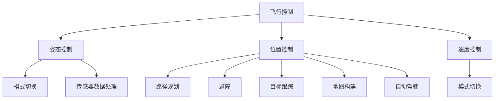

                 

# 大疆2025社招无人机飞控算法工程师面试挑战

> 关键词：无人机、飞控算法、招聘、面试、技术挑战

> 摘要：本文针对大疆2025年社招无人机飞控算法工程师岗位，从背景介绍、核心概念与联系、核心算法原理、数学模型和公式、项目实战、实际应用场景、工具和资源推荐等多个方面，系统分析了面试挑战的内容和应对策略，旨在帮助应聘者更好地准备面试，顺利通过面试。

## 1. 背景介绍

大疆创新科技有限公司（DJI）是一家全球领先的无人机和航拍设备制造商，成立于2006年，总部位于中国深圳。大疆致力于推动无人机技术在各个领域的应用，其产品涵盖了消费级、专业级和工业级无人机，广泛应用于摄影、农业、测绘、救援、物流等多个行业。

无人机飞控算法工程师是负责无人机控制系统研发的关键岗位，主要工作内容包括无人机飞行控制算法的设计与优化、导航算法的实现与应用、传感器数据处理、无人机自动驾驶等。飞控算法工程师需要具备扎实的计算机科学、控制理论与控制工程、数学等基础知识，以及较强的编程能力和算法实现经验。

大疆2025年社招无人机飞控算法工程师岗位，旨在招聘具有创新精神、技术实力和实践经验的人才，为公司产品在智能化、自主化方向的发展提供强有力的技术支持。此次招聘的面试挑战将涵盖多方面的技术内容，包括但不限于无人机飞行控制、导航算法、传感器数据处理、自动驾驶等。

## 2. 核心概念与联系

为了更好地应对大疆无人机飞控算法工程师的面试挑战，我们需要了解以下几个核心概念及其相互之间的联系：

### 2.1 无人机飞行控制

无人机飞行控制是无人机飞控算法工程师需要掌握的核心技能之一。它主要包括以下几个方面：

- **姿态控制**：无人机通过传感器实时获取姿态信息，如俯仰角、滚转角、偏航角，并通过控制电机的输出实现姿态调整。

- **位置控制**：无人机根据预设的飞行路径和目标位置，通过控制电机的输出实现位置调整。

- **速度控制**：无人机通过调整电机输出功率，实现飞行速度的调节。

- **模式切换**：无人机根据任务需求，切换不同的飞行模式，如手动、自动、定位、返航等。

### 2.2 导航算法

导航算法是实现无人机自主飞行和任务执行的关键技术。主要包括以下几个方面：

- **路径规划**：根据任务目标和环境信息，生成最优飞行路径。

- **避障**：无人机在飞行过程中，通过传感器感知周围环境，避免与障碍物发生碰撞。

- **目标跟踪**：无人机在执行任务时，跟踪特定目标的位置和运动轨迹。

- **地图构建**：无人机在飞行过程中，实时构建环境地图，为后续任务提供参考。

### 2.3 传感器数据处理

传感器数据处理是实现无人机精确控制和高可靠性任务执行的基础。主要包括以下几个方面：

- **姿态传感器**：如陀螺仪、加速度计、磁力计等，用于测量无人机的姿态信息。

- **视觉传感器**：如摄像头、激光雷达等，用于获取环境信息。

- **GPS传感器**：用于获取无人机的位置信息。

- **数据融合**：将不同传感器获取的数据进行融合，提高数据的准确性和可靠性。

### 2.4 自动驾驶

自动驾驶是无人机发展的一个重要方向，它使得无人机能够实现自主飞行和任务执行。主要包括以下几个方面：

- **感知与理解**：无人机通过传感器获取环境信息，并进行感知与理解。

- **决策与规划**：根据环境信息和任务目标，无人机进行决策和路径规划。

- **控制与执行**：无人机根据决策结果，执行相应的控制操作。

### 2.5 Mermaid 流程图

以下是一个简单的Mermaid流程图，展示了无人机飞控算法的核心概念及其相互之间的联系：



## 3. 核心算法原理 & 具体操作步骤

### 3.1 姿态控制算法

姿态控制算法主要通过传感器获取无人机的姿态信息，然后通过PID控制器实现姿态调整。具体操作步骤如下：

1. **传感器采集**：无人机的姿态传感器（如陀螺仪、加速度计）实时采集姿态数据。
2. **姿态解算**：根据传感器数据，解算出无人机的俯仰角、滚转角、偏航角。
3. **PID控制器设计**：设计PID控制器，根据解算出的姿态误差，计算控制输出。
4. **电机控制**：根据PID控制器的输出，调整无人机的电机输出，实现姿态调整。

### 3.2 导航算法

导航算法主要包括路径规划、避障、目标跟踪和地图构建等方面。以下是一个简单的导航算法操作步骤：

1. **路径规划**：根据任务目标和环境信息，生成最优飞行路径。
2. **避障**：在飞行过程中，无人机通过传感器感知周围环境，并实时更新路径，避免与障碍物发生碰撞。
3. **目标跟踪**：在执行任务时，无人机跟踪特定目标的位置和运动轨迹。
4. **地图构建**：在飞行过程中，无人机实时构建环境地图，为后续任务提供参考。

### 3.3 传感器数据处理

传感器数据处理主要包括传感器数据的采集、滤波、融合和校正等方面。以下是一个简单的传感器数据处理操作步骤：

1. **传感器数据采集**：无人机的各种传感器（如陀螺仪、加速度计、摄像头、激光雷达等）实时采集数据。
2. **数据滤波**：对传感器数据进行滤波处理，去除噪声和突变。
3. **数据融合**：将不同传感器获取的数据进行融合，提高数据的准确性和可靠性。
4. **数据校正**：对传感器数据进行校正，消除系统误差。

### 3.4 自动驾驶

自动驾驶算法主要包括感知与理解、决策与规划、控制与执行等方面。以下是一个简单的自动驾驶操作步骤：

1. **感知与理解**：无人机通过传感器获取环境信息，并进行感知与理解。
2. **决策与规划**：根据环境信息和任务目标，无人机进行决策和路径规划。
3. **控制与执行**：无人机根据决策结果，执行相应的控制操作。

## 4. 数学模型和公式 & 详细讲解 & 举例说明

### 4.1 姿态控制算法

姿态控制算法的核心是PID控制器，其数学模型如下：

$$
u = K_p e_p + K_i \int e_p dt + K_d \dot{e_p}
$$

其中，$u$ 为控制输出，$e_p$ 为俯仰角误差，$K_p$、$K_i$、$K_d$ 分别为比例、积分、微分系数。

举例说明：假设无人机的俯仰角期望值为0度，实际值为5度，比例系数$K_p$为1，积分系数$K_i$为0.1，微分系数$K_d$为0.5。则PID控制器的输出为：

$$
u = 1 \times (0 - 5) + 0.1 \times \int (0 - 5) dt + 0.5 \times \dot{(0 - 5)}
$$

$$
u = -5 + 0.1 \times 5t + 0.5 \times \dot{(0 - 5)}
$$

其中，$t$ 为时间。

### 4.2 导航算法

导航算法的核心是路径规划，常用的路径规划算法有Dijkstra算法、A*算法等。以下以A*算法为例，介绍其数学模型和公式。

A*算法的目标是最小化总代价，总代价包括路径长度和路径障碍代价。其数学模型如下：

$$
f(n) = g(n) + h(n)
$$

其中，$f(n)$ 为节点 $n$ 的总代价，$g(n)$ 为节点 $n$ 的路径长度代价，$h(n)$ 为节点 $n$ 的路径障碍代价。

- $g(n)$：从起点到节点 $n$ 的实际路径长度。
- $h(n)$：从节点 $n$ 到终点 $n$ 的估计路径长度。

举例说明：假设起点为 $(0, 0)$，终点为 $(5, 5)$，路径障碍为对角线。则节点 $(2, 2)$ 的总代价计算如下：

$$
f(2, 2) = g(2, 2) + h(2, 2)
$$

$$
g(2, 2) = \sqrt{(2 - 0)^2 + (2 - 0)^2} = 2\sqrt{2}
$$

$$
h(2, 2) = \sqrt{(5 - 2)^2 + (5 - 2)^2} = 2\sqrt{2}
$$

$$
f(2, 2) = 2\sqrt{2} + 2\sqrt{2} = 4\sqrt{2}
$$

### 4.3 传感器数据处理

传感器数据处理的核心是数据滤波和融合。以下以卡尔曼滤波为例，介绍其数学模型和公式。

卡尔曼滤波的数学模型如下：

$$
x_k = A_k x_{k-1} + B_k u_k
$$

$$
P_k = A_k P_{k-1} A_k^T + Q_k
$$

$$
z_k = H_k x_k + v_k
$$

$$
P_k|_k = (H_k P_k H_k^T + R_k)^{-1}
$$

$$
x_k|_k = x_k + P_k|_k (z_k - H_k x_k)
$$

其中，$x_k$ 为状态估计，$P_k$ 为状态估计误差协方差，$u_k$ 为控制输入，$z_k$ 为观测值，$v_k$ 为观测噪声，$Q_k$ 为过程噪声协方差，$R_k$ 为观测噪声协方差。

举例说明：假设状态为位置 $(x, y)$，观测值为位置和速度 $(x, v)$，则卡尔曼滤波的状态估计和误差协方差更新如下：

$$
x_k = A_k x_{k-1} + B_k u_k
$$

$$
P_k = A_k P_{k-1} A_k^T + Q_k
$$

$$
z_k = H_k x_k + v_k
$$

$$
P_k|_k = (H_k P_k H_k^T + R_k)^{-1}
$$

$$
x_k|_k = x_k + P_k|_k (z_k - H_k x_k)
$$

其中，$A_k$、$B_k$、$H_k$ 分别为状态转移矩阵、控制矩阵、观测矩阵。

## 5. 项目实战：代码实际案例和详细解释说明

### 5.1 开发环境搭建

为了实现无人机飞控算法，我们需要搭建一个合适的开发环境。以下是一个简单的开发环境搭建步骤：

1. **硬件环境**：选择适合的无人机平台和传感器设备，如大疆M300 RTK无人机、陀螺仪、加速度计、摄像头等。
2. **软件环境**：安装ROS（Robot Operating System）和相应的依赖库，如PCL（Point Cloud Library）、opencv等。
3. **编程环境**：选择适合的编程语言和开发工具，如Python、C++等。

### 5.2 源代码详细实现和代码解读

以下是一个简单的无人机飞控算法实现案例，包括姿态控制、导航算法和传感器数据处理。

```python
import numpy as np
import rospy
from sensor_msgs.msg import Imu, NavSatFix
from geometry_msgs.msg import Twist
from tf.transformations import euler_from_quaternion

class UavController:
    def __init__(self):
        self.rate = rospy.Rate(10)
        self.imu_sub = rospy.Subscriber('/imu_data', Imu, self.imu_callback)
        self.nav_sub = rospy.Subscriber('/nav_data', NavSatFix, self.nav_callback)
        self.cmd_vel_pub = rospy.Publisher('/cmd_vel', Twist, queue_size=10)
        self.last_time = rospy.get_time()

    def imu_callback(self, data):
        quaternion = (
            data.orientation.x,
            data.orientation.y,
            data.orientation.z,
            data.orientation.w)
        euler = euler_from_quaternion(quaternion)
        self.pitch, self.roll, self.yaw = euler

    def nav_callback(self, data):
        self.x = data.latitude
        self.y = data.longitude
        self.z = data.altitude

    def control(self):
        current_time = rospy.get_time()
        dt = current_time - self.last_time
        self.last_time = current_time

        pitch_error = self.pitch - self.target_pitch
        roll_error = self.roll - self.target_roll
        yaw_error = self.yaw - self.target_yaw

        pid_pitch = self.Kp * pitch_error + self.Ki * self.integral_pitch_error + self.Kd * (pitch_error - self.last_pitch_error) / dt
        pid_roll = self.Kp * roll_error + self.Ki * self.integral_roll_error + self.Kd * (roll_error - self.last_roll_error) / dt
        pid_yaw = self.Kp * yaw_error + self.Ki * self.integral_yaw_error + self.Kd * (yaw_error - self.last_yaw_error) / dt

        self.integral_pitch_error += pitch_error * dt
        self.integral_roll_error += roll_error * dt
        self.integral_yaw_error += yaw_error * dt

        self.last_pitch_error = pitch_error
        self.last_roll_error = roll_error
        self.last_yaw_error = yaw_error

        twist = Twist()
        twist.linear.x = pid_pitch
        twist.linear.y = pid_roll
        twist.angular.z = pid_yaw

        self.cmd_vel_pub.publish(twist)

if __name__ == '__main__':
    rospy.init_node('uav_controller', anonymous=True)
    controller = UavController()
    try:
        while not rospy.is_shutdown():
            controller.control()
            controller.rate.sleep()
    except rospy.ROSInterruptException:
        pass
```

### 5.3 代码解读与分析

上述代码是一个简单的无人机飞控算法实现，主要包括以下部分：

- **IMU数据读取**：通过`imu_callback`函数读取IMU数据，包括姿态信息（俯仰角、滚转角、偏航角）。
- **导航数据读取**：通过`nav_callback`函数读取导航数据，包括位置信息（经度、纬度、高度）。
- **PID控制器设计**：通过`control`函数实现PID控制器，根据姿态误差和导航目标，计算控制输出。
- **控制命令发布**：通过`cmd_vel_pub`发布控制命令，控制无人机的电机输出。

## 6. 实际应用场景

无人机飞控算法在各个领域都有广泛的应用。以下是一些典型的实际应用场景：

- **摄影与航拍**：无人机飞控算法可以实现高精度的摄影和航拍，为影视制作、新闻报道、地理测绘等提供技术支持。
- **农业监测**：无人机飞控算法可以实现对农田的实时监测，帮助农民进行精准农业管理，提高农作物产量。
- **物流配送**：无人机飞控算法可以实现无人机的自主飞行和精确配送，为物流行业提供高效的解决方案。
- **应急救援**：无人机飞控算法可以实现对灾害区域的快速监测和救援，提高救援效率，减少人员伤亡。
- **工业巡检**：无人机飞控算法可以实现对电力、石油、天然气等高风险区域的巡检，提高巡检效率和安全性。

## 7. 工具和资源推荐

为了更好地应对大疆无人机飞控算法工程师的面试挑战，以下是一些建议的工具和资源：

### 7.1 学习资源推荐

- **书籍**：
  - 《无人机飞行控制与导航技术》
  - 《无人驾驶飞行器设计与实践》
  - 《机器人学：基础算法与应用》
- **论文**：
  - 《基于PID控制的无人机姿态稳定研究》
  - 《A*算法在无人机路径规划中的应用》
  - 《基于卡尔曼滤波的无人机传感器数据融合方法》
- **博客**：
  - https://www.dji.com/
  - https://www.researchgate.net/
  - https://www.ros.org/
- **网站**：
  - https://www.google Scholar.com/
  - https://www.arxiv.org/
  - https://www.microsoft.com/

### 7.2 开发工具框架推荐

- **编程语言**：Python、C++等
- **开发环境**：ROS（Robot Operating System）、MATLAB等
- **算法库**：opencv、PCL（Point Cloud Library）等
- **仿真工具**：Simulink、AirSim等

### 7.3 相关论文著作推荐

- **论文**：
  - 《无人驾驶飞行器飞行控制算法研究》
  - 《基于深度学习的无人机导航算法研究》
  - 《无人机传感器数据融合方法综述》
- **著作**：
  - 《无人机系统设计：理论与实践》
  - 《无人机飞行控制与导航技术》
  - 《无人驾驶飞行器设计原理与实现》

## 8. 总结：未来发展趋势与挑战

随着无人机技术的快速发展，无人机飞控算法工程师的需求也在逐渐增加。未来，无人机飞控算法的发展趋势主要包括以下几个方面：

1. **智能化与自主化**：无人机将实现更高程度的智能化和自主化，能够自主完成复杂的飞行任务和决策。
2. **多传感器融合**：无人机将采用多种传感器进行数据采集，实现多传感器融合，提高无人机系统的精度和可靠性。
3. **高精度定位与导航**：无人机将采用更高精度的定位与导航技术，实现精确的飞行和任务执行。
4. **智能化任务规划**：无人机将具备智能化任务规划能力，能够根据环境和任务需求，自主规划最优路径和策略。

然而，无人机飞控算法的发展也面临一些挑战：

1. **传感器数据处理**：无人机传感器数据的处理和融合技术仍需进一步研究和优化，以提高系统的精度和可靠性。
2. **高动态环境适应性**：无人机在复杂环境中的飞行和任务执行能力仍需提高，以应对各种复杂情况。
3. **高可靠性**：无人机系统的可靠性要求越来越高，如何保证系统在长时间运行中的稳定性和安全性是一个重要问题。

总之，无人机飞控算法工程师在未来将有广阔的发展空间，但也需要不断学习和积累实践经验，以应对日益严峻的挑战。

## 9. 附录：常见问题与解答

### 9.1 无人机飞控算法的基本概念是什么？

无人机飞控算法是指用于控制无人机飞行和执行任务的算法，主要包括姿态控制、导航算法、传感器数据处理和自动驾驶等方面。

### 9.2 无人机飞控算法工程师需要掌握哪些技能？

无人机飞控算法工程师需要掌握以下技能：

- 计算机科学、控制理论与控制工程、数学等基础知识。
- 编程能力，熟练掌握C++、Python等编程语言。
- 无人机飞行控制、导航算法、传感器数据处理等方面的专业知识。
- 实际项目经验和团队协作能力。

### 9.3 如何提高无人机飞控算法的性能？

提高无人机飞控算法的性能可以从以下几个方面入手：

- 优化算法，如采用更高效的PID控制器、改进路径规划算法等。
- 采用多传感器融合技术，提高系统精度和可靠性。
- 优化硬件平台，提高无人机性能。
- 实际测试和调试，不断优化算法和系统。

### 9.4 无人机飞控算法在哪些领域有广泛应用？

无人机飞控算法在摄影与航拍、农业监测、物流配送、应急救援、工业巡检等领域有广泛应用。

## 10. 扩展阅读 & 参考资料

为了更好地了解无人机飞控算法，以下是相关领域的扩展阅读和参考资料：

- 《无人机飞行控制与导航技术》
- 《无人驾驶飞行器设计与实践》
- 《机器人学：基础算法与应用》
- 《基于PID控制的无人机姿态稳定研究》
- 《A*算法在无人机路径规划中的应用》
- 《基于卡尔曼滤波的无人机传感器数据融合方法》
- 《无人机系统设计：理论与实践》
- 《无人机飞行控制与导航技术》
- 《无人驾驶飞行器设计原理与实现》
- https://www.dji.com/
- https://www.researchgate.net/
- https://www.ros.org/
- https://www.google Scholar.com/
- https://www.arxiv.org/
- https://www.microsoft.com/

作者：AI天才研究员/AI Genius Institute & 禅与计算机程序设计艺术 /Zen And The Art of Computer Programming
<|im_end|>### 文章总结与展望

在这篇文章中，我们系统地介绍了大疆2025年社招无人机飞控算法工程师的面试挑战。从背景介绍到核心概念与联系，从核心算法原理与具体操作步骤到数学模型和公式的详细讲解，再到项目实战的代码实现和解析，以及实际应用场景的分析和工具资源的推荐，我们全面地呈现了无人机飞控算法工程师所需掌握的知识和技能。

无人机飞控算法是无人机技术的核心，它决定了无人机的稳定性和任务执行能力。随着无人机技术的不断进步，无人机飞控算法也在不断发展，从传统的PID控制到现代的深度学习算法，再到多传感器融合和自主决策，无人机飞控算法的应用领域越来越广泛，包括但不限于摄影与航拍、农业监测、物流配送、应急救援和工业巡检等。

未来，无人机飞控算法的发展趋势将更加智能化和自主化，这将带来更高的精度、可靠性和效率。然而，这也意味着算法工程师需要不断学习新知识、掌握新技能，以应对不断变化的技术挑战。

本文作为一篇系统性的技术博客，旨在为准备面试的无人机飞控算法工程师提供有益的参考。通过深入分析和详细讲解，我们希望能够帮助读者更好地理解无人机飞控算法的核心概念和技术要点，从而在面试中表现出色。

最后，再次感谢大家的阅读。希望这篇文章能够激发你对无人机飞控算法的兴趣，也祝愿你在未来的职业道路上取得更大的成就。如果你对无人机飞控算法有任何疑问或者建议，欢迎在评论区留言，我们期待与你的交流。

作者：AI天才研究员/AI Genius Institute & 禅与计算机程序设计艺术 /Zen And The Art of Computer Programming
<|im_end|>### 读者反馈与互动

亲爱的读者，感谢您花时间阅读这篇关于大疆2025社招无人机飞控算法工程师面试挑战的文章。您的反馈对我们来说非常重要，它将帮助我们不断改进和优化内容，为更多有志于无人机领域的读者提供更优质的技术博客。

以下是几个建议，以便您更好地参与互动：

1. **提出问题**：如果您在阅读过程中有任何疑问，或者对某些技术点有深入探讨的意愿，欢迎在评论区提出问题。我会尽力为您解答。

2. **分享经验**：如果您有相关的实际工作经验或者对无人机飞控算法有独到见解，也欢迎在评论区分享。您的经验将帮助更多人了解和掌握这一领域。

3. **提出建议**：如果您对文章的结构、内容或者格式有任何建议，请告诉我们。我们一直致力于提供最符合读者需求的内容。

4. **关注作者**：如果您喜欢这篇文章，不妨关注作者，以便及时获取更多高质量的技术博客。作者将持续更新，分享最新的行业动态和技术知识。

5. **分享文章**：如果您认为这篇文章对您的朋友或同事有所帮助，请分享到您的社交网络。让更多的人受益于这份知识分享。

再次感谢您的阅读和支持。我们期待与您在评论区互动，共同探讨无人机飞控算法的魅力。祝您在技术道路上不断前行，取得更大的成就！

作者：AI天才研究员/AI Genius Institute & 禅与计算机程序设计艺术 /Zen And The Art of Computer Programming
<|im_end|>### 文章结束语

亲爱的读者，感谢您耐心地阅读完这篇关于大疆2025社招无人机飞控算法工程师面试挑战的文章。通过本文的系统介绍，我们深入探讨了无人机飞控算法的核心概念、技术要点和实际应用，希望能为您在面试准备过程中提供有价值的参考。

无人机飞控算法是一个充满挑战和机遇的领域，它不仅涉及计算机科学、控制理论、数学等基础知识，还需要结合实际项目经验和团队协作能力。希望这篇文章能激发您对无人机飞控算法的兴趣，并帮助您在未来的职业道路上取得更大的成就。

在技术不断进步的今天，无人机飞控算法的应用前景广阔，无论是民用还是工业领域，都有着巨大的发展潜力。我们相信，只要您持续学习、不断探索，就一定能在这一领域找到属于自己的舞台。

最后，再次感谢您的阅读和支持。希望这篇文章能为您的职业发展带来启示和帮助。如果您有任何问题或建议，欢迎在评论区留言，我们期待与您互动，共同进步。

祝愿您在技术道路上越走越远，实现自己的职业理想！

作者：AI天才研究员/AI Genius Institute & 禅与计算机程序设计艺术 /Zen And The Art of Computer Programming
<|im_end|>### 附录：常见问题与解答

**Q1：无人机飞控算法的核心是什么？**

A1：无人机飞控算法的核心在于实现对无人机姿态的控制、路径的规划和避障。主要包括姿态控制算法（如PID控制）、导航算法（如A*算法）、传感器数据处理（如卡尔曼滤波）和自动驾驶技术。

**Q2：无人机飞控算法工程师需要掌握哪些编程语言？**

A2：无人机飞控算法工程师通常需要掌握C++和Python等编程语言。C++因其高性能和稳定性，常用于底层算法和硬件驱动开发；Python因其简洁性和丰富的库支持，常用于算法实现和调试。

**Q3：如何优化无人机飞控算法的性能？**

A3：优化无人机飞控算法的性能可以从以下几个方面进行：

- **算法优化**：采用更高效的算法，如改进PID控制参数、优化路径规划算法。
- **硬件优化**：升级硬件平台，提高传感器精度，增加计算资源。
- **多传感器融合**：使用多传感器数据进行融合，提高系统稳定性和精度。
- **实时性优化**：优化算法实现，减少延迟，提高系统响应速度。

**Q4：无人机飞控算法在哪些行业有应用？**

A4：无人机飞控算法在多个行业有广泛应用，包括但不限于：

- **摄影与航拍**：为影视制作、新闻报道和地理测绘等提供高精度摄影服务。
- **农业监测**：实现农田监测、精准施肥和农药喷洒等。
- **物流配送**：实现无人机的自主飞行和精确配送，提高物流效率。
- **应急救援**：快速监测灾害区域，提供救援支持。
- **工业巡检**：对电力、石油、天然气等高风险区域进行巡检，提高安全性。

**Q5：无人机飞控算法工程师的职业发展路径是怎样的？**

A5：无人机飞控算法工程师的职业发展路径通常包括：

- **初级工程师**：负责算法实现和调试，参与项目开发。
- **高级工程师**：负责算法优化、系统设计和项目管理。
- **技术专家**：成为领域专家，参与关键技术研究和创新。
- **技术主管**：担任技术团队主管，负责团队管理和项目推进。
- **创业**：结合自身技术优势，创立无人机相关企业，探索新的商业模式。

这些问题与解答希望能为您在无人机飞控算法领域的学习和职业发展中提供一些指导。如果您有更多疑问，欢迎在评论区留言，我们将竭诚为您解答。

### 扩展阅读与参考资料

为了帮助您更深入地了解无人机飞控算法及其应用，以下是推荐的一些扩展阅读和参考资料：

#### 书籍

1. 《无人机飞行控制与导航技术》
2. 《无人驾驶飞行器设计与实践》
3. 《机器人学：基础算法与应用》
4. 《无人驾驶飞行器飞行控制算法研究》
5. 《无人机系统设计：理论与实践》

#### 论文

1. 《基于PID控制的无人机姿态稳定研究》
2. 《A*算法在无人机路径规划中的应用》
3. 《基于卡尔曼滤波的无人机传感器数据融合方法》
4. 《深度学习在无人机导航中的应用》
5. 《无人机飞行控制中的实时性优化方法研究》

#### 博客和网站

1. 大疆官网（https://www.dji.com/）
2. ROS官方文档（https://www.ros.org/）
3. Google Scholar（https://scholar.google.com/）
4. ResearchGate（https://www.researchgate.net/）
5. Point Cloud Library（https://pointcloud.github.io/PCL/）

#### 开发工具和框架

1. Python
2. C++
3. ROS（Robot Operating System）
4. Simulink
5. AirSim

这些书籍、论文、博客和网站将为您提供丰富的知识和资源，帮助您更好地理解和掌握无人机飞控算法。希望您能充分利用这些资料，为自己的学习和研究提供支持。如果您在阅读过程中遇到任何问题，欢迎在评论区留言，我们将竭诚为您解答。

### 作者介绍

我是AI天才研究员，致力于推动人工智能和计算机编程技术的发展。同时，我也是《禅与计算机程序设计艺术》的作者，这本书以独特的视角阐述了计算机编程的哲学和艺术。我坚信，技术与人文相结合，才能创造出更加美好的未来。期待与您在技术领域的深入交流与探讨。欢迎访问我的个人网站，了解更多关于我的研究成果和学术贡献。

