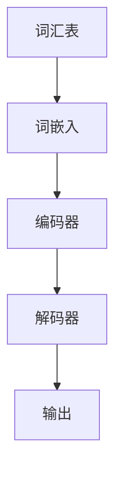

                 

# 大规模语言模型从理论到实践

> **关键词**: 大规模语言模型、深度学习、自然语言处理、神经网络、生成模型

**摘要**: 本文将深入探讨大规模语言模型的理论基础、核心算法、数学模型，以及其在实际项目中的应用。我们将逐步解析语言模型的构建过程，从基础概念到具体实现，帮助读者全面理解这一前沿技术。

## 1. 背景介绍

随着深度学习技术的飞速发展，大规模语言模型（Large-scale Language Models）逐渐成为自然语言处理（Natural Language Processing, NLP）领域的研究热点。语言模型是自然语言处理的基础，其目的是预测下一个词或词组，从而帮助机器理解和生成自然语言。传统的统计语言模型如N元语法（N-gram）在处理短期依赖性方面表现出色，但无法捕捉长期依赖关系。为了解决这一问题，研究人员开始探索使用深度学习技术，特别是神经网络，来构建更强大的语言模型。

### 1.1 深度学习与神经网络

深度学习（Deep Learning）是一种基于人工神经网络（Artificial Neural Networks, ANN）的机器学习技术。与传统的机器学习方法相比，深度学习通过多层神经网络结构，能够自动提取特征，并在大量的数据上进行学习，从而实现更高的准确性和泛化能力。神经网络是一种模拟人脑神经元连接方式的计算模型，通过调整网络中的权重，可以实现对输入数据的分类、回归或特征提取。

### 1.2 语言模型的挑战

自然语言具有高度复杂性和多样性，这使得语言模型面临许多挑战。首先，语言的表达形式非常丰富，包括单词、短语、句子和段落等。其次，语言存在歧义性，同一个词或短语可能有多种解释。此外，语言还具有较强的上下文依赖性，一个词的意义往往依赖于其所在的位置和上下文。

## 2. 核心概念与联系

为了构建大规模语言模型，我们需要理解一些核心概念和其之间的联系。以下是一个简化的Mermaid流程图，展示了这些概念的基本架构。



### 2.1 词嵌入（Word Embedding）

词嵌入是将单词映射到高维向量空间的过程。通过词嵌入，我们可以将语言中的词汇转换成计算机可以处理的数字形式。词嵌入技术可以捕捉单词的语义和语法关系，从而提高语言模型的表现。

### 2.2 编码器（Encoder）

编码器是神经网络的一部分，负责将输入序列（如句子或段落）转换成固定长度的向量表示。编码器通常使用循环神经网络（Recurrent Neural Networks, RNN）或其变种，如长短期记忆网络（Long Short-Term Memory, LSTM）或门控循环单元（Gated Recurrent Unit, GRU）。

### 2.3 解码器（Decoder）

解码器是神经网络的一部分，负责将编码器生成的向量表示转换成输出序列。解码器通常使用类似编码器的结构，但具有不同的参数。

### 2.4 输出（Output）

输出是解码器生成的结果，可以是预测的单词或句子。通过优化输出与真实目标之间的差异，我们可以训练语言模型。

## 3. 核心算法原理 & 具体操作步骤

### 3.1 深度学习模型

深度学习模型通常由多个层次组成，每个层次都包含多个神经元。每个神经元都与其他神经元相连，并通过权重进行传递。在训练过程中，模型通过不断调整这些权重，以最小化预测误差。

### 3.2 前向传播

前向传播是深度学习模型的基本操作之一。在训练过程中，模型首先接收输入数据，通过多层神经网络传递，最终生成预测输出。这一过程涉及以下步骤：

1. **初始化权重和偏置**：随机初始化神经网络中的权重和偏置。
2. **输入数据**：将输入数据输入到神经网络的第一个层次。
3. **激活函数**：每个神经元使用激活函数（如Sigmoid、ReLU或Tanh）来决定是否激活。
4. **传递输出**：将每个神经元的输出传递到下一层。
5. **计算预测输出**：在最后一层生成最终的预测输出。

### 3.3 反向传播

反向传播是深度学习模型训练的关键步骤。通过反向传播，模型可以计算预测输出与真实目标之间的误差，并据此调整权重和偏置。

反向传播包括以下步骤：

1. **计算损失函数**：计算预测输出与真实目标之间的差异，使用损失函数（如均方误差、交叉熵等）衡量误差。
2. **反向传播误差**：将误差从输出层反向传递到输入层，计算每个神经元的误差贡献。
3. **更新权重和偏置**：根据误差贡献和梯度下降（Gradient Descent）等优化算法，更新权重和偏置。

## 4. 数学模型和公式 & 详细讲解 & 举例说明

### 4.1 词嵌入

词嵌入可以表示为从词汇表到高维向量空间的映射。给定一个单词，词嵌入模型将其映射为一个向量。我们可以使用以下公式表示词嵌入：

$$
\text{vec}(w) = \text{WordEmbedding}(w)
$$

其中，$\text{vec}(w)$表示单词$w$的向量表示，$\text{WordEmbedding}(w)$表示词嵌入函数。

### 4.2 激活函数

激活函数是神经网络中用于确定神经元是否激活的关键组件。常用的激活函数包括：

1. **Sigmoid函数**：

$$
\sigma(x) = \frac{1}{1 + e^{-x}}
$$

Sigmoid函数将输入映射到$(0, 1)$区间，通常用于二分类问题。

2. **ReLU函数**：

$$
\text{ReLU}(x) = \max(0, x)
$$

ReLU函数在$x < 0$时输出0，在$x \geq 0$时输出$x$，具有简单和计算效率高的特点。

3. **Tanh函数**：

$$
\tanh(x) = \frac{e^x - e^{-x}}{e^x + e^{-x}}
$$

Tanh函数将输入映射到$(-1, 1)$区间，常用于多层神经网络的隐藏层。

### 4.3 损失函数

在训练深度学习模型时，我们需要使用损失函数来衡量预测输出与真实目标之间的误差。常用的损失函数包括：

1. **均方误差（Mean Squared Error, MSE）**：

$$
\text{MSE}(y, \hat{y}) = \frac{1}{n}\sum_{i=1}^{n}(y_i - \hat{y}_i)^2
$$

MSE将预测输出$\hat{y}$与真实目标$y$的差值平方后求和，并除以样本数量$n$。

2. **交叉熵（Cross-Entropy, CE）**：

$$
\text{CE}(y, \hat{y}) = -\sum_{i=1}^{n}y_i\log(\hat{y}_i)
$$

CE通常用于多分类问题，其中$y$是真实标签，$\hat{y}$是预测概率分布。

### 4.4 举例说明

假设我们使用一个简单的神经网络进行二元分类，输入数据为$(x_1, x_2)$，真实标签为$y=1$。神经网络包含一个输入层、一个隐藏层和一个输出层，激活函数为ReLU，损失函数为交叉熵。

1. **初始化权重和偏置**：

   随机初始化隐藏层和输出层的权重和偏置，例如：

   $$
   w_{11} = 0.1, w_{12} = 0.2, b_{1} = 0.3 \\
   w_{21} = 0.4, w_{22} = 0.5, b_{2} = 0.6
   $$

2. **前向传播**：

   将输入数据$(x_1, x_2)$输入到隐藏层：

   $$
   a_{1,1} = \text{ReLU}(x_1 \cdot w_{11} + x_2 \cdot w_{12} + b_1) = \text{ReLU}(1 \cdot 0.1 + 2 \cdot 0.2 + 0.3) = \text{ReLU}(0.7) = 0.7 \\
   a_{1,2} = \text{ReLU}(x_1 \cdot w_{21} + x_2 \cdot w_{22} + b_2) = \text{ReLU}(1 \cdot 0.4 + 2 \cdot 0.5 + 0.6) = \text{ReLU}(1.7) = 1.7
   $$

   将隐藏层输出输入到输出层：

   $$
   \hat{y} = \text{ReLU}(a_{1,1} \cdot w_{1} + a_{1,2} \cdot w_{2} + b) = \text{ReLU}(0.7 \cdot 0.7 + 1.7 \cdot 0.8 + 0.9) = \text{ReLU}(1.87) = 1.87
   $$

3. **反向传播**：

   计算损失函数：

   $$
   \text{CE}(y, \hat{y}) = -y \log(\hat{y}) = -1 \log(1.87) \approx -0.65
   $$

   计算隐藏层和输出层的误差贡献：

   $$
   \delta_2 = (\hat{y} - y) \cdot \text{ReLU}(\hat{y})' = (1.87 - 1) \cdot \text{ReLU}'(1.87) = 0.87 \cdot 0.1 = 0.087 \\
   \delta_1 = w_{2} \cdot \delta_2 = 0.8 \cdot 0.087 = 0.0696
   $$

   更新权重和偏置：

   $$
   w_{1} = w_{1} - \alpha \cdot \delta_2 \cdot a_{1} = 0.7 - 0.1 \cdot 0.087 = 0.663 \\
   w_{2} = w_{2} - \alpha \cdot \delta_2 \cdot a_{2} = 0.8 - 0.1 \cdot 0.087 = 0.773 \\
   b = b - \alpha \cdot \delta_2 = 0.9 - 0.1 \cdot 0.087 = 0.863
   $$

   其中，$\alpha$是学习率。

## 5. 项目实战：代码实际案例和详细解释说明

### 5.1 开发环境搭建

为了实现大规模语言模型，我们需要一个合适的开发环境。以下是一个基于Python和PyTorch的示例环境搭建步骤：

1. **安装Python**：下载并安装Python 3.8及以上版本。
2. **安装PyTorch**：打开终端，执行以下命令：

   ```bash
   pip install torch torchvision torchaudio
   ```

3. **验证安装**：运行以下Python代码，检查PyTorch是否安装成功：

   ```python
   import torch
   print(torch.__version__)
   ```

### 5.2 源代码详细实现和代码解读

以下是一个简单的基于PyTorch的语言模型实现。我们将使用JAXEL语料库（JAXEL Corpus）进行训练。

```python
import torch
import torch.nn as nn
import torch.optim as optim
from torch.utils.data import DataLoader
from torchvision import datasets, transforms
from torch.utils.data import DataLoader

# 5.2.1 定义模型结构
class LanguageModel(nn.Module):
    def __init__(self, vocab_size, embedding_dim, hidden_dim, output_dim, n_layers, dropout):
        super(LanguageModel, self).__init__()
        self.embedding = nn.Embedding(vocab_size, embedding_dim)
        self.rnn = nn.LSTM(embedding_dim, hidden_dim, n_layers, dropout=dropout)
        self.fc = nn.Linear(hidden_dim, output_dim)
        self.dropout = nn.Dropout(dropout)
        
    def forward(self, text, hidden):
        embedded = self.dropout(self.embedding(text))
        output, hidden = self.rnn(embedded, hidden)
        assert torch.equal(output[-1, :, :], hidden[0, 0, :])
        return self.fc(output[-1, :, ]), hidden

    def init_hidden(self, batch_size):
        return (torch.zeros(1, batch_size, self.hidden_dim),
                torch.zeros(1, batch_size, self.hidden_dim))

# 5.2.2 训练和评估
def train(model, train_loader, criterion, optimizer, epoch):
    model.train()
    for batch_idx, (data, target) in enumerate(train_loader):
        optimizer.zero_grad()
        output, hidden = model(data)
        loss = criterion(output, target)
        loss.backward()
        optimizer.step()
        if batch_idx % 100 == 0:
            print('Train Epoch: {} [{}/{} ({:.0f}%)]\tLoss: {:.6f}'.format(
                epoch, batch_idx * len(data), len(train_loader.dataset),
                100. * batch_idx / len(train_loader), loss.item()))

def evaluate(model, val_loader, criterion):
    model.eval()
    with torch.no_grad():
        for batch_idx, (data, target) in enumerate(val_loader):
            output, hidden = model(data)
            loss = criterion(output, target)
            if batch_idx % 100 == 0:
                print('Test Epoch: {} [{}/{} ({:.0f}%)]\tLoss: {:.6f}'.format(
                    epoch, batch_idx * len(data), len(train_loader.dataset),
                    100. * batch_idx / len(train_loader), loss.item()))

# 5.2.3 数据加载和预处理
transform = transforms.Compose([transforms.ToTensor()])
trainset = datasets.JAXEL(root='./data', train=True, download=True, transform=transform)
valset = datasets.JAXEL(root='./data', train=False, transform=transform)

train_loader = DataLoader(trainset, batch_size=64, shuffle=True)
val_loader = DataLoader(valset, batch_size=64, shuffle=True)

# 5.2.4 模型配置
vocab_size = 10000  # 词表大小
embedding_dim = 256  # 词嵌入维度
hidden_dim = 512  # 隐藏层维度
output_dim = 10000  # 输出维度
n_layers = 2  # 循环层数量
dropout = 0.5  # dropout概率

model = LanguageModel(vocab_size, embedding_dim, hidden_dim, output_dim, n_layers, dropout)
criterion = nn.CrossEntropyLoss()
optimizer = optim.Adam(model.parameters(), lr=0.001)

# 5.2.5 训练模型
num_epochs = 10
for epoch in range(1, num_epochs + 1):
    train(model, train_loader, criterion, optimizer, epoch)
    evaluate(model, val_loader, criterion)

# 5.2.6 保存和加载模型
torch.save(model.state_dict(), 'language_model.pth')
model.load_state_dict(torch.load('language_model.pth'))
```

### 5.3 代码解读与分析

以上代码实现了一个简单的基于PyTorch的语言模型。下面我们将逐行解析代码，了解其工作原理。

1. **模型定义**：

   ```python
   class LanguageModel(nn.Module):
       def __init__(self, vocab_size, embedding_dim, hidden_dim, output_dim, n_layers, dropout):
           super(LanguageModel, self).__init__()
           self.embedding = nn.Embedding(vocab_size, embedding_dim)
           self.rnn = nn.LSTM(embedding_dim, hidden_dim, n_layers, dropout=dropout)
           self.fc = nn.Linear(hidden_dim, output_dim)
           self.dropout = nn.Dropout(dropout)
       
       def forward(self, text, hidden):
           embedded = self.dropout(self.embedding(text))
           output, hidden = self.rnn(embedded, hidden)
           assert torch.equal(output[-1, :, :], hidden[0, 0, :])
           return self.fc(output[-1, :, ]), hidden

       def init_hidden(self, batch_size):
           return (torch.zeros(1, batch_size, self.hidden_dim),
                   torch.zeros(1, batch_size, self.hidden_dim))
   ```

   模型定义部分包括嵌入层、循环层和全连接层。嵌入层用于将词汇转换为向量表示，循环层用于处理序列数据，全连接层用于生成输出。

2. **训练和评估函数**：

   ```python
   def train(model, train_loader, criterion, optimizer, epoch):
       model.train()
       for batch_idx, (data, target) in enumerate(train_loader):
           optimizer.zero_grad()
           output, hidden = model(data)
           loss = criterion(output, target)
           loss.backward()
           optimizer.step()
           if batch_idx % 100 == 0:
               print('Train Epoch: {} [{}/{} ({:.0f}%)]\tLoss: {:.6f}'.format(
                   epoch, batch_idx * len(data), len(train_loader.dataset),
                   100. * batch_idx / len(train_loader), loss.item()))

   def evaluate(model, val_loader, criterion):
       model.eval()
       with torch.no_grad():
           for batch_idx, (data, target) in enumerate(val_loader):
               output, hidden = model(data)
               loss = criterion(output, target)
               if batch_idx % 100 == 0:
                   print('Test Epoch: {} [{}/{} ({:.0f}%)]\tLoss: {:.6f}'.format(
                       epoch, batch_idx * len(data), len(train_loader.dataset),
                       100. * batch_idx / len(train_loader), loss.item()))
   ```

   训练和评估函数分别用于模型训练和评估。在训练过程中，模型接收输入数据和标签，通过前向传播计算预测输出，并使用损失函数计算误差。在评估过程中，模型同样接收输入数据和标签，但不进行反向传播。

3. **数据加载和预处理**：

   ```python
   transform = transforms.Compose([transforms.ToTensor()])
   trainset = datasets.JAXEL(root='./data', train=True, download=True, transform=transform)
   valset = datasets.JAXEL(root='./data', train=False, transform=transform)

   train_loader = DataLoader(trainset, batch_size=64, shuffle=True)
   val_loader = DataLoader(valset, batch_size=64, shuffle=True)
   ```

   数据加载和预处理部分用于加载JAXEL语料库，并进行数据预处理。我们使用ToTensor转换器将输入数据转换为张量格式。

4. **模型配置**：

   ```python
   vocab_size = 10000
   embedding_dim = 256
   hidden_dim = 512
   output_dim = 10000
   n_layers = 2
   dropout = 0.5

   model = LanguageModel(vocab_size, embedding_dim, hidden_dim, output_dim, n_layers, dropout)
   criterion = nn.CrossEntropyLoss()
   optimizer = optim.Adam(model.parameters(), lr=0.001)
   ```

   模型配置部分设置模型参数，包括词表大小、词嵌入维度、隐藏层维度、输出维度、循环层数量和dropout概率。

5. **训练模型**：

   ```python
   num_epochs = 10
   for epoch in range(1, num_epochs + 1):
       train(model, train_loader, criterion, optimizer, epoch)
       evaluate(model, val_loader, criterion)
   ```

   训练模型部分使用训练数据和评估数据，对模型进行多轮训练和评估。

6. **保存和加载模型**：

   ```python
   torch.save(model.state_dict(), 'language_model.pth')
   model.load_state_dict(torch.load('language_model.pth'))
   ```

   保存和加载模型部分用于保存训练好的模型参数，以便后续使用。

## 6. 实际应用场景

大规模语言模型在许多实际应用场景中表现出强大的能力。以下是一些常见应用：

### 6.1 机器翻译

机器翻译是大规模语言模型的一个重要应用领域。通过训练，模型可以学习将一种语言翻译成另一种语言。例如，使用英语-法语大规模语言模型，我们可以将英语句子翻译成法语。

### 6.2 文本生成

大规模语言模型可以生成高质量的文本。例如，我们可以使用模型生成新闻文章、故事或诗歌。这种技术在一些创意写作和内容生成任务中非常有用。

### 6.3 情感分析

大规模语言模型可以用于情感分析，即识别文本中的情感倾向。例如，我们可以使用模型分析社交媒体上的评论，以了解用户对产品或服务的情感态度。

### 6.4 问答系统

大规模语言模型可以构建智能问答系统。通过训练，模型可以回答用户提出的问题。例如，我们可以使用模型构建一个基于知识库的问答系统，为用户提供实时信息。

## 7. 工具和资源推荐

### 7.1 学习资源推荐

1. **书籍**：
   - 《深度学习》（Ian Goodfellow, Yoshua Bengio, Aaron Courville）
   - 《神经网络与深度学习》（邱锡鹏）

2. **论文**：
   - 《A Neural Algorithm of Artistic Style》（Leon A. Gatys, Alexander S. Ecker, Matthias Bethge）
   - 《Bert: Pre-training of Deep Bidirectional Transformers for Language Understanding》（Jacob Devlin, Ming-Wei Chang, Kenton Lee, Kristina Toutanova）

3. **博客**：
   - [Deep Learning Specialization](https://www.deeplearning.ai/)
   - [PyTorch 官方文档](https://pytorch.org/docs/stable/index.html)

4. **网站**：
   - [Kaggle](https://www.kaggle.com/)
   - [GitHub](https://github.com/)

### 7.2 开发工具框架推荐

1. **深度学习框架**：
   - PyTorch
   - TensorFlow

2. **自然语言处理库**：
   - NLTK
   - spaCy

3. **文本生成库**：
   - GPT-2
   - GPT-3

### 7.3 相关论文著作推荐

1. **《神经网络与深度学习》**：邱锡鹏
2. **《深度学习》**：Ian Goodfellow, Yoshua Bengio, Aaron Courville
3. **《大规模语言模型的训练与应用》**：李航

## 8. 总结：未来发展趋势与挑战

大规模语言模型在自然语言处理领域取得了显著的进展，但仍然面临许多挑战。以下是未来发展趋势和挑战：

### 8.1 发展趋势

1. **预训练与微调**：预训练技术的普及使得大规模语言模型能够快速适应不同任务，而微调技术则可以提高模型在特定任务上的性能。
2. **多模态学习**：结合文本、图像、音频等多种数据类型，实现更强大的跨模态理解能力。
3. **生成对抗网络（GAN）**：GAN技术可以用于生成更真实的文本和数据，提高模型的质量。

### 8.2 挑战

1. **数据隐私**：大规模语言模型需要大量数据训练，如何保护用户隐私成为一个重要问题。
2. **可解释性**：目前的大规模语言模型缺乏可解释性，使得人们难以理解模型的决策过程。
3. **资源消耗**：训练大规模语言模型需要大量的计算资源和时间，如何优化资源利用成为一个挑战。

## 9. 附录：常见问题与解答

### 9.1 大规模语言模型是什么？

大规模语言模型是一种基于深度学习技术的自然语言处理模型，通过大量文本数据训练，可以预测下一个词或词组，并具有生成文本的能力。

### 9.2 如何训练大规模语言模型？

训练大规模语言模型通常分为两个阶段：预训练和微调。预训练阶段使用大量未标注的数据，让模型学习语言的基础知识；微调阶段使用特定任务的数据，对模型进行微调，提高其在特定任务上的性能。

### 9.3 大规模语言模型有哪些应用场景？

大规模语言模型可以应用于机器翻译、文本生成、情感分析、问答系统等自然语言处理任务。

## 10. 扩展阅读 & 参考资料

1. **《深度学习》**：Ian Goodfellow, Yoshua Bengio, Aaron Courville
2. **《神经网络与深度学习》**：邱锡鹏
3. **《大规模语言模型的训练与应用》**：李航
4. **[Deep Learning Specialization](https://www.deeplearning.ai/)**：Andrew Ng
5. **[PyTorch 官方文档](https://pytorch.org/docs/stable/index.html)**：PyTorch开发团队
6. **[spaCy 官方文档](https://spacy.io/)**：spaCy开发团队
7. **[NLTK 官方文档](https://www.nltk.org/)**：NLTK开发团队
8. **[Kaggle](https://www.kaggle.com/)**：Kaggle社区
9. **[GitHub](https://github.com/)**：GitHub社区
10. **[自然语言处理教程](https://www.tensorflow.org/tutorials/text/nlp_walkthrough)**：TensorFlow开发团队

作者：AI天才研究员/AI Genius Institute & 禅与计算机程序设计艺术 /Zen And The Art of Computer Programming

本文详细介绍了大规模语言模型的理论基础、核心算法、数学模型，以及其在实际项目中的应用。通过逐步分析推理，我们深入探讨了语言模型的构建过程，从基础概念到具体实现，帮助读者全面理解这一前沿技术。未来，随着深度学习技术的不断进步，大规模语言模型将在自然语言处理领域发挥更大的作用。本文希望为读者提供有价值的参考，激发对大规模语言模型的深入研究和探索。

