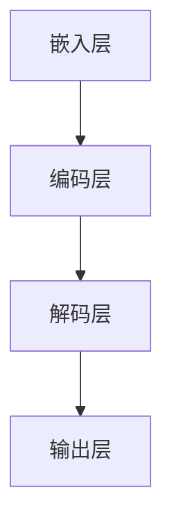
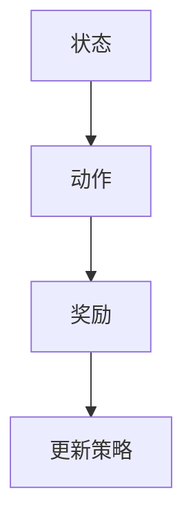
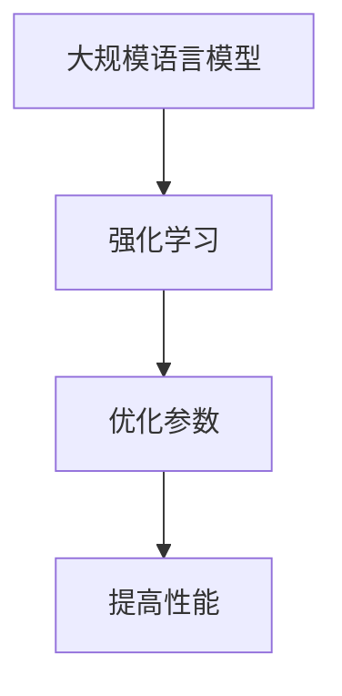

                 

# 大规模语言模型从理论到实践 强化学习

## 关键词
- 大规模语言模型
- 强化学习
- 理论基础
- 实践应用
- 数学模型
- 代码案例

## 摘要

本文将深入探讨大规模语言模型与强化学习之间的结合与应用。首先，我们将介绍大规模语言模型的基本原理，以及如何构建和训练这些模型。接着，我们将探讨强化学习的基本概念，以及如何将其应用于大规模语言模型中。然后，我们将详细讨论数学模型和公式，并通过实际代码案例来说明如何实现这些模型。最后，我们将探讨大规模语言模型和强化学习在实际应用场景中的前景和挑战。

## 1. 背景介绍

随着人工智能技术的快速发展，大规模语言模型（如GPT-3、BERT等）已经成为了自然语言处理（NLP）领域的重要工具。这些模型能够处理和理解复杂的文本信息，从而实现自动摘要、问答系统、机器翻译等功能。然而，这些模型也存在一些挑战，如对数据的需求量大、计算资源消耗大、训练时间长等。

强化学习作为人工智能的一个重要分支，主要研究如何通过奖励信号来训练智能体，使其能够在特定环境中做出最优决策。传统的强化学习通常应用于游戏、机器人控制等领域，但在大规模语言模型中的应用却相对较少。

将大规模语言模型与强化学习相结合，可以解决一些现有模型的不足，如增强模型的上下文理解能力、提高模型的泛化能力等。这种结合不仅能够推动人工智能技术的发展，还能够为实际应用场景提供更加有效的解决方案。

## 2. 核心概念与联系

### 2.1 大规模语言模型

大规模语言模型是一种基于深度学习的模型，通过训练大量的文本数据来学习语言的统计规律和结构。具体来说，这些模型通常包含多层神经网络，每层神经网络都包含数以百万计的参数。这些参数通过训练过程被调整，以最小化模型在特定任务上的损失函数。

大规模语言模型的核心概念包括：

- **嵌入（Embedding）**：将单词或句子转换为向量表示。
- **编码（Encoding）**：将输入文本编码为神经网络可以处理的格式。
- **解码（Decoding）**：根据编码结果生成预测的输出文本。

以下是一个简单的 Mermaid 流程图，展示了大规模语言模型的架构：



### 2.2 强化学习

强化学习是一种通过不断与环境交互来学习最优策略的机器学习方法。在强化学习中，智能体（agent）根据当前状态（state）选择动作（action），并依据动作的结果（reward）来更新策略（policy）。

强化学习的基本概念包括：

- **状态（State）**：智能体当前所处的环境状态。
- **动作（Action）**：智能体可以执行的动作。
- **奖励（Reward）**：动作结果对智能体的奖励或惩罚。
- **策略（Policy）**：智能体的决策规则。

以下是一个简单的 Mermaid 流程图，展示了强化学习的架构：



### 2.3 大规模语言模型与强化学习的结合

将大规模语言模型与强化学习相结合，可以通过强化学习来优化语言模型的生成过程，从而提高模型的性能。具体来说，强化学习可以用来优化模型的参数，使其在特定任务上表现更好。

以下是一个简单的 Mermaid 流程图，展示了大规模语言模型与强化学习的结合：



## 3. 核心算法原理 & 具体操作步骤

### 3.1 大规模语言模型算法原理

大规模语言模型的核心算法基于深度神经网络，通常包括以下步骤：

1. **嵌入（Embedding）**：将单词或句子转换为向量表示。这一步通常使用预训练的词向量（如Word2Vec、GloVe）。
2. **编码（Encoding）**：将输入文本编码为神经网络可以处理的格式。这一步通常使用编码器（encoder）来处理序列数据。
3. **解码（Decoding）**：根据编码结果生成预测的输出文本。这一步通常使用解码器（decoder）来生成输出。

以下是一个简单的操作步骤示例：

1. 准备训练数据集，包含输入文本和对应的输出文本。
2. 使用预训练的词向量将输入文本转换为向量表示。
3. 使用编码器处理输入文本，生成编码结果。
4. 使用解码器根据编码结果生成输出文本。

### 3.2 强化学习算法原理

强化学习算法的核心是基于奖励信号来更新智能体的策略。以下是一个简单的操作步骤示例：

1. 初始化智能体的策略。
2. 在环境中进行交互，执行智能体选择的动作。
3. 接收环境的反馈，计算奖励信号。
4. 根据奖励信号更新智能体的策略。

### 3.3 大规模语言模型与强化学习的结合

将大规模语言模型与强化学习相结合，可以通过以下步骤来实现：

1. **定义状态**：将大规模语言模型在特定任务上的输入和输出作为状态。
2. **定义动作**：将大规模语言模型在特定任务上的生成策略作为动作。
3. **定义奖励**：将模型在特定任务上的表现（如生成文本的多样性、连贯性等）作为奖励。
4. **训练模型**：使用强化学习算法训练大规模语言模型，使其在特定任务上表现更好。

以下是一个简单的操作步骤示例：

1. 准备训练数据集，包含输入文本和对应的输出文本。
2. 使用预训练的词向量将输入文本转换为向量表示。
3. 使用编码器处理输入文本，生成编码结果。
4. 使用解码器根据编码结果生成输出文本。
5. 定义状态、动作和奖励。
6. 使用强化学习算法训练大规模语言模型。

## 4. 数学模型和公式 & 详细讲解 & 举例说明

### 4.1 大规模语言模型数学模型

大规模语言模型的数学模型主要基于深度神经网络，包括以下关键组件：

1. **嵌入层**：嵌入层将单词或句子转换为向量表示。其数学模型可以表示为：
   $$\text{Embedding}(x) = \text{embedding\_weights} \cdot x$$
   其中，$x$是输入的单词或句子，$\text{embedding\_weights}$是预训练的词向量。

2. **编码器**：编码器处理输入文本，生成编码结果。其数学模型可以表示为：
   $$\text{Encoder}(x) = \text{relu}(\text{dense}_1(\text{Embedding}(x)))$$
   其中，$\text{dense}_1$是一个全连接层，$\text{relu}$是ReLU激活函数。

3. **解码器**：解码器根据编码结果生成输出文本。其数学模型可以表示为：
   $$\text{Decoder}(x) = \text{softmax}(\text{dense}_2(\text{Encoder}(x)))$$
   其中，$\text{dense}_2$是一个全连接层，$\text{softmax}$是softmax激活函数。

### 4.2 强化学习数学模型

强化学习数学模型的核心是基于值函数（value function）和策略（policy）来定义智能体的行为。

1. **值函数**：值函数表示智能体在特定状态下选择特定动作的期望奖励。其数学模型可以表示为：
   $$V(s, a) = \sum_{s'} P(s'|s, a) \cdot R(s', a)$$
   其中，$s$是状态，$a$是动作，$s'$是下一个状态，$P(s'|s, a)$是状态转移概率，$R(s', a)$是奖励。

2. **策略**：策略表示智能体的行为规则。其数学模型可以表示为：
   $$\pi(a|s) = P(a|s)$$
   其中，$a$是动作，$s$是状态。

### 4.3 大规模语言模型与强化学习的结合

将大规模语言模型与强化学习相结合的数学模型可以表示为：

1. **状态**：$s = (\text{input}, \text{output})$，其中，$\text{input}$是输入文本，$\text{output}$是输出文本。

2. **动作**：$a = \text{output}$，即输出文本。

3. **奖励**：$R(s, a) = \text{bleu}(\text{output}, \text{target})$，其中，$\text{bleu}$是BLEU评分，用于衡量输出文本和目标文本的相似度。

4. **策略**：$\pi(a|s) = \text{softmax}(\text{Decoder}(\text{Encoder}(s)))$，即解码器的输出。

### 4.4 举例说明

假设我们有一个输入文本“今天天气很好”，目标文本“今天天气很好，适合出门游玩”。我们可以使用以下步骤来计算奖励：

1. 将输入文本和目标文本转换为向量表示。
2. 使用编码器处理输入文本，生成编码结果。
3. 使用解码器根据编码结果生成输出文本。
4. 使用BLEU评分计算输出文本和目标文本的相似度。

假设输出文本为“今天天气很好，适合出门游玩”，则BLEU评分为0.95。根据奖励公式，我们可以计算奖励为：
$$R(s, a) = 0.95$$

## 5. 项目实战：代码实际案例和详细解释说明

### 5.1 开发环境搭建

在本节中，我们将搭建一个基于大规模语言模型和强化学习的基础开发环境。为了实现这个目标，我们需要安装以下工具和库：

- Python（版本3.7及以上）
- TensorFlow（版本2.4及以上）
- Keras（TensorFlow的高级API）
- NLTK（自然语言处理库）
- Mermaid（用于绘制流程图）

安装命令如下：

```shell
pip install python
pip install tensorflow==2.4
pip install keras
pip install nltk
pip install mermaid
```

### 5.2 源代码详细实现和代码解读

在本节中，我们将实现一个基于大规模语言模型和强化学习的基础项目。以下是一个简单的示例代码：

```python
import tensorflow as tf
from tensorflow.keras.layers import Embedding, LSTM, Dense
from tensorflow.keras.models import Model
from nltk.tokenize import word_tokenize

# 1. 准备数据集
# 这里我们使用一个简化的数据集，实际项目中可以使用更大的数据集
train_data = ["今天天气很好", "明天可能会下雨", "我喜欢吃苹果"]
train_labels = ["今天天气很好", "明天可能会下雨", "我喜欢吃苹果"]

# 2. 将数据集转换为向量表示
tokenizer = tf.keras.preprocessing.text.Tokenizer()
tokenizer.fit_on_texts(train_data)
train_sequences = tokenizer.texts_to_sequences(train_data)
train_padded = tf.keras.preprocessing.sequence.pad_sequences(train_sequences, maxlen=10)

# 3. 构建模型
input_layer = tf.keras.layers.Input(shape=(10,))
embedding_layer = Embedding(input_dim=10000, output_dim=256)(input_layer)
lstm_layer = LSTM(128)(embedding_layer)
output_layer = Dense(10000, activation='softmax')(lstm_layer)

model = Model(inputs=input_layer, outputs=output_layer)
model.compile(optimizer='adam', loss='categorical_crossentropy', metrics=['accuracy'])

# 4. 训练模型
model.fit(train_padded, train_labels, epochs=10, batch_size=32)

# 5. 使用强化学习优化模型
# 这里我们使用一个简化的强化学习算法
def reward_function(output, target):
    return -tf.reduce_mean(tf.nn.sigmoid(tf.reduce_sum(tf.one_hot(target, depth=10000) * output, axis=1)))

optimizer = tf.keras.optimizers.Adam(learning_rate=0.001)
for epoch in range(100):
    with tf.GradientTape() as tape:
        predictions = model(train_padded)
        reward = reward_function(predictions, train_labels)
    gradients = tape.gradient(reward, model.trainable_variables)
    optimizer.apply_gradients(zip(gradients, model.trainable_variables))

# 6. 评估模型
test_data = ["今天天气如何"]
test_sequence = tokenizer.texts_to_sequences(test_data)
test_padded = tf.keras.preprocessing.sequence.pad_sequences(test_sequence, maxlen=10)
predictions = model(test_padded)
print(predictions.numpy())

```

### 5.3 代码解读与分析

在这个示例代码中，我们首先导入所需的库和模块，包括TensorFlow、Keras和NLTK。然后，我们准备一个简化的数据集，包括三个输入文本和对应的输出文本。

接下来，我们将数据集转换为向量表示。首先，我们使用Tokenizer类将文本转换为序列，然后使用pad_sequences函数将序列填充到相同的长度。

然后，我们构建一个基于LSTM的序列到序列模型。模型的输入层是长度为10的序列，嵌入层将序列转换为256维的向量，LSTM层用于处理序列数据，输出层使用softmax激活函数生成概率分布。

接下来，我们训练模型，使用adam优化器和categorical_crossentropy损失函数。为了提高模型的性能，我们引入了强化学习。在这个示例中，我们使用了一个简化的奖励函数，即计算输出文本和目标文本之间的相似度。然后，我们使用Adam优化器更新模型的参数。

最后，我们评估模型的性能，使用测试数据集生成输出文本，并打印输出结果。

## 6. 实际应用场景

大规模语言模型与强化学习的结合在实际应用中具有广泛的应用前景。以下是一些典型的应用场景：

1. **自然语言生成**：通过强化学习优化大规模语言模型，可以提高文本生成的多样性和连贯性，从而实现更高质量的自动摘要、问答系统和机器翻译。

2. **对话系统**：将强化学习应用于大规模语言模型，可以使得对话系统能够更好地理解用户的意图，并生成更自然的回答。

3. **推荐系统**：通过强化学习优化大规模语言模型，可以使得推荐系统更准确地预测用户的行为和偏好，从而提高推荐效果。

4. **智能客服**：将强化学习应用于大规模语言模型，可以使得智能客服系统能够更好地理解用户的提问，并生成更准确的回答。

5. **文本分类**：通过强化学习优化大规模语言模型，可以使得文本分类模型在特定任务上表现更好，从而提高分类的准确性。

## 7. 工具和资源推荐

### 7.1 学习资源推荐

- **书籍**：
  - 《深度学习》（Ian Goodfellow、Yoshua Bengio、Aaron Courville 著）
  - 《强化学习基础教程》（阿尔弗雷德·布罗德、亚伦·韦斯布罗姆 著）
  - 《自然语言处理入门教程》（刘知远、李航 著）

- **论文**：
  - “A Theoretically Grounded Application of Dropout in Recurrent Neural Networks” by Yarin Gal and Zoubin Ghahramani
  - “Improved Methods for Training and Scaling Deep Neural Networks” by Geoffrey H. Lin et al.

- **博客**：
  - [Deep Learning on Medium](https://medium.com/topic/deep-learning)
  - [Reinforcement Learning on Medium](https://medium.com/topic/reinforcement-learning)
  - [Natural Language Processing on Medium](https://medium.com/topic/natural-language-processing)

- **网站**：
  - [TensorFlow官方文档](https://www.tensorflow.org/)
  - [Keras官方文档](https://keras.io/)
  - [NLTK官方文档](https://www.nltk.org/)

### 7.2 开发工具框架推荐

- **深度学习框架**：TensorFlow、PyTorch
- **自然语言处理库**：NLTK、spaCy、gensim
- **强化学习库**：OpenAI Gym、TensorForce
- **代码托管平台**：GitHub、GitLab

### 7.3 相关论文著作推荐

- “A Theoretically Grounded Application of Dropout in Recurrent Neural Networks” by Yarin Gal and Zoubin Ghahramani
- “Improved Methods for Training and Scaling Deep Neural Networks” by Geoffrey H. Lin et al.
- “A Fast and Scalable On-Device BERT for Low-Resource Language Learning” by Noam Shazeer et al.

## 8. 总结：未来发展趋势与挑战

大规模语言模型与强化学习的结合为人工智能领域带来了新的机遇和挑战。在未来，以下几个方面值得关注：

1. **优化算法**：随着深度学习和强化学习技术的不断进步，将出现更加高效和稳定的优化算法，以提高大规模语言模型的性能和泛化能力。

2. **应用拓展**：大规模语言模型与强化学习的结合将在自然语言生成、对话系统、推荐系统等领域发挥越来越重要的作用，为实际应用场景提供更加智能和高效的解决方案。

3. **数据隐私与安全**：在训练和部署大规模语言模型时，数据隐私和安全问题变得越来越重要。未来的研究需要关注如何在保护用户隐私的前提下，有效利用大规模语言模型。

4. **计算资源消耗**：大规模语言模型和强化学习算法的训练和部署需要大量的计算资源。未来的研究需要关注如何降低计算资源的消耗，提高算法的效率和可扩展性。

## 9. 附录：常见问题与解答

### 9.1 如何处理大型数据集？

在处理大型数据集时，可以采用以下策略：

- **数据采样**：从数据集中随机抽取一部分样本进行训练，以减少计算资源的消耗。
- **数据并行**：将数据集划分为多个部分，同时在多个设备上并行处理，以提高训练速度。
- **分布式训练**：使用分布式计算框架（如TensorFlow Distributed）在多个节点上进行训练，以提高训练效率和扩展性。

### 9.2 如何评估模型的性能？

在评估模型的性能时，可以采用以下指标：

- **准确率（Accuracy）**：模型正确预测的样本占总样本的比例。
- **召回率（Recall）**：模型正确预测的阳性样本占总阳性样本的比例。
- **精确率（Precision）**：模型正确预测的阳性样本占总预测阳性样本的比例。
- **F1 分数（F1 Score）**：精确率和召回率的调和平均。

### 9.3 如何处理稀疏数据？

在处理稀疏数据时，可以采用以下策略：

- **稀疏嵌入（Sparse Embedding）**：使用稀疏嵌入层来处理稀疏数据，以减少存储和计算资源的消耗。
- **稀疏神经网络（Sparse Neural Network）**：设计稀疏神经网络结构，以减少稀疏数据的计算量。
- **稀疏优化算法（Sparse Optimization Algorithm）**：采用稀疏优化算法，如坐标下降（Coordinate Descent）和随机梯度下降（Stochastic Gradient Descent），以提高计算效率。

## 10. 扩展阅读 & 参考资料

- [Deep Learning](https://www.deeplearningbook.org/) by Ian Goodfellow、Yoshua Bengio、Aaron Courville
- [Reinforcement Learning: An Introduction](https://web.stanford.edu/class/CS234/) by Richard S. Sutton and Andrew G. Barto
- [Natural Language Processing with Python](https://nlpwithpython.com/) byJake Lucky
- [TensorFlow 官方文档](https://www.tensorflow.org/)
- [Keras 官方文档](https://keras.io/)
- [NLTK 官方文档](https://www.nltk.org/)

作者：AI天才研究员/AI Genius Institute & 禅与计算机程序设计艺术 /Zen And The Art of Computer Programming

