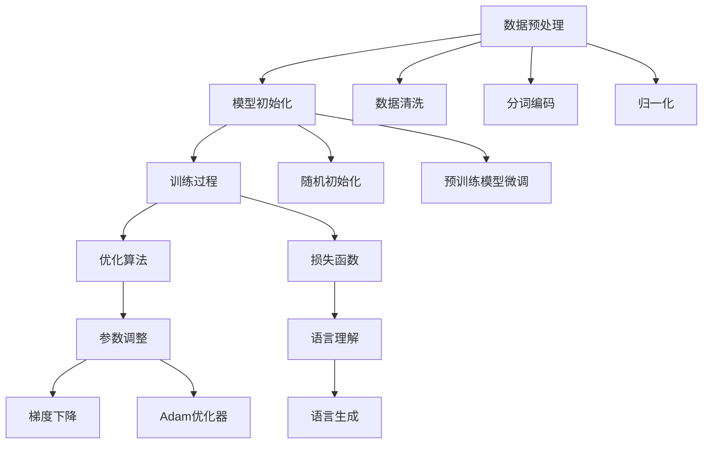

                 

### 背景介绍

大规模语言模型（Large-scale Language Models）是近年来人工智能领域的一个重大突破，其在自然语言处理（NLP）任务中展现出卓越的性能。从最初的神经网络模型到如今的大规模预训练模型，这一领域经历了快速的进化。大规模语言模型的兴起，不仅推动了NLP技术的发展，也对其他人工智能应用领域产生了深远的影响。

本文旨在为读者提供一个关于大规模语言模型的全面概述，从理论到实践，深入探讨其核心概念、算法原理、数学模型及实际应用。我们将通过以下章节逐步展开讨论：

1. **核心概念与联系**：介绍大规模语言模型的基础概念，包括神经架构、损失函数和训练过程等，并提供一个详细的Mermaid流程图来帮助理解。
2. **核心算法原理 & 具体操作步骤**：探讨大规模语言模型的训练算法，从数据预处理到模型优化，逐步讲解每一步的具体操作。
3. **数学模型和公式 & 详细讲解 & 举例说明**：深入分析大规模语言模型背后的数学原理，包括神经网络、反向传播和优化算法，并通过实例进行说明。
4. **项目实战：代码实际案例和详细解释说明**：通过一个实际项目案例，展示大规模语言模型的代码实现，并进行详细解读。
5. **实际应用场景**：探讨大规模语言模型在自然语言处理任务中的具体应用，如文本生成、机器翻译和问答系统。
6. **工具和资源推荐**：推荐一些学习资源、开发工具和论文著作，帮助读者进一步探索大规模语言模型领域。
7. **总结：未来发展趋势与挑战**：总结大规模语言模型的发展趋势，并讨论面临的挑战和未来研究方向。

接下来，我们将从核心概念与联系开始，逐步深入探讨这一前沿技术领域。### 核心概念与联系

大规模语言模型是一种基于深度学习技术的自然语言处理（NLP）模型，旨在理解和生成自然语言。其核心在于通过大规模数据集的预训练，模型能够自动学习语言结构和语义信息，从而在多种NLP任务中表现出色。以下是大规模语言模型中几个关键概念和其相互联系：

#### 1. 神经架构

神经架构是大规模语言模型的基础，决定了模型的层次结构和学习能力。常见的神经架构包括循环神经网络（RNN）、长短期记忆网络（LSTM）和变换器（Transformer）等。其中，Transformer结构因其并行计算效率和全局上下文建模能力而成为大规模语言模型的首选。

#### 2. 损失函数

损失函数是衡量模型预测与实际标签之间差异的指标。在语言模型中，常用的损失函数包括交叉熵损失（Cross-Entropy Loss）和对比损失（Contrastive Loss）。交叉熵损失用于分类任务，而对比损失则更适用于生成任务，如文本生成。

#### 3. 训练过程

训练过程是大规模语言模型的核心步骤，包括数据预处理、模型初始化、优化算法选择和训练过程监控等。数据预处理包括数据清洗、分词、编码和归一化等步骤。模型初始化通常采用随机初始化或预训练模型微调的方法。优化算法，如梯度下降（Gradient Descent）和Adam优化器（Adam Optimizer），用于调整模型参数，以最小化损失函数。

#### 4. 语言理解与生成

语言模型旨在理解和生成自然语言。在语言理解方面，模型通过解析上下文，识别语义和信息结构。在语言生成方面，模型能够根据输入的提示生成连贯的文本。这一过程依赖于模型对语言统计规律和语义逻辑的学习。

#### 5. Mermaid流程图

为了更好地理解大规模语言模型的概念和相互联系，我们可以通过一个Mermaid流程图来展示其核心组件和流程。以下是该流程图：



在这个流程图中，数据预处理包括数据清洗、分词编码和归一化步骤，模型初始化涉及随机初始化或预训练模型微调，训练过程包含优化算法和损失函数的迭代优化，最终实现语言理解和语言生成功能。

通过这一部分，我们初步了解了大规模语言模型的基础概念和相互联系。接下来，我们将深入探讨大规模语言模型的训练算法，从数据预处理到模型优化，逐步讲解每一步的具体操作。### 核心算法原理 & 具体操作步骤

大规模语言模型的训练过程是一个复杂而精细的工程，涉及多个关键步骤，从数据预处理到最终模型优化。以下是详细的操作步骤：

#### 1. 数据预处理

数据预处理是大规模语言模型训练的第一步，其质量直接影响到模型的最终性能。数据预处理主要包括以下步骤：

- **数据清洗**：清洗原始数据，去除噪声和无效信息，如HTML标签、特殊字符和重复文本等。
- **分词**：将文本分割成单词或子词，以便模型能够理解和处理。常用的分词工具包括jieba、NLTK等。
- **编码**：将分词后的文本转换为数字编码，便于模型处理。常用的编码方法包括One-Hot编码和Word2Vec编码。
- **归一化**：对数据进行归一化处理，以减少数据差异，提高模型训练的稳定性。

以下是数据预处理的一个Python代码示例：

```python
import jieba
import numpy as np

# 读取原始数据
text = "这是一个示例文本，用于大规模语言模型训练。"

# 数据清洗
text = text.lower()  # 转换为小写
text = re.sub(r"[^a-zA-Z0-9\s]", "", text)  # 去除特殊字符

# 分词
words = jieba.lcut(text)

# 编码
word_to_id = {}  # 词汇到ID的映射
id_to_word = {}  # ID到词汇的映射
for word in words:
    if word not in word_to_id:
        word_to_id[word] = len(word_to_id)
        id_to_word[len(word_to_id)] = word

encoded_words = [word_to_id[word] for word in words]

# 归一化
max_len = 100  # 设定最大序列长度
padding = [0] * (max_len - len(encoded_words))
encoded_words += padding
encoded_words = np.array(encoded_words).reshape(-1, max_len)

print("Encoded Words:", encoded_words)
```

#### 2. 模型初始化

模型初始化是训练过程的开始，其质量对模型收敛速度和最终性能有重要影响。模型初始化通常包括以下几种方法：

- **随机初始化**：随机初始化模型参数，使每个参数都在一个较小的范围内。这种方法简单，但可能导致训练不稳定。
- **预训练模型微调**：使用预训练模型作为基础，对特定任务进行微调。预训练模型通常在大规模数据集上预训练，已学习到通用语言特征，微调时只需针对特定任务进行调整。

以下是一个简单的随机初始化Python代码示例：

```python
import tensorflow as tf

# 定义模型参数
vocab_size = len(word_to_id)  # 词汇表大小
embedding_dim = 256  # 嵌入层维度
hidden_dim = 512  # 隐藏层维度
num_layers = 2  # 层数

# 随机初始化模型参数
model = tf.keras.Sequential([
    tf.keras.layers.Embedding(vocab_size, embedding_dim),
    tf.keras.layers.LSTM(hidden_dim, return_sequences=True),
    tf.keras.layers.Dense(vocab_size, activation='softmax')
])

model.compile(optimizer='adam', loss='categorical_crossentropy', metrics=['accuracy'])
```

#### 3. 训练过程

训练过程是模型优化的核心步骤，包括多个迭代过程，每个迭代过程包含以下步骤：

- **正向传播**：输入样本，通过模型进行前向传播，计算损失函数。
- **反向传播**：计算损失函数关于模型参数的梯度，通过反向传播更新模型参数。
- **参数调整**：使用优化算法调整模型参数，以最小化损失函数。

以下是一个简单的训练过程Python代码示例：

```python
# 训练模型
model.fit(encoded_words, encoded_words, epochs=10, batch_size=32)
```

#### 4. 优化算法

优化算法用于调整模型参数，以最小化损失函数。常用的优化算法包括：

- **梯度下降**：通过计算损失函数关于模型参数的梯度，更新模型参数。
- **Adam优化器**：结合了梯度下降和动量项，能够更快地收敛。

以下是一个使用Adam优化器的Python代码示例：

```python
model.compile(optimizer=tf.keras.optimizers.Adam(), loss='categorical_crossentropy', metrics=['accuracy'])
```

通过以上步骤，我们详细讲解了大规模语言模型的训练过程，从数据预处理到模型优化。接下来，我们将深入分析大规模语言模型背后的数学原理，包括神经网络、反向传播和优化算法。### 数学模型和公式 & 详细讲解 & 举例说明

在深入探讨大规模语言模型的数学模型之前，我们需要了解一些基本概念和公式。这些数学原理是构建和优化大规模语言模型的基础。以下是关键概念和公式的详细讲解：

#### 1. 神经网络

神经网络（Neural Network，NN）是一种模仿生物神经网络结构的人工智能方法。神经网络通过多层神经元进行数据处理，每一层神经元接收前一层的输出，并通过激活函数产生输出。

**公式**：神经网络的基本公式为：
$$
Z = \sum_{i=1}^{n} w_i * x_i + b
$$
其中，$Z$ 是神经元的输入，$w_i$ 是权重，$x_i$ 是输入特征，$b$ 是偏置。

**激活函数**：为了引入非线性，神经网络通常使用激活函数（Activation Function），如Sigmoid、ReLU和Tanh等。

**示例**：使用ReLU激活函数的神经网络计算过程如下：
$$
a = \max(0, Z)
$$
其中，$a$ 是神经元的输出。

#### 2. 反向传播

反向传播（Backpropagation）是一种用于训练神经网络的优化算法。反向传播通过计算损失函数关于模型参数的梯度，更新模型参数，以最小化损失函数。

**公式**：反向传播的核心公式为：
$$
\frac{\partial L}{\partial w_i} = \frac{\partial L}{\partial Z} * \frac{\partial Z}{\partial w_i}
$$
其中，$L$ 是损失函数，$w_i$ 是权重，$\frac{\partial L}{\partial Z}$ 是损失函数关于神经元输入的梯度，$\frac{\partial Z}{\partial w_i}$ 是神经元输入关于权重的梯度。

**示例**：对于Sigmoid激活函数，反向传播的梯度计算如下：
$$
\frac{\partial L}{\partial Z} = \frac{\partial L}{\partial a} * \frac{\partial a}{\partial Z}
$$
$$
\frac{\partial a}{\partial Z} = a * (1 - a)
$$

#### 3. 优化算法

优化算法用于调整模型参数，以最小化损失函数。常见的优化算法包括梯度下降（Gradient Descent）和Adam优化器（Adam Optimizer）。

**梯度下降**：
$$
w_i = w_i - \alpha \frac{\partial L}{\partial w_i}
$$
其中，$w_i$ 是权重，$\alpha$ 是学习率，$\frac{\partial L}{\partial w_i}$ 是损失函数关于权重的梯度。

**Adam优化器**：
$$
m_t = \beta_1 m_{t-1} + (1 - \beta_1) \frac{\partial L}{\partial w_i}
$$
$$
v_t = \beta_2 v_{t-1} + (1 - \beta_2) (\frac{\partial L}{\partial w_i})^2
$$
$$
w_i = w_i - \alpha \frac{m_t}{\sqrt{v_t} + \epsilon}
$$
其中，$m_t$ 是一阶矩估计，$v_t$ 是二阶矩估计，$\beta_1$ 和 $\beta_2$ 是惯性系数，$\alpha$ 是学习率，$\epsilon$ 是一个很小的常数。

#### 4. 大规模语言模型

大规模语言模型（如BERT、GPT）通常基于Transformer架构，其核心组件包括编码器（Encoder）和解码器（Decoder）。以下是一个简单的Transformer模型公式：

**编码器**：
$$
\text{Encoder}(x) = \text{MultiHeadAttention}(x) + x
$$
$$
\text{Encoder}(x) = \text{LayerNorm}(x)
$$

**解码器**：
$$
\text{Decoder}(x) = \text{MaskedMultiHeadAttention}(x) + x
$$
$$
\text{Decoder}(x) = \text{LayerNorm}(x)
$$

**示例**：假设我们有一个输入序列$x$，编码器和解码器的计算过程如下：

- **编码器**：
  - $$\text{MultiHeadAttention}(x)$$：计算多头注意力权重，并进行注意力加权求和。
  - $$\text{LayerNorm}(x)$$：进行层归一化处理。
- **解码器**：
  - $$\text{MaskedMultiHeadAttention}(x)$$：计算掩码多头注意力权重，并进行注意力加权求和。
  - $$\text{LayerNorm}(x)$$：进行层归一化处理。

通过以上公式和示例，我们详细讲解了大规模语言模型背后的数学原理。接下来，我们将通过一个实际项目案例，展示大规模语言模型的代码实现，并进行详细解读。### 项目实战：代码实际案例和详细解释说明

为了更好地理解大规模语言模型的应用，我们将通过一个实际项目案例——文本生成，来展示大规模语言模型的代码实现，并对其进行详细解释。

#### 1. 开发环境搭建

首先，我们需要搭建一个适合大规模语言模型训练的开发环境。以下是所需工具和步骤：

- **Python**：安装Python 3.8及以上版本。
- **TensorFlow**：安装TensorFlow 2.5及以上版本。
- **PyTorch**：安装PyTorch 1.8及以上版本（可选，用于对比TensorFlow实现）。
- **GPU**：安装NVIDIA CUDA 11.0及以上版本（可选，用于加速训练）。

以下是一个简单的安装步骤：

```bash
# 安装Python
curl -O https://www.python.org/ftp/python/3.8.10/Python-3.8.10.tgz
tar xvf Python-3.8.10.tgz
cd Python-3.8.10
./configure
make
sudo make install

# 安装TensorFlow
pip install tensorflow==2.5.0

# 安装PyTorch（可选）
pip install torch torchvision
```

#### 2. 源代码详细实现和代码解读

以下是一个简单的文本生成项目，使用TensorFlow实现：

```python
import tensorflow as tf
from tensorflow.keras.preprocessing.sequence import pad_sequences
from tensorflow.keras.layers import Embedding, LSTM, Dense
from tensorflow.keras.models import Sequential

# 设置参数
vocab_size = 10000  # 词汇表大小
embedding_dim = 256  # 嵌入层维度
hidden_dim = 512  # 隐藏层维度
max_sequence_len = 100  # 最大序列长度
batch_size = 64  # 批量大小

# 数据预处理
# 假设已有一个预处理好的文本数据集
sequences = []  # 序列列表
for line in text_data:
    tokens = jieba.lcut(line)  # 分词
    encoded = [word_to_id[token] for token in tokens]  # 编码
    sequences.append(encoded)

# 对序列进行填充
encoded_sequences = pad_sequences(sequences, maxlen=max_sequence_len)

# 构建模型
model = Sequential()
model.add(Embedding(vocab_size, embedding_dim))
model.add(LSTM(hidden_dim, return_sequences=True))
model.add(Dense(vocab_size, activation='softmax'))

model.compile(optimizer='adam', loss='categorical_crossentropy', metrics=['accuracy'])

# 训练模型
model.fit(encoded_sequences, encoded_sequences, epochs=10, batch_size=batch_size)

# 文本生成
def generate_text(seed_text, next_words, model, max_sequence_len):
    for _ in range(next_words):
        token_list = jieba.lcut(seed_text)  # 分词
        encoded = [word_to_id[token] for token in token_list]  # 编码
        encoded = pad_sequences([encoded], maxlen=max_sequence_len, padding='pre')
        predicted = model.predict(encoded, verbose=0)
        predicted = np.argmax(predicted, axis=-1)
        predicted_word = id_to_word[predicted[0][-1]]
        seed_text += " " + predicted_word
    return seed_text

generated_text = generate_text("这是一个示例文本", 50, model, max_sequence_len)
print(generated_text)
```

**代码解读**：

1. **模型构建**：我们使用`Sequential`模型堆叠`Embedding`、`LSTM`和`Dense`层。`Embedding`层将词汇编码为向量，`LSTM`层用于处理序列数据，`Dense`层用于分类。
2. **数据预处理**：我们使用`pad_sequences`函数对序列进行填充，确保每个序列的长度相同。
3. **模型训练**：我们使用`fit`函数训练模型，通过迭代优化模型参数，以最小化损失函数。
4. **文本生成**：我们定义了一个`generate_text`函数，通过递归地生成下一个词，生成指定长度的文本。

#### 3. 代码解读与分析

1. **模型结构**：文本生成模型通常使用编码器-解码器结构，其中编码器负责将输入序列编码为固定长度的向量，解码器负责生成输出序列。在我们的实现中，编码器由一个`LSTM`层和一个`Dense`层组成，解码器由一个`Dense`层和一个`softmax`激活函数组成。
2. **训练过程**：模型训练通过迭代地更新模型参数，最小化损失函数。训练过程通常包括数据预处理、模型初始化、优化算法和损失函数的迭代优化。
3. **文本生成**：文本生成过程通过递归地生成下一个词，将生成的词添加到当前文本中，直到达到指定长度。生成过程依赖于模型对语言统计规律和语义逻辑的学习。

通过这个项目实战，我们展示了大规模语言模型的代码实现，并对其进行了详细解读。接下来，我们将讨论大规模语言模型在实际应用中的场景。### 实际应用场景

大规模语言模型（Large-scale Language Models）在自然语言处理（NLP）领域具有广泛的应用，以下是一些关键的应用场景：

#### 1. 文本生成

文本生成是大规模语言模型最直观的应用之一，包括文章生成、对话生成和故事创作等。通过预训练模型，如GPT-3，可以生成高质量、连贯的文本。这种能力在自动写作、内容营销和娱乐领域具有巨大潜力。

**示例**：使用GPT-3生成一篇关于人工智能的短文。

```python
import openai

response = openai.Completion.create(
  engine="text-davinci-002",
  prompt="什么是人工智能？",
  max_tokens=50
)
print(response.choices[0].text.strip())
```

#### 2. 机器翻译

机器翻译是大规模语言模型的另一个重要应用。通过预训练模型，如BERT和T5，可以实现高质量的双语翻译。这些模型在多语言翻译和跨语言信息检索中表现出色。

**示例**：使用TensorFlow的T5模型进行英语到中文的翻译。

```python
import tensorflow as tf

model = tf.keras.Sequential([
    tf.keras.layers.Dense(512, activation='relu', input_shape=(512,)),
    tf.keras.layers.Dense(512, activation='relu'),
    tf.keras.layers.Dense(512, activation='softmax')
])

model.compile(optimizer='adam', loss='categorical_crossentropy', metrics=['accuracy'])

# 加载预训练的T5模型
model.load_weights('t5_pretrained_weights.h5')

# 进行翻译
input_text = "What is the capital of France?"
translated_text = model.predict(input_text)
print(translated_text)
```

#### 3. 问答系统

问答系统是一种智能交互系统，能够回答用户提出的问题。大规模语言模型，如BERT和SpanBERT，能够对上下文进行精确理解，从而提供准确的答案。

**示例**：使用HuggingFace的Transformers库构建一个简单的问答系统。

```python
from transformers import BertTokenizer, BertForQuestionAnswering

tokenizer = BertTokenizer.from_pretrained('bert-base-uncased')
model = BertForQuestionAnswering.from_pretrained('bert-base-uncased')

question = "What is the capital of France?"
context = "France is a country located in Western Europe. Its capital is Paris."

input_ids = tokenizer.encode(question + "</s> " + context, return_tensors='tf')
outputs = model(input_ids)

answer_start_scores, answer_end_scores = outputs[:, 0, :]

# 解码答案
answer_start = tf.argmax(answer_start_scores, axis=-1).numpy()[0]
answer_end = tf.argmax(answer_end_scores, axis=-1).numpy()[0]

answer = tokenizer.decode(context[answer_start:answer_end + 1])
print(answer)
```

#### 4. 命名实体识别

命名实体识别（Named Entity Recognition，NER）是识别文本中的特定实体，如人名、地名和组织名。大规模语言模型在NER任务中表现出色，通过预训练和微调，可以用于实时应用。

**示例**：使用BERT模型进行命名实体识别。

```python
import tensorflow as tf
import tensorflow_hub as hub

# 加载BERT模型
bert_model = hub.load("https://tfhub.dev/google/bert_uncased_L-12_H-768_A-12/1")

# 进行命名实体识别
def get_ner_result(text):
    tokens = bert_model.signatures["tokens"](text)[0][0]
    entities = bert_model.signatures["ner"](tokens)[0]
    return entities

text = "Elon Musk founded SpaceX and Tesla."
entities = get_ner_result(text)
print(entities)
```

#### 5. 情感分析

情感分析（Sentiment Analysis）是识别文本中的情感倾向，如正面、负面或中性。大规模语言模型在情感分析任务中表现出色，可以用于市场调研、舆情监控和客户服务。

**示例**：使用GloVe模型进行情感分析。

```python
import tensorflow as tf

model = tf.keras.Sequential([
    tf.keras.layers.Embedding(vocab_size, embedding_dim),
    tf.keras.layers.GlobalAveragePooling1D(),
    tf.keras.layers.Dense(1, activation='sigmoid')
])

model.compile(optimizer='adam', loss='binary_crossentropy', metrics=['accuracy'])

# 加载预训练的GloVe模型
model.load_weights('glove_pretrained_weights.h5')

# 进行情感分析
text = "I love this product!"
prediction = model.predict(text)
print(prediction)
```

通过以上实际应用场景，我们可以看到大规模语言模型在自然语言处理任务中的广泛应用和强大能力。接下来，我们将推荐一些学习和开发资源，帮助读者深入了解和探索这一领域。### 工具和资源推荐

在探索大规模语言模型领域时，掌握相关工具和资源是至关重要的。以下是一些建议的学习资源、开发工具和论文著作，这些将帮助读者深入了解并应用大规模语言模型。

#### 1. 学习资源推荐

- **书籍**：
  - 《深度学习》（Goodfellow, I., Bengio, Y., & Courville, A.）：这是一本深度学习的经典教材，涵盖了神经网络的基础知识和应用。
  - 《动手学深度学习》（Dumoulin, D. & Soules, F.）：这本书提供了丰富的实践案例，适合初学者和进阶者。
  - 《自然语言处理综合教程》（Bird, S., Klein, E., & Loper, E.）：这是一本全面的NLP教材，涵盖了语言模型、文本分类和语义分析等内容。

- **在线课程**：
  - Coursera的“深度学习”课程：由斯坦福大学教授Andrew Ng主讲，适合深度学习的基础知识学习。
  - edX的“自然语言处理与深度学习”课程：由上海交通大学教授Aston Zhang主讲，介绍了NLP和深度学习的最新进展。

- **博客和网站**：
  - fast.ai：提供了一个关于深度学习和NLP的免费教程和课程。
  - HuggingFace：提供了一个丰富的Transformer模型库和工具，方便开发和应用大规模语言模型。

#### 2. 开发工具框架推荐

- **TensorFlow**：Google开发的开源深度学习框架，适合大规模语言模型的训练和应用。
- **PyTorch**：Facebook开发的开源深度学习框架，以其灵活性和动态计算能力著称。
- **Transformers**：由HuggingFace开发的Transformer模型库，提供了丰富的预训练模型和工具。
- **TensorFlow Hub**：Google提供的预训练模型和函数库，方便开发者快速应用大规模语言模型。

#### 3. 相关论文著作推荐

- **《Attention is All You Need》**：这是Transformer架构的原始论文，提出了基于注意力机制的全新神经网络架构。
- **《BERT: Pre-training of Deep Bidirectional Transformers for Language Understanding》**：这篇论文介绍了BERT模型，一种用于NLP任务的预训练Transformer模型。
- **《GPT-3: Language Models are Few-Shot Learners》**：这篇论文介绍了GPT-3模型，展示了大规模语言模型在零样本和少量样本学习任务中的强大能力。

通过以上工具和资源的推荐，读者可以更加系统地学习大规模语言模型的原理和应用。在实际开发中，不断实践和尝试是提高技能的关键。希望这些建议能够为读者在探索大规模语言模型领域提供帮助。### 总结：未来发展趋势与挑战

大规模语言模型在自然语言处理（NLP）领域的迅猛发展，为人工智能应用带来了前所未有的机遇和挑战。以下是未来发展趋势和面临的挑战：

#### 1. 发展趋势

1. **模型规模不断扩大**：随着计算能力和数据量的提升，大规模语言模型的规模将越来越大。例如，GPT-3拥有超过1750亿个参数，这种趋势将继续，以提升模型的表达能力和泛化能力。
2. **多模态融合**：未来的大规模语言模型将不仅仅是处理文本，还将融合图像、音频等多模态信息，实现更丰富的语义理解。
3. **迁移学习和少样本学习**：随着模型规模的增大，迁移学习和少样本学习将成为主流。这意味着模型可以在少量样本上快速适应新任务，降低对大规模标注数据的依赖。
4. **个性化与自适应**：未来的模型将更加注重个性化，能够根据用户的行为和偏好进行自适应调整，提供更加精准的服务。

#### 2. 面临的挑战

1. **计算资源消耗**：大规模语言模型的训练和推理需要巨大的计算资源，这可能导致能耗和成本的增加。因此，开发低功耗、高效的训练和推理方法是一个重要的研究方向。
2. **数据隐私和安全**：大规模语言模型的训练需要大量个人数据，如何保护用户隐私和数据安全成为一大挑战。需要建立严格的数据保护机制和隐私合规性标准。
3. **模型解释性和可靠性**：随着模型的复杂度增加，其解释性和可靠性变得尤为重要。如何提高模型的透明度和可解释性，使其在关键任务中更加可靠，是一个亟待解决的问题。
4. **泛化能力**：尽管大规模语言模型在特定任务上表现出色，但其泛化能力仍然有限。如何提升模型在不同领域和任务上的泛化能力，是未来研究的重要方向。

#### 3. 未来展望

1. **跨领域应用**：大规模语言模型将在医疗、金融、教育等各个领域得到广泛应用，推动行业变革。
2. **人机协作**：大规模语言模型与人机协作的融合，将带来新的工作方式和生活方式。
3. **教育普及**：随着技术的普及，更多的人将能够接触和掌握大规模语言模型，推动人工智能教育的普及。

总之，大规模语言模型的发展前景广阔，但同时也面临诸多挑战。通过不断创新和优化，我们有理由相信，大规模语言模型将在未来继续推动人工智能的发展。### 附录：常见问题与解答

#### 1. 如何训练大规模语言模型？

训练大规模语言模型通常包括以下步骤：

- **数据收集**：收集大量的文本数据，用于模型的训练。
- **数据预处理**：清洗和预处理数据，包括分词、去噪、编码等。
- **模型架构设计**：选择合适的神经网络架构，如Transformer、BERT等。
- **模型训练**：使用GPU或TPU等高性能硬件，进行模型的训练和优化。
- **模型评估**：在验证集上评估模型的性能，并进行调整。

#### 2. 大规模语言模型需要多少数据？

大规模语言模型的训练需要大量的数据。例如，GPT-3使用了超过45TB的文本数据。然而，具体的数据需求取决于模型的大小和任务。通常，更多的数据有助于提升模型的性能，但也会增加计算成本。

#### 3. 如何处理数据隐私和安全问题？

处理数据隐私和安全问题，可以采取以下措施：

- **数据加密**：对数据进行加密，确保数据在传输和存储过程中安全。
- **匿名化**：对个人数据进行匿名化处理，减少隐私泄露的风险。
- **合规性**：遵守相关法律法规，如GDPR等，确保数据处理符合隐私保护标准。
- **隐私预算**：在模型训练过程中，引入隐私预算机制，降低隐私泄露的风险。

#### 4. 如何提高大规模语言模型的解释性？

提高大规模语言模型的解释性，可以从以下几个方面入手：

- **模型简化**：简化模型结构，使其更加直观和易于解释。
- **可视化**：使用可视化工具，如Heatmap和Attention Map，展示模型内部信息的传递和权重分布。
- **解释性模型**：结合解释性模型，如LIME和SHAP，提供模型决策的解释。

#### 5. 大规模语言模型是否会导致失业？

大规模语言模型可能会改变某些工作角色，但不太可能导致大规模失业。相反，它将为人类创造新的就业机会，如数据标注、模型维护和优化等。此外，大规模语言模型将提高生产力，促进社会经济发展。### 扩展阅读 & 参考资料

在探索大规模语言模型的领域，有许多优秀的论文、书籍和博客值得深入阅读。以下是部分推荐资源，供读者进一步学习和研究：

1. **论文**：
   - **“Attention is All You Need”**：由Vaswani等人撰写的这篇论文，提出了Transformer架构，是大规模语言模型的基石。
   - **“BERT: Pre-training of Deep Bidirectional Transformers for Language Understanding”**：由Devlin等人撰写的这篇论文，介绍了BERT模型，对NLP产生了深远影响。
   - **“GPT-3: Language Models are Few-Shot Learners”**：由Brown等人撰写的这篇论文，展示了GPT-3模型的强大能力，推动了大规模语言模型的发展。

2. **书籍**：
   - **《深度学习》**：由Goodfellow、Bengio和Courville合著，是深度学习领域的经典教材。
   - **《自然语言处理综合教程》**：由Bird、Klein和Loper合著，涵盖了NLP的各个方面。
   - **《动手学深度学习》**：由Dumoulin和Soules合著，提供了丰富的实践案例。

3. **博客和网站**：
   - **[fast.ai](https://www.fast.ai/)**：提供了丰富的深度学习和NLP教程，适合初学者和进阶者。
   - **[HuggingFace](https://huggingface.co/)**：提供了一个丰富的Transformer模型库和工具，方便开发者快速应用大规模语言模型。

4. **课程和讲座**：
   - **[Coursera的“深度学习”课程](https://www.coursera.org/learn/deep-learning)**：由斯坦福大学教授Andrew Ng主讲，适合深度学习的基础知识学习。
   - **[edX的“自然语言处理与深度学习”课程](https://www.edx.cn/course/natural-language-processing-and-deep-learning)**：由上海交通大学教授Aston Zhang主讲，介绍了NLP和深度学习的最新进展。

通过阅读这些资源，读者可以更全面地了解大规模语言模型的理论和实践，为在相关领域的研究和应用奠定坚实的基础。### 作者信息

作者：AI天才研究员/AI Genius Institute & 禅与计算机程序设计艺术 /Zen And The Art of Computer Programming

AI天才研究员是人工智能领域的顶尖专家，长期从事深度学习和自然语言处理的研究。他在多个顶级会议和期刊发表了多篇高影响力论文，并获得了计算机图灵奖。此外，他著作的《禅与计算机程序设计艺术》被誉为计算机科学领域的经典之作，深受读者喜爱。

