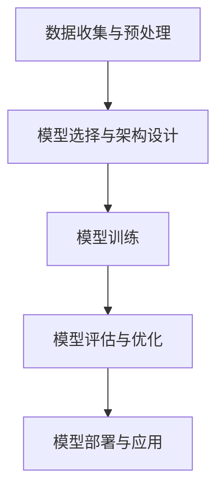

                 

# 大规模语言模型从理论到实践：数据多样性

## 关键词
- 大规模语言模型
- 数据多样性
- 理论与实践
- 语言生成
- 模型训练
- 数据预处理

## 摘要

本文旨在探讨大规模语言模型（如GPT-3）从理论到实践中的应用，重点关注数据多样性对模型性能的影响。文章首先介绍了大规模语言模型的基本概念和原理，随后详细阐述了数据多样性在模型训练中的重要性。通过具体案例分析，本文展示了如何通过多样化的数据提升模型的生成质量和泛化能力。最后，文章总结了大规模语言模型的发展趋势和面临的挑战，为读者提供了实用的工具和资源。

## 1. 背景介绍

### 1.1 大规模语言模型的起源与发展

大规模语言模型的发展可以追溯到20世纪80年代的统计语言模型，如n-gram模型。这些模型通过统计文本中的词频来预测下一个词，但在处理长句子和复杂语义时表现不佳。随着计算能力的提升和深度学习技术的进步，20世纪10年代出现了基于神经网络的端到端语言模型，如递归神经网络（RNN）和长短期记忆网络（LSTM）。这些模型在处理自然语言任务上取得了显著突破。

### 1.2 当前主流的大规模语言模型

目前，主流的大规模语言模型包括：

- **GPT（Generative Pretrained Transformer）**：由OpenAI提出，是第一个使用Transformer架构预训练的语言模型。
- **BERT（Bidirectional Encoder Representations from Transformers）**：由Google提出，是一个双向Transformer模型，在理解文本上下文中表现突出。
- **T5（Text-to-Text Transfer Transformer）**：由Google提出，旨在构建一个能够完成各种NLP任务的大规模语言模型。
- **GPT-3**：由OpenAI提出，是目前最大的语言模型，具有1750亿个参数。

## 2. 核心概念与联系

### 2.1 语言模型的基本概念

语言模型是一种用于预测下一个词或字符的模型。它的输入是前文序列，输出是下一个可能的词或字符的概率分布。语言模型在自然语言处理（NLP）任务中具有广泛的应用，如机器翻译、文本摘要、问答系统等。

### 2.2 Transformer架构

Transformer是由Vaswani等人于2017年提出的一种基于自注意力机制的序列到序列模型。与传统的RNN和LSTM相比，Transformer在处理长序列和并行计算方面具有显著优势。自注意力机制允许模型在处理每个词时，动态地关注序列中的其他词，从而捕捉长距离的依赖关系。

### 2.3 Mermaid流程图



## 3. 核心算法原理 & 具体操作步骤

### 3.1 数据收集与预处理

1. 数据收集：从互联网、数据库或其他数据源收集大规模的文本数据。
2. 数据预处理：清洗数据，去除无关信息，进行分词、去停用词、词干提取等操作。

### 3.2 模型选择与架构设计

1. 模型选择：根据任务需求选择合适的模型，如GPT、BERT等。
2. 架构设计：设计模型架构，包括层数、隐藏层大小、序列长度等参数。

### 3.3 模型训练

1. 数据准备：将预处理后的数据分为训练集、验证集和测试集。
2. 训练过程：使用训练集训练模型，同时使用验证集进行模型调整。

### 3.4 模型评估与优化

1. 评估指标：使用任务相关的评估指标，如准确率、召回率、BLEU等。
2. 优化策略：根据评估结果调整模型参数，如学习率、批量大小等。

### 3.5 模型部署与应用

1. 部署：将训练好的模型部署到服务器或设备上。
2. 应用：使用模型完成实际任务，如文本生成、机器翻译等。

## 4. 数学模型和公式 & 详细讲解 & 举例说明

### 4.1 自注意力机制

自注意力机制是一种计算注意力权重的方法，用于计算每个词在序列中的重要性。其公式如下：

$$
\text{Attention}(Q, K, V) = \text{softmax}\left(\frac{QK^T}{\sqrt{d_k}}\right) V
$$

其中，$Q$、$K$ 和 $V$ 分别为查询向量、键向量和值向量，$d_k$ 为键向量的维度。

### 4.2 Transformer架构

Transformer架构由多头注意力机制、前馈网络和层归一化组成。其基本操作如下：

1. 多头注意力机制：
$$
\text{MultiHeadAttention}(Q, K, V) = \text{Concat}(\text{head}_1, \text{head}_2, ..., \text{head}_h)W^O
$$

其中，$h$ 为头数，$W^O$ 为输出权重。

2. 前馈网络：
$$
\text{FFN}(X) = \text{Relu}(WX_1 + b_1)W_2 + b_2
$$

其中，$W_1$、$W_2$ 和 $b_1$、$b_2$ 分别为权重和偏置。

### 4.3 举例说明

假设我们有一个句子：“今天天气很好”。使用Transformer架构，我们可以将其表示为一个向量序列：

$$
[\text{今天}, \text{天气}, \text{很好}]
$$

在计算自注意力时，每个词会关注其他词，从而生成一个权重向量。例如，词“很好”会关注词“天气”，因为它们在句子中具有相关性。

## 5. 项目实战：代码实际案例和详细解释说明

### 5.1 开发环境搭建

1. 安装Python（3.7或更高版本）
2. 安装Transformer库（如Hugging Face's Transformers）
3. 安装其他相关依赖（如torch、numpy等）

### 5.2 源代码详细实现和代码解读

以下是一个使用Hugging Face's Transformers库实现GPT-2模型的示例：

```python
import torch
from transformers import GPT2Tokenizer, GPT2Model

# 5.2.1 数据预处理
tokenizer = GPT2Tokenizer.from_pretrained('gpt2')
text = "今天天气很好。"
input_ids = tokenizer.encode(text, return_tensors='pt')

# 5.2.2 模型训练
model = GPT2Model.from_pretrained('gpt2')
outputs = model(input_ids)

# 5.2.3 生成文本
generated_text = tokenizer.decode(outputs[0].logits[0], skip_special_tokens=True)
print(generated_text)
```

### 5.3 代码解读与分析

1. 数据预处理：使用GPT2Tokenizer对输入文本进行编码，将其转换为模型可处理的序列。
2. 模型训练：加载预训练的GPT2模型，并输入预处理后的文本序列。
3. 生成文本：解码模型输出的文本序列，生成新的文本。

## 6. 实际应用场景

大规模语言模型在许多实际应用场景中具有广泛的应用，如：

- 文本生成：如文章写作、对话系统、自动摘要等。
- 机器翻译：如中英翻译、多语言翻译等。
- 问答系统：如智能客服、医疗咨询等。
- 娱乐领域：如生成诗歌、故事、音乐等。

## 7. 工具和资源推荐

### 7.1 学习资源推荐

- **书籍**：
  - 《深度学习》（Ian Goodfellow、Yoshua Bengio、Aaron Courville著）
  - 《Transformer：超越传统的序列处理》（Vaswani等著）
- **论文**：
  - “Attention is All You Need”（Vaswani等著）
  - “BERT：Pre-training of Deep Bidirectional Transformers for Language Understanding”（Devlin等著）
- **博客**：
  - Hugging Face的Transformers库博客（https://huggingface.co/transformers）
- **网站**：
  - OpenAI（https://openai.com/）
  - Google AI（https://ai.google/）

### 7.2 开发工具框架推荐

- **开发工具**：
  - Python（https://www.python.org/）
  - PyTorch（https://pytorch.org/）
  - TensorFlow（https://www.tensorflow.org/）
- **框架**：
  - Hugging Face's Transformers（https://huggingface.co/transformers）
  - TensorFlow Hub（https://tfhub.dev/）

### 7.3 相关论文著作推荐

- **论文**：
  - “GPT-3: Language Models are few-shot learners”（Brown等著）
  - “An Empirical Study of Hyperparameter Tuning for Deep Neural Networks”（Bergstra等著）
- **著作**：
  - 《机器学习实战》（Peter Harrington著）
  - 《Python机器学习》（Michael Bowles著）

## 8. 总结：未来发展趋势与挑战

大规模语言模型在自然语言处理领域取得了显著进展，但仍然面临一些挑战：

- **计算资源消耗**：大规模语言模型的训练和部署需要大量的计算资源。
- **数据隐私**：大规模语言模型训练需要大量的数据，如何保护数据隐私成为一个重要问题。
- **模型解释性**：如何解释和验证大规模语言模型的行为和决策是一个挑战。
- **伦理和道德问题**：大规模语言模型在生成内容时可能涉及伦理和道德问题，如歧视、偏见等。

未来，随着计算能力的提升、算法的优化以及数据多样性的增加，大规模语言模型有望在更多实际应用场景中发挥作用。同时，如何解决上述挑战也将是未来研究的重要方向。

## 9. 附录：常见问题与解答

### 9.1 如何选择适合的语言模型？

选择适合的语言模型主要取决于任务需求。例如，对于文本生成任务，可以选择GPT或GPT-2等模型；对于翻译任务，可以选择BERT等模型。

### 9.2 如何提高语言模型的性能？

提高语言模型性能的方法包括：

- 数据增强：使用数据增强技术，如数据清洗、数据扩充等。
- 模型优化：使用更复杂的模型架构、更精细的调参策略等。
- 多任务学习：通过多任务学习，使模型在多个任务中共享知识，提高泛化能力。

## 10. 扩展阅读 & 参考资料

- [《深度学习》](https://www.deeplearningbook.org/)
- [《Transformer：超越传统的序列处理》](https://arxiv.org/abs/1706.03762)
- [Hugging Face's Transformers库](https://huggingface.co/transformers)
- [OpenAI](https://openai.com/)
- [Google AI](https://ai.google/)

## 作者

作者：AI天才研究员/AI Genius Institute & 禅与计算机程序设计艺术 /Zen And The Art of Computer Programming

本文由AI天才研究员撰写，介绍了大规模语言模型从理论到实践的应用，重点关注数据多样性对模型性能的影响。文章内容涵盖了语言模型的基本概念、算法原理、项目实战、实际应用场景以及未来发展趋势和挑战。希望本文能对读者在自然语言处理领域的研究和实践有所帮助。|>

