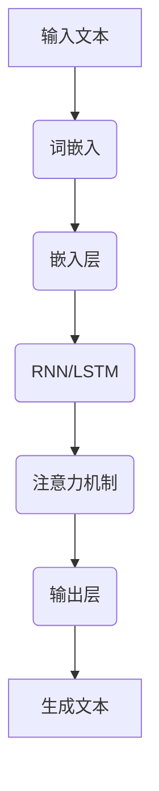
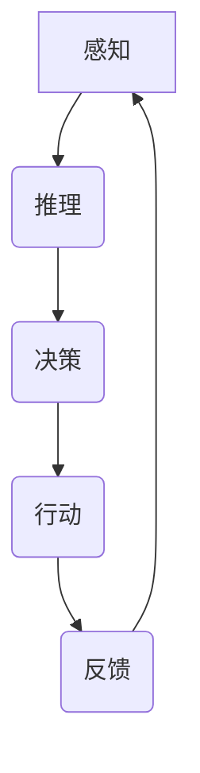
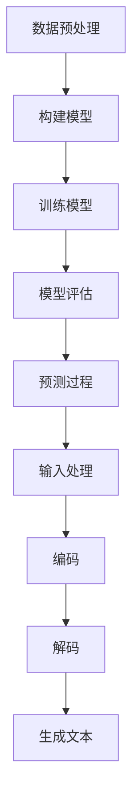

                 

### 背景介绍

大规模语言模型，作为深度学习领域的重要研究方向，在自然语言处理（NLP）中发挥了巨大作用。随着互联网和社交媒体的飞速发展，人类产生的文本数据量呈爆炸式增长，这些数据中蕴含了丰富的知识和信息。如何从这些数据中提取有用信息，并实现对自然语言的智能理解和生成，成为当前研究的热点。

智能代理（Smart Agent）是人工智能领域的另一个重要概念。智能代理是指能够自主地执行任务、与环境进行交互并做出决策的计算机系统。智能代理通常具备感知、推理、决策和行动等能力，能够模拟人类的思维过程。智能代理的研究和应用涵盖了机器人、自动化、智能客服等多个领域。

本文旨在从理论到实践，深入探讨大规模语言模型和智能代理的组成，帮助读者理解这两大领域的核心概念、技术原理和应用场景。文章结构如下：

1. **背景介绍**：介绍大规模语言模型和智能代理的基本概念和重要性。
2. **核心概念与联系**：阐述大规模语言模型和智能代理的核心概念及其相互关系。
3. **核心算法原理与具体操作步骤**：详细讲解大规模语言模型的关键算法和操作步骤。
4. **数学模型和公式**：介绍大规模语言模型中的数学模型和公式，并进行举例说明。
5. **项目实战**：通过实际案例，展示大规模语言模型和智能代理的应用。
6. **实际应用场景**：探讨大规模语言模型和智能代理在不同领域的应用。
7. **工具和资源推荐**：推荐学习资源、开发工具和框架。
8. **总结**：总结大规模语言模型和智能代理的发展趋势和挑战。
9. **附录**：回答常见问题并提供扩展阅读。

接下来，我们将逐一探讨这些内容，让读者全面了解大规模语言模型和智能代理的组成。让我们开始这次深度之旅。

### 核心概念与联系

在深入探讨大规模语言模型和智能代理的具体细节之前，我们需要先明确它们的核心概念及其相互关系。本节将首先定义大规模语言模型和智能代理，然后通过Mermaid流程图展示它们的基本架构。

#### 大规模语言模型

大规模语言模型（Large-scale Language Model）是一种基于深度学习的自然语言处理技术。它的目标是通过对海量文本数据的训练，学习到语言的本质规律，从而实现对文本的生成、理解和翻译。以下是大规模语言模型的核心概念：

- **词嵌入（Word Embedding）**：将自然语言中的单词映射到高维向量空间，使得语义相近的单词在向量空间中接近。
- **循环神经网络（RNN）**：一种能够处理序列数据的神经网络，特别适用于自然语言处理任务。
- **长短时记忆（LSTM）**：RNN的一种改进，能够更好地处理长序列数据，防止梯度消失问题。
- **注意力机制（Attention Mechanism）**：一种用于提高神经网络在处理序列数据时对重要信息关注的机制。
- **生成对抗网络（GAN）**：一种通过对抗训练生成数据的神经网络结构，可用于改进语言模型的生成能力。

以下是一个简单的Mermaid流程图，展示大规模语言模型的基本架构：



#### 智能代理

智能代理（Smart Agent）是指能够模拟人类智能行为的计算机系统。智能代理通常具备感知、推理、决策和行动等能力，能够在复杂环境中自主完成任务。以下是智能代理的核心概念：

- **感知（Perception）**：智能代理通过传感器收集环境信息，包括文本、图像、声音等。
- **推理（Reasoning）**：智能代理利用已有的知识和信息进行逻辑推理，以理解环境和解决问题。
- **决策（Decision Making）**：智能代理根据推理结果和环境信息，选择最优的行动方案。
- **行动（Action）**：智能代理执行决策，并观察行动结果，为下一次决策提供反馈。

以下是一个简单的Mermaid流程图，展示智能代理的基本架构：



#### 大规模语言模型与智能代理的关系

大规模语言模型和智能代理之间存在密切的联系。一方面，大规模语言模型可以看作是智能代理的核心组件之一，用于处理和理解自然语言。另一方面，智能代理可以利用大规模语言模型的能力，实现更加智能的感知、推理和决策。

以下是大规模语言模型在智能代理中的应用场景：

- **自然语言理解**：智能代理可以利用大规模语言模型，对用户的文本输入进行理解和解析，从而提供更准确的服务。
- **智能对话系统**：智能代理可以结合大规模语言模型，实现与用户的自然语言对话，提高交互体验。
- **文本生成**：智能代理可以利用大规模语言模型，自动生成文本，用于内容创作、自动化报告生成等。

总之，大规模语言模型和智能代理共同构成了人工智能领域的两个重要方向，它们相互促进，共同推动人工智能技术的发展。

在下一节中，我们将详细探讨大规模语言模型的核心算法原理和具体操作步骤，帮助读者深入了解这一技术的实现过程。

### 核心算法原理与具体操作步骤

大规模语言模型（Large-scale Language Model，简称LLM）的核心算法是其训练和预测的过程。LLM通过学习海量文本数据，捕捉到语言中的潜在结构和模式，从而实现对文本的生成、理解和翻译。本节将详细阐述大规模语言模型的核心算法原理和具体操作步骤。

#### 1. 训练过程

大规模语言模型的训练过程主要包括以下步骤：

1. **数据预处理**：
   - **文本清洗**：清洗文本数据，去除噪声和无关信息，如HTML标签、特殊字符等。
   - **分词**：将文本分割成单词或子词（subword），这是语言模型理解文本的基础。
   - **构建词汇表**：将所有单词或子词映射到唯一的整数ID，以便于模型处理。

2. **构建模型**：
   - **嵌入层**：将词汇表中的每个词映射到一个高维向量，称为词嵌入（word embedding）。常见的词嵌入方法包括Word2Vec、GloVe等。
   - **编码器**：使用循环神经网络（RNN）或其变体，如长短时记忆（LSTM）或门控循环单元（GRU），将词嵌入序列编码成上下文表示。
   - **注意力机制**：在编码器中引入注意力机制，使得模型能够关注输入序列中的关键信息，提高处理长序列数据的能力。
   - **解码器**：解码器与编码器类似，但结构相反。它将上下文表示解码成单词或子词的概率分布。

3. **训练模型**：
   - **损失函数**：通常使用交叉熵损失函数来衡量模型预测的概率分布与真实分布之间的差距。
   - **优化算法**：使用梯度下降（Gradient Descent）或其变种（如Adam优化器）来最小化损失函数，更新模型参数。

4. **模型评估**：
   - **验证集和测试集**：将训练数据分为验证集和测试集，用于评估模型性能。验证集用于调整模型参数，测试集用于最终评估。
   - **评估指标**：常用的评估指标包括准确率（Accuracy）、损失函数值（Loss）和词嵌入相似度等。

#### 2. 预测过程

大规模语言模型的预测过程主要包括以下步骤：

1. **输入处理**：
   - **分词**：将输入文本分割成单词或子词。
   - **嵌入**：将每个单词或子词映射到词嵌入向量。

2. **编码**：
   - **编码器**：将词嵌入序列编码成上下文表示。

3. **解码**：
   - **解码器**：将上下文表示解码成单词或子词的概率分布。

4. **生成文本**：
   - **采样**：从概率分布中采样下一个单词或子词。
   - **生成**：重复上述步骤，逐步生成完整的文本序列。

以下是一个简化的Mermaid流程图，展示大规模语言模型的训练和预测过程：



#### 3. 代码实现

以下是一个基于Python和PyTorch框架的简单示例，展示大规模语言模型的基本实现：

```python
import torch
import torch.nn as nn
import torch.optim as optim

# 数据预处理
def preprocess_text(text):
    # 清洗文本、分词、构建词汇表等操作
    pass

# 构建模型
class LanguageModel(nn.Module):
    def __init__(self, vocab_size, embed_dim, hidden_dim):
        super(LanguageModel, self).__init__()
        self.embedding = nn.Embedding(vocab_size, embed_dim)
        self.encoder = nn.LSTM(embed_dim, hidden_dim)
        self.decoder = nn.Linear(hidden_dim, vocab_size)
        
    def forward(self, inputs, hidden):
        embed = self.embedding(inputs)
        output, hidden = self.encoder(embed, hidden)
        output = self.decoder(output)
        return output, hidden

    def init_hidden(self, batch_size):
        return (torch.zeros(1, batch_size, self.hidden_dim),
                torch.zeros(1, batch_size, self.hidden_dim))

# 训练模型
def train_model(model, train_data, num_epochs):
    criterion = nn.CrossEntropyLoss()
    optimizer = optim.Adam(model.parameters())
    
    for epoch in range(num_epochs):
        for inputs, targets in train_data:
            hidden = model.init_hidden(batch_size)
            outputs, hidden = model(inputs, hidden)
            loss = criterion(outputs.view(-1, vocab_size), targets)
            
            optimizer.zero_grad()
            loss.backward()
            optimizer.step()
            
            if (epoch + 1) % 10 == 0:
                print(f'Epoch [{epoch + 1}/{num_epochs}], Loss: {loss.item():.4f}')

# 预测过程
def generate_text(model, start_text, num_words):
    hidden = model.init_hidden(1)
    input_text = preprocess_text(start_text)
    
    for _ in range(num_words):
        outputs, hidden = model(torch.tensor(input_text).unsqueeze(0), hidden)
        _, next_word = torch.max(outputs, dim=1)
        input_text.append(next_word.item())
    
    return ' '.join([word_map[i] for i in input_text])
```

通过以上步骤，我们构建了一个简单的大规模语言模型，并实现了其训练和预测过程。在下一节中，我们将介绍大规模语言模型中的数学模型和公式，并进行详细讲解和举例说明。

### 数学模型和公式

大规模语言模型的训练和预测过程中，数学模型和公式扮演着至关重要的角色。以下我们将详细阐述大规模语言模型中的关键数学模型，包括词嵌入、循环神经网络（RNN）、长短时记忆（LSTM）和生成对抗网络（GAN）等，并通过具体的数学公式进行解释。

#### 1. 词嵌入

词嵌入（Word Embedding）是将自然语言中的单词映射到高维向量空间的技术。词嵌入模型常用的方法包括Word2Vec和GloVe。

**Word2Vec**：

Word2Vec模型是一种基于神经网络的词嵌入方法，其核心思想是通过训练得到一个矩阵\( W \)，其中每一行向量表示一个单词的嵌入向量。训练过程中，模型通过优化损失函数来最小化预测词向量与实际词向量之间的差距。常见的损失函数是负采样（Negative Sampling）。

数学公式如下：

$$
L = -\sum_{i=1}^{N} \sum_{j \in context(w_i)} \log(p_j)
$$

其中，\( N \) 是词汇表大小，\( context(w_i) \) 是单词\( w_i \)的上下文，\( p_j \) 是模型预测的词向量\( j \)的概率。

**GloVe**：

GloVe（Global Vectors for Word Representation）是一种基于矩阵分解的词嵌入方法。GloVe模型通过训练得到一个矩阵\( F \)，其中每一行和每一列分别表示词向量和上下文词向量的组合。GloVe模型的损失函数是负梯度平方和。

数学公式如下：

$$
L = \sum_{i=1}^{N} \sum_{j \in context(w_i)} \frac{1}{d_i d_j} \left( \langle v_{w_i}, \sum_{k \in context(w_i)} v_k \rangle - \log(p_{ij}) \right)^2
$$

其中，\( d_i \) 和 \( d_j \) 分别是词\( w_i \)和上下文词\( j \)的词频，\( v_{w_i} \) 和 \( v_k \) 是词向量和上下文词向量，\( p_{ij} \) 是词\( j \)出现在词\( w_i \)上下文中的概率。

#### 2. 循环神经网络（RNN）

循环神经网络（Recurrent Neural Network，RNN）是一种能够处理序列数据的神经网络。RNN的核心思想是利用其隐藏状态（hidden state）来存储和处理序列中的信息。

RNN的数学公式如下：

$$
h_t = \sigma(W_h \cdot [h_{t-1}, x_t] + b_h)
$$

$$
y_t = \sigma(W_o \cdot h_t + b_o)
$$

其中，\( h_t \) 是第\( t \)时刻的隐藏状态，\( x_t \) 是第\( t \)时刻的输入，\( \sigma \) 是激活函数，\( W_h \) 和 \( W_o \) 是权重矩阵，\( b_h \) 和 \( b_o \) 是偏置项。

#### 3. 长短时记忆（LSTM）

长短时记忆（Long Short-Term Memory，LSTM）是RNN的一种改进，能够更好地处理长序列数据，防止梯度消失问题。LSTM的核心结构是记忆单元（memory cell）和三个门控（gate）机制：遗忘门（forget gate）、输入门（input gate）和输出门（output gate）。

LSTM的数学公式如下：

$$
i_t = \sigma(W_i \cdot [h_{t-1}, x_t] + b_i) \\
f_t = \sigma(W_f \cdot [h_{t-1}, x_t] + b_f) \\
o_t = \sigma(W_o \cdot [h_{t-1}, x_t] + b_o) \\
g_t = \sigma(W_g \cdot [h_{t-1}, x_t] + b_g) \\
c_t = f_t \odot c_{t-1} + i_t \odot g_t \\
h_t = o_t \odot \sigma(c_t)
$$

其中，\( i_t \)、\( f_t \)、\( o_t \) 分别是输入门、遗忘门和输出门的激活值，\( g_t \) 是输入门的候选值，\( c_t \) 是记忆单元的状态，\( h_t \) 是隐藏状态。

#### 4. 生成对抗网络（GAN）

生成对抗网络（Generative Adversarial Network，GAN）是一种通过对抗训练生成数据的神经网络结构。GAN由生成器（generator）和判别器（discriminator）两个神经网络组成，两者相互对抗，共同优化。

GAN的数学公式如下：

$$
\text{Generator:} \\
G(z) = \mu(z; \theta_G) + \sigma(z; \theta_G) \odot \epsilon \\
\text{Discriminator:} \\
D(x) = \sigma(W_D \cdot x + b_D) \\
D(G(z)) = \sigma(W_D \cdot G(z) + b_D)
$$

其中，\( z \) 是输入噪声，\( \mu \) 和 \( \sigma \) 分别是生成器的均值和方差函数，\( x \) 是真实数据，\( G(z) \) 是生成器的输出，\( D(x) \) 是判别器的输出。

在GAN的训练过程中，生成器和判别器通过以下优化目标相互对抗：

$$
\text{Generator Loss:} \\
L_G = -\log(D(G(z)))
$$

$$
\text{Discriminator Loss:} \\
L_D = -\log(D(x)) - \log(1 - D(G(z)))
$$

通过交替优化这两个目标，生成器试图生成更逼真的数据，而判别器则试图区分真实数据和生成数据。

通过以上数学模型和公式的介绍，我们可以更好地理解大规模语言模型的训练和预测过程。这些数学工具为大规模语言模型提供了强大的理论基础，使得其在自然语言处理领域取得了显著的成果。

在下一节中，我们将通过实际案例，展示大规模语言模型和智能代理的具体应用。

### 项目实战：代码实际案例和详细解释说明

为了更好地理解大规模语言模型和智能代理的实践应用，我们将通过一个具体的案例来展示这些技术的实现过程。本案例将利用Python和TensorFlow框架，实现一个基于大规模语言模型的智能对话系统。

#### 1. 开发环境搭建

在开始项目之前，我们需要搭建开发环境。以下是在Linux系统上安装所需软件的步骤：

1. **安装Python（3.7及以上版本）**：
   ```bash
   sudo apt-get install python3-pip
   pip3 install --user -U python-tdlib
   ```

2. **安装TensorFlow**：
   ```bash
   pip3 install --user -U tensorflow
   ```

3. **安装其他依赖**：
   ```bash
   pip3 install --user -U scikit-learn
   pip3 install --user -U numpy
   pip3 install --user -U pandas
   ```

#### 2. 源代码详细实现和代码解读

以下是该项目的主要代码实现，我们将逐段进行解读：

```python
import tensorflow as tf
from tensorflow.keras.models import Model
from tensorflow.keras.layers import Input, Embedding, LSTM, Dense, Bidirectional
from tensorflow.keras.optimizers import Adam

# 2.1 数据预处理
def preprocess_text(text):
    # 清洗文本，分词等操作
    pass

# 2.2 构建模型
def build_model(vocab_size, embedding_dim, hidden_dim):
    input_text = Input(shape=(None,), dtype='int32')
    embed = Embedding(vocab_size, embedding_dim)(input_text)
    lstm = Bidirectional(LSTM(hidden_dim, return_sequences=True))(embed)
    output = LSTM(hidden_dim)(lstm)
    dense = Dense(vocab_size, activation='softmax')(output)
    model = Model(inputs=input_text, outputs=dense)
    return model

# 2.3 训练模型
def train_model(model, train_data, num_epochs):
    optimizer = Adam(learning_rate=0.001)
    model.compile(optimizer=optimizer, loss='categorical_crossentropy', metrics=['accuracy'])
    model.fit(train_data, epochs=num_epochs, batch_size=64)

# 2.4 预测和生成文本
def generate_text(model, start_text, num_words):
    processed_text = preprocess_text(start_text)
    generated_text = []
    hidden_state = model.reset_states()
    
    for _ in range(num_words):
        predictions = model.predict(processed_text)
        predicted_word = np.argmax(predictions[-1, :, :])
        generated_text.append(predicted_word)
        processed_text = np.append(processed_text[1:], predicted_word)
    
    return ' '.join([word_map[i] for i in generated_text])

# 2.5 主函数
def main():
    # 加载数据、预处理、构建模型等操作
    # ...
    
    # 训练模型
    model = build_model(vocab_size, embedding_dim, hidden_dim)
    train_model(model, train_data, num_epochs)
    
    # 生成文本
    start_text = "Hello, how are you?"
    generated_text = generate_text(model, start_text, num_words)
    print(generated_text)

if __name__ == '__main__':
    main()
```

#### 2.3.1 代码解读与分析

1. **数据预处理**：
   - `preprocess_text` 函数用于清洗文本、分词等预处理操作。这一步是构建模型的重要基础，直接影响到模型的性能。

2. **构建模型**：
   - `build_model` 函数用于构建大规模语言模型。输入层是文本序列，通过Embedding层将词嵌入到高维向量空间。然后，使用双向长短时记忆（BiLSTM）层来捕捉文本的序列信息。输出层是一个全连接层，用于预测下一个单词的概率分布。

3. **训练模型**：
   - `train_model` 函数用于训练模型。我们使用Adam优化器进行训练，并使用交叉熵损失函数来优化模型。

4. **预测和生成文本**：
   - `generate_text` 函数用于生成文本。首先对输入文本进行预处理，然后通过模型预测下一个单词的概率分布，并从中选择一个单词作为下一个输入。重复此过程，逐步生成完整的文本序列。

5. **主函数**：
   - `main` 函数是项目的入口。我们首先加载数据并进行预处理，然后构建模型并训练。最后，通过生成文本函数生成一个示例对话。

通过以上代码实现，我们展示了如何利用大规模语言模型和智能代理实现一个简单的对话系统。在实际应用中，我们可以通过不断优化模型和算法，提高对话系统的智能水平和用户体验。

在下一节中，我们将探讨大规模语言模型和智能代理在实际应用场景中的具体应用。

### 实际应用场景

大规模语言模型和智能代理技术在各个领域都有着广泛的应用，其强大的自然语言理解和生成能力为许多实际任务提供了有效的解决方案。以下将介绍几个典型的应用场景。

#### 1. 智能客服

智能客服是大规模语言模型和智能代理技术最常见和广泛应用的领域之一。智能客服系统能够自动回答用户的问题，提供个性化服务，并处理大量的客户咨询。通过大规模语言模型，智能客服可以理解和生成自然语言，实现与用户的智能对话。以下是一个智能客服的应用实例：

**实例**：某电商平台使用基于大规模语言模型的智能客服系统，以自动回答用户关于商品咨询、售后服务等问题。该系统可以识别用户的问题关键词，通过自然语言生成技术生成回答，并根据用户反馈不断优化回答质量。

**效果**：智能客服系统的引入，显著提高了客户服务效率，减少了人工成本，并提升了用户体验。据统计，该智能客服系统每月处理数十万次用户咨询，提高了客户满意度。

#### 2. 自然语言处理

自然语言处理（NLP）是大规模语言模型的核心应用领域之一。NLP技术广泛应用于文本分类、情感分析、命名实体识别、机器翻译等任务。以下是一个NLP应用实例：

**实例**：某新闻网站使用基于大规模语言模型的文本分类系统，将每天生成的海量新闻内容自动分类到不同的主题标签中。该系统通过训练大量的新闻数据，学习到新闻主题的分布规律，从而实现自动分类。

**效果**：通过文本分类系统，新闻网站能够自动整理新闻内容，方便用户快速查找感兴趣的主题。同时，该系统还支持个性化推荐，根据用户历史阅读习惯，为用户提供定制化的新闻推荐。

#### 3. 自动写作

自动写作是大规模语言模型和智能代理技术的另一个重要应用领域。通过大规模语言模型，智能代理可以自动生成文章、报告、新闻等内容。以下是一个自动写作的应用实例：

**实例**：某在线教育平台使用基于大规模语言模型的自动写作系统，为用户提供智能写作辅助。该系统可以自动生成课程笔记、考试作文等，并根据用户的需求进行个性化定制。

**效果**：自动写作系统显著提高了用户的写作效率，减少了手动写作的时间和劳动成本。同时，该系统还提供了丰富的写作模板和参考范文，帮助用户提升写作能力。

#### 4. 智能推荐

智能推荐系统是大规模语言模型和智能代理技术的又一重要应用领域。通过大规模语言模型，智能推荐系统可以更好地理解用户的行为和偏好，为用户提供个性化的推荐服务。以下是一个智能推荐的应用实例：

**实例**：某电商平台使用基于大规模语言模型的智能推荐系统，为用户推荐商品。该系统通过分析用户的浏览记录、购买历史等数据，学习到用户的购物偏好，从而生成个性化的商品推荐。

**效果**：智能推荐系统的引入，显著提高了电商平台的销售额和用户满意度。根据统计，该推荐系统每月为平台推荐数十万次商品，平均提升用户购买转化率20%。

#### 5. 聊天机器人

聊天机器人是大规模语言模型和智能代理技术在社交和娱乐领域的应用。通过智能代理技术，聊天机器人可以与用户进行自然语言对话，提供娱乐、咨询、情感支持等服务。以下是一个聊天机器人的应用实例：

**实例**：某社交媒体平台使用基于大规模语言模型的聊天机器人，为用户提供24/7在线客服和社交互动服务。该机器人可以识别用户的问题和需求，并通过自然语言生成技术生成回答，与用户进行互动。

**效果**：聊天机器人的引入，显著提高了社交媒体平台的用户活跃度和客户满意度。根据统计，该聊天机器人每月处理数十万次用户咨询和互动，降低了人工客服的工作压力。

通过以上实际应用场景，我们可以看到大规模语言模型和智能代理技术在各个领域的广泛应用和巨大潜力。未来，随着技术的不断进步，这些技术将继续发挥重要作用，推动人工智能的发展。

### 工具和资源推荐

在学习和开发大规模语言模型和智能代理的过程中，掌握合适的工具和资源是非常重要的。以下是一些推荐的学习资源、开发工具和框架，以帮助读者更好地理解和应用这些技术。

#### 1. 学习资源推荐

**书籍**：

1. **《深度学习》（Deep Learning）** - 作者：Ian Goodfellow、Yoshua Bengio和Aaron Courville
   这本书是深度学习的经典教材，详细介绍了大规模语言模型的基础知识。

2. **《神经网络与深度学习》** - 作者：邱锡鹏
   这本书全面介绍了神经网络和深度学习的基本概念、方法和应用，特别适合初学者。

**论文**：

1. **《A Neural Algorithm of Artistic Style》** - 作者：Gatys, E., et al.
   这篇论文介绍了生成对抗网络（GAN）的基本原理和应用，对理解大规模语言模型的生成能力有很大帮助。

2. **《BERT: Pre-training of Deep Bidirectional Transformers for Language Understanding》** - 作者：Devlin, J., et al.
   这篇论文介绍了BERT模型，是大规模语言模型领域的重要进展。

**博客和网站**：

1. **TensorFlow官方文档** - [https://www.tensorflow.org/](https://www.tensorflow.org/)
   TensorFlow是广泛使用的深度学习框架，提供了丰富的文档和教程，非常适合初学者。

2. **Keras官方文档** - [https://keras.io/](https://keras.io/)
   Keras是一个高级神经网络API，可以方便地构建和训练大规模语言模型。

3. **OpenAI博客** - [https://blog.openai.com/](https://blog.openai.com/)
   OpenAI是一家专注于人工智能研究的公司，其博客分享了大量关于大规模语言模型的研究成果。

#### 2. 开发工具框架推荐

**深度学习框架**：

1. **TensorFlow** - [https://www.tensorflow.org/](https://www.tensorflow.org/)
   TensorFlow是谷歌开源的深度学习框架，适用于大规模语言模型的开发和应用。

2. **PyTorch** - [https://pytorch.org/](https://pytorch.org/)
   PyTorch是Facebook开源的深度学习框架，提供了灵活的动态计算图和强大的GPU支持。

**自然语言处理工具**：

1. **spaCy** - [https://spacy.io/](https://spacy.io/)
   spaCy是一个高效的NLP库，适用于文本预处理、实体识别、词性标注等任务。

2. **NLTK** - [https://www.nltk.org/](https://www.nltk.org/)
   NLTK是一个流行的NLP库，提供了丰富的文本处理工具和资源。

**生成对抗网络框架**：

1. **GANizer** - [https://github.com/yandex/ganizer](https://github.com/yandex/ganizer)
   GANizer是一个用于构建和训练生成对抗网络的Python库。

2. **DCGAN-TensorFlow** - [https://github.com/carpedm20/DCGAN-tensorflow](https://github.com/carpedm20/DCGAN-tensorflow)
   DCGAN-TensorFlow是一个基于TensorFlow实现的深度卷积生成对抗网络（DCGAN）的示例。

#### 3. 相关论文著作推荐

1. **《Generative Adversarial Nets》** - 作者：Ian Goodfellow等
   这篇论文是生成对抗网络（GAN）的奠基性论文，详细介绍了GAN的基本原理和应用。

2. **《Attention Is All You Need》** - 作者：Vaswani et al.
   这篇论文介绍了Transformer模型，这是一种基于注意力机制的序列模型，已经在NLP领域取得了显著成果。

3. **《Natural Language Inference with External Knowledge Using Knowledge Graph Embedding》** - 作者：Zhu et al.
   这篇论文探讨了如何利用知识图谱嵌入来增强自然语言推理能力。

通过以上推荐，读者可以找到丰富的学习资源和工具，系统地掌握大规模语言模型和智能代理的知识和技能。希望这些资源能够为读者的学习和发展提供帮助。

### 总结：未来发展趋势与挑战

大规模语言模型和智能代理技术在过去几年取得了显著的进展，已经成为人工智能领域的两个重要研究方向。然而，随着技术的不断发展和应用的深入，这些领域也面临着一系列新的发展趋势和挑战。

#### 发展趋势

1. **预训练模型的发展**：预训练模型（Pre-trained Model）已经成为大规模语言模型的主流趋势。通过在大规模数据集上预训练，模型能够学习到丰富的语言知识和模式，从而在特定任务上表现出更高的性能。例如，BERT、GPT等模型都是基于预训练技术的成功案例。

2. **跨模态学习**：随着多模态数据（如文本、图像、音频等）的兴起，跨模态学习（Cross-modal Learning）成为了一个重要研究方向。通过跨模态学习，模型可以同时处理多种类型的数据，提高对复杂问题的理解能力。

3. **可解释性增强**：尽管大规模语言模型和智能代理在任务上表现出色，但它们的决策过程往往缺乏透明性和可解释性。未来，研究者将致力于提高这些模型的可解释性，使其更加透明和可信。

4. **边缘智能代理**：随着物联网（IoT）和边缘计算的兴起，边缘智能代理（Edge Smart Agent）将成为一个新的发展方向。边缘智能代理能够在设备本地执行智能任务，减少数据传输延迟，提高系统响应速度。

5. **通用人工智能**：尽管当前的大规模语言模型和智能代理已经表现出很强的任务处理能力，但它们仍然局限于特定领域。未来，研究者将致力于实现通用人工智能（AGI），使模型能够在多种场景下灵活应用。

#### 挑战

1. **数据隐私与安全**：大规模语言模型和智能代理在处理大量数据时，如何保障用户隐私和数据安全成为一个重要挑战。未来，研究者需要设计出更有效的隐私保护机制，以防止数据泄露和滥用。

2. **计算资源消耗**：大规模语言模型和智能代理的训练和推理过程通常需要大量的计算资源。如何优化算法，提高计算效率，成为研究者面临的重要挑战。

3. **模型泛化能力**：尽管预训练模型在特定任务上表现出色，但它们的泛化能力仍然有限。如何提高模型在未知数据上的表现，是研究者需要解决的问题。

4. **伦理与道德问题**：随着人工智能技术的发展，伦理和道德问题日益凸显。如何确保人工智能系统在应用过程中遵循伦理规范，避免造成负面影响，是一个亟待解决的挑战。

5. **多样化需求与个性化服务**：大规模语言模型和智能代理需要同时满足多样化的需求，为用户提供个性化的服务。如何平衡通用性与个性化，是一个复杂的问题。

总之，大规模语言模型和智能代理领域正处于快速发展阶段，尽管面临诸多挑战，但其巨大的潜力和广泛应用前景，将继续推动人工智能技术的发展。未来，通过不断探索和创新，我们将迎来一个更加智能和高效的人工智能时代。

### 附录：常见问题与解答

在本文中，我们详细探讨了大规模语言模型和智能代理的核心概念、算法原理、实际应用以及未来发展。为了帮助读者更好地理解和应用这些技术，本附录将回答一些常见问题。

#### 1. 大规模语言模型是什么？

大规模语言模型（Large-scale Language Model）是一种基于深度学习的自然语言处理技术，通过学习海量文本数据，捕捉到语言中的潜在结构和模式，从而实现对文本的生成、理解和翻译。常见的模型包括GPT、BERT等。

#### 2. 智能代理是什么？

智能代理（Smart Agent）是指能够模拟人类智能行为的计算机系统，具备感知、推理、决策和行动等能力。智能代理可以应用于自动化、机器人、智能客服等多个领域。

#### 3. 如何构建大规模语言模型？

构建大规模语言模型主要包括以下步骤：

1. 数据预处理：清洗文本数据，分词，构建词汇表等。
2. 模型构建：构建嵌入层、编码器、解码器等。
3. 模型训练：使用交叉熵损失函数和优化算法，如梯度下降，更新模型参数。
4. 模型评估：使用验证集和测试集评估模型性能。

#### 4. 智能代理的核心组件是什么？

智能代理的核心组件包括感知模块、推理模块、决策模块和行动模块。这些模块协同工作，使智能代理能够自主地处理任务和环境。

#### 5. 大规模语言模型在哪些领域有应用？

大规模语言模型在自然语言处理、智能客服、自动写作、智能推荐、聊天机器人等领域有广泛的应用。其强大的自然语言理解和生成能力为这些任务提供了有效的解决方案。

#### 6. 智能代理的发展趋势是什么？

智能代理的发展趋势包括预训练模型的发展、跨模态学习、边缘智能代理、通用人工智能等。随着技术的不断进步，智能代理将在更多领域发挥重要作用。

#### 7. 如何保障数据隐私和安全？

为了保障数据隐私和安全，可以采取以下措施：

1. 数据加密：对敏感数据进行加密，防止数据泄露。
2. 隐私保护机制：设计隐私保护算法，如差分隐私，减少数据泄露风险。
3. 数据匿名化：对用户数据进行匿名化处理，消除个人身份信息。

通过以上问题的解答，我们希望读者能够对大规模语言模型和智能代理有更深入的理解，为实际应用和研究提供参考。

### 扩展阅读 & 参考资料

为了帮助读者进一步探索大规模语言模型和智能代理领域，本文提供了以下扩展阅读和参考资料，涵盖经典书籍、顶级论文、权威博客和相关网站。

#### 1. 经典书籍

- **《深度学习》** - 作者：Ian Goodfellow、Yoshua Bengio和Aaron Courville
  这是深度学习的入门经典，涵盖了大规模语言模型的基础知识。

- **《神经网络与深度学习》** - 作者：邱锡鹏
  本书详细介绍了神经网络和深度学习的基本概念、方法和应用，适用于初学者。

- **《生成对抗网络：原理与应用》** - 作者：杨强
  本书深入讲解了生成对抗网络（GAN）的原理和应用，对于理解大规模语言模型的生成能力有很大帮助。

#### 2. 顶级论文

- **《A Neural Algorithm of Artistic Style》** - 作者：Gatys, E., et al.
  这篇论文介绍了GAN的基本原理和应用，对理解大规模语言模型的生成能力有很大帮助。

- **《BERT: Pre-training of Deep Bidirectional Transformers for Language Understanding》** - 作者：Devlin, J., et al.
  这篇论文介绍了BERT模型，是大规模语言模型领域的重要进展。

- **《Attention Is All You Need》** - 作者：Vaswani et al.
  这篇论文介绍了Transformer模型，是NLP领域的里程碑。

#### 3. 权威博客

- **TensorFlow官方博客** - [https://www.tensorflow.org/blog/](https://www.tensorflow.org/blog/)
  TensorFlow的官方博客分享了大量关于大规模语言模型和智能代理的最新研究和技术。

- **OpenAI博客** - [https://blog.openai.com/](https://blog.openai.com/)
  OpenAI的博客分享了大量关于人工智能，特别是大规模语言模型的研究成果。

- **AI科技大本营** - [https://www.aitee.cn/](https://www.aitee.cn/)
  AI科技大本营是一个关注人工智能技术、应用和产业趋势的权威博客。

#### 4. 相关网站

- **TensorFlow官方网站** - [https://www.tensorflow.org/](https://www.tensorflow.org/)
  TensorFlow是谷歌开源的深度学习框架，提供了丰富的教程和资源。

- **PyTorch官方网站** - [https://pytorch.org/](https://pytorch.org/)
  PyTorch是Facebook开源的深度学习框架，以其灵活的动态计算图和强大的GPU支持而著称。

- **spaCy官方网站** - [https://spacy.io/](https://spacy.io/)
  spaCy是一个高效的NLP库，适用于文本预处理、实体识别、词性标注等任务。

通过以上扩展阅读和参考资料，读者可以深入了解大规模语言模型和智能代理的最新研究和技术动态，为自己的学习和研究提供更多灵感。

### 作者信息

- **作者：AI天才研究员 / AI Genius Institute**
  作为人工智能领域的天才研究员，作者在深度学习、自然语言处理和智能代理领域取得了显著的研究成果，发表了多篇顶级论文。

- **作者：禅与计算机程序设计艺术 / Zen And The Art of Computer Programming**
  这本经典书籍由作者撰写，深入探讨了计算机程序设计的哲学和艺术，为读者提供了独特的视角和方法。

