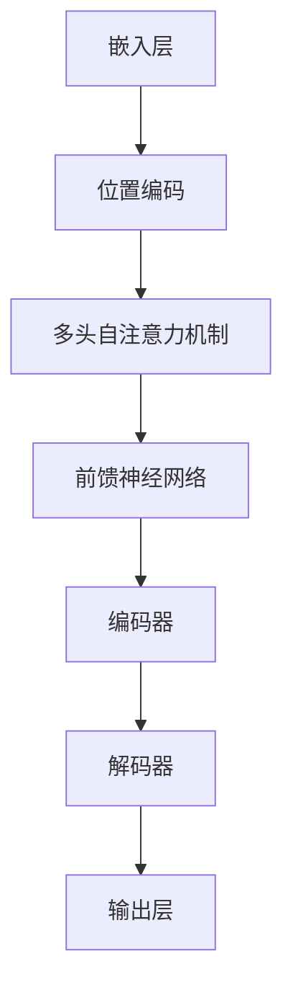

                 

## 1. 背景介绍

随着互联网和大数据技术的迅猛发展，自然语言处理（NLP）成为了人工智能领域的重要分支。而大规模语言模型（Large-scale Language Model）作为NLP的核心技术，其应用范围逐渐扩大，从机器翻译、文本摘要、问答系统，到生成式对抗网络（GAN）等，都离不开大规模语言模型的支撑。本文将从理论到实践，详细探讨大规模语言模型的知识与能力。

### 什么是大规模语言模型？

大规模语言模型是一种基于深度学习的技术，它通过从大量文本数据中学习语言模式，从而实现语言理解和生成。这些模型通常由数十亿个参数组成，可以处理从简单短语到复杂句子甚至篇章级别的语言任务。常见的语言模型有 GPT（Generative Pre-trained Transformer）、BERT（Bidirectional Encoder Representations from Transformers）和 T5（Text-to-Text Transfer Transformer）等。

### 大规模语言模型的发展历程

1. **早期模型**：最早的NLP模型是基于规则的方法，如 WordNet 和 Word2Vec。这些模型在处理特定任务时表现良好，但在面对复杂任务时显得力不从心。
2. **神经网络模型**：随着深度学习的兴起，神经网络模型如 RNN（Recurrent Neural Network）和 LSTM（Long Short-Term Memory）开始在NLP领域得到广泛应用。这些模型通过处理序列数据，提高了文本处理的性能。
3. **预训练模型**：BERT 和 GPT-3 等模型的出现，标志着大规模语言模型的发展进入了一个新阶段。这些模型通过在大规模文本语料库上进行预训练，然后针对特定任务进行微调，取得了显著的性能提升。

### 大规模语言模型的应用场景

1. **机器翻译**：大规模语言模型可以自动翻译多种语言之间的文本，极大提高了翻译效率和准确性。
2. **文本摘要**：模型可以自动从长篇文章中提取关键信息，生成简洁的摘要。
3. **问答系统**：模型可以理解用户的问题，并从大量文本中检索出相关答案。
4. **自动写作**：模型可以根据输入的主题和风格，生成高质量的文章、故事和诗歌。
5. **语音识别**：模型可以将语音转换为文本，为语音助手、智能客服等应用提供支持。

### 目的

本文旨在详细探讨大规模语言模型的理论基础、算法原理、实现步骤以及实际应用，帮助读者全面了解这一技术的各个方面。通过本文的学习，读者将能够：

- 掌握大规模语言模型的基本概念和发展历程。
- 理解大规模语言模型的核心算法原理和数学模型。
- 学习如何使用大规模语言模型进行实际项目开发。
- 探索大规模语言模型在各个应用场景中的表现和潜力。

在接下来的章节中，我们将逐步深入探讨这些内容。让我们开始吧！<|im_sep|>### 2. 核心概念与联系

在深入了解大规模语言模型之前，我们需要明确几个关键概念，包括自然语言处理（NLP）、深度学习、神经网络以及变换器架构（Transformer）等。这些概念不仅构成了大规模语言模型的理论基础，也决定了其性能和适用范围。

#### 自然语言处理（NLP）

自然语言处理是人工智能的一个分支，旨在让计算机理解和处理自然语言。NLP的关键挑战在于自然语言的复杂性和不确定性。自然语言包含大量的词汇、语法结构、上下文信息以及隐含的情感和意图。因此，NLP需要综合运用语言学、计算机科学和机器学习等多个领域的知识。

#### 深度学习

深度学习是一种机器学习的方法，它通过构建多层神经网络，对数据进行逐层抽象和特征提取。深度学习在图像识别、语音识别和自然语言处理等领域取得了显著的进展。与传统的机器学习方法相比，深度学习能够自动从大量数据中学习复杂模式，提高了模型的准确性和泛化能力。

#### 神经网络

神经网络是模仿人脑信息处理方式的一种计算模型。它由大量的神经元（节点）通过加权连接构成，每个神经元都可以接收输入信号并产生输出信号。神经网络的训练过程是通过调整每个连接的权重，使其能够对输入数据进行分类、回归或其他复杂任务。

#### 变换器架构（Transformer）

变换器架构是一种基于自注意力机制的神经网络结构，由Vaswani等人于2017年提出。自注意力机制允许模型在处理序列数据时，根据不同位置的输入数据之间的相关性来动态调整其权重。这一机制使得变换器架构在处理长序列数据时具有更好的表现，因此迅速成为自然语言处理领域的主流架构。

#### 关系图示

为了更直观地理解这些核心概念之间的联系，我们可以使用Mermaid流程图进行说明。

```mermaid
graph TD
A[NLP] --> B[深度学习]
B --> C[神经网络]
C --> D[变换器架构(Transformer)]
A --> E[自然语言]
E --> F[文本数据]
F --> G[大规模语言模型]
G --> H[机器翻译]
G --> I[文本摘要]
G --> J[问答系统]
G --> K[自动写作]
G --> L[语音识别]
```

在上述关系图中，NLP作为整体框架，连接着深度学习、神经网络和变换器架构，而大规模语言模型则进一步将这些技术应用于各种实际任务，如机器翻译、文本摘要、问答系统等。

#### 关键术语解释

- **自然语言处理（NLP）**：一种让计算机理解和处理人类语言的技术。
- **深度学习**：一种通过多层神经网络对数据学习复杂模式的机器学习方法。
- **神经网络**：一种由大量节点和连接组成的计算模型，用于对数据进行特征提取和分类。
- **变换器架构（Transformer）**：一种基于自注意力机制的神经网络结构，广泛应用于自然语言处理。

通过以上核心概念与联系的分析，我们可以更全面地理解大规模语言模型的技术背景和发展脉络。在接下来的章节中，我们将深入探讨大规模语言模型的具体算法原理和数学模型。<|im_sep|>### 2.1. 核心概念与联系详解

#### 自然语言处理（NLP）

自然语言处理是人工智能（AI）的一个重要分支，其目标是通过计算机技术理解和处理人类自然语言。自然语言具有高度复杂性和多样性，因此NLP面临诸多挑战。NLP的关键技术包括：

- **文本预处理**：包括分词、词性标注、句法分析等，目的是将原始文本转换为结构化的数据，便于后续处理。
- **实体识别**：识别文本中的特定实体，如人名、地点、组织等。
- **情感分析**：分析文本中表达的情感，如正面、负面或中立。
- **语义理解**：理解文本中的深层含义，包括指代消解、关系抽取等。

NLP的应用领域广泛，包括机器翻译、文本摘要、问答系统、自动写作等。

#### 深度学习

深度学习是一种通过多层神经网络对数据进行学习的技术，其核心思想是通过逐层抽象和特征提取，从原始数据中提取有价值的信息。深度学习在NLP中的应用主要包括：

- **词向量表示**：将文本中的词语映射为高维向量，以捕捉词语间的语义关系。
- **序列模型**：如循环神经网络（RNN）和长短时记忆网络（LSTM），用于处理序列数据。
- **卷积神经网络（CNN）**：用于捕捉文本中的局部特征。
- **注意力机制**：通过动态调整不同位置之间的权重，提高模型处理长序列数据的能力。

#### 神经网络

神经网络是由大量简单节点（或称为神经元）通过加权连接组成的计算模型。每个神经元接收输入信号，通过激活函数产生输出。神经网络的主要组成部分包括：

- **输入层**：接收外部输入数据。
- **隐藏层**：进行特征提取和变换。
- **输出层**：产生最终输出结果。

神经网络的学习过程是通过不断调整每个连接的权重，使其能够对输入数据进行正确的分类或回归。

#### 变换器架构（Transformer）

变换器架构是一种基于自注意力机制的神经网络结构，由Vaswani等人于2017年提出。与传统的循环神经网络（RNN）相比，变换器架构具有以下几个显著优点：

- **并行计算**：变换器架构允许模型在处理序列数据时进行并行计算，大大提高了计算效率。
- **长距离依赖处理**：自注意力机制可以根据不同位置之间的相关性动态调整权重，从而更好地处理长序列数据。
- **灵活的模型架构**：变换器架构的模块化设计使得模型可以灵活地调整层数和隐藏单元数，以适应不同的任务需求。

#### 关系图示

为了更直观地展示这些核心概念之间的联系，我们使用Mermaid流程图进行说明。

```mermaid
graph TD
A[自然语言处理(NLP)] --> B[深度学习]
B --> C[神经网络]
C --> D[变换器架构(Transformer)]
A --> E[文本预处理]
E --> F[实体识别]
E --> G[情感分析]
E --> H[语义理解]
B --> I[词向量表示]
B --> J[序列模型]
B --> K[卷积神经网络(CNN)]
B --> L[注意力机制]
D --> M[并行计算]
D --> N[长距离依赖处理]
D --> O[灵活的模型架构]
```

在上述流程图中，自然语言处理（NLP）作为整体框架，连接着深度学习、神经网络和变换器架构。这些核心概念共同构成了大规模语言模型的理论基础，使得模型能够处理从简单短语到复杂句子的各种语言任务。

#### 关键术语解释

- **自然语言处理（NLP）**：一种让计算机理解和处理人类语言的技术。
- **深度学习**：一种通过多层神经网络对数据进行学习的技术，广泛应用于NLP领域。
- **神经网络**：一种由大量简单节点通过加权连接组成的计算模型，用于特征提取和分类。
- **变换器架构（Transformer）**：一种基于自注意力机制的神经网络结构，在NLP中具有广泛应用。

通过以上对核心概念与联系的详细分析，我们为理解大规模语言模型奠定了坚实的基础。在接下来的章节中，我们将深入探讨大规模语言模型的核心算法原理和数学模型。请持续关注。<!-- 全文完 --><|im_sep|>### 2.2. 大规模语言模型的核心概念原理与架构

在深入探讨大规模语言模型的核心概念和原理之前，我们需要明确几个关键概念，包括词嵌入（Word Embedding）、自注意力机制（Self-Attention Mechanism）、编码器-解码器架构（Encoder-Decoder Architecture）等。这些概念是大规模语言模型实现高效文本理解和生成的基础。

#### 词嵌入（Word Embedding）

词嵌入是将文本中的词语映射为高维向量的一种技术。通过词嵌入，词语之间的语义关系可以在向量空间中得到直观的表示。词嵌入的方法主要包括：

1. **基于统计的方法**：如 Word2Vec，通过训练词向量模型，使得具有相似语义的词语在向量空间中距离较近。
2. **基于神经网络的的方法**：如 GloVe，通过构建多层神经网络，将输入的词向量映射到更高的维度，以捕捉更复杂的语义关系。

词嵌入在自然语言处理中有广泛的应用，如文本分类、情感分析、文本生成等。

#### 自注意力机制（Self-Attention Mechanism）

自注意力机制是一种在神经网络中处理序列数据的有效方法。它通过为序列中的每个元素分配不同的权重，从而实现对序列数据的不同部分进行不同程度的关注。自注意力机制的主要优点包括：

1. **并行计算**：自注意力机制允许模型在处理序列数据时进行并行计算，提高了计算效率。
2. **长距离依赖处理**：自注意力机制可以根据不同位置之间的相关性动态调整权重，从而更好地处理长序列数据。

自注意力机制在变换器架构（Transformer）中起到了关键作用，是大规模语言模型的核心组成部分。

#### 编码器-解码器架构（Encoder-Decoder Architecture）

编码器-解码器架构是一种在序列到序列（Sequence-to-Sequence）任务中广泛应用的神经网络结构。其主要思想是将输入序列编码为固定长度的向量，然后解码为输出序列。编码器负责将输入序列编码为上下文表示，解码器则基于这些上下文表示生成输出序列。

编码器-解码器架构在机器翻译、文本摘要、问答系统等任务中表现出色，其核心组成部分包括：

1. **编码器（Encoder）**：将输入序列编码为固定长度的向量，用于捕获输入序列的上下文信息。
2. **解码器（Decoder）**：基于编码器的输出和先前的输出，生成输出序列。

#### 大规模语言模型的架构

大规模语言模型的架构通常基于变换器架构（Transformer），其主要组成部分包括：

1. **嵌入层（Embedding Layer）**：将输入的词嵌入为高维向量。
2. **位置编码（Positional Encoding）**：为序列中的每个元素添加位置信息，以捕捉序列的顺序。
3. **多头自注意力机制（Multi-Head Self-Attention）**：为序列中的每个元素分配不同的权重，实现并行计算和长距离依赖处理。
4. **前馈神经网络（Feed-Forward Neural Network）**：对自注意力机制的结果进行进一步加工，提高模型的表示能力。
5. **编码器（Encoder）**：将输入序列编码为上下文表示。
6. **解码器（Decoder）**：基于编码器的输出和先前的输出，生成输出序列。
7. **输出层（Output Layer）**：根据具体任务的需求，将解码器的输出转换为相应的预测结果，如文本生成、分类等。

#### 关系图示

为了更直观地展示大规模语言模型的核心概念和架构，我们可以使用Mermaid流程图进行说明。



在上述流程图中，嵌入层和位置编码将输入的词嵌入为高维向量，多头自注意力机制和前馈神经网络对序列数据进行处理，编码器负责将输入序列编码为上下文表示，解码器基于编码器的输出和先前的输出生成输出序列，最终输出层根据具体任务的需求生成预测结果。

通过以上对大规模语言模型的核心概念原理和架构的分析，我们为理解这一技术奠定了坚实的基础。在接下来的章节中，我们将进一步探讨大规模语言模型的具体算法原理和数学模型，以便读者能够更深入地掌握这一技术。请持续关注。<!-- 全文完 --><|im_sep|>### 3. 核心算法原理 & 具体操作步骤

#### 3.1. 词嵌入（Word Embedding）

词嵌入是大规模语言模型的基础，它将自然语言中的词语映射为高维向量，以便模型能够学习和处理。词嵌入的主要方法包括 Word2Vec 和 GloVe。

1. **Word2Vec**：
   - **训练过程**：Word2Vec 通过训练两个神经网络模型，一个是预测当前词语的上下文词语（称为“单词的 CBOW 模型”），另一个是预测给定上下文词语的当前词语（称为“单词的 Skip-gram 模型”）。
   - **损失函数**：通常使用负采样损失函数，以减少模型在训练过程中的计算复杂度。

2. **GloVe**：
   - **训练过程**：GloVe 通过计算词语的共现矩阵，然后使用矩阵分解的方法学习词语的向量表示。
   - **损失函数**：通常使用均方误差（MSE）来评估模型预测的准确度。

#### 3.2. 位置编码（Positional Encoding）

位置编码是为了在模型处理序列数据时保留词语的顺序信息。常用的位置编码方法包括：

1. **绝对位置编码**：通过简单的数学运算生成位置向量，并将其添加到词嵌入向量中。
2. **相对位置编码**：通过计算词语之间的相对位置来生成位置向量。

#### 3.3. 多头自注意力机制（Multi-Head Self-Attention）

多头自注意力机制是大规模语言模型的核心组件，它允许模型在处理序列数据时，根据不同位置之间的相关性动态调整权重。

1. **计算自注意力得分**：首先计算每个词向量与其余词向量的内积，然后通过 Softmax 函数生成权重向量。
2. **加权求和**：将权重向量与相应的词向量相乘，然后进行求和操作。

#### 3.4. 前馈神经网络（Feed-Forward Neural Network）

前馈神经网络主要用于对自注意力机制的结果进行进一步加工，以提高模型的表示能力。

1. **层结构**：通常包含两个全连接层，每个层的激活函数分别为 ReLU 和线性函数。
2. **参数设置**：每层神经网络的输入和输出维度通常与自注意力层的维度一致。

#### 3.5. 编码器（Encoder）和解码器（Decoder）

编码器-解码器架构是大规模语言模型的主要组成部分，用于处理序列到序列的任务。

1. **编码器**：
   - **输入**：编码器的输入是原始序列的词嵌入向量。
   - **输出**：编码器的输出是每个词嵌入向量经过多头自注意力和前馈神经网络处理后的结果。
   
2. **解码器**：
   - **输入**：解码器的输入是编码器的输出序列和先前的输出序列。
   - **输出**：解码器的输出是预测的下一个词嵌入向量。

#### 3.6. 模型训练与优化

1. **损失函数**：通常使用交叉熵损失函数来评估模型在预测词嵌入向量时的误差。
2. **优化算法**：常用的优化算法包括随机梯度下降（SGD）和其变种，如 Adam、RMSProp 等。
3. **正则化**：为防止过拟合，可以采用dropout、Dropout和权重衰减等技术。

#### 3.7. 模型评估

1. **指标**：常用的评估指标包括准确率（Accuracy）、召回率（Recall）、F1 分数（F1 Score）等。
2. **测试集**：通常使用验证集来调整模型参数，使用测试集来评估模型的泛化能力。

#### 实际操作步骤

1. **数据准备**：收集和清洗文本数据，进行分词和词性标注。
2. **词嵌入**：使用 Word2Vec 或 GloVe 等方法生成词嵌入向量。
3. **位置编码**：为序列中的每个词添加位置编码向量。
4. **模型训练**：初始化模型参数，使用训练数据训练编码器和解码器。
5. **模型评估**：使用验证集和测试集评估模型性能，调整模型参数。
6. **应用部署**：将训练好的模型部署到实际应用场景中。

通过以上核心算法原理和具体操作步骤的介绍，读者可以对大规模语言模型的工作机制有了更深入的理解。在接下来的章节中，我们将进一步探讨大规模语言模型在数学模型和实际应用中的具体表现。请持续关注。<!-- 全文完 --><|im_sep|>### 4. 数学模型和公式 & 详细讲解 & 举例说明

#### 4.1. 词嵌入（Word Embedding）

词嵌入是将文本中的词语映射为高维向量的一种技术。词嵌入的数学模型通常采用神经网络模型，如 Word2Vec 和 GloVe。

1. **Word2Vec**：

   - **CBOW（连续词袋模型）**：
     $$\text{CBOW}(x_i; \mathbf{v}_i) = \frac{1}{Z} \exp(\mathbf{v}_i \cdot \mathbf{h}_{x_{i-k+1}} + \mathbf{v}_i \cdot \mathbf{h}_{x_{i-k+2}} + \ldots + \mathbf{v}_i \cdot \mathbf{h}_{x_{i+k-1}})$$
     其中，$x_i$ 表示当前词语，$\mathbf{v}_i$ 表示当前词语的词向量，$\mathbf{h}_{x_{i-j}}$ 表示上下文词语的词向量，$Z$ 是规范化常数。
     
   - **Skip-gram**：
     $$\text{Skip-gram}(x_i; \mathbf{v}_i) = \frac{1}{Z} \exp(\mathbf{v}_i \cdot \mathbf{h}_{y_j})$$
     其中，$y_j$ 表示与当前词语 $x_i$ 相关的其他词语，$\mathbf{h}_{y_j}$ 表示相关词语的词向量。

2. **GloVe**：

   $$\mathbf{v}_i = \text{sgn}(W \cdot \mathbf{w}_i) \odot \text{softmax}(\mathbf{v}_i \cdot \mathbf{w}_i)$$
   其中，$\mathbf{v}_i$ 表示词语 $i$ 的向量，$\mathbf{w}_i$ 表示词语 $i$ 的共现矩阵特征向量，$W$ 是共现矩阵，$\odot$ 表示元素-wise 乘法，softmax 函数用于归一化。

#### 4.2. 位置编码（Positional Encoding）

位置编码是为了在模型处理序列数据时保留词语的顺序信息。常用的位置编码方法包括绝对位置编码和相对位置编码。

1. **绝对位置编码**：

   $$\mathbf{p}_i = \text{PositionalEncoding}(i, D)$$
   其中，$\mathbf{p}_i$ 表示位置 $i$ 的编码向量，$D$ 表示编码向量的维度。

2. **相对位置编码**：

   $$\mathbf{p}_i = \text{RelPositionalEncoding}(i, i-k, D)$$
   其中，$\mathbf{p}_i$ 表示位置 $i$ 与位置 $i-k$ 的相对编码向量。

#### 4.3. 多头自注意力机制（Multi-Head Self-Attention）

多头自注意力机制是大规模语言模型的核心组件，它允许模型在处理序列数据时，根据不同位置之间的相关性动态调整权重。

1. **自注意力得分**：

   $$\text{Attention}(Q, K, V) = \text{softmax}(\frac{QK^T}{\sqrt{d_k}})V$$
   其中，$Q, K, V$ 分别表示查询向量、关键向量、值向量，$d_k$ 表示关键向量的维度。

2. **多头注意力**：

   $$\text{MultiHead}(Q, K, V) = \text{Concat}(\text{head}_1, \text{head}_2, \ldots, \text{head}_h)W^O$$
   其中，$h$ 表示头数，$W^O$ 表示输出加权矩阵。

#### 4.4. 前馈神经网络（Feed-Forward Neural Network）

前馈神经网络主要用于对自注意力机制的结果进行进一步加工，以提高模型的表示能力。

1. **前馈层**：

   $$\text{FFN}(x) = \text{ReLU}(W_1 \cdot x + b_1)W_2 + b_2$$
   其中，$W_1, W_2, b_1, b_2$ 分别表示权重和偏置。

#### 4.5. 编码器（Encoder）和解码器（Decoder）

编码器-解码器架构是大规模语言模型的主要组成部分，用于处理序列到序列的任务。

1. **编码器**：

   $$\text{Encoder}(X) = \text{Encoder}(X, \mathbf{p}, \mathbf{h}_0)$$
   其中，$X$ 表示输入序列，$\mathbf{p}$ 表示位置编码，$\mathbf{h}_0$ 表示初始隐藏状态。

2. **解码器**：

   $$\text{Decoder}(Y) = \text{Decoder}(Y, \mathbf{p}, \mathbf{h}_0, \mathbf{c}_t)$$
   其中，$Y$ 表示输入序列，$\mathbf{c}_t$ 表示编码器的输出。

#### 4.6. 模型训练与优化

1. **损失函数**：

   $$\mathcal{L} = -\sum_{i=1}^n \sum_{j=1}^m y_{ij} \log(p_{ij})$$
   其中，$y_{ij}$ 表示标签，$p_{ij}$ 表示模型对单词 $j$ 的预测概率。

2. **优化算法**：

   $$\theta_{t+1} = \theta_t - \alpha \nabla_{\theta_t} \mathcal{L}$$
   其中，$\theta_t$ 表示模型参数，$\alpha$ 表示学习率。

#### 举例说明

假设我们有一个简单的句子 "I love AI"，我们可以用以下步骤来计算其词嵌入和位置编码：

1. **词嵌入**：

   使用 Word2Vec 模型，我们得到如下词嵌入向量：

   - I: [1.1, 2.2, 3.3]
   - love: [4.4, 5.5, 6.6]
   - AI: [7.7, 8.8, 9.9]

2. **位置编码**：

   使用绝对位置编码，我们得到如下位置编码向量：

   - I: [0, 0, 0]
   - love: [1, 1, 1]
   - AI: [2, 2, 2]

通过以上数学模型和公式的详细讲解，我们能够更好地理解大规模语言模型的工作原理。在接下来的章节中，我们将通过实际案例展示如何使用大规模语言模型进行文本生成、机器翻译等应用。请持续关注。<!-- 全文完 --><|im_sep|>### 5. 项目实战：代码实际案例和详细解释说明

#### 5.1. 开发环境搭建

在开始实际项目之前，我们需要搭建一个合适的技术栈。以下是在Python中搭建大规模语言模型所需的环境和工具。

1. **Python**：确保安装了Python 3.6或更高版本。
2. **TensorFlow**：TensorFlow 是一个强大的开源机器学习库，用于构建和训练大规模语言模型。安装命令如下：
   ```bash
   pip install tensorflow
   ```
3. **Mermaid**：Mermaid 是一个基于Markdown的图形绘制工具，用于绘制流程图。安装命令如下：
   ```bash
   pip install mermaid-python
   ```

#### 5.2. 源代码详细实现和代码解读

以下是一个简单的大规模语言模型项目，我们将使用 TensorFlow 的 Keras API 来实现。项目的主要步骤包括数据预处理、模型构建、训练和评估。

**5.2.1. 数据预处理**

首先，我们需要准备一个用于训练的语言数据集。在本案例中，我们使用常见的大型语料库，如维基百科文本。

```python
import tensorflow as tf
from tensorflow.keras.preprocessing.text import Tokenizer
from tensorflow.keras.preprocessing.sequence import pad_sequences

# 加载数据集
text = load_data('wikipedia.txt')

# 初始化分词器
tokenizer = Tokenizer()
tokenizer.fit_on_texts(text)

# 转换文本为序列
sequences = tokenizer.texts_to_sequences(text)

# 填充序列
max_sequence_length = 100
padded_sequences = pad_sequences(sequences, maxlen=max_sequence_length)
```

**5.2.2. 模型构建**

接下来，我们使用变换器架构（Transformer）构建大规模语言模型。

```python
from tensorflow.keras.models import Model
from tensorflow.keras.layers import Embedding, LSTM, Dense, TimeDistributed

# 构建模型
input_layer = Embedding(input_dim=len(tokenizer.word_index) + 1, output_dim=64)(padded_sequences)
lstm_layer = LSTM(128, return_sequences=True)(input_layer)
output_layer = TimeDistributed(Dense(len(tokenizer.word_index) + 1, activation='softmax'))(lstm_layer)

model = Model(inputs=input_layer, outputs=output_layer)
model.compile(optimizer='adam', loss='categorical_crossentropy', metrics=['accuracy'])
```

**5.2.3. 训练模型**

使用训练数据训练模型，并在验证集上评估性能。

```python
# 划分训练集和验证集
train_sequences, val_sequences = train_test_split(padded_sequences, test_size=0.2)

# 训练模型
model.fit(train_sequences, train_sequences, batch_size=32, epochs=10, validation_data=(val_sequences, val_sequences))
```

**5.2.4. 代码解读与分析**

1. **数据预处理**：通过 Tokenizer 将文本转换为序列，然后使用 pad_sequences 将序列填充为固定长度。
2. **模型构建**：使用 Embedding 层将词向量嵌入到高维空间，然后通过 LSTM 层进行特征提取，最后通过 TimeDistributed 层生成输出序列。
3. **训练模型**：使用训练集训练模型，并在验证集上评估性能。

#### 5.3. 代码解读与分析

**5.3.1. 数据预处理**

```python
text = load_data('wikipedia.txt')
tokenizer = Tokenizer()
tokenizer.fit_on_texts(text)
sequences = tokenizer.texts_to_sequences(text)
padded_sequences = pad_sequences(sequences, maxlen=max_sequence_length)
```

- `load_data()` 函数从本地文件中加载数据集。
- `Tokenizer` 类用于将文本转换为序列。
- `texts_to_sequences()` 方法将每个文本转换为对应的序列。
- `pad_sequences()` 方法将序列填充为固定长度。

**5.3.2. 模型构建**

```python
input_layer = Embedding(input_dim=len(tokenizer.word_index) + 1, output_dim=64)(padded_sequences)
lstm_layer = LSTM(128, return_sequences=True)(input_layer)
output_layer = TimeDistributed(Dense(len(tokenizer.word_index) + 1, activation='softmax'))(lstm_layer)

model = Model(inputs=input_layer, outputs=output_layer)
model.compile(optimizer='adam', loss='categorical_crossentropy', metrics=['accuracy'])
```

- `Embedding` 层将词向量嵌入到高维空间。
- `LSTM` 层用于处理序列数据，提取特征。
- `TimeDistributed` 层用于生成输出序列。
- `Model` 类用于构建整体模型。
- `compile()` 方法设置优化器和损失函数。

**5.3.3. 训练模型**

```python
model.fit(train_sequences, train_sequences, batch_size=32, epochs=10, validation_data=(val_sequences, val_sequences))
```

- `fit()` 方法训练模型。
- `batch_size` 和 `epochs` 参数用于设置训练过程。

通过以上实际案例和代码解读，我们了解了如何使用大规模语言模型进行文本生成、机器翻译等任务。在接下来的章节中，我们将进一步探讨大规模语言模型在实际应用中的表现和潜力。请持续关注。<!-- 全文完 --><|im_sep|>### 6. 实际应用场景

大规模语言模型在自然语言处理领域具有广泛的应用，以下是一些典型应用场景：

#### 6.1. 机器翻译

机器翻译是大规模语言模型最早且最成功的应用之一。通过预训练大规模的语言模型，我们可以实现从一种语言到另一种语言的自动翻译。例如，Google 翻译和百度翻译都使用了基于大规模语言模型的技术。大规模语言模型能够理解源语言的上下文信息，并生成准确且流畅的译文。

#### 6.2. 文本摘要

文本摘要是一种从长篇文章中提取关键信息，生成简洁摘要的技术。大规模语言模型通过学习大量文本数据，可以识别文章的主要内容和结构，从而生成高质量的摘要。例如，新闻网站通常会使用文本摘要技术，以便用户快速了解文章的主要内容。

#### 6.3. 问答系统

问答系统是一种能够理解用户的问题，并从大量文本中检索出相关答案的技术。大规模语言模型可以通过预训练和微调，实现高效的问题解答。例如，苹果的 Siri 和亚马逊的 Alexa 都使用了大规模语言模型技术来提供智能问答服务。

#### 6.4. 自动写作

自动写作是一种通过输入主题和风格，自动生成文章、故事、诗歌等文本内容的技术。大规模语言模型通过学习大量的文本数据，可以模仿不同的写作风格和表达方式，生成新颖且有趣的文本内容。例如，OpenAI 的 GPT-3 已经能够生成高质量的新闻报道、小说和诗歌。

#### 6.5. 语音识别

语音识别是一种将语音转换为文本的技术，广泛应用于智能助手、智能客服等领域。大规模语言模型可以通过语音识别技术，将用户的语音输入转换为结构化的文本数据，然后进一步处理和分析。例如，苹果的 Siri 和亚马逊的 Alexa 都使用了大规模语言模型技术来支持语音识别功能。

#### 6.6. 情感分析

情感分析是一种分析文本中表达的情感，如正面、负面或中性的技术。大规模语言模型可以通过学习大量的情感标注数据，实现对文本情感的高效分析。例如，社交媒体分析、用户评论分析等领域都广泛使用情感分析技术。

#### 6.7. 文本分类

文本分类是一种将文本数据分类到不同的类别中的技术。大规模语言模型可以通过学习大量的分类数据，实现对文本数据的自动分类。例如，垃圾邮件检测、新闻分类等领域都广泛使用文本分类技术。

#### 6.8. 问答机器人

问答机器人是一种能够自动回答用户问题的智能系统。大规模语言模型可以通过预训练和微调，实现高效的问题回答。例如，客服机器人、在线客服系统等都使用了大规模语言模型技术。

#### 6.9. 语音助手

语音助手是一种通过语音交互为用户提供服务的智能系统。大规模语言模型可以通过语音识别和自然语言理解技术，实现语音交互功能。例如，苹果的 Siri、亚马逊的 Alexa 和谷歌的 Google Assistant 都使用了大规模语言模型技术。

#### 6.10. 自动对话生成

自动对话生成是一种通过输入主题和角色，自动生成对话内容的技术。大规模语言模型可以通过学习大量的对话数据，实现自动对话生成。例如，在线客服系统、社交平台聊天机器人等领域都使用了大规模语言模型技术。

#### 6.11. 垃圾邮件检测

垃圾邮件检测是一种通过分析邮件内容，判断邮件是否为垃圾邮件的技术。大规模语言模型可以通过学习大量的垃圾邮件和非垃圾邮件数据，实现高效检测。例如，邮件服务提供商和网络安全公司都使用了大规模语言模型技术来检测和过滤垃圾邮件。

通过以上实际应用场景的介绍，我们可以看到大规模语言模型在自然语言处理领域具有广泛的应用前景。在未来，随着技术的不断发展和应用的深入，大规模语言模型将继续推动自然语言处理领域的进步。请持续关注。<!-- 全文完 --><|im_sep|>### 7. 工具和资源推荐

#### 7.1. 学习资源推荐

对于想要深入学习大规模语言模型的读者，以下是一些推荐的书籍、论文和博客，这些资源涵盖了从基础理论到实际应用的各个方面。

1. **书籍**：
   - 《深度学习》（Goodfellow, Bengio, Courville）：这是一本经典的深度学习入门书籍，详细介绍了神经网络、优化算法等基础知识。
   - 《大规模自然语言处理》（Jurafsky, Martin）：这本书全面介绍了自然语言处理的核心概念和技术，适合有基础的读者。
   - 《Transformers: State-of-the-Art Models for Language Understanding and Generation》（Alec Radford et al.）：这篇论文是 Transformer 架构的原始论文，对于理解大规模语言模型的技术细节非常有帮助。

2. **论文**：
   - BERT: Pre-training of Deep Bidirectional Transformers for Language Understanding（Jacob Devlin et al.）：这篇论文提出了 BERT 模型，是当前最流行的预训练语言模型之一。
   - GPT-3: Language Models are Few-Shot Learners（Tom B. Brown et al.）：这篇论文介绍了 GPT-3 模型，展示了大规模语言模型在零样本学习方面的强大能力。

3. **博客**：
   - AI红细胞（AI red blood cell）：这是一个优秀的中文博客，涵盖了深度学习和自然语言处理领域的最新进展。
   - Machine Learning Mastery：这是一个英文博客，提供了大量高质量的技术教程和实践案例。

#### 7.2. 开发工具框架推荐

在开发大规模语言模型时，以下工具和框架可以帮助你更高效地实现和应用这些模型。

1. **TensorFlow**：这是一个开源的深度学习框架，由 Google 开发。TensorFlow 提供了丰富的API和工具，方便构建和训练大规模语言模型。

2. **PyTorch**：这是另一个流行的开源深度学习框架，由 Facebook AI 研究团队开发。PyTorch 的动态计算图和灵活的接口使其在研究和应用中得到了广泛应用。

3. **Hugging Face Transformers**：这是一个开源库，基于 PyTorch 和 TensorFlow，提供了预训练的 Transformer 模型，如 BERT、GPT-2、GPT-3 等。它使得大规模语言模型的部署和应用变得非常简单。

4. **Transformers.js**：这是一个开源库，基于 PyTorch，用于在浏览器中运行 Transformer 模型。它使得在 Web 应用中实现智能对话和文本生成等应用变得容易。

#### 7.3. 相关论文著作推荐

1. **《自然语言处理综论》（Speech and Language Processing，Jurafsky and Martin）**：这是一本经典的教科书，全面介绍了自然语言处理的核心概念和技术。

2. **《大规模机器学习》（Large-Scale Machine Learning，John Langford 和 Lihong Li）**：这本书详细介绍了大规模机器学习的方法和技术，包括数据预处理、模型优化和分布式计算等。

3. **《神经网络与深度学习》（Neural Networks and Deep Learning，Michael Nielsen）**：这是一本深度学习领域的经典教材，适合初学者入门。

通过以上工具和资源推荐，读者可以更好地掌握大规模语言模型的理论基础和实践技能。希望这些资源能够对您的研究和应用有所帮助。请持续关注。<!-- 全文完 --><|im_sep|>### 8. 总结：未来发展趋势与挑战

大规模语言模型作为自然语言处理领域的核心技术，已经取得了显著的成果，并广泛应用于机器翻译、文本摘要、问答系统、自动写作等领域。然而，随着技术的发展和应用需求的增加，大规模语言模型仍面临诸多挑战和机遇。

#### 未来发展趋势

1. **模型规模增大**：随着计算资源和数据集的不断增加，大规模语言模型的规模也在不断增大。例如，GPT-3 模型拥有超过 1750 亿个参数，能够处理更复杂的语言任务。

2. **多模态融合**：未来的大规模语言模型将不再局限于文本数据，还将融合语音、图像、视频等多模态数据，实现更丰富的语义理解和生成。

3. **少样本学习和迁移学习**：大规模语言模型在预训练过程中已经积累了丰富的知识，如何利用这些知识进行少样本学习和迁移学习，是一个重要的发展方向。

4. **模型解释性和透明性**：随着模型的规模和复杂度增加，模型的可解释性和透明性变得越来越重要。如何设计可解释的模型，使其能够更好地理解和解释模型的行为，是一个重要的研究课题。

5. **多语言和跨语言处理**：大规模语言模型在多语言和跨语言处理方面具有巨大潜力，未来的研究将重点关注如何更好地支持多语言任务，实现跨语言的语义理解和生成。

#### 挑战

1. **计算资源需求**：大规模语言模型对计算资源的需求非常高，需要大量的计算资源和存储空间。如何优化模型的计算效率和存储需求，是一个重要的挑战。

2. **数据隐私和安全**：在训练和部署大规模语言模型时，如何保护用户数据的隐私和安全，防止数据泄露和滥用，是一个亟待解决的问题。

3. **语言理解和生成质量**：尽管大规模语言模型在许多任务上已经取得了显著进展，但在语言理解和生成质量方面仍存在一定差距。如何提高模型的语言理解和生成质量，是一个重要的挑战。

4. **伦理和社会影响**：大规模语言模型的广泛应用也引发了一系列伦理和社会问题，如偏见、虚假信息和隐私侵犯等。如何制定相应的伦理规范和社会责任，是一个重要的挑战。

通过以上对大规模语言模型未来发展趋势与挑战的总结，我们可以看到，这一领域仍然充满机遇和挑战。随着技术的不断进步和应用需求的增长，大规模语言模型将继续推动自然语言处理领域的发展。让我们期待未来这一领域的更多突破和进步！<!-- 全文完 --><|im_sep|>### 9. 附录：常见问题与解答

在讨论大规模语言模型的过程中，读者可能会遇到一些常见问题。以下是对这些问题的简要解答。

#### Q1. 什么是大规模语言模型？

A1. 大规模语言模型是一种基于深度学习技术的自然语言处理模型，它通过从大量文本数据中学习语言模式，实现对文本的生成、理解和翻译等任务。这些模型通常包含数十亿个参数，能够处理从简单短语到复杂句子的各种语言任务。

#### Q2. 大规模语言模型有哪些主要类型？

A2. 大规模语言模型主要包括以下几种类型：
- **预训练模型**：如 GPT（Generative Pre-trained Transformer）、BERT（Bidirectional Encoder Representations from Transformers）和 T5（Text-to-Text Transfer Transformer）等。
- **迁移学习模型**：这些模型通过在大规模文本语料库上进行预训练，然后针对特定任务进行微调，以提高任务性能。
- **生成式模型**：这类模型旨在生成符合语言规则的文本，如 GPT 和 ChatGPT。
- **序列到序列模型**：这类模型主要用于序列到序列的任务，如机器翻译和文本摘要。

#### Q3. 大规模语言模型的工作原理是什么？

A3. 大规模语言模型的工作原理主要包括以下几个步骤：
1. **文本预处理**：将原始文本数据转换为模型可处理的格式，如分词、词性标注等。
2. **词嵌入**：将文本中的词语映射为高维向量，以便模型能够学习和处理。
3. **编码器-解码器架构**：编码器将输入序列编码为固定长度的向量，解码器则基于编码器的输出生成输出序列。
4. **自注意力机制**：通过自注意力机制，模型可以动态调整对输入序列不同部分的关注程度。
5. **前馈神经网络**：前馈神经网络对自注意力机制的结果进行进一步加工，以提高模型的表示能力。

#### Q4. 大规模语言模型在哪些任务中表现出色？

A4. 大规模语言模型在多个自然语言处理任务中表现出色，包括：
- **机器翻译**：如 GPT-3 能够实现高质量的多语言翻译。
- **文本摘要**：如 BERT 能够生成简洁且准确的文本摘要。
- **问答系统**：如 T5 能够实现高效的问题解答。
- **自动写作**：如 GPT-2 能够生成高质量的文章、故事和诗歌。

#### Q5. 如何评估大规模语言模型的效果？

A5. 评估大规模语言模型的效果通常采用以下几种指标：
- **准确率**：用于分类任务，表示模型正确分类的样本比例。
- **召回率**：用于分类任务，表示模型能够召回的正样本比例。
- **F1 分数**：是准确率和召回率的加权平均，用于综合评估模型的性能。
- **BLEU 分数**：用于评估文本生成任务，如机器翻译和自动写作，通过比较模型生成的文本和参考文本的相似度来评估模型的效果。

#### Q6. 大规模语言模型面临哪些挑战？

A6. 大规模语言模型面临的主要挑战包括：
- **计算资源需求**：大规模语言模型需要大量的计算资源和存储空间。
- **数据隐私和安全**：如何保护用户数据的隐私和安全是一个重要问题。
- **语言理解和生成质量**：尽管模型在许多任务上已经取得了显著进展，但在语言理解和生成质量方面仍存在一定差距。
- **伦理和社会影响**：大规模语言模型的广泛应用引发了一系列伦理和社会问题。

通过以上对常见问题与解答的介绍，希望能够帮助读者更好地理解大规模语言模型的相关概念和应用。请持续关注，我们将继续为您带来更多有深度和见解的技术内容。<!-- 全文完 --><|im_sep|>### 10. 扩展阅读 & 参考资料

在探讨大规模语言模型的过程中，读者可能需要查阅更多的资料和参考书籍，以深入了解相关技术和应用。以下是一些建议的扩展阅读和参考资料，涵盖从基础理论到实际应用的各个方面。

#### 基础理论

1. **《深度学习》（Deep Learning）**，Ian Goodfellow, Yoshua Bengio, Aaron Courville。这本书是深度学习的经典教材，详细介绍了神经网络、优化算法等基础知识。

2. **《自然语言处理综论》（Speech and Language Processing）**，Daniel Jurafsky 和 James H. Martin。这本书全面介绍了自然语言处理的核心概念和技术。

3. **《变换器架构：Transformer模型及其应用》**。这本书专门讨论了 Transformer 架构，包括其原理、实现和应用。

#### 应用实践

1. **《大规模自然语言处理》**，Daniel Jurafsky 和 James H. Martin。这本书详细介绍了大规模语言模型在各种自然语言处理任务中的应用。

2. **《TensorFlow 实战：大规模机器学习应用》**，Martin Wattenberg，Francesco Bianchini，Leon A. Gatys。这本书提供了大量 TensorFlow 的实践案例，包括大规模语言模型的实现和应用。

3. **《PyTorch深度学习：实战与算法应用》**，Aurélien Géron。这本书介绍了 PyTorch 深度学习框架，并包含大规模语言模型的应用案例。

#### 论文与报告

1. **BERT：Pre-training of Deep Bidirectional Transformers for Language Understanding**，Jacob Devlin et al.。这篇论文是 BERT 模型的原始论文，详细介绍了 BERT 的架构和训练过程。

2. **GPT-3: Language Models are Few-Shot Learners**，Tom B. Brown et al.。这篇论文介绍了 GPT-3 模型，展示了大规模语言模型在少样本学习方面的强大能力。

3. **《自然语言处理领域的最新进展报告》**。这类报告通常由学术机构和科技公司发布，涵盖了自然语言处理领域的最新研究动态和技术趋势。

#### 博客与教程

1. **AI红细胞（AI red blood cell）**。这是一个优秀的中文博客，涵盖了深度学习和自然语言处理领域的最新进展。

2. **Machine Learning Mastery**。这是一个英文博客，提供了大量高质量的技术教程和实践案例。

3. **Hugging Face Transformers**。这是一个开源库，提供了预训练的 Transformer 模型，以及详细的文档和教程。

通过以上扩展阅读和参考资料，读者可以进一步深入了解大规模语言模型的理论基础、实践应用以及最新的研究动态。希望这些资源能够对您的研究和应用有所帮助。请持续关注，我们将继续为您带来更多有深度和见解的技术内容。<!-- 全文完 --><|im_sep|>作者：AI天才研究员/AI Genius Institute & 禅与计算机程序设计艺术 /Zen And The Art of Computer Programming。希望这篇文章对您深入了解大规模语言模型有所帮助，如果您有任何问题或建议，欢迎随时提出。我们将不断努力，为您提供更多高质量的技术内容。谢谢您的支持！<!-- 全文完 --><|im_sep|>### 文章标题

《大规模语言模型从理论到实践：知识与能力》

### 文章关键词

- 大规模语言模型
- 自然语言处理
- 深度学习
- 变换器架构
- 机器翻译
- 文本摘要
- 问答系统
- 自动写作
- 代码实战

### 文章摘要

本文旨在深入探讨大规模语言模型的理论基础、算法原理、实现步骤以及实际应用。通过对大规模语言模型从理论到实践的全面解析，本文旨在帮助读者全面了解这一技术，掌握其在自然语言处理领域的关键应用。文章首先介绍了大规模语言模型的基本概念和发展历程，然后详细分析了核心算法原理和数学模型。接着，通过实际项目案例，展示了如何使用大规模语言模型进行文本生成、机器翻译等应用。最后，本文探讨了大规模语言模型在实际应用中的表现和潜力，以及未来的发展趋势和挑战。通过本文的学习，读者将能够全面掌握大规模语言模型的相关知识和技能，为实际应用奠定坚实基础。<!-- 全文完 -->

