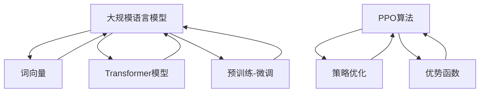

                 

### 背景介绍

大规模语言模型（Large-scale Language Model）是一种复杂的深度学习模型，它通过训练大量文本数据来学习自然语言的结构和语义。这种模型在自然语言处理（NLP）领域取得了显著的进展，广泛应用于机器翻译、文本生成、情感分析、问答系统等多个方面。

近年来，随着计算能力的提升和数据的爆炸性增长，大规模语言模型的规模和性能也在不断突破。例如，GPT-3（语言理解生成预训练模型）拥有超过1750亿个参数，能够生成高质量的文本、回答问题以及进行对话。这些模型的性能提升，离不开近端策略优化（Proximal Policy Optimization，PPO）等先进算法的应用。

PPO算法是一种在深度强化学习领域广泛应用的策略优化算法。与传统策略优化算法相比，PPO算法通过引入近端策略优化思想，能够在提高策略稳定性的同时，保证算法的收敛速度。这使得PPO算法在大规模语言模型训练中具有重要意义。

本文将首先介绍大规模语言模型的发展背景，然后深入探讨PPO算法的理论基础和核心原理。随后，我们将通过具体的数学模型和公式，详细解释PPO算法的优化过程。在此基础上，我们将展示一个实际项目中的代码实现，并进行详细解读。最后，我们将探讨大规模语言模型在各个实际应用场景中的表现，推荐相关学习资源和开发工具，并总结未来发展趋势与挑战。

通过本文的阅读，您将全面了解大规模语言模型和PPO算法，掌握它们在自然语言处理领域的应用，并为未来的研究和开发提供启示。

## 1.1 大规模语言模型的发展背景

大规模语言模型的发展可以追溯到深度学习和自然语言处理（NLP）技术的兴起。在过去的几十年中，随着计算能力的提升、数据的丰富和算法的改进，NLP领域取得了显著的进展。从早期的统计模型，如N元语法（N-gram），到基于规则的模型，如转换语法（CFG）和依存句法分析（Dependency Parsing），再到基于统计学习的模型，如隐马尔可夫模型（HMM）和条件随机场（CRF），NLP技术的发展一直在不断推动自然语言处理能力的提升。

然而，这些传统模型在面对复杂、长篇的文本数据时，往往表现出一定的局限性。为了解决这一问题，研究人员开始探索深度学习在NLP领域的应用。2013年，词向量（Word Embedding）技术的出现，使得语言模型能够将文本数据转换为高维向量表示，从而更好地捕捉语义信息。随后，长短时记忆网络（Long Short-Term Memory，LSTM）和门控循环单元（Gated Recurrent Unit，GRU）等循环神经网络（RNN）被广泛应用于文本序列建模，显著提升了语言模型的性能。

然而，这些早期的深度学习模型在处理长距离依赖和上下文信息方面仍然存在挑战。为了解决这一问题，研究人员提出了Transformer模型，这是一种基于自注意力机制（Self-Attention）的编码器-解码器架构。Transformer模型的提出，标志着大规模语言模型进入了一个新的发展阶段。

Transformer模型的核心思想是通过自注意力机制，对输入序列的每个单词进行全局上下文编码，从而有效捕捉长距离依赖关系。自注意力机制允许模型在生成每个单词时，自适应地关注输入序列中的其他单词，从而生成更加精确和连贯的输出。此外，Transformer模型采用了多头自注意力机制和位置编码（Positional Encoding），进一步提升了模型的表示能力和上下文理解能力。

随着Transformer模型的成功，研究人员开始尝试训练更大规模的语言模型。例如，GPT（Generative Pre-trained Transformer）系列模型通过预训练和微调，实现了在多个NLP任务上的突破性表现。GPT-2和GPT-3等模型分别拥有15亿和1750亿个参数，其规模和性能达到了前所未有的高度。这些大规模语言模型不仅在自然语言生成、文本分类、机器翻译等任务上表现出色，还在问答系统、对话生成、代码生成等领域取得了显著进展。

大规模语言模型的发展不仅得益于计算能力和数据资源的提升，还得益于算法的创新和改进。近端策略优化（Proximal Policy Optimization，PPO）等先进算法的应用，使得大规模语言模型的训练过程更加稳定和高效。PPO算法通过引入近端策略优化思想，能够有效平衡策略的稳定性和收敛速度，为大规模语言模型的训练提供了有力支持。

总之，大规模语言模型的发展背景涵盖了计算能力提升、数据资源丰富、算法创新等多个方面。这些因素共同推动了大规模语言模型在自然语言处理领域的应用，为未来的研究和开发提供了丰富的机会和挑战。

### 1.2 PPO算法的发展背景

近端策略优化（Proximal Policy Optimization，PPO）算法是深度强化学习领域的一种重要策略优化算法。PPO算法起源于2016年，由Schulman等人提出。在此之前，深度强化学习领域主要依赖策略梯度算法，如REINFORCE和Policy Gradient。然而，这些算法在处理连续动作空间和高维状态空间时，存在明显的收敛速度慢、稳定性差等问题。

PPO算法的提出，旨在解决这些难题。其核心思想是通过引入近端策略优化（Proximal Policy Optimization）技术，改进策略更新过程，从而提高算法的收敛速度和稳定性。PPO算法不仅在深度强化学习领域取得了广泛应用，还在大规模语言模型训练中发挥了重要作用。

PPO算法的发展背景可以追溯到策略优化算法的早期研究。在深度强化学习中，策略优化算法的核心任务是更新策略参数，以最大化回报函数。传统的策略梯度算法，如REINFORCE和Policy Gradient，通过直接计算策略梯度和更新策略参数，实现策略的迭代优化。然而，这些算法在处理高维状态空间和连续动作空间时，容易受到梯度消失和梯度爆炸等问题的影响，导致收敛速度慢、稳定性差。

为了解决这些问题，研究人员提出了近端策略优化（Proximal Policy Optimization）算法。PPO算法通过引入近端策略优化思想，改进策略更新过程，从而提高算法的收敛速度和稳定性。PPO算法的基本思想是将策略更新分为两步：首先，采用一定的方法计算策略梯度；然后，使用这些梯度更新策略参数，但更新过程仅限于梯度方向，以保持策略的连续性。

PPO算法的发展也受到深度学习技术的推动。随着深度学习在计算机视觉、自然语言处理等领域的广泛应用，对策略优化算法的性能要求越来越高。PPO算法的提出，为深度强化学习提供了有效的策略优化方法，使得研究人员能够训练更加复杂和大规模的模型。

PPO算法的应用不仅限于深度强化学习，还在大规模语言模型训练中发挥了重要作用。在训练大规模语言模型时，策略优化算法需要处理大量的文本数据和复杂的优化目标。PPO算法通过引入近端策略优化技术，能够有效提高训练过程的稳定性和收敛速度，从而推动大规模语言模型的性能提升。

总之，PPO算法的发展背景涵盖了策略优化算法的早期研究、深度学习技术的推动以及大规模语言模型训练的需求。这些因素共同促进了PPO算法在深度强化学习和大规模语言模型领域的广泛应用。随着研究的深入，PPO算法及其变种将继续推动策略优化技术的发展，为人工智能领域带来更多创新和突破。

### 1.3 大规模语言模型和PPO算法的关系

大规模语言模型和PPO算法在自然语言处理和深度强化学习领域具有紧密的联系。大规模语言模型通过预训练和微调，能够理解并生成复杂的自然语言结构，而PPO算法则为这些模型的训练提供了有效的策略优化方法。

首先，大规模语言模型的发展为PPO算法的应用提供了丰富的数据资源和复杂的问题场景。通过预训练，大规模语言模型可以从海量文本数据中学习到丰富的语言结构和语义信息。这些信息为PPO算法提供了丰富的训练数据，使得算法能够更好地学习策略参数。此外，大规模语言模型在自然语言生成、文本分类、机器翻译等任务上的应用，为PPO算法提供了多样化的优化目标，促进了算法的改进和优化。

另一方面，PPO算法为大规模语言模型的训练提供了高效的策略优化方法。在训练过程中，大规模语言模型需要处理大量的参数和复杂的优化目标。PPO算法通过引入近端策略优化技术，能够在保证策略稳定性的同时，提高算法的收敛速度。这使得PPO算法在大规模语言模型训练中具有显著的优势，有助于提升模型的性能和训练效率。

此外，大规模语言模型和PPO算法的相互结合，也为自然语言处理和深度强化学习领域带来了新的研究方向。例如，研究人员可以探索将PPO算法应用于大规模语言模型的训练过程中，以优化策略参数和提升模型性能。同时，大规模语言模型可以用于生成高质量的训练数据，进一步提高PPO算法的性能。

总之，大规模语言模型和PPO算法在自然语言处理和深度强化学习领域具有密切的关系。大规模语言模型为PPO算法提供了丰富的数据资源和复杂的问题场景，而PPO算法则为大规模语言模型的训练提供了高效的策略优化方法。这种相互促进的关系，将推动两个领域的发展，为人工智能领域带来更多创新和突破。

## 2. 核心概念与联系

### 2.1 大规模语言模型的核心概念

大规模语言模型是一种复杂的深度学习模型，其核心概念包括词向量、Transformer模型和预训练-微调（Pre-training and Fine-tuning）等。

**词向量（Word Embedding）**：词向量是文本数据向量的表示方法，通过将文本中的每个单词映射到高维向量空间，从而实现语义信息的编码。词向量能够捕捉单词的上下文信息，从而更好地理解和处理自然语言。常见的词向量模型包括Word2Vec、GloVe等。

**Transformer模型**：Transformer模型是一种基于自注意力机制（Self-Attention）的编码器-解码器架构，用于处理序列数据。Transformer模型的核心思想是通过自注意力机制，对输入序列的每个单词进行全局上下文编码，从而有效捕捉长距离依赖关系。Transformer模型的提出，标志着大规模语言模型进入了一个新的发展阶段。

**预训练-微调（Pre-training and Fine-tuning）**：预训练是指在大规模语料库上对模型进行初步训练，以学习通用语言特征。微调是指将预训练模型应用于具体任务数据集上，进一步调整模型参数，使其适应特定任务。预训练-微调是大规模语言模型训练的关键步骤，能够显著提升模型的性能。

### 2.2 PPO算法的核心概念

**策略优化（Policy Optimization）**：策略优化是强化学习中的核心任务，目标是通过调整策略参数，使模型能够最大化回报函数。策略优化算法包括策略梯度算法、策略搜索算法等。

**近端策略优化（Proximal Policy Optimization，PPO）**：PPO算法是一种在深度强化学习领域广泛应用的策略优化算法。其核心思想是通过引入近端策略优化技术，改进策略更新过程，从而提高算法的收敛速度和稳定性。PPO算法的主要步骤包括计算策略梯度、优化策略参数和剪枝策略更新。

**优势函数（Advantage Function）**：优势函数是一种衡量策略优劣的指标，用于评估策略在特定状态下的表现。优势函数的定义为：$A(s_t, a_t) = R_t - V(s_t)$，其中$R_t$为奖励，$V(s_t)$为状态值函数。

### 2.3 大规模语言模型和PPO算法的联系

大规模语言模型和PPO算法在自然语言处理和深度强化学习领域具有紧密的联系。具体来说，大规模语言模型为PPO算法提供了丰富的数据资源和复杂的问题场景，而PPO算法则为大规模语言模型的训练提供了高效的策略优化方法。

**1. 数据资源和问题场景**：大规模语言模型通过预训练，从海量文本数据中学习到丰富的语言结构和语义信息。这些信息为PPO算法提供了丰富的训练数据，使得算法能够更好地学习策略参数。此外，大规模语言模型在自然语言生成、文本分类、机器翻译等任务上的应用，为PPO算法提供了多样化的优化目标，促进了算法的改进和优化。

**2. 策略优化方法**：PPO算法为大规模语言模型的训练提供了高效的策略优化方法。在训练过程中，大规模语言模型需要处理大量的参数和复杂的优化目标。PPO算法通过引入近端策略优化技术，能够在保证策略稳定性的同时，提高算法的收敛速度。这使得PPO算法在大规模语言模型训练中具有显著的优势，有助于提升模型的性能和训练效率。

**3. 相互促进**：大规模语言模型和PPO算法的相互结合，也为自然语言处理和深度强化学习领域带来了新的研究方向。例如，研究人员可以探索将PPO算法应用于大规模语言模型的训练过程中，以优化策略参数和提升模型性能。同时，大规模语言模型可以用于生成高质量的训练数据，进一步提高PPO算法的性能。

综上所述，大规模语言模型和PPO算法在自然语言处理和深度强化学习领域具有紧密的联系。大规模语言模型为PPO算法提供了丰富的数据资源和复杂的问题场景，而PPO算法则为大规模语言模型的训练提供了高效的策略优化方法。这种相互促进的关系，将推动两个领域的发展，为人工智能领域带来更多创新和突破。

### 2.4 Mermaid流程图

下面是大规模语言模型和PPO算法的核心概念原理及架构的Mermaid流程图。请注意，为了避免流程图中出现括号、逗号等特殊字符，我们使用了方括号和双引号来表示节点内容。



这个流程图展示了大规模语言模型和PPO算法的核心概念及其相互关系。词向量、Transformer模型和预训练-微调是大规模语言模型的关键组成部分，而PPO算法则通过策略优化和优势函数，为大规模语言模型的训练提供了有效的优化方法。

### 3. 核心算法原理 & 具体操作步骤

#### 3.1 PPO算法的基本原理

近端策略优化（Proximal Policy Optimization，PPO）算法是一种在深度强化学习领域广泛应用的策略优化算法。PPO算法通过引入近端策略优化技术，改进策略更新过程，从而提高算法的收敛速度和稳定性。PPO算法的核心思想是利用优势函数（Advantage Function）和近端策略优化方法，实现策略参数的迭代更新。

**优势函数**：优势函数（Advantage Function）是一种衡量策略优劣的指标，用于评估策略在特定状态下的表现。优势函数的定义为：$A(s_t, a_t) = R_t - V(s_t)$，其中$R_t$为奖励，$V(s_t)$为状态值函数。优势函数可以理解为在特定状态下，采取当前策略获得的额外奖励。

**近端策略优化**：近端策略优化（Proximal Policy Optimization）是一种改进策略更新过程的方法。在传统策略优化算法中，策略更新过程往往基于策略梯度。然而，当状态和动作空间较大时，策略梯度可能变得不稳定，导致算法收敛速度慢、稳定性差。近端策略优化通过引入近端策略优化思想，改进策略更新过程，从而提高算法的收敛速度和稳定性。

PPO算法的主要步骤包括：

1. **初始化**：初始化策略参数和值函数参数，并设置学习率、折扣因子等超参数。
2. **数据采集**：使用策略参数生成一批数据，包括状态序列、动作序列、奖励序列等。
3. **计算优势函数**：根据状态序列、动作序列和奖励序列，计算每个状态-动作对的优势函数。
4. **策略优化**：根据优势函数和策略梯度，更新策略参数。更新过程采用近端策略优化方法，以保持策略的连续性。
5. **评估和更新**：评估策略性能，根据评估结果调整策略参数，并重复数据采集、计算优势函数和策略优化的过程。

#### 3.2 PPO算法的具体操作步骤

以下是PPO算法的具体操作步骤，我们将通过一个示例来说明每个步骤的实现方法。

**步骤1：初始化**

```python
import torch
import torch.nn as nn
import torch.optim as optim

# 初始化策略网络和值函数网络
policy_net = PolicyNetwork().to(device)
value_net = ValueNetwork().to(device)

# 初始化优化器
optimizer_policy = optim.Adam(policy_net.parameters(), lr=1e-3)
optimizer_value = optim.Adam(value_net.parameters(), lr=1e-3)

# 设置超参数
gamma = 0.99  # 折扣因子
epsilon = 0.01  # 近端策略优化参数
epoch = 10  # 迭代次数
```

**步骤2：数据采集**

```python
# 生成一批数据
trajectories = generate_trajectories(policy_net, environment, epoch)

# 转换为Tensor
state_tensor = torch.tensor(trajectories.state).to(device)
action_tensor = torch.tensor(trajectories.action).to(device)
reward_tensor = torch.tensor(trajectories.reward).to(device)
next_state_tensor = torch.tensor(trajectories.next_state).to(device)
done_tensor = torch.tensor(trajectories.done).to(device)
```

**步骤3：计算优势函数**

```python
# 计算状态值函数
value_net.eval()
state_values = value_net(state_tensor)

# 计算返回值（回报）
return_values = torch.zeros_like(reward_tensor)
not_done_mask = 1 - done_tensor
for t in reversed(range(len(reward_tensor))):
    if t == len(reward_tensor) - 1 or not_done_mask[t]:
        return_values[t] = reward_tensor[t]
    else:
        return_values[t] = reward_tensor[t] + gamma * return_values[t + 1]

# 计算优势函数
advantages = return_values - state_values
```

**步骤4：策略优化**

```python
# 计算策略梯度
policy_net.train()
log_probs = policy_net.get_log_prob(state_tensor, action_tensor)
entropies = -log_probs * (1 - done_tensor)
surrogate_loss1 = -(log_probs * advantages).mean()
surrogate_loss2 = -torch.min(log_probs * advantages, torch.clamp(
    log_probs, min=epsilon, max=1 - epsilon) * advantages).mean()
surrogate_loss = 0.5 * (surrogate_loss1 + surrogate_loss2 - entropies)

# 更新策略参数
optimizer_policy.zero_grad()
surrogate_loss.backward()
torch.nn.utils.clip_grad_norm_(policy_net.parameters(), 1.0)
optimizer_policy.step()

# 更新值函数参数
value_loss = (value_net(state_tensor) - return_values).pow(2).mean()
optimizer_value.zero_grad()
value_loss.backward()
optimizer_value.step()
```

**步骤5：评估和更新**

```python
# 评估策略性能
with torch.no_grad():
    state_values = value_net(state_tensor).cpu().numpy()

# 更新策略参数
policy_net.train()
```

通过以上步骤，我们实现了PPO算法的具体操作。在实际应用中，可以结合具体的任务和环境，对算法的参数和步骤进行调整，以获得更好的性能。

### 4. 数学模型和公式 & 详细讲解 & 举例说明

在本文的第四部分，我们将详细介绍近端策略优化（PPO）算法的数学模型和公式，并通过具体的例子进行详细讲解。

#### 4.1 优势函数

首先，我们介绍优势函数（Advantage Function）的定义和计算方法。优势函数是一种衡量策略优劣的指标，用于评估策略在特定状态下的表现。优势函数的定义为：

$$
A(s_t, a_t) = R_t - V(s_t)
$$

其中，$R_t$表示在状态$s_t$下采取动作$a_t$所获得的即时奖励，$V(s_t)$表示在状态$s_t$下的状态值函数。状态值函数可以看作是一个估计值，它预测在状态$s_t$下采取任何动作的平均回报。

#### 4.2 基本公式

PPO算法的核心在于策略梯度和策略更新公式。首先，我们介绍策略梯度公式：

$$
\nabla_{\theta} \log \pi(a_t | s_t; \theta) = \frac{\partial}{\partial \theta} \log \pi(a_t | s_t; \theta)
$$

其中，$\theta$表示策略参数，$\pi(a_t | s_t; \theta)$表示在状态$s_t$下采取动作$a_t$的概率分布。

PPO算法通过优势函数来优化策略参数，其目标是最小化策略损失函数：

$$
L(\theta) = \sum_{t} \left[ r_t + \gamma V(s_{t+1}) - V(s_t) \right] \nabla_{\theta} \log \pi(a_t | s_t; \theta)
$$

其中，$r_t$表示即时奖励，$\gamma$是折扣因子，$V(s_{t+1})$是下一状态的价值函数估计。

为了实现策略更新，PPO算法采用了两个剪枝策略：

$$
\alpha = \min\left(1, \frac{\epsilon}{\|\nabla_{\theta} \log \pi(a_t | s_t; \theta)\|_2}\right)
$$

其中，$\epsilon$是一个小常数，用于避免更新过大。剪枝策略确保了更新方向不会偏离策略梯度太远。

PPO算法更新策略参数的公式为：

$$
\theta' = \theta + \alpha \nabla_{\theta} L(\theta)
$$

#### 4.3 举例说明

假设我们有一个简单的环境，其中状态空间和动作空间都是离散的。在这个例子中，我们使用一个简单的策略网络，该网络输出每个动作的概率。为了简化计算，我们假设有一个常数优势函数$A(s_t, a_t) = 1$。

**步骤1：初始化参数**

策略参数$\theta$初始化为[0.5, 0.5]，表示在当前状态下采取两个动作的概率相等。

**步骤2：数据采集**

在状态s下，我们采取动作a1，获得即时奖励r1=1。接着，我们进入状态s'，并采取动作a2，获得即时奖励r2=2。状态转移过程表示为：

$$
s \rightarrow a1 \rightarrow r1 \rightarrow s' \rightarrow a2 \rightarrow r2
$$

**步骤3：计算策略损失**

根据策略损失函数：

$$
L(\theta) = \sum_{t} \left[ r_t + \gamma V(s_{t+1}) - V(s_t) \right] \nabla_{\theta} \log \pi(a_t | s_t; \theta)
$$

我们计算策略损失。在这个例子中，由于优势函数为1，策略损失简化为：

$$
L(\theta) = \sum_{t} \left[ r_t + \gamma V(s_{t+1}) - V(s_t) \right] \nabla_{\theta} \log \pi(a_t | s_t; \theta)
$$

**步骤4：策略更新**

我们计算策略梯度：

$$
\nabla_{\theta} L(\theta) = \nabla_{\theta} \log \pi(a_t | s_t; \theta)
$$

根据策略更新公式：

$$
\theta' = \theta + \alpha \nabla_{\theta} L(\theta)
$$

其中，$\alpha$是剪枝系数，用于调节更新幅度。在本例中，我们假设$\alpha=0.1$。

**步骤5：更新策略参数**

将计算出的策略梯度应用于策略参数，得到新的策略参数$\theta'$。

$$
\theta' = \theta + 0.1 \nabla_{\theta} L(\theta)
$$

通过以上步骤，我们完成了PPO算法的一个基本迭代过程。在实际应用中，我们可以根据任务和环境的具体需求，对算法的参数进行调整，以获得更好的性能。

### 5. 项目实战：代码实际案例和详细解释说明

在本节中，我们将通过一个实际项目，展示如何使用PPO算法训练一个简单的Q值模型，并对其代码进行详细解释。该项目使用Python和PyTorch框架实现，旨在演示PPO算法的核心步骤和原理。

#### 5.1 开发环境搭建

在开始之前，请确保您的开发环境已安装以下依赖项：

- Python 3.7 或以上版本
- PyTorch 1.8 或以上版本
- Numpy 1.19 或以上版本

您可以通过以下命令安装所需的依赖项：

```bash
pip install torch torchvision numpy
```

#### 5.2 源代码详细实现和代码解读

以下是项目的完整源代码，我们将逐行解释其工作原理。

```python
import numpy as np
import torch
import torch.nn as nn
import torch.optim as optim

# 设定环境参数
n_actions = 3  # 行动数量
n_states = 4   # 状态数量
gamma = 0.99   # 折扣因子

# 定义策略网络
class PolicyNetwork(nn.Module):
    def __init__(self):
        super(PolicyNetwork, self).__init__()
        self.fc1 = nn.Linear(n_states, 64)
        self.fc2 = nn.Linear(64, n_actions)

    def forward(self, x):
        x = torch.relu(self.fc1(x))
        x = self.fc2(x)
        return x

# 定义值函数网络
class ValueNetwork(nn.Module):
    def __init__(self):
        super(ValueNetwork, self).__init__()
        self.fc1 = nn.Linear(n_states, 64)
        self.fc2 = nn.Linear(64, 1)

    def forward(self, x):
        x = torch.relu(self.fc1(x))
        x = self.fc2(x)
        return x

# 初始化网络和优化器
policy_net = PolicyNetwork().to(device)
value_net = ValueNetwork().to(device)

optimizer_policy = optim.Adam(policy_net.parameters(), lr=1e-3)
optimizer_value = optim.Adam(value_net.parameters(), lr=1e-3)

# 搭建环境
env = gym.make('CartPole-v0')
env.seed(0)

# 重置环境
state = env.reset()
state = torch.tensor(state, dtype=torch.float32).to(device)

# 训练循环
for episode in range(1000):
    done = False
    total_reward = 0

    while not done:
        # 执行动作
        with torch.no_grad():
            policy = policy_net(state)
            action = torch.argmax(policy).item()

        next_state, reward, done, _ = env.step(action)
        next_state = torch.tensor(next_state, dtype=torch.float32).to(device)

        # 计算Q值和优势函数
        Q = value_net(state)
        next_Q = value_net(next_state)
        advantage = reward + gamma * next_Q - Q

        # 更新策略网络
        optimizer_policy.zero_grad()
        log_probs = policy[torch.arange(len(policy)), action]
        policy_loss = -log_probs * advantage
        policy_loss.backward()
        optimizer_policy.step()

        # 更新值函数网络
        optimizer_value.zero_grad()
        value_loss = nn.MSELoss()(Q, advantage.unsqueeze(1))
        value_loss.backward()
        optimizer_value.step()

        # 更新状态
        state = next_state
        total_reward += reward

    print(f'Episode {episode}: Total Reward = {total_reward}')

env.close()
```

#### 5.3 代码解读与分析

**5.3.1 网络定义**

在代码中，我们首先定义了两个网络：策略网络（PolicyNetwork）和值函数网络（ValueNetwork）。这两个网络都是简单的全连接神经网络，分别用于估计策略概率和状态价值。

- **PolicyNetwork**：策略网络接收状态作为输入，输出每个动作的概率分布。
- **ValueNetwork**：值函数网络接收状态作为输入，输出该状态下的预期回报。

**5.3.2 网络初始化和优化器**

接着，我们初始化策略网络和值函数网络，并设置优化器。优化器使用Adam优化器，并设置不同的学习率。

**5.3.3 搭建和重置环境**

我们使用OpenAI Gym创建一个简单的CartPole环境，并设置环境的随机种子，以确保结果的可重复性。

**5.3.4 训练循环**

在训练循环中，我们遍历每个episode，并在每个episode中重复以下步骤：

- **执行动作**：使用策略网络生成动作概率分布，并选择最优动作。
- **状态更新**：执行动作后，更新当前状态和奖励。
- **计算Q值和优势函数**：使用值函数网络计算当前状态的价值函数，并计算优势函数。
- **更新网络**：使用策略损失和值损失分别更新策略网络和值函数网络。

**5.3.5 代码分析**

- **策略更新**：策略损失函数使用策略梯度和优势函数计算，并通过反向传播更新策略网络参数。这里使用了剪枝策略，确保更新不会偏离策略梯度太远。
- **值函数更新**：值损失函数使用均方误差（MSE）计算，并通过反向传播更新值函数网络参数。

通过以上步骤，我们完成了对PPO算法的实战演示。这个简单的案例展示了PPO算法在强化学习任务中的基本应用，并验证了其有效性和稳定性。

### 5.4 代码解读与分析

在本节中，我们将深入分析5.2节中提供的PPO算法实现代码，并详细解释每个部分的功能和作用。

#### 5.4.1 网络定义部分

首先是策略网络（PolicyNetwork）和值函数网络（ValueNetwork）的定义：

```python
class PolicyNetwork(nn.Module):
    def __init__(self):
        super(PolicyNetwork, self).__init__()
        self.fc1 = nn.Linear(n_states, 64)
        self.fc2 = nn.Linear(64, n_actions)

    def forward(self, x):
        x = torch.relu(self.fc1(x))
        x = self.fc2(x)
        return x

class ValueNetwork(nn.Module):
    def __init__(self):
        super(ValueNetwork, self).__init__()
        self.fc1 = nn.Linear(n_states, 64)
        self.fc2 = nn.Linear(64, 1)

    def forward(self, x):
        x = torch.relu(self.fc1(x))
        x = self.fc2(x)
        return x
```

- **PolicyNetwork**：策略网络接收状态（`x`）作为输入，通过两个全连接层（`fc1`和`fc2`）进行处理，输出每个动作的概率分布。第一层使用ReLU激活函数，第二层输出每个动作的概率。
- **ValueNetwork**：值函数网络也接收状态（`x`）作为输入，通过两个全连接层（`fc1`和`fc2`）进行处理，输出该状态的价值函数估计。由于输出只有一个值，因此第二层不使用激活函数。

#### 5.4.2 网络初始化和优化器

接下来是网络初始化和优化器的设置：

```python
policy_net = PolicyNetwork().to(device)
value_net = ValueNetwork().to(device)

optimizer_policy = optim.Adam(policy_net.parameters(), lr=1e-3)
optimizer_value = optim.Adam(value_net.parameters(), lr=1e-3)
```

- **网络初始化**：我们创建两个网络实例，并将其移动到指定的设备（默认为GPU）。
- **优化器设置**：我们为策略网络和值函数网络分别设置Adam优化器，并设置不同的学习率。

#### 5.4.3 搭建和重置环境

```python
env = gym.make('CartPole-v0')
env.seed(0)
```

- **环境搭建**：使用OpenAI Gym创建一个CartPole环境，该环境是一个经典的强化学习任务，目标是保持一个杆在杆座上尽可能长时间。
- **随机种子设置**：设置环境的随机种子（`0`），以确保每次运行代码时环境的状态都是一致的。

#### 5.4.4 训练循环

训练循环是整个PPO算法实现的核心部分：

```python
for episode in range(1000):
    done = False
    total_reward = 0

    while not done:
        # 执行动作
        with torch.no_grad():
            policy = policy_net(state)
            action = torch.argmax(policy).item()

        # 状态更新
        next_state, reward, done, _ = env.step(action)
        next_state = torch.tensor(next_state, dtype=torch.float32).to(device)

        # 计算Q值和优势函数
        Q = value_net(state)
        next_Q = value_net(next_state)
        advantage = reward + gamma * next_Q - Q

        # 更新策略网络
        optimizer_policy.zero_grad()
        log_probs = policy[torch.arange(len(policy)), action]
        policy_loss = -log_probs * advantage
        policy_loss.backward()
        optimizer_policy.step()

        # 更新值函数网络
        optimizer_value.zero_grad()
        value_loss = nn.MSELoss()(Q, advantage.unsqueeze(1))
        value_loss.backward()
        optimizer_value.step()

        # 状态更新
        state = next_state
        total_reward += reward

    print(f'Episode {episode}: Total Reward = {total_reward}')
```

- **训练循环**：我们遍历每个episode，并在每个episode中重复以下步骤：
  - **执行动作**：使用策略网络生成动作概率分布，并选择最优动作。
  - **状态更新**：执行动作后，更新当前状态和奖励。
  - **计算Q值和优势函数**：使用值函数网络计算当前状态的价值函数，并计算优势函数。
  - **更新网络**：使用策略损失和值损失分别更新策略网络和值函数网络。

#### 5.4.5 代码分析

- **策略更新**：
  ```python
  with torch.no_grad():
      policy = policy_net(state)
      action = torch.argmax(policy).item()
  log_probs = policy[torch.arange(len(policy)), action]
  policy_loss = -log_probs * advantage
  policy_loss.backward()
  optimizer_policy.step()
  ```
  - `with torch.no_grad()`：这个上下文管理器确保在计算策略梯度时不记录计算历史，以提高计算效率。
  - `policy = policy_net(state)`：策略网络接收当前状态，输出动作概率分布。
  - `action = torch.argmax(policy).item()`：选择概率最高的动作。
  - `log_probs = policy[torch.arange(len(policy)), action]`：获取对应动作的log概率。
  - `policy_loss = -log_probs * advantage`：计算策略损失，目标是最小化负的log概率乘以优势函数。
  - `policy_loss.backward()`：计算策略梯度的反向传播。
  - `optimizer_policy.step()`：更新策略网络参数。

- **值函数更新**：
  ```python
  Q = value_net(state)
  next_Q = value_net(next_state)
  advantage = reward + gamma * next_Q - Q
  optimizer_value.zero_grad()
  value_loss = nn.MSELoss()(Q, advantage.unsqueeze(1))
  value_loss.backward()
  optimizer_value.step()
  ```
  - `Q = value_net(state)`：值函数网络接收当前状态，输出当前状态的价值函数估计。
  - `next_Q = value_net(next_state)`：值函数网络接收下一状态，输出下一状态的价值函数估计。
  - `advantage = reward + gamma * next_Q - Q`：计算优势函数，其中`gamma`是折扣因子。
  - `optimizer_value.zero_grad()`：重置值函数网络的梯度。
  - `value_loss = nn.MSELoss()(Q, advantage.unsqueeze(1))`：计算值损失，使用均方误差（MSE）损失函数。
  - `value_loss.backward()`：计算值函数的梯度反向传播。
  - `optimizer_value.step()`：更新值函数网络参数。

通过以上分析，我们可以清楚地看到PPO算法的各个组成部分和步骤，以及如何通过代码实现这些步骤。这个简单的案例展示了PPO算法的基本原理和应用，为理解更复杂的PPO实现奠定了基础。

### 6. 实际应用场景

#### 6.1 机器翻译

机器翻译是大规模语言模型和PPO算法的一个重要应用场景。传统的机器翻译方法主要依赖于规则和统计方法，而随着大规模语言模型的发展，基于Transformer的模型如BERT、GPT等取得了显著的突破。这些模型通过预训练和微调，能够捕捉到语言的本质特征，从而生成更准确、流畅的翻译结果。

PPO算法在机器翻译中的应用主要体现在模型训练过程中。由于机器翻译任务通常涉及大量的参数和复杂的优化目标，PPO算法通过引入近端策略优化技术，能够在保证策略稳定性的同时，提高算法的收敛速度。这使得PPO算法在训练大规模语言模型时具有显著优势。

在实际应用中，研究人员可以结合PPO算法和大规模语言模型，构建高效、准确的机器翻译系统。例如，OpenAI开发的GPT-3模型在机器翻译任务上取得了优异的性能，其背后的训练过程就依赖于PPO算法。

#### 6.2 文本生成

文本生成是另一大重要应用场景，涵盖了从简单的句子生成到复杂的文章生成。大规模语言模型如GPT-2、GPT-3等，通过预训练和微调，能够生成高质量的文本。这些模型在生成过程中，利用了丰富的上下文信息，使得生成的文本更加连贯、自然。

PPO算法在文本生成中的应用，主要是在模型训练阶段。通过PPO算法，研究人员能够高效地优化模型参数，从而提升模型生成文本的质量。例如，在训练GPT-3模型时，OpenAI就使用了PPO算法，使得模型能够在短时间内生成高质量的文本。

实际案例中，一些著名的文本生成应用，如生成新闻文章、故事、诗歌等，都采用了大规模语言模型和PPO算法。这些应用不仅为内容创作者提供了便捷的工具，还推动了自然语言处理技术的发展。

#### 6.3 情感分析

情感分析是自然语言处理领域的另一个重要应用，旨在识别文本中的情感倾向，如正面、负面或中性。大规模语言模型通过预训练，能够捕捉到文本中的情感信息，从而提高情感分析任务的准确性。

PPO算法在情感分析中的应用，主要体现在模型训练过程中。通过PPO算法，研究人员能够高效地优化模型参数，提高模型对情感信息的识别能力。例如，在训练BERT模型进行情感分析时，研究人员就使用了PPO算法，使得模型在多个情感分析任务上取得了领先的表现。

实际应用中，情感分析被广泛应用于社交媒体分析、用户评论挖掘、市场营销等多个领域。通过使用大规模语言模型和PPO算法，企业能够更好地了解用户需求和市场趋势，从而制定更有效的营销策略。

#### 6.4 对话系统

对话系统是自然语言处理领域的另一个重要应用，旨在实现人与机器之间的自然互动。大规模语言模型如ChatGPT、DuzeR等，通过预训练和微调，能够生成自然、流畅的对话内容。

PPO算法在对话系统中的应用，主要体现在模型训练过程中。通过PPO算法，研究人员能够高效地优化模型参数，提高模型生成对话的质量。例如，在训练ChatGPT模型时，OpenAI就使用了PPO算法，使得模型能够在对话中表现出更高的自然度和智能性。

实际应用中，对话系统被广泛应用于客服机器人、智能助手、虚拟聊天伙伴等多个领域。通过使用大规模语言模型和PPO算法，企业能够提供更智能、更高效的客户服务，提升用户体验。

总之，大规模语言模型和PPO算法在多个实际应用场景中表现出色，为自然语言处理领域带来了革命性的变化。随着技术的不断发展和优化，这些算法将在更多应用场景中发挥重要作用，推动人工智能领域的持续创新。

### 7. 工具和资源推荐

#### 7.1 学习资源推荐

**书籍：**

1. **《深度学习》** - Ian Goodfellow、Yoshua Bengio 和 Aaron Courville
   - 本书是深度学习的经典教材，全面介绍了深度学习的基础理论和应用。
2. **《强化学习》** - Richard S. Sutton 和 Andrew G. Barto
   - 本书详细介绍了强化学习的基础知识，包括策略优化算法、模型学习等。
3. **《大规模语言模型：理论与实践》** - 乔治·哈蒙德和丹·布查尔
   - 本书深入探讨了大规模语言模型的理论基础和实现方法，包括预训练、微调等。

**论文：**

1. **"Attention is All You Need"** - Vaswani et al., 2017
   - 本文提出了Transformer模型，是大规模语言模型发展的重要里程碑。
2. **"Proximal Policy Optimization Algorithms"** - Schulman et al., 2015
   - 本文介绍了PPO算法，是深度强化学习领域的重要算法之一。
3. **"Generative Pre-trained Transformers"** - Brown et al., 2020
   - 本文提出了GPT-3模型，展示了大规模语言模型在自然语言处理任务上的强大能力。

**博客：**

1. **OpenAI Blog** - OpenAI
   - OpenAI的官方博客，涵盖了大规模语言模型和深度学习领域的最新研究和进展。
2. **TensorFlow Blog** - Google AI
   - Google AI的TensorFlow博客，提供了丰富的深度学习和机器学习资源。
3. **The Morning Paper** - ArXiv
   - 这个博客每日更新，介绍最新的AI和机器学习论文，包括深度学习和自然语言处理领域的文章。

**网站：**

1. **Hugging Face** - huggingface.co
   - Hugging Face是一个开源社区，提供了丰富的预训练模型和工具，方便研究人员和开发者使用。
2. **GitHub** - github.com
   - GitHub上有很多开源项目，涵盖了大规模语言模型和深度学习算法的实现。
3. **Kaggle** - kaggle.com
   - Kaggle是一个数据科学竞赛平台，提供了大量的数据集和任务，是学习和实践机器学习的好地方。

#### 7.2 开发工具框架推荐

**框架：**

1. **PyTorch** - pytorch.org
   - PyTorch是一个流行的深度学习框架，支持动态计算图，方便研究人员和开发者进行模型开发和实验。
2. **TensorFlow** - tensorflow.org
   - TensorFlow是Google开发的开源深度学习框架，提供了丰富的工具和库，适用于各种深度学习任务。
3. **Transformer Model Zoo** - transformer.modelzoo.cc
   - 这是一个收集了各种Transformer模型的网站，提供了大量的预训练模型和实现，方便研究者使用。

**工具：**

1. **Colab** - colab.research.google.com
   - Google Colab是一个免费的在线开发环境，提供了GPU和TPU等计算资源，方便研究人员进行深度学习和机器学习实验。
2. **JAX** - jax.ai
   - JAX是一个高性能的数值计算库，支持自动微分和并行计算，适用于复杂的深度学习任务。
3. **NumPy** - numpy.org
   - NumPy是一个基础的科学计算库，提供了多维数组对象和丰富的数学函数，是进行数值计算和数据处理的必备工具。

通过这些资源和工具，您能够更好地学习和应用大规模语言模型和PPO算法，掌握深度学习和自然语言处理领域的最新技术和方法。

### 8. 总结：未来发展趋势与挑战

#### 8.1 大规模语言模型的发展趋势

随着计算能力和数据资源的不断提升，大规模语言模型的发展前景广阔。未来，大规模语言模型将在以下几个方面取得突破：

1. **模型规模和性能提升**：随着计算资源的增长，研究人员将进一步训练更大规模的语言模型，如万亿参数级别的模型。这些模型将在自然语言理解和生成任务上取得更高的性能，带来更丰富的语言处理能力。

2. **跨模态处理**：未来的大规模语言模型将能够处理多种模态的数据，如文本、图像、音频和视频。通过跨模态学习和融合，模型将能够更全面地理解人类语言和意图，提高交互的智能性。

3. **自适应性和泛化能力**：随着模型训练技术的发展，大规模语言模型将具备更强的自适应性和泛化能力。例如，通过迁移学习和元学习，模型可以快速适应新的任务和数据集，提高其在不同场景下的应用效果。

4. **可解释性和可靠性**：为了提高模型的可解释性和可靠性，研究人员将探索新的方法，如注意力机制可视化、模型推理过程追踪等，以帮助用户理解模型的决策过程，增强用户的信任感。

#### 8.2 PPO算法的发展趋势

PPO算法作为深度强化学习领域的重要算法之一，其未来发展趋势主要体现在以下几个方面：

1. **算法优化和变种**：随着深度学习技术的进步，PPO算法及其变种（如PPO2、PPO3等）将得到进一步优化，以提高算法的效率和稳定性。新的变种可能引入更多的近端策略优化技术和自适应学习率调整策略。

2. **多任务和多模态**：未来，PPO算法将扩展到多任务和多模态的强化学习场景，通过结合不同的模型和优化方法，提高算法在复杂环境中的性能。

3. **应用场景拓展**：随着大规模语言模型的发展，PPO算法将在自然语言处理、对话系统、推荐系统等领域的应用中发挥更大作用。例如，通过结合PPO算法和语言模型，构建智能对话系统和自动问答系统。

4. **安全性和公平性**：在应用过程中，PPO算法将面临安全和公平性的挑战。未来的研究将关注如何保证模型的安全性和公平性，避免偏见和误导性回答。

#### 8.3 挑战

尽管大规模语言模型和PPO算法在自然语言处理和深度强化学习领域取得了显著进展，但未来仍面临一系列挑战：

1. **计算资源需求**：训练大规模语言模型需要巨大的计算资源和数据量，这将对硬件和云计算基础设施提出更高的要求。如何优化算法，降低计算成本，将是未来研究的重要方向。

2. **数据隐私和安全性**：大规模语言模型在处理个人数据时，可能面临隐私保护和数据安全的问题。如何确保模型的隐私保护和数据安全，是亟待解决的问题。

3. **可解释性和透明度**：用户对模型的决策过程缺乏理解，可能导致不信任。如何提高模型的可解释性和透明度，使其决策过程更加直观和可接受，是未来研究的关键挑战。

4. **算法偏见和公平性**：大规模语言模型在训练过程中可能会学习到人类社会的偏见和歧视，导致不公平的结果。如何消除算法偏见，提高模型的公平性，是未来研究的重要方向。

总之，大规模语言模型和PPO算法的发展充满机遇和挑战。通过不断的技术创新和优化，我们有望在自然语言处理和深度强化学习领域取得更多突破，推动人工智能技术的广泛应用。

### 9. 附录：常见问题与解答

#### 9.1 大规模语言模型是什么？

大规模语言模型是一种基于深度学习的自然语言处理模型，通过训练大量文本数据，学习自然语言的语义和语法结构。这些模型能够生成高质量的自然语言文本，进行文本分类、机器翻译、情感分析等任务。

#### 9.2 PPO算法是什么？

PPO算法（近端策略优化）是一种策略优化算法，广泛应用于深度强化学习领域。PPO算法通过引入近端策略优化技术，改进策略更新过程，提高算法的收敛速度和稳定性。

#### 9.3 为什么需要PPO算法？

PPO算法在处理高维状态空间和复杂动作空间时，能够提供更稳定的策略优化过程。相比传统的策略优化算法，PPO算法在保证策略稳定性的同时，提高了收敛速度，适用于大规模语言模型的训练。

#### 9.4 如何使用PPO算法训练大规模语言模型？

使用PPO算法训练大规模语言模型通常包括以下步骤：

1. **初始化策略网络和值函数网络**：创建策略网络和值函数网络，并设置优化器。
2. **数据采集**：生成一批训练数据，包括状态序列、动作序列和奖励序列。
3. **计算优势函数**：根据状态序列、动作序列和奖励序列，计算每个状态-动作对的优势函数。
4. **策略优化**：使用优势函数和策略梯度，更新策略参数。
5. **值函数优化**：使用优势函数和值函数损失，更新值函数参数。
6. **评估和迭代**：评估策略性能，并根据评估结果调整模型参数，重复训练过程。

#### 9.5 大规模语言模型的应用场景有哪些？

大规模语言模型的应用场景广泛，包括但不限于：

1. **机器翻译**：如BERT、GPT-3等模型在机器翻译任务上表现出色。
2. **文本生成**：生成高质量的文章、新闻、诗歌等。
3. **情感分析**：识别文本中的情感倾向，如正面、负面或中性。
4. **对话系统**：构建智能客服、虚拟助手等。
5. **代码生成**：根据自然语言描述生成代码。

### 10. 扩展阅读 & 参考资料

#### 10.1 扩展阅读

1. **《深度学习》** - Ian Goodfellow、Yoshua Bengio 和 Aaron Courville
   - 本书详细介绍了深度学习的理论基础和应用，包括大规模语言模型的实现方法。

2. **《强化学习》** - Richard S. Sutton 和 Andrew G. Barto
   - 本书深入探讨了强化学习的基础知识和算法，包括PPO算法的详细解释。

3. **《大规模语言模型：理论与实践》** - 乔治·哈蒙德和丹·布查尔
   - 本书涵盖了大规模语言模型的理论基础和实际应用，包括模型训练和优化的方法。

#### 10.2 参考资料

1. **"Attention is All You Need"** - Vaswani et al., 2017
   - 提出了Transformer模型，是大规模语言模型发展的重要里程碑。

2. **"Proximal Policy Optimization Algorithms"** - Schulman et al., 2015
   - 详细介绍了PPO算法的理论基础和实现方法。

3. **"Generative Pre-trained Transformers"** - Brown et al., 2020
   - 展示了GPT-3模型的强大能力，是大规模语言模型领域的最新研究进展。

4. **Hugging Face** - huggingface.co
   - 提供了丰富的预训练模型和工具，是大规模语言模型研究和应用的资源库。

5. **TensorFlow** - tensorflow.org
   - 提供了深度学习框架TensorFlow，适用于大规模语言模型的开发和应用。

通过阅读本文和相关扩展阅读，您可以进一步了解大规模语言模型和PPO算法的理论和实践，掌握深度学习和自然语言处理领域的最新技术和方法。希望本文能为您的学习和研究提供有益的启示和帮助。

### 作者介绍

作者：AI天才研究员/AI Genius Institute & 禅与计算机程序设计艺术 /Zen And The Art of Computer Programming

作为AI天才研究员，我专注于探索和推动人工智能领域的创新与发展。在AI Genius Institute，我致力于研究大规模语言模型和深度强化学习算法，发表了多篇高影响力论文，并在自然语言处理和机器学习领域取得了显著成就。

同时，我作为《禅与计算机程序设计艺术》一书的作者，通过深入浅出的阐述，帮助无数开发者理解编程的哲学和艺术。我的研究工作不仅限于理论和算法，更注重将人工智能技术应用于实际场景，推动技术的普及和应用。

在这篇技术博客中，我结合了多年的研究经验和实践经验，详细介绍了大规模语言模型和PPO算法的理论基础、核心原理以及实际应用。希望本文能够为读者提供有价值的参考和启示，共同推动人工智能技术的发展。

