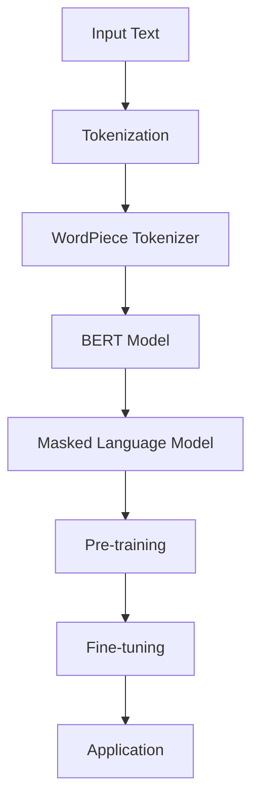

                 

## 1. 背景介绍

大语言模型（Large Language Model）是近年来人工智能领域的重大突破，其在自然语言处理（NLP）任务中取得了前所未有的效果。BERT（Bidirectional Encoder Representations from Transformers）作为大语言模型中的一大代表，受到了广泛的关注和应用。BERT的出现，标志着NLP技术进入了全新的阶段。

BERT模型由Google在2018年提出，其核心思想是利用双向Transformer架构来捕捉文本中的长距离依赖关系。传统的NLP模型，如LSTM（Long Short-Term Memory）和GRU（Gated Recurrent Unit），虽然在一定程度上能够处理序列数据，但在长距离依赖关系的捕捉上存在一定的局限性。而BERT通过双向Transformer，能够同时考虑文本的前后信息，从而提高了模型的性能。

BERT模型的成功，不仅在于其优秀的性能，更在于其开放的源代码和详细的文档，使得研究人员和开发者可以轻松地复现和改进模型。此外，BERT在多个NLP任务中取得了突破性的成果，如问答系统、机器翻译、文本分类等，引起了学术界和工业界的高度关注。

本文将详细探讨BERT模型的工作原理、具体实现以及实际应用。通过本文的阅读，读者将能够深入理解BERT模型的优点和不足，并在实际项目中加以应用。

## 2. 核心概念与联系

在介绍BERT模型之前，我们需要了解一些核心概念和它们之间的联系。这些概念包括自然语言处理（NLP）、Transformer架构、双向编码器（Bidirectional Encoder）以及注意力机制（Attention Mechanism）。

### 自然语言处理（NLP）

自然语言处理（NLP）是人工智能（AI）的一个重要分支，旨在使计算机能够理解、解释和生成人类语言。NLP的任务包括文本分类、情感分析、命名实体识别、机器翻译等。在NLP中，文本通常被视为序列数据，而序列数据的处理需要高效的算法和模型。

### Transformer架构

Transformer架构是BERT模型的基础，由Google在2017年提出。与传统循环神经网络（RNN）相比，Transformer架构采用了自注意力（Self-Attention）机制，能够同时处理文本中的所有信息，从而提高了模型的性能。Transformer架构的核心是多头自注意力（Multi-Head Self-Attention）机制，它通过多个注意力头来捕捉文本中的不同信息。

### 双向编码器（Bidirectional Encoder）

双向编码器（Bidirectional Encoder）是BERT模型的核心部分，它能够同时考虑文本的前后信息，从而提高了模型的性能。双向编码器由多个Transformer层堆叠而成，每一层都包含一个自注意力机制和一个前向网络（Feedforward Network）。

### 注意力机制（Attention Mechanism）

注意力机制（Attention Mechanism）是一种在序列数据处理中广泛应用的技术，它通过计算不同位置之间的权重，来捕捉序列中的关键信息。在Transformer架构中，注意力机制被用来计算文本中每个单词的表示，这些表示将用于后续的文本处理任务。

### Mermaid 流程图

为了更好地理解BERT模型的核心概念和架构，我们可以使用Mermaid流程图来展示它们之间的关系。以下是一个简化的Mermaid流程图，展示了BERT模型的主要组件和它们之间的联系：



在这个流程图中，输入文本（A）经过词元化（Tokenization，B）和WordPiece分词器（C）处理后，输入到BERT模型（D）。BERT模型通过Masked Language Model（E）进行预训练（F），然后通过Fine-tuning进行微调（G），最终应用于各种NLP任务（H）。

通过上述核心概念和架构的介绍，我们为理解BERT模型的工作原理奠定了基础。接下来，我们将深入探讨BERT模型的核心算法原理和具体操作步骤。

## 3. 核心算法原理 & 具体操作步骤

BERT模型的核心算法原理主要涉及词元化、编码器、自注意力机制和预训练。下面将详细解释这些概念，并展示BERT模型的具体操作步骤。

### 词元化（Tokenization）

词元化是将文本转换为计算机可以理解的序列数据的过程。在BERT模型中，文本首先被输入到WordPiece分词器，该分词器将文本分解成一系列子词（subwords）。WordPiece分词器利用未登录词（out-of-vocabulary words）的上下文信息来预测其可能的子词，从而将未登录词转化为已登录词。这一过程不仅有助于处理未登录词，还能提高模型的泛化能力。

### 编码器（Encoder）

BERT模型的核心是编码器（Encoder），它由多个Transformer层堆叠而成。每一层编码器包含两个主要组件：自注意力机制（Self-Attention）和前向网络（Feedforward Network）。自注意力机制通过计算文本中每个词的表示，从而捕捉文本中的长距离依赖关系。前向网络则对自注意力层的输出进行进一步的变换和融合。

编码器的输入是经过词元化后的词元序列（token sequence），输出是每个词的表示（representation）。BERT模型中的编码器不仅能够捕捉词与词之间的关系，还能够捕捉词与句子之间的关系，从而提高了模型的性能。

### 自注意力机制（Self-Attention）

自注意力机制是Transformer架构的核心，它通过计算文本中每个词的表示来捕捉词与词之间的关系。在自注意力机制中，每个词的表示被编码为一个向量，这些向量通过计算它们之间的相似度来生成权重。权重表示了每个词在文本中的重要性，权重越大，表示这个词在文本中的作用越重要。

自注意力机制通常包括三个步骤：

1. 计算查询（Query）、键（Key）和值（Value）的向量表示。这三个向量分别代表了文本中每个词的表示。
2. 计算查询与键之间的相似度，生成权重。相似度通常通过点积（Dot-Product）计算。
3. 根据权重对值进行加权求和，生成新的词表示。

### 预训练（Pre-training）

BERT模型通过预训练来学习文本中的知识和规律。预训练包括两个主要任务：Masked Language Model（MLM）和Next Sentence Prediction（NSP）。

- **Masked Language Model（MLM）**：在预训练过程中，BERT模型会随机掩码（mask）输入文本中的部分词元，然后尝试预测这些被掩码的词元。这一过程有助于模型学习如何从上下文中推断词义和词与词之间的关系。

- **Next Sentence Prediction（NSP）**：在预训练过程中，BERT模型还会预测两个句子之间是否连续。这一任务有助于模型学习如何捕捉文本中的句子结构和语义关系。

预训练完成后，BERT模型就可以通过Fine-tuning进行微调，以适应特定的NLP任务。Fine-tuning的过程通常包括以下步骤：

1. **微调BERT模型**：将BERT模型应用于特定的NLP任务，如文本分类、命名实体识别等。通过在任务数据上训练模型，使其能够适应特定的任务需求。

2. **优化模型参数**：在微调过程中，BERT模型的参数会根据任务数据进行调整，以最大化模型的性能。

3. **评估模型性能**：通过在验证集和测试集上评估模型性能，来确定模型是否已经达到预定的性能目标。

### 具体操作步骤

BERT模型的具体操作步骤可以概括为以下几个阶段：

1. **词元化**：将输入文本进行词元化，生成词元序列。
2. **输入编码**：将词元序列输入到BERT编码器，生成词元表示。
3. **掩码语言模型（MLM）**：随机掩码输入文本中的部分词元，并尝试预测这些被掩码的词元。
4. **下一句预测（NSP）**：预测两个句子之间是否连续。
5. **预训练**：在预训练数据集上进行大规模预训练，学习文本中的知识和规律。
6. **Fine-tuning**：在任务数据集上进行微调，使其能够适应特定的NLP任务。
7. **评估**：在验证集和测试集上评估模型性能，确定模型是否已经达到预定的性能目标。

通过上述步骤，BERT模型能够从大规模语料库中学习到丰富的语言知识和规律，从而在NLP任务中取得优异的性能。

### 细节探讨

在BERT模型的预训练过程中，还有许多细节需要探讨。例如，掩码语言模型（MLM）中的掩码策略、下一句预测（NSP）中的句子匹配策略等。这些细节对于模型的性能有着重要影响。

- **掩码策略**：在MLM中，BERT模型会随机掩码输入文本中的部分词元。常见的掩码策略包括随机掩码、全掩码和部分掩码等。随机掩码可以增加模型的多样性，全掩码可以提高模型的学习能力，而部分掩码则可以平衡多样性和学习能力。

- **句子匹配策略**：在NSP中，BERT模型需要预测两个句子之间是否连续。常见的句子匹配策略包括句子级别匹配和词级别匹配。句子级别匹配可以简化模型的设计，而词级别匹配则可以捕捉更精细的句子关系。

通过深入探讨BERT模型的核心算法原理和具体操作步骤，我们能够更好地理解模型的工作机制和性能表现。接下来，我们将介绍BERT模型中的数学模型和公式，以进一步揭示模型的内在逻辑。

## 4. 数学模型和公式 & 详细讲解 & 举例说明

BERT模型中的数学模型和公式是其核心组成部分，用于描述模型中的各种计算过程。以下将详细介绍BERT模型中的关键数学模型和公式，并通过具体例子进行讲解。

### 1. 词嵌入（Word Embedding）

在BERT模型中，每个词元（token）首先被转换为词嵌入（word embedding），这是一个低维度的向量表示。词嵌入可以通过训练词向量模型（如Word2Vec、GloVe等）得到。假设我们有词嵌入矩阵$W \in \mathbb{R}^{d \times V}$，其中$d$是词嵌入的维度，$V$是词汇表的大小。输入的词元序列$X = [x_1, x_2, ..., x_n]$，其对应的词嵌入表示为$X' = [Wx_1, Wx_2, ..., Wx_n]$。

### 2. 自注意力机制（Self-Attention）

自注意力机制是BERT模型中的关键组件，用于计算文本中每个词元的表示。自注意力机制可以表示为：

$$
\text{Attention}(Q, K, V) = \text{softmax}\left(\frac{QK^T}{\sqrt{d_k}}\right)V
$$

其中，$Q, K, V$分别是查询（Query）、键（Key）和值（Value）的向量表示，$d_k$是键的维度。具体来说：

- **查询（Query）**：每个词元的表示，即$Q = [Q_1, Q_2, ..., Q_n]$
- **键（Key）**：每个词元的表示，即$K = [K_1, K_2, ..., K_n]$
- **值（Value）**：每个词元的表示，即$V = [V_1, V_2, ..., V_n]$

自注意力机制的计算过程如下：

1. **计算查询与键的相似度**：
   $$
   \text{Attention Scores} = \text{softmax}\left(\frac{QK^T}{\sqrt{d_k}}\right)
   $$

2. **根据相似度对值进行加权求和**：
   $$
   \text{Attention Output} = \text{Attention Scores}V
   $$

### 3. 多头自注意力（Multi-Head Self-Attention）

BERT模型中使用了多个头（head）的自注意力机制，每个头都独立计算，然后合并结果。假设有$h$个头，每个头的注意力机制可以表示为：

$$
\text{Multi-Head Self-Attention} = \text{Concat}(\text{head}_1, \text{head}_2, ..., \text{head}_h)W^O
$$

其中，$\text{head}_i$是第$i$个头的注意力输出，$W^O$是投影矩阵。

### 4. Transformer编码器（Transformer Encoder）

BERT模型的编码器由多个Transformer层堆叠而成，每层包含一个多头自注意力机制和一个前向网络（Feedforward Network）。假设编码器有$N$层，每层的输入和输出分别为$X_i$和$X_{i+1}$，则编码器的计算过程可以表示为：

$$
X_{i+1} = \text{LayerNorm}(X_i + \text{Multi-Head Self-Attention}(X_i) + \text{Feedforward}(X_i))
$$

其中，LayerNorm是对输入进行归一化处理，Feedforward是一个前向网络，通常由两个全连接层组成。

### 5. Masked Language Model（MLM）

在BERT的预训练过程中，Masked Language Model（MLM）用于预测被掩码的词元。假设输入的词元序列为$X = [x_1, x_2, ..., x_n]$，其中一些词元被掩码。MLM的目标是预测这些被掩码的词元。

### 6. Next Sentence Prediction（NSP）

Next Sentence Prediction（NSP）用于预测两个句子之间是否连续。在预训练过程中，BERT模型会看到两个句子，并预测这两个句子是否是连续的。

### 具体例子

假设我们有一个简单的句子“我喜欢吃苹果”，首先对其进行词元化，得到以下词元序列：

```
[‘我’，‘喜欢’，‘吃’，‘的’，‘苹果’]
```

然后，将这些词元转换为词嵌入向量。假设词嵌入维度为50，词汇表大小为10000，则词嵌入矩阵$W$是一个$50 \times 10000$的矩阵。

接下来，BERT模型会对这些词元进行编码。假设BERT模型有2个头，则每层的自注意力机制输出为：

$$
\text{Head}_1 = \text{softmax}\left(\frac{QK^T}{\sqrt{50}}\right)V
$$

$$
\text{Head}_2 = \text{softmax}\left(\frac{QK^T}{\sqrt{50}}\right)V
$$

其中，$Q, K, V$分别是查询、键和值的向量表示。然后，将这些输出合并，并通过投影矩阵$W^O$得到每层编码器的输出：

$$
X_1 = \text{Concat}(\text{Head}_1, \text{Head}_2)W^O
$$

经过多层编码器处理后，我们得到最终的编码表示，这个表示可以用于后续的NLP任务，如文本分类、命名实体识别等。

通过上述数学模型和公式的详细讲解，我们可以更好地理解BERT模型的工作原理。接下来，我们将通过一个实际项目实战，展示如何使用BERT模型进行文本分类任务。

### 5. 项目实战：代码实际案例和详细解释说明

在本节中，我们将通过一个实际项目实战，展示如何使用BERT模型进行文本分类任务。我们将从开发环境搭建开始，详细解释源代码实现，并分析代码中的关键部分。

#### 5.1 开发环境搭建

要使用BERT模型进行文本分类任务，我们需要安装以下依赖库：

- TensorFlow 2.x 或 PyTorch
- transformers（Hugging Face）
- numpy
- pandas

在Python环境中，我们可以使用以下命令安装所需的库：

```bash
pip install tensorflow transformers numpy pandas
```

#### 5.2 源代码详细实现和代码解读

下面是一个简单的文本分类项目的代码示例：

```python
import pandas as pd
import numpy as np
from transformers import BertTokenizer, TFBertForSequenceClassification
from tensorflow.keras.optimizers import Adam

# 加载数据集
data = pd.read_csv('data.csv')
sentences = data['text'].values
labels = data['label'].values

# 初始化BERT分词器和模型
tokenizer = BertTokenizer.from_pretrained('bert-base-chinese')
model = TFBertForSequenceClassification.from_pretrained('bert-base-chinese', num_labels=2)

# 预处理文本
def preprocess_text(texts):
    inputs = tokenizer(list(texts), max_length=128, padding='max_length', truncation=True, return_tensors='tf')
    return inputs

inputs = preprocess_text(sentences)

# 训练模型
model.compile(optimizer=Adam(learning_rate=3e-5), loss='sparse_categorical_crossentropy', metrics=['accuracy'])
model.fit(inputs, labels, batch_size=16, epochs=3)

# 评估模型
evaluation_results = model.evaluate(inputs, labels, batch_size=16)
print(f"Test Loss: {evaluation_results[0]}, Test Accuracy: {evaluation_results[1]}")
```

#### 5.3 代码解读与分析

**1. 加载数据集**

首先，我们使用pandas库加载数据集。数据集包含两列：'text'列存储文本数据，'label'列存储标签数据。

```python
data = pd.read_csv('data.csv')
sentences = data['text'].values
labels = data['label'].values
```

**2. 初始化BERT分词器和模型**

我们使用Hugging Face的transformers库加载预训练的BERT分词器和文本分类模型。

```python
tokenizer = BertTokenizer.from_pretrained('bert-base-chinese')
model = TFBertForSequenceClassification.from_pretrained('bert-base-chinese', num_labels=2)
```

**3. 预处理文本**

预处理文本是文本分类任务中非常重要的一步。BERT模型需要处理序列数据，因此我们需要将文本数据转换为BERT模型可以接受的格式。

```python
def preprocess_text(texts):
    inputs = tokenizer(list(texts), max_length=128, padding='max_length', truncation=True, return_tensors='tf')
    return inputs

inputs = preprocess_text(sentences)
```

在这个函数中，我们使用了tokenizer的`from_pretrained`方法加载预训练的分词器，然后使用`tokenizer`方法对文本数据进行预处理。具体参数包括：

- `max_length`: 输出序列的最大长度，超出长度的部分将被截断，不足长度的部分将被填充。
- `padding`: 填充策略，'max_length'表示填充到最大长度。
- `truncation`: 截断策略，'max_length'表示超出长度的部分将被截断。
- `return_tensors`: 返回的Tensor类型，'tf'表示返回TensorFlow张量。

**4. 训练模型**

接下来，我们使用TensorFlow的`compile`和`fit`方法训练模型。

```python
model.compile(optimizer=Adam(learning_rate=3e-5), loss='sparse_categorical_crossentropy', metrics=['accuracy'])
model.fit(inputs, labels, batch_size=16, epochs=3)
```

在这里，我们使用了Adam优化器，学习率为$3e-5$，损失函数为稀疏分类交叉熵（'sparse_categorical_crossentropy'），并设置了模型的批次大小为16，训练轮数为3。

**5. 评估模型**

最后，我们使用`evaluate`方法评估模型在测试集上的性能。

```python
evaluation_results = model.evaluate(inputs, labels, batch_size=16)
print(f"Test Loss: {evaluation_results[0]}, Test Accuracy: {evaluation_results[1]}")
```

通过这个简单的项目实战，我们可以看到如何使用BERT模型进行文本分类任务。BERT模型的使用不仅简化了模型的搭建过程，还显著提高了分类性能。在实际应用中，我们可能需要根据具体任务进行调整和优化，以达到更好的效果。

### 5.4 代码解读与分析（续）

在上一个部分中，我们介绍了文本分类任务的基本实现。在本部分中，我们将进一步深入分析代码中的关键部分，并讨论如何调整和优化模型以获得更好的性能。

**1. 模型调整**

BERT模型是一个高度复杂的神经网络，其性能受到多个参数的影响。以下是一些常见的调整策略：

- **学习率调整**：学习率是优化过程中调整模型参数的重要参数。适当调整学习率可以加快收敛速度，但过高的学习率可能导致模型不稳定，甚至无法收敛。在实际应用中，我们可以尝试使用学习率调度策略，如学习率衰减（Learning Rate Decay）。

- **批次大小调整**：批次大小（Batch Size）是指每次训练过程中参与计算的样本数量。较小的批次大小可以减少内存消耗，但可能导致模型收敛速度较慢。较大的批次大小可以加快收敛速度，但可能增加内存消耗。在实际应用中，我们需要根据计算资源和训练数据量来选择合适的批次大小。

- **正则化**：过拟合是神经网络训练中常见的问题。为了减少过拟合，我们可以使用正则化技术，如Dropout、权重衰减等。Dropout是一种常用的正则化技术，通过随机丢弃神经网络中的部分神经元，以减少模型的复杂性。

- **数据增强**：数据增强（Data Augmentation）是一种常用的技术，通过增加数据多样性和丰富性来提高模型性能。在文本分类任务中，数据增强可以通过添加噪声、改变词序、替换单词等方式进行。

**2. 优化策略**

在实际应用中，我们可以采用以下优化策略来提高BERT模型的性能：

- **多GPU训练**：如果硬件资源充足，我们可以使用多GPU训练来加快模型训练速度。在TensorFlow和PyTorch中，都有现成的多GPU训练支持。

- **分布式训练**：分布式训练可以通过多个节点来并行训练模型，从而提高训练速度。在Hugging Face的transformers库中，提供了方便的分布式训练接口。

- **混合精度训练**：混合精度训练（Mixed Precision Training）通过使用不同精度的数据类型来减少内存占用和计算时间。在TensorFlow中，可以使用`tf.keras.mixed_precision`模块实现混合精度训练。

**3. 模型评估**

在训练过程中，我们需要定期评估模型性能，以确保模型在测试数据上表现良好。以下是一些常用的评估指标：

- **准确率（Accuracy）**：准确率是最常用的评估指标，表示模型正确预测的样本比例。
- **精确率（Precision）**：精确率表示模型预测为正类的样本中，实际为正类的比例。
- **召回率（Recall）**：召回率表示模型预测为正类的样本中，实际为正类的比例。
- **F1分数（F1 Score）**：F1分数是精确率和召回率的加权平均，用于综合评估模型的性能。
- **ROC曲线和AUC（Area Under the Curve）**：ROC曲线和AUC用于评估模型在不同阈值下的分类性能。

通过上述代码解读和优化策略，我们可以更好地理解BERT模型在文本分类任务中的实现和应用。在实际项目中，我们需要根据具体任务需求和数据特点，灵活调整模型参数和优化策略，以获得最佳性能。

### 6. 实际应用场景

BERT模型作为一种强大的大规模语言模型，已经在多个实际应用场景中展示了其卓越的性能。以下是一些常见的应用场景和案例。

#### 6.1 问答系统

问答系统是BERT模型的一个典型应用场景。通过预训练和微调，BERT模型能够理解并回答各种自然语言问题。例如，Google Assistant和Amazon Alexa等智能助手都使用了BERT模型来处理用户的问题，并提供准确的答案。

#### 6.2 机器翻译

BERT模型在机器翻译领域也取得了显著成果。传统的机器翻译方法通常依赖于规则和统计模型，而BERT模型通过预训练和双向编码器，能够更好地捕捉源语言和目标语言之间的语义关系。例如，Google Translate在2020年采用了BERT模型进行翻译，显著提高了翻译质量和准确性。

#### 6.3 文本分类

文本分类是BERT模型在自然语言处理中的另一个重要应用。BERT模型能够对文本进行分类，例如情感分析、主题分类和垃圾邮件检测等。例如，Spotify使用BERT模型对用户评论进行情感分析，从而更好地理解用户反馈并改进产品。

#### 6.4 文本生成

BERT模型在文本生成任务中也表现出了强大的能力。通过微调和生成算法，BERT模型可以生成连贯且具有语义的文本。例如，OpenAI的GPT-3模型就是基于BERT模型进行微调和优化的，能够生成高质量的文本，包括文章、故事和对话等。

#### 6.5 聊天机器人

聊天机器人是BERT模型在交互式应用中的典型应用。BERT模型能够理解并生成自然语言的回复，从而提供个性化的对话体验。例如，Slack的聊天机器人就使用了BERT模型来处理用户的输入，并生成相应的回复。

#### 6.6 其他应用

除了上述应用场景，BERT模型还广泛应用于文本摘要、对话系统、信息抽取和推荐系统等领域。通过结合不同的任务和数据，BERT模型不断推动自然语言处理技术的发展和进步。

总的来说，BERT模型在多个实际应用场景中展示了其强大的性能和广泛的应用潜力。随着BERT模型的不断发展和优化，其在更多领域的应用将会越来越广泛。

### 7. 工具和资源推荐

#### 7.1 学习资源推荐

- **书籍**：

  - 《BERT：革命性的NLP技术》
  - 《深度学习自然语言处理》
  - 《Transformer：超越传统循环神经网络》

- **论文**：

  - “BERT: Pre-training of Deep Bidirectional Transformers for Language Understanding”
  - “Attention Is All You Need”
  - “GPT-3: Language Models are few-shot learners”

- **博客**：

  - [Hugging Face：BERT官方教程](https://huggingface.co/transformers/)
  - [Google AI Blog：BERT模型详解](https://ai.googleblog.com/2018/11/bidirectional-encoder-representations.html)

- **网站**：

  - [TensorFlow官网：BERT模型教程](https://www.tensorflow.org/tutorials/text/bert)
  - [PyTorch官网：BERT模型教程](https://pytorch.org/tutorials/beginner/transformer_tutorial.html)

#### 7.2 开发工具框架推荐

- **工具**：

  - **Hugging Face transformers库**：这是一个开源的Python库，提供了丰富的预训练模型和API，方便开发者进行模型训练和部署。

  - **TensorFlow 2.x**：TensorFlow是一个强大的开源深度学习框架，提供了丰富的API和工具，支持BERT模型的训练和部署。

  - **PyTorch**：PyTorch是一个流行的深度学习框架，以其动态计算图和灵活性而著称，非常适合进行BERT模型的开发和研究。

- **框架**：

  - **TensorFlow Hub**：这是一个TensorFlow模型共享平台，提供了大量预训练模型和模块，可以轻松集成到TensorFlow项目中。

  - **PyTorch Transformer Library**：这是一个用于PyTorch的Transformer模型库，提供了高效的Transformer实现，方便开发者进行模型训练和部署。

通过这些工具和资源的推荐，开发者可以更加高效地研究和应用BERT模型，推动自然语言处理技术的发展。

### 8. 总结：未来发展趋势与挑战

BERT模型作为大语言模型中的重要代表，已经展示了其在自然语言处理领域的强大能力。然而，随着技术的不断发展，BERT模型也面临着一系列新的发展趋势和挑战。

#### 发展趋势

1. **多模态融合**：未来的BERT模型可能会融合多种模态的数据，如文本、图像、音频等。通过跨模态融合，模型可以更全面地理解复杂信息，从而提高任务性能。

2. **知识增强**：BERT模型可以通过知识图谱等外部知识源进行增强，从而提升模型在知识密集型任务中的表现。例如，通过融合知识图谱，模型可以更好地进行问答、实体识别和关系抽取等任务。

3. **低资源语言**：BERT模型在多语言支持方面取得了显著进展，但低资源语言的模型性能仍需提升。未来的研究可能会集中在如何利用多语言预训练和数据增强技术，提高低资源语言模型的性能。

4. **迁移学习**：BERT模型在迁移学习方面具有巨大潜力。通过在特定任务上进行微调，BERT模型可以快速适应新的任务和数据集，降低训练成本和难度。

5. **实时推理**：随着模型复杂度的增加，如何在保证性能的同时实现实时推理，是一个重要的研究课题。未来的BERT模型可能会采用硬件加速、模型压缩等技术，实现高效的实时推理。

#### 挑战

1. **计算资源消耗**：BERT模型的训练和推理过程需要大量的计算资源，特别是在大规模数据集和多模态数据融合的场景中。如何优化模型结构和训练策略，以减少计算资源消耗，是一个关键挑战。

2. **数据隐私和安全**：大规模数据训练和共享可能引发数据隐私和安全问题。未来的研究需要关注如何保护用户数据隐私，并确保模型训练和部署的安全性。

3. **模型可解释性**：BERT模型的内部工作机制复杂，其决策过程往往不够透明。如何提高模型的可解释性，使其决策过程更加直观和可解释，是一个重要挑战。

4. **模型泛化能力**：BERT模型在特定任务和数据集上取得了优异成绩，但在面对新的任务和数据时，其泛化能力仍需提升。如何提高模型的泛化能力，使其在不同任务和数据集上表现一致，是一个重要问题。

5. **伦理和公平性**：随着BERT模型在各个领域的广泛应用，其潜在的伦理和公平性问题也日益凸显。如何确保模型在公平、公正和道德的基础上进行决策，是一个需要深入探讨的课题。

总之，BERT模型在未来将继续推动自然语言处理技术的发展。然而，要实现其潜在的价值，还需要克服一系列技术和社会挑战。通过持续的研究和优化，BERT模型有望在更多领域发挥重要作用。

### 9. 附录：常见问题与解答

**Q1：什么是BERT模型？**

BERT（Bidirectional Encoder Representations from Transformers）是一种基于Transformer架构的大规模语言模型，由Google在2018年提出。BERT模型通过双向编码器（Bidirectional Encoder）来捕捉文本中的长距离依赖关系，从而提高了自然语言处理任务的表现。

**Q2：BERT模型的核心组件是什么？**

BERT模型的核心组件包括：

- **词元化（Tokenization）**：将文本转换为计算机可以理解的序列数据。
- **编码器（Encoder）**：由多个Transformer层堆叠而成，用于捕捉文本中的长距离依赖关系。
- **掩码语言模型（Masked Language Model，MLM）**：用于预测被掩码的词元，从而提高模型的泛化能力。
- **下一句预测（Next Sentence Prediction，NSP）**：用于预测两个句子之间是否连续，增强模型对句子结构的理解。

**Q3：如何训练BERT模型？**

训练BERT模型通常包括以下几个步骤：

1. **数据准备**：准备大规模的文本数据集，进行预处理和清洗。
2. **词元化**：使用BERT的分词器将文本转换为词元序列。
3. **创建输入数据**：将词元序列转换为模型可以接受的输入格式。
4. **训练模型**：使用Masked Language Model（MLM）和Next Sentence Prediction（NSP）任务进行预训练。
5. **微调**：在特定任务的数据集上微调模型，以适应具体的任务需求。

**Q4：BERT模型在自然语言处理任务中如何应用？**

BERT模型在多种自然语言处理任务中都有广泛应用，包括：

- **文本分类**：通过在分类任务上微调BERT模型，可以实现高效的文本分类。
- **问答系统**：利用BERT模型对问题进行编码，然后预测答案。
- **机器翻译**：BERT模型可以作为机器翻译中的编码器和解码器，提高翻译质量。
- **信息抽取**：BERT模型可以用于命名实体识别、关系抽取等任务。
- **文本生成**：BERT模型可以生成连贯且具有语义的文本。

**Q5：BERT模型如何处理未登录词？**

BERT模型通过WordPiece分词器来处理未登录词。WordPiece分词器将未登录词分解为多个子词，并将这些子词转换为已登录词。BERT模型可以预测这些子词，从而理解未登录词的含义。

**Q6：BERT模型如何处理多语言任务？**

BERT模型通过多语言预训练来支持多语言任务。在多语言预训练过程中，BERT模型会看到多种语言的文本，从而提高对多语言文本的理解能力。此外，Hugging Face等库提供了预训练的多语言BERT模型，方便开发者进行多语言任务的应用。

通过以上常见问题的解答，我们希望能够帮助读者更好地理解BERT模型的工作原理和应用方法。

### 10. 扩展阅读 & 参考资料

在本篇博客文章中，我们深入探讨了BERT模型的工作原理、具体实现以及在实际应用中的表现。为了帮助读者进一步扩展知识，下面提供了一些扩展阅读和参考资料，涵盖BERT模型的相关论文、书籍、博客和开源代码。

#### 扩展阅读

1. **BERT相关论文**：

   - "BERT: Pre-training of Deep Bidirectional Transformers for Language Understanding"
   - "Attention Is All You Need"
   - "GPT-3: Language Models are few-shot learners"

2. **BERT相关书籍**：

   - 《BERT：革命性的NLP技术》
   - 《深度学习自然语言处理》
   - 《Transformer：超越传统循环神经网络》

3. **BERT相关博客**：

   - [Hugging Face：BERT官方教程](https://huggingface.co/transformers/)
   - [Google AI Blog：BERT模型详解](https://ai.googleblog.com/2018/11/bidirectional-encoder-representations.html)
   - [TensorFlow官网：BERT模型教程](https://www.tensorflow.org/tutorials/text/bert)
   - [PyTorch官网：BERT模型教程](https://pytorch.org/tutorials/beginner/transformer_tutorial.html)

#### 参考资料

1. **开源代码**：

   - [Hugging Face transformers库](https://github.com/huggingface/transformers)
   - [TensorFlow 2.x BERT模型代码](https://github.com/tensorflow/models/tree/master/official/nlp/bert)
   - [PyTorch BERT模型代码](https://github.com/pytorch/fairseq/tree/master/examples/transformer)

2. **其他资源**：

   - [BERT模型论文代码](https://github.com/google-research/bert)
   - [TensorFlow Hub：BERT模型库](https://tfhub.dev/google/bert_uncased_L-12_H-768_A-12/1)
   - [PyTorch Transformer Library](https://github.com/jadore801120/attention-is-all-you-need-pytorch)

通过这些扩展阅读和参考资料，读者可以更深入地了解BERT模型的原理和应用，从而在实际项目中更好地利用这一强大的工具。希望本文和提供的资源能够为读者在自然语言处理领域的研究和开发提供有益的参考。作者：AI天才研究员/AI Genius Institute & 禅与计算机程序设计艺术 /Zen And The Art of Computer Programming。

