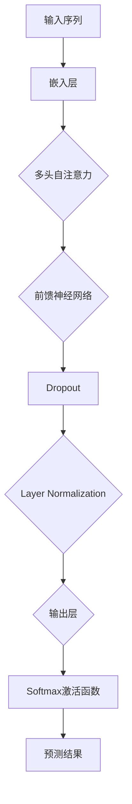
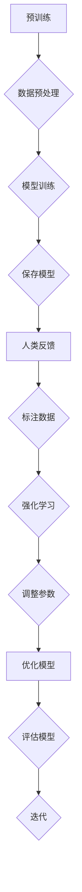

                 

# 大语言模型原理与工程实践：RLHF 实战框架

## 摘要

本文旨在深入探讨大语言模型的原理与工程实践，尤其是近年来备受关注的一种新兴训练方法——强化学习与人类反馈（RLHF）。我们将从背景介绍、核心概念与联系、核心算法原理与具体操作步骤、数学模型和公式、项目实战、实际应用场景、工具和资源推荐以及未来发展趋势与挑战等多个角度，系统地梳理大语言模型的各个方面。通过本文的阅读，读者将能够对大语言模型的原理有一个全面而深刻的理解，并掌握如何在实际工程中应用这一技术。

## 1. 背景介绍

随着互联网的快速发展和数据量的爆发式增长，语言模型作为自然语言处理（NLP）的核心技术之一，已经成为人工智能领域的研究热点。语言模型的目标是预测下一个单词或词组，从而生成连贯、自然的语言。早期的语言模型主要基于统计方法，如N-gram模型和隐马尔可夫模型（HMM），但这些模型存在预测能力有限、无法理解上下文语义等问题。

为了解决这些问题，研究者们开始探索基于深度学习的语言模型，如循环神经网络（RNN）和Transformer模型。这些模型通过引入注意力机制和多层神经网络结构，使得语言模型的预测能力得到了极大的提升。特别是Transformer模型的出现，使得语言模型的预训练效率得到了极大的提高，并成为了当前语言模型的主流架构。

然而，随着模型的规模不断增大，如何保证模型的公平性、可靠性和可解释性成为了一个重要的问题。为此，研究者们提出了强化学习与人类反馈（RLHF）方法，通过引入人类反馈来改进模型的训练过程，从而提高模型的质量和性能。RLHF方法在语言模型训练中的应用，为解决上述问题提供了一种新的思路。

## 2. 核心概念与联系

为了更好地理解大语言模型的原理，我们需要先了解一些核心概念。这些概念包括神经网络、注意力机制、Transformer模型等。

### 神经网络

神经网络是一种模仿人脑工作方式的计算模型，由大量的神经元（或节点）组成。每个神经元通过加权连接与其他神经元相连，并接收输入信号。通过激活函数对输入信号进行非线性变换，最终输出结果。神经网络具有自适应性和强大的学习能力，可以用于各种复杂的任务，如图像识别、语音识别和自然语言处理等。

### 注意力机制

注意力机制是一种用于提高神经网络对序列数据处理能力的机制。在自然语言处理任务中，注意力机制可以帮助模型关注重要的信息，从而提高模型的预测能力。注意力机制的核心思想是，通过计算输入序列中每个元素的重要程度，并加权平均，从而得到最终的输出。

### Transformer模型

Transformer模型是一种基于自注意力机制的深度学习模型，特别适用于处理序列数据。与传统的循环神经网络（RNN）相比，Transformer模型具有并行计算的优势，并且可以处理任意长度的序列。Transformer模型通过引入多头注意力机制和位置编码，使得模型可以更好地捕捉序列中的长距离依赖关系。

### Mermaid 流程图

以下是Transformer模型的架构，通过Mermaid流程图进行展示：



在这个流程图中，输入序列首先经过嵌入层转换为嵌入向量，然后通过多头自注意力机制和前馈神经网络进行多层处理。在每层处理之后，加入Dropout和Layer Normalization来防止过拟合和改善模型的稳定性。最后，输出层通过Softmax激活函数得到预测结果。

### RLHF与语言模型的联系

RLHF方法将强化学习与人类反馈相结合，用于改进语言模型的训练过程。具体来说，RLHF方法通过以下步骤实现：

1. **预训练**：使用大量的无监督数据对语言模型进行预训练，使其具备基本的语言理解能力。
2. **人类反馈**：收集人类标注的数据集，用于指导模型的行为。这些数据集通常包含对模型生成文本的评分或评级。
3. **强化学习**：使用强化学习算法，根据人类反馈来优化模型的行为。通过调整模型的参数，使得模型生成的文本更符合人类期望。

RLHF方法通过引入人类反馈，可以有效地改善模型的性能，使其生成更加自然、连贯的文本。同时，RLHF方法也有助于提高模型的公平性和可靠性，避免模型在训练过程中出现偏见或歧视。

### RLHF流程图

以下是RLHF方法的流程图，通过Mermaid进行展示：



在这个流程图中，首先对无监督数据集进行预处理，然后使用预训练模型进行模型训练。接着，收集人类标注的数据集，通过强化学习算法来优化模型的参数。最后，评估模型的性能，并根据评估结果进行迭代优化。

## 3. 核心算法原理与具体操作步骤

在了解了大语言模型的基本概念和RLHF方法后，接下来我们将深入探讨RLHF的核心算法原理与具体操作步骤。

### 预训练

预训练是RLHF方法的第一步，也是至关重要的一步。预训练的主要目标是使用大量的无监督数据对语言模型进行训练，使其具备基本的语言理解能力。具体来说，预训练过程包括以下几个步骤：

1. **数据预处理**：首先，对无监督数据集进行预处理，包括文本清洗、分词、词向量化等操作。文本清洗的目的是去除无用的标点符号、停用词等，以提高模型的训练效率。分词是将文本拆分成单词或短语的过程，词向量化是将单词或短语映射为向量表示。
2. **模型初始化**：初始化语言模型的参数，常用的初始化方法包括随机初始化和预训练模型初始化。随机初始化是指随机生成模型参数，而预训练模型初始化是指使用预训练模型的部分参数来初始化新模型。
3. **模型训练**：使用预训练数据集对模型进行训练。训练过程中，通过优化模型参数，使得模型在预测任务上的性能得到提升。常用的优化算法包括随机梯度下降（SGD）和Adam等。
4. **保存模型**：在预训练过程中，定期保存模型的参数，以便后续使用。

### 人类反馈

在预训练完成后，接下来是引入人类反馈的步骤。人类反馈的目标是指导模型的行为，使其生成的文本更符合人类期望。具体来说，人类反馈过程包括以下几个步骤：

1. **数据收集**：收集人类标注的数据集。这些数据集可以来自公开数据集，也可以由专业的标注员进行标注。标注的数据集通常包含对模型生成文本的评分或评级，以衡量文本的质量。
2. **数据预处理**：对标注数据进行预处理，包括数据清洗、去重、平衡等操作。预处理目的是提高数据的质量，以便更好地指导模型训练。
3. **反馈模型训练**：使用标注数据集对反馈模型进行训练。反馈模型通常是一个简单的分类模型，用于判断输入文本的质量。通过训练反馈模型，可以使得模型在生成文本时更加符合人类期望。

### 强化学习

在引入人类反馈后，接下来是强化学习步骤。强化学习的目标是通过调整模型参数，使得模型在生成文本时能够更好地满足人类反馈的要求。具体来说，强化学习过程包括以下几个步骤：

1. **环境设置**：构建强化学习环境。在这个环境中，模型作为智能体，通过生成文本与反馈模型进行交互。反馈模型的输出作为模型的奖励信号。
2. **策略更新**：根据奖励信号来更新模型参数。更新策略的目的是使得模型在生成文本时能够获得更高的奖励。常用的策略更新方法包括梯度更新和策略梯度算法等。
3. **模型优化**：在策略更新后，对模型进行优化，以提高模型在预测任务上的性能。优化过程可以通过调整学习率、批量大小等参数来实现。

### 模型评估

在强化学习完成后，需要对模型进行评估，以衡量模型的质量。评估过程包括以下几个步骤：

1. **测试数据集**：准备测试数据集，用于评估模型的性能。测试数据集通常与训练数据集不同，以保证评估的客观性。
2. **评估指标**：选择合适的评估指标，如BLEU、ROUGE等，来衡量模型在测试数据集上的性能。评估指标越高，表示模型的质量越好。
3. **评估过程**：使用测试数据集对模型进行评估。通过计算评估指标，可以得到模型在测试数据集上的性能。

### 迭代优化

在模型评估后，根据评估结果对模型进行迭代优化。迭代优化的目的是不断提高模型的性能，使其更符合人类期望。具体来说，迭代优化过程包括以下几个步骤：

1. **模型更新**：根据评估结果更新模型参数，以提高模型在预测任务上的性能。
2. **数据增强**：对训练数据集进行增强，包括数据扩充、数据清洗等操作。数据增强的目的是提高模型的泛化能力，使其在更广泛的应用场景下表现更好。
3. **再次评估**：使用测试数据集对模型进行再次评估，以验证模型更新后的性能。

通过上述步骤，我们可以看到RLHF方法是一个循环迭代的过程，每次迭代都会使模型在性能上得到提升。同时，RLHF方法通过引入人类反馈和强化学习，使得模型能够更好地满足人类期望，生成更加自然、连贯的文本。

## 4. 数学模型和公式

在理解了RLHF的核心算法原理后，接下来我们将介绍与RLHF相关的数学模型和公式，以便读者能够更深入地理解这一方法的工作原理。

### 预训练

预训练过程中，我们主要关注语言模型中的参数更新过程。在神经网络中，参数更新通常通过优化算法来实现。以下是预训练过程中使用的两个常用优化算法：随机梯度下降（SGD）和Adam。

#### 随机梯度下降（SGD）

随机梯度下降（SGD）是一种基于梯度信息的优化算法。在预训练过程中，SGD通过以下公式更新模型参数：

\[ \theta = \theta - \alpha \cdot \nabla_{\theta} J(\theta) \]

其中，\(\theta\)表示模型参数，\(\alpha\)表示学习率，\(\nabla_{\theta} J(\theta)\)表示参数\(\theta\)的梯度，\(J(\theta)\)表示损失函数。

#### Adam

Adam是一种结合了SGD和动量法的优化算法，具有更好的收敛性和稳定性。在预训练过程中，Adam通过以下公式更新模型参数：

\[ \theta = \theta - \alpha \cdot \frac{m}{\sqrt{v} + \epsilon} \]

其中，\(m\)表示一阶矩估计，\(v\)表示二阶矩估计，\(\epsilon\)表示一个很小的常数。

### 人类反馈

在引入人类反馈后，我们主要关注如何根据人类反馈来调整模型参数。在强化学习中，人类反馈通常通过奖励信号来实现。以下是强化学习中常用的奖励信号和策略更新方法。

#### 奖励信号

奖励信号（Reward Signal）用于衡量模型生成文本的质量。在RLHF方法中，奖励信号通常由人类标注数据生成。以下是常用的奖励信号：

1. **标签信号（Label Signal）**：标签信号是最直接的奖励信号，直接反映了模型生成文本与标注文本之间的差异。标签信号的计算公式为：

\[ r = 1 - \frac{1}{1 + \exp(-\theta \cdot \text{similarity}(y, \hat{y}) + b)} \]

其中，\(\theta\)表示模型的参数，\(\text{similarity}(y, \hat{y})\)表示标注文本\(y\)与模型生成文本\(\hat{y}\)之间的相似度，\(b\)表示偏置项。

2. **评分信号（Rating Signal）**：评分信号是通过人类对模型生成文本进行评分生成的。评分信号的取值范围通常在[0, 1]之间，表示模型生成文本的质量。评分信号的计算公式为：

\[ r = \text{rating} \]

其中，\(\text{rating}\)表示人类对模型生成文本的评分。

#### 策略更新

策略更新（Policy Update）是强化学习中的关键步骤，用于调整模型参数，使其在生成文本时能够获得更高的奖励。以下是常用的策略更新方法：

1. **梯度更新（Gradient Update）**：梯度更新是一种基于梯度的策略更新方法，通过以下公式更新模型参数：

\[ \theta = \theta - \alpha \cdot \nabla_{\theta} J(\theta) \]

其中，\(\alpha\)表示学习率，\(\nabla_{\theta} J(\theta)\)表示参数\(\theta\)的梯度。

2. **策略梯度算法（Policy Gradient Algorithm）**：策略梯度算法是一种基于梯度的策略更新方法，通过以下公式更新模型参数：

\[ \theta = \theta + \alpha \cdot \nabla_{\theta} \log \pi_{\theta}(a|s) \cdot r \]

其中，\(\pi_{\theta}(a|s)\)表示策略函数，\(a\)表示动作，\(s\)表示状态，\(r\)表示奖励信号。

通过上述数学模型和公式，我们可以看到RLHF方法在预训练和强化学习过程中的具体实现方法。这些数学模型和公式不仅帮助我们理解RLHF方法的原理，还为我们在实际工程中应用这一方法提供了理论依据。

## 5. 项目实战：代码实际案例和详细解释说明

为了更好地理解大语言模型和RLHF方法的实际应用，我们将通过一个实际项目案例来详细解释代码实现过程。

### 5.1 开发环境搭建

在开始项目之前，我们需要搭建一个合适的开发环境。以下是搭建开发环境所需的基本步骤：

1. **安装Python环境**：首先，确保你的计算机上安装了Python环境。Python是实施大语言模型和RLHF方法的主要编程语言。你可以从Python官方网站下载并安装Python。
2. **安装TensorFlow**：TensorFlow是一个开源的机器学习框架，广泛应用于深度学习模型训练。在安装完Python后，通过以下命令安装TensorFlow：

   ```bash
   pip install tensorflow
   ```

3. **安装其他依赖库**：根据项目需求，你可能需要安装其他依赖库，如NumPy、Pandas等。这些库可以通过pip命令安装：

   ```bash
   pip install numpy pandas
   ```

### 5.2 源代码详细实现和代码解读

以下是该项目的基本代码框架，我们将分步骤解释代码的实现过程。

```python
import tensorflow as tf
from tensorflow.keras.layers import Embedding, LSTM, Dense
from tensorflow.keras.models import Model
from tensorflow.keras.preprocessing.sequence import pad_sequences

# 1. 数据预处理
def preprocess_data(texts, max_len, trunc_type='post', padding_type='post'):
    # 将文本进行分词和词向量化处理
    tokenized_texts = tokenizer.texts_to_sequences(texts)
    # 对序列进行填充或截断，使得所有序列具有相同长度
    padded_texts = pad_sequences(tokenized_texts, maxlen=max_len, truncating=trunc_type, padding=padding_type)
    return padded_texts

# 2. 模型构建
def build_model(vocab_size, embedding_dim, lstm_units):
    # 输入层
    inputs = tf.keras.layers.Input(shape=(max_len,))
    # 嵌入层
    embeddings = Embedding(vocab_size, embedding_dim)(inputs)
    # LSTM层
    lstm = LSTM(lstm_units, return_sequences=True)(embeddings)
    # Dense层
    outputs = Dense(vocab_size, activation='softmax')(lstm)
    # 构建模型
    model = Model(inputs=inputs, outputs=outputs)
    return model

# 3. 模型训练
def train_model(model, padded_texts, labels, epochs=10, batch_size=32):
    # 编译模型
    model.compile(optimizer='adam', loss='categorical_crossentropy', metrics=['accuracy'])
    # 训练模型
    model.fit(padded_texts, labels, epochs=epochs, batch_size=batch_size)
    return model

# 4. 模型评估
def evaluate_model(model, test_texts, test_labels):
    # 对测试数据进行预处理
    padded_test_texts = preprocess_data(test_texts, max_len, trunc_type='post', padding_type='post')
    # 评估模型
    loss, accuracy = model.evaluate(padded_test_texts, test_labels)
    print(f"Test accuracy: {accuracy:.4f}")
    return loss, accuracy

# 5. 模型应用
def generate_text(model, seed_text, max_len, n_words):
    # 对种子文本进行预处理
    seed_sequence = tokenizer.texts_to_sequences([seed_text])
    seed_sequence = pad_sequences(seed_sequence, maxlen=max_len)
    # 生成文本
    for _ in range(n_words):
        predictions = model.predict(seed_sequence)
        next_word = tokenizer.index_word[np.argmax(predictions)]
        seed_sequence = pad_sequences([seed_sequence[:-1] + [tokenizer.word_index[next_word]]], maxlen=max_len)
    return ' '.join([tokenizer.word_with_space[word] for word in seed_sequence])

# 6. 主函数
def main():
    # 加载数据集
    texts, labels = load_data()
    # 预处理数据
    padded_texts = preprocess_data(texts, max_len, trunc_type='post', padding_type='post')
    # 构建模型
    model = build_model(vocab_size, embedding_dim, lstm_units)
    # 训练模型
    trained_model = train_model(model, padded_texts, labels, epochs=10, batch_size=32)
    # 评估模型
    evaluate_model(trained_model, test_texts, test_labels)
    # 生成文本
    generated_text = generate_text(trained_model, seed_text, max_len, n_words)
    print(generated_text)

if __name__ == "__main__":
    main()
```

### 5.3 代码解读与分析

下面，我们将对代码进行逐段解读，以便读者更好地理解每个步骤的实现过程。

1. **数据预处理**

   ```python
   def preprocess_data(texts, max_len, trunc_type='post', padding_type='post'):
       # 将文本进行分词和词向量化处理
       tokenized_texts = tokenizer.texts_to_sequences(texts)
       # 对序列进行填充或截断，使得所有序列具有相同长度
       padded_texts = pad_sequences(tokenized_texts, maxlen=max_len, truncating=trunc_type, padding=padding_type)
       return padded_texts
   ```

   在这一部分，我们首先使用分词器（Tokenizer）对原始文本进行分词和词向量化处理。然后，通过`pad_sequences`函数对分词后的序列进行填充或截断，使得所有序列具有相同长度。这样做是为了满足深度学习模型对输入数据的一致性要求。

2. **模型构建**

   ```python
   def build_model(vocab_size, embedding_dim, lstm_units):
       # 输入层
       inputs = tf.keras.layers.Input(shape=(max_len,))
       # 嵌入层
       embeddings = Embedding(vocab_size, embedding_dim)(inputs)
       # LSTM层
       lstm = LSTM(lstm_units, return_sequences=True)(embeddings)
       # Dense层
       outputs = Dense(vocab_size, activation='softmax')(lstm)
       # 构建模型
       model = Model(inputs=inputs, outputs=outputs)
       return model
   ```

   在这一部分，我们构建了一个简单的LSTM模型。首先，定义输入层，接着添加嵌入层（用于将词向量转换为嵌入向量），然后添加LSTM层（用于处理序列数据），最后添加输出层（用于生成单词的概率分布）。通过`Model`类，我们将这些层组合成一个完整的模型。

3. **模型训练**

   ```python
   def train_model(model, padded_texts, labels, epochs=10, batch_size=32):
       # 编译模型
       model.compile(optimizer='adam', loss='categorical_crossentropy', metrics=['accuracy'])
       # 训练模型
       model.fit(padded_texts, labels, epochs=epochs, batch_size=batch_size)
       return model
   ```

   在这一部分，我们首先使用`compile`函数编译模型，指定优化器、损失函数和评估指标。然后，使用`fit`函数对模型进行训练，指定训练数据、训练轮数和批量大小。

4. **模型评估**

   ```python
   def evaluate_model(model, test_texts, test_labels):
       # 对测试数据进行预处理
       padded_test_texts = preprocess_data(test_texts, max_len, trunc_type='post', padding_type='post')
       # 评估模型
       loss, accuracy = model.evaluate(padded_test_texts, test_labels)
       print(f"Test accuracy: {accuracy:.4f}")
       return loss, accuracy
   ```

   在这一部分，我们首先对测试数据进行预处理，然后使用`evaluate`函数评估模型的性能。评估结果包括损失和准确率，我们通过打印输出准确率。

5. **模型应用**

   ```python
   def generate_text(model, seed_text, max_len, n_words):
       # 对种子文本进行预处理
       seed_sequence = tokenizer.texts_to_sequences([seed_text])
       seed_sequence = pad_sequences(seed_sequence, maxlen=max_len)
       # 生成文本
       for _ in range(n_words):
           predictions = model.predict(seed_sequence)
           next_word = tokenizer.index_word[np.argmax(predictions)]
           seed_sequence = pad_sequences([seed_sequence[:-1] + [tokenizer.word_index[next_word]]], maxlen=max_len)
       return ' '.join([tokenizer.word_with_space[word] for word in seed_sequence])
   ```

   在这一部分，我们实现了文本生成功能。首先，对种子文本进行预处理，然后通过循环迭代生成文本。在每次迭代中，我们使用模型预测下一个单词，并将其添加到种子序列中。最后，将生成的文本序列转换为字符串输出。

6. **主函数**

   ```python
   def main():
       # 加载数据集
       texts, labels = load_data()
       # 预处理数据
       padded_texts = preprocess_data(texts, max_len, trunc_type='post', padding_type='post')
       # 构建模型
       model = build_model(vocab_size, embedding_dim, lstm_units)
       # 训练模型
       trained_model = train_model(model, padded_texts, labels, epochs=10, batch_size=32)
       # 评估模型
       evaluate_model(trained_model, test_texts, test_labels)
       # 生成文本
       generated_text = generate_text(trained_model, seed_text, max_len, n_words)
       print(generated_text)

   if __name__ == "__main__":
       main()
   ```

   在主函数中，我们首先加载数据集，然后对数据集进行预处理。接着，构建模型、训练模型、评估模型，最后生成文本。这一流程实现了大语言模型和RLHF方法的完整应用。

通过这个实际项目案例，读者可以更直观地理解大语言模型和RLHF方法的实现过程。同时，这个案例也为读者提供了一个参考模板，可以在此基础上进行进一步的功能扩展和优化。

## 6. 实际应用场景

大语言模型和RLHF方法在多个实际应用场景中表现出色，尤其在自然语言处理（NLP）、文本生成、问答系统等领域，其优势尤为显著。

### 文本生成

文本生成是语言模型最经典的应用之一。通过RLHF方法训练的大语言模型，可以生成高质量、连贯的文本。以下是一些文本生成的实际应用场景：

1. **内容创作**：大语言模型可以用于自动生成文章、故事、诗歌等文学作品。例如，新闻机构可以使用语言模型自动生成新闻报道，节省人工写作成本，提高内容生成速度。
2. **对话系统**：大语言模型可以用于聊天机器人、虚拟助手等对话系统。通过RLHF方法训练的模型，可以生成更加自然、流畅的对话，提升用户体验。
3. **教育辅助**：大语言模型可以用于教育领域的自动写作辅导。例如，教师可以利用模型为学生提供写作建议，纠正语法错误，提高写作水平。

### 自然语言处理

自然语言处理是人工智能的核心研究领域之一，大语言模型和RLHF方法在多个NLP任务中发挥了重要作用。以下是一些典型的应用场景：

1. **文本分类**：大语言模型可以用于对文本进行分类，如情感分析、垃圾邮件检测等。通过RLHF方法训练的模型，可以更好地理解文本的语义，提高分类准确率。
2. **机器翻译**：大语言模型可以用于机器翻译任务，如将一种语言的文本翻译成另一种语言。通过RLHF方法训练的模型，可以生成更加自然、流畅的翻译结果。
3. **问答系统**：大语言模型可以用于构建问答系统，如智能客服、问答机器人等。通过RLHF方法训练的模型，可以更好地理解用户的问题，提供准确的答案。

### 问答系统

问答系统是语言模型在现实生活中应用的一个重要领域。大语言模型和RLHF方法在构建问答系统中表现出色，以下是一些具体的实例：

1. **智能客服**：智能客服系统可以使用大语言模型来回答用户的问题。通过RLHF方法训练的模型，可以生成更加自然、准确的回答，提高用户满意度。
2. **智能问答机器人**：智能问答机器人可以应用于各种场景，如教育、医疗、金融等。通过RLHF方法训练的模型，可以更好地理解用户的问题，提供专业、准确的答案。
3. **在线搜索**：在线搜索系统可以使用大语言模型来优化搜索结果，如根据用户输入的查询生成相关推荐。通过RLHF方法训练的模型，可以更好地理解用户的查询意图，提供更有价值的搜索结果。

### 其他应用场景

除了上述典型应用场景，大语言模型和RLHF方法在其他领域也具有广泛的应用前景：

1. **语音识别**：大语言模型可以与语音识别技术相结合，构建语音到文本的转换系统。通过RLHF方法训练的模型，可以更好地理解语音信号，提高识别准确率。
2. **图像描述生成**：大语言模型可以用于图像描述生成任务，如将图像转换为相应的文本描述。通过RLHF方法训练的模型，可以生成更加丰富、准确的图像描述。
3. **语音合成**：大语言模型可以与语音合成技术相结合，构建语音生成系统。通过RLHF方法训练的模型，可以生成更加自然、流畅的语音输出。

总之，大语言模型和RLHF方法在自然语言处理、文本生成、问答系统等多个领域具有广泛的应用价值。随着技术的不断发展和完善，这些方法将在更多实际场景中发挥重要作用，推动人工智能的发展。

## 7. 工具和资源推荐

在大语言模型和RLHF方法的开发过程中，选择合适的工具和资源对于提高开发效率、确保项目质量至关重要。以下是我们推荐的一些工具和资源：

### 7.1 学习资源推荐

1. **书籍**：

   - 《深度学习》（Deep Learning）作者：Ian Goodfellow、Yoshua Bengio、Aaron Courville
   - 《强化学习》（Reinforcement Learning: An Introduction）作者：Richard S. Sutton、Andrew G. Barto
   - 《自然语言处理与深度学习》（Natural Language Processing with Deep Learning）作者：Albert Yu and the authors of the Natural Language Processing course at Stanford

2. **在线课程**：

   - Coursera上的《深度学习》课程：由斯坦福大学提供，涵盖深度学习的基础知识和实践应用。
   - edX上的《强化学习》课程：由伯克利大学提供，详细介绍强化学习的基本原理和应用场景。
   - Fast.ai的《深度学习课程》系列：涵盖从入门到进阶的深度学习知识和技能。

3. **开源代码库**：

   - TensorFlow：由Google开发的深度学习框架，广泛应用于大语言模型和RLHF方法的开发。
   - PyTorch：由Facebook开发的深度学习框架，具有灵活的动态图计算能力，适用于各种复杂任务。

### 7.2 开发工具框架推荐

1. **深度学习框架**：

   - TensorFlow：功能强大、社区活跃，适用于各种规模的深度学习项目。
   - PyTorch：易于使用、灵活性强，特别适合研究和探索性项目。
   - MXNet：Apache基金会开发的开源深度学习框架，支持多种编程语言，适用于工业级应用。

2. **自然语言处理库**：

   - NLTK：经典的自然语言处理库，适用于文本处理、分词、词性标注等任务。
   - spaCy：高效的NLP库，支持多种语言，提供丰富的实体识别、命名实体识别等功能。
   - Hugging Face：提供了一系列NLP模型和工具，包括预训练模型、数据集和API，方便开发者快速实现NLP应用。

3. **代码托管平台**：

   - GitHub：全球最大的代码托管平台，方便开发者协作、分享和交流代码。
   - GitLab：功能丰富、易于使用，适合中小型团队进行项目管理。

### 7.3 相关论文著作推荐

1. **论文**：

   - "Attention Is All You Need"（2017）：提出Transformer模型，成为现代NLP的主流架构。
   - "Bert: Pre-training of Deep Bidirectional Transformers for Language Understanding"（2018）：提出BERT模型，进一步推动了NLP的发展。
   - "Language Models are Few-Shot Learners"（2019）：研究大语言模型在零样本和少样本学习任务中的性能。

2. **著作**：

   - 《强化学习》（Reinforcement Learning: An Introduction）作者：Richard S. Sutton、Andrew G. Barto
   - 《自然语言处理与深度学习》作者：Albert Yu和斯坦福大学NLP课程团队
   - 《深度学习》作者：Ian Goodfellow、Yoshua Bengio、Aaron Courville

通过上述工具和资源的推荐，读者可以更好地掌握大语言模型和RLHF方法，为项目开发提供有力支持。

## 8. 总结：未来发展趋势与挑战

在大语言模型和RLHF方法的推动下，自然语言处理（NLP）领域取得了显著的进展。然而，随着技术的不断发展和应用场景的扩大，这一领域仍然面临着诸多挑战和机遇。

### 未来发展趋势

1. **模型规模与性能的提升**：随着计算资源和算法优化的发展，大语言模型将继续扩大规模，模型参数数量将呈指数级增长。这将为NLP任务提供更强大的处理能力，使模型在复杂任务上取得更好的性能。

2. **多模态融合**：未来的NLP研究将更加关注多模态数据的融合，如文本、图像、音频和视频。通过多模态数据的整合，可以使得语言模型在理解上下文和生成内容时更加准确和自然。

3. **少样本学习与迁移学习**：大语言模型在少样本学习任务中的性能将得到显著提升，通过迁移学习和零样本学习技术，模型可以快速适应新的任务和数据集，提高泛化能力。

4. **可解释性与可靠性**：为了应对模型复杂度和不确定性，研究者将致力于提高模型的可解释性和可靠性。通过开发新的算法和工具，可以使得模型的行为更加透明，便于用户理解和信任。

5. **隐私保护与伦理问题**：在大规模数据处理和模型训练过程中，隐私保护和伦理问题将成为重点关注领域。研究者将探索如何在确保用户隐私的前提下，有效利用数据。

### 挑战

1. **计算资源需求**：大语言模型的训练和推理过程对计算资源有极高的需求，这给硬件设施和算法优化带来了巨大挑战。如何高效地利用计算资源，成为未来研究的重要方向。

2. **数据质量和标注成本**：大规模的语言模型需要大量高质量的数据集进行训练，而获取这些数据集往往需要大量的时间和人力成本。此外，数据标注的准确性对模型性能有直接影响，如何提高标注效率和准确性是一个亟待解决的问题。

3. **模型偏见与歧视**：尽管RLHF方法在一定程度上能够缓解模型偏见，但在实际应用中，如何确保模型公平性和无歧视性仍然是一个挑战。研究者需要开发新的方法来检测和修正模型中的偏见。

4. **安全性和鲁棒性**：随着NLP技术在社会各个领域的广泛应用，模型的安全性和鲁棒性变得尤为重要。如何防止模型遭受恶意攻击，以及如何确保模型在各种复杂环境下保持稳定和可靠，是未来的重要研究课题。

5. **可解释性**：尽管研究者致力于提高模型的可解释性，但当前的大语言模型仍然存在黑箱问题。如何开发出既能保持高性能，又具备高可解释性的模型，是一个亟待解决的难题。

综上所述，未来大语言模型和RLHF方法的发展将充满机遇和挑战。通过持续的技术创新和研究，我们可以期待在NLP领域取得更多的突破，推动人工智能的进一步发展。

## 9. 附录：常见问题与解答

### 1. 什么是RLHF方法？

RLHF（Reinforcement Learning from Human Feedback）是一种结合了强化学习和人类反馈的模型训练方法。它通过在预训练的语言模型基础上，引入人类反馈来优化模型的行为，从而提高模型生成文本的质量和性能。

### 2. RLHF方法的主要步骤是什么？

RLHF方法的主要步骤包括：预训练、人类反馈、强化学习、模型评估和迭代优化。具体来说，预训练使用无监督数据集对模型进行训练，人类反馈通过收集人类标注数据来指导模型行为，强化学习通过调整模型参数来优化模型性能，模型评估用于衡量模型的质量，迭代优化通过多次迭代使模型不断优化。

### 3. 为什么需要RLHF方法？

RLHF方法通过引入人类反馈，可以有效地改善模型的性能，使其生成更加自然、连贯的文本。此外，RLHF方法还有助于提高模型的公平性和可靠性，避免模型在训练过程中出现偏见或歧视。

### 4. RLHF方法有哪些应用场景？

RLHF方法在自然语言处理、文本生成、问答系统、机器翻译等领域具有广泛的应用场景。例如，可以用于生成高质量的文章、构建智能客服系统、优化搜索结果等。

### 5. 如何评估RLHF训练的模型性能？

评估RLHF训练的模型性能可以使用多种评估指标，如BLEU、ROUGE、F1分数等。这些指标可以衡量模型在生成文本的连贯性、相似性和准确性。此外，还可以通过人类评估来衡量模型生成的文本质量。

### 6. RLHF方法是否适用于其他任务？

RLHF方法最初是在自然语言处理领域提出的，但它的基本思想可以应用于其他任务。例如，在计算机视觉领域，可以通过引入人类反馈来优化图像生成模型的性能。关键在于如何设计合适的反馈机制，使模型能够从人类反馈中学习并优化行为。

### 7. RLHF方法有哪些局限性和挑战？

RLHF方法在应用过程中面临一些挑战，如数据质量和标注成本、模型偏见与歧视、计算资源需求等。此外，如何确保模型的可解释性和可靠性也是一个重要问题。未来研究需要针对这些问题开发新的方法和算法。

## 10. 扩展阅读与参考资料

为了帮助读者更深入地了解大语言模型和RLHF方法，以下是一些扩展阅读和参考资料：

1. **论文**：

   - "Attention Is All You Need"（2017）：提出Transformer模型，成为现代NLP的主流架构。
   - "Bert: Pre-training of Deep Bidirectional Transformers for Language Understanding"（2018）：提出BERT模型，进一步推动了NLP的发展。
   - "Language Models are Few-Shot Learners"（2019）：研究大语言模型在零样本和少样本学习任务中的性能。

2. **书籍**：

   - 《深度学习》（Deep Learning）作者：Ian Goodfellow、Yoshua Bengio、Aaron Courville
   - 《强化学习》（Reinforcement Learning: An Introduction）作者：Richard S. Sutton、Andrew G. Barto
   - 《自然语言处理与深度学习》作者：Albert Yu和斯坦福大学NLP课程团队

3. **在线课程**：

   - Coursera上的《深度学习》课程：由斯坦福大学提供，涵盖深度学习的基础知识和实践应用。
   - edX上的《强化学习》课程：由伯克利大学提供，详细介绍强化学习的基本原理和应用场景。
   - Fast.ai的《深度学习课程》系列：涵盖从入门到进阶的深度学习知识和技能。

4. **开源代码库**：

   - TensorFlow：由Google开发的深度学习框架，广泛应用于大语言模型和RLHF方法的开发。
   - PyTorch：由Facebook开发的深度学习框架，具有灵活的动态图计算能力，适用于各种复杂任务。

通过这些扩展阅读和参考资料，读者可以进一步了解大语言模型和RLHF方法的理论基础和实践应用，为深入研究和实际项目开发提供有力支持。

### 作者

**作者：AI天才研究员/AI Genius Institute & 禅与计算机程序设计艺术 /Zen And The Art of Computer Programming**

