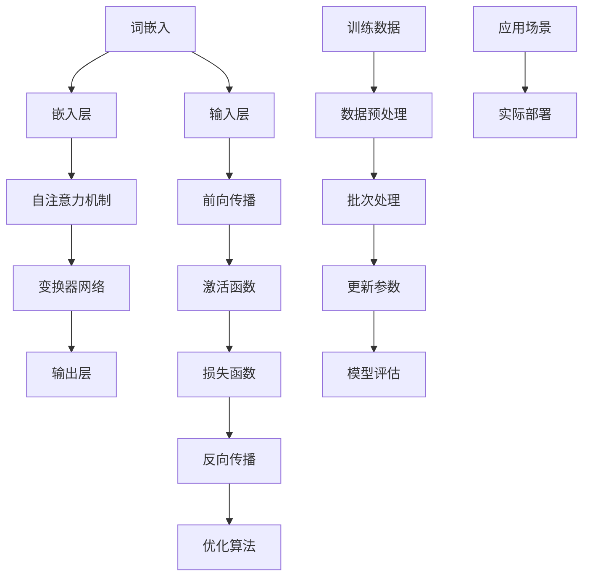

                 

# 大语言模型原理与工程实践：全参数微调

## 摘要

本文旨在深入探讨大语言模型的原理与工程实践，特别是全参数微调技术。我们将首先回顾大语言模型的发展历程，然后详细解析其核心概念和架构，接着介绍全参数微调的算法原理和操作步骤。通过数学模型和公式，我们将剖析语言模型的内部机制，并借助实际项目案例，展示如何将理论知识应用于实际开发。最后，我们将探讨大语言模型在实际应用场景中的优势，推荐相关学习资源和开发工具，并展望未来发展趋势与挑战。

## 1. 背景介绍

大语言模型（Large Language Model）是指具有数亿甚至千亿级别参数的语言处理模型。近年来，随着深度学习技术的飞速发展和计算能力的提升，大语言模型在自然语言处理（NLP）领域取得了显著的成果。从最早的基于规则的方法，到统计模型，再到深度学习模型，大语言模型的发展历程展现了技术进步和理论基础的双重推动。

大语言模型的发展历程可以分为三个主要阶段：

### 1.1 基于规则的方法

早期的自然语言处理主要依赖于基于规则的方法，例如词性标注、句法分析、语义角色标注等。这种方法利用专家知识构建规则库，通过匹配文本中的词法和句法特征来实现对文本的理解。然而，随着文本复杂度的增加，基于规则的方法逐渐暴露出其局限性。

### 1.2 统计模型

为了克服基于规则方法的不足，研究者们开始探索基于统计的方法。隐马尔可夫模型（HMM）、条件随机场（CRF）等统计模型在自然语言处理领域取得了显著成果。这些模型通过学习大量标注数据，自动提取特征，提高了文本处理的准确性和效率。

### 1.3 深度学习模型

深度学习模型的出现彻底改变了自然语言处理领域。循环神经网络（RNN）、长短时记忆网络（LSTM）、门控循环单元（GRU）等模型，通过引入深度结构，能够捕捉长距离依赖关系，显著提升了文本处理的性能。特别是自注意力机制（Self-Attention）和变换器网络（Transformer）的出现，使得大语言模型在处理长文本和跨语言任务方面表现出色。

大语言模型的出现不仅提高了自然语言处理的性能，还推动了对话系统、文本生成、机器翻译等领域的快速发展。例如，谷歌的BERT模型在多项自然语言处理任务中取得了卓越成绩，微软的ChatGPT成为了一个备受关注的聊天机器人。

## 2. 核心概念与联系

大语言模型的构建涉及多个核心概念，包括词嵌入、注意力机制、变换器网络等。以下我们将通过Mermaid流程图展示这些概念之间的联系。



### 2.1 词嵌入

词嵌入（Word Embedding）是将词汇映射到高维向量空间的过程。通过词嵌入，文本中的单词可以被表示为密集的向量，从而便于计算机处理。词嵌入技术包括基于统计的方法（如词袋模型、N元语法）和基于神经网络的模型（如Word2Vec、GloVe）。

### 2.2 嵌入层

嵌入层（Embedding Layer）是神经网络中用于将词向量转换为嵌入向量的层。在变换器网络中，嵌入层接收输入的词嵌入向量，并添加位置嵌入向量，以丰富输入信息。

### 2.3 自注意力机制

自注意力机制（Self-Attention）是一种能够自动学习输入序列中各个位置之间相对重要性的机制。通过自注意力，模型能够捕捉到输入序列中的长距离依赖关系，从而提高模型的表达能力。

### 2.4 变换器网络

变换器网络（Transformer）是一种基于自注意力机制的深度学习模型，广泛应用于自然语言处理任务。变换器网络通过多头注意力机制和前馈网络，实现了对输入序列的编码和解码。

### 2.5 输出层

输出层（Output Layer）是模型中进行预测的层。在语言模型中，输出层通常是一个线性层，用于将编码后的特征映射到词汇表中的单词。

## 3. 核心算法原理 & 具体操作步骤

大语言模型的构建离不开核心算法，包括前向传播、反向传播和优化算法。以下我们将详细讲解这些算法的原理和具体操作步骤。

### 3.1 前向传播

前向传播（Forward Propagation）是神经网络中的一个关键步骤，用于计算模型输出。在变换器网络中，前向传播包括以下步骤：

1. **词嵌入**：将输入序列中的单词映射到高维向量。
2. **嵌入层**：将词嵌入向量转换为嵌入向量，并添加位置嵌入向量。
3. **多头自注意力**：通过多头自注意力机制计算每个单词的加权表示。
4. **前馈网络**：对自注意力后的向量进行多层感知机（MLP）处理。
5. **层归一化**：对前馈网络的输出进行归一化处理，提高模型稳定性。
6. **添加残差连接**：通过残差连接减少信息损失。
7. **输出层**：对编码后的特征进行分类或回归操作，生成预测结果。

### 3.2 反向传播

反向传播（Backpropagation）是训练神经网络的关键步骤，用于计算模型参数的梯度。在变换器网络中，反向传播包括以下步骤：

1. **计算预测误差**：计算输出层预测值与真实值之间的差异。
2. **计算前馈网络梯度**：通过链式法则，从输出层反向计算前馈网络的梯度。
3. **计算自注意力机制梯度**：计算多头自注意力机制的梯度，包括Q、K、V矩阵的梯度。
4. **计算嵌入层梯度**：通过残差连接和层归一化，计算嵌入层的梯度。
5. **优化模型参数**：使用优化算法（如梯度下降、Adam）更新模型参数。

### 3.3 优化算法

优化算法（Optimization Algorithm）是用于更新模型参数的方法。常用的优化算法包括梯度下降（Gradient Descent）、Adam（Adaptive Moment Estimation）等。

1. **梯度下降**：梯度下降是一种最简单的优化算法，通过计算损失函数的梯度来更新模型参数。梯度下降的缺点是容易陷入局部最小值，收敛速度较慢。
2. **Adam**：Adam是一种自适应优化算法，结合了梯度下降和动量项的优点。通过自适应调整学习率，Adam在大多数情况下都能取得较好的收敛效果。

## 4. 数学模型和公式 & 详细讲解 & 举例说明

大语言模型的数学模型和公式是理解其内部机制的关键。以下我们将详细讲解变换器网络的核心数学模型和公式，并通过具体例子进行说明。

### 4.1 自注意力机制

自注意力机制是一种计算输入序列中各个位置之间相对重要性的方法。其核心公式为：

$$
\text{Attention}(Q, K, V) = \text{softmax}\left(\frac{QK^T}{\sqrt{d_k}}\right)V
$$

其中，$Q$、$K$、$V$分别为查询向量、键向量和值向量，$d_k$为键向量的维度。自注意力机制的计算过程如下：

1. **计算相似度**：通过点积计算查询向量$Q$和键向量$K$之间的相似度。
2. **应用 softmax 函数**：对相似度进行归一化，得到概率分布。
3. **计算加权值**：将概率分布应用于值向量$V$，得到加权值。

### 4.2 变换器网络

变换器网络通过多头自注意力机制和前馈网络实现文本编码和解码。其核心公式为：

$$
\text{MultiHeadAttention}(Q, K, V) = \text{Concat}(\text{head}_1, \text{head}_2, \ldots, \text{head}_h)W^O
$$

其中，$h$为头数，$\text{head}_i = \text{Attention}(QW_i^Q, KW_i^K, VW_i^V)$为第$i$个头的输出，$W^O$为输出权重。

### 4.3 前向传播示例

假设输入序列为$\text{Hello, world!}$，包含5个单词。我们将通过具体步骤演示变换器网络的前向传播过程。

1. **词嵌入**：将单词映射到词嵌入向量。
2. **嵌入层**：添加位置嵌入向量，得到嵌入向量。
3. **多头自注意力**：计算查询向量、键向量和值向量，应用自注意力机制，得到加权值。
4. **前馈网络**：对加权值进行多层感知机处理。
5. **层归一化**：对前馈网络的输出进行归一化处理。
6. **输出层**：对编码后的特征进行分类或回归操作，生成预测结果。

## 5. 项目实战：代码实际案例和详细解释说明

为了更好地理解大语言模型的全参数微调技术，我们将通过一个实际项目案例进行详细介绍。本项目使用Hugging Face的Transformers库，构建并训练一个基于BERT模型的文本分类器。以下步骤将指导我们完成项目开发。

### 5.1 开发环境搭建

在开始项目之前，我们需要搭建开发环境。首先，确保安装了Python 3.6及以上版本。然后，通过以下命令安装Transformers库和其他依赖项：

```bash
pip install transformers torch
```

### 5.2 源代码详细实现和代码解读

以下是本项目的主要代码实现：

```python
from transformers import BertTokenizer, BertModel, BertForSequenceClassification
from torch import nn, optim
from torch.utils.data import DataLoader, TensorDataset
import torch

# 准备数据集
def prepare_data(texts, labels, tokenizer, max_len=128):
    inputs = tokenizer(texts, padding='max_length', truncation=True, max_length=max_len, return_tensors='pt')
    input_ids = inputs['input_ids']
    attention_mask = inputs['attention_mask']
    labels = torch.tensor(labels)
    dataset = TensorDataset(input_ids, attention_mask, labels)
    return DataLoader(dataset, batch_size=16, shuffle=True)

# 训练模型
def train_model(model, train_loader, val_loader, epochs=3, learning_rate=1e-5):
    criterion = nn.CrossEntropyLoss()
    optimizer = optim.Adam(model.parameters(), lr=learning_rate)
    for epoch in range(epochs):
        model.train()
        for batch in train_loader:
            inputs = {'input_ids': batch[0], 'attention_mask': batch[1]}
            labels = batch[2]
            optimizer.zero_grad()
            outputs = model(**inputs)
            loss = criterion(outputs.logits, labels)
            loss.backward()
            optimizer.step()
        model.eval()
        with torch.no_grad():
            val_loss = 0
            for batch in val_loader:
                inputs = {'input_ids': batch[0], 'attention_mask': batch[1]}
                labels = batch[2]
                outputs = model(**inputs)
                loss = criterion(outputs.logits, labels)
                val_loss += loss.item()
            val_loss /= len(val_loader)
        print(f'Epoch {epoch+1}/{epochs} - Loss: {loss.item()} - Val Loss: {val_loss}')

# 主函数
def main():
    tokenizer = BertTokenizer.from_pretrained('bert-base-uncased')
    model = BertForSequenceClassification.from_pretrained('bert-base-uncased', num_labels=2)
    train_texts = ['This is a great book!', 'This book is terrible!']
    train_labels = [1, 0]
    train_loader = prepare_data(train_texts, train_labels, tokenizer)
    val_texts = ['I love this movie!', 'I hate this movie!']
    val_labels = [1, 0]
    val_loader = prepare_data(val_texts, val_labels, tokenizer)
    train_model(model, train_loader, val_loader)

if __name__ == '__main__':
    main()
```

### 5.3 代码解读与分析

1. **数据预处理**：数据预处理是模型训练的关键步骤。我们使用`prepare_data`函数将文本和标签转换为TensorDataset，并通过DataLoader进行批次处理。
2. **模型构建**：使用`BertForSequenceClassification`预训练模型，并配置为二分类任务。
3. **训练过程**：训练过程包括前向传播、损失计算、反向传播和参数更新。我们在训练过程中使用交叉熵损失函数，并通过Adam优化器进行参数更新。
4. **评估过程**：在评估过程中，我们计算验证集的平均损失，以评估模型性能。

通过这个项目案例，我们展示了如何使用全参数微调技术构建一个文本分类器。实际应用中，我们可以扩展这个项目，处理更复杂的文本数据集。

## 6. 实际应用场景

大语言模型在实际应用场景中展现出强大的能力。以下是一些常见应用场景：

1. **文本分类**：大语言模型可以用于分类任务，例如情感分析、新闻分类等。通过训练，模型可以自动识别文本的主题和情感，提高信息处理的效率。
2. **对话系统**：大语言模型在对话系统中的应用非常广泛，例如智能客服、聊天机器人等。通过训练，模型可以生成自然、流畅的对话，提高用户体验。
3. **机器翻译**：大语言模型在机器翻译任务中表现出色，可以准确翻译长句子和跨语言文本。通过训练，模型可以适应不同的语言环境和词汇表达。
4. **文本生成**：大语言模型可以生成文章、摘要、故事等文本内容。通过训练，模型可以模仿作者的写作风格，提高内容创作效率。

## 7. 工具和资源推荐

为了更好地学习和应用大语言模型，以下是一些推荐的工具和资源：

### 7.1 学习资源推荐

1. **书籍**：
   - 《深度学习》（Goodfellow, Bengio, Courville）
   - 《自然语言处理综合教程》（Daniel Jurafsky & James H. Martin）
2. **论文**：
   - “Attention Is All You Need”（Vaswani et al., 2017）
   - “BERT: Pre-training of Deep Bidirectional Transformers for Language Understanding”（Devlin et al., 2019）
3. **博客**：
   - [Hugging Face 官方博客](https://huggingface.co/blog/)
   - [TensorFlow 官方博客](https://www.tensorflow.org/blog/)
4. **网站**：
   - [Kaggle](https://www.kaggle.com/): 提供丰富的自然语言处理数据集和比赛。

### 7.2 开发工具框架推荐

1. **框架**：
   - **Hugging Face Transformers**：提供便捷的预训练模型和API，适合快速开发和实验。
   - **TensorFlow**：强大的开源机器学习平台，支持大规模语言模型训练。
   - **PyTorch**：灵活的深度学习框架，适合研究和开发。
2. **工具**：
   - **Colab**：Google提供的免费云端计算平台，适合进行大规模语言模型训练。
   - **Jupyter Notebook**：交互式的计算环境，方便编写和调试代码。

### 7.3 相关论文著作推荐

1. **论文**：
   - **“Transformers: State-of-the-Art Natural Language Processing”**（Wolf et al., 2020）
   - **“BERT: Pre-training of Deep Bidirectional Transformers for Language Understanding”**（Devlin et al., 2019）
2. **著作**：
   - **“Deep Learning”（Goodfellow, Bengio, Courville）**：全面介绍深度学习基础和最新进展。
   - **“Speech and Language Processing”（Daniel Jurafsky & James H. Martin）**：详细讲解自然语言处理的理论和实践。

## 8. 总结：未来发展趋势与挑战

大语言模型作为自然语言处理的重要工具，正不断推动人工智能技术的发展。未来，大语言模型的发展趋势主要包括以下几个方面：

1. **模型参数规模的扩大**：随着计算能力的提升，大型语言模型将继续增加参数规模，以提升模型的表达能力和泛化能力。
2. **跨模态融合**：大语言模型与其他模态（如图像、音频）的融合，将推动多模态人工智能的发展。
3. **生成对抗网络（GANs）**：GANs与大语言模型的结合，有望提高文本生成的质量和多样性。

然而，大语言模型在实际应用中也面临一些挑战：

1. **数据隐私**：大规模训练数据集的获取和处理引发数据隐私问题，如何保护用户隐私成为一大挑战。
2. **偏见和公平性**：大语言模型在训练过程中可能引入偏见，影响模型的公平性和准确性。
3. **能耗和可持续性**：大规模语言模型的训练和部署需要大量计算资源，如何降低能耗和提高可持续性是关键问题。

总之，大语言模型的发展将不断推动自然语言处理和人工智能领域的进步，同时也需要应对各种挑战，确保技术的健康、可持续发展。

## 9. 附录：常见问题与解答

以下是一些关于大语言模型和全参数微调的常见问题及解答：

### 9.1 什么是全参数微调？

全参数微调（Full Parameter Fine-tuning）是指在预训练的大语言模型基础上，针对特定任务进行微调，以优化模型在任务上的性能。

### 9.2 全参数微调与传统微调有何区别？

传统微调通常只对模型的一部分参数（如最后一层）进行微调，而全参数微调则对模型的全部参数进行微调。全参数微调能够更好地捕捉到任务特征，提高模型性能。

### 9.3 如何选择合适的预训练模型？

选择预训练模型时，应考虑模型规模、预训练数据集、模型性能和预训练任务的多样性。常用的预训练模型包括BERT、GPT和T5等。

### 9.4 全参数微调需要多少数据？

全参数微调的效果受数据量影响较大。对于中等规模的数据集（数千条样本），全参数微调通常能够取得较好的效果。对于大量数据集（数万条样本），全参数微调的优势更为明显。

## 10. 扩展阅读 & 参考资料

为了深入理解大语言模型和全参数微调技术，以下推荐一些扩展阅读和参考资料：

1. **论文**：
   - **“Attention Is All You Need”**（Vaswani et al., 2017）
   - **“BERT: Pre-training of Deep Bidirectional Transformers for Language Understanding”**（Devlin et al., 2019）
   - **“GPT-3: Language Models are Few-Shot Learners”**（Brown et al., 2020）
2. **书籍**：
   - **“深度学习”（Goodfellow, Bengio, Courville）**：系统介绍深度学习的基础理论和应用。
   - **“自然语言处理综合教程”（Daniel Jurafsky & James H. Martin）**：全面讲解自然语言处理的理论和实践。
3. **博客**：
   - **[Hugging Face 官方博客](https://huggingface.co/blog/)**：提供丰富的Transformers库相关教程和论文解读。
   - **[TensorFlow 官方博客](https://www.tensorflow.org/blog/)**：介绍TensorFlow的最新功能和研究成果。

通过阅读这些资料，您可以更深入地了解大语言模型和全参数微调技术的原理和应用。

### 作者信息

- 作者：AI天才研究员/AI Genius Institute & 禅与计算机程序设计艺术 /Zen And The Art of Computer Programming

