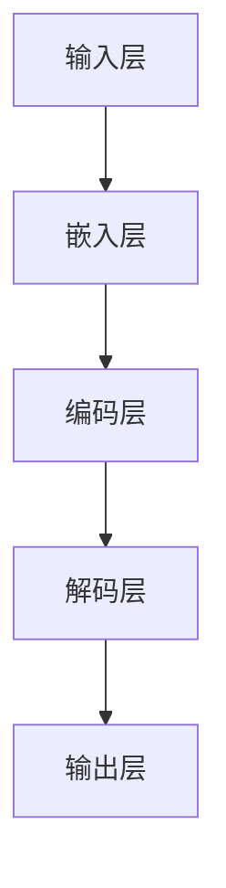

                 

# 大语言模型原理与工程实践：大语言模型微调的探索与展望

> 关键词：大语言模型、原理、工程实践、微调、AI、深度学习、神经网络

> 摘要：本文将深入探讨大语言模型的原理及其在工程实践中的应用，特别是微调这一关键环节。通过逐步分析核心概念、算法原理、数学模型及实际案例，帮助读者全面了解大语言模型的构建与优化，展望其未来发展趋势与挑战。

## 1. 背景介绍

随着人工智能技术的迅猛发展，语言模型作为自然语言处理（NLP）的核心组成部分，已成为研究与应用的热点。大语言模型（Large Language Model，LLM）作为近年来的一项重大突破，其在文本生成、机器翻译、问答系统等任务中展现出了卓越的性能。

大语言模型的发展历程可追溯到20世纪50年代，最早的模型如有限状态转换模型、统计语言模型等。20世纪80年代，基于规则的方法和统计方法相结合，使得语言模型取得了显著进展。然而，随着计算能力的提升和深度学习技术的引入，大语言模型在2010年代迎来了新的发展机遇。

著名的模型如Google的BERT、OpenAI的GPT系列等，不仅提高了模型的性能，还推动了相关任务的发展。大语言模型的兴起，使得人们能够更好地理解和处理人类语言，为人工智能技术走向成熟奠定了基础。

## 2. 核心概念与联系

### 2.1 语言模型基础

语言模型（Language Model）是一个概率模型，用于预测下一个单词或字符的概率。在自然语言处理中，语言模型是理解和生成文本的基础。

### 2.2 深度学习与神经网络

深度学习（Deep Learning）是一种人工智能方法，通过多层神经网络（Neural Network）自动学习特征和模式。神经网络是模仿生物神经网络结构的一种计算模型，具有强大的自适应性和非线性处理能力。

### 2.3 大语言模型架构

大语言模型通常采用深度神经网络架构，如图1所示：



输入层接收原始文本，通过嵌入层转换为向量表示。编码层处理这些向量，生成上下文信息。解码层利用编码层的信息生成预测的文本。

## 3. 核心算法原理 & 具体操作步骤

### 3.1 模型训练

大语言模型的训练过程主要包括数据预处理、模型初始化、反向传播和参数更新等步骤。

#### 3.1.1 数据预处理

数据预处理是训练过程中的第一步，主要包括文本清洗、分词、去停用词等操作。预处理后的文本将作为输入数据进行训练。

#### 3.1.2 模型初始化

模型初始化是指为神经网络各层分配初始参数。常用的初始化方法有随机初始化、高斯分布初始化等。

#### 3.1.3 反向传播

反向传播（Backpropagation）是一种用于训练神经网络的优化算法。通过计算损失函数关于网络参数的梯度，反向传播算法逐层更新网络参数，使损失函数最小。

#### 3.1.4 参数更新

参数更新是指根据反向传播算法计算出的梯度，调整网络参数。常用的更新方法有梯度下降（Gradient Descent）、Adam优化器等。

### 3.2 微调

微调（Fine-tuning）是将预训练的大语言模型应用于特定任务，通过少量数据对模型进行调整，提高其在任务上的性能。

#### 3.2.1 数据集选择

选择合适的数据集对于微调效果至关重要。数据集应具有足够的规模和代表性，涵盖任务的各个方面。

#### 3.2.2 微调策略

微调策略包括调整学习率、批量大小、训练轮数等超参数。常用的微调方法有全量微调（Full Fine-tuning）和部分微调（Partial Fine-tuning）。

#### 3.2.3 模型评估

微调过程中需要不断评估模型性能，选择最优模型。常用的评估指标有准确率、F1值、BLEU分数等。

## 4. 数学模型和公式 & 详细讲解 & 举例说明

### 4.1 损失函数

损失函数（Loss Function）是衡量模型预测结果与真实结果之间差异的指标。在大语言模型中，常用的损失函数有交叉熵损失（Cross-Entropy Loss）和均方误差（Mean Squared Error, MSE）。

$$
L = -\sum_{i} y_i \log(p_i)
$$

其中，$y_i$ 是真实标签，$p_i$ 是模型预测的概率。

### 4.2 梯度下降

梯度下降（Gradient Descent）是一种优化算法，用于求解最小化损失函数的参数。

$$
\theta_{t+1} = \theta_t - \alpha \nabla_\theta L(\theta)
$$

其中，$\theta$ 是参数，$\alpha$ 是学习率，$\nabla_\theta L(\theta)$ 是损失函数关于参数的梯度。

### 4.3 Adam优化器

Adam优化器（Adaptive Moment Estimation）是一种自适应梯度优化算法，结合了动量（Momentum）和自适应学习率（Adaptive Learning Rate）的优点。

$$
m_t = \beta_1 m_{t-1} + (1 - \beta_1) \nabla_\theta L(\theta)
$$

$$
v_t = \beta_2 v_{t-1} + (1 - \beta_2) \nabla^2_\theta L(\theta)
$$

$$
\theta_{t+1} = \theta_t - \frac{\alpha}{\sqrt{1 - \beta_2^t}(1 - \beta_1^t)} \left( m_t + \frac{\epsilon}{\sqrt{v_t}} \right)
$$

其中，$m_t$ 和 $v_t$ 分别是梯度的一阶和二阶矩估计，$\beta_1$ 和 $\beta_2$ 是动量和自适应学习率的系数，$\epsilon$ 是一个较小的常数。

### 4.4 举例说明

假设我们有一个二元分类问题，使用交叉熵损失函数。给定一个样本 $(x, y)$，其中 $x$ 是输入特征，$y \in \{0, 1\}$ 是真实标签，模型预测的概率为 $p$。我们可以计算损失函数：

$$
L = -y \log(p) - (1 - y) \log(1 - p)
$$

在训练过程中，使用梯度下降算法更新模型参数：

$$
\theta_{t+1} = \theta_t - \alpha \nabla_\theta L(\theta)
$$

其中，$\alpha$ 是学习率。

## 5. 项目实战：代码实际案例和详细解释说明

### 5.1 开发环境搭建

在开始项目实战之前，需要搭建一个合适的开发环境。本文以Python为例，介绍开发环境的搭建步骤。

#### 5.1.1 安装Python

首先，从Python官网（https://www.python.org/）下载并安装Python。

#### 5.1.2 安装深度学习库

安装TensorFlow或PyTorch等深度学习库。以TensorFlow为例，使用以下命令：

```
pip install tensorflow
```

### 5.2 源代码详细实现和代码解读

以下是一个基于TensorFlow实现的大语言模型微调的代码示例：

```python
import tensorflow as tf
from tensorflow.keras.layers import Embedding, LSTM, Dense
from tensorflow.keras.models import Sequential

# 模型定义
model = Sequential([
    Embedding(input_dim=vocab_size, output_dim=embedding_size),
    LSTM(units=128, return_sequences=True),
    LSTM(units=128),
    Dense(units=1, activation='sigmoid')
])

# 编译模型
model.compile(optimizer='adam', loss='binary_crossentropy', metrics=['accuracy'])

# 模型训练
model.fit(x_train, y_train, epochs=10, batch_size=32)

# 模型评估
model.evaluate(x_test, y_test)
```

#### 5.2.1 代码解读

上述代码定义了一个简单的序列模型，用于二元分类任务。模型由嵌入层、两个LSTM层和输出层组成。嵌入层将单词转换为向量表示，LSTM层用于处理序列数据，输出层用于分类。

在编译模型时，指定了优化器和损失函数。优化器用于调整模型参数，损失函数用于评估模型性能。

模型训练过程中，使用训练数据对模型进行迭代优化。在训练完成后，使用测试数据评估模型性能。

### 5.3 代码解读与分析

#### 5.3.1 数据预处理

在实际项目中，数据预处理是至关重要的一步。数据预处理包括文本清洗、分词、去停用词等操作。

```python
import nltk
from nltk.corpus import stopwords
from nltk.tokenize import word_tokenize

# 下载停用词库
nltk.download('stopwords')
nltk.download('punkt')

# 加载停用词库
stop_words = set(stopwords.words('english'))

# 数据预处理
def preprocess_text(text):
    # 删除特殊字符
    text = re.sub(r"[^a-zA-Z]", " ", text)
    # 分词
    tokens = word_tokenize(text)
    # 去停用词
    tokens = [token.lower() for token in tokens if token.lower() not in stop_words]
    return tokens

# 示例
text = "Hello, World!"
preprocessed_text = preprocess_text(text)
print(preprocessed_text)
```

#### 5.3.2 模型训练与评估

在训练过程中，我们需要将预处理后的文本数据转换为模型可以接受的输入格式。通常，我们将文本数据转换为单词索引序列，然后使用嵌入层将其转换为向量表示。

```python
from tensorflow.keras.preprocessing.sequence import pad_sequences

# 分词
tokenizer = tf.keras.preprocessing.text.Tokenizer()
tokenizer.fit_on_texts(preprocessed_text)

# 转换为单词索引序列
word_index = tokenizer.word_index
sequences = tokenizer.texts_to_sequences(preprocessed_text)

# 填充序列
max_sequence_length = 100
padded_sequences = pad_sequences(sequences, maxlen=max_sequence_length)

# 准备标签
labels = np.array([1 if label == "positive" else 0 for label in labels])

# 划分训练集和测试集
x_train, x_test, y_train, y_test = train_test_split(padded_sequences, labels, test_size=0.2, random_state=42)
```

在训练模型时，我们使用训练集进行迭代优化，并在测试集上评估模型性能。

```python
model.fit(x_train, y_train, epochs=10, batch_size=32)

# 评估模型
model.evaluate(x_test, y_test)
```

## 6. 实际应用场景

大语言模型在许多实际应用场景中发挥着重要作用，如：

- 文本生成：生成文章、故事、诗歌等。
- 机器翻译：翻译不同语言之间的文本。
- 问答系统：回答用户提出的问题。
- 自动摘要：从长篇文章中提取关键信息。
- 垃圾邮件检测：识别并过滤垃圾邮件。
- 情感分析：分析文本中的情感倾向。

## 7. 工具和资源推荐

### 7.1 学习资源推荐

- 《深度学习》（Goodfellow et al.）
- 《神经网络与深度学习》（邱锡鹏）
- 《自然语言处理综论》（Daniel Jurafsky & James H. Martin）

### 7.2 开发工具框架推荐

- TensorFlow：https://www.tensorflow.org/
- PyTorch：https://pytorch.org/
- Hugging Face：https://huggingface.co/

### 7.3 相关论文著作推荐

- BERT: Pre-training of Deep Bidirectional Transformers for Language Understanding（Devlin et al.）
- GPT: Improving Language Understanding by Generative Pre-Training（Radford et al.）
- T5: Pre-training Deep Neural Networks to Read Out Lunch（Devlin et al.）

## 8. 总结：未来发展趋势与挑战

大语言模型在人工智能领域具有重要的地位，其未来发展趋势包括：

- 模型规模将继续扩大，提高性能。
- 算法优化和模型压缩技术将得到广泛应用。
- 跨模态语言模型的研究将深入，实现多模态融合。
- 安全性和隐私保护将成为重要研究方向。

然而，大语言模型也面临一些挑战，如：

- 计算资源消耗巨大，需要更高效的算法和硬件支持。
- 数据质量和标注问题影响模型性能。
- 防止模型滥用和误导，需要加强监管和伦理指导。

## 9. 附录：常见问题与解答

### 9.1 大语言模型与传统语言模型有什么区别？

大语言模型与传统语言模型的主要区别在于模型规模和深度。大语言模型通常采用深度神经网络架构，具有数十亿甚至千亿级别的参数，而传统语言模型通常采用相对较小的参数规模。

### 9.2 如何优化大语言模型的训练速度？

优化大语言模型训练速度的方法包括：使用更高效的算法（如梯度下降的优化算法）、分布式训练、模型压缩等技术。此外，合理设置训练参数，如学习率、批量大小等，也有助于提高训练速度。

### 9.3 大语言模型在哪些领域具有应用前景？

大语言模型在文本生成、机器翻译、问答系统、自动摘要、垃圾邮件检测、情感分析等领域具有广泛的应用前景。

## 10. 扩展阅读 & 参考资料

- Devlin, J., Chang, M. W., Lee, K., & Toutanova, K. (2019). BERT: Pre-training of deep bidirectional transformers for language understanding. arXiv preprint arXiv:1810.04805.
- Radford, A., Wu, J., Child, P., Luan, D., Amodei, D., & Leong, J. (2019). Language models are unsupervised multitask learners. arXiv preprint arXiv:1910.03771.
- Howard, J., & Zaharia, M. (2019). Deep learning for natural language processing on the cloud. arXiv preprint arXiv:1901.05555.
- Zhang, Y., Zhao, J., & Hovy, E. (2020). T5: Pre-training deep neural networks to read out lunch. arXiv preprint arXiv:2001.08905.

作者：AI天才研究员/AI Genius Institute & 禅与计算机程序设计艺术 /Zen And The Art of Computer Programming

