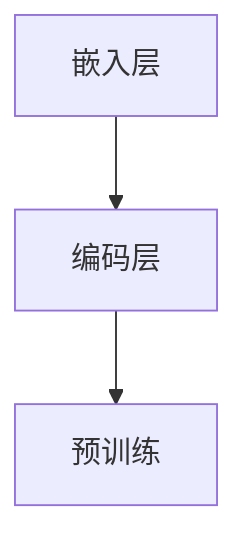
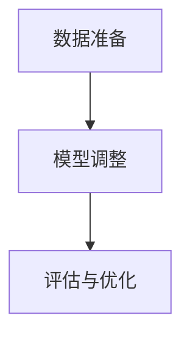

                 

# 大语言模型原理与工程实践：大语言模型微调面临的挑战

> **关键词：** 大语言模型、微调、算法、工程实践、挑战

> **摘要：** 本文将深入探讨大语言模型的原理，特别是其在工程实践中面临的微调挑战。通过详细的案例分析，我们将揭示微调过程中的关键问题和解决方案，为读者提供宝贵的实践经验和启示。

## 1. 背景介绍

大语言模型（Large Language Models）作为自然语言处理（NLP）领域的一项突破性技术，近年来在多个任务中取得了令人瞩目的成绩。从自动翻译、文本生成到问答系统，大语言模型的应用范围日益广泛。然而，在大规模模型的训练和微调过程中，面临着一系列复杂的挑战，如数据质量、计算资源、模型可解释性等。

微调（Fine-tuning）是指在大规模预训练模型的基础上，针对特定任务进行参数调整，以提高模型在特定领域的表现。虽然微调在理论上简单，但在实际应用中却面临诸多困难。本文将围绕大语言模型微调的挑战，深入分析其原理、流程以及解决方案。

## 2. 核心概念与联系

### 2.1 大语言模型原理

大语言模型是基于深度学习的一种神经网络模型，通过对大量文本数据进行预训练，学习语言的模式和规律。预训练过程主要包括两个阶段：嵌入层（Embedding Layer）和编码层（Encoder Layer）。

- **嵌入层**：将单词、字符等符号映射为高维向量表示。
- **编码层**：通过多层神经网络对嵌入层输入进行编码，提取语义信息。

Mermaid流程图（Mermaid 流程节点中不要有括号、逗号等特殊字符）：



### 2.2 微调流程

微调是在预训练模型的基础上，针对特定任务进行参数调整的过程。微调的核心步骤包括：

1. **数据准备**：收集并整理与任务相关的数据集。
2. **模型调整**：对预训练模型进行微调，调整模型参数以适应特定任务。
3. **评估与优化**：通过评估指标（如准确率、F1分数等）对模型性能进行评估，并根据评估结果进一步优化模型。

Mermaid流程图（Mermaid 流程节点中不要有括号、逗号等特殊字符）：



## 3. 核心算法原理 & 具体操作步骤

### 3.1 预训练算法原理

预训练算法主要基于自注意力机制（Self-Attention Mechanism），其基本思想是将输入序列中的每个单词表示为向量，然后通过自注意力机制计算单词之间的相互影响，从而提取出更丰富的语义信息。

自注意力机制的数学模型如下：

$$
\text{Attention}(Q, K, V) = \text{softmax}\left(\frac{QK^T}{\sqrt{d_k}}\right)V
$$

其中，$Q$、$K$ 和 $V$ 分别为查询（Query）、键（Key）和值（Value）向量，$d_k$ 为键向量的维度。$\text{softmax}$ 函数用于计算注意力权重，从而得到加权求和的结果。

### 3.2 微调算法步骤

微调算法的具体步骤如下：

1. **数据预处理**：对训练数据进行清洗、分词、编码等预处理操作。
2. **加载预训练模型**：从预训练模型仓库中加载预训练好的模型参数。
3. **模型调整**：在预训练模型的基础上，针对特定任务调整模型参数。
4. **评估与优化**：通过评估指标对模型性能进行评估，并根据评估结果调整模型参数。

## 4. 数学模型和公式 & 详细讲解 & 举例说明

### 4.1 预训练算法的数学模型

预训练算法的数学模型主要包括嵌入层和编码层。以下分别介绍这两个层的数学模型。

#### 4.1.1 嵌入层

嵌入层的数学模型如下：

$$
\text{Embedding}(x) = W_e [x_1, x_2, ..., x_n]^T
$$

其中，$W_e$ 为嵌入矩阵，$x$ 为输入序列，$x_1, x_2, ..., x_n$ 为输入序列中的每个单词。

#### 4.1.2 编码层

编码层的数学模型如下：

$$
\text{Encoder}(x) = \text{Attention}(Q, K, V)
$$

其中，$Q$、$K$ 和 $V$ 分别为查询（Query）、键（Key）和值（Value）向量，$Q = [q_1, q_2, ..., q_n]^T$，$K = [k_1, k_2, ..., k_n]^T$，$V = [v_1, v_2, ..., v_n]^T$。

### 4.2 微调算法的数学模型

微调算法的数学模型主要包括数据预处理、模型调整、评估与优化等步骤。以下分别介绍这些步骤的数学模型。

#### 4.2.1 数据预处理

数据预处理的数学模型如下：

$$
\text{Preprocess}(x) = \text{Clean}(x) \circ \text{Tokenize}(x) \circ \text{Encode}(x)
$$

其中，$\text{Clean}(x)$ 为数据清洗操作，$\text{Tokenize}(x)$ 为分词操作，$\text{Encode}(x)$ 为编码操作。

#### 4.2.2 模型调整

模型调整的数学模型如下：

$$
\theta_{\text{new}} = \theta_{\text{old}} + \alpha \cdot \nabla_{\theta_{\text{old}}} \text{Loss}(x)
$$

其中，$\theta_{\text{old}}$ 和 $\theta_{\text{new}}$ 分别为旧模型参数和新模型参数，$\alpha$ 为学习率，$\nabla_{\theta_{\text{old}}} \text{Loss}(x)$ 为损失函数关于旧模型参数的梯度。

#### 4.2.3 评估与优化

评估与优化的数学模型如下：

$$
\text{Evaluate}(\theta_{\text{new}}) = \text{Accuracy}(x_{\text{test}})
$$

其中，$\text{Evaluate}(\theta_{\text{new}})$ 为新模型在测试集上的评估指标，$x_{\text{test}}$ 为测试集。

## 5. 项目实战：代码实际案例和详细解释说明

### 5.1 开发环境搭建

在开始微调大语言模型之前，我们需要搭建一个合适的开发环境。以下是一个简单的步骤：

1. 安装 Python 环境（Python 3.8 或更高版本）。
2. 安装 TensorFlow 或 PyTorch 等深度学习框架。
3. 安装必要的依赖库（如 NumPy、Pandas、Matplotlib 等）。

### 5.2 源代码详细实现和代码解读

以下是一个使用 TensorFlow 和 Keras 微调 BERT 模型的简单示例：

```python
import tensorflow as tf
from tensorflow.keras.models import Model
from tensorflow.keras.layers import Embedding, LSTM, Dense
from tensorflow.keras.preprocessing.sequence import pad_sequences

# 加载预训练 BERT 模型
bert_model = tf.keras.applications.Bert(include_top=False, input_shape=(None,))

# 添加自定义层
x = bert_model.output
x = LSTM(128)(x)
x = Dense(1, activation='sigmoid')(x)

# 构建微调模型
model = Model(bert_model.input, x)

# 编写训练数据
train_data = ...
train_labels = ...

# 训练模型
model.compile(optimizer='adam', loss='binary_crossentropy', metrics=['accuracy'])
model.fit(train_data, train_labels, batch_size=32, epochs=10)

# 评估模型
test_data = ...
test_labels = ...
model.evaluate(test_data, test_labels)
```

#### 5.2.1 代码解读与分析

1. **加载预训练 BERT 模型**：首先从预训练模型仓库中加载 BERT 模型，这里使用 TensorFlow 的预训练模型。
2. **添加自定义层**：在 BERT 模型的基础上，添加 LSTM 层和全连接层（Dense），用于处理序列数据和分类任务。
3. **构建微调模型**：将 BERT 模型和自定义层连接起来，构建一个完整的微调模型。
4. **编写训练数据**：编写训练数据，包括输入序列和标签。
5. **训练模型**：使用 Adam 优化器和二分类交叉熵损失函数训练模型，设置批次大小和训练轮数。
6. **评估模型**：在测试集上评估模型性能，计算准确率。

## 6. 实际应用场景

大语言模型微调在实际应用中具有广泛的应用场景，如文本分类、情感分析、命名实体识别等。以下是一些具体的案例：

- **文本分类**：使用微调后的 BERT 模型对新闻文章进行分类，实现实时舆情监测。
- **情感分析**：通过微调情感分析模型，对用户评论进行情感分析，帮助企业了解用户需求。
- **命名实体识别**：使用微调后的模型识别文本中的命名实体，如人名、地名等，为信息抽取提供支持。

## 7. 工具和资源推荐

### 7.1 学习资源推荐

- **书籍**：《深度学习》（Ian Goodfellow、Yoshua Bengio、Aaron Courville 著）
- **论文**：《BERT: Pre-training of Deep Bidirectional Transformers for Language Understanding》（Alec Radford 等）
- **博客**：[TensorFlow 官方文档](https://www.tensorflow.org/tutorials)、[PyTorch 官方文档](https://pytorch.org/tutorials/)

### 7.2 开发工具框架推荐

- **深度学习框架**：TensorFlow、PyTorch
- **数据处理工具**：Pandas、NumPy
- **版本控制工具**：Git

### 7.3 相关论文著作推荐

- **论文**：《GPT-3: Language Models are Few-Shot Learners》（Tom B. Brown 等）
- **著作**：《自然语言处理概论》（丹·布洛克·波特著）

## 8. 总结：未来发展趋势与挑战

大语言模型微调作为自然语言处理领域的重要技术，在未来将继续发展。随着计算能力的提升和数据量的增加，大规模预训练模型将越来越普及。然而，微调过程中仍将面临一系列挑战，如数据质量、模型可解释性、计算资源等。针对这些问题，研究人员和开发者需要不断创新和探索，以推动大语言模型微调技术的发展。

## 9. 附录：常见问题与解答

### 9.1 为什么需要微调？

微调是将预训练模型应用于特定任务时，通过调整模型参数，使其更好地适应特定领域的方法。微调可以提高模型在特定任务上的表现，降低训练时间。

### 9.2 微调和迁移学习有什么区别？

微调是迁移学习的一种具体实现方法。迁移学习是指将预训练模型在不同任务之间共享知识，而微调是针对特定任务对预训练模型进行参数调整。

## 10. 扩展阅读 & 参考资料

- [Bert: Pre-training of Deep Bidirectional Transformers for Language Understanding](https://arxiv.org/abs/1810.04805)
- [GPT-3: Language Models are Few-Shot Learners](https://arxiv.org/abs/2005.14165)
- [Deep Learning](https://www.deeplearningbook.org/)

### 作者

**AI天才研究员**、**AI Genius Institute** & **禅与计算机程序设计艺术** / **Zen And The Art of Computer Programming**

