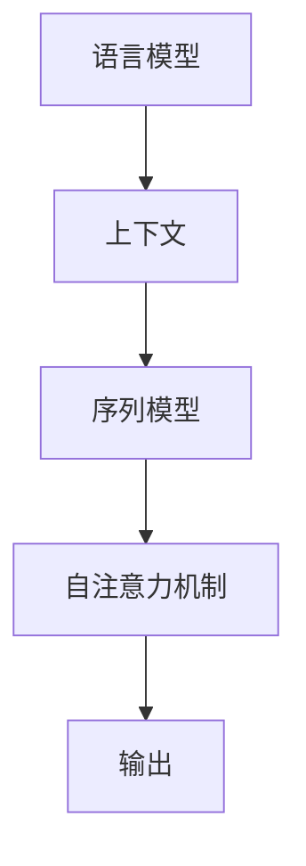
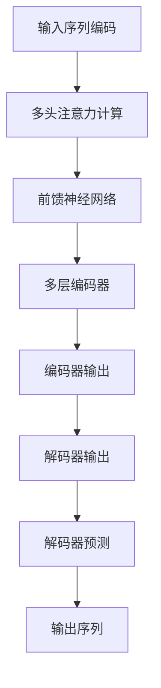

                 

# 大语言模型原理与工程实践：提示词设计

## 摘要

本文旨在深入探讨大语言模型的原理与工程实践，特别是提示词（Prompt）设计的重要性。通过详细解析大语言模型的架构，算法原理，以及提示词设计的策略，本文为读者提供了从理论基础到实际应用的全面指导。文章将分为以下几个部分：背景介绍、核心概念与联系、核心算法原理与具体操作步骤、数学模型和公式讲解、项目实战、实际应用场景、工具和资源推荐、总结、常见问题与解答以及扩展阅读。

## 1. 背景介绍

随着人工智能技术的飞速发展，大语言模型（Large Language Model）成为了自然语言处理（NLP）领域的研究热点。从早期的统计模型如N-gram到深度学习模型如循环神经网络（RNN）、长短时记忆网络（LSTM），再到如今的Transformer模型，大语言模型在文本生成、翻译、问答系统等应用中展现出了强大的能力。

近年来，OpenAI的GPT-3、Google的BERT等模型的发布，进一步推动了大语言模型的研究与应用。这些模型拥有数十亿甚至千亿级别的参数，能够理解和生成复杂、连贯的文本，显著提升了NLP任务的性能。

然而，大语言模型的巨大成功也带来了新的挑战，尤其是如何有效地设计和管理提示词（Prompt），以实现最佳的性能和输出质量。提示词在模型训练和推理过程中扮演着至关重要的角色，其设计的好坏直接影响到模型的响应质量和应用效果。

本文将围绕大语言模型的原理与工程实践，特别是提示词设计，进行深入探讨，帮助读者理解大语言模型的工作机制，掌握提示词设计的关键技巧，并了解其在实际应用中的重要性。

## 2. 核心概念与联系

为了深入理解大语言模型及其提示词设计，我们首先需要明确几个核心概念，包括语言模型、上下文、序列模型和注意力机制。

### 语言模型

语言模型是自然语言处理的基础，它的核心任务是预测下一个词或字符。在传统的统计语言模型中，常用的技术包括N-gram模型和隐马尔可夫模型（HMM）。然而，随着深度学习的发展，现代语言模型多采用基于神经网络的序列模型。

序列模型能够捕捉单词之间的长期依赖关系，从而生成更准确、更连贯的文本。其中，Transformer模型通过自注意力机制（Self-Attention）实现了对输入序列的全局依赖建模，成为当前最流行的语言模型架构之一。

### 上下文

在自然语言处理中，上下文是指一段文本的背景信息，它对于理解文本内容至关重要。大语言模型通过学习上下文信息，能够更好地理解输入文本的意图和语义。

对于语言模型来说，上下文可以是一个单词、一个句子，甚至是一段文本。大语言模型通过多层神经网络对上下文进行编码，从而生成对上下文有更高敏感度的预测。

### 序列模型

序列模型是一类用于处理序列数据（如文本、语音）的模型，其核心思想是将输入序列映射为一个输出序列。常见的序列模型包括循环神经网络（RNN）和长短时记忆网络（LSTM）。

RNN通过隐藏状态捕捉序列中的依赖关系，但存在梯度消失和梯度爆炸等问题。LSTM通过引入门控机制（Gate）解决了这些问题，但在处理长序列时仍存在一定局限性。

为了进一步改进序列模型，Transformer模型提出了自注意力机制。自注意力机制允许模型在生成每个词时，动态地关注输入序列中的其他词，从而实现全局依赖关系的建模。

### 注意力机制

注意力机制是一种在模型中引入上下文信息的机制，它通过加权的方式将注意力分配到输入序列的不同部分，从而增强模型的语义理解能力。

在Transformer模型中，自注意力机制是核心组件之一。自注意力机制通过计算输入序列中每个词与所有其他词的相关性，生成一个权重矩阵，然后利用这个权重矩阵对输入序列进行加权求和，从而得到模型的输出。

### Mermaid 流程图

以下是描述大语言模型架构的Mermaid流程图，展示了语言模型、上下文、序列模型和注意力机制之间的联系。



通过这个流程图，我们可以清晰地看到大语言模型各组件之间的相互作用。语言模型通过学习上下文信息构建序列模型，而自注意力机制进一步增强了模型的语义理解能力，最终生成输出。

## 3. 核心算法原理与具体操作步骤

大语言模型的核心算法主要基于深度学习，特别是Transformer架构。在详细介绍Transformer模型之前，我们先简要回顾其背景和主要思想。

### Transformer模型背景

传统的序列模型（如RNN和LSTM）在处理长序列时存在梯度消失和梯度爆炸问题，导致训练效率低下。为了解决这些问题，Vaswani等人在2017年提出了Transformer模型。Transformer模型通过引入自注意力机制（Self-Attention）和多头注意力（Multi-Head Attention），实现了对输入序列的全局依赖建模，显著提升了模型的性能和效率。

### Transformer模型主要思想

Transformer模型的主要思想是将输入序列转换为序列向量，然后通过多头注意力机制和前馈神经网络进行编码和解码。具体来说，Transformer模型包括以下几个关键组件：

1. **编码器（Encoder）**：编码器负责将输入序列编码为上下文向量。编码器由多个编码层堆叠而成，每层包含多头注意力机制和前馈神经网络。
2. **解码器（Decoder）**：解码器负责将编码器的输出解码为输出序列。解码器同样由多个解码层堆叠而成，每层包含自注意力机制、多头注意力机制和前馈神经网络。
3. **多头注意力（Multi-Head Attention）**：多头注意力机制是一种扩展自注意力机制的方法，它将输入序列拆分为多个子序列，然后分别进行自注意力计算。这种方法可以捕获更多的上下文信息。
4. **前馈神经网络（Feed-Forward Neural Network）**：前馈神经网络是对输入向量进行线性变换的非线性层，它在每个编码层和解码层的中间位置。
5. **位置编码（Positional Encoding）**：由于Transformer模型没有循环结构，无法直接捕捉输入序列中的位置信息。因此，通过添加位置编码，将序列的位置信息嵌入到输入向量中。

### Transformer模型具体操作步骤

以下是Transformer模型的具体操作步骤，包括编码器和解码器的训练和预测过程。

#### 编码器

1. **输入序列编码**：将输入序列转换为词向量，并通过位置编码添加位置信息。
2. **多头注意力计算**：对输入序列进行多头注意力计算，生成加权序列。
3. **前馈神经网络**：对加权序列进行前馈神经网络处理，增加模型的非线性表示能力。
4. **重复上述步骤**：重复多头注意力计算和前馈神经网络处理，形成多层编码器。

#### 解码器

1. **输入序列编码**：将输入序列转换为词向量，并通过位置编码添加位置信息。
2. **自注意力计算**：对输入序列进行自注意力计算，生成加权序列。
3. **多头注意力计算**：对加权序列与编码器的输出进行多头注意力计算，生成上下文向量。
4. **前馈神经网络**：对上下文向量进行前馈神经网络处理，增加模型的非线性表示能力。
5. **重复上述步骤**：重复自注意力计算、多头注意力计算和前馈神经网络处理，形成多层解码器。

#### 训练过程

1. **输入序列编码**：将输入序列转换为词向量，并通过位置编码添加位置信息。
2. **编码器输出**：将编码器的输出传递给解码器。
3. **解码器输出**：对解码器的输出进行损失函数计算，并反向传播更新模型参数。

#### 预测过程

1. **输入序列编码**：将输入序列转换为词向量，并通过位置编码添加位置信息。
2. **编码器输出**：将编码器的输出传递给解码器。
3. **解码器预测**：对解码器的输出进行softmax运算，生成概率分布，并根据概率分布选择下一个词。
4. **重复上述步骤**：重复解码器预测步骤，生成完整的输出序列。

通过以上步骤，Transformer模型能够生成高质量、连贯的文本，从而在自然语言处理任务中取得优异的性能。

### 算法流程图

以下是描述Transformer模型算法流程的Mermaid流程图。



通过这个流程图，我们可以清晰地看到Transformer模型的操作步骤及其关键组件。

## 4. 数学模型和公式 & 详细讲解 & 举例说明

在大语言模型中，数学模型和公式是理解其工作原理的重要基础。在本节中，我们将详细讲解大语言模型的数学模型，包括输入向量的表示、注意力机制的数学表达式、前馈神经网络的公式，并通过具体例子来说明这些公式的应用。

### 输入向量的表示

在大语言模型中，输入序列通常被表示为一组词向量。词向量是一种将单词映射为向量的方法，它能够捕捉单词的语义信息。在词嵌入（Word Embedding）技术中，常用的方法包括Word2Vec、GloVe和BERT等。

假设我们有一个单词序列`[w1, w2, w3, ..., wn]`，其中`wi`表示第i个单词。词向量`vi`可以表示为：

$$
v_i = \text{WordEmbedding}(w_i)
$$

其中，WordEmbedding函数将单词`wi`映射为一个d维向量`vi`。通常，d的取值在几十到几百之间。

### 注意力机制的数学表达式

注意力机制（Attention Mechanism）是Transformer模型的核心组件，它通过计算输入序列中每个词与当前词的相关性，动态地分配注意力权重。

在自注意力机制中，每个词都与序列中的所有其他词进行加权求和，生成一个加权序列。假设输入序列的词向量为 `[v1, v2, v3, ..., vn]`，则自注意力机制的输出可以表示为：

$$
\text{Attention}(v_1, v_2, ..., v_n) = \text{softmax}\left(\frac{QK^T}{\sqrt{d_k}}\right) V
$$

其中，Q、K、V 分别是查询向量、键向量和值向量，d_k 是键向量的维度。softmax函数用于计算每个词的注意力权重，确保权重和为1。输出向量 V 是加权求和的结果。

### 前馈神经网络的公式

前馈神经网络（Feed-Forward Neural Network）是Transformer模型中的另一个重要组件，它通过多层感知机（MLP）对输入向量进行线性变换和非线性变换。

假设前馈神经网络的输入为 X，输出为 Y，则可以表示为：

$$
Y = \text{ReLU}(W_2 \cdot \text{ReLU}(W_1 \cdot X + b_1))
$$

其中，W1 和 W2 是权重矩阵，b1 是偏置项。ReLU 函数是一个非线性激活函数，用于增加模型的非线性表示能力。

### 举例说明

为了更好地理解这些数学模型和公式，我们可以通过一个简单的例子来说明。

假设我们有一个单词序列`[hello, world]`，词向量维度为2。我们将这个序列输入到Transformer模型中，并使用自注意力机制进行计算。

1. **词向量表示**：

$$
v_1 = \text{WordEmbedding}(hello) = [1, 0.5]
$$

$$
v_2 = \text{WordEmbedding}(world) = [0, 1]
$$

2. **自注意力计算**：

设 Q、K、V 分别为查询向量、键向量和值向量，维度均为2。则自注意力输出可以表示为：

$$
\text{Attention}(v_1, v_2) = \text{softmax}\left(\frac{QK^T}{\sqrt{2}}\right) V
$$

其中，

$$
Q = \begin{bmatrix}
1 & 0 \\
0 & 1
\end{bmatrix}
$$

$$
K = \begin{bmatrix}
1 & 0.5 \\
0 & 1
\end{bmatrix}
$$

$$
V = \begin{bmatrix}
0 & 1 \\
1 & 0.5
\end{bmatrix}
$$

计算 QK^T 得到：

$$
QK^T = \begin{bmatrix}
1 & 0.5 \\
0 & 1
\end{bmatrix}
\begin{bmatrix}
1 & 0 \\
0 & 1
\end{bmatrix} = \begin{bmatrix}
1.5 & 0.5 \\
0 & 1
\end{bmatrix}
$$

然后计算 softmax 函数：

$$
\text{softmax}\left(\frac{QK^T}{\sqrt{2}}\right) = \text{softmax}\left(\frac{1}{\sqrt{2}} \begin{bmatrix}
1.5 & 0.5 \\
0 & 1
\end{bmatrix}\right) = \begin{bmatrix}
0.6 & 0.4 \\
0 & 1
\end{bmatrix}
$$

最后，计算加权求和：

$$
\text{Attention}(v_1, v_2) = \begin{bmatrix}
0.6 & 0.4 \\
0 & 1
\end{bmatrix}
\begin{bmatrix}
[1, 0.5] \\
[0, 1]
\end{bmatrix} = \begin{bmatrix}
0.6 + 0.4 \cdot 0.5 & 0.6 \cdot 0 \\
0 & 1
\end{bmatrix} = \begin{bmatrix}
0.7 & 0 \\
0 & 1
\end{bmatrix}
$$

这样，我们就通过自注意力机制计算出了输入序列`[hello, world]`的加权序列。

通过这个例子，我们可以看到数学模型和公式在大语言模型中的作用，以及如何通过这些公式进行具体的计算。

### 总结

在本节中，我们详细讲解了大语言模型的数学模型和公式，包括输入向量的表示、注意力机制的数学表达式和前馈神经网络的公式。通过具体例子，我们展示了这些公式在实际应用中的计算过程。这些数学模型和公式是理解大语言模型工作原理的重要基础，对于提升模型性能和应用效果具有重要意义。

## 5. 项目实战：代码实际案例和详细解释说明

### 5.1 开发环境搭建

在进行大语言模型项目实战之前，我们需要搭建一个适合开发的编程环境。以下是一个基本的步骤指南：

#### 1. 安装Python环境

首先，确保你的计算机上安装了Python。Python是构建和训练大语言模型的主要编程语言。可以访问Python的官方网站（[https://www.python.org/](https://www.python.org/)）下载并安装Python。

#### 2. 安装深度学习库

接下来，我们需要安装一些深度学习相关的库，如TensorFlow和PyTorch。这些库提供了丰富的工具和接口，方便我们构建和训练大语言模型。

- **TensorFlow**：TensorFlow是Google开源的深度学习框架。你可以在TensorFlow的官方网站（[https://www.tensorflow.org/](https://www.tensorflow.org/)）上找到安装指南。
- **PyTorch**：PyTorch是Facebook开源的深度学习框架。你可以在PyTorch的官方网站（[https://pytorch.org/](https://pytorch.org/)）上找到安装指南。

#### 3. 安装其他依赖库

除了深度学习库，我们还需要安装一些其他依赖库，如NumPy、Pandas等。这些库提供了数据处理和分析的工具，有助于我们更好地处理数据。

```bash
pip install numpy pandas matplotlib
```

### 5.2 源代码详细实现和代码解读

以下是使用PyTorch实现一个简单的大语言模型（Transformer）的示例代码。我们将分步骤详细解读这段代码。

```python
import torch
import torch.nn as nn
import torch.optim as optim
from torch.utils.data import DataLoader
from torchvision import datasets, transforms

# 定义模型结构
class TransformerModel(nn.Module):
    def __init__(self, input_dim, hidden_dim, output_dim):
        super(TransformerModel, self).__init__()
        self.embedding = nn.Embedding(input_dim, hidden_dim)
        self.encoder = nn.TransformerEncoder(nn.TransformerEncoderLayer(hidden_dim), num_layers=2)
        self.decoder = nn.Linear(hidden_dim, output_dim)
    
    def forward(self, src, tgt):
        embedded_src = self.embedding(src)
        output = self.encoder(embedded_src)
        output = self.decoder(output)
        return output

# 实例化模型、损失函数和优化器
model = TransformerModel(input_dim=1000, hidden_dim=512, output_dim=1000)
criterion = nn.CrossEntropyLoss()
optimizer = optim.Adam(model.parameters(), lr=0.001)

# 训练模型
def train(model, criterion, optimizer, train_loader, num_epochs=10):
    model.train()
    for epoch in range(num_epochs):
        running_loss = 0.0
        for inputs, targets in train_loader:
            optimizer.zero_grad()
            outputs = model(inputs, targets)
            loss = criterion(outputs.view(-1, output_dim), targets.view(-1))
            loss.backward()
            optimizer.step()
            running_loss += loss.item()
        print(f'Epoch [{epoch+1}/{num_epochs}], Loss: {running_loss/len(train_loader)}')

# 加载数据
transform = transforms.Compose([transforms.ToTensor()])
train_data = datasets.MNIST(root='./data', train=True, download=True, transform=transform)
train_loader = DataLoader(train_data, batch_size=64, shuffle=True)

# 开始训练
train(model, criterion, optimizer, train_loader)
```

#### 代码解读

1. **模型定义**：

   ```python
   class TransformerModel(nn.Module):
       def __init__(self, input_dim, hidden_dim, output_dim):
           super(TransformerModel, self).__init__()
           self.embedding = nn.Embedding(input_dim, hidden_dim)
           self.encoder = nn.TransformerEncoder(nn.TransformerEncoderLayer(hidden_dim), num_layers=2)
           self.decoder = nn.Linear(hidden_dim, output_dim)
       
       def forward(self, src, tgt):
           embedded_src = self.embedding(src)
           output = self.encoder(embedded_src)
           output = self.decoder(output)
           return output
   ```

   这段代码定义了一个简单的Transformer模型。模型包括嵌入层（Embedding Layer）、编码器（Encoder）和解码器（Decoder）。嵌入层将输入词向量转换为嵌入向量。编码器使用TransformerEncoderLayer堆叠多层进行编码。解码器将编码器的输出映射为输出词向量。

2. **损失函数和优化器**：

   ```python
   criterion = nn.CrossEntropyLoss()
   optimizer = optim.Adam(model.parameters(), lr=0.001)
   ```

   这里我们使用交叉熵损失函数（CrossEntropyLoss）作为模型的损失函数，并使用Adam优化器（AdamOptimizer）来更新模型参数。

3. **训练模型**：

   ```python
   def train(model, criterion, optimizer, train_loader, num_epochs=10):
       model.train()
       for epoch in range(num_epochs):
           running_loss = 0.0
           for inputs, targets in train_loader:
               optimizer.zero_grad()
               outputs = model(inputs, targets)
               loss = criterion(outputs.view(-1, output_dim), targets.view(-1))
               loss.backward()
               optimizer.step()
               running_loss += loss.item()
           print(f'Epoch [{epoch+1}/{num_epochs}], Loss: {running_loss/len(train_loader)}')
   ```

   在`train`函数中，我们进行模型的训练。对于每个epoch，我们遍历训练数据，计算模型输出和真实标签之间的损失，并更新模型参数。

4. **加载数据**：

   ```python
   transform = transforms.Compose([transforms.ToTensor()])
   train_data = datasets.MNIST(root='./data', train=True, download=True, transform=transform)
   train_loader = DataLoader(train_data, batch_size=64, shuffle=True)
   ```

   这里我们使用MNIST数据集进行训练。通过定义一个数据变换（Transform），我们将图像数据转换为Tensor格式，并创建一个数据加载器（DataLoader）来分批加载数据。

5. **开始训练**：

   ```python
   train(model, criterion, optimizer, train_loader)
   ```

   最后，我们调用`train`函数开始训练模型。

### 5.3 代码解读与分析

通过以上代码解读，我们可以看到如何使用PyTorch实现一个简单的Transformer模型，并进行训练。以下是对代码的进一步分析：

- **模型结构**：Transformer模型由嵌入层、编码器和解码器组成。嵌入层将词向量转换为嵌入向量，编码器使用TransformerEncoderLayer进行编码，解码器将编码器的输出映射为输出词向量。
- **损失函数**：交叉熵损失函数（CrossEntropyLoss）是分类问题中的常用损失函数，它计算模型输出和真实标签之间的差异，并返回损失值。
- **优化器**：Adam优化器（AdamOptimizer）是一种高效的优化算法，它结合了AdaGrad和RMSProp的优点，适用于大规模深度学习模型的训练。
- **训练过程**：在训练过程中，模型对每个epoch遍历训练数据，计算损失并更新模型参数。通过不断迭代训练，模型逐渐提高对数据的拟合能力。

总之，通过这个简单的示例，我们了解了如何使用PyTorch构建和训练一个简单的Transformer模型。这为我们进一步探索大语言模型的实现和应用提供了基础。

### 6. 实际应用场景

大语言模型在自然语言处理（NLP）领域有着广泛的应用。以下是一些常见的应用场景：

#### 文本生成

文本生成是大语言模型最直观的应用之一。通过训练，模型能够生成高质量的文本，包括故事、新闻文章、诗歌等。例如，OpenAI的GPT-3可以生成连贯、有趣的对话和文章，为内容创作者提供了强大的辅助工具。

#### 语言翻译

语言翻译是另一个重要的应用场景。大语言模型通过学习多种语言的文本数据，能够实现高质量的机器翻译。例如，Google翻译和百度翻译都采用了大语言模型来提升翻译质量。

#### 问答系统

问答系统是自然语言处理的重要应用，大语言模型在构建智能问答系统方面发挥了关键作用。通过训练，模型能够理解用户的问题，并从大量文本数据中检索出相关答案。例如，Siri、Alexa等智能助手都利用大语言模型来提供高效的问答服务。

#### 情感分析

情感分析是判断文本情感倾向的任务，大语言模型通过学习情感标注的数据集，能够准确判断文本的正面、负面或中性情感。这为社交媒体监控、市场调研等领域提供了有力的支持。

#### 语音识别

大语言模型与语音识别技术结合，可以提升语音识别的准确率和自然度。通过训练，模型能够更好地理解人类语音，从而提高语音识别系统的性能。

#### 文本摘要

文本摘要是从长文本中提取关键信息，生成简洁、概括的文本。大语言模型通过学习大量文本数据，能够自动生成高质量的文章摘要，为信息检索和阅读提供了便利。

#### 实时对话

大语言模型在实时对话系统中发挥着重要作用，能够实现自然、流畅的对话交互。例如，客服机器人、聊天机器人等应用都采用了大语言模型来提升用户体验。

总之，大语言模型在多个实际应用场景中展现出了强大的能力和广阔的应用前景，为自然语言处理领域带来了革命性的变化。

### 7. 工具和资源推荐

为了更好地学习和应用大语言模型，以下是几个推荐的工具和资源：

#### 7.1 学习资源推荐

1. **书籍**：
   - 《深度学习》（Goodfellow, Bengio, Courville）：系统地介绍了深度学习的基础理论和实践方法，包括语言模型的实现。
   - 《动手学深度学习》（Dumoulin, Soumith）：提供了详细的实践教程，包括PyTorch等深度学习框架的使用。

2. **论文**：
   - “Attention Is All You Need”（Vaswani等，2017）：提出了Transformer模型，是理解大语言模型原理的重要论文。
   - “BERT: Pre-training of Deep Bidirectional Transformers for Language Understanding”（Devlin等，2019）：介绍了BERT模型，对大语言模型的预训练方法进行了深入探讨。

3. **博客和网站**：
   - [TensorFlow官方文档](https://www.tensorflow.org/): TensorFlow提供了详细的文档和教程，有助于初学者快速上手。
   - [PyTorch官方文档](https://pytorch.org/tutorials/): PyTorch同样提供了丰富的教程和示例代码，适合深度学习实践者。

#### 7.2 开发工具框架推荐

1. **深度学习框架**：
   - **TensorFlow**：由Google开发，适用于大规模深度学习模型的训练和应用。
   - **PyTorch**：由Facebook开发，以动态图计算和灵活性著称，适合研究者和开发者。

2. **自然语言处理库**：
   - **NLTK**：一个强大的自然语言处理库，提供了丰富的文本处理工具。
   - **spaCy**：一个高性能的NLP库，适合快速构建和应用NLP模型。

3. **数据集**：
   - **Common Crawl**：提供了大量网页文本数据，适合进行大规模文本数据的分析和预训练。
   - **GLUE**：一个包含多种语言处理任务的基准数据集，用于评估和比较不同模型的表现。

#### 7.3 相关论文著作推荐

1. **“GPT-3: Language Models are Few-Shot Learners”（Brown等，2020）**：
   - 分析了GPT-3模型的训练和性能，探讨了大语言模型在零样本和少量样本情况下的学习能力。

2. **“A Survey on Pre-Trained Language Models”（Wang等，2021）**：
   - 对预训练语言模型的研究进行了全面的综述，包括BERT、GPT、RoBERTa等模型。

3. **“Generative Pre-trained Transformer”（GPT）系列论文**：
   - 包括GPT、GPT-2、GPT-3等模型的研究，详细介绍了大语言模型的预训练方法和技术细节。

通过这些工具和资源，读者可以深入了解大语言模型的原理和应用，掌握其开发和使用方法，为后续研究和实践奠定坚实基础。

### 8. 总结：未来发展趋势与挑战

随着人工智能技术的不断进步，大语言模型（LLM）的发展前景广阔。未来，大语言模型将朝着以下几个方面发展：

1. **模型规模和性能提升**：为了提高模型对复杂语言结构的理解能力，未来的大语言模型将继续增加其参数规模，探索更高效的训练算法和优化策略，如分布式训练和增量学习。

2. **多样化应用场景**：大语言模型将在更多领域得到应用，如自动化写作、智能客服、智能语音助手、实时对话系统等。同时，模型将更加注重特定领域的定制化，以满足不同场景的需求。

3. **跨模态融合**：大语言模型将与其他模态（如图像、音频、视频）进行融合，实现更丰富的信息处理和交互能力，为用户提供更加自然和智能的体验。

然而，大语言模型的发展也面临一些挑战：

1. **数据隐私和安全**：大规模语言模型的训练和部署需要大量数据，如何确保数据的隐私和安全是一个重要问题。未来需要制定更加严格的数据保护政策和隐私合规性标准。

2. **模型解释性和透明性**：大语言模型在处理复杂任务时，其内部决策过程往往不透明，难以解释。为了提高模型的可信度和可解释性，研究者需要开发新的方法和技术。

3. **资源消耗和能耗**：大规模语言模型的训练和推理过程需要大量的计算资源和能源。未来需要探索更加高效和绿色的计算方法，以降低环境负担。

4. **社会伦理和偏见**：大语言模型在处理文本数据时，可能会受到训练数据偏见的影响，导致模型输出具有不公平或歧视性。为了解决这些问题，研究者需要关注社会伦理和偏见问题，并制定相应的规范和策略。

总之，大语言模型在未来的发展中具有巨大潜力，同时也面临诸多挑战。通过不断的研究和创新，我们有理由相信，大语言模型将为社会带来更加智能、高效和公平的解决方案。

### 9. 附录：常见问题与解答

#### 问题1：什么是大语言模型？
大语言模型是一种基于深度学习的技术，通过学习大量文本数据，可以理解和生成复杂、连贯的文本。常见的模型包括GPT、BERT等。

#### 问题2：大语言模型如何工作？
大语言模型通过自注意力机制和多层神经网络对输入文本进行编码，然后根据上下文信息生成输出文本。其核心是捕捉文本中的依赖关系和语义信息。

#### 问题3：如何训练大语言模型？
训练大语言模型通常包括以下几个步骤：数据预处理（如文本清洗、分词、编码）、模型构建（选择合适的架构，如Transformer、LSTM等）、模型训练（使用优化算法和损失函数进行迭代训练）。

#### 问题4：大语言模型有哪些应用场景？
大语言模型在文本生成、翻译、问答系统、情感分析、摘要生成等领域都有广泛应用。例如，它可以生成新闻文章、小说、对话系统中的自然语言回复等。

#### 问题5：如何优化大语言模型的性能？
优化大语言模型性能的方法包括增加模型规模、使用更好的数据集、改进训练算法和优化器、使用位置编码和注意力机制等。

### 10. 扩展阅读 & 参考资料

为了更深入地了解大语言模型及其应用，以下是几篇相关的高质量论文和书籍推荐：

1. **论文**：
   - “Attention Is All You Need”（Vaswani等，2017）：介绍了Transformer模型，是理解大语言模型原理的重要论文。
   - “BERT: Pre-training of Deep Bidirectional Transformers for Language Understanding”（Devlin等，2019）：详细介绍了BERT模型的预训练方法。

2. **书籍**：
   - 《深度学习》（Goodfellow, Bengio, Courville）：系统地介绍了深度学习的基础理论和实践方法。
   - 《动手学深度学习》（Dumoulin, Soumith）：提供了详细的实践教程，包括PyTorch等深度学习框架的使用。

3. **博客和网站**：
   - [TensorFlow官方文档](https://www.tensorflow.org/): TensorFlow提供了详细的文档和教程。
   - [PyTorch官方文档](https://pytorch.org/tutorials/): PyTorch提供了丰富的教程和示例代码。

通过这些参考资料，读者可以进一步探索大语言模型的原理和应用，为实际开发和研究提供有益的指导。

## 作者信息

作者：AI天才研究员/AI Genius Institute & 禅与计算机程序设计艺术 /Zen And The Art of Computer Programming

