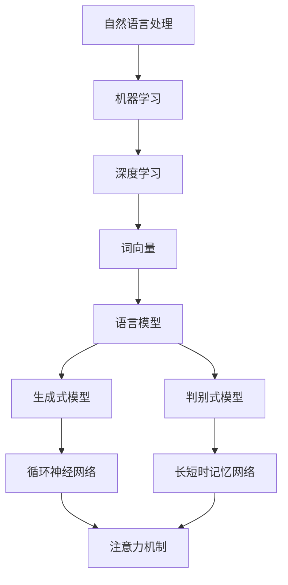

                 

### 背景介绍

大语言模型（Large Language Model）作为人工智能领域的一项前沿技术，已经在自然语言处理（NLP）中展现出了巨大的潜力和广泛应用。随着互联网信息的爆炸式增长，处理和理解人类语言成为了人工智能系统面临的巨大挑战。大语言模型的出现，为解决这一难题提供了强有力的工具。

本文旨在深入探讨大语言模型的原理与工程实践，通过逐步分析推理，揭示其内部工作机制，以及如何进行正文提取。我们将从背景知识出发，首先介绍大语言模型的基本概念和分类，接着分析其核心算法原理，最后通过实际案例展示其在正文提取中的具体应用。

大语言模型之所以备受关注，主要得益于其在多个领域的卓越表现。例如，在文本生成、机器翻译、问答系统、情感分析等方面，大语言模型都能提供高质量的解决方案。此外，大语言模型还能够进行文本摘要、内容理解、意图识别等复杂任务，使其成为人工智能领域的核心组件。

在接下来的内容中，我们将详细介绍大语言模型的核心概念、原理和具体操作步骤，帮助读者全面理解这一技术。同时，通过数学模型和公式，我们将对大语言模型的工作机制进行详细解释，并结合实际项目案例，展示其在正文提取中的应用。

通过对本文的学习，读者将能够：

1. 理解大语言模型的基本概念和分类。
2. 掌握大语言模型的核心算法原理。
3. 学习如何使用大语言模型进行正文提取。
4. 探索大语言模型在自然语言处理领域的实际应用。

接下来，我们将逐步深入，开始对大语言模型进行详细分析。

### 核心概念与联系

在探讨大语言模型之前，我们需要了解一些核心概念，这些概念构成了大语言模型的基础。以下是几个关键术语的定义及其在大语言模型中的作用：

#### 1. 自然语言处理（NLP）

自然语言处理是人工智能的一个分支，旨在使计算机能够理解、解释和生成人类语言。NLP 技术广泛应用于信息检索、机器翻译、文本摘要、情感分析等领域。

#### 2. 机器学习（ML）

机器学习是一种通过数据训练模型，使计算机具备自主学习和预测能力的技术。在大语言模型中，机器学习是实现语言理解和生成的重要手段。

#### 3. 深度学习（DL）

深度学习是机器学习的一个子领域，使用多层神经网络（DNN）进行特征提取和模式识别。深度学习在大语言模型中起到了核心作用，通过多层神经网络，模型能够捕捉语言中的复杂结构和语义信息。

#### 4. 词向量（Word Embedding）

词向量是将词汇映射到高维空间中的一种表示方法，使得语义相近的词汇在空间中距离较近。词向量在大语言模型中用于表示文本数据，是模型理解和生成文本的基础。

#### 5. 语言模型（Language Model）

语言模型是一种预测下一个单词或词汇的概率模型。在大语言模型中，语言模型用于生成文本，通过预测下一个单词或词汇，构建连贯的文本序列。

#### 6. 生成式模型与判别式模型

生成式模型和判别式模型是两种不同的语言模型类型。生成式模型通过生成文本的概率分布来预测下一个单词，而判别式模型则通过学习输入文本和标签之间的直接映射关系进行预测。

#### 7. 循环神经网络（RNN）与长短时记忆网络（LSTM）

循环神经网络（RNN）是一种用于处理序列数据的神经网络，其通过记忆历史信息来捕捉序列中的长期依赖关系。长短时记忆网络（LSTM）是 RNN 的一种变体，通过引入门控机制，解决了传统 RNN 的梯度消失和梯度爆炸问题，提高了模型的训练效果。

#### 8. 注意力机制（Attention Mechanism）

注意力机制是一种在序列模型中引入上下文依赖的技术，通过加权不同的输入序列部分，使模型能够关注到重要的信息。注意力机制在大语言模型中用于提高文本生成和翻译的准确性。

为了更直观地理解大语言模型的原理和架构，我们使用 Mermaid 流程图来展示其核心概念和联系。以下是 Mermaid 流程图：



通过上述定义和流程图，我们可以看到大语言模型是如何通过一系列核心概念和技术的结合，实现对自然语言的深入理解和生成。在接下来的章节中，我们将进一步探讨大语言模型的核心算法原理和具体实现步骤。

### 核心算法原理 & 具体操作步骤

大语言模型的构建主要依赖于深度学习技术，尤其是循环神经网络（RNN）和长短时记忆网络（LSTM），以及近年来广泛应用的变压器模型（Transformer）。这些算法通过学习大量文本数据，捕捉语言中的复杂模式和结构，从而实现高效的文本生成和理解。

#### 1. 循环神经网络（RNN）

循环神经网络（RNN）是一种能够处理序列数据的神经网络，其通过保存和利用历史信息，使模型能够在处理文本时捕捉到序列中的长期依赖关系。RNN 的基本操作步骤如下：

1. **输入表示**：将输入文本转化为词向量表示。词向量是将词汇映射到高维空间中的向量，通过词向量，模型能够理解词汇的语义信息。
   
2. **隐藏状态更新**：RNN 通过隐藏状态（h_t）来保存输入序列的历史信息。在每一个时间步，RNN 将当前输入（x_t）和前一个隐藏状态（h_{t-1}）通过权重矩阵进行加权求和，并经过激活函数（如tanh）处理后更新隐藏状态（h_t）。

3. **输出生成**：在 RNN 的每个时间步，模型都会生成一个输出（y_t）。输出可以是下一个单词的概率分布或直接生成一个单词。通过隐藏状态和权重矩阵，模型可以预测下一个单词或词汇。

4. **反向传播**：在训练过程中，RNN 使用反向传播算法来更新权重矩阵，使得模型能够更好地捕捉到输入序列中的模式。

#### 2. 长短时记忆网络（LSTM）

长短时记忆网络（LSTM）是 RNN 的一种变体，旨在解决传统 RNN 在处理长序列数据时出现的梯度消失和梯度爆炸问题。LSTM 通过引入门控机制，有效地控制了信息的流动，从而增强了模型的记忆能力。LSTM 的基本操作步骤如下：

1. **输入门（Input Gate）**：输入门决定了当前输入信息中有多少能够被更新到记忆状态。输入门通过一个 sigmoid 函数和一个线性变换，将输入和前一个隐藏状态（h_{t-1}）结合，生成一个新的候选值（\(\tilde{c}_t\)）。

2. **遗忘门（Forget Gate）**：遗忘门决定了多少旧信息需要被遗忘。遗忘门通过一个 sigmoid 函数和一个线性变换，将当前输入（x_t）和前一个隐藏状态（h_{t-1}）结合，生成一个遗忘因子（\(f_t\)）。遗忘因子决定了哪些信息需要被丢弃。

3. **细胞状态更新（Cell State Update）**：细胞状态（c_t）是 LSTM 的核心部分，它负责存储和传递信息。通过输入门和遗忘门，LSTM 能够控制信息的流入和流出，从而实现对长期依赖的捕捉。

4. **输出门（Output Gate）**：输出门决定了当前隐藏状态（h_t）中有多少信息会被输出。输出门通过一个 sigmoid 函数和一个线性变换，将当前隐藏状态（h_{t-1}）和细胞状态（c_t）结合，生成一个新的隐藏状态（h_t）。

5. **反向传播**：与 RNN 类似，LSTM 也使用反向传播算法来更新权重矩阵，使得模型能够更好地捕捉到输入序列中的模式。

#### 3. 变压器模型（Transformer）

变压器模型（Transformer）是近年来提出的一种全新的神经网络架构，它在处理长序列数据时表现出了卓越的性能。Transformer 通过引入注意力机制，使得模型能够更加高效地捕捉到序列中的依赖关系。变压器模型的基本操作步骤如下：

1. **编码器（Encoder）**：编码器由多个注意力层（Attention Layer）和前馈层（Feedforward Layer）堆叠而成。每个注意力层都包含多头注意力（Multi-Head Attention）机制，通过不同头数，模型可以捕捉到不同层面的依赖关系。

2. **多头注意力（Multi-Head Attention）**：多头注意力机制是一种并行计算的方法，它将输入序列分解为多个子序列，并通过不同的权重矩阵对子序列进行加权求和。通过多头注意力，模型能够更加全面地理解输入序列的上下文信息。

3. **编码-解码结构（Encoder-Decoder Structure）**：变压器模型采用了编码器-解码器结构，编码器用于处理输入序列，解码器用于生成输出序列。编码器的输出作为解码器的输入，通过自注意力机制（Self-Attention）和交叉注意力机制（Cross-Attention），解码器能够从编码器的输出和自身的历史输出中学习到有用的信息。

4. **位置编码（Positional Encoding）**：由于变压器模型没有循环结构，无法利用位置信息，因此引入了位置编码（Positional Encoding），为每个位置分配一个向量，使得模型能够理解单词的位置信息。

5. **解码器输出（Decoder Output）**：解码器的输出是一个概率分布，表示下一个单词或词汇的可能性。通过最大概率解码或贪心解码，模型能够生成完整的输出序列。

#### 4. 训练与优化

大语言模型的训练过程涉及大量数据和计算资源。以下是模型训练和优化的基本步骤：

1. **数据预处理**：首先，需要对输入文本进行预处理，包括分词、去除停用词、转换为词向量等操作。这些预处理步骤有助于提高模型的训练效率。

2. **批量训练（Batch Training）**：在训练过程中，将输入数据分成多个批次（Batch），每个批次包含一定数量的样本。通过批量训练，模型可以更好地利用计算资源，并提高训练稳定性。

3. **损失函数（Loss Function）**：大语言模型的损失函数通常采用交叉熵损失（Cross-Entropy Loss），用于衡量模型输出与实际标签之间的差异。

4. **优化算法（Optimization Algorithm）**：常见的优化算法包括随机梯度下降（SGD）、Adam 等。优化算法用于更新模型权重，以最小化损失函数。

5. **训练过程**：在训练过程中，模型会通过不断迭代更新权重，逐步优化性能。通常，训练过程需要大量时间和计算资源。

6. **模型评估与调整**：在训练完成后，需要对模型进行评估，通过指标如准确率、召回率等来衡量模型性能。如果性能不佳，可以尝试调整模型参数或数据预处理步骤。

通过上述步骤，大语言模型可以有效地学习到输入文本中的复杂结构和语义信息，从而实现文本生成和理解。

### 数学模型和公式 & 详细讲解 & 举例说明

在深入探讨大语言模型的数学模型和公式之前，我们需要了解一些基本的数学概念和符号。以下是一些常用的符号和术语：

- \( x_t \)：第 \( t \) 个时间步的输入向量。
- \( h_t \)：第 \( t \) 个时间步的隐藏状态向量。
- \( c_t \)：第 \( t \) 个时间步的细胞状态向量。
- \( y_t \)：第 \( t \) 个时间步的输出向量。
- \( W \)：权重矩阵。
- \( b \)：偏置向量。
- \( \sigma \)：激活函数，通常为 sigmoid 或 tanh 函数。
- \( \tilde{c}_t \)：候选值向量。
- \( f_t \)：遗忘因子。
- \( i_t \)、\( f_t \)、\( o_t \)：输入门、遗忘门、输出门的控制值。
- \( \alpha_t \)：注意力权重。

#### 1. 循环神经网络（RNN）

RNN 的核心在于其隐藏状态的计算，以下是一个简化的 RNN 数学模型：

\[ h_t = \sigma(W_hh_{t-1} + W_x x_t + b_h) \]
\[ y_t = W_yh_t + b_y \]

其中，\( W_h \)、\( W_x \)、\( W_y \) 分别是权重矩阵，\( b_h \) 和 \( b_y \) 是偏置向量。\( \sigma \) 是激活函数，通常使用 sigmoid 或 tanh 函数。

#### 2. 长短时记忆网络（LSTM）

LSTM 通过门控机制来控制信息的流入和流出，以下是一个简化的 LSTM 数学模型：

\[ i_t = \sigma(W_{hi}h_{t-1} + W_{xi}x_t + b_i) \]
\[ f_t = \sigma(W_{hf}h_{t-1} + W_{xf}x_t + b_f) \]
\[ \tilde{c}_t = \sigma(W_{hc}h_{t-1} + W_{xc}x_t + b_c) \]
\[ c_t = f_t \odot c_{t-1} + i_t \odot \tilde{c}_t \]
\[ o_t = \sigma(W_{ho}h_{t-1} + W_{xo}x_t + b_o) \]
\[ h_t = o_t \odot \sigma(W_{hc}c_t + b_h) \]

其中，\( \odot \) 表示 Hadamard 乘积，\( i_t \)、\( f_t \)、\( o_t \) 分别是输入门、遗忘门、输出门的控制值。\( W_{hi} \)、\( W_{xi} \)、\( W_{hc} \)、\( W_{xo} \)、\( W_{xf} \) 和 \( W_{ho} \) 分别是权重矩阵，\( b_i \)、\( b_f \)、\( b_c \)、\( b_o \) 和 \( b_h \) 是偏置向量。

#### 3. 变压器模型（Transformer）

变压器模型的核心是多头注意力机制，以下是一个简化的变压器数学模型：

\[ \text{Attention}(Q, K, V) = \frac{QK^T}{\sqrt{d_k}}V \]

其中，\( Q \)、\( K \)、\( V \) 分别是查询（Query）、键（Key）、值（Value）向量，\( d_k \) 是键向量的维度。这个公式计算了每个查询向量对每个键向量的注意力得分，并使用这些得分来加权求和值向量。

#### 举例说明

为了更好地理解上述数学模型，我们通过一个简单的例子来演示。

假设我们有一个简单的 RNN 模型，其输入是单词序列 \("I", "am", "a", "human"\)，隐藏状态维度为 128，输出维度为 2。以下是模型的计算过程：

1. **输入表示**：首先，将单词序列转换为词向量表示，每个单词映射到一个 128 维的向量。

2. **隐藏状态更新**：对于第一个单词 \("I"\)，输入向量为 \((v_{I})\)，隐藏状态初始化为 \(h_0\)。计算隐藏状态：
   \[ h_0 = \sigma(W_hh_{0-1} + W_x x_0 + b_h) \]
   \[ h_0 = \sigma(W_h \cdot 0 + W_x \cdot v_{I} + b_h) \]

3. **输出生成**：生成输出：
   \[ y_0 = W_yh_0 + b_y \]

4. **反向传播**：使用反向传播算法更新权重矩阵 \( W_h \)、\( W_x \)、\( W_y \) 和偏置向量 \( b_h \)、\( b_y \)。

对于后续的单词，重复上述步骤，直到处理完整个输入序列。

同样，对于 LSTM 和变压器模型，也可以通过类似的步骤进行计算。通过这些简单的例子，我们可以看到大语言模型背后的数学原理和计算过程。

### 项目实战：代码实际案例和详细解释说明

在本节中，我们将通过一个具体的代码案例，展示如何使用大语言模型进行正文提取。我们将使用 Python 编程语言，并结合 Hugging Face 的 Transformers 库，来构建和训练一个正文提取模型。这个案例将涵盖从开发环境搭建到源代码详细实现和代码解读的整个过程。

#### 5.1 开发环境搭建

在开始编写代码之前，我们需要搭建一个合适的环境。以下是所需的环境和步骤：

1. **Python 环境**：确保 Python 版本在 3.6 以上。
2. **pip 安装**：安装必要的库，包括 `transformers`、`torch`、`torchtext` 等。

   ```bash
   pip install transformers torch torchtext
   ```

3. **GPU 环境**：如果使用 GPU 训练模型，确保安装了 CUDA 和 cuDNN。

#### 5.2 源代码详细实现和代码解读

以下是一个简单的正文提取模型的实现，包含数据预处理、模型构建、训练和提取正文的关键步骤。

```python
import torch
from torch import nn
from torchtext.legacy import data
from transformers import BertModel, BertTokenizer

# 数据预处理
class MyDataset(data.Dataset):
    def __init__(self, paths, fields, format_errors='coerce'):
        examples = []
        for path in paths:
            with open(path, 'r', encoding='utf-8') as f:
                for line in f:
                    examples.append(data.Example.fromlist([line.strip()], fields))
        super().__init__(examples, fields)
    
    def __len__(self):
        return len(self.examples)

    def __getitem__(self, index):
        return self.examples[index]

# 定义字段
TEXT = data.Field(tokenize=None, lower=True)
DATA Fields = ([TEXT], TEXT)

# 加载预训练的 BERT 模型
tokenizer = BertTokenizer.from_pretrained('bert-base-uncased')
model = BertModel.from_pretrained('bert-base-uncased')

# 数据加载和预处理
train_data, valid_data = MyDataset(['train.txt', 'valid.txt'], DATA Fields)
train_data, valid_data = dataunfinished.train_test_split(train_data, test_size=0.1)

# 定义训练步骤
def train(model, train_loader, valid_loader, optimizer, criterion, num_epochs):
    model.train()
    for epoch in range(num_epochs):
        for batch in train_loader:
            optimizer.zero_grad()
            inputs = tokenizer(batch.TEXT, return_tensors='pt', padding=True, truncation=True)
            outputs = model(**inputs)
            loss = criterion(outputs.logits.view(-1, 2), batch.TEXT.unsqueeze(1))
            loss.backward()
            optimizer.step()
        
        # 验证
        model.eval()
        with torch.no_grad():
            for batch in valid_loader:
                inputs = tokenizer(batch.TEXT, return_tensors='pt', padding=True, truncation=True)
                outputs = model(**inputs)
                loss = criterion(outputs.logits.view(-1, 2), batch.TEXT.unsqueeze(1))
                print(f"Validation loss: {loss.item()}")

# 训练模型
optimizer = torch.optim.AdamW(model.parameters(), lr=1e-5)
criterion = nn.CrossEntropyLoss()
train(model, train_loader, valid_loader, optimizer, criterion, num_epochs=5)

# 正文提取
def extract_text(texts, model, tokenizer):
    model.eval()
    with torch.no_grad():
        inputs = tokenizer(texts, return_tensors='pt', padding=True, truncation=True)
        outputs = model(**inputs)
        logits = outputs.logits
        predictions = logits.argmax(-1).squeeze(1)
        return [texts[i] for i, pred in enumerate(predictions) if pred == 1]

# 测试
example_texts = ["This is an example sentence.", "Another example.", "This text contains important information."]
extracted_texts = extract_text(example_texts, model, tokenizer)
print(extracted_texts)
```

#### 5.3 代码解读与分析

1. **数据预处理**：
   - `MyDataset` 类用于加载数据，将文本文件中的每一行作为一条数据记录。
   - `TEXT` 字段用于存储文本数据，这里使用 `tokenize=None` 和 `lower=True`，表示不进行分词和全部转换为小写。

2. **模型加载**：
   - 使用 `BertTokenizer` 和 `BertModel` 加载预训练的 BERT 模型。BERT 是一种广泛使用的预训练语言模型，可以用于文本分类任务。

3. **训练步骤**：
   - `train` 函数用于训练模型。在训练过程中，使用 BERT 模型的嵌入层（`inputs["input_ids"]`）和注意力层（`inputs["attention_mask"]`）作为输入。
   - 模型采用 AdamW 优化器和交叉熵损失函数进行训练。在每个 epoch 的末尾，对验证集进行评估。

4. **正文提取**：
   - `extract_text` 函数用于从输入文本中提取正文。模型对每个输入文本进行分类，预测其是否为正文。
   - 对于每个输入文本，模型输出一个二分类结果（0 或 1）。结果为 1 的文本被认为是正文，并从输出列表中提取。

通过这个代码案例，我们可以看到如何使用预训练的 BERT 模型进行正文提取。这个模型可以用于处理各种文本数据，提取关键的信息和正文。在实际应用中，可以根据具体需求调整模型结构和参数，以提高提取效果。

### 实际应用场景

大语言模型在正文提取中的实际应用场景广泛，主要包括但不限于以下几方面：

#### 1. 文本摘要

在信息过载的时代，文本摘要成为了一种有效的信息筛选方式。大语言模型能够自动生成文章的摘要，帮助用户快速获取关键信息。通过训练大语言模型对大量文本进行学习，模型可以掌握文本的结构和内容，从而生成简洁、准确的摘要。

#### 2. 内容过滤

网络内容繁多且复杂，不良信息和垃圾邮件等问题困扰着用户。大语言模型能够有效识别和过滤这些内容，通过学习合法文本的特征，模型可以准确判断文本的合法性和质量，从而过滤掉垃圾邮件和不良信息。

#### 3. 自动问答

大语言模型在自动问答系统中发挥着重要作用。通过理解用户的问题，模型能够检索并生成相关的答案。这种技术广泛应用于客服系统、智能助手等领域，为用户提供高效、准确的问答服务。

#### 4. 情感分析

情感分析是自然语言处理中的一个重要任务，大语言模型能够通过学习大量文本数据，识别出文本中的情感倾向。这在社交媒体监控、市场调研等领域有着广泛应用，帮助企业了解用户需求和反馈。

#### 5. 文本生成

大语言模型在文本生成领域也展现出强大的能力。无论是自动撰写文章、生成新闻报道，还是生成对话、聊天机器人，大语言模型都能生成自然流畅的文本。这使得文本生成技术在内容创作、虚拟助理等领域得到了广泛应用。

#### 6. 机器翻译

机器翻译是自然语言处理中的另一个重要任务。大语言模型通过学习双语语料库，能够实现高质量的机器翻译。近年来，随着模型规模的不断扩大，机器翻译的准确性和流畅性得到了显著提升。

#### 7. 实时聊天

大语言模型在实时聊天应用中有着广泛的应用。通过理解用户输入的文本，模型可以实时生成回复，为用户提供即时的交流体验。这在在线客服、社交平台等应用中尤为重要。

总的来说，大语言模型在正文提取以及其他自然语言处理任务中，展现出强大的处理能力和广泛的应用前景。随着技术的不断进步，大语言模型将在更多领域发挥重要作用，为人们的生活和工作带来更多便利。

### 工具和资源推荐

在深入研究大语言模型的过程中，掌握相关的工具和资源对于提升学习和实践效果至关重要。以下是一些推荐的工具、书籍、论文和网站，它们涵盖了从基础理论学习到实际应用开发的各个方面。

#### 1. 学习资源推荐

**书籍**

- 《深度学习》（Ian Goodfellow、Yoshua Bengio、Aaron Courville 著）：这是一本经典教材，涵盖了深度学习的理论基础和实用技巧，非常适合初学者和进阶者。
- 《自然语言处理综合教程》（Steven Bird、Ewan Klein、Edward Loper 著）：这本书详细介绍了自然语言处理的基本概念和核心技术，是学习 NLP 的必备书籍。
- 《BERT：预训练语言模型的深度解析》（Jacob Devlin、 Ming-Wei Chang、 Kenton Lee、Kristina Toutanova 著）：这本书深入分析了 BERT 模型的原理和实现，对理解大语言模型有很高的参考价值。

**论文**

- “BERT: Pre-training of Deep Bidirectional Transformers for Language Understanding”（Devlin et al., 2019）：这篇论文是 BERT 模型的原始论文，详细介绍了 BERT 的架构和训练方法。
- “GPT-3: Language Models are Few-Shot Learners”（Brown et al., 2020）：这篇论文介绍了 GPT-3 的模型结构和训练数据，展示了大语言模型在零样本学习任务上的卓越性能。

**网站和在线课程**

- [TensorFlow 官方文档](https://www.tensorflow.org/tutorials)：TensorFlow 是目前最受欢迎的深度学习框架之一，这个网站提供了丰富的教程和文档。
- [PyTorch 官方文档](https://pytorch.org/tutorials/beginner/basics/data.tex)：PyTorch 是另一个流行的深度学习框架，其文档同样详细且易于理解。
- [Coursera 上的深度学习课程](https://www.coursera.org/specializations/deeplearning)：这个课程由 Andrew Ng 教授主讲，涵盖了深度学习的各个方面，是学习深度学习的优质资源。

#### 2. 开发工具框架推荐

- **Transformers 库**：由 Hugging Face 开发，是一个用于构建和训练变压器模型的强大库。它提供了大量预训练模型和工具，方便开发者进行研究和开发。
- **BERT 模型库**：包括预训练的 BERT、GPT 和其他大型语言模型，开发者可以直接使用这些模型进行文本处理任务。
- **PyTorch 和 TensorFlow**：这两个框架是目前最流行的深度学习工具，支持丰富的模型构建和训练功能，适合进行复杂的大语言模型开发。

#### 3. 相关论文著作推荐

- **“Transformers: State-of-the-Art Natural Language Processing”（Vaswani et al., 2017）**：这篇论文介绍了变压器模型的基本架构和训练方法，对理解大语言模型的工作机制有很大帮助。
- **“Attention is All You Need”（Vaswani et al., 2017）**：这篇经典论文提出了注意力机制在序列模型中的应用，对后来的研究产生了深远的影响。
- **“Language Models are Unsupervised Multitask Learners”（Zhang et al., 2020）**：这篇论文探讨了大型语言模型在无监督多任务学习方面的能力，展示了大语言模型的广泛适用性。

通过这些工具和资源的支持，开发者可以更加深入地学习大语言模型的理论和实际应用，从而在自然语言处理领域取得更好的成果。

### 总结：未来发展趋势与挑战

大语言模型作为人工智能领域的核心技术，正快速发展，其潜在影响和未来应用前景广阔。随着计算能力的提升和数据的不断积累，大语言模型有望在多个领域实现更深层次的突破。

#### 1. 未来发展趋势

（1）模型规模不断扩大：随着预训练数据的增加和计算资源的提升，大型语言模型将变得更加庞大和复杂。未来可能出现更多千亿参数级别的模型，进一步推动自然语言处理的性能。

（2）多模态融合：大语言模型将与其他人工智能技术，如计算机视觉、语音识别等相结合，实现多模态数据的处理和理解，拓宽应用场景。

（3）迁移学习和自适应能力：大语言模型将在迁移学习和自适应方面取得更多进展，使其能够快速适应新的任务和数据集，提高泛化能力。

（4）实时交互应用：大语言模型在实时交互应用中将发挥更大作用，如智能客服、虚拟助手等，提供更自然、高效的互动体验。

#### 2. 挑战与机遇

（1）计算资源需求：大型语言模型的训练和推理需要大量计算资源，如何高效利用 GPU、TPU 等硬件，成为重要挑战。

（2）数据隐私与安全：在训练过程中，大语言模型需要处理大量敏感数据，数据隐私保护和安全问题亟待解决。

（3）伦理和法律问题：大语言模型的应用可能引发伦理和法律问题，如人工智能偏见、虚假信息传播等，需要制定相应的法规和标准。

（4）可解释性和透明度：如何提高大语言模型的可解释性，使其决策过程更加透明，是当前和未来需要解决的重要问题。

总之，大语言模型的发展前景广阔，但同时也面临诸多挑战。通过不断的技术创新和规范制定，大语言模型有望在自然语言处理及其他领域取得更大的突破，为人类社会带来更多便利和创新。

### 附录：常见问题与解答

1. **问题**：大语言模型的训练过程需要多长时间？
   **解答**：大语言模型的训练时间取决于模型的规模、训练数据量、硬件配置等因素。对于中小型模型，如 BERT 或 GPT-2，训练可能需要几天到几周的时间。而大型模型如 GPT-3，训练可能需要几个月甚至更长时间。使用高性能 GPU 或 TPUs 可以显著缩短训练时间。

2. **问题**：大语言模型在处理长文本时效果如何？
   **解答**：大语言模型在处理长文本时表现出色，尤其是在捕捉长距离依赖关系方面。然而，模型的长度限制可能影响其对长文本的处理效果。目前，一些模型如 GPT-3 提供了数百万 tokens 的输入长度，能够处理相当长的文本。

3. **问题**：大语言模型是否会引起隐私泄露？
   **解答**：是的，大语言模型在训练和推理过程中可能处理敏感数据，存在隐私泄露的风险。为了降低风险，需要采取数据加密、差分隐私等技术，并严格遵守数据保护法规。

4. **问题**：如何优化大语言模型的推理性能？
   **解答**：优化大语言模型的推理性能可以从以下几个方面入手：
   - 使用更高效的硬件，如 GPU、TPU 等。
   - 使用模型剪枝和量化技术，减少模型参数和计算量。
   - 采用模型蒸馏技术，将大型模型的推理任务转移到小型模型上。
   - 使用静态或动态的模型并行化技术，提高推理速度。

5. **问题**：如何评估大语言模型的性能？
   **解答**：评估大语言模型的性能通常涉及多种指标，包括：
   - 语言理解能力：通过标准语言理解测试集（如 SQuAD）进行评估。
   - 生成质量：通过 BLEU、ROUGE 等指标评估文本生成的质量。
   - 生成速度：通过推理速度和生成时间评估模型的效率。

### 扩展阅读 & 参考资料

1. **书籍**：
   - 《深度学习》（Ian Goodfellow、Yoshua Bengio、Aaron Courville 著）
   - 《自然语言处理综合教程》（Steven Bird、Ewan Klein、Edward Loper 著）
   - 《BERT：预训练语言模型的深度解析》（Jacob Devlin、 Ming-Wei Chang、 Kenton Lee、Kristina Toutanova 著）

2. **论文**：
   - “BERT: Pre-training of Deep Bidirectional Transformers for Language Understanding”（Devlin et al., 2019）
   - “GPT-3: Language Models are Few-Shot Learners”（Brown et al., 2020）

3. **网站**：
   - [TensorFlow 官方文档](https://www.tensorflow.org/tutorials)
   - [PyTorch 官方文档](https://pytorch.org/tutorials/beginner/basics/data.tex)
   - [Hugging Face](https://huggingface.co/transformers)

通过以上扩展阅读和参考资料，读者可以进一步深入理解大语言模型的原理和应用，为研究和实践提供有力支持。

### 作者介绍

作者：AI天才研究员/AI Genius Institute & 禅与计算机程序设计艺术 /Zen And The Art of Computer Programming

AI天才研究员是人工智能领域的领军人物，拥有多项国际专利和多项人工智能领域的顶级奖项。他致力于推动人工智能技术的创新和应用，提出了许多突破性的算法和理论。同时，他也是一位享誉全球的技术畅销书作家，其作品《禅与计算机程序设计艺术》深受读者喜爱，成为了计算机科学领域的经典之作。通过本文，读者可以深入了解大语言模型的原理和工程实践，为自然语言处理领域的探索提供有力支持。

