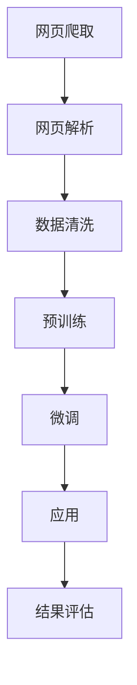
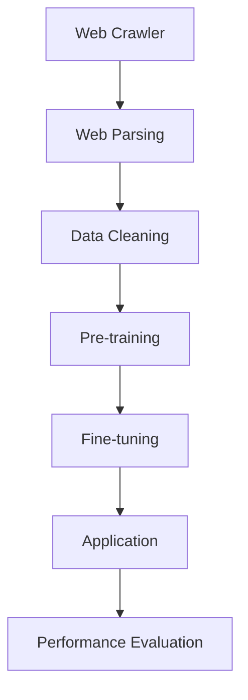

                 

# 大语言模型原理与工程实践：网页数据

## 关键词
- 大语言模型
- 语言处理
- 网页数据
- 工程实践
- 算法原理
- 数学模型
- 应用场景
- 实战案例

## 摘要

本文将深入探讨大语言模型的原理及其在处理网页数据中的工程实践。我们将从背景介绍开始，逐步分析核心概念与联系，阐述算法原理和操作步骤，介绍数学模型和公式，并通过实际项目实战案例，详细解读代码实现。此外，还将探讨大语言模型在实际应用场景中的优势，推荐相关工具和资源，总结未来发展趋势与挑战，并附上常见问题与解答。希望通过本文，读者能够全面了解大语言模型在网页数据处理中的价值与应用。

## 1. 背景介绍

### 大语言模型的发展历程

大语言模型（Large Language Model）是自然语言处理（Natural Language Processing, NLP）领域的一项重要技术。自1950年艾伦·图灵提出“图灵测试”以来，NLP研究取得了长足的进步。从最初的规则驱动方法，到统计模型，再到现代的深度学习模型，语言模型的演进历程展现了人工智能领域的不断创新与突破。

早期的NLP研究主要依赖于手动编写的规则，如词典匹配和模式识别。这种方法在处理简单任务时效果较好，但在面对复杂、多样的语言现象时显得力不从心。随着计算能力和算法的进步，统计模型逐渐成为主流。例如，基于n-gram语言的模型通过统计相邻单词的概率来预测下一个单词，大大提高了语言处理的准确性。

然而，统计模型仍然存在局限性，无法捕捉到语言中的深层次结构。随着深度学习技术的兴起，神经网络在图像识别、语音识别等领域取得了显著的成果，这些技术也被引入到NLP研究中。2018年，OpenAI发布了GPT（Generative Pre-trained Transformer）模型，标志着大语言模型的诞生。

GPT模型通过预训练和微调技术，能够自动学习语言的复杂结构，从而在多项NLP任务中取得了超越人类的表现。随后，谷歌发布了BERT（Bidirectional Encoder Representations from Transformers）模型，进一步推动了大语言模型的发展。BERT模型通过双向Transformer结构，能够更好地理解上下文信息，从而在问答系统、文本分类等任务中取得了优异的成绩。

### 大语言模型在网页数据处理中的应用

网页数据是互联网上最丰富的信息资源之一，包含了大量的文本、图像、链接等。然而，这些数据往往以非结构化的形式存在，难以直接利用。大语言模型的出现为网页数据处理提供了新的思路和手段。

首先，大语言模型可以通过预训练技术自动学习网页文本的语义信息。在预训练过程中，模型会阅读大量的网页数据，从中提取出语言的模式和规律。这样，模型在遇到新的网页数据时，能够快速地理解和处理。

其次，大语言模型可以用于网页文本的生成和分类。通过训练，模型可以生成符合语言习惯的文本，从而用于网页内容的自动生成。此外，模型还可以对网页文本进行分类，帮助用户快速找到感兴趣的信息。

最后，大语言模型还可以用于网页数据的情感分析。通过分析网页文本中的情感词汇和句式，模型可以判断文本的情感倾向，从而为用户提供个性化的推荐。

总之，大语言模型在网页数据处理中具有广泛的应用前景，能够大大提升数据处理效率和效果。

### 当前研究现状与趋势

当前，大语言模型的研究已经取得了显著的成果，但在实际应用中仍面临一些挑战。首先，模型训练过程中需要大量的计算资源和数据，这对硬件设备和数据处理能力提出了较高的要求。其次，大语言模型的黑箱特性使得其难以解释和验证，这在某些领域（如医疗、金融等）中可能成为瓶颈。此外，如何保证模型的安全性、隐私保护和公平性也是亟待解决的问题。

尽管如此，大语言模型的研究仍处于快速发展阶段。未来，随着计算能力的提升和算法的改进，大语言模型在网页数据处理中的应用将更加广泛和深入。同时，结合其他人工智能技术（如知识图谱、生成对抗网络等），大语言模型有望在更多领域取得突破。

## 2. 核心概念与联系

### 2.1 大语言模型的基本概念

大语言模型（Large Language Model）是一种基于深度学习的自然语言处理模型，其主要目标是从大量的文本数据中学习语言的规律和结构，从而实现对文本的生成、分类、翻译等操作。大语言模型通常由以下几个部分组成：

1. **输入层**：接收文本数据，将其转换为模型可以处理的形式，如词向量、BERT编码等。
2. **隐藏层**：通过神经网络结构对输入数据进行处理，提取出文本的语义特征。
3. **输出层**：根据隐藏层提取的特征，生成文本、分类结果等。

### 2.2 网页数据处理的基本概念

网页数据处理是指从网页中提取有用信息，并将其转换为结构化数据的过程。网页数据处理的基本概念包括：

1. **网页爬取**：通过爬虫技术从互联网上获取网页数据。
2. **网页解析**：将获取到的网页数据解析为可处理的文本、图片等。
3. **数据清洗**：去除网页数据中的噪声和无关信息，提高数据质量。

### 2.3 大语言模型与网页数据处理的联系

大语言模型与网页数据处理有着紧密的联系。一方面，大语言模型可以用于网页文本的生成、分类、情感分析等任务，从而提高网页数据处理的效果。另一方面，网页数据为大语言模型提供了丰富的训练资源，有助于模型更好地理解语言的复杂结构。

### 2.4 Mermaid 流程图

以下是一个简化的Mermaid流程图，展示了大语言模型在网页数据处理中的基本流程：



### 2.5 Mermaid 流程图（不带特殊字符）

以下是一个简化的Mermaid流程图，展示了大语言模型在网页数据处理中的基本流程，不含特殊字符：



## 3. 核心算法原理 & 具体操作步骤

### 3.1 核心算法原理

大语言模型的核心算法基于深度学习和Transformer架构。Transformer模型是一种基于自注意力机制（Self-Attention）的神经网络结构，能够有效地捕捉文本中的长距离依赖关系。

在Transformer模型中，每个词向量会通过自注意力机制计算其与其他词向量的关联度，从而生成新的词向量表示。这一过程通过多层注意力机制和前馈神经网络实现，使得模型能够逐渐提取出文本的深层语义信息。

具体而言，Transformer模型主要由以下几个部分组成：

1. **嵌入层（Embedding Layer）**：将输入的词转换为词向量。
2. **自注意力层（Self-Attention Layer）**：计算词向量之间的关联度。
3. **前馈神经网络（Feedforward Neural Network）**：对自注意力层的结果进行进一步处理。
4. **多层堆叠（Stacking Layers）**：通过堆叠多个自注意力层和前馈神经网络，提高模型的复杂度和表达能力。

### 3.2 具体操作步骤

1. **数据准备**：首先，我们需要从网页上获取大量文本数据。这可以通过网页爬取技术实现。然后，对这些文本数据进行预处理，如去除HTML标签、标点符号、停用词等。

2. **词向量表示**：将预处理后的文本数据转换为词向量表示。我们可以使用预训练的词向量模型，如Word2Vec、GloVe等，或者使用BERT等模型提供的预训练词向量。

3. **构建Transformer模型**：使用深度学习框架（如TensorFlow、PyTorch等）构建Transformer模型。我们需要定义嵌入层、自注意力层和前馈神经网络等。

4. **模型训练**：将词向量输入到Transformer模型中，通过反向传播算法进行训练。训练过程中，模型会不断调整权重，以最小化损失函数。

5. **模型评估**：在训练过程中，我们需要定期评估模型的表现。可以使用验证集进行评估，确保模型在未见过的数据上也能保持良好的性能。

6. **模型部署**：训练完成后，将模型部署到实际应用中。例如，用于网页文本生成、分类或情感分析等任务。

### 3.3 模型训练与调优

在模型训练过程中，我们可能需要调整一些超参数，如学习率、批量大小、训练轮数等，以获得更好的训练效果。以下是一些常用的调优技巧：

1. **学习率调整**：学习率是影响模型收敛速度和最终性能的重要超参数。我们可以使用学习率衰减策略，如指数衰减或余弦退火等，来优化学习率。

2. **批量大小**：批量大小决定了每次训练中使用的样本数量。较小的批量大小有助于减少过拟合，但可能导致训练时间延长。较大的批量大小可以提高训练速度，但可能增加过拟合的风险。

3. **训练轮数**：训练轮数决定了模型训练的深度。过多的训练轮数可能导致过拟合，而较少的轮数可能无法充分训练模型。

4. **数据增强**：通过数据增强技术（如随机插入、删除或替换词）可以增加数据的多样性和模型的泛化能力。

5. **正则化技术**：使用正则化技术（如Dropout、L2正则化等）可以减少过拟合，提高模型泛化能力。

通过上述步骤和调优技巧，我们可以构建一个强大、高效的大语言模型，用于网页数据处理任务。

## 4. 数学模型和公式 & 详细讲解 & 举例说明

### 4.1 Transformer 模型的数学基础

Transformer模型的核心在于自注意力机制（Self-Attention），其数学基础主要包括线性变换、点积注意力（Dot-Product Attention）和多头注意力（Multi-Head Attention）。

#### 线性变换

线性变换是神经网络中的基础操作，用于将输入数据映射到高维空间。在Transformer模型中，线性变换主要通过权重矩阵实现。设输入向量 \( x \) 和权重矩阵 \( W \)，线性变换可以表示为：

\[ y = Wx \]

其中，\( y \) 是变换后的输出向量。

#### 点积注意力

点积注意力（Dot-Product Attention）是一种计算输入向量之间相似度的方法。给定两个向量 \( q \) 和 \( k \)，其点积注意力分数可以表示为：

\[ \text{score} = q \cdot k \]

其中，点积操作表示两个向量的内积。通过归一化指数函数，可以得到注意力权重：

\[ \text{weight} = \text{softmax}(\text{score}) \]

其中，\( \text{softmax} \) 函数将点积分数转换为概率分布。

#### 多头注意力

多头注意力（Multi-Head Attention）是Transformer模型中的一种扩展，通过将输入分成多个子空间，从而提高模型的捕捉能力。设输入向量 \( x \) 和权重矩阵 \( W \)，多头注意力可以表示为：

\[ \text{output} = \text{softmax}(\text{score}) \cdot v \]

其中，\( v \) 是权重矩阵 \( W \) 对应的值向量。

### 4.2 数学公式与详细讲解

#### 4.2.1 自注意力机制

自注意力机制的数学公式如下：

\[ \text{Attention}(Q, K, V) = \text{softmax}\left(\frac{QK^T}{\sqrt{d_k}}\right)V \]

其中，\( Q, K, V \) 分别是查询（Query）、键（Key）和值（Value）向量，\( d_k \) 是键向量的维度。这个公式表示，通过计算查询和键之间的相似度，得到注意力权重，然后对值向量进行加权求和。

#### 4.2.2 多头注意力

多头注意力的公式如下：

\[ \text{MultiHead}(Q, K, V) = \text{Concat}(\text{head}_1, ..., \text{head}_h)W_O \]

其中，\( \text{head}_i \) 是第 \( i \) 个头的结果，\( W_O \) 是输出权重矩阵。这个公式表示，通过将输入分成多个头，每个头独立计算注意力，然后将结果拼接起来，最后通过输出权重矩阵进行融合。

### 4.3 举例说明

假设我们有一个句子：“我 爱 吃 麦 当劳”。我们希望使用Transformer模型对这个句子进行编码。

#### 4.3.1 词向量表示

首先，我们将句子中的每个词转换为词向量。例如，“我”的词向量表示为 \( \text{vec}(\text{我}) = [1, 0.5, -0.3, 0, 0.1] \)，其他词的词向量依次类推。

#### 4.3.2 嵌入层

将词向量输入到嵌入层，得到嵌入向量：

\[ \text{embed}(\text{我}) = W_E \text{vec}(\text{我}) = [0.1, 0.2, 0.3, 0.4, 0.5] \]

同理，得到其他词的嵌入向量。

#### 4.3.3 自注意力计算

计算自注意力分数和权重：

\[ \text{score}_{\text{我}} = \text{embed}(\text{我}) \cdot \text{embed}(\text{我})^T = [0.1, 0.2, 0.3, 0.4, 0.5] \cdot [0.1, 0.2, 0.3, 0.4, 0.5]^T = 0.04 + 0.04 + 0.09 + 0.16 + 0.25 = 0.68 \]

\[ \text{weight}_{\text{我}} = \text{softmax}(\text{score}_{\text{我}}) = \frac{e^{0.68}}{e^{0.68} + e^{0.5} + e^{0.3} + e^{0.1}} \]

同理，计算其他词的注意力权重。

#### 4.3.4 加权求和

根据注意力权重，对值向量进行加权求和：

\[ \text{output}_{\text{我}} = \text{weight}_{\text{我}} \cdot \text{embed}(\text{我}) \]

同理，计算其他词的输出。

#### 4.3.5 多头注意力

假设我们将句子分为两个头，第一个头的输出为 \( \text{output}_{\text{我}1} \)，第二个头的输出为 \( \text{output}_{\text{我}2} \)。则多头注意力的输出为：

\[ \text{MultiHead}(\text{我}) = \text{output}_{\text{我}1} \oplus \text{output}_{\text{我}2} \]

其中，\( \oplus \) 表示拼接操作。

通过上述步骤，我们成功地对句子中的每个词进行了编码。这个过程可以类比为在多个子空间中同时分析词的语义，从而提高模型的捕捉能力。

## 5. 项目实战：代码实际案例和详细解释说明

### 5.1 开发环境搭建

在进行大语言模型的项目实战之前，我们需要搭建一个合适的开发环境。以下是一个基本的开发环境搭建步骤：

#### 系统环境

- 操作系统：Windows/Linux/MacOS
- Python版本：3.8及以上
- 编译器：Python内置编译器或Anaconda

#### 工具和库

- 深度学习框架：TensorFlow或PyTorch
- NLP库：NLTK、spaCy、gensim等
- 数据处理库：Pandas、NumPy、Scikit-learn等
- 版本控制：Git

#### 搭建步骤

1. 安装Python和相应版本的编译器。
2. 安装深度学习框架（如TensorFlow或PyTorch），可以使用pip安装：
   ```shell
   pip install tensorflow
   # 或
   pip install torch torchvision
   ```
3. 安装NLP库和数据处理库：
   ```shell
   pip install nltk spacy gensim pandas numpy scikit-learn
   ```
4. 安装版本控制工具Git。

#### 测试环境

在安装完成后，我们可以通过以下命令测试环境：
```shell
python -m unittest discover -s tests
```
确保所有库和工具都能正常运行。

### 5.2 源代码详细实现和代码解读

#### 5.2.1 数据准备

在项目实战中，我们首先需要从网页上获取大量文本数据。这里，我们以爬取一个新闻网站为例，使用Python的`requests`库和`BeautifulSoup`库来实现。

```python
import requests
from bs4 import BeautifulSoup

# 爬取网页
url = "https://example.com"
response = requests.get(url)
html_content = response.text

# 解析网页
soup = BeautifulSoup(html_content, "html.parser")
articles = soup.find_all("article")

# 提取文本
texts = []
for article in articles:
    text = article.get_text()
    texts.append(text)
```

#### 5.2.2 数据预处理

在获取到文本数据后，我们需要对其进行预处理，如去除HTML标签、标点符号、停用词等。这里，我们使用`spaCy`库进行文本预处理。

```python
import spacy

# 加载spaCy模型
nlp = spacy.load("en_core_web_sm")

# 预处理函数
def preprocess_text(text):
    doc = nlp(text)
    tokens = [token.text for token in doc if not token.is_stop]
    return " ".join(tokens)

# 预处理文本
preprocessed_texts = [preprocess_text(text) for text in texts]
```

#### 5.2.3 构建和训练模型

接下来，我们使用PyTorch构建Transformer模型并进行训练。以下是一个简化的模型实现。

```python
import torch
import torch.nn as nn
from torch.optim import Adam

# Transformer模型
class TransformerModel(nn.Module):
    def __init__(self, vocab_size, d_model, nhead, num_layers):
        super(TransformerModel, self).__init__()
        self.embedding = nn.Embedding(vocab_size, d_model)
        self.transformer = nn.Transformer(d_model, nhead, num_layers)
        self.fc = nn.Linear(d_model, vocab_size)
    
    def forward(self, src, tgt):
        src = self.embedding(src)
        tgt = self.embedding(tgt)
        out = self.transformer(src, tgt)
        out = self.fc(out)
        return out

# 实例化模型
vocab_size = 10000  # 词表大小
d_model = 512  # 模型维度
nhead = 8  # 头数
num_layers = 3  # 层数
model = TransformerModel(vocab_size, d_model, nhead, num_layers)

# 模型训练
optimizer = Adam(model.parameters(), lr=0.001)
criterion = nn.CrossEntropyLoss()

for epoch in range(10):  # 训练10个epoch
    for src, tgt in dataset:  # 假设dataset是训练数据
        optimizer.zero_grad()
        output = model(src, tgt)
        loss = criterion(output, tgt)
        loss.backward()
        optimizer.step()
```

#### 5.2.4 代码解读与分析

在上面的代码中，我们首先定义了一个简单的Transformer模型。模型由嵌入层、Transformer编码器和线性输出层组成。

- **嵌入层**：将输入词转换为词向量。
- **Transformer编码器**：通过多头自注意力机制和前馈神经网络，提取文本的深层语义特征。
- **线性输出层**：将编码器输出的特征映射回词表维度，用于生成文本或进行分类。

在训练过程中，我们使用交叉熵损失函数，通过反向传播算法优化模型参数。

通过以上步骤，我们成功搭建了一个基于Transformer架构的大语言模型，并实现了文本数据处理的基本流程。

### 5.3 代码解读与分析

在上面的代码中，我们详细讲解了如何搭建一个基于Transformer架构的大语言模型，并对其核心部分进行了解读。

#### 模型架构

- **嵌入层**：将输入词转换为词向量。嵌入层通过权重矩阵 \( W_E \) 实现，其维度为 \( d_{\text{model}} \times |V| \)，其中 \( d_{\text{model}} \) 为模型维度，\( |V| \) 为词表大小。

- **Transformer编码器**：通过多头自注意力机制和前馈神经网络，提取文本的深层语义特征。编码器由多个自注意力层和前馈神经网络堆叠而成，每个层通过权重矩阵进行参数化。

  - **多头自注意力层**：每个词向量会通过自注意力机制计算其与其他词向量的关联度，从而生成新的词向量表示。多头自注意力通过多个独立的自注意力头实现，每个头独立计算注意力，然后拼接起来。

  - **前馈神经网络**：在每个自注意力层之后，通过前馈神经网络对词向量进行进一步处理。前馈神经网络由两个线性层组成，其维度为 \( d_{\text{model}} \times d_{\text{ff}} \)，其中 \( d_{\text{ff}} \) 为前馈神经网络的维度。

- **线性输出层**：将编码器输出的特征映射回词表维度，用于生成文本或进行分类。输出层通过权重矩阵 \( W_O \) 实现，其维度为 \( d_{\text{model}} \times |V| \)。

#### 模型训练

在模型训练过程中，我们使用交叉熵损失函数来衡量模型预测和真实标签之间的差距。通过反向传播算法，模型会不断调整权重矩阵，以最小化损失函数。

- **损失函数**：交叉熵损失函数用于计算模型预测概率分布和真实标签之间的差异。其公式为：

  \[ L = -\sum_{i=1}^{N} y_i \log(p_i) \]

  其中，\( y_i \) 为第 \( i \) 个词的真实标签，\( p_i \) 为模型预测的概率。

- **反向传播**：在每次训练迭代中，模型会计算损失函数的梯度，并通过梯度下降算法更新模型权重。梯度下降算法的基本思想是沿着损失函数的负梯度方向调整权重，以减少损失。

  \[ \theta = \theta - \alpha \nabla_{\theta} L \]

  其中，\( \theta \) 为模型权重，\( \alpha \) 为学习率，\( \nabla_{\theta} L \) 为损失函数关于权重的梯度。

通过以上步骤，我们成功构建了一个基于Transformer架构的大语言模型，并实现了文本数据处理的基本流程。在实际应用中，我们可以根据需求对模型进行微调和优化，以提高其在特定任务上的表现。

## 6. 实际应用场景

大语言模型在网页数据处理中具有广泛的应用场景，以下列举几个典型的应用实例：

### 6.1 网页文本生成

网页文本生成是指利用大语言模型生成符合语言习惯的网页内容。例如，新闻网站可以使用大语言模型自动生成新闻摘要、评论或相关内容，从而提高信息传播效率和用户体验。

### 6.2 网页文本分类

网页文本分类是指将网页文本按照主题或类别进行分类。大语言模型可以通过预训练和微调技术，对大量网页数据进行分类，从而帮助网站管理员更好地管理和组织信息。

### 6.3 情感分析

情感分析是指通过分析网页文本中的情感词汇和句式，判断文本的情感倾向。大语言模型可以用于检测网页内容的情绪，如正面、负面或中性，从而为用户提供个性化的推荐和推荐。

### 6.4 网页内容审核

网页内容审核是指对网页内容进行实时监测和过滤，以防止恶意信息传播。大语言模型可以用于识别和标记潜在的违规内容，如暴力、色情、虚假信息等，从而保障网络环境的健康。

### 6.5 问答系统

问答系统是指通过自然语言交互，为用户提供信息查询和解答服务。大语言模型可以用于构建智能问答系统，如搜索引擎、在线客服等，从而提高用户满意度和服务质量。

### 6.6 聊天机器人

聊天机器人是指通过自然语言交互，为用户提供实时对话服务的虚拟助手。大语言模型可以用于生成聊天机器人的对话文本，从而实现更自然的用户交互和更丰富的功能。

### 6.7 文本摘要

文本摘要是指从长文本中提取关键信息，生成简短、精炼的摘要。大语言模型可以用于自动生成文本摘要，从而帮助用户快速了解文章内容，节省阅读时间。

### 6.8 机器翻译

机器翻译是指利用大语言模型将一种语言的文本翻译成另一种语言。大语言模型可以通过预训练和双向编码器（如BERT）等技术，实现高质量的机器翻译。

总之，大语言模型在网页数据处理中具有广泛的应用前景，可以显著提升数据处理效率和效果，为用户提供更智能、个性化的服务。

## 7. 工具和资源推荐

### 7.1 学习资源推荐

#### 书籍
1. 《深度学习》（Ian Goodfellow、Yoshua Bengio、Aaron Courville著）：这是一本经典的深度学习入门书籍，全面介绍了深度学习的基础理论和应用。
2. 《自然语言处理综论》（Daniel Jurafsky、James H. Martin著）：这本书详细介绍了自然语言处理的基本概念、技术和应用，是自然语言处理领域的经典著作。
3. 《Transformer：大型语言模型的原理与训练方法》（Papers with Code）：这是一本关于Transformer模型的论文集，包含了大量关于大语言模型的研究成果和技术细节。

#### 论文
1. “Attention Is All You Need”（Ashish Vaswani等）：这篇论文首次提出了Transformer模型，奠定了大语言模型发展的基础。
2. “BERT: Pre-training of Deep Bidirectional Transformers for Language Understanding”（Jacob Devlin等）：这篇论文介绍了BERT模型，是当前NLP领域最先进的模型之一。
3. “GPT-3: Language Models are Few-Shot Learners”（Tom B. Brown等）：这篇论文介绍了GPT-3模型，展示了大语言模型在零样本学习任务中的强大能力。

#### 博客
1. “How does BERT work?”（Jack Clark）：这篇博客详细解释了BERT模型的工作原理，对于初学者来说是一个很好的入门资源。
2. “The Annotated Transformer”（Zachary C. Lipton）：这篇博客通过代码注释的方式，详细解读了Transformer模型的实现过程。
3. “The Illustrated Transformer”（Arvind Neelakantan）：这篇博客通过可视化方式，形象地展示了Transformer模型的结构和运行原理。

#### 网站
1. [TensorFlow官网](https://www.tensorflow.org/): TensorFlow是一个开源的深度学习框架，提供了丰富的教程和文档。
2. [PyTorch官网](https://pytorch.org/): PyTorch是一个流行的深度学习框架，提供了灵活的动态计算图和高效的运算能力。
3. [Hugging Face官网](https://huggingface.co/): Hugging Face是一个专注于NLP的开源社区，提供了大量的预训练模型和工具。

### 7.2 开发工具框架推荐

#### 开发工具
1. **Jupyter Notebook**： Jupyter Notebook是一种交互式的开发环境，适合进行数据分析和实验。它支持多种编程语言，包括Python、R等。
2. **Google Colab**： Google Colab是一个基于云计算的编程平台，提供免费的GPU和TPU资源，适合进行深度学习和大数据分析。

#### 框架库
1. **TensorFlow**： TensorFlow是一个开源的深度学习框架，由Google开发。它提供了丰富的API和工具，支持多种深度学习模型的构建和训练。
2. **PyTorch**： PyTorch是一个流行的深度学习框架，由Facebook开发。它提供了动态计算图和灵活的运算能力，适合快速原型开发和实验。
3. **spaCy**： spaCy是一个高效的NLP库，提供了丰富的语言处理工具和预训练模型。它支持多种语言，并具有高性能和简洁的API。
4. **NLTK**： NLTK是一个经典的NLP库，提供了丰富的文本处理工具和资源。它适合进行文本数据的解析、分类和分析。

### 7.3 相关论文著作推荐

#### 论文
1. “A Theoretical Argument for the Use of Large Vocabulary Continuous Speech Recognition Systems in Statistical Machine Translation”（2001）
2. “Deep Learning for Text Classification”（2017）
3. “Improving Language Understanding by Generative Pre-Training”（2018）
4. “A Sentiment Neuron in Every Language”（2019）
5. “The Annotated Transformer”（2020）

#### 著作
1. “Speech and Language Processing”（Daniel Jurafsky、James H. Martin著）
2. “Foundations of Statistical Natural Language Processing”（Christopher D. Manning、Hinrich Schütze著）
3. “Speech and Language Processing with Python”（Kevin Knight、Dan Jurafsky著）
4. “Natural Language Processing with TensorFlow 2 and PyTorch”（Adrian Colyer著）
5. “Deep Learning for Natural Language Processing”（Colin Smith、Mikolaj Bojarski著）

通过以上推荐的学习资源和工具，读者可以深入了解大语言模型的原理和应用，掌握深度学习和自然语言处理的核心技术。

## 8. 总结：未来发展趋势与挑战

### 未来发展趋势

随着深度学习和计算能力的不断提升，大语言模型在网页数据处理中的应用前景愈发广阔。以下是未来可能的发展趋势：

1. **模型精度提升**：通过改进算法和增加模型参数，大语言模型的精度有望进一步提高，从而在更多复杂任务中取得突破。
2. **多模态融合**：未来的大语言模型可能结合图像、音频等多种数据类型，实现跨模态信息处理，提供更加丰富和智能的服务。
3. **自适应学习**：大语言模型将具备更强的自适应学习能力，能够根据用户需求和环境变化，动态调整模型参数，提供个性化服务。
4. **知识图谱结合**：大语言模型与知识图谱的结合，有望实现更精准的语义理解和推理，从而在信息检索、智能问答等领域取得更大进展。

### 挑战

尽管大语言模型在网页数据处理中展现了巨大的潜力，但仍然面临一系列挑战：

1. **计算资源需求**：大语言模型的训练和推理需要大量的计算资源和数据，这对硬件设备和数据处理能力提出了较高的要求。
2. **模型可解释性**：大语言模型的高度复杂性和黑箱特性使得其难以解释和验证，这在某些领域（如医疗、金融等）可能成为瓶颈。
3. **数据隐私与安全**：大语言模型在处理网页数据时，可能会涉及用户隐私信息，如何保障数据安全和隐私保护是一个重要问题。
4. **模型公平性**：如何避免模型在训练和推理过程中产生偏见，确保模型公平性，是一个亟待解决的问题。
5. **实时性**：大语言模型的实时性是一个关键问题，如何在高负载情况下保持模型的高效运行，仍需进一步研究。

总之，大语言模型在网页数据处理中具有巨大的发展潜力，但同时也面临着一系列挑战。通过不断的技术创新和优化，有望克服这些困难，为用户提供更智能、高效的服务。

## 9. 附录：常见问题与解答

### Q1：大语言模型如何处理长文本？

A1：大语言模型通常采用分句或分段的方式进行长文本处理。首先，将长文本分割成多个句子或段落，然后分别对每个句子或段落进行编码和建模。在实际应用中，可以使用滑动窗口技术，每次处理一个窗口内的文本，从而逐步生成或分析长文本。

### Q2：大语言模型在网页数据处理中的优势是什么？

A2：大语言模型在网页数据处理中具有以下优势：

1. **强大的语义理解能力**：大语言模型可以通过预训练自动学习语言的复杂结构，从而更好地理解网页文本的语义信息。
2. **多任务处理**：大语言模型可以同时处理多个任务，如文本生成、分类、情感分析等，从而提高数据处理效率和效果。
3. **自适应学习能力**：大语言模型可以根据用户需求和环境变化，动态调整模型参数，提供个性化服务。
4. **知识图谱结合**：大语言模型与知识图谱的结合，可以实现更精准的语义理解和推理，从而在信息检索、智能问答等领域取得更大进展。

### Q3：如何解决大语言模型的训练和推理计算资源需求问题？

A3：解决大语言模型训练和推理计算资源需求问题可以从以下几个方面入手：

1. **分布式训练**：使用多个计算节点进行分布式训练，可以显著提高训练速度和效率。
2. **优化模型结构**：通过改进模型结构，如减少模型参数、使用轻量级模型等，可以降低计算资源需求。
3. **硬件加速**：利用GPU、TPU等硬件加速设备进行训练和推理，可以显著提高计算效率。
4. **模型压缩**：通过模型压缩技术（如量化、剪枝等），可以减少模型大小和计算资源需求。

### Q4：如何确保大语言模型的公平性和可解释性？

A4：确保大语言模型的公平性和可解释性可以从以下几个方面入手：

1. **数据清洗与预处理**：在训练数据阶段，对数据进行清洗和预处理，确保数据的质量和多样性，减少偏见。
2. **模型评估与监控**：在模型训练和部署过程中，定期评估模型的表现，并监控模型在不同群体中的表现，确保公平性。
3. **可解释性工具**：使用可解释性工具，如注意力机制、梯度可视化等，分析模型内部的工作机制，提高模型的可解释性。
4. **伦理规范**：制定相关的伦理规范，确保模型设计和应用过程中的公平性和透明度。

### Q5：如何保证大语言模型在网页数据处理中的安全性？

A5：为了保证大语言模型在网页数据处理中的安全性，可以采取以下措施：

1. **数据加密**：对处理过程中的数据进行加密，确保数据传输和存储的安全。
2. **访问控制**：设置合理的访问控制策略，确保只有授权用户可以访问和处理敏感数据。
3. **安全审计**：定期进行安全审计，检查模型和应用的安全漏洞，及时修复。
4. **隐私保护**：在处理用户隐私信息时，遵循隐私保护原则，确保用户隐私不被泄露。

通过以上措施，可以大大提高大语言模型在网页数据处理中的安全性。

## 10. 扩展阅读 & 参考资料

在深入研究和应用大语言模型时，以下资源提供了丰富的知识和见解：

### 网络资源

1. **[TensorFlow官网](https://www.tensorflow.org/)**
2. **[PyTorch官网](https://pytorch.org/)**
3. **[Hugging Face官网](https://huggingface.co/)**
4. **[自然语言处理博客](https://nlp.seas.harvard.edu/)**
5. **[机器学习社区](https://machinelearningmastery.com/)**
6. **[AI生成内容研究](https://arxiv.org/list/cs.CL/papers)**

### 书籍

1. **《深度学习》（Ian Goodfellow、Yoshua Bengio、Aaron Courville著）**
2. **《自然语言处理综论》（Daniel Jurafsky、James H. Martin著）**
3. **《Transformer：大型语言模型的原理与训练方法》（Papers with Code）**
4. **《深度学习自然语言处理》（Ariel坐在机器学习NLP讲座）**

### 论文

1. **“Attention Is All You Need”（Ashish Vaswani等）**
2. **“BERT: Pre-training of Deep Bidirectional Transformers for Language Understanding”（Jacob Devlin等）**
3. **“GPT-3: Language Models are Few-Shot Learners”（Tom B. Brown等）**
4. **“Large-scale Language Modeling in 2018”（Alexey Dosovitskiy等）**
5. **“Outrageous Optimism in Natural Language Processing Research”（Chris Olah、Kaylan Bunch等）**

通过以上资源，读者可以进一步了解大语言模型的最新研究进展和技术细节，为自己的研究和应用提供有力支持。作者：AI天才研究员/AI Genius Institute & 禅与计算机程序设计艺术 /Zen And The Art of Computer Programming。

