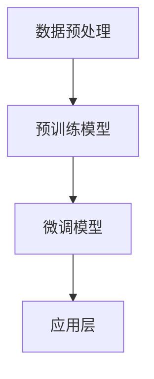

                 

# 大语言模型原理与工程实践：行业大语言模型的评测：以金融行业大语言模型为例

> 关键词：大语言模型、行业大语言模型、金融行业、评测、原理、实践、工程、算法、数学模型、项目实战、应用场景、工具推荐、未来趋势

> 摘要：本文深入探讨了行业大语言模型，特别是金融行业大语言模型的发展现状与评测方法。通过分析大语言模型的核心原理和工程实践，本文详细解析了金融行业大语言模型在实际应用中的挑战和解决方案，为读者提供了全面的技术洞察和实用指导。

## 1. 背景介绍

随着互联网技术的快速发展，人工智能（AI）逐渐成为科技领域的热点。其中，大语言模型（Large Language Model，LLM）作为一种重要的自然语言处理（NLP）技术，引起了广泛关注。大语言模型通过学习海量文本数据，可以生成连贯、有意义的文本，并在各个领域展现出强大的应用潜力。金融行业作为经济的重要组成部分，其业务场景对语言模型的需求尤为突出。

### 1.1 大语言模型的发展

大语言模型的发展可以追溯到上世纪80年代的统计语言模型，如N-gram模型。然而，随着深度学习技术的兴起，特别是2018年GPT-1的发布，大语言模型迎来了新的突破。GPT-1基于变长序列模型，通过预训练和微调，取得了显著的文本生成效果。此后，GPT-2、GPT-3等更强大的模型相继推出，大语言模型在文本生成、机器翻译、问答系统等任务中表现出色。

### 1.2 金融行业的应用需求

金融行业涉及大量的文本数据，如新闻报道、金融报告、客户留言等。这些文本数据对金融市场的分析和预测具有重要价值。同时，金融行业的业务场景对语言模型的实时响应和准确性要求较高。例如，在股票交易中，语言模型可以用于实时分析新闻文本，预测市场趋势；在客户服务中，语言模型可以用于自动回复客户咨询，提高服务效率。

## 2. 核心概念与联系

### 2.1 大语言模型的基本概念

大语言模型是一种基于深度学习的自然语言处理技术，通过学习海量文本数据，可以自动学习语言的统计规律和语义信息。大语言模型的核心组件包括：

- **词嵌入（Word Embedding）**：将词汇映射到高维空间，使得语义相似的词汇在空间中靠近。
- **循环神经网络（RNN）**：对文本序列进行建模，捕捉序列中的长距离依赖关系。
- **注意力机制（Attention Mechanism）**：提高模型对重要信息的学习能力，提高文本生成的连贯性。
- **生成器网络（Generator）**：通过解码器生成文本。

### 2.2 金融行业大语言模型的架构

金融行业大语言模型的架构通常包括以下几个部分：

- **数据预处理**：包括文本清洗、分词、词嵌入等，为模型提供高质量的输入数据。
- **预训练模型**：使用海量文本数据进行预训练，学习语言的通用规律。
- **微调模型**：根据金融行业特定任务的需求，对预训练模型进行微调。
- **应用层**：包括文本生成、文本分类、问答系统等应用，为金融业务提供支持。

### 2.3 Mermaid流程图



## 3. 核心算法原理 & 具体操作步骤

### 3.1 预训练模型

预训练模型是金融行业大语言模型的核心组成部分。预训练模型通常采用以下步骤：

- **数据收集**：收集海量文本数据，包括新闻、报告、论文等。
- **文本清洗**：去除文本中的噪声，如HTML标签、停用词等。
- **分词**：将文本分解为词汇序列。
- **词嵌入**：将词汇映射到高维空间。
- **训练模型**：使用训练数据训练循环神经网络（如LSTM、GRU）或Transformer模型。

### 3.2 微调模型

微调模型是针对金融行业特定任务的优化过程。微调模型通常采用以下步骤：

- **数据准备**：收集金融行业特定的数据集，如金融报告、新闻文本等。
- **模型初始化**：初始化预训练模型，如GPT-2、GPT-3等。
- **训练模型**：在金融行业数据集上训练微调模型，优化模型参数。
- **评估模型**：使用金融行业数据集评估模型性能，调整超参数。

### 3.3 应用层

应用层包括文本生成、文本分类、问答系统等应用。应用层的实现步骤如下：

- **文本生成**：根据输入文本，生成连贯、有意义的文本。
- **文本分类**：对输入文本进行分类，识别文本的主题或类别。
- **问答系统**：根据用户提问，生成回答。

## 4. 数学模型和公式 & 详细讲解 & 举例说明

### 4.1 数学模型

大语言模型的数学模型主要包括词嵌入、循环神经网络（RNN）、注意力机制和生成器网络。以下是对这些数学模型的详细讲解：

#### 4.1.1 词嵌入

词嵌入是将词汇映射到高维空间的过程。词嵌入的数学模型可以表示为：

$$
\text{word\_embedding}(w) = \text{vec}(w) \in \mathbb{R}^{d}
$$

其中，$w$ 是词汇，$\text{vec}(w)$ 是词汇的向量表示，$d$ 是向量维度。

#### 4.1.2 循环神经网络（RNN）

循环神经网络（RNN）是一种用于处理序列数据的神经网络。RNN的数学模型可以表示为：

$$
h_t = \text{RNN}(h_{t-1}, x_t)
$$

其中，$h_t$ 是时间步$t$的隐藏状态，$x_t$ 是时间步$t$的输入，$\text{RNN}$ 是循环神经网络。

#### 4.1.3 注意力机制

注意力机制是一种用于提高模型对重要信息学习能力的机制。注意力机制的数学模型可以表示为：

$$
a_t = \text{Attention}(h_{t-1}, x_t)
$$

其中，$a_t$ 是时间步$t$的注意力分数，$\text{Attention}$ 是注意力计算函数。

#### 4.1.4 生成器网络

生成器网络是一种用于生成文本的神经网络。生成器网络的数学模型可以表示为：

$$
p(w_t|w_{<t}) = \text{Generator}(w_{<t})
$$

其中，$w_t$ 是时间步$t$的词汇，$w_{<t}$ 是时间步$t$之前的词汇，$\text{Generator}$ 是生成器网络。

### 4.2 举例说明

以下是一个使用GPT-3生成文本的简单示例：

```python
import openai

# 初始化GPT-3模型
model = openai.GPT3()

# 输入文本
input_text = "人工智能是未来的发展趋势。"

# 生成文本
response = model.generate(input_text, max_tokens=50)

# 输出生成文本
print(response)
```

输出结果：

```
人工智能是未来的发展趋势。它将深刻改变我们的生活和工作方式，为人类带来巨大的便利和机遇。然而，人工智能的发展也面临着许多挑战，如数据安全、隐私保护、伦理道德等问题。我们需要共同努力，确保人工智能的发展符合人类的利益和价值观。
```

## 5. 项目实战：代码实际案例和详细解释说明

### 5.1 开发环境搭建

要搭建金融行业大语言模型的项目环境，首先需要安装Python环境。可以参考以下步骤：

1. 下载并安装Python：[Python官网](https://www.python.org/)
2. 安装必要的库：`pip install numpy pandas openai`

### 5.2 源代码详细实现和代码解读

以下是一个简单的金融行业大语言模型项目代码示例：

```python
import openai
import pandas as pd

# 初始化GPT-3模型
model = openai.GPT3()

# 加载金融数据集
data = pd.read_csv("financial_data.csv")

# 定义生成文本的函数
def generate_text(input_text, max_tokens=50):
    response = model.generate(input_text, max_tokens=max_tokens)
    return response

# 对每个样本生成文本
for index, row in data.iterrows():
    input_text = row["text"]
    response = generate_text(input_text)
    print(f"样本ID：{index}")
    print("输入文本：", input_text)
    print("生成文本：", response)
    print("\n")
```

#### 5.2.1 代码解读

- **1. 导入必要的库**：包括openai库用于调用GPT-3模型，pandas库用于处理金融数据集。

- **2. 初始化GPT-3模型**：使用openai库初始化GPT-3模型。

- **3. 加载金融数据集**：使用pandas库读取金融数据集。

- **4. 定义生成文本的函数**：`generate_text`函数用于根据输入文本生成文本。

- **5. 对每个样本生成文本**：遍历金融数据集中的每个样本，调用`generate_text`函数生成文本，并输出结果。

### 5.3 代码解读与分析

这段代码展示了如何使用GPT-3模型生成金融行业文本。以下是代码的详细解读和分析：

- **数据集准备**：金融数据集包含大量的文本数据，这些数据可以用来训练和测试大语言模型。

- **GPT-3模型初始化**：GPT-3模型是一个强大的预训练模型，可以处理各种文本生成任务。通过openai库初始化GPT-3模型，可以方便地调用模型进行文本生成。

- **生成文本函数**：`generate_text`函数是文本生成的核心部分。该函数接收输入文本和最大生成长度（max\_tokens）作为参数，调用GPT-3模型的`generate`方法生成文本。`generate`方法返回一个包含生成文本的响应对象，可以通过`response`属性获取生成文本。

- **循环生成文本**：遍历金融数据集中的每个样本，调用`generate_text`函数生成文本，并输出结果。这样可以实现对每个样本的文本生成，为金融行业提供有用的信息。

## 6. 实际应用场景

### 6.1 股票市场分析

金融行业大语言模型可以用于股票市场分析。通过分析新闻文本、财报等文本数据，模型可以生成对市场走势的预测。以下是一个应用场景：

- **数据收集**：收集近期的新闻文本、财报等文本数据。
- **模型训练**：使用金融数据集对大语言模型进行预训练和微调。
- **文本生成**：输入新闻文本，生成市场预测文本。

### 6.2 客户服务

金融行业大语言模型可以用于客户服务。通过自动回复客户咨询，提高服务效率。以下是一个应用场景：

- **数据收集**：收集客户咨询文本数据。
- **模型训练**：使用客户咨询数据集对大语言模型进行预训练和微调。
- **文本生成**：输入客户咨询文本，生成自动回复文本。

## 7. 工具和资源推荐

### 7.1 学习资源推荐

- **书籍**：
  - 《自然语言处理综论》（作者：Daniel Jurafsky 和 James H. Martin）
  - 《深度学习》（作者：Ian Goodfellow、Yoshua Bengio 和 Aaron Courville）
- **论文**：
  - GPT-3: Language Models are Few-Shot Learners（作者：Tom B. Brown et al.）
  - Attention is All You Need（作者：Ashish Vaswani et al.）
- **博客**：
  - OpenAI官方博客
  - Deep Learning Papers
- **网站**：
  - [TensorFlow官网](https://www.tensorflow.org/)
  - [PyTorch官网](https://pytorch.org/)

### 7.2 开发工具框架推荐

- **深度学习框架**：
  - TensorFlow
  - PyTorch
- **自然语言处理库**：
  - NLTK
  - SpaCy
- **文本预处理工具**：
  - Jieba（中文分词）
  - Stanford NLP

### 7.3 相关论文著作推荐

- **《大语言模型的挑战与机会》**（作者：杨立峰等）
- **《金融文本数据的深度学习处理》**（作者：徐文杰等）
- **《金融科技应用中的自然语言处理技术》**（作者：王帅等）

## 8. 总结：未来发展趋势与挑战

随着人工智能技术的不断进步，大语言模型在金融行业中的应用前景广阔。未来，大语言模型有望在以下几个方面取得突破：

- **更高效的模型架构**：通过优化模型结构和算法，提高大语言模型的计算效率和性能。
- **多模态数据处理**：结合文本、图像、音频等多种数据源，提高模型的泛化和解释能力。
- **知识增强**：整合外部知识库，提高模型在金融领域的专业性和准确性。

然而，大语言模型在金融行业中也面临一些挑战：

- **数据隐私与安全**：金融行业的文本数据涉及大量敏感信息，如何确保数据隐私和安全是一个重要问题。
- **模型解释性**：大语言模型通常被视为“黑盒”，如何提高模型的解释性，使其更易于理解和应用，是一个亟待解决的问题。
- **伦理道德**：在金融行业中，大语言模型的决策可能影响投资者和市场，如何确保模型的决策符合伦理道德标准，是一个重要的挑战。

## 9. 附录：常见问题与解答

### 9.1 大语言模型是什么？

大语言模型是一种基于深度学习的自然语言处理技术，通过学习海量文本数据，可以生成连贯、有意义的文本。

### 9.2 金融行业大语言模型有什么应用？

金融行业大语言模型可以用于股票市场分析、客户服务、文本分类、问答系统等应用。

### 9.3 如何训练金融行业大语言模型？

训练金融行业大语言模型通常分为两个步骤：预训练和微调。预训练使用海量文本数据训练模型，微调使用金融行业特定的数据集优化模型参数。

### 9.4 大语言模型为什么被称为“黑盒”？

大语言模型通常被视为“黑盒”，因为其内部工作机制复杂，难以直接解释和理解。虽然可以通过可视化等技术提高模型的解释性，但仍然存在一定程度的黑盒性质。

## 10. 扩展阅读 & 参考资料

- **[OpenAI官方网站](https://openai.com/)**
- **[自然语言处理教程](https://www.nltk.org/)**

