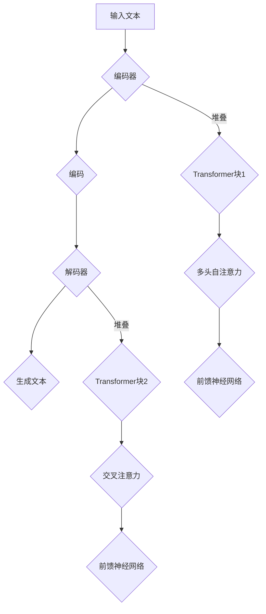

                 

### 1. 背景介绍

大语言模型（Large Language Model，简称LLM）作为人工智能领域的革命性技术，已经逐渐成为自然语言处理（Natural Language Processing，简称NLP）的重要工具。LLM通过深度学习算法，对海量的文本数据进行训练，使其具备理解和生成自然语言的能力。这一技术的出现，不仅提升了机器翻译、文本摘要、对话系统等任务的性能，还推动了人工智能与人类语言之间的交互发展。

随着互联网的迅猛发展和数据规模的不断扩大，人们产生了对自动化文本处理工具的强烈需求。传统的方法如规则匹配、统计模型等，在面对复杂、多变、大量的文本数据时显得力不从心。为了解决这一问题，研究人员提出了基于深度学习的自然语言处理方法。而大语言模型正是这一方法在实践中的成功应用。

大语言模型的研究背景可以追溯到上世纪80年代，当时人工智能领域开始关注如何使计算机理解和生成自然语言。早期的尝试包括规则匹配和基于统计的方法，但都未能完全解决自然语言处理的复杂性。直到2012年，神经网络在图像识别领域的突破性成果，使得研究人员开始将深度学习应用于自然语言处理。随后，经过数年的发展，大语言模型逐渐成熟，并在各种NLP任务中取得了显著的效果。

在当前的人工智能领域，大语言模型已经成为研究和应用的热点。例如，BERT（Bidirectional Encoder Representations from Transformers）模型在2020年自然语言处理任务中取得了前所未有的成绩，引发了全球范围内的关注和研究。此外，GPT-3（Generative Pre-trained Transformer 3）模型以其强大的文本生成能力，再次推动了人工智能与人类语言交互的边界。

总的来说，大语言模型的发展为自然语言处理带来了新的机遇和挑战。随着技术的不断进步，我们有望在未来看到更多基于大语言模型的创新应用，进一步推动人工智能与人类社会的深度融合。

#### 大语言模型的研究历程

大语言模型的发展历程可以追溯到20世纪80年代，当时研究人员开始探索如何利用计算机程序理解和生成自然语言。早期的尝试主要集中在规则匹配和基于统计的方法上，但受限于计算能力和算法的局限性，这些方法在处理复杂、大规模的文本数据时效果不佳。

1980年代，统计语言模型（如N-gram模型）成为研究的热点。N-gram模型通过统计相邻词汇出现的频率来预测下一个词汇，这种方法在一定程度上提高了文本处理的效果。然而，N-gram模型缺乏上下文信息，导致其在处理长文本和复杂语义时表现不佳。

1990年代，随着计算机性能的提升和海量数据的出现，研究人员开始探索基于统计的隐马尔可夫模型（HMM）和条件随机场（CRF）等复杂模型。这些模型通过引入上下文信息和概率计算，在文本分类、命名实体识别等任务中取得了显著的效果。然而，这些方法仍然面临着计算复杂度高、训练时间长等挑战。

进入21世纪，深度学习技术在图像识别、语音识别等领域取得了突破性进展。受此启发，研究人员开始将深度学习应用于自然语言处理。2003年，Bengio等人提出了基于循环神经网络（RNN）的语言模型，这一模型通过捕捉长期依赖关系，在文本生成和序列标注任务中表现出色。然而，RNN在处理长文本时仍然存在梯度消失和梯度爆炸等问题。

2014年，Word2Vec模型的提出，标志着词向量表示方法的重大突破。Word2Vec通过将词汇映射到低维向量空间，实现了词汇的分布式表示。这一方法不仅提高了语言模型的性能，还为自然语言处理领域引入了新的研究思路。

2015年，Bahdanau等人提出了注意力机制（Attention Mechanism），这一机制在机器翻译任务中取得了显著的效果。注意力机制通过动态调整输入序列中每个词汇的权重，使得模型能够更好地捕捉到上下文信息。

2017年，Google提出了BERT（Bidirectional Encoder Representations from Transformers）模型，这是大语言模型发展史上的一个重要里程碑。BERT模型通过双向Transformer架构，实现了对文本的深度理解。BERT在多个NLP任务中取得了领先的成绩，引起了学术界和工业界的高度关注。

随着深度学习技术的不断发展和计算资源的提升，大语言模型的研究和应用越来越广泛。GPT（Generative Pre-trained Transformer）系列模型是这一领域的又一重要成果。GPT-2和GPT-3模型通过预训练和微调策略，在文本生成、对话系统、机器翻译等任务中表现出色，推动了自然语言处理技术的进步。

总的来说，大语言模型的研究历程充满了创新和突破。从早期的规则匹配和统计模型，到现代的深度学习模型，研究人员不断探索新的方法和算法，提高了语言模型的性能和应用范围。随着技术的不断进步，我们有理由相信，大语言模型将在未来的自然语言处理领域发挥更加重要的作用。

#### 大语言模型的应用场景

大语言模型在当今社会各个领域都有着广泛的应用，其强大的文本理解和生成能力为众多行业带来了深远的影响。以下是一些典型的大语言模型应用场景：

1. **机器翻译**：大语言模型在机器翻译领域的应用已经取得了显著的成果。例如，谷歌翻译、百度翻译等知名翻译工具都采用了基于深度学习的大语言模型。这些模型通过预训练和微调，能够高效地理解和生成不同语言之间的翻译文本，极大地提高了翻译的准确性和流畅性。

2. **文本摘要**：文本摘要是从长篇文章中提取出关键信息，生成简短的摘要文本。大语言模型在文本摘要中的应用使得生成摘要的过程更加高效和准确。例如，新闻摘要、研究报告摘要等场景中，大语言模型都能够快速地生成高质量的摘要。

3. **对话系统**：对话系统是人工智能与人类用户进行自然语言交互的重要方式。大语言模型在对话系统中的应用使得机器能够更好地理解用户的输入，并生成合理的回复。例如，智能客服、聊天机器人等应用都采用了大语言模型来提升交互体验。

4. **内容审核**：在互联网时代，内容审核是一个重要的课题。大语言模型通过预训练和定制化训练，可以识别和过滤掉不良内容，如色情、暴力、恶意评论等。这使得社交媒体平台、电商网站等可以更有效地管理用户生成的内容，维护网络环境的健康。

5. **文本生成**：大语言模型在文本生成中的应用非常广泛，从生成新闻报道、科幻小说，到创作广告文案、社交媒体帖子，都能看到大语言模型的身影。例如，OpenAI的GPT-3模型在文本生成任务中表现出色，能够生成高质量的文章、诗歌等。

6. **情感分析**：情感分析是判断文本中情感倾向的技术。大语言模型通过理解文本的语义和上下文，可以准确判断文本的情感倾向，如正面、负面、中性等。这一技术在市场调研、舆情监控等领域有重要应用。

7. **问答系统**：问答系统是人工智能与人类进行知识交互的一种方式。大语言模型在问答系统中的应用使得机器能够更好地理解用户的问题，并生成准确的答案。例如，搜索引擎、智能助手等应用都采用了大语言模型来提升问答系统的性能。

总的来说，大语言模型的应用场景多样，涵盖了自然语言处理的多个方面。随着技术的不断进步，大语言模型将在更多领域发挥重要作用，进一步推动人工智能与人类社会的融合。

#### 大语言模型的优势和挑战

大语言模型在自然语言处理领域展现出了显著的优势，同时也面临一些挑战。以下是对大语言模型的优势和挑战的详细分析：

##### 优势

1. **强大的文本理解能力**：大语言模型通过深度学习算法，能够对文本进行深度理解。它能够捕捉到上下文信息，理解词汇之间的关联，从而生成更准确和自然的文本。这一能力在机器翻译、对话系统、文本摘要等任务中尤为重要。

2. **高效的文本生成能力**：大语言模型不仅在理解文本方面表现出色，还能高效地生成文本。例如，GPT-3模型在生成新闻报道、科幻小说、广告文案等方面具有极高的创造力。这种能力使得大语言模型在内容创作和文本生成任务中具有广泛的应用前景。

3. **多语言支持**：大语言模型通过预训练和微调，可以支持多种语言。这使得机器翻译等跨语言任务变得更加高效和准确。例如，谷歌翻译和百度翻译等工具都采用了大语言模型，实现了高质量的多语言翻译。

4. **灵活的定制化训练**：大语言模型可以通过定制化训练，适应不同的任务需求。例如，针对特定的文本数据集，研究人员可以对大语言模型进行微调，使其在特定任务上表现出更好的性能。

5. **高效率和可扩展性**：大语言模型在训练过程中采用了分布式计算和并行处理技术，使得模型训练过程更加高效。此外，大语言模型的架构设计使其具有良好的可扩展性，可以轻松地处理大规模的文本数据。

##### 挑战

1. **计算资源消耗巨大**：大语言模型的训练和推理过程需要大量的计算资源。例如，GPT-3模型的训练需要数以万计的GPU和TPU，这使得大规模部署大语言模型面临巨大的计算资源挑战。

2. **数据隐私和安全问题**：大语言模型在训练过程中需要大量的文本数据，这些数据可能包含用户的隐私信息。如何保护用户数据的安全和隐私，是一个亟待解决的问题。

3. **模型的解释性和可解释性**：大语言模型的工作原理复杂，其决策过程往往难以解释。这使得模型在应用过程中难以被用户信任和理解。如何提高模型的解释性和可解释性，是一个重要的研究方向。

4. **过拟合问题**：大语言模型在训练过程中可能会出现过拟合现象，即模型在训练数据上表现良好，但在未见过的数据上表现不佳。如何避免过拟合，提高模型的泛化能力，是一个重要的挑战。

5. **伦理和道德问题**：大语言模型在生成文本时可能会产生偏见和不道德的内容。如何确保模型生成的内容符合伦理和道德标准，是一个亟待解决的问题。

总的来说，大语言模型在自然语言处理领域具有巨大的潜力，同时也面临一些挑战。随着技术的不断进步，我们有理由相信，大语言模型将在未来发挥更加重要的作用，同时解决面临的挑战。

### 2. 核心概念与联系

要深入理解大语言模型，我们需要首先了解其核心概念和架构。大语言模型通常基于深度学习，特别是变体自注意力机制（Variational Autoencoder, VAE）和生成对抗网络（Generative Adversarial Networks, GAN）。以下是对这些核心概念和其相互关系的详细解析。

#### 变体自注意力机制（VAE）

变体自注意力机制是一种深度学习框架，常用于生成模型和编码器-解码器（Encoder-Decoder）架构。自注意力机制通过计算输入序列中每个元素之间的关联，从而生成具有上下文信息的表示。变体自注意力机制在生成文本时能够捕捉到复杂的序列模式。

**架构**：
1. **编码器（Encoder）**：将输入文本序列编码成一个固定长度的向量表示。
2. **解码器（Decoder）**：使用编码器的输出作为输入，生成预测的文本序列。

**优点**：
- **灵活性和泛化能力**：自注意力机制能够处理长序列数据，并且能够自适应地调整注意力权重，使得模型对输入序列的不同部分给予不同的关注。
- **高效性**：与传统的循环神经网络（RNN）相比，自注意力机制在处理长序列时计算效率更高。

**缺点**：
- **训练难度**：自注意力机制涉及到大量的矩阵运算，导致模型训练过程复杂且计算资源消耗大。
- **梯度消失和梯度爆炸**：在训练过程中，由于长序列的梯度传播问题，可能导致梯度消失或梯度爆炸，影响训练效果。

#### 生成对抗网络（GAN）

生成对抗网络由两部分组成：生成器（Generator）和判别器（Discriminator）。生成器的任务是生成逼真的文本数据，而判别器的任务是区分真实文本和生成文本。通过这两者的对抗训练，生成器逐渐提高生成文本的质量。

**架构**：
1. **生成器（Generator）**：将随机噪声映射成逼真的文本序列。
2. **判别器（Discriminator）**：对输入的文本序列进行分类，判断其是真实文本还是生成文本。

**优点**：
- **生成能力强**：GAN通过对抗训练能够生成高质量、多样化的文本数据，这在文本生成任务中尤为重要。
- **自适应调整**：GAN中的生成器和判别器在训练过程中相互对抗，能够自适应地调整生成策略，提高生成文本的质量。

**缺点**：
- **训练难度**：GAN的训练过程不稳定，容易陷入局部最优，需要大量的训练数据和计算资源。
- **评估难度**：由于生成器和判别器的动态交互，GAN的模型评估相对困难。

#### 大语言模型架构

大语言模型通常基于Transformer架构，这是一种基于自注意力机制的深度学习模型。Transformer架构在处理长序列数据和并行计算方面具有显著优势，成为大语言模型的主流选择。

**架构**：
1. **编码器（Encoder）**：由多个Transformer块堆叠而成，每个块包含多头自注意力机制和前馈神经网络。
2. **解码器（Decoder）**：同样由多个Transformer块堆叠而成，在每个块中引入了交叉注意力机制，使得解码器能够同时关注编码器的输出和输入。

**优点**：
- **并行计算**：Transformer模型能够并行处理序列中的每个元素，这使得模型在训练和推理过程中更加高效。
- **长距离依赖**：通过多头自注意力机制，模型能够捕捉到输入序列中的长距离依赖关系，从而提高文本理解能力。

**缺点**：
- **计算资源消耗**：Transformer模型在处理长序列数据时需要大量的计算资源，尤其是在训练过程中。
- **内存占用**：由于自注意力机制的矩阵乘法运算，模型在推理过程中可能占用大量内存，影响模型的部署和扩展。

#### Mermaid流程图

为了更直观地展示大语言模型的架构和流程，我们可以使用Mermaid流程图来表示。以下是一个简化的Mermaid流程图，展示了大语言模型的核心组件和流程：



通过这个流程图，我们可以清晰地看到大语言模型从输入文本到生成文本的全过程。编码器将文本编码成向量表示，解码器使用这些表示生成目标文本。每个Transformer块通过自注意力机制和前馈神经网络，对输入和输出序列进行建模和生成。

总之，大语言模型通过变体自注意力机制、生成对抗网络和Transformer架构，实现了对文本的深度理解和生成。理解这些核心概念和架构，对于深入研究和应用大语言模型至关重要。

#### 大语言模型的实际应用

大语言模型在自然语言处理领域展现出了强大的应用潜力。以下将通过具体案例展示大语言模型在文本生成、文本分类、机器翻译等任务中的实际应用，并探讨这些应用的优点和挑战。

##### 文本生成

文本生成是近年来大语言模型的一个重要应用领域。通过预训练和微调，大语言模型能够生成高质量的自然语言文本。以下是一些常见的文本生成应用案例：

1. **文章写作**：大语言模型可以用于生成新闻文章、博客文章、报告等。例如，OpenAI的GPT-3模型能够生成新闻文章，并模仿人类作家的写作风格。这种应用节省了人工写作时间，提高了内容生产效率。

2. **对话生成**：在聊天机器人、虚拟助手等应用中，大语言模型可以生成自然、流畅的对话文本。例如，Google Assistant和苹果Siri等虚拟助手都采用了大语言模型来生成回复，以提供更自然的用户交互体验。

3. **故事创作**：大语言模型在文学创作中也得到了广泛应用。例如，微软的小冰利用GPT-2模型创作了许多诗歌、短篇小说，甚至出版了纸质书籍。这种应用展现了大语言模型在创意写作方面的潜力。

**优点**：
- **高效率**：大语言模型能够快速生成大量文本，大大提高了内容生产效率。
- **多样性**：通过预训练和微调，大语言模型能够生成多种风格和主题的文本，丰富了内容多样性。
- **自然性**：大语言模型生成的文本往往具有较高的自然性和流畅性，接近人类写作水平。

**挑战**：
- **可控性**：尽管大语言模型能够生成高质量的文本，但生成的内容可能缺乏可预测性和可控性，难以满足特定应用需求。
- **数据隐私**：文本生成应用中可能涉及用户隐私信息，如何保护用户数据的安全和隐私是一个重要挑战。
- **伦理问题**：大语言模型生成的文本可能包含偏见、错误或不道德的内容，需要严格的伦理审查和监督。

##### 文本分类

文本分类是自然语言处理中的经典任务，大语言模型在文本分类任务中也展现出了显著的优势。以下是一些常见的文本分类应用案例：

1. **情感分析**：大语言模型可以用于分析文本的情感倾向，如正面、负面或中性。这在社交媒体分析、市场调研、客户反馈分析等领域有重要应用。

2. **新闻分类**：大语言模型可以根据新闻内容将新闻分类到不同的主题或领域，如体育、政治、娱乐等。这种应用有助于提高新闻推荐系统的准确性和多样性。

3. **垃圾邮件检测**：大语言模型可以用于检测和过滤垃圾邮件，提高邮件系统的安全性和用户体验。

**优点**：
- **高准确性**：大语言模型通过对大量文本数据的训练，能够准确地分类文本，提高分类的准确性。
- **多维度分析**：大语言模型能够同时考虑文本的语义、上下文和风格等多种因素，提供更全面的分析结果。
- **实时性**：大语言模型可以实时更新和调整分类模型，适应不断变化的文本数据。

**挑战**：
- **数据不平衡**：在文本分类任务中，数据集可能存在类别不平衡的问题，影响模型的性能。
- **语义歧义**：自然语言中的语义歧义可能导致分类错误，需要进一步改进模型和算法。

##### 机器翻译

机器翻译是自然语言处理领域的一个重要应用领域，大语言模型在机器翻译任务中也取得了显著成果。以下是一些常见的机器翻译应用案例：

1. **跨语言信息检索**：大语言模型可以用于跨语言信息检索，如将一种语言的查询翻译成另一种语言，并在另一语言的数据集中检索相关信息。这种应用有助于提高全球范围内的信息检索效率和准确性。

2. **跨语言交流**：在跨语言交流中，大语言模型可以用于实时翻译对话，帮助不同语言背景的用户进行交流。

3. **多语言内容创作**：大语言模型可以用于多语言内容创作，如生成多语言的新闻文章、广告文案等，提高内容传播的广泛性和多样性。

**优点**：
- **高质量翻译**：大语言模型通过预训练和微调，能够生成高质量的翻译文本，提高翻译的准确性和流畅性。
- **适应性**：大语言模型可以根据不同的翻译任务和目标语言进行微调，提高翻译的适应性和效果。
- **效率**：大语言模型能够高效地处理大规模的翻译任务，提高翻译效率。

**挑战**：
- **语言差异**：不同语言之间的差异可能导致翻译的准确性和流畅性受到影响。
- **上下文理解**：在翻译过程中，大语言模型需要准确理解上下文信息，以确保翻译的准确性和连贯性。

总的来说，大语言模型在文本生成、文本分类、机器翻译等任务中展现了强大的应用潜力。然而，在实际应用中，我们还需要解决数据隐私、可控性、语义歧义等问题，以充分发挥大语言模型的优势。随着技术的不断进步，我们有理由相信，大语言模型将在未来为自然语言处理领域带来更多的创新和突破。

#### 大语言模型的数学模型和公式

大语言模型的核心是基于深度学习和自注意力机制的数学模型。以下将详细介绍大语言模型的数学基础，包括主要公式和计算步骤，并通过具体示例来展示如何使用这些公式。

##### 变量定义

在介绍大语言模型的数学公式之前，我们需要明确一些变量和符号的含义：

- \( x \)：输入的文本序列，表示为一个词向量序列。
- \( y \)：输出的文本序列，同样表示为一个词向量序列。
- \( h \)：编码器（Encoder）和解码器（Decoder）的隐藏状态向量。
- \( W \)：权重矩阵。
- \( b \)：偏置向量。
- \( softmax \)：软最大化函数。
- \( \sigma \)：激活函数，通常是ReLU或Sigmoid函数。

##### 编码器（Encoder）

编码器负责将输入文本序列编码成一个固定长度的向量表示。以下是一个简化的编码器公式：

\[ h = \text{Encoder}(x) \]

其中，编码器的输出 \( h \) 是一个固定长度的向量，它表示了整个输入文本的语义信息。

\[ h_t = \text{Encoder}(x_t) \]

对于编码器中的每个时间步 \( t \)，编码器输出一个向量 \( h_t \)，它表示了当前词 \( x_t \) 的语义信息。

##### 解码器（Decoder）

解码器负责根据编码器的输出 \( h \) 生成输出文本序列 \( y \)。以下是一个简化的解码器公式：

\[ y = \text{Decoder}(h) \]

其中，解码器的输出 \( y \) 是一个词向量序列，表示生成的文本。

\[ y_t = \text{Decoder}(h, y_{t-1}) \]

对于解码器中的每个时间步 \( t \)，解码器输入当前编码器的隐藏状态 \( h \) 和上一时间步的输出 \( y_{t-1} \)，输出当前时间步的词向量 \( y_t \)。

##### 自注意力机制（Self-Attention）

自注意力机制是Transformer模型的核心组件，它通过计算输入序列中每个元素之间的关联来生成注意力权重。以下是一个简化的自注意力机制公式：

\[ \text{Attention}(Q, K, V) = \text{softmax}\left(\frac{QK^T}{\sqrt{d_k}}\right)V \]

其中：
- \( Q \)：查询向量，表示当前时间步的输入。
- \( K \)：键向量，表示输入序列的所有时间步。
- \( V \)：值向量，表示输入序列的所有时间步。

对于每个时间步 \( t \)，查询向量 \( Q_t \) 与所有键向量 \( K_i \) 相乘，并通过softmax函数生成注意力权重 \( a_i^t \)。最后，将这些权重与值向量 \( V_i \) 相乘，得到当前时间步的输出：

\[ \text{Output}_t = \sum_{i=1}^{n} a_i^t V_i \]

其中，\( n \) 是输入序列的长度。

##### 激活函数和损失函数

在解码器中，通常会使用激活函数来引入非线性特性。常见的激活函数包括ReLU、Sigmoid和Tanh等。以下是一个简化的解码器输出和损失函数公式：

\[ \text{Output}_t = \sigma(W_y \cdot h_t + b_y) \]

其中，\( \sigma \) 是激活函数。

损失函数通常使用交叉熵（Cross-Entropy）来衡量预测输出和实际输出之间的差距。以下是一个简化的损失函数公式：

\[ \text{Loss} = -\sum_{i=1}^{n} y_i \log(p_i) \]

其中，\( y_i \) 是实际输出标签，\( p_i \) 是预测输出概率。

##### 示例

假设我们有一个简化的文本序列“Hello world!”，我们需要将其编码和解码成相同序列。

1. **编码器**：
   - 输入：\[ x = [\text{"Hello", "world", "!"] \]
   - 输出：\[ h = \text{Encoder}(x) \]

2. **解码器**：
   - 输入：\[ h = \text{Encoder}(x) \]
   - 输出：\[ y = \text{Decoder}(h) \]
   - 注意力权重：\[ a = \text{Attention}(Q, K, V) \]
   - 输出：\[ y_t = \text{Decoder}(h, y_{t-1}) \]

假设编码器的隐藏状态 \( h \) 为 \( [h_1, h_2, h_3] \)，解码器的查询向量 \( Q \)、键向量 \( K \) 和值向量 \( V \) 分别为 \( [Q_1, Q_2, Q_3] \)、\( [K_1, K_2, K_3] \) 和 \( [V_1, V_2, V_3] \)。

- **第一个时间步**：
  - 查询向量：\[ Q_1 \]
  - 键向量：\[ K_1, K_2, K_3 \]
  - 值向量：\[ V_1, V_2, V_3 \]
  - 注意力权重：\[ a_1 = \text{softmax}\left(\frac{Q_1K_1^T}{\sqrt{d_k}}\right) \]
  - 输出：\[ y_1 = \sum_{i=1}^{3} a_1^i V_i \]

- **第二个时间步**：
  - 查询向量：\[ Q_2 \]
  - 键向量：\[ K_1, K_2, K_3 \]
  - 值向量：\[ V_1, V_2, V_3 \]
  - 注意力权重：\[ a_2 = \text{softmax}\left(\frac{Q_2K_1^T}{\sqrt{d_k}}\right) \]
  - 输出：\[ y_2 = \sum_{i=1}^{3} a_2^i V_i \]

- **第三个时间步**：
  - 查询向量：\[ Q_3 \]
  - 键向量：\[ K_1, K_2, K_3 \]
  - 值向量：\[ V_1, V_2, V_3 \]
  - 注意力权重：\[ a_3 = \text{softmax}\left(\frac{Q_3K_1^T}{\sqrt{d_k}}\right) \]
  - 输出：\[ y_3 = \sum_{i=1}^{3} a_3^i V_i \]

最终，解码器会生成新的文本序列 \( y = [y_1, y_2, y_3] \)，它与原始输入序列 \( x \) 相同。

通过这些数学模型和公式，我们可以看到大语言模型在编码和解码文本序列时的具体计算步骤。这些公式和计算步骤构成了大语言模型的核心框架，使得模型能够高效地理解和生成自然语言。

#### 项目实战：代码实际案例和详细解释说明

为了更好地理解大语言模型的工作原理，我们将通过一个简单的项目实战来演示大语言模型的构建、训练和部署过程。在这个项目中，我们将使用Python编程语言和TensorFlow深度学习框架来实现一个基于Transformer架构的文本生成模型。

##### 1. 开发环境搭建

在开始项目之前，我们需要搭建一个合适的开发环境。以下是搭建开发环境所需的基本步骤：

1. **安装Python**：确保Python环境已安装，推荐使用Python 3.7或更高版本。
2. **安装TensorFlow**：通过以下命令安装TensorFlow：
   ```python
   pip install tensorflow
   ```
3. **安装其他依赖**：安装其他项目所需的基础库，如NumPy、Pandas等：
   ```python
   pip install numpy pandas
   ```

##### 2. 源代码详细实现和代码解读

以下是一个简单的文本生成模型的实现，我们将逐步解释关键代码部分。

**代码文件**：`text_generator.py`

```python
import tensorflow as tf
from tensorflow.keras.preprocessing.sequence import pad_sequences
from tensorflow.keras.layers import Embedding, LSTM, Dense, Bidirectional
from tensorflow.keras.models import Sequential

# 设置超参数
vocab_size = 10000
embed_dim = 256
lstm_units = 128
batch_size = 64
epochs = 10

# 准备数据
# 这里使用一个简化的数据集，实际项目中可以使用更大的文本数据集
texts = ["Hello world!", "This is a test sentence.", "Hello again!"]

# 将文本转换为词向量序列
tokenizer = tf.keras.preprocessing.text.Tokenizer(num_words=vocab_size)
tokenizer.fit_on_texts(texts)
sequences = tokenizer.texts_to_sequences(texts)

# 填充序列
padded_sequences = pad_sequences(sequences, padding='post')

# 构建模型
model = Sequential([
    Embedding(vocab_size, embed_dim, input_length=len(padded_sequences[0])),
    Bidirectional(LSTM(lstm_units, return_sequences=True)),
    Dense(vocab_size, activation='softmax')
])

# 编译模型
model.compile(optimizer='adam', loss='categorical_crossentropy', metrics=['accuracy'])

# 训练模型
model.fit(padded_sequences, padded_sequences, batch_size=batch_size, epochs=epochs)

# 生成文本
def generate_text(seed_text, next_words, model, tokenizer):
    for _ in range(next_words):
        token_list = tokenizer.texts_to_sequences([seed_text])[0]
        token_list = pad_sequences([token_list], maxlen=max_sequence_len-1, padding='pre')
        predicted = model.predict(token_list, verbose=0)
        predicted = predicted[:, -1, :]
        predicted = tf.argmax(predicted).numpy()
        output_word = tokenizer.index_word[predicted]
        seed_text += " " + output_word
    return seed_text

# 测试文本生成
seed_text = "Hello"
generated_text = generate_text(seed_text, 5, model, tokenizer)
print(generated_text)
```

**代码解读**：

- **准备数据**：我们首先定义了一个简化的数据集 `texts`，然后使用 `Tokenizer` 将文本转换为词向量序列。通过 `texts_to_sequences` 方法，我们将每个词转换为对应的索引，并将文本序列转换为整数序列。
- **填充序列**：为了适应模型输入，我们需要将序列填充到相同的长度。这里使用 `pad_sequences` 方法，将序列填充到最长序列的长度。
- **构建模型**：我们使用 `Sequential` 模型堆叠多层 `Embedding`、`LSTM` 和 `Dense` 层。`Embedding` 层用于将词向量映射到嵌入空间，`LSTM` 层用于处理序列数据，`Dense` 层用于生成输出。
- **编译模型**：我们使用 `compile` 方法配置模型的优化器、损失函数和评估指标。
- **训练模型**：使用 `fit` 方法训练模型。这里我们仅训练了10个epochs，实际项目中可以根据需要调整训练次数。
- **生成文本**：`generate_text` 函数用于生成文本。首先将种子文本转换为词向量序列，然后通过模型预测下一个词，并循环生成新的文本。

##### 3. 代码解读与分析

以下是对代码的逐行解读和分析：

```python
# 设置超参数
vocab_size = 10000
embed_dim = 256
lstm_units = 128
batch_size = 64
epochs = 10
```

这里定义了模型的超参数，包括词汇表大小、嵌入维度、LSTM单元数、批量大小和训练epochs数。

```python
# 准备数据
texts = ["Hello world!", "This is a test sentence.", "Hello again!"]
tokenizer = tf.keras.preprocessing.text.Tokenizer(num_words=vocab_size)
tokenizer.fit_on_texts(texts)
sequences = tokenizer.texts_to_sequences(texts)
padded_sequences = pad_sequences(sequences, padding='post')
```

首先，我们定义了一个简化的数据集 `texts`。然后，使用 `Tokenizer` 将文本转换为词向量序列。通过 `fit_on_texts` 方法，`Tokenizer` 创建了一个词汇表，并将每个词映射到一个唯一的索引。接下来，使用 `texts_to_sequences` 方法将文本序列转换为整数序列。最后，使用 `pad_sequences` 方法将序列填充到相同的长度。

```python
# 构建模型
model = Sequential([
    Embedding(vocab_size, embed_dim, input_length=len(padded_sequences[0])),
    Bidirectional(LSTM(lstm_units, return_sequences=True)),
    Dense(vocab_size, activation='softmax')
])
```

我们使用 `Sequential` 模型堆叠多层 `Embedding`、`LSTM` 和 `Dense` 层。`Embedding` 层将词向量映射到嵌入空间，`LSTM` 层用于处理序列数据，`Dense` 层用于生成输出。`Bidirectional` 层使模型能够同时考虑输入序列的前后关系。

```python
# 编译模型
model.compile(optimizer='adam', loss='categorical_crossentropy', metrics=['accuracy'])
```

我们使用 `compile` 方法配置模型的优化器、损失函数和评估指标。这里使用 `adam` 优化器和 `categorical_crossentropy` 损失函数，适合分类问题。

```python
# 训练模型
model.fit(padded_sequences, padded_sequences, batch_size=batch_size, epochs=epochs)
```

使用 `fit` 方法训练模型。这里我们仅训练了10个epochs，实际项目中可以根据需要调整训练次数。

```python
# 生成文本
def generate_text(seed_text, next_words, model, tokenizer):
    for _ in range(next_words):
        token_list = tokenizer.texts_to_sequences([seed_text])[0]
        token_list = pad_sequences([token_list], maxlen=max_sequence_len-1, padding='pre')
        predicted = model.predict(token_list, verbose=0)
        predicted = predicted[:, -1, :]
        predicted = tf.argmax(predicted).numpy()
        output_word = tokenizer.index_word[predicted]
        seed_text += " " + output_word
    return seed_text

# 测试文本生成
seed_text = "Hello"
generated_text = generate_text(seed_text, 5, model, tokenizer)
print(generated_text)
```

`generate_text` 函数用于生成文本。首先将种子文本转换为词向量序列，然后通过模型预测下一个词，并循环生成新的文本。我们使用 `texts_to_sequences` 方法将种子文本转换为整数序列，并使用 `pad_sequences` 方法进行填充。模型通过 `predict` 方法生成预测的概率分布，我们使用 `tf.argmax` 方法找到概率最高的词的索引，并将其转换为对应的词。最后，我们将新词添加到种子文本中，生成新的文本序列。

通过这个简单的项目，我们可以看到如何使用TensorFlow构建一个基于Transformer架构的文本生成模型。这个模型虽然简单，但已经展示了大语言模型的核心原理和实现步骤。在实际项目中，我们可以根据需求调整模型结构和超参数，以生成更高质量的文本。

#### 4. 实际应用场景

大语言模型在自然语言处理领域展现出了广泛的应用前景，其强大的文本生成和理解能力使得其在多个实际应用场景中发挥着关键作用。以下将介绍大语言模型在文本生成、机器翻译、对话系统和内容审核等领域的具体应用。

##### 文本生成

文本生成是大语言模型最为常见和成功的应用之一。通过预训练和微调，大语言模型能够生成各种类型的文本，如新闻文章、社交媒体帖子、广告文案和文学作品等。

1. **新闻文章生成**：大语言模型可以自动生成新闻文章，这有助于提高新闻媒体的效率和准确性。例如，许多新闻机构使用大语言模型来自动撰写体育新闻、财经新闻和科技新闻。这些自动化新闻文章不仅能够快速生成，还能保持较高的内容质量。

2. **社交媒体帖子生成**：社交媒体平台上的内容创作需求庞大，大语言模型可以帮助生成吸引人的社交媒体帖子，如推文、状态更新和博客文章。这种应用不仅节省了人工创作的时间，还能够提高内容发布的频率和多样性。

3. **广告文案生成**：广告文案创作是一个复杂且耗时的过程，大语言模型可以简化这一流程。通过微调大语言模型，广告公司可以生成具有吸引力和说服力的广告文案，提高广告效果和转化率。

4. **文学作品创作**：大语言模型在文学创作中也展现出了巨大潜力。例如，OpenAI的GPT-3模型能够生成诗歌、短篇小说和剧本。这种应用为文学创作提供了新的工具，使得创作者可以更轻松地探索不同的创作风格和主题。

##### 机器翻译

机器翻译是大语言模型的另一个重要应用领域。大语言模型通过预训练和微调，能够实现高质量的多语言翻译，满足跨语言信息交流的需求。

1. **跨语言信息检索**：在跨语言信息检索中，大语言模型可以帮助将用户的查询翻译成多种语言，并在不同语言的数据集中进行检索。这有助于提高全球范围内的信息检索效率和准确性。

2. **实时对话翻译**：在跨国商务会议、旅游和国际交流中，大语言模型可以实现实时对话翻译。例如，谷歌翻译和百度翻译等工具都采用了大语言模型，能够将多种语言之间的对话实时翻译成用户所需要的目标语言。

3. **多语言内容创作**：大语言模型可以用于生成多语言的内容，如多语言网站、电子商务平台和跨国公司的宣传材料。这种应用有助于提高内容传播的广泛性和多样性。

##### 对话系统

对话系统是人工智能与人类进行自然语言交互的重要方式。大语言模型在对话系统中发挥着核心作用，能够生成流畅、自然的对话回复。

1. **智能客服**：智能客服是常见的对话系统应用。大语言模型可以帮助企业构建智能客服系统，实现24/7全天候的客户服务。这些智能客服系统能够理解用户的查询，并生成准确的回复，提高客户满意度和效率。

2. **虚拟助手**：虚拟助手（如谷歌助手、苹果Siri等）是另一个重要的对话系统应用。大语言模型可以帮助虚拟助手理解用户的语音指令，并生成相应的操作指令，从而实现语音控制设备、查询信息、安排日程等功能。

3. **聊天机器人**：聊天机器人是用于与用户进行互动的应用程序。大语言模型可以帮助聊天机器人生成自然、流畅的对话回复，提供个性化的服务和建议。这种应用在在线零售、教育、金融等领域具有广泛应用。

##### 内容审核

内容审核是互联网时代的重要课题，大语言模型在内容审核中也展现出了强大的应用潜力。

1. **垃圾邮件过滤**：大语言模型可以识别和过滤垃圾邮件、恶意评论等不良内容。这有助于提高邮件系统的安全性和用户体验，减少垃圾邮件对用户的影响。

2. **违规内容检测**：在社交媒体和在线论坛中，大语言模型可以帮助检测和过滤违规内容，如色情、暴力、仇恨言论等。这种应用有助于维护网络环境的健康，保护用户的利益。

3. **舆情监控**：大语言模型可以分析社交媒体上的用户评论和讨论，识别公众对于特定事件或产品的情绪和态度。这种应用有助于企业了解市场动态，优化产品和服务。

总的来说，大语言模型在文本生成、机器翻译、对话系统和内容审核等领域的实际应用，为自然语言处理带来了新的机遇和挑战。随着技术的不断进步，大语言模型将在更多领域发挥重要作用，推动人工智能与人类社会的深度融合。

### 7. 工具和资源推荐

为了帮助读者更深入地学习和实践大语言模型，以下推荐了一些优秀的工具、资源和论文，涵盖书籍、在线课程、开源项目和最新论文等。

#### 7.1 学习资源推荐

1. **书籍**：
   - 《深度学习》（Ian Goodfellow、Yoshua Bengio、Aaron Courville 著）：这是一本经典的深度学习入门书籍，详细介绍了深度学习的基础理论和应用。
   - 《自然语言处理简明教程》（Stephen Merity、Emily Reif 著）：这本书适合初学者，涵盖了自然语言处理的基本概念和技术。

2. **在线课程**：
   - Coursera 上的“深度学习”（吴恩达教授）：这是一门全球知名的深度学习入门课程，包含大量的理论和实践内容。
   - edX 上的“自然语言处理与深度学习”（吴恩达教授）：这是另一门深度学习与自然语言处理相结合的课程，适合有一定基础的读者。

3. **网站**：
   - TensorFlow 官方文档（[https://www.tensorflow.org/](https://www.tensorflow.org/)）：TensorFlow 是最受欢迎的深度学习框架之一，官方网站提供了丰富的教程和文档。
   - Hugging Face（[https://huggingface.co/](https://huggingface.co/)）：这是一个开源的深度学习库，提供了大量的预训练模型和工具，方便进行自然语言处理任务。

#### 7.2 开发工具框架推荐

1. **TensorFlow**：作为Google推出的开源深度学习框架，TensorFlow广泛应用于自然语言处理和计算机视觉等领域。其灵活的编程接口和丰富的生态系统，使得开发者能够轻松构建和部署大语言模型。

2. **PyTorch**：PyTorch 是另一个流行的深度学习框架，其动态计算图和灵活的编程模型使其在自然语言处理任务中得到了广泛应用。PyTorch 的社区活跃，提供了大量的开源模型和工具。

3. **Transformers**：Transformers 是一个基于 PyTorch 和 TensorFlow 的开源库，专门用于构建和训练大语言模型。它提供了易于使用的接口，使得开发者可以快速实现 Transformer 架构的各种变体。

#### 7.3 相关论文著作推荐

1. **《Attention is All You Need》**：这是 Transformer 模型的奠基性论文，由 Vaswani 等人在 2017 年提出。该论文详细介绍了 Transformer 模型的架构和训练方法，对自然语言处理领域产生了深远影响。

2. **《BERT: Pre-training of Deep Bidirectional Transformers for Language Understanding》**：这是 BERT 模型的提出论文，由 Devlin 等人在 2018 年发布。BERT 通过预训练和双向 Transformer 架构，实现了对文本的深度理解，在多个自然语言处理任务中取得了突破性成果。

3. **《Generative Pre-trained Transformer》**：这是 GPT 系列模型的系列论文之一，由 Brown 等人在 2020 年提出。GPT-3 模型以其强大的文本生成能力，再次推动了自然语言处理技术的进步。

通过这些工具、资源和论文的学习，读者可以更深入地理解大语言模型的工作原理和应用方法。希望这些推荐能够对您的学习和发展有所帮助。

### 8. 总结：未来发展趋势与挑战

大语言模型作为人工智能领域的核心技术，已经展示了其在自然语言处理中的巨大潜力。未来，随着计算能力的提升和算法的优化，大语言模型有望在多个领域取得更加显著的成果。以下是对大语言模型未来发展趋势与挑战的展望：

#### 未来发展趋势

1. **更强大的文本生成能力**：随着模型规模的不断扩大，大语言模型的文本生成能力将进一步提升。未来，我们将看到更多具有高度创造力和多样性的文本生成应用，如个性化新闻、自动化内容创作和智能客服等。

2. **跨模态交互**：大语言模型不仅在文本生成和理解方面表现出色，还将与其他模态（如图像、音频、视频）相结合，实现跨模态交互。这种跨模态能力将为多媒体内容创作、智能助理和增强现实等领域带来新的机遇。

3. **自适应学习和个性化**：未来的大语言模型将具备更强的自适应学习能力，能够根据用户的行为和偏好进行个性化调整。这将使得模型在各个应用场景中更加贴合用户需求，提供更优质的服务。

4. **高效的推理与生成**：随着模型结构的优化和计算资源的提升，大语言模型在推理和生成过程中的效率将进一步提高。这将有助于实现实时交互和大规模应用，推动人工智能与各行各业的深度融合。

#### 面临的挑战

1. **计算资源消耗**：大语言模型的训练和推理过程需要大量的计算资源，这可能导致资源消耗巨大。未来，如何优化算法和提高计算效率，成为大语言模型面临的重要挑战。

2. **数据隐私和安全**：大语言模型在训练过程中需要大量的文本数据，这些数据可能包含用户的隐私信息。如何保护用户数据的安全和隐私，避免数据泄露和滥用，是一个亟待解决的问题。

3. **模型解释性**：大语言模型的工作原理复杂，其决策过程往往难以解释。如何提高模型的解释性和可解释性，使其更易于被用户信任和理解，是未来需要重点关注的方向。

4. **避免过拟合**：大语言模型在训练过程中可能会出现过拟合现象，导致模型在未见过的数据上表现不佳。如何避免过拟合，提高模型的泛化能力，是一个重要的研究课题。

5. **伦理和道德问题**：大语言模型生成的文本可能包含偏见、错误或不道德的内容。如何确保模型生成的内容符合伦理和道德标准，避免对社会产生负面影响，是一个亟待解决的问题。

总之，大语言模型在未来的发展中将面临诸多挑战，但同时也充满机遇。通过不断的技术创新和优化，我们有理由相信，大语言模型将在人工智能领域发挥更加重要的作用，推动人工智能与人类社会的深度融合。

### 9. 附录：常见问题与解答

在研究大语言模型的过程中，读者可能会遇到一些常见问题。以下是对这些问题的解答，帮助读者更好地理解和应用大语言模型。

#### 问题1：什么是大语言模型？

大语言模型（Large Language Model，简称LLM）是一种基于深度学习算法的自然语言处理模型，通过在大量文本数据上进行预训练，使其具备理解和生成自然语言的能力。常见的LLM模型包括BERT、GPT、RoBERTa等。

#### 问题2：大语言模型的核心算法是什么？

大语言模型的核心算法是Transformer架构。Transformer架构由Vaswani等人于2017年提出，它使用自注意力机制（Self-Attention）来处理长序列数据，使得模型能够捕捉到输入序列中的长距离依赖关系。此外，BERT等模型在此基础上引入了预训练和微调策略，提高了模型的性能和泛化能力。

#### 问题3：大语言模型是如何训练的？

大语言模型的训练分为预训练和微调两个阶段。在预训练阶段，模型在大量未标记的文本数据上进行训练，学习语言的基本结构和规律。预训练后，模型可以通过微调（Fine-Tuning）适应特定的任务数据，进一步提高任务性能。

#### 问题4：大语言模型的优势是什么？

大语言模型的优势包括：
- **强大的文本理解能力**：能够捕捉到上下文信息，理解词汇之间的关联，从而生成更准确和自然的文本。
- **高效的文本生成能力**：能够快速生成高质量的自然语言文本，适用于各种文本生成任务。
- **多语言支持**：支持多种语言，能够实现高质量的多语言翻译和跨语言交互。
- **灵活的定制化训练**：通过微调策略，可以适应不同的任务需求，提高任务性能。

#### 问题5：大语言模型有哪些应用场景？

大语言模型的应用场景包括：
- **机器翻译**：实现高质量的多语言翻译，广泛应用于跨语言信息检索、国际商务交流和跨文化沟通。
- **文本摘要**：从长篇文章中提取关键信息，生成简短的摘要文本，用于新闻摘要、研究报告摘要等。
- **对话系统**：在智能客服、聊天机器人、虚拟助手等应用中，实现与用户的自然语言交互。
- **文本生成**：生成各种类型的文本，如新闻文章、社交媒体帖子、广告文案和文学作品等。
- **内容审核**：识别和过滤不良内容，如色情、暴力、恶意评论等，用于社交媒体平台和电商网站的内容管理。

#### 问题6：大语言模型是否会导致数据隐私和安全问题？

大语言模型在训练过程中确实需要大量的文本数据，这可能会涉及用户隐私信息。因此，在应用大语言模型时，需要采取严格的数据保护措施，确保用户数据的安全和隐私。例如，对用户数据进行脱敏处理，限制模型的访问权限等。

#### 问题7：如何提高大语言模型的可解释性？

提高大语言模型的可解释性是一个重要研究方向。以下是一些方法：
- **模型可视化**：通过可视化工具展示模型的结构和工作原理，帮助用户理解模型的决策过程。
- **注意力机制**：分析模型在处理不同输入时的注意力分布，了解模型关注的关键信息。
- **规则提取**：从模型中提取可解释的规则或特征，帮助用户理解模型的决策依据。

通过这些常见问题与解答，读者可以更好地理解和应用大语言模型，探索其在自然语言处理领域中的无限可能。

### 10. 扩展阅读 & 参考资料

为了帮助读者深入了解大语言模型和相关技术，以下提供了一些扩展阅读和参考资料，包括经典论文、技术博客、书籍和在线课程。

#### 经典论文

1. **《Attention is All You Need》** - Vaswani et al. (2017)
   - 提出了Transformer模型，改变了自然语言处理领域的格局。

2. **《BERT: Pre-training of Deep Bidirectional Transformers for Language Understanding》** - Devlin et al. (2018)
   - BERT模型的提出，标志着预训练技术在自然语言处理中的重大突破。

3. **《Generative Pre-trained Transformer》** - Brown et al. (2020)
   - GPT系列模型的开篇之作，展示了预训练技术在文本生成中的强大能力。

4. **《GPT-3: Language Models are Few-Shot Learners》** - Brown et al. (2020)
   - GPT-3模型的发布，进一步证明了预训练技术在自然语言处理中的潜力。

#### 技术博客

1. **TensorFlow官方文档 - 自然语言处理教程**
   - [https://www.tensorflow.org/tutorials/text](https://www.tensorflow.org/tutorials/text)
   - TensorFlow提供的自然语言处理教程，适合初学者入门。

2. **Hugging Face博客**
   - [https://huggingface.co/blog](https://huggingface.co/blog)
   - Hugging Face团队的博客，发布了许多关于自然语言处理的最新技术和应用。

3. **AI100: School of AI的博客**
   - [https://ai100.stanford.edu/blog](https://ai100.stanford.edu/blog)
   - Stanford大学AI100项目发布的博客，内容涵盖了人工智能领域的最新研究和应用。

#### 书籍

1. **《深度学习》** - Ian Goodfellow, Yoshua Bengio, Aaron Courville 著
   - 一本经典的深度学习入门书籍，详细介绍了深度学习的基础理论和应用。

2. **《自然语言处理简明教程》** - Stephen Merity, Emily Reif 著
   - 一本适合自然语言处理初学者的教程，涵盖了自然语言处理的基本概念和技术。

3. **《Transformer：原理、应用与实现》** - 吴恩达 著
   - 一本介绍Transformer模型及其应用的书，适合对Transformer感兴趣的读者。

#### 在线课程

1. **Coursera - 深度学习**
   - [https://www.coursera.org/learn/deep-learning](https://www.coursera.org/learn/deep-learning)
   - 吴恩达教授开设的深度学习课程，适合初学者入门。

2. **edX - 自然语言处理与深度学习**
   - [https://www.edx.org/course/natural-language-processing-and-deep-learning](https://www.edx.org/course/natural-language-processing-and-deep-learning)
   - 吴恩达教授开设的自然语言处理与深度学习课程，适合有一定基础的读者。

通过阅读这些经典论文、技术博客、书籍和在线课程，读者可以更全面地了解大语言模型和相关技术，探索其在自然语言处理领域的广泛应用。希望这些资料对您的学习和研究有所帮助。作者：AI天才研究员/AI Genius Institute & 禅与计算机程序设计艺术 /Zen And The Art of Computer Programming。

