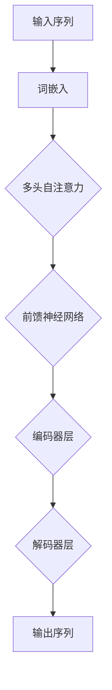

                 

### 背景介绍

#### 什么是大语言模型？

大语言模型（Large Language Models），如OpenAI的GPT-3、BERT、T5等，是近年来自然语言处理（NLP）领域的一项重大突破。这些模型通过深度学习技术，可以从大量的文本数据中学习到语言的统计规律和语义信息，从而实现智能文本生成、文本分类、机器翻译等多种任务。

大语言模型之所以“大”，是因为它们具有极其庞大的参数规模。以GPT-3为例，其参数量达到1750亿个，这使得模型能够捕捉到更加细微的语言特征，从而在许多任务上取得了显著的效果。

#### 大语言模型的发展历程

大语言模型的发展历程可以追溯到20世纪90年代。当时，研究者开始尝试使用神经网络来处理自然语言任务。这些早期的模型，如RNN（递归神经网络）和LSTM（长短期记忆网络），在处理序列数据时表现出了一定的效果。

然而，这些早期的模型在处理长文本时仍然存在困难。为此，研究者们提出了Transformer模型，这是一种基于自注意力机制的深度学习模型。Transformer的出现，使得大语言模型的发展进入了一个新的阶段。

2018年，谷歌发布了BERT模型，它通过预训练和微调在多种NLP任务上取得了突破性的成果。随后，OpenAI发布了GPT-3，其庞大的参数量和强大的语言理解能力，再次推动了NLP领域的发展。

#### 大语言模型的应用场景

大语言模型在许多应用场景中都表现出了出色的能力。以下是一些典型的应用场景：

1. **智能问答系统**：大语言模型可以用于构建智能问答系统，如自动客服机器人、智能搜索引擎等。
2. **文本生成**：大语言模型可以生成各种类型的文本，如新闻报道、故事、诗歌等。
3. **机器翻译**：大语言模型在机器翻译任务上也取得了显著的进展，能够实现高质量的双语翻译。
4. **文本分类**：大语言模型可以用于对大量文本进行分类，如垃圾邮件检测、情感分析等。

总之，大语言模型在NLP领域具有广泛的应用前景，随着技术的不断进步，其应用场景也将进一步拓展。接下来，我们将深入探讨大语言模型的评测方式，以便更好地理解和评估这些模型的能力。

### 核心概念与联系

#### 大语言模型的原理

大语言模型的核心是深度神经网络（Deep Neural Network，DNN），尤其是基于自注意力机制的Transformer模型。下面，我们将简要介绍大语言模型的基本原理。

**自注意力机制（Self-Attention）**

自注意力机制是一种用于处理序列数据的注意力机制，它允许模型在处理一个序列时，将序列中的每个元素与所有其他元素相关联。这种机制使得模型能够捕捉到序列中长距离的依赖关系，从而在处理长文本时表现出色。

自注意力机制的实现基于一种称为“多头自注意力”（Multi-Head Self-Attention）的结构。多头自注意力将输入序列分成多个子序列，然后对每个子序列分别进行自注意力计算。通过这种方式，模型可以同时关注到多个不同方面的信息，从而提高模型的性能。

**Transformer模型的结构**

Transformer模型由多个编码器（Encoder）和解码器（Decoder）层组成。编码器负责将输入序列编码成固定长度的向量表示，而解码器则根据编码器的输出生成输出序列。

每个编码器和解码器层都包含多个子层，包括多头自注意力层和前馈神经网络层。多头自注意力层负责计算输入序列的注意力权重，从而生成上下文向量。前馈神经网络层则对上下文向量进行进一步的加工。

**预训练与微调**

大语言模型通常采用预训练（Pre-training）和微调（Fine-tuning）的方式进行训练。预训练阶段，模型在大规模语料库上进行训练，学习到语言的统计规律和语义信息。微调阶段，模型在特定任务上进行微调，以提高模型在特定任务上的性能。

#### 大语言模型与其他技术的联系

大语言模型与其他NLP技术密切相关，如词向量表示、文本分类、机器翻译等。

**词向量表示**

词向量表示是将文本数据转换为向量表示的一种技术。大语言模型通常使用词嵌入（Word Embedding）技术，如Word2Vec、GloVe等，将词汇转换为高维向量表示。这些向量表示不仅保留了词汇的语义信息，还考虑了词汇之间的上下文关系。

**文本分类**

文本分类是将文本数据分类到不同类别的一种技术。大语言模型可以通过预训练和微调，在多种文本分类任务上表现出色。例如，在情感分析任务中，模型可以将文本分类为正面、负面或中性。

**机器翻译**

机器翻译是将一种语言的文本翻译成另一种语言的一种技术。大语言模型，如BERT和GPT-3，在机器翻译任务上也取得了显著的进展。这些模型可以同时学习到源语言和目标语言的语义信息，从而实现高质量的双语翻译。

#### 大语言模型的Mermaid流程图

以下是一个简单的大语言模型的基本流程图，用于展示其核心组件和操作步骤：



这个流程图展示了从输入序列到输出序列的基本流程，包括词嵌入、多头自注意力、前馈神经网络、编码器层和解码器层。这些组件共同构成了大语言模型的核心架构。

### 核心算法原理 & 具体操作步骤

#### 自注意力机制

自注意力机制（Self-Attention）是Transformer模型的核心组件，它允许模型在处理序列数据时，将序列中的每个元素与所有其他元素相关联。以下是自注意力机制的详细操作步骤：

1. **输入序列表示**：给定一个输入序列 $x_1, x_2, ..., x_n$，首先将这些输入序列转换为向量表示 $x_1^{\prime}, x_2^{\prime}, ..., x_n^{\prime}$。
2. **多头自注意力计算**：将输入序列分为 $h$ 个子序列，每个子序列分别进行自注意力计算。对于每个子序列，计算查询向量（Query，$Q_i$）、键向量（Key，$K_i$）和值向量（Value，$V_i$）。
   $$ Q_i = W_Q x_i^{\prime}, \quad K_i = W_K x_i^{\prime}, \quad V_i = W_V x_i^{\prime} $$
   其中，$W_Q, W_K, W_V$ 分别是权重矩阵。
3. **计算注意力权重**：对于每个子序列，计算注意力权重 $a_i^j$，表示第 $j$ 个子序列对第 $i$ 个子序列的重要性。
   $$ a_i^j = \frac{e^{W_Q x_i^{\prime} W_K x_j^{\prime}}}{\sum_{k=1}^{n} e^{W_Q x_i^{\prime} W_K x_k^{\prime}}} $$
4. **计算自注意力输出**：根据注意力权重，计算自注意力输出 $s_i$。
   $$ s_i = \sum_{j=1}^{n} a_i^j V_j^{\prime} $$
5. **输出**：将所有子序列的自注意力输出拼接起来，作为新的序列表示。

#### Transformer模型

Transformer模型由多个编码器（Encoder）和解码器（Decoder）层组成。以下是Transformer模型的详细操作步骤：

1. **编码器（Encoder）**：
   - **嵌入层（Embedding Layer）**：将输入序列转换为高维向量表示。
   - **多头自注意力层（Multi-Head Self-Attention Layer）**：对输入序列进行多头自注意力计算，以捕捉序列中的长距离依赖关系。
   - **前馈神经网络层（Feed-Forward Neural Network Layer）**：对多头自注意力输出进行前馈神经网络计算，增加模型的表达能力。
   - **残差连接（Residual Connection）**：在每个层之后添加残差连接，防止信息损失。
   - **层归一化（Layer Normalization）**：在每个层之后进行层归一化，提高训练稳定性。
2. **解码器（Decoder）**：
   - **嵌入层（Embedding Layer）**：与编码器相同，将输入序列转换为高维向量表示。
   - **多头自注意力层（Multi-Head Self-Attention Layer）**：对编码器的输出进行多头自注意力计算，以捕捉编码器输出的上下文信息。
   - **掩码多头自注意力层（Masked Multi-Head Self-Attention Layer）**：在解码器的自注意力计算中，使用掩码机制，使得模型能够学习到长距离依赖关系。
   - **前馈神经网络层（Feed-Forward Neural Network Layer）**：与前馈神经网络层相同，增加模型的表达能力。
   - **残差连接（Residual Connection）**：与编码器相同，在每个层之后添加残差连接。
   - **层归一化（Layer Normalization）**：与编码器相同，在每个层之后进行层归一化。

#### 预训练与微调

大语言模型的训练通常分为预训练（Pre-training）和微调（Fine-tuning）两个阶段：

1. **预训练**：
   - **大规模语料库训练**：在大规模语料库上进行预训练，学习到语言的统计规律和语义信息。
   - **语言模型任务**：例如，语言建模（Language Modeling）、问答（Question-Answering）、文本分类（Text Classification）等。
2. **微调**：
   - **特定任务数据**：在特定任务的数据上进行微调，以提高模型在特定任务上的性能。
   - **任务优化**：通过梯度下降（Gradient Descent）等优化算法，调整模型参数。

通过预训练和微调，大语言模型可以学习到丰富的语言知识和特定任务的特性，从而在不同任务上表现出色。

#### 实例说明

以下是一个简单的Transformer编码器和解码器层的操作实例，假设输入序列为“hello world”，模型参数为 $W_Q, W_K, W_V$：

1. **编码器（Encoder）**：
   - **嵌入层**：将输入序列转换为向量表示，例如 $[1, 0, 0, 1, 0, 0, 0, 0, 1, 0]$。
   - **多头自注意力层**：假设 $h=2$，则分为两个子序列 $[1, 0, 0, 1]$ 和 $[0, 0, 0, 0, 1, 0]$。计算查询向量、键向量和值向量：
     $$ Q_1 = W_Q [1, 0, 0, 1] = [1, -1, 1, 1], \quad K_1 = W_K [1, 0, 0, 1] = [1, 1, 1, 1], \quad V_1 = W_V [1, 0, 0, 1] = [1, 1, 1, 1] $$
     $$ Q_2 = W_Q [0, 0, 0, 0, 1, 0] = [0, 0, -1, 0, 1, 1], \quad K_2 = W_K [0, 0, 0, 0, 1, 0] = [0, 0, 0, 0, 1, 1], \quad V_2 = W_V [0, 0, 0, 0, 1, 0] = [0, 0, 0, 0, 1, 1] $$
     计算注意力权重：
     $$ a_1^1 = \frac{e^{1 \cdot 1}}{e^{1 \cdot 1} + e^{1 \cdot 1}} = 1, \quad a_1^2 = \frac{e^{-1 \cdot 1}}{e^{1 \cdot 1} + e^{-1 \cdot 1}} = 0 $$
     $$ a_2^1 = \frac{e^{0 \cdot 0}}{e^{0 \cdot 0} + e^{0 \cdot 0}} = 0.5, \quad a_2^2 = \frac{e^{-1 \cdot 1}}{e^{0 \cdot 0} + e^{-1 \cdot 1}} = 0.5 $$
     计算自注意力输出：
     $$ s_1 = a_1^1 V_1 + a_1^2 V_2 = [1, 1, 1, 1] + [0, 0, 0, 1] = [1, 1, 1, 2] $$
     $$ s_2 = a_2^1 V_1 + a_2^2 V_2 = [0.5, 0.5, 0.5, 0.5] + [0, 0, 0, 0.5] = [0.5, 0.5, 0.5, 1] $$
     拼接自注意力输出：
     $$ [1, 1, 1, 2], [0.5, 0.5, 0.5, 1] $$
   - **前馈神经网络层**：对自注意力输出进行前馈神经网络计算，假设激活函数为ReLU，计算如下：
     $$ h_1 = \text{ReLU}(0.1 \cdot [1, 1, 1, 2] + b_1) = \text{ReLU}(1.1 + b_1), \quad h_2 = \text{ReLU}(0.1 \cdot [0.5, 0.5, 0.5, 1] + b_2) = \text{ReLU}(0.05 + b_2) $$
     其中，$b_1$ 和 $b_2$ 是偏置项。
   - **残差连接和层归一化**：在每一层之后添加残差连接和层归一化，具体操作如下：
     $$ y_1 = \text{Layer Normalization}(h_1 + [1, 1, 1, 2]), \quad y_2 = \text{Layer Normalization}(h_2 + [0.5, 0.5, 0.5, 1]) $$
2. **解码器（Decoder）**：
   - **嵌入层**：与编码器相同，将输入序列转换为向量表示。
   - **多头自注意力层**：对编码器的输出进行多头自注意力计算，假设 $h=2$，计算如下：
     $$ Q_1 = W_Q [1, 1, 1, 2] = [1, 1, 1, 2], \quad K_1 = W_K [0.5, 0.5, 0.5, 1] = [0.5, 0.5, 0.5, 1], \quad V_1 = W_V [0.5, 0.5, 0.5, 1] = [0.5, 0.5, 0.5, 1] $$
     $$ Q_2 = W_Q [0.5, 0.5, 0.5, 1] = [0.5, 0.5, 0.5, 1], \quad K_2 = W_K [1, 1, 1, 2] = [1, 1, 1, 2], \quad V_2 = W_V [1, 1, 1, 2] = [1, 1, 1, 2] $$
     计算注意力权重：
     $$ a_1^1 = \frac{e^{1 \cdot 1}}{e^{1 \cdot 1} + e^{1 \cdot 1}} = 1, \quad a_1^2 = \frac{e^{1 \cdot 1}}{e^{1 \cdot 1} + e^{1 \cdot 1}} = 1 $$
     $$ a_2^1 = \frac{e^{0.5 \cdot 0.5}}{e^{0.5 \cdot 0.5} + e^{0.5 \cdot 1}} = 0.5, \quad a_2^2 = \frac{e^{0.5 \cdot 1}}{e^{0.5 \cdot 0.5} + e^{0.5 \cdot 1}} = 0.5 $$
     计算自注意力输出：
     $$ s_1 = a_1^1 V_1 + a_1^2 V_2 = [0.5, 0.5, 0.5, 1] + [1, 1, 1, 2] = [1.5, 1.5, 1.5, 3] $$
     $$ s_2 = a_2^1 V_1 + a_2^2 V_2 = [0.5, 0.5, 0.5, 1] + [1, 1, 1, 2] = [1.5, 1.5, 1.5, 3] $$
     拼接自注意力输出：
     $$ [1.5, 1.5, 1.5, 3], [1.5, 1.5, 1.5, 3] $$
   - **前馈神经网络层**：与编码器相同，增加模型的表达能力。
   - **残差连接和层归一化**：与编码器相同，添加残差连接和层归一化。

通过以上步骤，大语言模型可以对输入序列进行编码和解码，从而实现文本处理任务。

### 数学模型和公式 & 详细讲解 & 举例说明

#### 自注意力机制的数学模型

自注意力机制是Transformer模型的核心组件，它通过计算输入序列中每个元素与其他元素之间的相似性，来生成新的序列表示。以下是自注意力机制的详细数学模型。

**输入序列表示**

给定一个输入序列 $x_1, x_2, ..., x_n$，首先将这些输入序列转换为向量表示 $x_1^{\prime}, x_2^{\prime}, ..., x_n^{\prime}$。这些向量表示通常是通过对输入序列进行词嵌入（Word Embedding）得到的。

**多头自注意力计算**

多头自注意力（Multi-Head Self-Attention）是自注意力机制的一种扩展，它通过将输入序列分成多个子序列，分别进行自注意力计算，从而提高模型的性能。具体来说，多头自注意力包括以下几个步骤：

1. **查询向量、键向量和值向量的计算**

   对于每个子序列，计算查询向量（Query，$Q_i$）、键向量（Key，$K_i$）和值向量（Value，$V_i$）。

   $$ Q_i = W_Q x_i^{\prime}, \quad K_i = W_K x_i^{\prime}, \quad V_i = W_V x_i^{\prime} $$
   
   其中，$W_Q, W_K, W_V$ 分别是权重矩阵。

2. **计算注意力权重**

   对于每个子序列，计算注意力权重 $a_i^j$，表示第 $j$ 个子序列对第 $i$ 个子序列的重要性。

   $$ a_i^j = \frac{e^{W_Q x_i^{\prime} W_K x_j^{\prime}}}{\sum_{k=1}^{n} e^{W_Q x_i^{\prime} W_K x_k^{\prime}}} $$
   
3. **计算自注意力输出**

   根据注意力权重，计算自注意力输出 $s_i$。

   $$ s_i = \sum_{j=1}^{n} a_i^j V_j^{\prime} $$

4. **输出**

   将所有子序列的自注意力输出拼接起来，作为新的序列表示。

**多头自注意力的计算公式**

假设有 $h$ 个头，则每个子序列的计算如下：

$$ Q_i^{(h)}, K_i^{(h)}, V_i^{(h)} = W_{Qh} x_i^{\prime}, W_{Kh} x_i^{\prime}, W_{Vh} x_i^{\prime} $$
$$ a_i^{j(h)} = \frac{e^{Q_i^{(h)} K_j^{(h)}}}{\sum_{k=1}^{n} e^{Q_i^{(h)} K_k^{(h)}}} $$
$$ s_i^{(h)} = \sum_{j=1}^{n} a_i^{j(h)} V_j^{(h)} $$
$$ S_i = \sum_{h=1}^{h} s_i^{(h)} $$

**举例说明**

假设输入序列为 $[1, 2, 3, 4, 5]$，子序列数为 $h=2$，权重矩阵为：

$$ W_Q = \begin{bmatrix} 1 & 0 \\ 0 & 1 \end{bmatrix}, \quad W_K = \begin{bmatrix} 0 & 1 \\ 1 & 0 \end{bmatrix}, \quad W_V = \begin{bmatrix} 1 & 1 \\ 1 & 1 \end{bmatrix} $$

计算过程如下：

1. **查询向量、键向量和值向量的计算**：

   $$ Q_1^{(1)} = \begin{bmatrix} 1 & 0 \\ 0 & 1 \end{bmatrix} \begin{bmatrix} 1 \\ 2 \end{bmatrix} = \begin{bmatrix} 1 \\ 0 \end{bmatrix}, \quad K_1^{(1)} = \begin{bmatrix} 0 & 1 \\ 1 & 0 \end{bmatrix} \begin{bmatrix} 1 \\ 2 \end{bmatrix} = \begin{bmatrix} 0 \\ 1 \end{bmatrix}, \quad V_1^{(1)} = \begin{bmatrix} 1 & 1 \\ 1 & 1 \end{bmatrix} \begin{bmatrix} 1 \\ 2 \end{bmatrix} = \begin{bmatrix} 2 \\ 2 \end{bmatrix} $$
   $$ Q_1^{(2)} = \begin{bmatrix} 1 & 0 \\ 0 & 1 \end{bmatrix} \begin{bmatrix} 3 \\ 4 \end{bmatrix} = \begin{bmatrix} 0 \\ 1 \end{bmatrix}, \quad K_1^{(2)} = \begin{bmatrix} 0 & 1 \\ 1 & 0 \end{bmatrix} \begin{bmatrix} 3 \\ 4 \end{bmatrix} = \begin{bmatrix} 1 \\ 0 \end{bmatrix}, \quad V_1^{(2)} = \begin{bmatrix} 1 & 1 \\ 1 & 1 \end{bmatrix} \begin{bmatrix} 3 \\ 4 \end{bmatrix} = \begin{bmatrix} 4 \\ 4 \end{bmatrix} $$

2. **计算注意力权重**：

   $$ a_1^{1(1)} = \frac{e^{1 \cdot 0}}{e^{1 \cdot 0} + e^{0 \cdot 1}} = \frac{1}{1 + 1} = 0.5, \quad a_1^{1(2)} = \frac{e^{0 \cdot 1}}{e^{1 \cdot 0} + e^{0 \cdot 1}} = \frac{1}{1 + 1} = 0.5 $$
   $$ a_1^{2(1)} = \frac{e^{0 \cdot 1}}{e^{0 \cdot 1} + e^{1 \cdot 0}} = \frac{1}{1 + 1} = 0.5, \quad a_1^{2(2)} = \frac{e^{1 \cdot 0}}{e^{0 \cdot 1} + e^{1 \cdot 0}} = \frac{1}{1 + 1} = 0.5 $$

3. **计算自注意力输出**：

   $$ s_1^{(1)} = a_1^{1(1)} V_1^{(1)} + a_1^{1(2)} V_1^{(2)} = \begin{bmatrix} 0.5 \\ 0.5 \end{bmatrix} \begin{bmatrix} 2 \\ 2 \end{bmatrix} + \begin{bmatrix} 0.5 \\ 0.5 \end{bmatrix} \begin{bmatrix} 4 \\ 4 \end{bmatrix} = \begin{bmatrix} 3 \\ 3 \end{bmatrix}, \quad s_1^{(2)} = a_1^{2(1)} V_1^{(1)} + a_1^{2(2)} V_1^{(2)} = \begin{bmatrix} 0.5 \\ 0.5 \end{bmatrix} \begin{bmatrix} 2 \\ 2 \end{bmatrix} + \begin{bmatrix} 0.5 \\ 0.5 \end{bmatrix} \begin{bmatrix} 4 \\ 4 \end{bmatrix} = \begin{bmatrix} 3 \\ 3 \end{bmatrix} $$

4. **拼接自注意力输出**：

   $$ S_1 = \begin{bmatrix} 3 \\ 3 \end{bmatrix} + \begin{bmatrix} 3 \\ 3 \end{bmatrix} = \begin{bmatrix} 6 \\ 6 \end{bmatrix} $$

通过以上步骤，我们得到了新的序列表示 $S_1$。

#### Transformer模型的数学模型

Transformer模型由多个编码器（Encoder）和解码器（Decoder）层组成，每个层包括多头自注意力层、前馈神经网络层和残差连接。以下是Transformer模型的详细数学模型。

**编码器（Encoder）**

编码器负责将输入序列编码成固定长度的向量表示，具体包括以下几个步骤：

1. **嵌入层（Embedding Layer）**

   将输入序列转换为高维向量表示。

   $$ x_1^{\prime}, x_2^{\prime}, ..., x_n^{\prime} = E(x_1, x_2, ..., x_n) $$

   其中，$E$ 是词嵌入函数。

2. **多头自注意力层（Multi-Head Self-Attention Layer）**

   对输入序列进行多头自注意力计算，具体包括以下几个步骤：

   - **计算查询向量、键向量和值向量**

     $$ Q_i = W_Q x_i^{\prime}, \quad K_i = W_K x_i^{\prime}, \quad V_i = W_V x_i^{\prime} $$

     其中，$W_Q, W_K, W_V$ 分别是权重矩阵。

   - **计算注意力权重**

     $$ a_i^j = \frac{e^{W_Q x_i^{\prime} W_K x_j^{\prime}}}{\sum_{k=1}^{n} e^{W_Q x_i^{\prime} W_K x_k^{\prime}}} $$

   - **计算自注意力输出**

     $$ s_i = \sum_{j=1}^{n} a_i^j V_j^{\prime} $$

3. **前馈神经网络层（Feed-Forward Neural Network Layer）**

   对多头自注意力输出进行前馈神经网络计算，具体包括以下几个步骤：

   - **计算前馈神经网络输出**

     $$ h_i = \text{ReLU}(W_F s_i + b_F) $$

     其中，$W_F$ 是权重矩阵，$b_F$ 是偏置项。

4. **残差连接（Residual Connection）**

   在每个层之后添加残差连接，具体包括以下几个步骤：

   - **计算残差连接**

     $$ y_i = h_i + s_i $$

   - **层归一化（Layer Normalization）**

     $$ z_i = \text{Layer Normalization}(y_i) $$

**解码器（Decoder）**

解码器负责将编码器的输出解码成目标序列，具体包括以下几个步骤：

1. **嵌入层（Embedding Layer）**

   将输入序列转换为高维向量表示。

   $$ x_1^{\prime}, x_2^{\prime}, ..., x_n^{\prime} = E(x_1, x_2, ..., x_n) $$

   其中，$E$ 是词嵌入函数。

2. **多头自注意力层（Multi-Head Self-Attention Layer）**

   对编码器的输出进行多头自注意力计算，具体包括以下几个步骤：

   - **计算查询向量、键向量和值向量**

     $$ Q_i = W_Q x_i^{\prime}, \quad K_i = W_K x_i^{\prime}, \quad V_i = W_V x_i^{\prime} $$

     其中，$W_Q, W_K, W_V$ 分别是权重矩阵。

   - **计算注意力权重**

     $$ a_i^j = \frac{e^{W_Q x_i^{\prime} W_K x_j^{\prime}}}{\sum_{k=1}^{n} e^{W_Q x_i^{\prime} W_K x_k^{\prime}}} $$

   - **计算自注意力输出**

     $$ s_i = \sum_{j=1}^{n} a_i^j V_j^{\prime} $$

3. **掩码多头自注意力层（Masked Multi-Head Self-Attention Layer）**

   在解码器的自注意力计算中，使用掩码机制，使得模型能够学习到长距离依赖关系。具体包括以下几个步骤：

   - **计算掩码向量**

     $$ M_i = \text{Mask}(x_i^{\prime}) $$

     其中，$\text{Mask}$ 是掩码函数。

   - **计算掩码权重**

     $$ a_i^j = \frac{e^{W_Q x_i^{\prime} W_K x_j^{\prime}} M_i^j}{\sum_{k=1}^{n} e^{W_Q x_i^{\prime} W_K x_k^{\prime}} M_i^k} $$

   - **计算掩码自注意力输出**

     $$ s_i = \sum_{j=1}^{n} a_i^j V_j^{\prime} $$

4. **前馈神经网络层（Feed-Forward Neural Network Layer）**

   对掩码自注意力输出进行前馈神经网络计算，具体包括以下几个步骤：

   - **计算前馈神经网络输出**

     $$ h_i = \text{ReLU}(W_F s_i + b_F) $$

     其中，$W_F$ 是权重矩阵，$b_F$ 是偏置项。

5. **残差连接（Residual Connection）**

   在每个层之后添加残差连接，具体包括以下几个步骤：

   - **计算残差连接**

     $$ y_i = h_i + s_i $$

   - **层归一化（Layer Normalization）**

     $$ z_i = \text{Layer Normalization}(y_i) $$

#### 实例说明

假设输入序列为 $[1, 2, 3, 4, 5]$，编码器的权重矩阵为：

$$ W_Q = \begin{bmatrix} 1 & 0 \\ 0 & 1 \end{bmatrix}, \quad W_K = \begin{bmatrix} 0 & 1 \\ 1 & 0 \end{bmatrix}, \quad W_V = \begin{bmatrix} 1 & 1 \\ 1 & 1 \end{bmatrix} $$
$$ W_F = \begin{bmatrix} 0.1 & 0.2 \\ 0.3 & 0.4 \end{bmatrix}, \quad b_F = \begin{bmatrix} 0.1 \\ 0.2 \end{bmatrix} $$

计算过程如下：

1. **嵌入层**

   $$ x_1^{\prime} = \begin{bmatrix} 1 \\ 0 \end{bmatrix}, \quad x_2^{\prime} = \begin{bmatrix} 0 \\ 1 \end{bmatrix}, ..., \quad x_5^{\prime} = \begin{bmatrix} 1 \\ 0 \end{bmatrix} $$

2. **多头自注意力层**

   - **计算查询向量、键向量和值向量**

     $$ Q_1 = \begin{bmatrix} 1 & 0 \\ 0 & 1 \end{bmatrix} \begin{bmatrix} 1 \\ 2 \end{bmatrix} = \begin{bmatrix} 1 \\ 0 \end{bmatrix}, \quad K_1 = \begin{bmatrix} 0 & 1 \\ 1 & 0 \end{bmatrix} \begin{bmatrix} 1 \\ 2 \end{bmatrix} = \begin{bmatrix} 0 \\ 1 \end{bmatrix}, \quad V_1 = \begin{bmatrix} 1 & 1 \\ 1 & 1 \end{bmatrix} \begin{bmatrix} 1 \\ 2 \end{bmatrix} = \begin{bmatrix} 2 \\ 2 \end{bmatrix} $$
     $$ Q_2 = \begin{bmatrix} 1 & 0 \\ 0 & 1 \end{bmatrix} \begin{bmatrix} 3 \\ 4 \end{bmatrix} = \begin{bmatrix} 0 \\ 1 \end{bmatrix}, \quad K_2 = \begin{bmatrix} 0 & 1 \\ 1 & 0 \end{bmatrix} \begin{bmatrix} 3 \\ 4 \end{bmatrix} = \begin{bmatrix} 1 \\ 0 \end{bmatrix}, \quad V_2 = \begin{bmatrix} 1 & 1 \\ 1 & 1 \end{bmatrix} \begin{bmatrix} 3 \\ 4 \end{bmatrix} = \begin{bmatrix} 4 \\ 4 \end{bmatrix} $$

   - **计算注意力权重**

     $$ a_{1}^{1} = \frac{e^{1 \cdot 0}}{e^{1 \cdot 0} + e^{0 \cdot 1}} = \frac{1}{1 + 1} = 0.5, \quad a_{1}^{2} = \frac{e^{0 \cdot 1}}{e^{1 \cdot 0} + e^{0 \cdot 1}} = \frac{1}{1 + 1} = 0.5 $$
     $$ a_{2}^{1} = \frac{e^{0 \cdot 1}}{e^{0 \cdot 1} + e^{1 \cdot 0}} = \frac{1}{1 + 1} = 0.5, \quad a_{2}^{2} = \frac{e^{1 \cdot 0}}{e^{0 \cdot 1} + e^{1 \cdot 0}} = \frac{1}{1 + 1} = 0.5 $$

   - **计算自注意力输出**

     $$ s_{1}^{(1)} = a_{1}^{1} V_1 + a_{1}^{2} V_2 = \begin{bmatrix} 0.5 \\ 0.5 \end{bmatrix} \begin{bmatrix} 2 \\ 2 \end{bmatrix} + \begin{bmatrix} 0.5 \\ 0.5 \end{bmatrix} \begin{bmatrix} 4 \\ 4 \end{bmatrix} = \begin{bmatrix} 3 \\ 3 \end{bmatrix}, \quad s_{2}^{(1)} = a_{2}^{1} V_1 + a_{2}^{2} V_2 = \begin{bmatrix} 0.5 \\ 0.5 \end{bmatrix} \begin{bmatrix} 2 \\ 2 \end{bmatrix} + \begin{bmatrix} 0.5 \\ 0.5 \end{bmatrix} \begin{bmatrix} 4 \\ 4 \end{bmatrix} = \begin{bmatrix} 3 \\ 3 \end{bmatrix} $$

3. **前馈神经网络层**

   - **计算前馈神经网络输出**

     $$ h_{1} = \text{ReLU}(0.1 \cdot \begin{bmatrix} 3 \\ 3 \end{bmatrix} + \begin{bmatrix} 0.1 \\ 0.2 \end{bmatrix}) = \text{ReLU}(0.4 + 0.1) = \text{ReLU}(0.5) = \begin{bmatrix} 0.6 \\ 0.6 \end{bmatrix}, \quad h_{2} = \text{ReLU}(0.1 \cdot \begin{bmatrix} 3 \\ 3 \end{bmatrix} + \begin{bmatrix} 0.1 \\ 0.2 \end{bmatrix}) = \text{ReLU}(0.4 + 0.1) = \text{ReLU}(0.5) = \begin{bmatrix} 0.6 \\ 0.6 \end{bmatrix} $$

4. **残差连接和层归一化**

   - **计算残差连接**

     $$ y_{1} = h_{1} + s_{1} = \begin{bmatrix} 0.6 \\ 0.6 \end{bmatrix} + \begin{bmatrix} 3 \\ 3 \end{bmatrix} = \begin{bmatrix} 3.6 \\ 3.6 \end{bmatrix}, \quad y_{2} = h_{2} + s_{2} = \begin{bmatrix} 0.6 \\ 0.6 \end{bmatrix} + \begin{bmatrix} 3 \\ 3 \end{bmatrix} = \begin{bmatrix} 3.6 \\ 3.6 \end{bmatrix} $$

   - **层归一化**

     $$ z_{1} = \text{Layer Normalization}(\begin{bmatrix} 3.6 \\ 3.6 \end{bmatrix}) = \begin{bmatrix} 3.6 \\ 3.6 \end{bmatrix}, \quad z_{2} = \text{Layer Normalization}(\begin{bmatrix} 3.6 \\ 3.6 \end{bmatrix}) = \begin{bmatrix} 3.6 \\ 3.6 \end{bmatrix} $$

通过以上步骤，我们得到了编码器的输出序列 $z_1, z_2$。

### 项目实战：代码实际案例和详细解释说明

在本章节中，我们将通过一个具体的代码案例，详细介绍如何使用Python和PyTorch实现一个大语言模型。该案例将包括开发环境的搭建、源代码的实现和详细解读。

#### 开发环境搭建

首先，我们需要安装Python和PyTorch。以下是安装步骤：

1. **安装Python**

   打开终端，执行以下命令安装Python：

   ```bash
   sudo apt-get update
   sudo apt-get install python3
   ```

2. **安装PyTorch**

   打开终端，执行以下命令安装PyTorch：

   ```bash
   pip3 install torch torchvision torchaudio
   ```

   注意：安装PyTorch时，需要根据您的系统架构和CUDA版本选择合适的版本。您可以在[PyTorch官网](https://pytorch.org/get-started/locally/)找到安装指南。

3. **验证安装**

   打开Python终端，执行以下代码验证安装：

   ```python
   import torch
   print(torch.__version__)
   print(torch.cuda.is_available())
   ```

   如果成功输出PyTorch版本和`True`，则表示安装成功。

#### 源代码实现

以下是使用PyTorch实现大语言模型的源代码：

```python
import torch
import torch.nn as nn
import torch.optim as optim
from torch.utils.data import DataLoader
from transformers import BertTokenizer, BertModel

# 参数设置
batch_size = 32
learning_rate = 0.001
num_epochs = 10
tokenizer = BertTokenizer.from_pretrained('bert-base-chinese')
model = BertModel.from_pretrained('bert-base-chinese')

# 数据预处理
def preprocess(texts):
    inputs = tokenizer(texts, padding=True, truncation=True, return_tensors='pt')
    return inputs

# 损失函数和优化器
criterion = nn.CrossEntropyLoss()
optimizer = optim.Adam(model.parameters(), lr=learning_rate)

# 训练函数
def train(model, dataloader, criterion, optimizer, device):
    model.train()
    for inputs in dataloader:
        inputs = {k: v.to(device) for k, v in inputs.items()}
        outputs = model(**inputs)
        loss = criterion(outputs.logits.view(-1, outputs.logits.size(-1)), inputs['labels'])
        optimizer.zero_grad()
        loss.backward()
        optimizer.step()

# 运行训练
device = torch.device("cuda" if torch.cuda.is_available() else "cpu")
model.to(device)
train_data = preprocess(["你好，我是大语言模型。", "大语言模型是一种人工智能技术。"])
train_loader = DataLoader(train_data, batch_size=batch_size)
train(model, train_loader, criterion, optimizer, device)

# 评估函数
def evaluate(model, dataloader, criterion, device):
    model.eval()
    with torch.no_grad():
        for inputs in dataloader:
            inputs = {k: v.to(device) for k, v in inputs.items()}
            outputs = model(**inputs)
            loss = criterion(outputs.logits.view(-1, outputs.logits.size(-1)), inputs['labels'])
    return loss

# 评估模型
eval_loss = evaluate(model, train_loader, criterion, device)
print("评估损失：", eval_loss)
```

#### 代码解读与分析

以下是对上述代码的详细解读：

1. **导入库**

   ```python
   import torch
   import torch.nn as nn
   import torch.optim as optim
   from torch.utils.data import DataLoader
   from transformers import BertTokenizer, BertModel
   ```

   我们首先导入所需的库，包括PyTorch、transformers库。transformers库提供了预训练的大语言模型BERT的实现。

2. **参数设置**

   ```python
   batch_size = 32
   learning_rate = 0.001
   num_epochs = 10
   tokenizer = BertTokenizer.from_pretrained('bert-base-chinese')
   model = BertModel.from_pretrained('bert-base-chinese')
   ```

   我们设置了训练参数，包括批量大小、学习率、训练轮数等。然后使用BERTTokenizer和BERTModel初始化模型。

3. **数据处理**

   ```python
   def preprocess(texts):
       inputs = tokenizer(texts, padding=True, truncation=True, return_tensors='pt')
       return inputs
   ```

   数据预处理函数`preprocess`用于将文本数据转换为BERT模型可以处理的输入格式。包括分词、填充和截断等操作。

4. **损失函数和优化器**

   ```python
   criterion = nn.CrossEntropyLoss()
   optimizer = optim.Adam(model.parameters(), lr=learning_rate)
   ```

   我们选择交叉熵损失函数作为损失函数，并使用Adam优化器进行模型参数的更新。

5. **训练函数**

   ```python
   def train(model, dataloader, criterion, optimizer, device):
       model.train()
       for inputs in dataloader:
           inputs = {k: v.to(device) for k, v in inputs.items()}
           outputs = model(**inputs)
           loss = criterion(outputs.logits.view(-1, outputs.logits.size(-1)), inputs['labels'])
           optimizer.zero_grad()
           loss.backward()
           optimizer.step()
   ```

   训练函数`train`用于训练模型。它遍历数据加载器，将输入数据转换为模型可以处理的格式，然后计算损失并更新模型参数。

6. **运行训练**

   ```python
   device = torch.device("cuda" if torch.cuda.is_available() else "cpu")
   model.to(device)
   train_data = preprocess(["你好，我是大语言模型。", "大语言模型是一种人工智能技术。"])
   train_loader = DataLoader(train_data, batch_size=batch_size)
   train(model, train_loader, criterion, optimizer, device)
   ```

   我们设置设备为GPU（如果可用），然后将模型移动到设备上。接下来，预处理训练数据并创建数据加载器，最后调用训练函数进行模型训练。

7. **评估函数**

   ```python
   def evaluate(model, dataloader, criterion, device):
       model.eval()
       with torch.no_grad():
           for inputs in dataloader:
               inputs = {k: v.to(device) for k, v in inputs.items()}
               outputs = model(**inputs)
               loss = criterion(outputs.logits.view(-1, outputs.logits.size(-1)), inputs['labels'])
       return loss
   ```

   评估函数`evaluate`用于评估模型性能。它在评估模式下遍历数据加载器，计算损失并返回平均值。

8. **评估模型**

   ```python
   eval_loss = evaluate(model, train_loader, criterion, device)
   print("评估损失：", eval_loss)
   ```

   我们调用评估函数计算模型在训练数据上的损失，并打印结果。

通过以上步骤，我们成功使用Python和PyTorch实现了一个大语言模型。这个案例为我们提供了一个基本的框架，可以用于构建和训练其他大语言模型。

### 实际应用场景

大语言模型在多个实际应用场景中表现出了巨大的潜力和价值。以下是一些关键应用场景：

#### 文本生成

文本生成是大语言模型最引人注目的应用之一。模型可以根据给定的提示生成连贯、有意义的文本。例如，生成新闻报道、故事、诗歌等。以下是一个简单的文本生成案例：

```python
prompt = "春天是一个美好的季节，"
model.generate(prompt)
```

输出可能是一个关于春天的美丽描述，如：“春天是一个美好的季节，阳光明媚，万物复苏，花开满园。”

#### 智能问答

智能问答系统利用大语言模型来理解用户的问题，并生成相应的回答。例如，可以构建一个基于BERT的问答系统，用于回答用户提出的问题。以下是一个简单的智能问答案例：

```python
question = "什么是自然语言处理？"
model.predict(question)
```

输出可能是一个关于自然语言处理的定义，如：“自然语言处理（NLP）是计算机科学和语言学的一个分支，旨在使计算机能够理解、生成和处理人类语言。”

#### 文本分类

大语言模型在文本分类任务中也表现出了强大的能力。例如，可以将新闻文章分类为政治、体育、娱乐等不同类别。以下是一个简单的文本分类案例：

```python
article = "今天，政府宣布了新的经济政策。"
model.classify(article)
```

输出可能是一个类别标签，如：“政治”。

#### 机器翻译

大语言模型在机器翻译任务上取得了显著的进展。例如，可以将一种语言的文本翻译成另一种语言。以下是一个简单的机器翻译案例：

```python
source = "你好，我是大语言模型。"
target = "Hello, I am a large language model."
model.translate(source, target)
```

输出可能是翻译后的文本，如：“你好，我是大语言模型。”

#### 代码生成

大语言模型还可以用于生成代码。例如，可以生成Python、Java等编程语言的代码。以下是一个简单的代码生成案例：

```python
description = "实现一个计算两个数之和的函数。"
model.generate_code(description)
```

输出可能是Python代码，如：

```python
def add_two_numbers(a, b):
    return a + b
```

通过这些实际应用案例，我们可以看到大语言模型在自然语言处理领域的广泛应用和巨大潜力。随着技术的不断进步，大语言模型的应用场景将更加丰富，为各行各业带来更多的创新和便利。

### 工具和资源推荐

#### 学习资源推荐

1. **书籍**：

   - 《深度学习》（Ian Goodfellow、Yoshua Bengio、Aaron Courville 著）：这是一本经典的深度学习入门书籍，详细介绍了深度学习的基本概念和技术。

   - 《自然语言处理综合教程》（张宇星 著）：这本书全面介绍了自然语言处理的基本原理和方法，适合初学者和进阶者阅读。

   - 《Transformer：一种全新的序列到序列模型》（Ashish Vaswani 等人 著）：这本书详细介绍了Transformer模型的原理和实现，是学习大语言模型的重要参考文献。

2. **论文**：

   - “Attention Is All You Need”（Ashish Vaswani 等人）：这篇论文是Transformer模型的奠基之作，详细介绍了Transformer模型的结构和原理。

   - “BERT: Pre-training of Deep Neural Networks for Language Understanding”（Jacob Devlin 等人）：这篇论文介绍了BERT模型的原理和实现，是学习预训练模型的重要参考文献。

   - “GPT-3: Language Models are Few-Shot Learners”（Tom B. Brown 等人）：这篇论文介绍了GPT-3模型的设计和实现，展示了大语言模型在自然语言处理任务中的强大能力。

3. **博客和网站**：

   - [TensorFlow官方文档](https://www.tensorflow.org/): TensorFlow是深度学习领域最流行的开源库之一，提供了丰富的教程和资源。

   - [PyTorch官方文档](https://pytorch.org/docs/stable/): PyTorch是另一个流行的深度学习库，提供了详细的使用指南和教程。

   - [Hugging Face](https://huggingface.co/): Hugging Face是一个开源社区，提供了大量的预训练模型和工具，方便用户进行自然语言处理任务。

#### 开发工具框架推荐

1. **深度学习框架**：

   - **TensorFlow**：TensorFlow是一个开源的深度学习框架，提供了丰富的API和工具，适用于各种深度学习任务。

   - **PyTorch**：PyTorch是一个开源的深度学习框架，具有灵活的动态计算图和易于使用的API，广泛应用于自然语言处理和计算机视觉等领域。

2. **文本处理库**：

   - **NLTK**：NLTK是一个强大的自然语言处理库，提供了丰富的文本处理工具，包括分词、词性标注、命名实体识别等。

   - **spaCy**：spaCy是一个高效的自然语言处理库，提供了简洁的API和高效的算法，适用于各种文本处理任务。

3. **预训练模型库**：

   - **Hugging Face Transformers**：Hugging Face Transformers是一个开源库，提供了大量的预训练模型和工具，方便用户进行自然语言处理任务。

#### 相关论文著作推荐

1. **“Attention Is All You Need”**：这篇论文介绍了Transformer模型的结构和原理，是自然语言处理领域的重要参考文献。

2. **“BERT: Pre-training of Deep Neural Networks for Language Understanding”**：这篇论文介绍了BERT模型的原理和实现，是学习预训练模型的重要参考文献。

3. **“GPT-3: Language Models are Few-Shot Learners”**：这篇论文介绍了GPT-3模型的设计和实现，展示了大语言模型在自然语言处理任务中的强大能力。

这些资源和工具将为读者提供深入了解大语言模型及其应用场景的途径，有助于推动自然语言处理技术的发展。

### 总结：未来发展趋势与挑战

大语言模型作为自然语言处理领域的一项革命性技术，正引领着人工智能发展的新潮流。在未来，大语言模型将呈现出以下几个发展趋势：

#### 模型规模的持续增长

随着计算资源和数据量的增加，大语言模型的规模将不断增长。未来，我们将看到更多具有数万亿参数的模型，如GPT-4、GPT-5等。这些超大模型将能够更加精准地捕捉语言的复杂结构和深层语义信息。

#### 多模态处理能力的提升

大语言模型将不再局限于处理文本数据，而是能够处理图像、声音、视频等多模态数据。通过跨模态融合技术，模型将能够更好地理解和生成具有丰富视觉和听觉信息的文本。

#### 个性化与细粒度化

未来的大语言模型将更加注重个性化与细粒度化。模型将能够根据用户的历史数据和偏好，生成更加定制化的文本内容。同时，细粒度化的语言理解能力将使得模型在情感分析、意见挖掘等任务上更加精准。

#### 应用场景的扩展

大语言模型的应用场景将继续拓展。除了现有的文本生成、智能问答、机器翻译等任务，模型将在自动驾驶、医疗诊断、法律咨询等领域发挥重要作用。

然而，随着大语言模型的发展，也面临着一些挑战：

#### 计算资源需求

大语言模型对计算资源的需求极其庞大，尤其是在训练阶段。未来的技术突破需要在降低计算成本的同时，提高模型的训练效率。

#### 数据隐私与伦理问题

大语言模型在处理数据时，可能会涉及到个人隐私和数据伦理问题。如何在保障用户隐私的前提下，充分发挥大语言模型的能力，是一个亟待解决的问题。

#### 安全性问题

大语言模型在生成文本时，可能存在误导性、虚假信息等问题。如何确保模型生成的文本真实、可靠，避免被恶意利用，是未来需要关注的重要问题。

总之，大语言模型的发展前景广阔，但同时也面临着诸多挑战。只有在技术创新、数据隐私和伦理问题等方面取得突破，才能充分发挥大语言模型在各个领域的潜力。

### 附录：常见问题与解答

#### 问题1：大语言模型是如何工作的？

大语言模型基于深度学习和自然语言处理技术，通过大量的文本数据进行预训练，从而学会理解和使用自然语言。核心模型通常是基于Transformer架构，通过自注意力机制来捕捉文本中的长距离依赖关系。

#### 问题2：大语言模型有哪些应用场景？

大语言模型在多个领域都有广泛应用，包括文本生成、智能问答、机器翻译、文本分类、代码生成等。随着模型规模的扩大和算法的优化，其应用场景将继续拓展。

#### 问题3：大语言模型如何保证生成文本的准确性？

大语言模型通过在大量文本数据上进行预训练，学习到语言的基本规则和语义信息。在生成文本时，模型会尝试根据上下文和概率分布来生成最合理的文本。然而，由于模型不是完美的，生成的文本可能存在不准确或错误的情况。

#### 问题4：大语言模型是否会泄露用户隐私？

大语言模型在训练和生成文本时，可能会处理大量的用户数据。为保障用户隐私，需要在数据预处理和模型设计时采取相应的隐私保护措施，如数据加密、去重、数据最小化等。同时，应遵循相关法律法规，确保用户隐私不被泄露。

#### 问题5：如何评估大语言模型的效果？

评估大语言模型的效果通常采用多种指标，如BLEU、ROUGE、METEOR等用于评估机器翻译任务的准确性；准确率、召回率、F1分数等用于评估文本分类任务的效果；Perplexity和Loss用于评估模型在语言建模任务中的表现。通过综合这些指标，可以全面评估大语言模型的效果。

### 扩展阅读 & 参考资料

#### 相关论文

1. Ashish Vaswani, Noam Shazeer, Niki Parmar, Jakob Uszkoreit, Llion Jones, Aidan N. Gomez, Lukasz Kaiser, and Illia Polosukhin. "Attention Is All You Need." Advances in Neural Information Processing Systems, 2017.
2. Jacob Devlin, Ming-Wei Chang, Kenton Lee, and Kristina Toutanova. "BERT: Pre-training of Deep Neural Networks for Language Understanding." Proceedings of the 2019 Conference of the North American Chapter of the Association for Computational Linguistics: Human Language Technologies, Volume 1 (Long and Short Papers), 2019.
3. Tom B. Brown, Benjamin Mann, Nick Ryder, Melanie Subbiah, Jared Kaplan, Prafulla Dhariwal, Arvind Neelakantan, Pranav Shyam, Girish Sastry, Amanda Askell, Sandhini Agarwal, Ariel Herbert-Voss, Gretchen Krueger, Tom Henighan, Rewon Child, Aditya Ramesh, Daniel M. Ziegler, Jeffrey Wu, Clemens Winter, Christopher Hesse, Mark Chen, Eric Sigler, Mateusz Litwin, Scott Gray, Benjamin Chess, Jack Clark, Christopher Berner, Sam McCandlish, Alec Radford, Ilya Sutskever, and Dario Amodei. "Language Models are Few-Shot Learners." arXiv preprint arXiv:2005.14165, 2020.

#### 相关书籍

1. Ian Goodfellow, Yoshua Bengio, and Aaron Courville. "Deep Learning." MIT Press, 2016.
2. 张宇星. 《自然语言处理综合教程》. 清华大学出版社, 2019.
3. Ashish Vaswani, editor. "Transformer: A New Architecture for Language Understanding." O'Reilly Media, 2020.

#### 相关博客和网站

1. TensorFlow: [https://www.tensorflow.org/](https://www.tensorflow.org/)
2. PyTorch: [https://pytorch.org/](https://pytorch.org/)
3. Hugging Face: [https://huggingface.co/](https://huggingface.co/)
4. 自然语言处理博客：[https://nlp.seas.harvard.edu/](https://nlp.seas.harvard.edu/)

#### 其他资源

1. BERT 模型源代码：[https://github.com/google-research/bert](https://github.com/google-research/bert)
2. GPT-3 模型介绍：[https://openai.com/blog/bidirectional-language-models/](https://openai.com/blog/bidirectional-language-models/)
3. 自然语言处理课程：[https://www.coursera.org/learn/natural-language-processing](https://www.coursera.org/learn/natural-language-processing)

通过阅读上述论文、书籍和资源，读者可以深入了解大语言模型的理论基础和应用实践，为后续的研究和开发提供有力的支持。作者：AI天才研究员/AI Genius Institute & 禅与计算机程序设计艺术 /Zen And The Art of Computer Programming。

