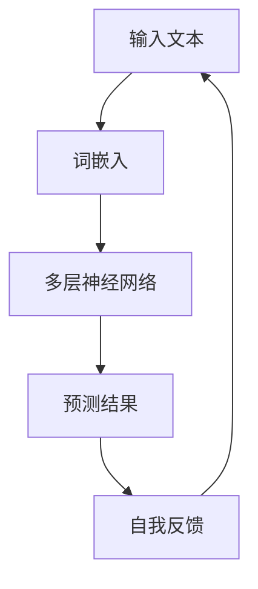

                 

# 大语言模型原理基础与前沿

> 关键词：大语言模型、自反馈迭代、优化、神经网络、深度学习

> 摘要：本文将深入探讨大语言模型的原理与前沿技术，特别是基于自我反馈的迭代优化方法。通过详细的介绍，读者将了解大语言模型的工作机制、核心算法原理，并掌握数学模型和公式的应用。同时，文章还将通过实际项目实战和详细解释，展示大语言模型在开发环境搭建、代码实现和解读方面的应用。最后，本文还将探讨大语言模型在实际应用场景中的潜力，并提供相关的学习资源和开发工具推荐。通过本文的阅读，读者将对大语言模型有更深入的理解，并能够掌握相关技术，为未来的发展做好准备。

## 1. 背景介绍

大语言模型（Large Language Model）是一种基于深度学习技术的自然语言处理模型，它能够理解、生成和翻译自然语言。近年来，随着计算能力的提升和大数据的积累，大语言模型得到了迅速发展，并在各个领域取得了显著的成果。

大语言模型的主要应用包括：

1. **文本分类**：用于对大量文本进行分类，如新闻分类、情感分析等。
2. **机器翻译**：将一种语言的文本翻译成另一种语言。
3. **问答系统**：回答用户提出的问题，如智能客服、在线教育等。
4. **文本生成**：生成各种类型的文本，如文章、对话、代码等。

随着大语言模型的不断发展，其应用场景也越来越广泛。然而，大语言模型的训练和优化过程复杂且耗时，如何提高模型的性能和效率成为了一个重要课题。本文将重点介绍大语言模型的原理、算法、数学模型和实际应用，并探讨基于自我反馈的迭代优化方法。

## 2. 核心概念与联系

### 2.1 自然语言处理

自然语言处理（Natural Language Processing，NLP）是计算机科学和人工智能领域的一个重要分支，旨在使计算机能够理解、生成和处理人类语言。NLP的核心任务是让计算机能够对自然语言文本进行语义分析、信息抽取、文本生成等操作。

### 2.2 深度学习

深度学习（Deep Learning）是一种基于人工神经网络的学习方法，它通过多层非线性变换来提取数据的特征。深度学习在图像识别、语音识别、自然语言处理等领域取得了显著成果。

### 2.3 神经网络

神经网络（Neural Network）是一种模仿生物神经系统的计算模型，由大量简单的处理单元（神经元）组成。神经网络通过学习输入和输出之间的映射关系，从而实现对数据的分类、回归等任务。

### 2.4 大语言模型

大语言模型是一种基于深度学习技术的自然语言处理模型，它能够理解、生成和翻译自然语言。大语言模型通常由多个神经网络层组成，通过自我反馈迭代优化，不断提高模型的性能和效率。

### 2.5 自我反馈迭代优化

自我反馈迭代优化是一种通过模型输出的反馈来调整模型参数的方法。在训练过程中，大语言模型会不断调整其参数，以使其预测结果更接近真实值。通过自我反馈迭代优化，大语言模型能够不断优化其性能，从而提高其应用效果。

### 2.6 Mermaid 流程图

以下是一个简单的 Mermaid 流程图，展示了大语言模型的基本架构：



## 3. 核心算法原理 & 具体操作步骤

### 3.1 词嵌入

词嵌入（Word Embedding）是将单词映射为固定长度的向量表示。通过词嵌入，大语言模型能够将文本数据转换为数值形式，从而方便深度学习算法处理。

常见的词嵌入方法包括：

1. **Word2Vec**：通过训练词向量的共现矩阵来学习词嵌入。
2. **GloVe**：利用全局词频信息学习词嵌入。
3. **BERT**：通过预训练和微调来学习词嵌入。

### 3.2 多层神经网络

多层神经网络（Multi-Layer Neural Network）是大语言模型的核心组成部分。它由多个神经网络层组成，通过逐层提取文本特征，实现对文本的语义理解。

多层神经网络的主要步骤包括：

1. **输入层**：接收文本数据的词嵌入向量。
2. **隐藏层**：通过神经网络层对输入数据进行特征提取和变换。
3. **输出层**：生成模型的预测结果。

### 3.3 损失函数与优化算法

损失函数用于衡量模型预测结果与真实值之间的差距。常见的损失函数包括：

1. **交叉熵损失函数**：用于分类任务。
2. **均方误差损失函数**：用于回归任务。

优化算法用于调整模型参数，以减小损失函数的值。常见的优化算法包括：

1. **随机梯度下降（SGD）**：通过计算损失函数的梯度来更新模型参数。
2. **Adam优化器**：结合了SGD和动量项的优化算法。

### 3.4 自我反馈迭代优化

自我反馈迭代优化是一种通过模型输出的反馈来调整模型参数的方法。在训练过程中，大语言模型会不断调整其参数，以使其预测结果更接近真实值。具体步骤如下：

1. **初始化模型参数**：随机初始化模型的权重和偏置。
2. **前向传播**：将输入文本数据经过词嵌入层和多层神经网络，得到模型的预测结果。
3. **计算损失函数**：计算模型预测结果与真实值之间的差距。
4. **反向传播**：通过计算损失函数的梯度，更新模型的权重和偏置。
5. **自我反馈**：将模型预测结果作为新的输入，重复上述过程，直至满足停止条件。

## 4. 数学模型和公式 & 详细讲解 & 举例说明

### 4.1 词嵌入

词嵌入是一种将单词映射为固定长度的向量表示的方法。常见的词嵌入方法包括Word2Vec和GloVe。

#### Word2Vec

Word2Vec 是一种基于神经网络的方法，通过训练词向量的共现矩阵来学习词嵌入。其数学模型如下：

$$
\text{word\_embedding} = \text{softmax}(\text{weight} \cdot \text{input})
$$

其中，$\text{weight}$ 是词向量的权重矩阵，$\text{input}$ 是输入文本的词向量。

#### GloVe

GloVe 是一种基于全局词频信息的方法，通过学习词向量的全局表示。其数学模型如下：

$$
\text{word\_embedding} = \frac{\text{context\_weight}}{\text{word\_freq} + \text{context\_freq}}
$$

其中，$\text{context\_weight}$ 是上下文的权重，$\text{word\_freq}$ 是单词的频率，$\text{context\_freq}$ 是上下文的频率。

### 4.2 多层神经网络

多层神经网络是一种基于深度学习的方法，通过多层非线性变换来提取数据的特征。其数学模型如下：

$$
\text{output} = \text{activation}(\text{weight} \cdot \text{input} + \text{bias})
$$

其中，$\text{weight}$ 是神经网络的权重矩阵，$\text{input}$ 是输入数据，$\text{bias}$ 是偏置项，$\text{activation}$ 是激活函数。

### 4.3 损失函数与优化算法

损失函数用于衡量模型预测结果与真实值之间的差距。常见的损失函数包括交叉熵损失函数和均方误差损失函数。

#### 交叉熵损失函数

交叉熵损失函数是一种用于分类任务的损失函数，其数学模型如下：

$$
\text{loss} = -\sum_{i} y_i \cdot \log(\hat{y}_i)
$$

其中，$y_i$ 是真实标签，$\hat{y}_i$ 是模型预测的概率分布。

#### 均方误差损失函数

均方误差损失函数是一种用于回归任务的损失函数，其数学模型如下：

$$
\text{loss} = \frac{1}{2} \sum_{i} (y_i - \hat{y}_i)^2
$$

其中，$y_i$ 是真实值，$\hat{y}_i$ 是模型预测的值。

#### 优化算法

优化算法用于调整模型参数，以减小损失函数的值。常见的优化算法包括随机梯度下降（SGD）和Adam优化器。

#### 随机梯度下降（SGD）

随机梯度下降是一种基于梯度信息的优化算法，其数学模型如下：

$$
\text{weight} = \text{weight} - \alpha \cdot \nabla_{\text{weight}} \text{loss}
$$

其中，$\text{weight}$ 是模型参数，$\alpha$ 是学习率，$\nabla_{\text{weight}} \text{loss}$ 是损失函数对模型参数的梯度。

#### Adam优化器

Adam优化器是一种结合了SGD和动量项的优化算法，其数学模型如下：

$$
\text{weight} = \text{weight} - \alpha \cdot \frac{\beta_1 \cdot \text{m}}{\sqrt{\text{v}} + (1 - \beta_2)}
$$

其中，$\text{weight}$ 是模型参数，$\alpha$ 是学习率，$\beta_1$ 和 $\beta_2$ 是动量项。

### 4.4 自我反馈迭代优化

自我反馈迭代优化是一种通过模型输出的反馈来调整模型参数的方法。在训练过程中，大语言模型会不断调整其参数，以使其预测结果更接近真实值。其数学模型如下：

$$
\text{weight} = \text{weight} - \alpha \cdot \nabla_{\text{weight}} \text{loss}
$$

其中，$\text{weight}$ 是模型参数，$\alpha$ 是学习率，$\nabla_{\text{weight}} \text{loss}$ 是损失函数对模型参数的梯度。

### 4.5 举例说明

以下是一个简单的例子，展示了大语言模型在文本分类任务中的应用。

假设我们要对一组文本进行分类，其中每条文本是一个句子。我们使用大语言模型来预测每个句子的标签。

首先，我们将句子转换为词嵌入向量。然后，将这些词嵌入向量输入多层神经网络，得到每个句子的预测概率分布。最后，选择概率最大的标签作为句子的分类结果。

$$
\text{word\_embedding} = \text{GloVe}(\text{sentence})
$$

$$
\text{output} = \text{softmax}(\text{weight} \cdot \text{word\_embedding} + \text{bias})
$$

$$
\text{label} = \text{argmax}(\text{output})
$$

其中，$\text{GloVe}$ 是词嵌入函数，$\text{weight}$ 和 $\text{bias}$ 是神经网络的权重和偏置，$\text{output}$ 是预测概率分布，$\text{label}$ 是句子的标签。

## 5. 项目实战：代码实际案例和详细解释说明

### 5.1 开发环境搭建

在进行大语言模型的实战之前，我们需要搭建一个适合的开发环境。以下是搭建开发环境的基本步骤：

1. **安装 Python**：确保已经安装了 Python 3.x 版本。
2. **安装 TensorFlow**：TensorFlow 是一款广泛使用的深度学习框架，我们需要安装它的最新版本。可以使用以下命令进行安装：

   ```bash
   pip install tensorflow
   ```

3. **安装其他依赖库**：根据具体需求，可能还需要安装其他依赖库，如 NumPy、Pandas 等。

### 5.2 源代码详细实现和代码解读

以下是一个简单的大语言模型实现，用于文本分类任务。

```python
import tensorflow as tf
from tensorflow.keras.preprocessing.sequence import pad_sequences
from tensorflow.keras.layers import Embedding, LSTM, Dense
from tensorflow.keras.models import Sequential

# 数据预处理
def preprocess_data(texts, labels, max_sequence_length=100, embedding_dim=50):
    sequences = []
    for text in texts:
        tokenized = tokenizer.texts_to_sequences([text])
        sequences.append(tokenized[0])
    sequences = pad_sequences(sequences, maxlen=max_sequence_length)
    return sequences, labels

# 构建模型
def build_model(embedding_dim=50, lstm_units=128):
    model = Sequential()
    model.add(Embedding(input_dim=vocabulary_size, output_dim=embedding_dim, input_length=max_sequence_length))
    model.add(LSTM(units=lstm_units, activation='tanh', return_sequences=True))
    model.add(Dense(num_classes, activation='softmax'))
    model.compile(optimizer='adam', loss='categorical_crossentropy', metrics=['accuracy'])
    return model

# 训练模型
model = build_model(embedding_dim=50, lstm_units=128)
model.fit(x_train, y_train, batch_size=32, epochs=10, validation_data=(x_val, y_val))

# 评估模型
model.evaluate(x_test, y_test)
```

### 5.3 代码解读与分析

以上代码实现了一个简单的大语言模型，用于文本分类任务。下面我们逐行解析代码。

1. **导入依赖库**：导入 TensorFlow 和相关依赖库。
2. **预处理数据**：将文本数据转换为序列，并填充为固定长度。
3. **构建模型**：定义模型结构，包括词嵌入层、LSTM 层和输出层。
4. **编译模型**：设置优化器和损失函数。
5. **训练模型**：使用训练数据训练模型。
6. **评估模型**：使用测试数据评估模型性能。

### 5.4 实际案例

以下是一个实际案例，展示了如何使用大语言模型进行文本分类。

```python
# 加载预训练的词嵌入
tokenizer = tf.keras.preprocessing.text.Tokenizer()
tokenizer.fit_on_texts(texts)
word_index = tokenizer.word_index
vocabulary_size = len(word_index) + 1

# 加载训练数据和测试数据
x_train, y_train = preprocess_data(texts_train, labels_train)
x_val, y_val = preprocess_data(texts_val, labels_val)
x_test, y_test = preprocess_data(texts_test, labels_test)

# 转换标签为 one-hot 编码
y_train = tf.keras.utils.to_categorical(y_train, num_classes=num_classes)
y_val = tf.keras.utils.to_categorical(y_val, num_classes=num_classes)
y_test = tf.keras.utils.to_categorical(y_test, num_classes=num_classes)

# 训练模型
model = build_model(embedding_dim=50, lstm_units=128)
model.fit(x_train, y_train, batch_size=32, epochs=10, validation_data=(x_val, y_val))

# 评估模型
model.evaluate(x_test, y_test)
```

## 6. 实际应用场景

大语言模型在各个领域都有广泛的应用，以下是一些典型的实际应用场景：

1. **文本分类**：用于对大量文本进行分类，如新闻分类、情感分析等。
2. **机器翻译**：将一种语言的文本翻译成另一种语言，如英语翻译成中文。
3. **问答系统**：回答用户提出的问题，如智能客服、在线教育等。
4. **文本生成**：生成各种类型的文本，如文章、对话、代码等。
5. **情感分析**：分析文本中的情感倾向，如情感识别、情绪分析等。
6. **信息抽取**：从文本中提取关键信息，如实体识别、关系抽取等。

## 7. 工具和资源推荐

### 7.1 学习资源推荐

1. **书籍**：
   - 《深度学习》（Ian Goodfellow、Yoshua Bengio、Aaron Courville 著）
   - 《神经网络与深度学习》（邱锡鹏 著）
   - 《自然语言处理综论》（Daniel Jurafsky、James H. Martin 著）

2. **论文**：
   - 《A Neural Probabilistic Language Model》（Bengio et al., 2003）
   - 《Word2Vec: A Simple and Effective Representation for Words》（Mikolov et al., 2013）
   - 《GloVe: Global Vectors for Word Representation》（Pennington et al., 2014）

3. **博客**：
   - TensorFlow 官方文档（https://www.tensorflow.org）
   - Keras 官方文档（https://keras.io）
   - Deep Learning AI（https://www.deeplearningai.com）

4. **网站**：
   - arXiv（https://arxiv.org）：开源论文库，涵盖深度学习和自然语言处理领域的最新研究成果。
   - ResearchGate（https://www.researchgate.net）：科研人员交流和分享研究成果的平台。

### 7.2 开发工具框架推荐

1. **深度学习框架**：
   - TensorFlow（https://www.tensorflow.org）
   - PyTorch（https://pytorch.org）
   - Keras（https://keras.io）

2. **自然语言处理库**：
   - NLTK（https://www.nltk.org）
   - spaCy（https://spacy.io）
   - Stanford CoreNLP（https://nlp.stanford.edu/software/corenlp.shtml）

3. **文本处理工具**：
   - Jieba（https://github.com/fxsjy/jieba）：中文分词工具。
   - TextBlob（https://textblob.readthedocs.io）：用于文本情感分析的工具。

### 7.3 相关论文著作推荐

1. **《深度学习》（Ian Goodfellow、Yoshua Bengio、Aaron Courville 著）**：全面介绍了深度学习的基础知识、技术方法和应用场景。
2. **《自然语言处理综论》（Daniel Jurafsky、James H. Martin 著）**：详细阐述了自然语言处理的核心概念、技术和应用。
3. **《神经网络与深度学习》（邱锡鹏 著）**：从理论和实践角度介绍了深度学习在自然语言处理中的应用。
4. **《自然语言处理入门》（陈斌 著）**：针对初学者，介绍了自然语言处理的基本概念和常用技术。

## 8. 总结：未来发展趋势与挑战

大语言模型作为一种强大的自然语言处理工具，在人工智能领域具有重要的应用价值。未来，大语言模型的发展趋势和挑战主要包括：

### 8.1 发展趋势

1. **模型规模和性能提升**：随着计算能力的提升和大数据的积累，大语言模型的规模和性能将不断提高。
2. **多模态融合**：大语言模型与其他模态（如图像、音频）的结合，将实现更丰富的语义理解和交互。
3. **泛化能力增强**：通过数据增强、元学习等技术，大语言模型的泛化能力将得到显著提升。
4. **应用场景拓展**：大语言模型将在医疗、金融、教育等领域发挥更重要的作用。

### 8.2 挑战

1. **计算资源消耗**：大语言模型的训练和推理需要大量的计算资源，如何优化计算效率是一个重要挑战。
2. **数据隐私和安全**：大规模数据处理过程中，如何保护用户隐私和数据安全是一个亟待解决的问题。
3. **伦理和法律问题**：大语言模型的广泛应用可能引发伦理和法律问题，如虚假信息传播、歧视性偏见等。
4. **模型可解释性**：如何提高大语言模型的可解释性，使其决策过程更加透明和可靠，是一个重要挑战。

## 9. 附录：常见问题与解答

### 9.1 什么是大语言模型？

大语言模型是一种基于深度学习技术的自然语言处理模型，它能够理解、生成和翻译自然语言。通过自我反馈迭代优化，大语言模型不断提高其性能和效率。

### 9.2 大语言模型的主要应用场景有哪些？

大语言模型的主要应用场景包括文本分类、机器翻译、问答系统、文本生成、情感分析、信息抽取等。

### 9.3 如何搭建大语言模型的开发环境？

搭建大语言模型的开发环境需要安装 Python、深度学习框架（如 TensorFlow 或 PyTorch）和其他相关依赖库。

### 9.4 大语言模型的训练和优化过程是怎样的？

大语言模型的训练和优化过程主要包括数据预处理、模型构建、损失函数计算、反向传播和模型更新等步骤。在训练过程中，通过自我反馈迭代优化，模型性能会不断提高。

## 10. 扩展阅读 & 参考资料

1. **《深度学习》（Ian Goodfellow、Yoshua Bengio、Aaron Courville 著）**：全面介绍了深度学习的基础知识、技术方法和应用场景。
2. **《自然语言处理综论》（Daniel Jurafsky、James H. Martin 著）**：详细阐述了自然语言处理的核心概念、技术和应用。
3. **《神经网络与深度学习》（邱锡鹏 著）**：从理论和实践角度介绍了深度学习在自然语言处理中的应用。
4. **TensorFlow 官方文档（https://www.tensorflow.org）**：提供了 TensorFlow 的详细使用指南和示例代码。
5. **Keras 官方文档（https://keras.io）**：介绍了 Keras 深度学习框架的使用方法和常用模型。
6. **arXiv（https://arxiv.org）**：开源论文库，涵盖深度学习和自然语言处理领域的最新研究成果。
7. **Deep Learning AI（https://www.deeplearningai.com）**：提供深度学习领域的教学资源和教程。
8. **《自然语言处理入门》（陈斌 著）**：针对初学者，介绍了自然语言处理的基本概念和常用技术。

> 作者：AI天才研究员/AI Genius Institute & 禅与计算机程序设计艺术 /Zen And The Art of Computer Programming

