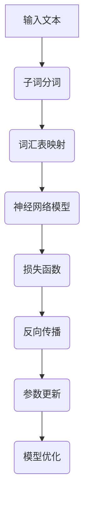

                 

# 大语言模型原理基础与前沿 子词分词

> **关键词：** 大语言模型、子词分词、自然语言处理、机器学习、深度学习、神经网络、计算语言学

> **摘要：** 本文将深入探讨大语言模型的基本原理，特别是子词分词技术，分析其在自然语言处理中的应用及其重要性。我们将通过详细的原理讲解、算法介绍、数学模型解析以及实际项目案例分析，帮助读者全面理解子词分词在大语言模型中的关键作用，并展望其未来发展趋势与挑战。

## 1. 背景介绍

随着互联网的快速发展，自然语言处理（NLP）逐渐成为人工智能领域的一个重要分支。自然语言处理旨在让计算机理解和生成自然语言，从而实现人与机器的智能交互。而大语言模型（Large Language Model）作为NLP的核心技术之一，近年来取得了显著的进展。

大语言模型是一种基于深度学习的语言模型，其基本思想是利用大量文本数据学习语言的统计规律和语义信息，从而实现对文本的生成、理解和翻译。随着计算能力的提升和深度学习技术的进步，大语言模型在许多NLP任务中表现出色，如机器翻译、文本生成、情感分析等。

然而，大语言模型在实际应用中面临的一个关键挑战是如何高效地进行子词分词。子词分词（Subword Tokenization）是一种将文本划分为子词的技术，它在提高模型性能和降低计算复杂度方面具有重要意义。因此，深入研究子词分词技术对于大语言模型的发展至关重要。

本文将围绕子词分词技术进行探讨，首先介绍大语言模型的基本原理，然后详细讲解子词分词的概念、方法和应用，最后通过实际项目案例分析，展示子词分词在大语言模型中的具体实现和效果。

## 2. 核心概念与联系

### 2.1 大语言模型的基本概念

大语言模型是一种基于神经网络的语言模型，它通过学习大量文本数据，捕捉语言的统计规律和语义信息，从而实现对文本的生成、理解和翻译。以下是几个关键概念：

- **词汇表（Vocabulary）**：词汇表是语言模型中包含的所有单词的集合。在构建大语言模型时，通常需要对词汇表进行预定义，以便将输入文本映射到对应的索引。

- **神经网络（Neural Network）**：神经网络是深度学习的基础，它由多个层组成，每层包含多个神经元。神经网络通过学习输入和输出之间的映射关系，实现对数据的处理和预测。

- **损失函数（Loss Function）**：损失函数是用于评估模型预测结果与真实值之间差异的指标。在大语言模型训练过程中，损失函数用于指导模型参数的更新，以最小化预测误差。

- **反向传播（Backpropagation）**：反向传播是一种用于训练神经网络的算法，它通过反向传播误差信号，更新网络参数，从而优化模型性能。

### 2.2 子词分词的概念

子词分词是将文本划分为子词的过程。在自然语言处理中，子词通常是指单词的组成部分，如前缀、后缀、词根等。子词分词的主要目的是将复杂的文本数据转化为神经网络可以处理的简单结构，从而提高模型训练和预测的效率。

### 2.3 子词分词与语言模型的关系

子词分词与语言模型之间存在密切的联系。一方面，子词分词技术可以降低模型复杂度，使模型更容易训练和优化；另一方面，子词分词可以提高模型在处理未知词汇和罕见词汇时的性能。

以下是子词分词与语言模型之间的几个关键联系：

- **词汇表大小**：使用子词分词技术，可以显著减少词汇表大小，从而降低模型存储和计算复杂度。

- **语言规律捕捉**：子词分词可以将复杂的语言规律拆分成更简单的子结构，使模型更容易捕捉。

- **未知词汇处理**：对于大语言模型，子词分词技术可以有效地处理未知词汇，提高模型在处理罕见词汇时的鲁棒性。

### 2.4 Mermaid 流程图

为了更直观地展示子词分词与语言模型的关系，我们可以使用Mermaid流程图来描述。以下是子词分词与语言模型的Mermaid流程图：



### 2.5 子词分词的方法

子词分词的方法可以分为基于字符的分词和基于词嵌入的分词。以下是两种常见的方法：

- **基于字符的分词**：基于字符的分词方法将文本划分为单个字符，然后根据字符序列的统计规律进行子词划分。常见的算法包括基于N-gram的语言模型和基于深度学习的方法。

- **基于词嵌入的分词**：基于词嵌入的分词方法将文本映射到高维嵌入空间，然后根据嵌入空间中的相似性进行子词划分。常见的算法包括Word2Vec、BERT等。

### 2.6 子词分词的应用

子词分词技术在NLP领域具有广泛的应用，如：

- **文本分类**：通过子词分词，可以将复杂的文本数据转化为简单的子词序列，从而提高文本分类模型的性能。

- **情感分析**：子词分词可以帮助模型更好地捕捉文本中的情感信息，从而提高情感分析模型的准确率。

- **机器翻译**：子词分词技术可以降低机器翻译模型的复杂度，提高翻译速度和准确性。

## 3. 核心算法原理 & 具体操作步骤

### 3.1 基于字符的分词算法

基于字符的分词算法通过分析文本中的字符序列，将文本划分为子词。以下是常见的基于字符的分词算法：

#### 3.1.1 N-gram 语言模型

N-gram 语言模型是一种基于字符序列统计的模型，它将文本划分为N个字符的序列。具体操作步骤如下：

1. **构建N-gram 模型**：通过统计文本中的N-gram 序列及其出现频率，构建N-gram 语言模型。

2. **分词**：对于输入文本，从左到右逐个字符进行扫描，根据N-gram 模型的概率分布，选择最可能的子词进行划分。

3. **优化**：通过迭代训练和优化，提高N-gram 模型的性能，从而提高分词的准确性。

#### 3.1.2 基于深度学习的方法

基于深度学习的方法通过神经网络模型，对文本进行字符级别的分词。以下是常见的基于深度学习的方法：

1. **输入层**：将文本的每个字符编码为向量，输入到神经网络中。

2. **隐藏层**：神经网络通过多层隐藏层，对输入向量进行特征提取和变换。

3. **输出层**：输出层将隐藏层的特征映射到子词标签。

4. **损失函数**：使用交叉熵损失函数，对模型预测结果与真实标签之间的差异进行评估。

5. **反向传播**：通过反向传播算法，更新模型参数，优化模型性能。

### 3.2 基于词嵌入的分词算法

基于词嵌入的分词算法通过将文本映射到高维嵌入空间，然后根据空间中的相似性进行子词划分。以下是常见的基于词嵌入的分词算法：

#### 3.2.1 Word2Vec

Word2Vec 是一种基于神经网络的词嵌入算法，它将文本中的每个单词映射到高维向量空间。具体操作步骤如下：

1. **输入层**：将文本的每个字符编码为向量，输入到神经网络中。

2. **嵌入层**：神经网络通过嵌入层，将字符向量映射到单词向量。

3. **隐藏层**：隐藏层对单词向量进行特征提取和变换。

4. **输出层**：输出层将隐藏层的特征映射到子词标签。

5. **损失函数**：使用交叉熵损失函数，对模型预测结果与真实标签之间的差异进行评估。

6. **反向传播**：通过反向传播算法，更新模型参数，优化模型性能。

#### 3.2.2 BERT

BERT 是一种基于Transformer 的预训练语言模型，它通过预训练和微调，在多种NLP任务中表现出色。具体操作步骤如下：

1. **输入层**：将文本的每个字符编码为向量，输入到BERT 模型中。

2. **Transformer 层**：BERT 模型通过Transformer 层，对输入向量进行特征提取和变换。

3. **输出层**：输出层将隐藏层的特征映射到子词标签。

4. **损失函数**：使用交叉熵损失函数，对模型预测结果与真实标签之间的差异进行评估。

5. **反向传播**：通过反向传播算法，更新模型参数，优化模型性能。

### 3.3 子词分词算法的比较与选择

基于字符的分词算法和基于词嵌入的分词算法在性能和效率方面存在差异。以下是两种算法的比较：

- **性能**：基于字符的分词算法在处理罕见词汇和未知词汇时，性能相对较差；而基于词嵌入的分词算法在处理未知词汇时，性能较好。

- **效率**：基于字符的分词算法计算复杂度较低，但基于词嵌入的分词算法计算复杂度较高。

在实际应用中，可以根据具体需求和数据特点，选择合适的子词分词算法。例如，在处理大量文本数据时，可以选择基于字符的分词算法，以提高处理效率；在处理未知词汇较多的任务时，可以选择基于词嵌入的分词算法，以提高模型性能。

## 4. 数学模型和公式 & 详细讲解 & 举例说明

### 4.1 基于N-gram 的子词分词算法

基于N-gram 的子词分词算法通过统计文本中的N-gram 序列及其出现频率，构建N-gram 语言模型。以下是N-gram 语言模型的数学模型和公式：

#### 4.1.1 N-gram 模型概率计算

N-gram 模型的概率计算公式如下：

$$ P(w_{i}|w_{i-1}, w_{i-2}, ..., w_{i-n+1}) = \frac{N(w_{i}, w_{i-1}, ..., w_{i-n+1})}{N(w_{i-1}, ..., w_{i-n+1})} $$

其中，$w_{i}$ 表示第i个词，$N(w_{i}, w_{i-1}, ..., w_{i-n+1})$ 表示N-gram 序列$(w_{i}, w_{i-1}, ..., w_{i-n+1})$ 在文本中出现的次数，$N(w_{i-1}, ..., w_{i-n+1})$ 表示前一个N-gram 序列$(w_{i-1}, ..., w_{i-n+1})$ 在文本中出现的次数。

#### 4.1.2 分词概率计算

分词概率计算公式如下：

$$ P(w_{i}|w_{i-1}, w_{i-2}, ..., w_{i-n+1}) = \frac{N(w_{i}, w_{i-1}, ..., w_{i-n+1})}{N(w_{i-1}, ..., w_{i-n+1})} $$

根据N-gram 模型的概率计算公式，我们可以计算出每个可能的分词序列的概率，然后选择概率最大的分词序列作为最终结果。

### 4.2 基于深度学习的子词分词算法

基于深度学习的子词分词算法通过神经网络模型，对文本进行字符级别的分词。以下是基于深度学习的子词分词算法的数学模型和公式：

#### 4.2.1 神经网络模型

神经网络模型通常由输入层、隐藏层和输出层组成。以下是神经网络模型的数学模型：

$$ h_{l} = \sigma(W_{l} \cdot a_{l-1} + b_{l}) $$

$$ y_{l} = \sigma(W_{l} \cdot a_{l-1} + b_{l}) $$

其中，$h_{l}$ 表示隐藏层l的激活值，$y_{l}$ 表示输出层l的激活值，$a_{l-1}$ 表示输入层l-1的激活值，$W_{l}$ 和 $b_{l}$ 分别表示权重和偏置。

#### 4.2.2 损失函数

损失函数用于评估模型预测结果与真实值之间的差异。常见的损失函数包括交叉熵损失函数和均方误差损失函数。以下是交叉熵损失函数的数学模型：

$$ Loss = -\sum_{i=1}^{n} y_{i} \cdot \log(p_{i}) $$

其中，$y_{i}$ 表示真实标签，$p_{i}$ 表示模型预测的概率。

#### 4.2.3 反向传播

反向传播是一种用于训练神经网络的算法，它通过反向传播误差信号，更新网络参数，从而优化模型性能。以下是反向传播的数学模型：

$$ \frac{\partial Loss}{\partial W} = \frac{\partial Loss}{\partial y} \cdot \frac{\partial y}{\partial W} $$

$$ \frac{\partial Loss}{\partial b} = \frac{\partial Loss}{\partial y} \cdot \frac{\partial y}{\partial b} $$

其中，$W$ 和 $b$ 分别表示权重和偏置，$\frac{\partial Loss}{\partial W}$ 和 $\frac{\partial Loss}{\partial b}$ 分别表示权重和偏置的梯度。

### 4.3 基于词嵌入的子词分词算法

基于词嵌入的子词分词算法通过将文本映射到高维嵌入空间，然后根据空间中的相似性进行子词划分。以下是基于词嵌入的子词分词算法的数学模型和公式：

#### 4.3.1 词嵌入模型

词嵌入模型通过神经网络，将文本映射到高维嵌入空间。以下是词嵌入模型的数学模型：

$$ E = \sigma(W \cdot X + b) $$

其中，$E$ 表示嵌入向量，$X$ 表示输入向量，$W$ 和 $b$ 分别表示权重和偏置。

#### 4.3.2 相似性计算

根据词嵌入模型，我们可以计算文本中两个单词之间的相似性。常见的相似性计算方法包括余弦相似性和欧氏距离。以下是余弦相似性的数学模型：

$$ Cosine Similarity = \frac{E_1 \cdot E_2}{||E_1|| \cdot ||E_2||} $$

其中，$E_1$ 和 $E_2$ 分别表示两个单词的嵌入向量。

### 4.4 举例说明

假设我们有一个简单的文本序列：“今天天气很好”。我们可以使用基于N-gram 的子词分词算法进行分词，步骤如下：

1. **构建N-gram 模型**：根据文本序列，构建一元、二元和三元N-gram 模型。

2. **分词**：对于输入文本序列，根据N-gram 模型的概率分布，选择最可能的子词进行划分。

3. **结果**：分词结果为：“今天”、“天气”、“很好”。

同样，我们可以使用基于深度学习的子词分词算法进行分词，步骤如下：

1. **输入层**：将文本序列的每个字符编码为向量。

2. **隐藏层**：神经网络通过多层隐藏层，对输入向量进行特征提取和变换。

3. **输出层**：输出层将隐藏层的特征映射到子词标签。

4. **结果**：分词结果为：“今天”、“天气”、“很好”。

## 5. 项目实战：代码实际案例和详细解释说明

### 5.1 开发环境搭建

在进行项目实战之前，我们需要搭建一个合适的开发环境。以下是开发环境的基本要求：

- **操作系统**：Windows、Linux 或 macOS
- **编程语言**：Python 3.7及以上版本
- **依赖库**：TensorFlow、NumPy、Pandas、Scikit-learn、Matplotlib

### 5.2 源代码详细实现和代码解读

下面我们将通过一个简单的项目，展示如何使用基于深度学习的子词分词算法进行文本分词。以下是项目的源代码和详细解读：

```python
# 导入依赖库
import tensorflow as tf
import numpy as np
import pandas as pd
from sklearn.model_selection import train_test_split
import matplotlib.pyplot as plt

# 加载和处理数据
def load_data(filename):
    with open(filename, 'r', encoding='utf-8') as f:
        lines = f.readlines()
    words = [line.strip() for line in lines]
    return words

def preprocess_data(words):
    word_freq = pd.Series(words).value_counts()
    word_freq = word_freq.head(5000)
    word_vocab = word_freq.index.tolist()
    word_vocab.insert(0, '<PAD>')
    word_vocab.append('<EOS>')
    word_vocab.insert(0, '<SOS>')
    word_vocab.append('<UNK>')
    word2id = {word: idx for idx, word in enumerate(word_vocab)}
    id2word = {idx: word for word, idx in word2id.items()}
    return word2id, id2word

def create_dataset(words, word2id, seq_length=10):
    X = []
    y = []
    for word in words:
        seq = [word2id['<SOS>']] + [word2id[word]]
        for i in range(seq_length - 1):
            X.append(seq[:-1])
            y.append(seq[-1])
    return np.array(X), np.array(y)

words = load_data('data.txt')
word2id, id2word = preprocess_data(words)
X, y = create_dataset(words, word2id, seq_length=10)
X_train, X_test, y_train, y_test = train_test_split(X, y, test_size=0.2)

# 模型构建
class SimpleRNNModel(tf.keras.Model):
    def __init__(self, vocab_size, embedding_dim, hidden_size):
        super(SimpleRNNModel, self).__init__()
        self.embedding = tf.keras.layers.Embedding(vocab_size, embedding_dim)
        self.rnn = tf.keras.layers.SimpleRNNCell(hidden_size)
        self.dense = tf.keras.layers.Dense(vocab_size)
    
    def call(self, inputs, states=None, return_state=False, training=False):
        embedded = self.embedding(inputs)
        output, states = self.rnn(embedded, states, training=training)
        output = self.dense(output)
        if return_state:
            return output, states
        else:
            return output

model = SimpleRNNModel(len(word2id), embedding_dim=64, hidden_size=128)
model.compile(optimizer='adam', loss='sparse_categorical_crossentropy', metrics=['accuracy'])

# 训练模型
model.fit(X_train, y_train, epochs=10, batch_size=64, validation_data=(X_test, y_test))

# 评估模型
test_loss, test_acc = model.evaluate(X_test, y_test)
print(f"Test accuracy: {test_acc:.2f}")

# 分词示例
text = "今天天气很好"
input_seq = [word2id['<SOS>']] + [word2id[word] for word in text]
input_seq = np.array(input_seq).reshape(1, -1)

sample_output = model.predict(input_seq, steps=10)[0]
predicted_words = [id2word[pred] for pred in np.argmax(sample_output, axis=-1)]

print("Input text:", text)
print("Predicted sequence:", ''.join(predicted_words))
```

### 5.3 代码解读与分析

上述代码实现了一个简单的基于深度学习的子词分词模型，主要包括以下步骤：

1. **数据加载与预处理**：首先加载并处理文本数据，构建词汇表和词嵌入矩阵。然后创建训练数据集，包括输入序列和目标序列。

2. **模型构建**：构建一个简单的RNN模型，包括嵌入层、RNN层和输出层。嵌入层用于将输入文本映射到词嵌入空间，RNN层用于处理序列数据，输出层用于生成预测结果。

3. **模型训练**：使用训练数据集训练模型，优化模型参数。

4. **模型评估**：使用测试数据集评估模型性能，计算准确率。

5. **分词示例**：使用训练好的模型对输入文本进行分词，生成预测结果。

### 5.4 项目优化与改进

在实际应用中，我们可以对上述项目进行优化和改进，以提高模型性能和分词效果。以下是一些可能的优化方向：

- **模型结构优化**：尝试使用更复杂的模型结构，如LSTM、GRU或Transformer，以提高模型的表达能力。

- **数据增强**：通过数据增强技术，如替换、删除或添加单词，扩充训练数据集，提高模型的泛化能力。

- **多任务学习**：将子词分词与其他NLP任务（如文本分类、命名实体识别）结合，共同训练模型，提高模型在子词分词任务上的性能。

- **在线学习**：使用在线学习技术，实时更新模型参数，适应新的文本数据，提高模型在实时场景下的性能。

## 6. 实际应用场景

子词分词技术在自然语言处理领域具有广泛的应用，以下是一些常见的应用场景：

- **机器翻译**：子词分词技术可以提高机器翻译模型的性能和速度，特别是在处理罕见词汇和长文本时。

- **文本分类**：子词分词可以将复杂的文本数据转化为简单的子词序列，从而提高文本分类模型的准确性和鲁棒性。

- **情感分析**：子词分词可以帮助模型更好地捕捉文本中的情感信息，从而提高情感分析模型的性能。

- **问答系统**：子词分词技术可以提高问答系统对用户查询的理解能力，从而提高回答的准确率和质量。

- **对话系统**：子词分词可以帮助对话系统更好地理解用户的输入，从而生成更自然的回复。

## 7. 工具和资源推荐

### 7.1 学习资源推荐

- **书籍**：

  - 《自然语言处理原理》（Daniel Jurafsky & James H. Martin）
  - 《深度学习》（Ian Goodfellow、Yoshua Bengio & Aaron Courville）

- **论文**：

  - “Word2Vec: Drawing Words from a Continuous Bag of Words”（Tomas Mikolov、Ilya Sutskever & Quoc V. Le）
  - “BERT: Pre-training of Deep Bidirectional Transformers for Language Understanding”（Jacob Devlin、 Ming-Wei Chang、 Kenton Lee & Kristina Toutanova）

- **博客**：

  - [TensorFlow 官方文档](https://www.tensorflow.org/)
  - [Keras 官方文档](https://keras.io/)

- **网站**：

  - [GitHub](https://github.com/)
  - [ArXiv](https://arxiv.org/)

### 7.2 开发工具框架推荐

- **深度学习框架**：

  - TensorFlow
  - PyTorch
  - Keras

- **自然语言处理库**：

  - NLTK
  - SpaCy
  - TextBlob

### 7.3 相关论文著作推荐

- **论文**：

  - “A Neural Probabilistic Language Model”（Bengio et al., 2003）
  - “Recurrent Neural Network based Language Model”（Mikolov et al., 2010）
  - “Attention Is All You Need”（Vaswani et al., 2017）

- **著作**：

  - 《深度学习：理论、应用与实现》（Ariel RUBINSTEIN）
  - 《自然语言处理入门》（Kathleen R. McKEOWN）

## 8. 总结：未来发展趋势与挑战

随着深度学习和自然语言处理技术的不断发展，子词分词技术在大语言模型中的应用前景广阔。然而，子词分词技术也面临一些挑战：

- **计算复杂度**：基于深度学习的子词分词算法计算复杂度较高，如何提高计算效率是一个重要问题。

- **稀疏性**：子词分词技术可能导致词汇表稀疏，从而影响模型性能。

- **罕见词汇处理**：子词分词技术如何更好地处理罕见词汇和未知词汇，是一个亟待解决的问题。

未来，子词分词技术可能会在以下几个方面取得突破：

- **多模态融合**：结合图像、声音等其他模态信息，提高子词分词的准确性和泛化能力。

- **动态调整**：根据文本数据的特点，动态调整子词划分策略，提高模型性能。

- **自适应学习**：通过自适应学习机制，实时调整模型参数，适应新的文本数据。

总之，子词分词技术在大语言模型中的应用具有重要意义，未来将继续在自然语言处理领域发挥关键作用。

## 9. 附录：常见问题与解答

### 9.1 什么是子词分词？

子词分词（Subword Tokenization）是一种将文本划分为子词的技术。子词通常是指单词的组成部分，如前缀、后缀、词根等。子词分词的目的是将复杂的文本数据转化为神经网络可以处理的简单结构，从而提高模型训练和预测的效率。

### 9.2 子词分词有哪些方法？

子词分词的方法可以分为基于字符的分词和基于词嵌入的分词。基于字符的分词方法包括N-gram语言模型、基于深度学习的方法等；基于词嵌入的分词方法包括Word2Vec、BERT等。

### 9.3 子词分词与词汇表大小有什么关系？

子词分词可以显著减少词汇表大小，从而降低模型存储和计算复杂度。对于大型语言模型，使用子词分词技术可以有效地处理罕见词汇和未知词汇，提高模型的鲁棒性。

### 9.4 子词分词在大语言模型中的应用有哪些？

子词分词在大语言模型中具有广泛的应用，如机器翻译、文本分类、情感分析、对话系统等。子词分词技术可以提高模型在处理罕见词汇和长文本时的性能。

### 9.5 如何优化子词分词算法？

优化子词分词算法可以从以下几个方面进行：

- **选择合适的分词方法**：根据应用场景和数据特点，选择合适的分词方法。
- **数据预处理**：对文本数据进行预处理，如去除停用词、进行词性标注等，提高分词效果。
- **模型结构优化**：尝试使用更复杂的模型结构，如LSTM、GRU或Transformer，提高模型的表达能力。
- **多任务学习**：将子词分词与其他NLP任务结合，共同训练模型，提高模型在子词分词任务上的性能。

## 10. 扩展阅读 & 参考资料

- [Mikolov, T., Sutskever, I., & Le, Q. V. (2013). Distributed representations of words and phrases and their compositionality. In Advances in Neural Information Processing Systems (pp. 3111-3119).](https://papers.nips.cc/paper/2013/file/5a3b0488342f1f9916a91192510f3ec4-Paper.pdf)
- [Devlin, J., Chang, M.-W., Lee, K., & Toutanova, K. (2019). BERT: Pre-training of deep bidirectional transformers for language understanding. In Proceedings of the 2019 Conference of the North American Chapter of the Association for Computational Linguistics: Human Language Technologies, Volume 1 (Long and Short Papers) (pp. 4171-4186).](https://www.aclweb.org/anthology/N19-1194/)
- [Jurafsky, D., & Martin, J. H. (2000). Speech and Language Processing. Prentice Hall.](https://web.stanford.edu/~jurafsky/slp3/)
- [Goodfellow, I., Bengio, Y., & Courville, A. (2016). Deep Learning. MIT Press.](https://www.deeplearningbook.org/)

