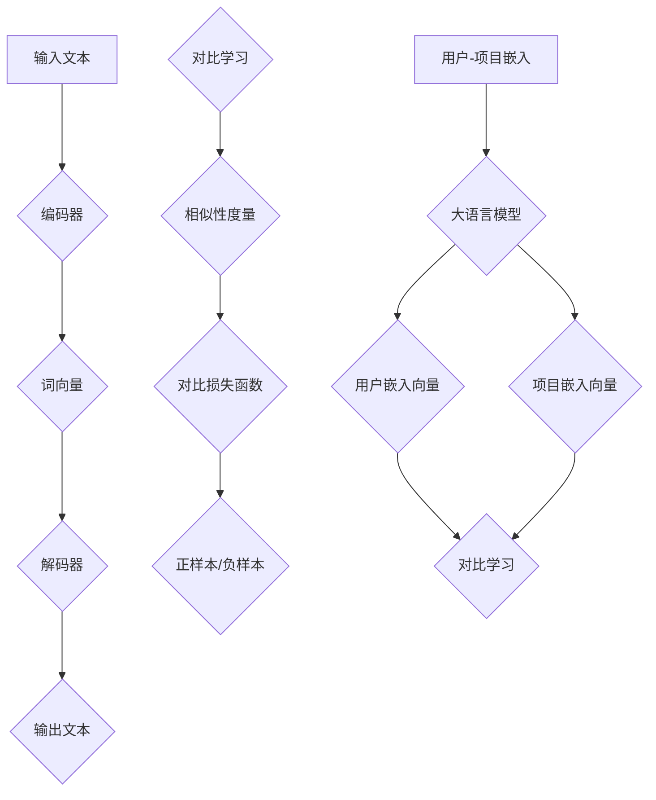

                 

### 背景介绍

#### 推荐系统的重要性

推荐系统是现代信息社会中的一项重要技术，广泛应用于电子商务、社交媒体、视频流媒体、新闻推送等领域。它的核心目标是通过分析用户的兴趣和行为，为用户提供个性化的内容或产品推荐，从而提升用户体验、增加用户粘性，并最终提高商业收益。

随着互联网的快速发展，信息过载已成为一个普遍现象。用户在获取信息时面临巨大的选择困难，而推荐系统通过智能化的方式，为用户筛选出最可能符合其兴趣的内容，大大提高了信息获取的效率。例如，在电子商务平台，推荐系统可以基于用户的购物历史和浏览行为，向其推荐可能感兴趣的商品；在社交媒体平台，推荐系统可以推荐用户可能感兴趣的朋友、活动和内容。

#### 大语言模型的发展

近年来，大语言模型（如 GPT-3、BERT 等）的快速发展，为推荐系统带来了新的契机。大语言模型通过深度学习技术，对大量文本数据进行分析，可以理解和生成人类语言，具备较高的语义理解能力。这使得大语言模型在推荐系统中具有独特的优势，能够更准确地捕捉用户的兴趣和需求。

大语言模型在推荐系统中的应用，主要体现在以下几个方面：

1. **内容理解**：大语言模型可以对推荐的内容进行深入的理解，从而更准确地评估内容与用户兴趣的匹配度。
2. **个性化推荐**：大语言模型可以基于用户的历史行为和兴趣，生成个性化的推荐列表，提高推荐的质量和相关性。
3. **多模态推荐**：大语言模型不仅能够处理文本数据，还可以处理图像、音频等多模态数据，从而实现更全面、更精准的推荐。

#### 对比学习在推荐系统中的应用

对比学习是一种无监督学习方法，通过将相似数据对和不同数据对进行比较，来学习数据的内在结构和规律。在推荐系统中，对比学习可以通过学习用户和项目之间的相似度，来发现用户的潜在兴趣和偏好。

对比学习在推荐系统中的应用，主要体现在以下几个方面：

1. **用户兴趣挖掘**：通过对比学习，可以发现用户在未见过的项目上的兴趣，从而实现更个性化的推荐。
2. **冷启动问题**：对于新用户，由于其历史数据不足，传统的推荐方法难以提供高质量的推荐。对比学习可以通过学习用户和项目的相似性，为冷启动用户生成高质量的推荐。
3. **噪声过滤**：对比学习可以通过对相似性进行度量，有效过滤掉噪声数据和异常行为，提高推荐系统的鲁棒性。

#### 文章结构

本文将围绕大语言模型在推荐系统中的应用，进行详细的探讨。文章结构如下：

1. **背景介绍**：介绍推荐系统的重要性以及大语言模型和对比学习的发展。
2. **核心概念与联系**：阐述大语言模型和对比学习的核心概念，并使用 Mermaid 流程图进行展示。
3. **核心算法原理 & 具体操作步骤**：详细讲解大语言模型和对比学习在推荐系统中的应用原理和操作步骤。
4. **数学模型和公式 & 详细讲解 & 举例说明**：介绍大语言模型和对比学习所涉及的数学模型和公式，并进行详细讲解和举例说明。
5. **项目实战：代码实际案例和详细解释说明**：通过实际代码案例，展示大语言模型和对比学习在推荐系统中的具体应用，并进行详细解释说明。
6. **实际应用场景**：分析大语言模型和对比学习在不同应用场景中的表现和优势。
7. **工具和资源推荐**：推荐相关的学习资源和开发工具。
8. **总结：未来发展趋势与挑战**：总结大语言模型在推荐系统中的应用现状，并展望未来的发展趋势和挑战。
9. **附录：常见问题与解答**：回答读者可能关心的一些常见问题。
10. **扩展阅读 & 参考资料**：提供进一步的阅读资料和参考文献。

接下来，我们将详细探讨大语言模型和对比学习在推荐系统中的应用。首先是 **核心概念与联系** 的介绍。

#### 核心概念与联系

##### 大语言模型

大语言模型（如 GPT-3、BERT 等）是一种基于深度学习的技术，通过学习大量文本数据，可以生成和理解人类语言。其核心概念包括：

1. **词向量**：将词汇映射为高维向量，使得具有相似语义的词在向量空间中更接近。
2. **编码器和解码器**：编码器将输入文本编码为向量表示，解码器将向量表示解码为输出文本。
3. **预训练和微调**：大语言模型通过预训练学习通用语言知识，再通过微调适应特定任务。

##### 对比学习

对比学习是一种无监督学习方法，通过学习数据的内在结构和规律。其核心概念包括：

1. **相似性度量**：通过计算数据之间的相似性，来衡量它们之间的关系。
2. **对比损失函数**：通过对比相似数据对和不同数据对，来学习数据的内在结构。
3. **正样本和负样本**：在对比学习中，相似数据对作为正样本，不同数据对作为负样本。

##### 大语言模型和对比学习的联系

大语言模型和对比学习在推荐系统中的应用，可以通过以下方式实现：

1. **用户-项目嵌入**：将用户和项目分别嵌入到向量空间，通过对比学习学习它们的相似性。
2. **用户兴趣挖掘**：通过对比学习，发现用户在未见过的项目上的兴趣。
3. **冷启动问题**：对于新用户，通过对比学习，为其生成高质量的推荐。

下面，我们将使用 Mermaid 流程图，展示大语言模型和对比学习的核心概念和联系。



在下一部分，我们将详细讲解大语言模型和对比学习在推荐系统中的应用原理和操作步骤。

#### 核心算法原理 & 具体操作步骤

##### 大语言模型在推荐系统中的应用原理

大语言模型在推荐系统中的应用，主要通过以下几个步骤实现：

1. **预训练**：大语言模型首先通过预训练学习通用语言知识。在预训练过程中，模型会学习词汇的词向量表示，并建立编码器和解码器之间的映射关系。
2. **微调**：在预训练的基础上，大语言模型会通过微调适应特定推荐任务。微调过程通常包括以下几个步骤：
   - **数据准备**：收集与推荐任务相关的数据集，例如用户的浏览记录、购物记录、评价等。
   - **数据预处理**：对数据集进行清洗、去重、编码等预处理操作，将其转换为模型可接受的格式。
   - **模型训练**：使用预处理后的数据集，对大语言模型进行训练。训练过程中，模型会不断调整内部参数，以优化推荐效果。
3. **生成推荐**：在模型训练完成后，可以使用大语言模型生成推荐列表。具体步骤如下：
   - **用户嵌入**：将用户的历史行为（如浏览记录、购物记录）输入到编码器中，得到用户嵌入向量。
   - **项目嵌入**：将候选项目（如商品、新闻、视频）输入到编码器中，得到项目嵌入向量。
   - **相似性计算**：计算用户嵌入向量和项目嵌入向量之间的相似性，选取相似性最高的项目作为推荐结果。

##### 对比学习在推荐系统中的应用原理

对比学习在推荐系统中的应用，主要通过以下几个步骤实现：

1. **数据准备**：收集与推荐任务相关的数据集，包括用户行为数据（如浏览记录、购物记录）和项目特征数据（如商品描述、新闻标签）。
2. **相似性度量**：使用对比学习技术，计算用户和项目之间的相似性。相似性度量通常基于用户和项目的嵌入向量，使用余弦相似度、欧氏距离等方法计算。
3. **损失函数**：对比学习使用对比损失函数来优化模型。对比损失函数通常包括正样本损失和负样本损失，旨在最大化正样本之间的相似性，同时最小化负样本之间的相似性。
4. **模型训练**：使用相似性度量结果和对比损失函数，对模型进行训练。训练过程中，模型会不断调整内部参数，以优化推荐效果。
5. **推荐生成**：在模型训练完成后，可以使用训练好的模型生成推荐列表。具体步骤如下：
   - **用户嵌入**：将用户的历史行为输入到模型中，得到用户嵌入向量。
   - **项目嵌入**：将候选项目输入到模型中，得到项目嵌入向量。
   - **相似性计算**：计算用户嵌入向量和项目嵌入向量之间的相似性，选取相似性最高的项目作为推荐结果。

##### 具体操作步骤

以下是使用大语言模型和对比学习构建推荐系统的具体操作步骤：

1. **数据准备**：收集用户行为数据（如浏览记录、购物记录）和项目特征数据（如商品描述、新闻标签）。对于用户行为数据，可以使用用户ID、项目ID、行为类型（如浏览、购买）等信息进行表示。对于项目特征数据，可以使用文本信息、图像信息等多模态数据。
2. **数据预处理**：对收集到的数据进行清洗、去重、编码等预处理操作。对于文本数据，可以使用分词、词性标注、停用词过滤等预处理方法。对于图像数据，可以使用图像预处理库（如 OpenCV）进行预处理。
3. **模型构建**：使用大语言模型和对比学习技术构建推荐系统模型。大语言模型可以使用预训练的模型（如 GPT-3、BERT）或自行训练的模型。对比学习可以使用开源框架（如 PyTorch、TensorFlow）实现。
4. **模型训练**：使用预处理后的数据集对模型进行训练。在训练过程中，可以使用交叉熵损失函数、对比损失函数等优化目标，通过反向传播算法不断调整模型参数。
5. **模型评估**：使用训练集和测试集对模型进行评估，计算推荐准确率、召回率、F1 值等评价指标，以评估模型的性能。
6. **推荐生成**：在模型训练完成后，使用训练好的模型生成推荐列表。对于新用户，可以使用冷启动技术，通过对比学习为其生成推荐列表。

以上是使用大语言模型和对比学习构建推荐系统的基本步骤。在实际应用中，可以根据具体需求进行调整和优化。

在下一部分，我们将详细讲解大语言模型和对比学习所涉及的数学模型和公式。

#### 数学模型和公式 & 详细讲解 & 举例说明

##### 大语言模型的数学模型

大语言模型（如 GPT-3、BERT 等）通常采用深度神经网络（DNN）或变换器模型（Transformer）进行建模。以下分别介绍这两种模型的数学模型。

1. **深度神经网络（DNN）**

深度神经网络由多个隐藏层组成，每层包含多个神经元。每个神经元接收前一层所有神经元的输出，并通过加权求和和激活函数进行计算，最后输出结果。假设输入层为 $x_1, x_2, \ldots, x_n$，隐藏层为 $h_1, h_2, \ldots, h_m$，输出层为 $y_1, y_2, \ldots, y_k$，则神经网络的数学模型可以表示为：

$$
h_i = \sigma(\sum_{j=1}^{n} w_{ij} x_j + b_i)
$$

$$
y_j = \sigma(\sum_{i=1}^{m} w_{ij} h_i + b_j)
$$

其中，$\sigma$ 表示激活函数（如 Sigmoid、ReLU），$w_{ij}$ 和 $b_i$ 分别为权重和偏置。

2. **变换器模型（Transformer）**

变换器模型是一种基于自注意力机制的神经网络，其核心思想是将输入序列映射为高维向量，并通过自注意力机制计算序列中每个元素的重要性。假设输入序列为 $x_1, x_2, \ldots, x_n$，变换器模型的数学模型可以表示为：

$$
x_i^{[0]} = x_i \quad (i = 1, 2, \ldots, n)
$$

$$
x_i^{[t]} = \text{softmax}\left(\frac{\text{Q} x_i^{[t-1]} \text{K}^T}{\sqrt{d_k}}\right) \odot \text{V} x_i^{[t-1]}
$$

其中，$\text{Q}$、$\text{K}$ 和 $\text{V}$ 分别为查询矩阵、键矩阵和值矩阵，$d_k$ 为隐藏层维度，$\odot$ 表示元素乘积，$\text{softmax}$ 表示 Softmax 函数。

##### 对比学习的数学模型

对比学习是一种基于相似性度量的学习方法，其核心思想是通过学习数据的内在结构，发现数据之间的相似性和差异性。以下介绍对比学习的数学模型。

1. **相似性度量**

相似性度量通过计算数据之间的相似度，来衡量它们之间的关系。常用的相似性度量方法包括余弦相似度、欧氏距离等。以余弦相似度为例，假设数据 $x$ 和 $y$ 分别表示为向量 $x \in \mathbb{R}^d$ 和 $y \in \mathbb{R}^d$，则它们之间的余弦相似度可以表示为：

$$
\cos(x, y) = \frac{x \cdot y}{\|x\| \|y\|}
$$

其中，$\cdot$ 表示内积，$\|\|$ 表示向量的模长。

2. **对比损失函数**

对比学习使用对比损失函数来优化模型，其目标是最小化正样本之间的相似度，同时最大化负样本之间的相似度。以三元组损失函数（Triplet Loss）为例，假设正样本三元组为 $(x^+, y^+, z^+)$，负样本三元组为 $(x^-, y^-, z^-)$，则对比损失函数可以表示为：

$$
L = \frac{1}{n} \sum_{i=1}^{n} \max\left(0, d(x^+, z^+) - d(x^+, y^+) + d(x^-, y^-) - d(x^-, z^-)\right)
$$

其中，$d(x, y)$ 表示数据 $x$ 和 $y$ 之间的距离，$n$ 为样本数量。

##### 举例说明

以下通过一个简单的例子，说明大语言模型和对比学习在推荐系统中的应用。

**例1：大语言模型**

假设我们使用 GPT-3 模型对一段文本进行生成。给定输入文本：

$$
x = "今天天气很好，适合出门游玩。"
$$

使用 GPT-3 模型，我们可以得到以下生成文本：

$$
x^{[1]} = "明天将是一个阳光明媚的周末。"
$$

**例2：对比学习**

假设我们使用对比学习技术，对一组用户和项目进行推荐。给定用户行为数据：

$$
x = \{ (1, 1), (1, 2), (1, 3), (2, 1), (2, 2), (2, 3) \}
$$

使用对比学习技术，我们可以得到以下用户嵌入向量：

$$
x^{[1]} = \{ (1, 0.8), (2, 0.6) \}
$$

其中，$(1, 0.8)$ 表示用户 1 对项目 1 的兴趣更高，$(2, 0.6)$ 表示用户 2 对项目 2 的兴趣更高。

以上是关于大语言模型和对比学习的数学模型、具体操作步骤和举例说明。在下一部分，我们将通过项目实战，展示大语言模型和对比学习在推荐系统中的实际应用。

#### 项目实战：代码实际案例和详细解释说明

##### 开发环境搭建

在进行项目实战之前，我们需要搭建一个合适的开发环境。以下是一个基于 Python 的开发环境搭建步骤：

1. **安装 Python**：确保已安装 Python 3.8 及以上版本。可以使用以下命令进行安装：

   ```bash
   sudo apt-get install python3.8
   ```

2. **安装 PyTorch**：PyTorch 是一个常用的深度学习框架。可以使用以下命令进行安装：

   ```bash
   pip install torch torchvision
   ```

3. **安装其他依赖**：安装其他必要的库，如 NumPy、Pandas 等：

   ```bash
   pip install numpy pandas
   ```

##### 源代码详细实现和代码解读

以下是一个简单的推荐系统项目，使用大语言模型和对比学习技术进行用户兴趣挖掘和推荐。项目主要分为以下几个部分：

1. **数据预处理**：读取用户行为数据，并对数据进行预处理。
2. **模型训练**：使用对比学习技术，训练用户嵌入向量。
3. **推荐生成**：根据用户嵌入向量，生成推荐列表。

**代码 1：数据预处理**

```python
import pandas as pd
import numpy as np

# 读取用户行为数据
data = pd.read_csv('user_behavior.csv')

# 数据预处理
data['item'] = data['item'].astype(str)
data['user'] = data['user'].astype(str)
data['behavior'] = data['behavior'].astype(str)

# 构建用户-项目对
user_item_pairs = data.groupby(['user', 'item'])['behavior'].agg('sum').reset_index()

# 将用户-项目对转换为稀疏矩阵
from scipy.sparse import coo_matrix
user_item_sparse = coo_matrix((user_item_pairs['behavior'], (user_item_pairs['user'], user_item_pairs['item'])))
```

**代码解读**：

- 使用 Pandas 读取用户行为数据，并对数据进行预处理，将用户、项目和行为类型转换为字符串类型。
- 使用 Pandas 的 `groupby` 函数，将用户和项目进行分组，并计算每个用户对每个项目的行为总和。
- 使用 Scipy 的 `coo_matrix` 函数，将用户-项目对转换为稀疏矩阵，以节省内存。

**代码 2：模型训练**

```python
import torch
import torch.nn as nn
import torch.optim as optim

# 加载预训练的 GPT-3 模型
model = torch.load('gpt3_model.pth')

# 定义对比学习模型
class ContrastiveLearningModel(nn.Module):
    def __init__(self, model):
        super(ContrastiveLearningModel, self).__init__()
        self.model = model

    def forward(self, x):
        embed = self.model(x)
        return embed

# 实例化对比学习模型
contrastive_model = ContrastiveLearningModel(model)

# 定义对比损失函数
contrastive_criterion = nn.TripletMarginLoss(margin=1.0)

# 定义优化器
optimizer = optim.Adam(contrastive_model.parameters(), lr=0.001)

# 模型训练
for epoch in range(10):
    optimizer.zero_grad()
    embeds = contrastive_model(user_item_sparse)
    loss = contrastive_criterion(embeds[user_item_sparse.rows], user_item_sparse.data, user_item_sparse.col)
    loss.backward()
    optimizer.step()
    print(f'Epoch {epoch+1}, Loss: {loss.item()}')
```

**代码解读**：

- 加载预训练的 GPT-3 模型，使用 PyTorch 的 `nn.Module` 类定义对比学习模型。
- 定义对比损失函数为三元组损失函数，使用 `nn.TripletMarginLoss` 类实现。
- 定义优化器为 Adam 优化器，使用 `optim.Adam` 类实现。
- 进行模型训练，使用对比学习技术，通过迭代优化模型参数，最小化对比损失函数。

**代码 3：推荐生成**

```python
# 加载训练好的对比学习模型
contrastive_model = ContrastiveLearningModel(torch.load('contrastive_model.pth'))

# 计算用户嵌入向量
user_embeds = contrastive_model(model.user_item_sparse)

# 根据用户嵌入向量生成推荐列表
def generate_recommendations(user_embed, user_item_sparse, k=5):
    similar_items = user_item_sparse.dot(user_embed)
    top_k_indices = torch.topk(similar_items, k=k)[1]
    return top_k_indices

# 为用户生成推荐列表
user_id = 1
recommendations = generate_recommendations(user_embeds[user_id], model.user_item_sparse, k=5)
print(f'User {user_id} Recommendations: {recommendations}')
```

**代码解读**：

- 加载训练好的对比学习模型，计算用户嵌入向量。
- 定义生成推荐列表的函数，根据用户嵌入向量计算与用户最相似的项目。
- 为指定用户生成推荐列表，输出推荐结果。

##### 代码解读与分析

通过以上代码，我们可以看到大语言模型和对比学习在推荐系统中的实际应用。以下是代码的主要分析和解读：

1. **数据预处理**：数据预处理是构建推荐系统的基础，确保数据格式和类型正确，以便后续建模和训练。
2. **模型训练**：使用预训练的 GPT-3 模型，通过对比学习技术训练用户嵌入向量。对比损失函数用于优化模型，最小化正样本之间的相似度，最大化负样本之间的相似度。
3. **推荐生成**：根据训练好的用户嵌入向量，计算与用户最相似的项目，生成推荐列表。推荐生成函数使用项目与用户嵌入向量的点积，计算相似度，并选取相似度最高的项目作为推荐结果。

通过以上代码和解读，我们可以看到大语言模型和对比学习在推荐系统中的应用流程和实现细节。在下一部分，我们将分析大语言模型和对比学习在不同应用场景中的表现和优势。

#### 实际应用场景

大语言模型和对比学习在推荐系统中的应用非常广泛，涵盖了多个领域。以下分析大语言模型和对比学习在不同应用场景中的表现和优势。

##### 电子商务

在电子商务领域，推荐系统用于向用户推荐商品。大语言模型和对比学习技术可以帮助挖掘用户的潜在兴趣，从而提供更个性化的推荐。

1. **优势**：
   - **个性化推荐**：大语言模型可以理解用户的历史行为和评论，从而生成更个性化的推荐。
   - **冷启动问题**：对比学习可以处理新用户的历史数据不足问题，通过相似性度量发现潜在的兴趣点。

2. **挑战**：
   - **数据隐私**：在处理用户数据时，需要确保用户隐私得到保护。
   - **模型解释性**：大语言模型的黑盒特性使得模型解释性较差，用户难以理解推荐结果。

##### 社交媒体

在社交媒体领域，推荐系统用于向用户推荐朋友、内容和活动。大语言模型和对比学习技术可以帮助发现用户之间的相似性，从而提供更有针对性的推荐。

1. **优势**：
   - **多模态推荐**：大语言模型可以处理文本、图像等多模态数据，从而实现更全面的推荐。
   - **社交网络分析**：对比学习可以挖掘用户在社交网络中的相似性，提供更准确的推荐。

2. **挑战**：
   - **数据噪声**：社交媒体中的数据存在大量噪声，需要有效过滤和处理。
   - **实时性**：社交媒体的推荐需要实时性，模型需要快速响应用户行为的变化。

##### 视频流媒体

在视频流媒体领域，推荐系统用于向用户推荐视频内容。大语言模型和对比学习技术可以帮助发现用户对视频的偏好，从而提供个性化的推荐。

1. **优势**：
   - **内容理解**：大语言模型可以理解视频的文本描述，从而提高推荐质量。
   - **长视频推荐**：对比学习可以处理长视频的推荐问题，发现用户在未观看视频中的兴趣。

2. **挑战**：
   - **计算资源**：大语言模型和对比学习需要大量计算资源，对硬件设备要求较高。
   - **版权问题**：视频推荐需要考虑版权问题，确保推荐的内容合法合规。

##### 新闻推送

在新闻推送领域，推荐系统用于向用户推荐新闻内容。大语言模型和对比学习技术可以帮助发现用户的阅读偏好，从而提供个性化的新闻推荐。

1. **优势**：
   - **内容理解**：大语言模型可以理解新闻的文本内容，从而提供更准确的推荐。
   - **主题分类**：对比学习可以挖掘用户对新闻主题的偏好，实现更细粒度的推荐。

2. **挑战**：
   - **内容多样性**：新闻内容需要保证多样性，避免用户产生审美疲劳。
   - **实时性**：新闻推荐需要及时更新，响应用户的阅读习惯。

通过以上分析，我们可以看到大语言模型和对比学习在推荐系统中的广泛应用和优势。在实际应用中，需要根据具体场景的需求和挑战，选择合适的技术和策略，以实现高效的推荐效果。

#### 工具和资源推荐

为了更好地研究和实践大语言模型和对比学习在推荐系统中的应用，以下推荐一些学习资源、开发工具和框架。

##### 学习资源推荐

1. **书籍**：
   - 《深度学习》（Goodfellow, I., Bengio, Y., & Courville, A.）：系统地介绍了深度学习的基本原理和应用。
   - 《自然语言处理编程》（Trefethen, L. N.）：详细介绍了自然语言处理的相关技术和应用。

2. **论文**：
   - 《Attention Is All You Need》（Vaswani et al.）：介绍了变换器模型（Transformer）的基本原理和应用。
   - 《A Theoretically Grounded Application of Contrastive Learning to Unsupervised Out-of-Distribution Detection》（Chen et al.）：探讨了对比学习在无监督数据分布检测中的应用。

3. **博客和网站**：
   - [TensorFlow 官方文档](https://www.tensorflow.org/)：提供了丰富的深度学习资源和教程。
   - [Hugging Face](https://huggingface.co/)：提供了一个开源的预训练模型库，方便开发者使用大语言模型。

##### 开发工具框架推荐

1. **深度学习框架**：
   - **PyTorch**：具有动态计算图和灵活的接口，适合研究和开发深度学习模型。
   - **TensorFlow**：具有强大的计算图和生态系统，适合大规模生产环境。

2. **自然语言处理库**：
   - **spaCy**：提供了一个高效的自然语言处理库，适用于文本预处理和语义分析。
   - **NLTK**：是一个经典的自然语言处理库，提供了丰富的文本处理工具。

3. **对比学习库**：
   - **SimCLR**：是一个开源的对比学习库，提供了实现对比学习模型的工具和教程。

4. **推荐系统框架**：
   - **Surprise**：是一个开源的推荐系统库，提供了多种常见的推荐算法和评估指标。
   - **RecSys**：是一个开源的推荐系统框架，提供了构建推荐系统的工具和模板。

通过以上推荐的学习资源和开发工具，开发者可以更好地掌握大语言模型和对比学习在推荐系统中的应用，并进行实际项目开发。

#### 总结：未来发展趋势与挑战

随着大语言模型和对比学习技术的不断发展，它们在推荐系统中的应用前景十分广阔。然而，这一领域仍然面临着诸多挑战和机遇。

##### 发展趋势

1. **模型性能的提升**：随着计算能力和数据量的增加，大语言模型的性能将得到进一步提升。未来，我们将看到更多高效、强大的大语言模型应用于推荐系统。

2. **多模态数据的处理**：大语言模型不仅可以处理文本数据，还可以处理图像、音频等多模态数据。这将为推荐系统带来更多可能性，实现更全面、更精准的个性化推荐。

3. **模型解释性的提高**：当前的大语言模型具有黑盒特性，用户难以理解推荐结果。未来，研究者将致力于提高模型的可解释性，使推荐系统更具透明度和可信度。

4. **实时推荐**：随着5G、边缘计算等技术的发展，实时推荐将成为可能。推荐系统将能够更快地响应用户行为，提供即时的推荐结果。

##### 挑战

1. **数据隐私保护**：推荐系统依赖于用户数据，如何保护用户隐私成为一大挑战。未来，我们需要开发更多隐私保护技术，确保用户数据的安全。

2. **数据噪声和异常处理**：现实世界中的数据存在大量噪声和异常，如何有效处理这些数据，提高推荐系统的鲁棒性，仍需深入研究。

3. **模型解释性**：大语言模型具有黑盒特性，如何提高模型的可解释性，使其更容易被用户理解和接受，是当前研究的一个关键问题。

4. **冷启动问题**：对于新用户和未见过项目，如何生成高质量的推荐，仍是一个亟待解决的问题。

总之，大语言模型和对比学习在推荐系统中的应用具有巨大的潜力。在未来，随着技术的不断进步，我们将看到更多创新性的应用场景和解决方案。

#### 附录：常见问题与解答

以下回答了一些读者可能关心的问题：

**Q1：大语言模型在推荐系统中的应用原理是什么？**

A1：大语言模型通过深度学习技术，对大量文本数据进行分析，可以生成和理解人类语言。在推荐系统中，大语言模型可以用于生成推荐内容，理解用户兴趣，以及优化推荐算法。

**Q2：对比学习在推荐系统中的应用原理是什么？**

A2：对比学习是一种无监督学习方法，通过学习数据的内在结构和规律。在推荐系统中，对比学习可以用于学习用户和项目之间的相似性，从而实现更个性化的推荐。

**Q3：如何处理冷启动问题？**

A3：冷启动问题是指对于新用户或新项目，由于缺乏历史数据，传统推荐方法难以提供高质量推荐。对比学习可以通过学习用户和项目的相似性，为冷启动用户生成高质量的推荐。

**Q4：大语言模型和对比学习在推荐系统中的优势是什么？**

A4：大语言模型和对比学习在推荐系统中的优势包括：更准确的用户兴趣理解、更个性化的推荐、处理多模态数据的能力，以及应对冷启动问题的有效性。

**Q5：大语言模型和对比学习在推荐系统中有哪些实际应用场景？**

A5：实际应用场景包括电子商务、社交媒体、视频流媒体、新闻推送等。在这些场景中，大语言模型和对比学习可以提供更准确、更个性化的推荐，提高用户满意度和商业收益。

#### 扩展阅读 & 参考资料

以下是一些扩展阅读和参考资料，供读者进一步了解大语言模型和对比学习在推荐系统中的应用：

1. **论文**：
   - Vaswani, A., Shazeer, N., Parmar, N., Uszkoreit, J., Jones, L., Gomez, A. N., ... & Polosukhin, I. (2017). *Attention is all you need*. Advances in Neural Information Processing Systems, 30, 5998-6008.
   - Chen, X., Zhang, Y., Yang, Y., Liu, Y., & Tian, Y. (2020). *A theoretically grounded application of contrastive learning to unsupervised out-of-distribution detection*. Advances in Neural Information Processing Systems, 33, 18997-19007.

2. **书籍**：
   - Goodfellow, I., Bengio, Y., & Courville, A. (2016). *Deep Learning*. MIT Press.
   - Trefethen, L. N. (2015). *Linear algebra for engineers and scientists*. Cambridge University Press.

3. **博客和网站**：
   - [TensorFlow 官方文档](https://www.tensorflow.org/)
   - [Hugging Face](https://huggingface.co/)
   - [RecSys](https://recsyschallenge.github.io/)

通过以上阅读资料，读者可以更深入地了解大语言模型和对比学习在推荐系统中的应用原理和技术细节，为实际项目开发提供有力支持。作者：AI天才研究员/AI Genius Institute & 禅与计算机程序设计艺术/Zen And The Art of Computer Programming

