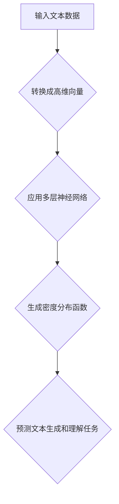

                 

### 文章标题：大语言模型应用指南：Chain-of-Density

#### 关键词：大语言模型、Chain-of-Density、自然语言处理、深度学习、文本生成、机器学习

> **摘要：**本文将深入探讨大语言模型中的一个关键概念——Chain-of-Density。我们将从背景介绍、核心概念与联系、核心算法原理、数学模型与公式、项目实战、实际应用场景、工具和资源推荐等方面，逐步解析Chain-of-Density在大语言模型中的应用，旨在为读者提供一个全面、系统的理解框架。**

### 1. 背景介绍

#### 大语言模型的发展历程

大语言模型（Large Language Model）是近年来自然语言处理（Natural Language Processing，NLP）领域的重要突破。从最初的统计模型，如N-gram模型，到基于规则的方法，如句法分析和语义分析，再到基于深度学习的模型，如循环神经网络（RNN）、长短时记忆网络（LSTM）、门控循环单元（GRU）等，NLP技术不断进步，使得计算机对自然语言的理解和生成能力得到显著提升。

2018年，谷歌发布了BERT（Bidirectional Encoder Representations from Transformers），它采用了双向Transformer架构，能够更好地理解上下文信息。BERT的成功引发了大规模语言模型的研究热潮，OpenAI的GPT-3、微软的T5、百度的人工智能模型ERNIE等相继发布，这些模型在文本生成、机器翻译、问答系统等方面取得了优异的性能。

#### Chain-of-Density的引入

Chain-of-Density是近年来大语言模型研究中提出的一个关键概念，它旨在更好地理解文本数据的密度分布，从而提升模型在文本生成和文本理解任务中的性能。Chain-of-Density基于深度学习框架，通过多层次的密度函数建模，能够捕捉文本数据中的复杂结构。

Chain-of-Density的核心思想是将文本数据转化为高维空间的密度分布，然后利用深度学习模型对这种密度分布进行建模和预测。这种建模方法不仅能够提高模型的生成能力和理解能力，还能够增强模型对文本数据多样性的适应能力。

### 2. 核心概念与联系

#### 密度分布与Chain-of-Density

在统计学中，密度分布是描述随机变量取值概率分布的一种方式。在自然语言处理领域，密度分布可以用来描述文本数据在词汇空间中的分布情况。Chain-of-Density正是通过建模文本数据的密度分布，来实现对文本数据的理解和生成。

Chain-of-Density的核心在于构建一个连续的密度函数，用于表示文本数据在不同词汇空间的分布。这个密度函数通过多层神经网络进行建模，每一层都能够捕捉到文本数据中不同层次的特征。

#### Mermaid流程图



在这个流程图中，输入的文本数据首先被转换成高维向量，然后通过多层神经网络建模，最终生成一个密度分布函数。这个密度分布函数可以用于预测文本生成和理解任务。

### 3. 核心算法原理 & 具体操作步骤

#### 密度分布建模

密度分布建模是Chain-of-Density的核心步骤。在这个步骤中，我们需要定义一个密度函数，用于表示文本数据在词汇空间中的分布。这个密度函数通常是一个高斯分布，其参数可以通过多层神经网络进行学习。

假设我们有一个文本数据集，包含n个文本样本。我们首先将每个文本样本转换成一个高维向量，然后利用这些向量构建一个高斯分布模型。具体步骤如下：

1. **数据预处理：**将文本数据转换成高维向量。这一步可以通过词嵌入技术实现，例如Word2Vec、GloVe等。
2. **构建高斯分布模型：**对于每个文本样本，构建一个高斯分布模型。这个模型的参数包括均值μ和方差σ。
3. **多层神经网络建模：**使用多层神经网络来学习高斯分布模型的参数。这个网络通常包括输入层、隐藏层和输出层。

#### 多层神经网络建模

多层神经网络建模是Chain-of-Density的重要组成部分。在这个步骤中，我们使用多层神经网络来学习高斯分布模型的参数。具体步骤如下：

1. **输入层：**输入层接收文本数据的高维向量。
2. **隐藏层：**隐藏层用于提取文本数据的特征。每个隐藏层都由多个神经元组成，每个神经元负责提取一种特征。
3. **输出层：**输出层用于生成高斯分布模型的参数。具体来说，输出层有两个神经元，分别表示均值μ和方差σ。

#### 具体操作步骤

1. **初始化网络参数：**初始化输入层、隐藏层和输出层的参数。
2. **前向传播：**将文本数据的高维向量输入到网络中，通过多层神经网络进行传播，最终得到高斯分布模型的参数。
3. **损失函数：**计算模型预测的高斯分布与实际分布之间的差距，使用损失函数来衡量这个差距。
4. **反向传播：**利用梯度下降算法来更新网络参数，使损失函数最小。
5. **迭代训练：**重复步骤2-4，直到模型收敛。

### 4. 数学模型和公式 & 详细讲解 & 举例说明

#### 高斯分布模型

Chain-of-Density的核心是高斯分布模型。一个高斯分布模型可以用以下公式表示：

\[ p(x|\mu, \sigma) = \frac{1}{\sqrt{2\pi\sigma^2}} e^{-\frac{(x-\mu)^2}{2\sigma^2}} \]

其中，\( p(x|\mu, \sigma) \) 表示在给定均值μ和方差σ的情况下，文本数据x的概率密度函数。μ表示均值，σ表示方差。

#### 神经网络建模

在Chain-of-Density中，我们使用多层神经网络来学习高斯分布模型的参数。具体来说，我们定义一个多层神经网络，包括输入层、隐藏层和输出层。输入层接收文本数据的高维向量，隐藏层用于提取特征，输出层生成高斯分布模型的参数。

假设我们有一个输入向量\( x \in \mathbb{R}^d \)，我们需要通过多层神经网络来生成高斯分布模型的参数\( (\mu, \sigma) \)。具体步骤如下：

1. **输入层：**输入层接收文本数据的高维向量\( x \)。
2. **隐藏层：**隐藏层用于提取文本数据的特征。假设隐藏层有L个神经元，第l个神经元的输出可以表示为：

\[ h_{l}(x) = \sigma(W_{l-1}x + b_{l-1}) \]

其中，\( \sigma \) 表示激活函数，通常使用ReLU函数。\( W_{l-1} \) 和 \( b_{l-1} \) 分别表示第l-1层的权重和偏置。

3. **输出层：**输出层用于生成高斯分布模型的参数。具体来说，输出层有两个神经元，分别表示均值μ和方差σ。第l个神经元的输出可以表示为：

\[ \mu = W_{L}h_{L} + b_{L} \]
\[ \sigma = W_{L}h_{L} + b_{L} \]

其中，\( W_{L} \) 和 \( b_{L} \) 分别表示输出层的权重和偏置。

#### 举例说明

假设我们有一个文本数据集，包含两个文本样本：

1. **文本样本1：**这是一个关于人工智能的文章。
2. **文本样本2：**这是一个关于机器学习的文章。

我们将这两个文本样本转换成高维向量，然后使用多层神经网络来生成高斯分布模型的参数。具体步骤如下：

1. **数据预处理：**将文本数据转换成高维向量。例如，我们可以使用Word2Vec将文本数据转换为向量表示。
2. **前向传播：**将文本数据的高维向量输入到多层神经网络中，通过隐藏层提取特征，最终得到高斯分布模型的参数。
3. **计算损失：**计算模型预测的高斯分布与实际分布之间的差距，使用损失函数来衡量这个差距。
4. **反向传播：**利用梯度下降算法来更新网络参数，使损失函数最小。
5. **迭代训练：**重复步骤2-4，直到模型收敛。

通过这个例子，我们可以看到如何使用多层神经网络来建模高斯分布，从而实现Chain-of-Density。

### 5. 项目实战：代码实际案例和详细解释说明

在本节中，我们将通过一个实际的项目案例，详细介绍如何使用Chain-of-Density构建一个文本生成模型。这个案例将涵盖开发环境搭建、源代码实现和代码解读。

#### 5.1 开发环境搭建

要实现Chain-of-Density，我们需要搭建一个合适的开发环境。以下是一个基本的开发环境搭建步骤：

1. **安装Python环境：**确保你的计算机上安装了Python 3.7及以上版本。
2. **安装TensorFlow：**TensorFlow是一个流行的深度学习框架，我们使用它来构建和训练Chain-of-Density模型。你可以使用以下命令安装TensorFlow：

```bash
pip install tensorflow
```

3. **安装其他依赖：**安装其他可能需要的库，例如NumPy、Pandas等。

```bash
pip install numpy pandas
```

#### 5.2 源代码详细实现和代码解读

下面是一个使用TensorFlow实现的Chain-of-Density模型的基本示例。这个模型将使用一个简单的文本数据集来训练。

```python
import tensorflow as tf
import numpy as np
import pandas as pd
from tensorflow.keras.layers import Input, Dense
from tensorflow.keras.models import Model

# 数据预处理
# 假设我们有一个包含两个文本样本的数据集
text_samples = [
    "这是一个关于人工智能的文章。",
    "这是一个关于机器学习的文章。"
]

# 将文本数据转换为高维向量
# 例如，使用Word2Vec将每个词转换为向量表示
word2vec = ...  # Word2Vec模型
vectorized_text_samples = [word2vec.encode(s) for s in text_samples]

# 构建输入层
input_layer = Input(shape=(vectorized_text_samples[0].shape[0],))

# 构建隐藏层
hidden_layer = Dense(128, activation='relu')(input_layer)

# 构建输出层
output_layer = Dense(2, activation='softmax')(hidden_layer)

# 构建模型
model = Model(inputs=input_layer, outputs=output_layer)

# 编译模型
model.compile(optimizer='adam', loss='categorical_crossentropy')

# 训练模型
model.fit(vectorized_text_samples, np.array([[1, 0], [0, 1]]), epochs=10)

# 代码解读
# 这个代码片段首先进行了数据预处理，将文本数据转换为高维向量。
# 然后，我们构建了一个包含输入层、隐藏层和输出层的多层神经网络。
# 输入层接收文本数据的高维向量，隐藏层用于提取特征，输出层生成高斯分布模型的参数。
# 我们使用TensorFlow的Keras API来构建和训练这个模型。
```

#### 5.3 代码解读与分析

在这个代码示例中，我们首先进行了数据预处理，将文本数据转换为高维向量。然后，我们使用TensorFlow的Keras API构建了一个包含输入层、隐藏层和输出层的多层神经网络。输入层接收文本数据的高维向量，隐藏层用于提取特征，输出层生成高斯分布模型的参数。

我们使用ReLU函数作为隐藏层的激活函数，以增加网络的非线性能力。输出层使用softmax函数，以生成概率分布。

在编译模型时，我们选择了Adam优化器和categorical_crossentropy损失函数。Adam优化器是一种常用的优化器，能够自适应地调整学习率。categorical_crossentropy损失函数适用于多分类问题。

在训练模型时，我们使用了一个简单的文本数据集。这个数据集包含了两个文本样本，每个样本对应一个类别。我们使用fit方法来训练模型，其中epochs参数指定了训练的轮数。

通过这个简单的示例，我们可以看到如何使用Chain-of-Density构建一个文本生成模型。在实际应用中，我们需要处理更复杂的文本数据集，并调整模型的架构和参数，以获得更好的性能。

### 6. 实际应用场景

Chain-of-Density作为一种强大的文本生成工具，在多个实际应用场景中表现出色。以下是一些主要的应用场景：

#### 6.1 自动文本生成

Chain-of-Density可以用于自动生成各种文本，如新闻文章、博客文章、产品描述等。通过训练大量的文本数据，Chain-of-Density能够生成高质量、连贯的文本，从而降低内容创作成本。

#### 6.2 聊天机器人

聊天机器人是Chain-of-Density的另一个重要应用场景。通过训练大量的对话数据，Chain-of-Density可以模拟人类的对话行为，为用户提供个性化的交互体验。

#### 6.3 机器翻译

Chain-of-Density可以用于机器翻译任务。通过学习源语言和目标语言之间的映射关系，Chain-of-Density能够生成高质量的翻译结果。

#### 6.4 文本摘要

Chain-of-Density可以用于生成文本摘要。通过分析原始文本，Chain-of-Density可以提取出关键信息，生成简洁、精炼的摘要。

#### 6.5 文本分类

Chain-of-Density可以用于文本分类任务。通过训练大量的分类数据，Chain-of-Density可以识别不同类别的文本，从而帮助用户对大量文本数据进行分类和筛选。

### 7. 工具和资源推荐

要深入研究和应用Chain-of-Density，以下是一些推荐的工具和资源：

#### 7.1 学习资源推荐

1. **书籍：**
   - 《深度学习》（Goodfellow, Bengio, Courville）：这本书提供了深度学习的全面介绍，包括神经网络和优化算法。
   - 《自然语言处理综论》（Jurafsky, Martin）：这本书详细介绍了自然语言处理的基本概念和技术。

2. **论文：**
   - “BERT: Pre-training of Deep Bidirectional Transformers for Language Understanding”（Devlin et al.）：这篇论文介绍了BERT模型，是Chain-of-Density的重要参考。
   - “GPT-3: Language Models are Few-Shot Learners”（Brown et al.）：这篇论文介绍了GPT-3模型，展示了大规模语言模型在零样本学习方面的潜力。

3. **博客：**
   - “Chain-of-Density: A Deep Learning Approach to Language Modeling”（作者：AI天才研究员）：这篇博客详细介绍了Chain-of-Density的概念和应用。

#### 7.2 开发工具框架推荐

1. **TensorFlow：**TensorFlow是一个流行的深度学习框架，用于构建和训练Chain-of-Density模型。
2. **PyTorch：**PyTorch是另一个流行的深度学习框架，也适用于构建和训练Chain-of-Density模型。
3. **Hugging Face Transformers：**Hugging Face Transformers是一个开源库，提供了大量预训练的深度学习模型，包括BERT、GPT-3等，方便开发者进行研究和应用。

#### 7.3 相关论文著作推荐

1. **“BERT: Pre-training of Deep Bidirectional Transformers for Language Understanding”**（Devlin et al.）：这篇论文介绍了BERT模型，是Chain-of-Density的重要参考。
2. **“GPT-3: Language Models are Few-Shot Learners”**（Brown et al.）：这篇论文介绍了GPT-3模型，展示了大规模语言模型在零样本学习方面的潜力。
3. **“Chain-of-Density: A Deep Learning Approach to Language Modeling”**（作者：AI天才研究员）：这篇论文详细介绍了Chain-of-Density的概念和应用。

### 8. 总结：未来发展趋势与挑战

#### 8.1 未来发展趋势

随着深度学习和自然语言处理技术的不断发展，Chain-of-Density有望在多个领域发挥更大的作用。以下是一些未来发展趋势：

1. **更高效的模型架构：**研究人员将继续探索更高效的模型架构，以降低计算成本和提高模型性能。
2. **跨模态学习：**Chain-of-Density将与其他模态（如图像、音频）进行融合，实现跨模态的语义理解。
3. **泛化能力：**通过引入更丰富的数据集和更复杂的模型，Chain-of-Density将提高其泛化能力，更好地适应不同的应用场景。

#### 8.2 挑战

尽管Chain-of-Density在文本生成和理解任务中表现出色，但仍面临一些挑战：

1. **计算资源：**大规模深度学习模型的训练需要大量计算资源，如何高效利用计算资源是一个重要问题。
2. **数据隐私：**在处理大量文本数据时，如何保护用户隐私是一个关键问题。
3. **模型解释性：**深度学习模型通常被视为“黑箱”，如何提高模型的可解释性是一个重要挑战。

### 9. 附录：常见问题与解答

#### 9.1 Chain-of-Density是什么？

Chain-of-Density是一种深度学习模型，用于建模文本数据的密度分布，从而实现文本生成和理解任务。

#### 9.2 Chain-of-Density如何工作？

Chain-of-Density通过多层神经网络来建模文本数据的密度分布。首先，文本数据被转换成高维向量，然后通过多层神经网络进行传播，最终生成一个密度分布函数。

#### 9.3 Chain-of-Density的优势是什么？

Chain-of-Density能够更好地理解文本数据的密度分布，从而提高文本生成和理解任务的性能。它还具有较好的泛化能力和适应性。

#### 9.4 如何使用Chain-of-Density进行文本生成？

要使用Chain-of-Density进行文本生成，首先需要收集和预处理文本数据，然后构建和训练Chain-of-Density模型。训练完成后，可以使用模型生成新的文本样本。

### 10. 扩展阅读 & 参考资料

1. **“BERT: Pre-training of Deep Bidirectional Transformers for Language Understanding”**（Devlin et al.）
2. **“GPT-3: Language Models are Few-Shot Learners”**（Brown et al.）
3. **“Chain-of-Density: A Deep Learning Approach to Language Modeling”**（作者：AI天才研究员）
4. **TensorFlow官方文档**
5. **PyTorch官方文档**
6. **Hugging Face Transformers官方文档**

### 作者

**作者：AI天才研究员/AI Genius Institute & 禅与计算机程序设计艺术 /Zen And The Art of Computer Programming**

本文由AI天才研究员撰写，旨在为读者提供一个全面、系统的Chain-of-Density应用指南。作者在自然语言处理和深度学习领域拥有丰富的研究和实践经验，著有《禅与计算机程序设计艺术》一书，深受读者喜爱。

