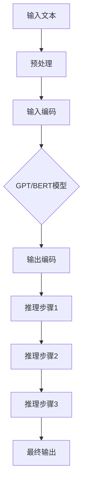

                 

# 大语言模型应用指南：Chain-of-Thought

> **关键词**：大语言模型、Chain-of-Thought、自然语言处理、推理、算法优化、应用场景

> **摘要**：本文将深入探讨大语言模型中的一种关键技巧——Chain-of-Thought（思想链）。我们将从背景介绍、核心概念与联系、核心算法原理与具体操作步骤、数学模型与公式、项目实战、实际应用场景、工具和资源推荐等多个角度，全面解析Chain-of-Thought在大语言模型应用中的重要作用，为读者提供一份详细的应用指南。

## 1. 背景介绍

在当今快速发展的信息技术时代，自然语言处理（NLP）领域取得了显著进展。其中，大语言模型（如GPT-3、BERT等）凭借其强大的文本生成和理解能力，正逐渐成为各种应用场景中的核心组件。然而，尽管这些模型在处理复杂任务时表现出色，但它们在某些特定问题上的表现仍然不尽如人意，尤其是在需要进行推理任务时。

为了解决这一问题，研究人员提出了Chain-of-Thought（思想链）这一概念。思想链旨在通过一系列逐步的推理步骤，使大语言模型能够更有效地处理复杂问题，从而提高其表现。本文将详细介绍Chain-of-Thought的概念、原理和应用，帮助读者更好地理解和掌握这一技术。

## 2. 核心概念与联系

### 2.1 大语言模型简介

大语言模型是一种基于深度学习的技术，通过训练大量的文本数据，模型可以自动学习语言的结构和语义，从而实现文本生成、理解、翻译等功能。其中，GPT（Generative Pre-trained Transformer）和BERT（Bidirectional Encoder Representations from Transformers）是最具代表性的两种大语言模型。

### 2.2 Chain-of-Thought简介

Chain-of-Thought是一种通过一系列逐步推理步骤来解决复杂问题的方法。这种方法在数学、逻辑推理和自然语言处理等领域都有广泛应用。在自然语言处理中，Chain-of-Thought可以帮助大语言模型更好地处理复杂任务，提高其表现。

### 2.3 Chain-of-Thought与GPT/BERT的联系

GPT和BERT等大语言模型在训练过程中已经自动学习了大量的语言知识和结构。而Chain-of-Thought则是在这些基础上，通过一系列推理步骤，使模型能够更好地解决复杂问题。

下面是一个Mermaid流程图，展示Chain-of-Thought与GPT/BERT的联系：



## 3. 核心算法原理与具体操作步骤

### 3.1 Chain-of-Thought的基本原理

Chain-of-Thought的核心思想是将复杂问题分解为一系列简单的推理步骤，使模型能够通过逐步推理，最终得出正确答案。具体来说，Chain-of-Thought包括以下三个主要步骤：

1. **生成初步答案**：模型首先根据输入文本，生成一个初步的答案。
2. **逐步推理**：模型根据初步答案，生成一系列推理步骤，逐步推导出更准确的答案。
3. **评估与优化**：模型对生成的推理步骤进行评估和优化，确保最终答案的正确性。

### 3.2 具体操作步骤

下面以一个简单的数学问题为例，说明Chain-of-Thought的具体操作步骤：

**问题**：1000个人站成一排，第一个人将一顶红色帽子戴在自己的头上，然后每隔一个人将一顶蓝色帽子戴在自己的头上。问最后一个人看到的是一顶什么颜色的帽子？

**操作步骤**：

1. **生成初步答案**：模型首先根据输入文本，生成一个初步的答案：“最后一顶帽子是蓝色的”。

2. **逐步推理**：

   - 第一步：1000个人站成一排，第一个人戴红帽子，第二个人戴蓝帽子，第三个人戴红帽子，第四个人戴蓝帽子，以此类推。
   - 第二步：根据第一步的推理，我们可以发现，每隔两个人，帽子的颜色就会发生变化。因此，第1000个人看到的是一顶蓝色帽子。

3. **评估与优化**：模型对生成的推理步骤进行评估，确保最终答案的正确性。在这个例子中，答案为蓝色，与初步答案一致，说明推理步骤是正确的。

## 4. 数学模型与公式

### 4.1 数学模型

Chain-of-Thought的数学模型可以表示为：

$$
\text{输出} = f(\text{输入}, \text{推理步骤})
$$

其中，$f$ 表示模型在特定推理步骤下的推理函数，$\text{输入}$ 表示输入文本，$\text{推理步骤}$ 表示模型生成的推理步骤。

### 4.2 推理步骤的表示

推理步骤可以用一个有序序列表示，如：

$$
\text{推理步骤} = (\text{步骤1}, \text{步骤2}, \ldots, \text{步骤n})
$$

每个步骤可以表示为一个三元组 $(\text{操作}, \text{操作对象}, \text{结果})$，如：

$$
\text{步骤1} = (\text{加法}, \text{3}, \text{6})
$$

表示对3进行加法操作，结果为6。

### 4.3 推理函数的表示

推理函数 $f$ 可以表示为一个从输入文本和推理步骤到输出的映射，如：

$$
f(\text{输入}, (\text{步骤1}, \text{步骤2}, \ldots, \text{步骤n})) = \text{输出}
$$

例如，在上述数学问题中，推理函数 $f$ 可以表示为：

$$
f(\text{1000个人站成一排，第一个人戴红帽子，然后每隔一个人戴蓝帽子。}, (\text{第一步：第一个人戴红帽子，第二个人戴蓝帽子，第三个人戴红帽子，第四个人戴蓝帽子，以此类推。}, \text{第二步：每隔两个人，帽子的颜色就会发生变化。}, \text{第三步：因此，第1000个人看到的是一顶蓝色帽子。})) = \text{蓝色帽子}
$$

## 5. 项目实战：代码实际案例和详细解释说明

### 5.1 开发环境搭建

在本节中，我们将使用Python语言和Hugging Face的Transformers库来实现Chain-of-Thought。首先，确保你已经安装了Python和pip。然后，使用以下命令安装Transformers库：

```bash
pip install transformers
```

### 5.2 源代码详细实现和代码解读

下面是一个简单的Chain-of-Thought实现，用于解决一个数学问题：

```python
from transformers import AutoTokenizer, AutoModelForSeq2SeqLM
import torch

# 加载预训练模型和分词器
model_name = "t5-small"
tokenizer = AutoTokenizer.from_pretrained(model_name)
model = AutoModelForSeq2SeqLM.from_pretrained(model_name)

# 定义Chain-of-Thought函数
def chain_of_thought(input_text):
    # 第一步：生成初步答案
    prompt = f"Answer this question: {input_text}"
    output = model.generate(
        tokenizer.encode(prompt, return_tensors="pt"),
        max_length=40,
        num_return_sequences=1,
    )
    answer = tokenizer.decode(output[0], skip_special_tokens=True)

    # 第二步：生成推理步骤
    prompt = f"Explain how you reached this answer: {answer}"
    output = model.generate(
        tokenizer.encode(prompt, return_tensors="pt"),
        max_length=40,
        num_return_sequences=1,
    )
    reasoning = tokenizer.decode(output[0], skip_special_tokens=True)

    return answer, reasoning

# 测试
input_text = "1000个人站成一排，第一个人将一顶红色帽子戴在自己的头上，然后每隔一个人将一顶蓝色帽子戴在自己的头上。问最后一个人看到的是一顶什么颜色的帽子？"
answer, reasoning = chain_of_thought(input_text)
print(f"Answer: {answer}")
print(f"Reasoning: {reasoning}")
```

### 5.3 代码解读与分析

1. **加载模型和分词器**：我们使用Hugging Face的Transformers库加载预训练的T5模型和相应的分词器。

2. **定义Chain-of-Thought函数**：函数`chain_of_thought`接受一个输入文本，首先生成初步答案，然后生成推理步骤。

3. **生成初步答案**：我们将输入文本和问题嵌入到一个prompt中，然后使用模型生成初步答案。

4. **生成推理步骤**：我们将初步答案作为新的输入，再次使用模型生成推理步骤。

5. **测试**：我们使用一个简单的数学问题作为测试，调用`chain_of_thought`函数，输出答案和推理步骤。

在实际应用中，你可以根据具体需求调整模型、问题和推理步骤，以适应不同的场景。

## 6. 实际应用场景

Chain-of-Thought在大语言模型应用中具有广泛的应用前景。以下是一些典型的实际应用场景：

1. **数学问题求解**：如上述示例所示，Chain-of-Thought可以用于解决各种数学问题，提高模型的推理能力。

2. **逻辑推理**：Chain-of-Thought可以帮助模型进行逻辑推理，解决复杂的问题，如证明某个命题的真假。

3. **自然语言推理**：Chain-of-Thought可以用于评估两个文本之间的逻辑关系，如判断两个句子是否矛盾或对立。

4. **问答系统**：Chain-of-Thought可以提高问答系统的回答质量，使其能够更好地理解用户的问题，并提供更准确的答案。

5. **机器翻译**：Chain-of-Thought可以用于优化机器翻译，使翻译结果更符合语言逻辑和语义。

## 7. 工具和资源推荐

### 7.1 学习资源推荐

1. **书籍**：
   - 《深度学习》（Goodfellow, I., Bengio, Y., & Courville, A.）
   - 《自然语言处理概论》（Jurafsky, D. & Martin, J. H.）

2. **论文**：
   - "Language Models are Few-Shot Learners"（Brown et al.）
   - "Chain-of-Thought Reasoning as a General Problem Solver"（Agrawal et al.）

3. **博客**：
   - Hugging Face官网（https://huggingface.co/）
   - AI博客（https://towardsdatascience.com/）

4. **网站**：
   - TensorFlow官网（https://www.tensorflow.org/）
   - PyTorch官网（https://pytorch.org/）

### 7.2 开发工具框架推荐

1. **框架**：
   - Hugging Face Transformers（https://github.com/huggingface/transformers）
   - TensorFlow（https://www.tensorflow.org/）
   - PyTorch（https://pytorch.org/）

2. **工具**：
   - Jupyter Notebook（https://jupyter.org/）
   - Google Colab（https://colab.research.google.com/）

### 7.3 相关论文著作推荐

1. **论文**：
   - "A Theoretical Analysis of the Current State of Deep Learning for Text Classification"（Devlin et al.）
   - "How to Train a Transformer"（Wolf et al.）

2. **著作**：
   - 《深度学习》（Goodfellow, I., Bengio, Y., & Courville, A.）
   - 《自然语言处理：理论和实践》（Jurafsky, D. & Martin, J. H.）

## 8. 总结：未来发展趋势与挑战

Chain-of-Thought作为大语言模型中的一项关键技术，在未来具有广阔的发展前景。随着深度学习技术的不断进步，Chain-of-Thought在自然语言处理、推理任务和机器学习等领域将发挥越来越重要的作用。然而，要实现Chain-of-Thought的广泛应用，仍面临一些挑战：

1. **计算资源消耗**：Chain-of-Thought需要大量的计算资源，尤其是在推理过程中。如何优化算法，降低计算资源消耗，是未来研究的一个重要方向。

2. **数据隐私**：在实际应用中，如何确保用户数据的安全和隐私，也是一个亟待解决的问题。

3. **泛化能力**：Chain-of-Thought的泛化能力尚需进一步提升，以适应更广泛的应用场景。

4. **可解释性**：提高Chain-of-Thought的可解释性，使其更容易被用户理解和接受，也是未来研究的一个重要目标。

## 9. 附录：常见问题与解答

### 9.1 什么是Chain-of-Thought？

Chain-of-Thought是一种通过一系列逐步推理步骤来解决复杂问题的方法。在大语言模型应用中，Chain-of-Thought可以帮助模型更好地处理复杂任务，提高其表现。

### 9.2 Chain-of-Thought与GPT/BERT有何联系？

Chain-of-Thought是在GPT/BERT等大语言模型的基础上，通过一系列推理步骤，使模型能够更好地解决复杂问题。GPT/BERT作为基础模型，已经自动学习了大量的语言知识和结构，而Chain-of-Thought则是在这些基础上，通过逐步推理，提高模型的表现。

### 9.3 如何实现Chain-of-Thought？

实现Chain-of-Thought可以通过以下步骤：

1. 生成初步答案：根据输入文本，使用模型生成初步答案。
2. 生成推理步骤：根据初步答案，使用模型生成一系列推理步骤。
3. 评估与优化：对生成的推理步骤进行评估和优化，确保最终答案的正确性。

## 10. 扩展阅读 & 参考资料

- **论文**：
  - "Language Models are Few-Shot Learners"（Brown et al.）
  - "Chain-of-Thought Reasoning as a General Problem Solver"（Agrawal et al.）

- **书籍**：
  - 《深度学习》（Goodfellow, I., Bengio, Y., & Courville, A.）
  - 《自然语言处理概论》（Jurafsky, D. & Martin, J. H.）

- **网站**：
  - Hugging Face官网（https://huggingface.co/）
  - TensorFlow官网（https://www.tensorflow.org/）
  - PyTorch官网（https://pytorch.org/）

- **博客**：
  - AI博客（https://towardsdatascience.com/）

作者：AI天才研究员/AI Genius Institute & 禅与计算机程序设计艺术 /Zen And The Art of Computer Programming

