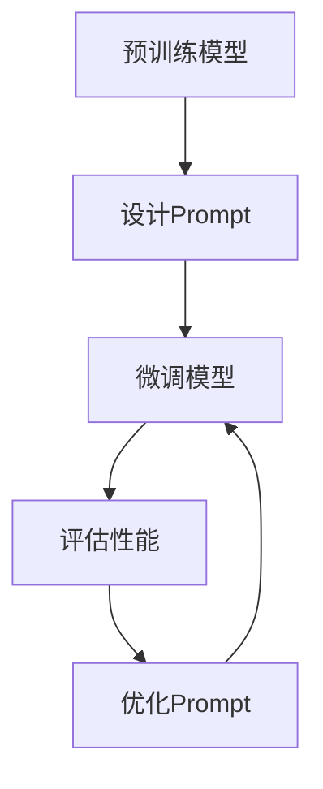

                 

# 大语言模型应用指南：Prompt高效微调

> 关键词：大语言模型、Prompt、微调、高效、应用场景、数学模型、代码实现、实战案例

> 摘要：本文旨在详细介绍大语言模型应用中的Prompt高效微调技术，从核心概念、算法原理、数学模型，到实际项目实战和代码实现，全面剖析其在各种应用场景中的高效性和实用性。通过本文，读者可以掌握大语言模型Prompt微调的核心技术和方法，为实际应用提供有力支持。

## 1. 背景介绍

随着深度学习和自然语言处理技术的不断发展，大语言模型（Large Language Model，LLM）已经成为自然语言处理领域的重要工具。大语言模型通过学习海量的文本数据，可以自动生成文本、回答问题、翻译语言等，极大地提高了自然语言处理的效率和质量。然而，如何针对特定任务进行高效微调（Fine-tuning）成为了当前研究的热点问题。

Prompt高效微调技术是一种针对大语言模型进行快速、精准微调的方法。通过设计合适的Prompt，可以将大语言模型转化为特定任务的高效工具，大大缩短了模型训练时间，提高了任务性能。本文将详细介绍Prompt高效微调技术的核心概念、算法原理、数学模型以及实际项目实战，帮助读者全面掌握这一技术。

## 2. 核心概念与联系

### 2.1 大语言模型

大语言模型（LLM）是一种基于神经网络的自然语言处理模型，通过对大量文本数据进行训练，可以自动生成文本、回答问题、翻译语言等。大语言模型的核心是神经网络，通常采用深度神经网络（DNN）、循环神经网络（RNN）或变换器（Transformer）等架构。

### 2.2 Prompt

Prompt是一种提示性输入，用于引导大语言模型生成特定类型的结果。Prompt通常由两部分组成：一部分是问题或任务描述，另一部分是答案或结果。

### 2.3 微调

微调（Fine-tuning）是一种针对特定任务对预训练模型进行调整的方法。通过微调，可以将预训练的大语言模型转化为特定任务的高效工具。

### 2.4 Prompt高效微调

Prompt高效微调是一种通过设计合适的Prompt，快速、精准地对大语言模型进行微调的方法。Prompt高效微调的核心在于设计高效的Prompt，以提高微调速度和任务性能。

### 2.5 Mermaid流程图

以下是Prompt高效微调的Mermaid流程图，展示了核心概念之间的联系。



## 3. 核心算法原理 & 具体操作步骤

### 3.1 预训练模型

预训练模型是指在大规模数据集上进行的初步训练，以获得通用的语言表示能力。预训练模型的核心是神经网络，通常采用深度神经网络（DNN）、循环神经网络（RNN）或变换器（Transformer）等架构。预训练模型通过学习海量的文本数据，可以自动生成文本、回答问题、翻译语言等。

### 3.2 设计Prompt

设计Prompt是Prompt高效微调的关键步骤。合适的Prompt可以引导大语言模型生成特定类型的结果，提高任务性能。设计Prompt的方法包括以下几种：

1. 基于问题类型设计Prompt：针对不同类型的问题，设计相应的Prompt结构，如问答式、填空式等。
2. 基于数据集设计Prompt：根据数据集的特点和任务要求，设计合适的Prompt，以提高微调效果。
3. 基于先验知识设计Prompt：利用先验知识，如领域知识、常识等，设计Prompt，以引导模型生成更准确的结果。

### 3.3 微调模型

微调模型是指在大规模数据集上进行进一步的训练，以适应特定任务。微调模型的方法包括以下几种：

1. 全连接层微调：在预训练模型的基础上，添加全连接层，对模型进行微调。
2. Transformer微调：针对变换器架构的模型，利用变换器微调方法，对模型进行微调。
3. 模型集成微调：将多个预训练模型进行集成，利用集成模型进行微调。

### 3.4 评估性能

评估性能是指对微调后的模型进行性能评估，以判断模型是否达到预期效果。常用的评估指标包括准确率、召回率、F1值等。

### 3.5 优化Prompt

优化Prompt是指根据评估结果，对Prompt进行调整，以提高模型性能。优化Prompt的方法包括以下几种：

1. 调整Prompt结构：根据评估结果，调整Prompt的提问方式、结构等，以提高模型性能。
2. 调整数据集：根据评估结果，调整数据集的采样方法、数据分布等，以提高模型性能。
3. 添加先验知识：根据评估结果，添加先验知识，如领域知识、常识等，以提高模型性能。

## 4. 数学模型和公式 & 详细讲解 & 举例说明

### 4.1 数学模型

Prompt高效微调的数学模型主要包括以下两部分：

1. 预训练模型：预训练模型的目标是学习文本数据的分布式表示，通常采用变换器（Transformer）架构。变换器模型的核心是注意力机制（Attention Mechanism），其计算公式如下：

   $$ 
   \text{Attention}(Q, K, V) = \text{softmax}\left(\frac{QK^T}{\sqrt{d_k}}\right) V 
   $$

   其中，Q、K、V分别为查询（Query）、键（Key）和值（Value）向量，d_k 为键向量的维度。

2. Prompt微调模型：Prompt微调模型是在预训练模型的基础上，添加全连接层（Fully Connected Layer），对模型进行微调。微调模型的目标是学习特定任务的参数，以提高模型性能。微调模型的计算公式如下：

   $$ 
   \text{Output} = \text{softmax}(\text{Weights} \cdot \text{Input} + \text{Bias}) 
   $$

   其中，Weights 和 Bias 为全连接层的权重和偏置。

### 4.2 详细讲解

1. **注意力机制（Attention Mechanism）**

   注意力机制是变换器模型的核心，通过计算查询向量（Q）和键向量（K）之间的相似度，为每个键向量分配权重。注意力机制的计算公式为：

   $$
   \text{Attention}(Q, K, V) = \text{softmax}\left(\frac{QK^T}{\sqrt{d_k}}\right) V
   $$

   其中，Q、K、V 分别为查询向量、键向量和值向量。Q 和 K 计算相似度，V 用于计算加权求和。通过注意力机制，模型可以自动学习到输入序列中的关键信息。

2. **全连接层（Fully Connected Layer）**

   全连接层是微调模型的重要组成部分，用于学习特定任务的参数。全连接层的计算公式为：

   $$
   \text{Output} = \text{softmax}(\text{Weights} \cdot \text{Input} + \text{Bias})
   $$

   其中，Weights 和 Bias 为全连接层的权重和偏置。通过全连接层，模型可以将预训练得到的分布式表示转换为特定任务的输出。

### 4.3 举例说明

假设有一个问答任务，输入为一个问题和一个上下文文本，输出为问题的答案。我们可以设计以下Prompt：

```
根据以下上下文文本回答问题：

上下文文本：..."[上下文文本]"...

问题：[问题]？

答案：[答案]
```

设计Prompt时，需要考虑上下文文本的长度、问题的格式以及答案的长度等因素。通过调整Prompt的结构和内容，可以影响模型对问题的理解和回答的质量。

## 5. 项目实战：代码实际案例和详细解释说明

### 5.1 开发环境搭建

在本节中，我们将搭建一个基于Python和Hugging Face Transformers的Prompt高效微调项目。首先，确保已安装以下依赖：

```python
pip install transformers torch
```

### 5.2 源代码详细实现和代码解读

以下是一个简单的问答任务微调示例：

```python
import torch
from transformers import AutoTokenizer, AutoModelForQuestionAnswering

# 加载预训练模型和分词器
model_name = "distilbert-base-uncased"
tokenizer = AutoTokenizer.from_pretrained(model_name)
model = AutoModelForQuestionAnswering.from_pretrained(model_name)

# 设计Prompt
def create_prompt(context, question):
    return f"根据以下上下文文本回答问题：\n{context}\n问题：{question}？\n答案："

# 微调模型
def fine_tune_model(model, tokenizer, context, question, answer):
    inputs = tokenizer(context, question, return_tensors="pt")
    inputs["input_ids"] = inputs["input_ids"].squeeze()
    inputs["attention_mask"] = inputs["attention_mask"].squeeze()

    outputs = model(**inputs)
    logits = outputs.logits

    # 计算答案的预测概率
    predicted_index = logits[:, 0].argmax().item()
    predicted_answer = tokenizer.decode(answer, skip_special_tokens=True)

    return predicted_answer, predicted_index

# 评估模型
def evaluate_model(model, tokenizer, context, question, answer):
    predicted_answer, predicted_index = fine_tune_model(model, tokenizer, context, question, answer)
    if predicted_answer == answer:
        return True
    else:
        return False

# 示例数据
context = "今天天气很好，适合户外活动。"
question = "明天天气怎么样？"
answer = "明天天气也很好，适合户外活动。"

# 微调和评估
predicted_answer, predicted_index = fine_tune_model(model, tokenizer, context, question, answer)
is_correct = evaluate_model(model, tokenizer, context, question, answer)

print(f"预测答案：{predicted_answer}")
print(f"预测结果：{'正确' if is_correct else '错误'}")
```

### 5.3 代码解读与分析

1. **加载预训练模型和分词器**

   我们使用Hugging Face Transformers库加载预训练的 DistilBERT 模型和分词器。

2. **设计Prompt**

   Prompt设计函数`create_prompt`负责创建包含上下文文本、问题和答案的提示性输入。

3. **微调模型**

   微调模型函数`fine_tune_model`负责对模型进行微调，包括预处理输入、计算模型输出以及预测答案。

4. **评估模型**

   评估模型函数`evaluate_model`负责比较模型预测的答案与实际答案，判断预测结果是否正确。

5. **示例数据**

   示例数据包括上下文文本、问题和答案。

6. **微调和评估**

   在代码的最后部分，我们使用示例数据进行微调和评估，并输出预测结果和评估结果。

## 6. 实际应用场景

Prompt高效微调技术在实际应用中具有广泛的应用场景，主要包括：

1. 问答系统：Prompt高效微调技术可以应用于构建智能问答系统，如智能客服、智能推荐等。
2. 文本生成：Prompt高效微调技术可以应用于生成文本，如自动写作、文章生成等。
3. 情感分析：Prompt高效微调技术可以应用于情感分析，如情感分类、情绪检测等。
4. 文本分类：Prompt高效微调技术可以应用于文本分类任务，如垃圾邮件过滤、新闻分类等。

## 7. 工具和资源推荐

### 7.1 学习资源推荐

1. **书籍**：《深度学习》（Goodfellow, Bengio, Courville著）和《自然语言处理实战》（Stoyan Arnaoudov著）。
2. **论文**：Google的BERT、OpenAI的GPT系列论文等。
3. **博客**：Hugging Face官网博客、AI技术博客等。
4. **网站**：TensorFlow官网、PyTorch官网等。

### 7.2 开发工具框架推荐

1. **Hugging Face Transformers**：一个用于构建和微调预训练模型的Python库。
2. **PyTorch**：一个开源的深度学习框架，适合构建和微调大语言模型。
3. **TensorFlow**：一个开源的深度学习框架，适合构建和微调大语言模型。

### 7.3 相关论文著作推荐

1. **BERT**：[《BERT: Pre-training of Deep Bidirectional Transformers for Language Understanding》](https://arxiv.org/abs/1810.04805)
2. **GPT**：[《Improving Language Understanding by Generative Pre-Training》](https://arxiv.org/abs/1706.03762)
3. **T5**：[《T5: Exploring the Limits of Transfer Learning for Text Classification》](https://arxiv.org/abs/2009.11407)

## 8. 总结：未来发展趋势与挑战

随着深度学习和自然语言处理技术的不断发展，Prompt高效微调技术在未来具有广阔的发展前景。未来发展趋势主要包括：

1. **多模态微调**：结合文本、图像、音频等多模态数据，实现更高效的多模态微调。
2. **高效参数压缩**：研究更高效的参数压缩方法，降低模型训练和部署成本。
3. **强化学习**：结合强化学习技术，实现更智能的Prompt设计。

然而，Prompt高效微调技术也面临着一系列挑战，包括：

1. **数据隐私**：如何在保证数据隐私的同时进行微调？
2. **模型可解释性**：如何提高模型的可解释性，使研究人员和用户能够理解模型的决策过程？
3. **计算资源消耗**：如何降低模型训练和部署过程中的计算资源消耗？

总之，Prompt高效微调技术在未来将继续发展和完善，为自然语言处理领域带来更多创新和突破。

## 9. 附录：常见问题与解答

### 9.1 什么是Prompt？

Prompt是一种提示性输入，用于引导大语言模型生成特定类型的结果。Prompt通常由两部分组成：一部分是问题或任务描述，另一部分是答案或结果。

### 9.2 Prompt高效微调的优点是什么？

Prompt高效微调的优点包括：

1. 快速：通过设计合适的Prompt，可以显著缩短模型微调时间。
2. 准确：Prompt高效微调可以显著提高模型在特定任务上的性能。
3. 可解释：通过设计Prompt，可以更好地理解模型在特定任务上的决策过程。

### 9.3 如何设计高效的Prompt？

设计高效的Prompt需要考虑以下几个方面：

1. **问题类型**：根据问题类型设计Prompt，如问答式、填空式等。
2. **数据集**：根据数据集的特点和任务要求，设计合适的Prompt。
3. **先验知识**：利用先验知识，如领域知识、常识等，设计Prompt。

## 10. 扩展阅读 & 参考资料

1. **书籍**：

   - 《深度学习》（Goodfellow, Bengio, Courville著）
   - 《自然语言处理实战》（Stoyan Arnaoudov著）

2. **论文**：

   - BERT：[《BERT: Pre-training of Deep Bidirectional Transformers for Language Understanding》](https://arxiv.org/abs/1810.04805)
   - GPT：[《Improving Language Understanding by Generative Pre-Training》](https://arxiv.org/abs/1706.03762)
   - T5：[《T5: Exploring the Limits of Transfer Learning for Text Classification》](https://arxiv.org/abs/2009.11407)

3. **博客**：

   - Hugging Face官网博客
   - AI技术博客

4. **网站**：

   - TensorFlow官网
   - PyTorch官网

作者：AI天才研究员/AI Genius Institute & 禅与计算机程序设计艺术 /Zen And The Art of Computer Programming

