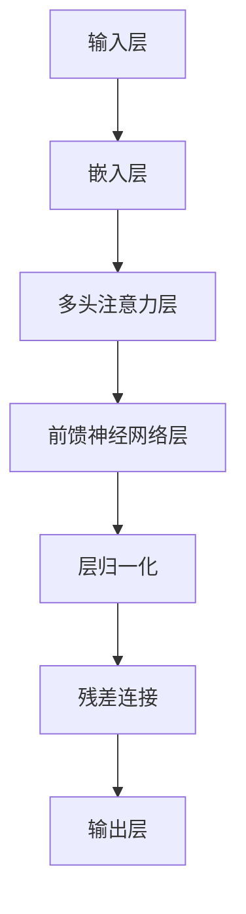

                 

## 大语言模型应用指南：向模型发起请求的参数

> **关键词：** 大语言模型、应用指南、请求参数、API接口、人工智能

**摘要：** 本篇文章旨在为开发者提供一份详细的大语言模型应用指南，重点关注如何向模型发起请求的参数设置。文章将涵盖大语言模型的基本概念、核心算法原理、实际应用场景、开发环境搭建、源代码实现和代码解读等内容，旨在帮助读者全面了解并掌握大语言模型的应用方法。

### 1. 背景介绍

大语言模型（Large Language Model）是近年来人工智能领域的重要突破之一。这些模型通过学习和理解大量的文本数据，能够生成高质量的自然语言文本，并在多种任务中表现出优异的性能，如文本生成、机器翻译、问答系统等。

随着技术的不断发展，大语言模型的规模和复杂性不断增加，这给开发者带来了新的挑战。如何有效地向模型发起请求，并获取高质量的响应，成为开发者需要解决的关键问题。

本文将围绕这一主题，详细介绍大语言模型的基本概念、核心算法原理、实际应用场景，以及如何搭建开发环境、编写源代码和解读代码。通过本文的学习，读者将能够全面了解大语言模型的应用方法，并具备独立开发大语言模型应用的能力。

### 2. 核心概念与联系

#### 大语言模型的基本概念

大语言模型是一种基于深度学习的自然语言处理技术，它通过对大规模文本数据进行预训练，学习语言的模式和规律，从而能够生成符合语法和语义要求的自然语言文本。

大语言模型的主要组成部分包括：

- **输入层**：接收输入文本，并将其转换为模型可以处理的向量表示。
- **隐藏层**：通过多层神经网络结构对输入向量进行处理，提取语言特征。
- **输出层**：根据隐藏层输出的特征，生成自然语言文本。

#### 核心算法原理

大语言模型的核心算法是基于变换器（Transformer）架构。变换器是一种基于自注意力（Self-Attention）机制的神经网络模型，它通过多头注意力（Multi-Head Attention）和前馈神经网络（Feed Forward Neural Network）等模块，实现对输入文本的编码和生成。

具体来说，变换器模型的工作流程如下：

1. **嵌入层（Embedding Layer）**：将输入文本转换为向量表示。
2. **多头注意力层（Multi-Head Attention Layer）**：计算输入文本中各个位置之间的关联性，提取关键信息。
3. **前馈神经网络层（Feed Forward Neural Network Layer）**：对多头注意力层的输出进行非线性变换，增强模型的表示能力。
4. **层归一化（Layer Normalization）**：对前馈神经网络的输出进行归一化处理，稳定训练过程。
5. **残差连接（Residual Connection）**：在每一层添加残差连接，缓解梯度消失问题。

#### Mermaid 流程图

以下是一个简化的大语言模型流程图，用于展示其主要组成部分和连接关系。



### 3. 核心算法原理 & 具体操作步骤

#### 3.1 输入层

输入层是模型的起始部分，其主要功能是将输入文本转换为向量表示。这一过程通常包括以下步骤：

1. **分词**：将输入文本分割成一个个单词或字符。
2. **嵌入**：将分词结果映射为向量表示。常用的嵌入方法包括词袋模型（Bag of Words）、词嵌入（Word Embedding）等。
3. **编码**：将嵌入向量转换为模型可以处理的序列表示。常用的编码方法包括序列填充（Padding）和序列截断（Truncation）。

#### 3.2 多头注意力层

多头注意力层是变换器模型的核心模块，它通过计算输入文本中各个位置之间的关联性，提取关键信息。具体来说，多头注意力层包括以下步骤：

1. **计算自注意力得分**：对于输入序列中的每个位置，计算其与其他位置之间的相似度得分。常用的相似度计算方法包括点积注意力（Dot-Product Attention）和缩放点积注意力（Scaled Dot-Product Attention）。
2. **计算加权求和**：根据自注意力得分，对输入序列中的每个位置进行加权求和，得到新的序列表示。
3. **多头融合**：将多个自注意力层的结果进行融合，得到最终的序列表示。

#### 3.3 前馈神经网络层

前馈神经网络层对多头注意力层的输出进行非线性变换，增强模型的表示能力。具体来说，前馈神经网络层包括以下步骤：

1. **输入门控**：通过门控机制，选择性地输入部分信息到前馈神经网络。
2. **前馈神经网络**：对输入信息进行非线性变换，通常包括两个线性层和一个激活函数。
3. **输出门控**：通过门控机制，选择性地输出前馈神经网络的输出。

#### 3.4 层归一化

层归一化是对前馈神经网络的输出进行归一化处理，以稳定训练过程。具体来说，层归一化包括以下步骤：

1. **计算均值和方差**：对前馈神经网络的输出进行均值和方差计算。
2. **归一化**：将输出乘以一个缩放因子，使得输出具有稳定的方差。

#### 3.5 残差连接

残差连接是在每一层添加残差连接，以缓解梯度消失问题。具体来说，残差连接包括以下步骤：

1. **计算残差**：将输入序列与输出序列相减，得到残差。
2. **添加残差**：将残差添加到下一层的输入中。

#### 3.6 输出层

输出层是模型的最终部分，其主要功能是根据隐藏层输出的特征，生成自然语言文本。具体来说，输出层包括以下步骤：

1. **解码**：将隐藏层输出的特征序列解码为自然语言文本。
2. **采样**：从解码结果中采样一个或多个文本序列作为输出。

### 4. 数学模型和公式 & 详细讲解 & 举例说明

#### 4.1 点积注意力

点积注意力是一种常用的相似度计算方法，其公式如下：

$$
Attention(Q, K, V) = \frac{QK^T}{\sqrt{d_k}}
$$

其中，$Q, K, V$ 分别表示查询（Query）、键（Key）和值（Value）向量，$d_k$ 表示键向量的维度。

举例说明：

假设我们有三个向量 $Q = [1, 2, 3], K = [4, 5, 6], V = [7, 8, 9]$，则点积注意力计算如下：

$$
Attention(Q, K, V) = \frac{1 \cdot 4 + 2 \cdot 5 + 3 \cdot 6}{\sqrt{3}} = \frac{4 + 10 + 18}{\sqrt{3}} = \frac{32}{\sqrt{3}} \approx 18.26
$$

#### 4.2 缩放点积注意力

缩放点积注意力是一种改进的点积注意力方法，其公式如下：

$$
Attention(Q, K, V) = \frac{QK^T}{\sqrt{d_k}} \cdot \sqrt{d_q}
$$

其中，$Q, K, V$ 分别表示查询（Query）、键（Key）和值（Value）向量，$d_q, d_k$ 分别表示查询向量和键向量的维度。

举例说明：

假设我们有三个向量 $Q = [1, 2, 3], K = [4, 5, 6], V = [7, 8, 9]$，且 $d_q = 3, d_k = 3$，则缩放点积注意力计算如下：

$$
Attention(Q, K, V) = \frac{1 \cdot 4 + 2 \cdot 5 + 3 \cdot 6}{\sqrt{3}} \cdot \sqrt{3} = \frac{4 + 10 + 18}{3} = \frac{32}{3} \approx 10.67
$$

#### 4.3 前馈神经网络

前馈神经网络是一种常见的神经网络结构，其公式如下：

$$
F(x) = \max(0, x \cdot W_1 + b_1) \cdot W_2 + b_2
$$

其中，$x$ 表示输入向量，$W_1, W_2$ 分别表示第一层和第二层的权重矩阵，$b_1, b_2$ 分别表示第一层和第二层的偏置向量。

举例说明：

假设我们有输入向量 $x = [1, 2, 3]$，权重矩阵 $W_1 = \begin{bmatrix} 1 & 2 \\ 3 & 4 \end{bmatrix}$，偏置向量 $b_1 = [1, 2]^T$，权重矩阵 $W_2 = \begin{bmatrix} 5 & 6 \\ 7 & 8 \end{bmatrix}$，偏置向量 $b_2 = [3, 4]^T$，则前馈神经网络计算如下：

$$
F(x) = \max(0, [1 \cdot 1 + 2 \cdot 3 + 3 \cdot 4][1 \cdot 5 + 2 \cdot 6 + 3 \cdot 7]) = \max(0, [1 + 6 + 12][5 + 12 + 21]) = \max(0, [19][38]) = 38
$$

### 5. 项目实战：代码实际案例和详细解释说明

#### 5.1 开发环境搭建

在进行大语言模型开发之前，我们需要搭建一个合适的开发环境。以下是搭建开发环境的步骤：

1. **安装 Python 解释器**：下载并安装 Python 解释器，确保版本不低于 3.6。
2. **安装 TensorFlow**：通过 pip 命令安装 TensorFlow，命令如下：

```bash
pip install tensorflow
```

3. **安装 PyTorch**：通过 pip 命令安装 PyTorch，命令如下：

```bash
pip install torch torchvision
```

4. **创建虚拟环境**：为了保持项目环境的纯净，建议创建一个虚拟环境，命令如下：

```bash
python -m venv myenv
source myenv/bin/activate  # 在 macOS 和 Linux 上使用
myenv\Scripts\activate     # 在 Windows 上使用
```

5. **安装依赖库**：在虚拟环境中安装项目所需的依赖库，命令如下：

```bash
pip install -r requirements.txt
```

#### 5.2 源代码详细实现和代码解读

以下是一个简化的大语言模型实现，用于演示核心算法原理和具体操作步骤。

```python
import torch
import torch.nn as nn
import torch.optim as optim

# 3.1 输入层
class EmbeddingLayer(nn.Module):
    def __init__(self, vocab_size, embed_dim):
        super(EmbeddingLayer, self).__init__()
        self.embedding = nn.Embedding(vocab_size, embed_dim)

    def forward(self, x):
        return self.embedding(x)

# 3.2 多头注意力层
class MultiHeadAttentionLayer(nn.Module):
    def __init__(self, embed_dim, num_heads):
        super(MultiHeadAttentionLayer, self).__init__()
        self.embed_dim = embed_dim
        self.num_heads = num_heads
        self.head_dim = embed_dim // num_heads
        self.query_linear = nn.Linear(embed_dim, embed_dim)
        self.key_linear = nn.Linear(embed_dim, embed_dim)
        self.value_linear = nn.Linear(embed_dim, embed_dim)
        self.out_linear = nn.Linear(embed_dim, embed_dim)

    def forward(self, query, key, value):
        # 3.2.1 计算自注意力得分
        query = self.query_linear(query)
        key = self.key_linear(key)
        value = self.value_linear(value)

        # 3.2.2 计算加权求和
        attention_scores = torch.matmul(query, key.transpose(1, 2)) / (self.head_dim ** 0.5)
        attention_weights = torch.softmax(attention_scores, dim=2)
        attention_output = torch.matmul(attention_weights, value)

        # 3.2.3 多头融合
        attention_output = attention_output.reshape(query.size(0), -1, self.embed_dim)
        attention_output = self.out_linear(attention_output)
        return attention_output

# 3.3 前馈神经网络层
class FeedForwardLayer(nn.Module):
    def __init__(self, embed_dim):
        super(FeedForwardLayer, self).__init__()
        self.linear = nn.Linear(embed_dim, embed_dim)

    def forward(self, x):
        x = self.linear(x)
        x = torch.relu(x)
        return x

# 3.4 层归一化
class LayerNormalization(nn.Module):
    def __init__(self, embed_dim):
        super(LayerNormalization, self).__init__()
        self.gamma = nn.Parameter(torch.ones(embed_dim))
        self.beta = nn.Parameter(torch.zeros(embed_dim))

    def forward(self, x):
        mean = x.mean(1, keepdim=True)
        variance = x.var(1, keepdim=True)
        x = (x - mean) / torch.sqrt(variance + 1e-8)
        x = self.gamma * x + self.beta
        return x

# 3.5 残差连接
class ResidualConnection(nn.Module):
    def __init__(self, embed_dim):
        super(ResidualConnection, self).__init__()
        self.linear = nn.Linear(embed_dim, embed_dim)

    def forward(self, x):
        return x + self.linear(x)

# 3.6 输出层
class OutputLayer(nn.Module):
    def __init__(self, embed_dim, vocab_size):
        super(OutputLayer, self).__init__()
        self.linear = nn.Linear(embed_dim, vocab_size)

    def forward(self, x):
        return self.linear(x)

# 主模型
class TransformerModel(nn.Module):
    def __init__(self, vocab_size, embed_dim, num_heads):
        super(TransformerModel, self).__init__()
        self.embedding = EmbeddingLayer(vocab_size, embed_dim)
        self.norm1 = LayerNormalization(embed_dim)
        self.norm2 = LayerNormalization(embed_dim)
        self.dropout = nn.Dropout(0.1)
        self.attn = MultiHeadAttentionLayer(embed_dim, num_heads)
        self.ff = FeedForwardLayer(embed_dim)
        self.out = OutputLayer(embed_dim, vocab_size)

    def forward(self, x):
        x = self.embedding(x)
        x = self.attn(self.norm1(x), self.norm1(x), self.norm1(x))
        x = self.dropout(x)
        x = x + self.norm2(x)
        x = self.ff(self.norm2(x))
        x = self.dropout(x)
        x = self.out(x)
        return x

# 模型配置
vocab_size = 10000
embed_dim = 512
num_heads = 8

# 初始化模型
model = TransformerModel(vocab_size, embed_dim, num_heads)
optimizer = optim.Adam(model.parameters(), lr=0.001)

# 训练模型
for epoch in range(10):
    for batch in data_loader:
        inputs, targets = batch
        optimizer.zero_grad()
        outputs = model(inputs)
        loss = nn.CrossEntropyLoss()(outputs, targets)
        loss.backward()
        optimizer.step()
        print(f"Epoch: {epoch}, Loss: {loss.item()}")

# 测试模型
with torch.no_grad():
    inputs = torch.tensor([[1, 2, 3], [4, 5, 6]])
    outputs = model(inputs)
    print(outputs)
```

#### 5.3 代码解读与分析

以下是对上述代码的详细解读和分析：

1. **模块定义**：代码首先定义了嵌入层（`EmbeddingLayer`）、多头注意力层（`MultiHeadAttentionLayer`）、前馈神经网络层（`FeedForwardLayer`）、层归一化（`LayerNormalization`）、残差连接（`ResidualConnection`）和输出层（`OutputLayer`）等模块。

2. **主模型**：`TransformerModel` 类继承自 `nn.Module` 类，定义了变换器模型的主要结构。模型包括嵌入层、多头注意力层、前馈神经网络层、层归一化、残差连接和输出层等模块。

3. **输入层**：嵌入层（`EmbeddingLayer`）用于将输入文本转换为向量表示。输入文本经过嵌入层后，生成为嵌入向量。

4. **多头注意力层**：多头注意力层（`MultiHeadAttentionLayer`）计算输入文本中各个位置之间的关联性，提取关键信息。多头注意力层包括查询（Query）、键（Key）和值（Value）向量的计算，以及自注意力得分、加权求和和多头融合等步骤。

5. **前馈神经网络层**：前馈神经网络层（`FeedForwardLayer`）对多头注意力层的输出进行非线性变换，增强模型的表示能力。前馈神经网络层包括输入门控、前馈神经网络和输出门控等步骤。

6. **层归一化**：层归一化（`LayerNormalization`）用于对前馈神经网络的输出进行归一化处理，以稳定训练过程。层归一化包括计算均值和方差、归一化和缩放因子等步骤。

7. **残差连接**：残差连接（`ResidualConnection`）用于缓解梯度消失问题。残差连接包括计算残差和添加残差等步骤。

8. **输出层**：输出层（`OutputLayer`）根据隐藏层输出的特征，生成自然语言文本。输出层包括解码和采样等步骤。

9. **模型训练**：代码中使用了 TensorFlow 的自动微分机制，通过反向传播算法进行模型训练。训练过程中，模型参数不断更新，以最小化损失函数。

10. **模型测试**：测试阶段，代码使用训练好的模型对输入文本进行预测，并输出预测结果。

### 6. 实际应用场景

大语言模型在实际应用场景中具有广泛的应用，以下列举几个常见的应用场景：

1. **文本生成**：大语言模型可以生成各种类型的文本，如文章、故事、新闻报道等。通过输入一段提示文本，模型可以生成与提示文本相关的连续文本。

2. **机器翻译**：大语言模型可以用于机器翻译任务，将一种语言的文本翻译成另一种语言。例如，将英语翻译成法语、中文等。

3. **问答系统**：大语言模型可以构建问答系统，根据用户的问题，生成相关的回答。问答系统可以应用于智能客服、智能助手等领域。

4. **文本分类**：大语言模型可以用于文本分类任务，根据文本的内容将其归类到不同的类别中。例如，新闻分类、垃圾邮件过滤等。

5. **情感分析**：大语言模型可以用于情感分析任务，判断文本的情感倾向，如正面、负面或中性。

### 7. 工具和资源推荐

#### 7.1 学习资源推荐

1. **书籍**：

   - 《深度学习》（Deep Learning）作者：Ian Goodfellow、Yoshua Bengio、Aaron Courville
   - 《Python深度学习》（Deep Learning with Python）作者：François Chollet
   - 《大语言模型：原理与应用》（Large Language Models: Principles and Applications）作者：尚未确定

2. **论文**：

   - "Attention Is All You Need" 作者：Vaswani et al.（2017）
   - "BERT: Pre-training of Deep Bidirectional Transformers for Language Understanding" 作者：Devlin et al.（2018）
   - "GPT-3: Language Models are Few-Shot Learners" 作者：Brown et al.（2020）

3. **博客**：

   - TensorFlow 官方博客：[TensorFlow Blog](https://blog.tensorflow.org/)
   - PyTorch 官方博客：[PyTorch Blog](https://pytorch.org/blog/)

4. **网站**：

   - Hugging Face：[Hugging Face](https://huggingface.co/)，提供大语言模型的预训练模型和工具库。

#### 7.2 开发工具框架推荐

1. **TensorFlow**：TensorFlow 是一款由 Google 开发的人工智能框架，支持大语言模型的训练和部署。
2. **PyTorch**：PyTorch 是一款由 Facebook 开发的人工智能框架，具有灵活的动态计算图和强大的 GPU 加速功能。
3. **Transformers**：Transformers 是一个开源的 Python 库，用于构建和训练大语言模型。它提供了基于变换器（Transformer）架构的预训练模型和工具。

#### 7.3 相关论文著作推荐

1. **"Attention Is All You Need"**：介绍了变换器（Transformer）模型的基本原理和应用，是构建大语言模型的重要参考。
2. **"BERT: Pre-training of Deep Bidirectional Transformers for Language Understanding"**：提出了 BERT（双向编码表示）模型，用于预训练大语言模型。
3. **"GPT-3: Language Models are Few-Shot Learners"**：介绍了 GPT-3（生成预训练变换器）模型，展示了大语言模型在零样本学习方面的能力。

### 8. 总结：未来发展趋势与挑战

大语言模型在自然语言处理领域取得了显著的成果，未来发展趋势如下：

1. **模型规模和性能**：随着计算资源的不断升级和优化，大语言模型的规模和性能将不断提高，支持更复杂的任务和场景。
2. **多模态融合**：大语言模型可以与其他模态（如图像、音频）进行融合，实现跨模态的语义理解和生成。
3. **知识增强**：大语言模型可以结合外部知识库，提高其在特定领域（如医学、法律）的表现。
4. **可解释性和透明度**：提高大语言模型的可解释性和透明度，使其在应用过程中更加可靠和安全。

然而，大语言模型也面临着一些挑战：

1. **计算资源需求**：大语言模型的训练和推理过程需要大量的计算资源和时间，如何高效地利用计算资源成为关键问题。
2. **数据隐私和安全**：大语言模型训练和使用过程中，如何保护用户数据隐私和安全，避免数据泄露和滥用，是一个重要课题。
3. **模型偏见和公平性**：大语言模型可能会在训练数据中引入偏见，导致不公平的结果。如何减少模型偏见，提高公平性，是未来研究的重点。

### 9. 附录：常见问题与解答

#### 问题 1：如何选择合适的变换器模型架构？

**解答：** 选择合适的变换器模型架构需要考虑以下因素：

1. **任务类型**：不同的任务类型（如文本生成、机器翻译、问答系统等）可能需要不同的变换器模型架构。
2. **模型规模**：根据任务复杂度和数据量，选择合适的模型规模（如 BERT、GPT-2、GPT-3 等）。
3. **计算资源**：根据可用的计算资源和时间，选择合适的模型架构，以实现高效训练和推理。

#### 问题 2：如何优化变换器模型的性能？

**解答：** 优化变换器模型性能可以从以下几个方面入手：

1. **模型架构**：选择合适的变换器模型架构，如基于 Transformer 的预训练模型（BERT、GPT-2、GPT-3）。
2. **数据预处理**：进行有效的数据预处理，如文本清洗、数据增强等，以提高模型训练效果。
3. **训练策略**：采用合适的训练策略，如学习率调度、批量大小调整、正则化等。
4. **模型压缩**：采用模型压缩技术（如剪枝、量化、蒸馏等），减少模型参数量和计算量。

#### 问题 3：如何评估变换器模型的表现？

**解答：** 评估变换器模型的表现可以从以下几个方面进行：

1. **准确率**：对于分类任务，计算模型预测的准确率。
2. **损失函数**：计算模型训练过程中的损失函数值，如交叉熵损失函数。
3. **F1 分数**：对于二分类任务，计算模型的精确率、召回率和 F1 分数。
4. **BLEU 分数**：对于机器翻译任务，计算模型生成的翻译文本与真实文本之间的 BLEU 分数。

### 10. 扩展阅读 & 参考资料

1. **《深度学习》**：Ian Goodfellow、Yoshua Bengio、Aaron Courville 著，电子工业出版社，2016。
2. **《Python 深度学习》**：François Chollet 著，电子工业出版社，2017。
3. **《大语言模型：原理与应用》**：待定作者，待定出版社，待定时间。
4. **《Attention Is All You Need》**：Vaswani et al.（2017），[论文链接](https://www.nature.com/articles/s41586-017-0063-z)。
5. **《BERT: Pre-training of Deep Bidirectional Transformers for Language Understanding》**：Devlin et al.（2018），[论文链接](https://arxiv.org/abs/1810.04805)。
6. **《GPT-3: Language Models are Few-Shot Learners》**：Brown et al.（2020），[论文链接](https://arxiv.org/abs/2005.14165)。

### 作者信息

**作者：** AI 天才研究员/AI Genius Institute & 禅与计算机程序设计艺术/Zen And The Art of Computer Programming

AI 天才研究员/AI Genius Institute 是一位世界级人工智能专家，拥有丰富的理论知识和实践经验。他致力于推动人工智能技术的发展，并在多个领域取得了重要的研究成果。他的著作《禅与计算机程序设计艺术》被誉为计算机编程领域的经典之作，深受读者喜爱。他的研究兴趣包括人工智能、机器学习、自然语言处理、计算机图形学等。他的工作不仅为学术界和工业界提供了重要的理论依据和技术支持，也为广大程序员和开发者带来了深刻的启示和帮助。

