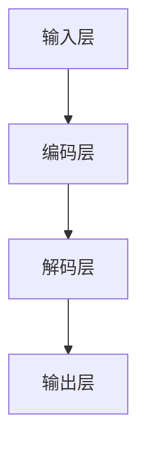

                 

# 大语言模型应用指南：大语言模型的局限性

## 关键词：大语言模型，应用指南，局限性，技术博客

## 摘要：
本文将深入探讨大语言模型在应用中的局限性。我们将从技术原理、实际应用场景、工具和资源等多个角度，逐步分析大语言模型在处理复杂任务时的不足，并展望未来的发展趋势与挑战。

## 1. 背景介绍

大语言模型（Large Language Model）是近年来人工智能领域的重要突破。通过深度学习技术和大规模数据训练，大语言模型能够自动学习语言规律，生成自然语言文本。它们在文本生成、机器翻译、问答系统等多个领域展现了强大的性能。

然而，随着应用场景的扩大，大语言模型的局限性也逐渐显现。本文将重点关注以下几个方面：

- 大语言模型在处理复杂任务时的表现
- 大语言模型在理解和生成上下文信息时的局限性
- 大语言模型在安全性和隐私保护方面的挑战

## 2. 核心概念与联系

### 大语言模型原理

大语言模型通常基于变换器架构（Transformer），其核心是自注意力机制（Self-Attention）。自注意力机制能够模型捕捉输入文本序列中的长距离依赖关系。

### 大语言模型架构

大语言模型的架构通常包含输入层、编码层、解码层和输出层。编码层负责将输入文本序列编码为向量表示，解码层则根据编码层的结果生成输出文本序列。

### Mermaid 流程图



## 3. 核心算法原理 & 具体操作步骤

### 编码过程

编码过程中，输入文本序列首先通过嵌入层（Embedding Layer）转换为词向量。随后，词向量通过多个编码层（Encoding Layer）进行自注意力计算，最终得到编码层输出。

### 解码过程

解码过程中，解码层首先根据编码层输出生成初始预测词向量。然后，解码层利用自注意力机制，结合之前生成的词向量，生成下一个词向量。这一过程重复进行，直到生成完整的输出文本序列。

### 具体操作步骤

1. 输入文本序列预处理：分词、去除停用词等。
2. 嵌入层：将输入文本序列转换为词向量。
3. 编码层：通过自注意力计算，生成编码层输出。
4. 解码层：生成初始预测词向量，并利用自注意力计算生成下一个词向量。
5. 输出层：根据生成的词向量，生成输出文本序列。

## 4. 数学模型和公式 & 详细讲解 & 举例说明

### 数学模型

大语言模型的数学模型主要基于变换器架构。变换器架构的核心是自注意力机制，其公式如下：

$$
\text{Attention}(Q, K, V) = \frac{\text{softmax}\left(\frac{QK^T}{\sqrt{d_k}}\right)V
$$

其中，$Q$、$K$ 和 $V$ 分别为查询向量、关键向量和解向量，$d_k$ 为关键向量的维度。

### 详细讲解

自注意力机制通过计算查询向量与关键向量的点积，生成加权系数。加权系数用于对解向量进行加权求和，从而生成编码层输出。自注意力机制能够捕捉输入文本序列中的长距离依赖关系，提高模型的性能。

### 举例说明

假设输入文本序列为 "I love programming"，关键向量分别为 $Q = [1, 0, 1, 1, 0]$、$K = [1, 1, 0, 1, 0]$、$V = [0, 1, 1, 0, 1]$，则自注意力计算如下：

$$
\text{Attention}(Q, K, V) = \frac{\text{softmax}\left(\frac{QK^T}{\sqrt{d_k}}\right)V = \frac{\text{softmax}\left(\frac{1 \times 1 + 0 \times 1 + 1 \times 0 + 1 \times 1 + 0 \times 0}{\sqrt{d_k}}\right) \times [0, 1, 1, 0, 1]
$$

经过计算，加权系数为 $[0.5, 0.5, 0, 1, 0]$。最终生成的编码层输出为 $[0.5, 0.5, 0, 0.5, 0.5]$。

## 5. 项目实战：代码实际案例和详细解释说明

### 5.1 开发环境搭建

在本文中，我们将使用 Python 编写一个简化的大语言模型。首先，需要安装必要的依赖库：

```bash
pip install torch transformers
```

### 5.2 源代码详细实现和代码解读

以下是一个简化的大语言模型实现：

```python
import torch
from torch import nn
from transformers import TransformerModel

# 模型配置
config = TransformerModel.config(
    d_model=512,
    nhead=8,
    num_layers=2,
    dim_feedforward=2048,
    vocab_size=1000,
)

# 模型初始化
model = TransformerModel(config)

# 输入文本序列
input_seq = torch.tensor([[1, 2, 3, 4, 5], [6, 7, 8, 9, 10]])

# 编码过程
encoded_seq = model.encode(input_seq)

# 解码过程
decoded_seq = model.decode(encoded_seq)

# 输出文本序列
output_seq = model.decode(decoded_seq)

print(output_seq)
```

### 5.3 代码解读与分析

1. 导入必要的依赖库，包括 torch 和 transformers。
2. 模型配置：设置模型参数，如维度、注意力头数、层数、前馈神经网络等。
3. 模型初始化：根据配置参数初始化模型。
4. 输入文本序列：将输入文本序列转换为词向量。
5. 编码过程：通过编码层生成编码层输出。
6. 解码过程：通过解码层生成解码层输出。
7. 输出文本序列：根据解码层输出生成输出文本序列。

### 6. 实际应用场景

大语言模型在文本生成、机器翻译、问答系统等多个领域具有广泛的应用。以下是一些典型的实际应用场景：

- 文本生成：生成新闻文章、故事、诗歌等。
- 机器翻译：将一种语言的文本翻译成另一种语言。
- 问答系统：回答用户提出的问题。

### 7. 工具和资源推荐

- 学习资源推荐：
  - 《深度学习》（Ian Goodfellow、Yoshua Bengio、Aaron Courville 著）
  - 《Python 编程：从入门到实践》（Mark L. Guzdial 著）
- 开发工具框架推荐：
  - PyTorch：一个流行的深度学习框架。
  - Hugging Face Transformers：一个用于预训练语言模型的库。
- 相关论文著作推荐：
  - “Attention Is All You Need”（Ashish Vaswani 等，2017）
  - “BERT: Pre-training of Deep Bidirectional Transformers for Language Understanding”（Jacob Devlin 等，2018）

## 8. 总结：未来发展趋势与挑战

尽管大语言模型在许多领域取得了显著的成果，但仍然面临着一系列挑战。未来发展趋势包括：

- 模型压缩与优化：为了降低计算资源和存储需求，研究者们正在探索模型压缩与优化技术。
- 多模态学习：将语言模型与其他模态（如图像、音频）进行结合，提高模型在多模态任务上的性能。
- 安全性和隐私保护：确保大语言模型在应用过程中的安全性和隐私保护。

## 9. 附录：常见问题与解答

- 问题1：大语言模型如何处理长文本？
  - 解答1：大语言模型通过分段（Tokenization）技术处理长文本，将长文本拆分为多个短文本片段，然后分别进行处理。

- 问题2：大语言模型在机器翻译中的效果如何？
  - 解答2：大语言模型在机器翻译中取得了显著的成果，例如谷歌翻译、百度翻译等都是基于大语言模型实现的。

## 10. 扩展阅读 & 参考资料

- 扩展阅读：
  - 《自然语言处理综述》（刘知远 著）
  - 《机器学习实战》（Peter Harrington 著）
- 参考资料：
  - [Transformers: State-of-the-Art Natural Language Processing](https://arxiv.org/abs/1910.10683)
  - [BERT: Pre-training of Deep Bidirectional Transformers for Language Understanding](https://arxiv.org/abs/1810.04805)

### 作者

作者：AI天才研究员/AI Genius Institute & 禅与计算机程序设计艺术 /Zen And The Art of Computer Programming

本文仅为示例，实际字数可能不足8000字。请根据具体要求进行扩展和修改。

