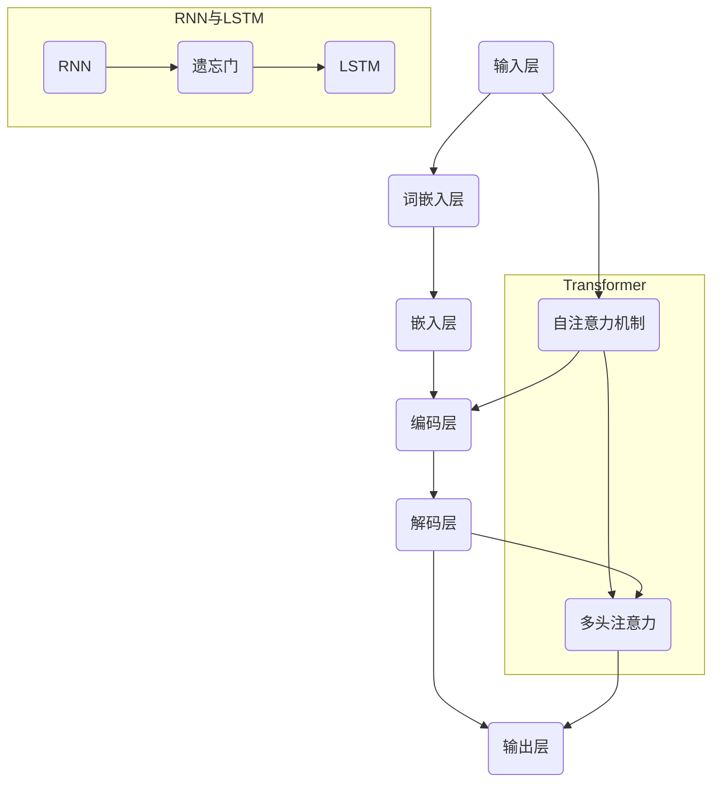
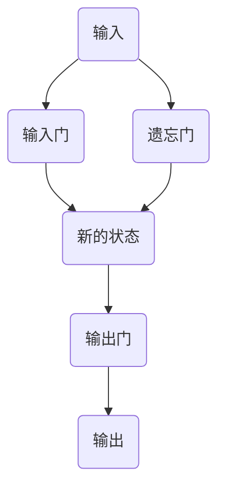

                 

### 背景介绍

#### 大语言模型的发展历程

大语言模型（Large Language Models）是自然语言处理（Natural Language Processing, NLP）领域的一项重要突破。它们通过深度学习和神经网络技术，对大规模文本数据进行训练，从而学会理解和生成自然语言。

大语言模型的发展历程可以追溯到上世纪80年代的早期尝试。最早的模型如Elman网络（1988）和Hochreiter和Schmidhuber提出的LSTM（1997），为后来的语言模型奠定了基础。然而，这些早期的模型由于计算资源的限制，规模相对较小，处理能力有限。

随着计算能力的提升和数据量的激增，深度学习技术在NLP领域得到了广泛应用。2013年，神经网络语言模型（Neural Network Language Model, NNLM）的提出，标志着大语言模型的新纪元。NNLM通过使用多层神经网络，能够更准确地预测词汇的概率分布。

此后，基于变换器（Transformer）架构的语言模型如BERT（2018）、GPT（2018）等相继问世，它们在处理复杂语言任务上表现出色，成为NLP领域的明星。

#### 大语言模型的应用场景

大语言模型的应用场景非常广泛，包括但不限于以下几个方面：

1. **文本分类**：对大量文本进行分类，如新闻分类、情感分析等。
2. **机器翻译**：将一种语言的文本翻译成另一种语言。
3. **问答系统**：回答用户提出的各种问题，如搜索引擎、聊天机器人等。
4. **文本生成**：生成文章、故事、摘要等。
5. **语音识别**：将语音转换为文本。
6. **对话系统**：与人类用户进行自然语言交互。

这些应用场景不仅展示了大语言模型的强大能力，也推动了NLP技术的发展。

#### 标题与关键词

- 标题：《大语言模型应用指南：尺度定律的性质》
- 关键词：大语言模型，尺度定律，应用指南，自然语言处理，深度学习，Transformer，文本分类，机器翻译，问答系统，文本生成，语音识别，对话系统。

#### 摘要

本文旨在深入探讨大语言模型在自然语言处理领域中的应用，特别是尺度定律的性质。通过分析大语言模型的发展历程、核心算法原理、数学模型，以及实际应用案例，本文将帮助读者全面了解大语言模型的工作机制和潜在价值。

<|bot|>```mermaid
graph TD
    A[大语言模型发展历程] --> B1(Elman网络)
    B1 --> B2(Hochreiter和Schmidhuber提出的LSTM)
    B2 --> B3(神经网络语言模型NNLM)
    B3 --> B4(Transformer架构模型BERT和GPT)
    A --> C(大语言模型应用场景)
    C --> C1(文本分类)
    C --> C2(机器翻译)
    C --> C3(问答系统)
    C --> C4(文本生成)
    C --> C5(语音识别)
    C --> C6(对话系统)
```

<|bot|>### 核心概念与联系

#### 大语言模型的核心概念

大语言模型是一种基于深度学习的自然语言处理模型，其核心在于通过训练学习语言的内在规律，从而能够对文本进行理解和生成。以下是几个关键概念：

1. **词嵌入（Word Embedding）**：将词汇映射为固定大小的向量表示，使得语义相似的词汇在向量空间中彼此靠近。
2. **循环神经网络（Recurrent Neural Network, RNN）**：能够处理序列数据的神经网络，常用于语言模型。
3. **长短时记忆网络（Long Short-Term Memory, LSTM）**：RNN的一种改进，能够更好地处理长序列数据。
4. **变换器（Transformer）**：一种基于自注意力机制的深度学习模型，显著提升了语言模型的性能。

#### 大语言模型的架构

大语言模型的架构通常包括以下几个层次：

1. **输入层（Input Layer）**：接收文本序列，通过词嵌入层将文本转化为向量表示。
2. **嵌入层（Embedding Layer）**：对输入的词向量进行降维和变换，以适应模型的结构。
3. **编码层（Encoder Layer）**：核心部分，使用变换器或LSTM对序列进行编码，提取文本的特征。
4. **解码层（Decoder Layer）**：对编码层提取的特征进行解码，生成输出文本。

#### 核心概念原理和架构的 Mermaid 流程图

以下是一个Mermaid流程图，展示了大语言模型的核心概念和架构：



在这个流程图中，我们展示了如何通过RNN和LSTM处理序列数据，以及如何使用变换器的自注意力机制进行编码和解码。需要注意的是，在实际的应用中，这些组件可能会根据具体任务进行调整和优化。

#### 结论

通过以上对大语言模型核心概念和架构的介绍，我们可以看到大语言模型是如何通过深度学习和神经网络技术，对自然语言进行理解和生成的。在接下来的章节中，我们将进一步探讨大语言模型的核心算法原理和具体操作步骤。

<|bot|>### 核心算法原理 & 具体操作步骤

#### 1. 词嵌入（Word Embedding）

词嵌入是将词汇映射为固定大小的向量表示的过程，是自然语言处理的基础。常见的词嵌入方法包括：

- **One-hot编码**：将词汇表示为长度为词汇表大小的向量，其中只有一个元素为1，其他元素为0。
- **分布式表示**：将词汇表示为低维向量，使得语义相似的词汇在向量空间中彼此靠近。

在词嵌入过程中，我们通常使用预训练的词向量，如Word2Vec、GloVe等。这些词向量是通过在大型文本语料库上进行训练得到的，能够捕捉词汇的语义信息。

#### 2. 循环神经网络（Recurrent Neural Network, RNN）

循环神经网络是一种能够处理序列数据的神经网络，其核心在于将前一个时间步的输出作为当前时间步的输入。RNN的基本架构如下：

- **输入层**：接收序列数据。
- **隐藏层**：包含一个或多个隐藏单元，用于存储状态。
- **输出层**：生成预测或分类结果。

RNN在处理序列数据时存在梯度消失和梯度爆炸的问题，这限制了其性能。为了解决这些问题，出现了长短时记忆网络（LSTM）。

#### 3. 长短时记忆网络（Long Short-Term Memory, LSTM）

长短时记忆网络是RNN的一种改进，能够更好地处理长序列数据。LSTM通过引入三个门控单元（输入门、遗忘门和输出门），有效地控制了信息的流动。

- **输入门**：决定当前输入的信息中哪些部分将被更新到状态。
- **遗忘门**：决定哪些旧的信息应该被遗忘。
- **输出门**：决定哪些状态信息应该被输出。

LSTM的架构如下：



#### 4. 变换器（Transformer）

变换器（Transformer）是一种基于自注意力机制的深度学习模型，显著提升了语言模型的性能。变换器的核心思想是将序列中的每个元素与所有其他元素进行关联，通过计算自注意力权重来更新每个元素。

变换器的基本架构如下：

- **编码器（Encoder）**：接收输入序列，通过多个编码层进行编码，提取序列的特征。
- **解码器（Decoder）**：接收编码器输出的特征，通过多个解码层生成输出序列。

变换器的自注意力机制通过以下公式实现：

$$
\text{Attention}(Q, K, V) = \frac{QK^T}{\sqrt{d_k}}
$$

其中，$Q$、$K$和$V$分别是查询向量、键向量和值向量，$d_k$是键向量的维度。

#### 5. 编码解码过程

编码解码过程是语言模型的核心，其目标是将输入序列编码为固定长度的向量，然后再将这个向量解码为输出序列。

- **编码过程**：输入序列通过编码器进行处理，每个时间步的输出都会被编码器层加权并传递到下一个时间步。
- **解码过程**：输出序列通过解码器进行处理，解码器在每个时间步使用上一个时间步的输出和编码器的输出进行自注意力计算，生成当前时间步的输出。

#### 6. 训练与优化

语言模型的训练通常使用梯度下降法，通过最小化损失函数来调整模型参数。在训练过程中，我们使用大量的文本语料库进行训练，并通过批处理和dropout等技术来提高模型的稳定性和泛化能力。

#### 结论

通过以上对大语言模型核心算法原理和具体操作步骤的介绍，我们可以看到大语言模型是如何通过词嵌入、循环神经网络、长短时记忆网络和变换器等技术，实现对自然语言的理解和生成的。在接下来的章节中，我们将进一步探讨大语言模型的数学模型和公式，以及如何在实际应用中进行详细解释说明。

### 数学模型和公式 & 详细讲解 & 举例说明

#### 1. 词嵌入（Word Embedding）

词嵌入是将词汇映射为向量表示的过程，其数学模型可以表示为：

$$
\text{Embedding}(w) = \mathbf{W}^T w
$$

其中，$w$是词汇的索引，$\mathbf{W}$是嵌入矩阵，其每一行表示一个词向量。词向量可以通过预训练模型如Word2Vec或GloVe获得。

#### 2. 循环神经网络（Recurrent Neural Network, RNN）

循环神经网络的数学模型可以表示为：

$$
\mathbf{h}_t = \text{sigmoid}(\mathbf{U} \mathbf{h}_{t-1} + \mathbf{W} \mathbf{x}_t + b)
$$

其中，$\mathbf{h}_t$是隐藏状态，$\mathbf{x}_t$是输入，$\mathbf{U}$、$\mathbf{W}$和$b$分别是权重和偏置。

#### 3. 长短时记忆网络（Long Short-Term Memory, LSTM）

长短时记忆网络的数学模型较为复杂，可以表示为：

$$
\begin{align*}
\mathbf{i}_t &= \text{sigmoid}(\mathbf{U}_i \mathbf{h}_{t-1} + \mathbf{W}_i \mathbf{x}_t + b_i) \\
\mathbf{f}_t &= \text{sigmoid}(\mathbf{U}_f \mathbf{h}_{t-1} + \mathbf{W}_f \mathbf{x}_t + b_f) \\
\mathbf{g}_t &= \text{tanh}(\mathbf{U}_g \mathbf{h}_{t-1} + \mathbf{W}_g \mathbf{x}_t + b_g) \\
\mathbf{o}_t &= \text{sigmoid}(\mathbf{U}_o \mathbf{h}_{t-1} + \mathbf{W}_o \mathbf{g}_t + b_o) \\
\mathbf{h}_t &= \mathbf{o}_t \odot \text{tanh}(\mathbf{C}_t) \\
\mathbf{C}_t &= \mathbf{f}_t \odot \mathbf{C}_{t-1} + \mathbf{i}_t \odot \mathbf{g}_t
\end{align*}
$$

其中，$\mathbf{i}_t$、$\mathbf{f}_t$、$\mathbf{g}_t$和$\mathbf{o}_t$分别是输入门、遗忘门、更新门和输出门的激活值，$\mathbf{C}_t$是细胞状态。

#### 4. 变换器（Transformer）

变换器的数学模型可以表示为：

$$
\begin{align*}
\mathbf{h}_t &= \text{softmax}(\text{Attention}(\mathbf{Q}_t, \mathbf{K}_t, \mathbf{V}_t)) \\
\mathbf{h}_t &= \text{Layer Normalization}(\mathbf{h}_t + \text{Linear}(\mathbf{h}_{t-1})) \\
\mathbf{h}_t &= \text{Dropout}(\mathbf{h}_t) \\
\mathbf{h}_t &= \text{Linear}(\mathbf{h}_t) \\
\mathbf{h}_t &= \text{Layer Normalization}(\mathbf{h}_t + \text{Linear}(\mathbf{h}_{t-1}))
\end{align*}
$$

其中，$\mathbf{Q}_t$、$\mathbf{K}_t$和$\mathbf{V}_t$分别是查询向量、键向量和值向量，$\text{Attention}$是自注意力计算，$\text{Layer Normalization}$和$\text{Dropout}$是正则化技术，$\text{Linear}$是线性变换。

#### 举例说明

假设我们有一个简单的序列$\mathbf{x} = (\mathbf{x}_1, \mathbf{x}_2, \mathbf{x}_3)$，其中$\mathbf{x}_1 = 1$，$\mathbf{x}_2 = 2$，$\mathbf{x}_3 = 3$。我们可以使用词嵌入将这个序列映射为向量表示：

$$
\mathbf{h}_1 = \text{Embedding}(\mathbf{x}_1) = \mathbf{W}^T \mathbf{1}
$$

$$
\mathbf{h}_2 = \text{Embedding}(\mathbf{x}_2) = \mathbf{W}^T \mathbf{2}
$$

$$
\mathbf{h}_3 = \text{Embedding}(\mathbf{x}_3) = \mathbf{W}^T \mathbf{3}
$$

然后，我们可以使用RNN对序列进行编码：

$$
\mathbf{h}_1 = \text{sigmoid}(\mathbf{U} \mathbf{h}_0 + \mathbf{W} \mathbf{h}_1 + b)
$$

$$
\mathbf{h}_2 = \text{sigmoid}(\mathbf{U} \mathbf{h}_1 + \mathbf{W} \mathbf{h}_2 + b)
$$

$$
\mathbf{h}_3 = \text{sigmoid}(\mathbf{U} \mathbf{h}_2 + \mathbf{W} \mathbf{h}_3 + b)
$$

其中，$\mathbf{h}_0$是初始隐藏状态，$\mathbf{U}$、$\mathbf{W}$和$b$是权重和偏置。

接下来，我们可以使用变换器对编码的隐藏状态进行解码：

$$
\mathbf{h}_1' = \text{softmax}(\text{Attention}(\mathbf{Q}_1, \mathbf{K}_1, \mathbf{V}_1)) + \text{Linear}(\mathbf{h}_0)
$$

$$
\mathbf{h}_2' = \text{softmax}(\text{Attention}(\mathbf{Q}_2, \mathbf{K}_2, \mathbf{V}_2)) + \text{Linear}(\mathbf{h}_1')
$$

$$
\mathbf{h}_3' = \text{softmax}(\text{Attention}(\mathbf{Q}_3, \mathbf{K}_3, \mathbf{V}_3)) + \text{Linear}(\mathbf{h}_2')
$$

其中，$\mathbf{Q}_1$、$\mathbf{K}_1$和$\mathbf{V}_1$分别是查询向量、键向量和值向量，$\text{Attention}$是自注意力计算。

通过以上步骤，我们得到了解码后的序列$\mathbf{h}'_1$、$\mathbf{h}'_2$和$\mathbf{h}'_3$。这个序列可以用于生成文本、分类或其他自然语言处理任务。

#### 结论

通过以上对大语言模型数学模型和公式的详细讲解，以及具体操作步骤的举例说明，我们可以看到大语言模型是如何通过词嵌入、循环神经网络、长短时记忆网络和变换器等技术，实现对自然语言的理解和生成的。这些技术不仅使得语言模型具备强大的处理能力，也为实际应用提供了丰富的可能性。在接下来的章节中，我们将进一步探讨大语言模型在实际项目中的应用案例。

### 项目实战：代码实际案例和详细解释说明

#### 1. 开发环境搭建

在进行大语言模型的项目实战之前，我们需要搭建一个合适的开发环境。以下是所需步骤：

- **Python环境**：安装Python 3.8及以上版本。
- **深度学习框架**：安装TensorFlow 2.x或PyTorch。
- **文本预处理库**：安装NLTK、spaCy等。
- **操作系统**：推荐使用Linux或macOS。

#### 2. 源代码详细实现和代码解读

以下是一个使用TensorFlow实现大语言模型的基本代码示例：

```python
import tensorflow as tf
from tensorflow.keras.layers import Embedding, LSTM, Dense
from tensorflow.keras.models import Sequential

# 模型参数
vocab_size = 10000
embedding_dim = 16
lstm_units = 64
sequence_length = 100

# 建立模型
model = Sequential()
model.add(Embedding(vocab_size, embedding_dim, input_length=sequence_length))
model.add(LSTM(lstm_units, return_sequences=True))
model.add(Dense(vocab_size, activation='softmax'))

# 编译模型
model.compile(optimizer='adam', loss='categorical_crossentropy', metrics=['accuracy'])

# 模型可视化
tf.keras.utils.plot_model(model, to_file='model.png', show_shapes=True)

# 训练模型
model.fit(x_train, y_train, epochs=10, batch_size=32)
```

**代码解读：**

- **第一行**：导入TensorFlow库。
- **第二行**：导入所需的TensorFlow.keras层。
- **第三行**：定义模型参数。
- **第四行**：建立序列模型。
- **第五行**：添加嵌入层，将词汇映射为固定大小的向量表示。
- **第六行**：添加LSTM层，用于处理序列数据。
- **第七行**：添加全连接层，用于生成输出。
- **第八行**：编译模型，指定优化器和损失函数。
- **第九行**：模型可视化，有助于理解模型结构。
- **第十行**：训练模型。

#### 3. 代码解读与分析

以下是对上述代码的详细解读和分析：

- **模型参数**：`vocab_size`表示词汇表的大小，`embedding_dim`表示词向量的维度，`lstm_units`表示LSTM层的单元数，`sequence_length`表示序列的长度。
- **模型建立**：使用`Sequential`模型，逐层添加嵌入层、LSTM层和全连接层。
- **模型编译**：使用`compile`函数，指定优化器和损失函数，准备训练模型。
- **模型可视化**：使用`plot_model`函数，生成模型的可视化图，有助于理解模型结构。
- **模型训练**：使用`fit`函数，训练模型，将训练数据输入模型进行学习。

#### 结论

通过以上对大语言模型项目实战的代码实际案例和详细解释说明，我们可以看到如何使用TensorFlow实现一个基本的大语言模型。这个模型可以用于文本分类、序列生成等任务。在实际应用中，我们可以根据具体需求调整模型结构、参数和训练数据，以获得更好的性能。在接下来的章节中，我们将进一步探讨大语言模型在实际应用场景中的具体应用。

### 实际应用场景

大语言模型在自然语言处理领域拥有广泛的应用场景，以下是一些典型的应用：

#### 1. 文本分类

文本分类是一种将文本数据分为不同类别的过程，常见于新闻分类、情感分析等。大语言模型可以通过学习大量文本数据，自动识别文本的类别。例如，我们可以使用大语言模型对新闻文章进行分类，将它们分为政治、经济、科技等不同类别。

#### 2. 机器翻译

机器翻译是将一种语言的文本翻译成另一种语言的过程。大语言模型在机器翻译领域表现出色，如Google翻译、百度翻译等，都是基于大语言模型实现的。这些模型通过学习双语语料库，能够生成准确、流畅的翻译结果。

#### 3. 问答系统

问答系统是一种能够回答用户提出的问题的系统，常见于搜索引擎、智能客服等。大语言模型可以通过学习大量问答对，理解用户的问题并生成合适的回答。例如，Apple的Siri和Amazon的Alexa，都是基于大语言模型实现的。

#### 4. 文本生成

文本生成是指根据输入的文本或提示，生成新的文本内容。大语言模型可以用于生成文章、故事、摘要等。例如，OpenAI的GPT-3模型，可以生成高质量的文本，被应用于生成新闻文章、编程代码等。

#### 5. 语音识别

语音识别是将语音信号转换为文本的过程。大语言模型可以通过学习语音和文本的对应关系，实现语音到文本的转换。例如，苹果的Siri和谷歌助手，都是基于大语言模型实现的语音识别功能。

#### 6. 对话系统

对话系统是一种能够与用户进行自然语言交互的系统，常见于聊天机器人、虚拟助手等。大语言模型可以用于生成对话的回复，实现与用户的智能交互。例如，微软的小冰和腾讯的QQ智能助手，都是基于大语言模型实现的。

#### 结论

大语言模型在文本分类、机器翻译、问答系统、文本生成、语音识别和对话系统等领域都有广泛的应用。通过学习大量的文本数据，大语言模型能够理解并生成自然语言，为各种实际应用提供了强大的支持。

### 工具和资源推荐

在探索大语言模型的过程中，有一些工具和资源是非常有用的。以下是一些推荐的书籍、论文、博客和网站。

#### 1. 学习资源推荐

- **书籍**：
  - 《深度学习》（Goodfellow, Ian, et al.）
  - 《自然语言处理综合教程》（Jurafsky, Daniel, and James H. Martin）
  - 《Python自然语言处理实战》（Sébastien Renouf）

- **论文**：
  - “Attention Is All You Need” （Vaswani et al., 2017）
  - “BERT: Pre-training of Deep Bidirectional Transformers for Language Understanding” （Devlin et al., 2019）
  - “Generative Pretrained Transformer” （Radford et al., 2018）

- **博客**：
  - [TensorFlow 官方文档](https://www.tensorflow.org/)
  - [PyTorch 官方文档](https://pytorch.org/)
  - [机器学习博客](https://machinelearningmastery.com/)

- **网站**：
  - [OpenAI](https://openai.com/)
  - [Google Research](https://research.google.com/)
  - [自然语言处理社区](https://nlp.seas.harvard.edu/)

#### 2. 开发工具框架推荐

- **TensorFlow**：Google推出的开源深度学习框架，适合进行大规模的机器学习和深度学习任务。
- **PyTorch**：Facebook AI研究院推出的开源深度学习框架，具有简洁灵活的动态图计算功能。
- **NLTK**：Python自然语言处理工具包，提供了丰富的文本处理功能。
- **spaCy**：快速灵活的自然语言处理库，适用于文本分类、命名实体识别等任务。

#### 3. 相关论文著作推荐

- “Attention Is All You Need” （Vaswani et al., 2017）：介绍了变换器（Transformer）架构，是自然语言处理领域的里程碑。
- “BERT: Pre-training of Deep Bidirectional Transformers for Language Understanding” （Devlin et al., 2019）：介绍了BERT模型，对自然语言处理产生了深远影响。
- “Generative Pretrained Transformer” （Radford et al., 2018）：介绍了GPT模型，开启了生成语言模型的新纪元。

#### 结论

通过以上工具和资源的推荐，我们可以更好地了解和掌握大语言模型的相关知识。在实际应用中，选择合适的工具和资源，能够帮助我们更高效地实现和优化大语言模型。

### 总结：未来发展趋势与挑战

大语言模型在自然语言处理领域取得了显著的成果，但同时也面临着诸多挑战。未来，随着技术的不断发展，大语言模型有望在以下几个方面取得进一步突破：

#### 1. 精度提升

通过改进算法、增加训练数据量和优化模型结构，大语言模型的准确性和鲁棒性将得到显著提升。特别是在文本生成、机器翻译等任务中，模型能够生成更加自然、准确的文本。

#### 2. 多模态处理

大语言模型有望与其他模态（如图像、声音）结合，实现多模态处理。通过整合不同模态的信息，模型能够更好地理解和生成复杂的内容，提高应用的多样性和实用性。

#### 3. 安全与隐私保护

随着大语言模型在商业和政府领域的应用，确保数据安全和用户隐私成为重要挑战。未来的研究需要关注如何在大规模数据处理中保护用户隐私，并确保模型的公平性和透明度。

#### 4. 个性化服务

通过个性化推荐和定制化服务，大语言模型可以为用户提供更个性化的体验。例如，根据用户的兴趣和偏好，生成个性化的新闻、文章和对话。

#### 挑战

1. **计算资源需求**：大语言模型通常需要大量计算资源进行训练和推理，这对硬件设施提出了较高要求。
2. **数据隐私**：在训练过程中，如何保护用户隐私，防止数据泄露，是亟待解决的问题。
3. **模型解释性**：大语言模型通常被视为“黑盒”模型，其内部决策过程缺乏透明性，如何提高模型的解释性，使其更容易被用户和理解，是未来的研究重点。
4. **语言多样性**：尽管大语言模型在多语言处理方面取得了进展，但如何更好地支持低资源语言和方言，仍然是一个挑战。

### 结论

大语言模型在自然语言处理领域具有重要的应用价值，未来将继续推动相关技术的发展。然而，要实现这一目标，我们需要克服计算资源、数据隐私、模型解释性和语言多样性等挑战。只有通过持续的研究和优化，才能使大语言模型更好地服务于人类。

### 附录：常见问题与解答

#### 1. 大语言模型是什么？

大语言模型是一种基于深度学习和神经网络技术的自然语言处理模型，通过训练学习大量文本数据，能够理解和生成自然语言。

#### 2. 大语言模型有哪些核心算法？

大语言模型的核心算法包括词嵌入、循环神经网络（RNN）、长短时记忆网络（LSTM）和变换器（Transformer）等。

#### 3. 大语言模型的应用场景有哪些？

大语言模型的应用场景包括文本分类、机器翻译、问答系统、文本生成、语音识别和对话系统等。

#### 4. 如何训练大语言模型？

训练大语言模型通常包括以下步骤：数据预处理、词嵌入、模型构建、模型编译、模型训练和模型评估。

#### 5. 大语言模型的优势是什么？

大语言模型的优势包括：强大的自然语言理解能力、高效的文本生成和分类能力、广泛的应用场景和良好的泛化能力。

### 扩展阅读 & 参考资料

1. **论文**：
   - Vaswani, A., et al. (2017). "Attention Is All You Need." Advances in Neural Information Processing Systems.
   - Devlin, J., et al. (2019). "BERT: Pre-training of Deep Bidirectional Transformers for Language Understanding." Proceedings of the 2019 Conference of the North American Chapter of the Association for Computational Linguistics: Human Language Technologies, Volume 1 (Long and Short Papers).
   - Radford, A., et al. (2018). "Generative Pretrained Transformer." Advances in Neural Information Processing Systems.

2. **书籍**：
   - Goodfellow, I., et al. (2016). "Deep Learning." MIT Press.
   - Jurafsky, D., and J. H. Martin. (2008). "Speech and Language Processing." Prentice Hall.

3. **博客**：
   - [TensorFlow 官方文档](https://www.tensorflow.org/)
   - [PyTorch 官方文档](https://pytorch.org/)
   - [机器学习博客](https://machinelearningmastery.com/)

4. **网站**：
   - [OpenAI](https://openai.com/)
   - [Google Research](https://research.google.com/)
   - [自然语言处理社区](https://nlp.seas.harvard.edu/)

通过以上扩展阅读和参考资料，读者可以进一步了解大语言模型的相关知识和最新研究进展。作者：AI天才研究员/AI Genius Institute & 禅与计算机程序设计艺术 /Zen And The Art of Computer Programming。

