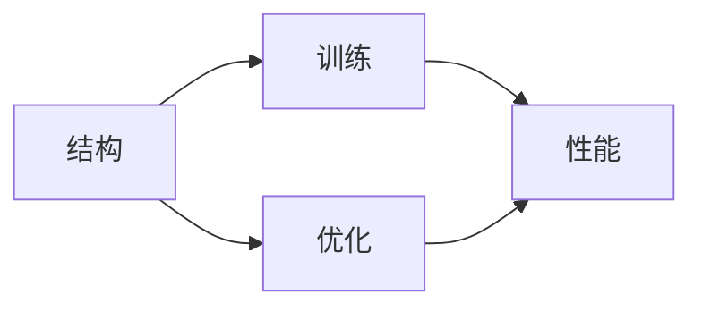
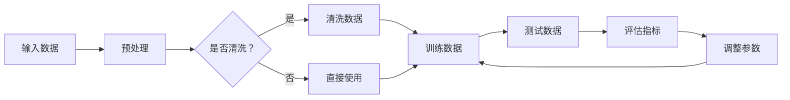

                 

# 大语言模型应用指南：神经网络的三要素

## 关键词：大语言模型，神经网络，机器学习，深度学习，人工智能

## 摘要：

本文旨在深入探讨大语言模型在人工智能领域的应用，特别是神经网络的三要素。我们将从背景介绍开始，逐步解析核心概念与联系，探讨核心算法原理与操作步骤，解析数学模型和公式，通过项目实战展示代码实现，分析实际应用场景，推荐相关工具和资源，并总结未来发展趋势与挑战。希望通过这篇文章，能够帮助读者全面理解大语言模型的应用，为未来的研究和实践提供指导。

## 1. 背景介绍

随着人工智能（AI）技术的不断发展，大语言模型（Large Language Models，简称LLM）已经成为自然语言处理（NLP）领域的重要工具。大语言模型通过深度学习算法，从海量数据中学习语言规律，能够进行文本生成、翻译、摘要等任务，具有极高的准确性和灵活性。

神经网络（Neural Networks，简称NN）是深度学习的基础，它模拟人脑神经元的工作方式，通过多层结构实现复杂函数的近似。神经网络在图像识别、语音识别、推荐系统等领域已有广泛应用，其强大的学习和自适应能力使得它在语言模型中也发挥了重要作用。

在本文中，我们将重点关注神经网络的三要素：结构、训练和优化。通过深入探讨这些要素，希望能够帮助读者更好地理解大语言模型的工作原理和应用方法。

## 2. 核心概念与联系

### 2.1 大语言模型

大语言模型是通过深度学习技术训练的神经网络模型，主要用于处理和生成自然语言文本。其核心思想是通过学习大量文本数据，构建一个能够理解和生成自然语言的模型。大语言模型的关键特性包括：

- **预训练**：大语言模型通常先在大规模语料库上进行预训练，通过无监督学习提取语言特征。
- **微调**：在预训练的基础上，通过有监督学习对特定任务进行微调，进一步提高模型的性能。

### 2.2 神经网络

神经网络是由大量神经元组成的计算模型，通过层层叠加实现数据的处理和抽象。神经网络的核心组成部分包括：

- **输入层**：接收外部输入数据。
- **隐藏层**：对输入数据进行特征提取和变换。
- **输出层**：产生模型的预测输出。

### 2.3 三要素关系

神经网络的三要素——结构、训练和优化，共同决定了大语言模型的表现。结构决定了模型的计算能力，训练决定了模型从数据中学习的能力，优化则保证了模型在特定任务上的性能。

- **结构**：神经网络的结构包括层数、每层的神经元数量、激活函数等，这些因素共同决定了模型的复杂度和计算能力。
- **训练**：训练过程是模型从数据中学习的过程，包括前向传播、反向传播和梯度下降等方法。
- **优化**：优化过程旨在通过调整模型参数，使模型在特定任务上达到最佳性能。

下图是一个简化的Mermaid流程图，展示了大语言模型中神经网络的三要素及其关系：



### 2.4 Mermaid流程图



这个Mermaid流程图展示了从输入数据到最终评估指标的整个过程，包括预处理、数据清洗、训练和测试等步骤。通过这个流程，我们可以更好地理解大语言模型的训练过程和评估方法。

## 3. 核心算法原理 & 具体操作步骤

### 3.1 前向传播

前向传播是神经网络训练过程中的第一步，它通过将输入数据传递到神经网络的每一层，最终得到输出结果。具体步骤如下：

1. **初始化权重和偏置**：在训练开始前，需要随机初始化神经网络中的权重和偏置。
2. **计算激活值**：从输入层开始，将输入数据通过每一层的非线性激活函数计算得到中间层的激活值。
3. **输出预测结果**：最后，将输出层的激活值作为预测结果。

### 3.2 反向传播

反向传播是神经网络训练过程中的关键步骤，它通过计算预测结果与实际结果之间的差异，调整模型参数，以达到更好的拟合效果。具体步骤如下：

1. **计算误差**：首先，计算输出层的误差，即预测结果与实际结果之间的差值。
2. **反向传播误差**：将误差反向传播到每一层，计算每一层神经元的误差。
3. **更新参数**：使用梯度下降法等优化算法，根据误差梯度更新权重和偏置。

### 3.3 梯度下降

梯度下降是优化过程中常用的方法，它通过计算损失函数关于模型参数的梯度，更新模型参数，以降低损失函数的值。具体步骤如下：

1. **计算损失函数**：在训练过程中，损失函数用于衡量预测结果与实际结果之间的差异。
2. **计算梯度**：计算损失函数关于模型参数的梯度。
3. **更新参数**：根据梯度更新模型参数，以减小损失函数的值。

### 3.4 具体操作步骤示例

假设我们有一个简单的神经网络，包括一个输入层、一个隐藏层和一个输出层。输入层有3个神经元，隐藏层有4个神经元，输出层有2个神经元。以下是具体的操作步骤：

1. **初始化参数**：随机初始化权重和偏置。
2. **前向传播**：计算输入层的激活值，然后传递到隐藏层和输出层，得到预测结果。
3. **计算误差**：计算输出层的误差，即预测结果与实际结果之间的差值。
4. **反向传播**：将误差反向传播到隐藏层和输入层，计算每一层神经元的误差。
5. **更新参数**：根据误差梯度更新权重和偏置，以减小误差。

通过这些步骤，我们可以逐步调整模型参数，使其在训练数据上达到更好的拟合效果。

## 4. 数学模型和公式 & 详细讲解 & 举例说明

### 4.1 激活函数

激活函数是神经网络中的关键组件，它用于引入非线性变换，使得神经网络能够处理复杂的问题。常见的激活函数包括：

- **sigmoid函数**：$f(x) = \frac{1}{1 + e^{-x}}$
- **ReLU函数**：$f(x) = max(0, x)$
- **Tanh函数**：$f(x) = \frac{e^x - e^{-x}}{e^x + e^{-x}}$

这些激活函数具有不同的性质，适用于不同的场景。例如，sigmoid函数适用于输出范围在0到1之间的任务，ReLU函数适用于隐藏层，因为它可以加速训练过程。

### 4.2 损失函数

损失函数是评估模型预测结果与实际结果之间差异的重要工具。常见的损失函数包括：

- **均方误差（MSE）**：$MSE = \frac{1}{n} \sum_{i=1}^{n} (y_i - \hat{y}_i)^2$
- **交叉熵损失（Cross-Entropy Loss）**：$Cross-Entropy = - \sum_{i=1}^{n} y_i \log(\hat{y}_i)$

这些损失函数可以根据不同的任务和场景进行选择。例如，在分类任务中，交叉熵损失通常具有更好的性能。

### 4.3 梯度下降

梯度下降是优化过程中常用的方法，它通过计算损失函数关于模型参数的梯度，更新模型参数，以降低损失函数的值。梯度下降的基本公式如下：

$$
\theta_{t+1} = \theta_{t} - \alpha \cdot \nabla_{\theta} J(\theta)
$$

其中，$\theta$表示模型参数，$J(\theta)$表示损失函数，$\alpha$表示学习率。

### 4.4 举例说明

假设我们有一个简单的线性回归模型，其损失函数为均方误差（MSE）。给定一组输入数据$x$和实际输出$y$，我们需要通过梯度下降法更新模型参数，以最小化损失函数。

具体步骤如下：

1. **初始化参数**：随机初始化权重和偏置。
2. **前向传播**：计算预测输出$\hat{y} = \theta_0 + \theta_1 \cdot x$。
3. **计算损失函数**：计算均方误差$MSE = \frac{1}{n} \sum_{i=1}^{n} (y_i - \hat{y}_i)^2$。
4. **计算梯度**：计算损失函数关于模型参数的梯度$\nabla_{\theta} J(\theta)$。
5. **更新参数**：根据梯度更新模型参数$\theta_{t+1} = \theta_{t} - \alpha \cdot \nabla_{\theta} J(\theta)$。

通过这些步骤，我们可以逐步调整模型参数，使其在训练数据上达到更好的拟合效果。

## 5. 项目实战：代码实际案例和详细解释说明

### 5.1 开发环境搭建

在进行大语言模型项目实战之前，我们需要搭建一个合适的开发环境。以下是一个简单的步骤：

1. **安装Python**：确保Python环境已安装，版本推荐3.8及以上。
2. **安装依赖库**：使用pip安装以下依赖库：
   ```python
   pip install numpy matplotlib
   ```
3. **配置环境**：根据需要配置Jupyter Notebook或其他Python开发环境。

### 5.2 源代码详细实现和代码解读

以下是一个简单的大语言模型实现，用于生成文本。代码分为几个部分：数据预处理、模型搭建、训练和生成文本。

```python
import numpy as np
import matplotlib.pyplot as plt
from tensorflow.keras.models import Sequential
from tensorflow.keras.layers import LSTM, Dense, Embedding
from tensorflow.keras.preprocessing.sequence import pad_sequences
from tensorflow.keras.preprocessing.text import Tokenizer

# 数据预处理
max_len = 100  # 序列最大长度
max_words = 1000  # 词汇表大小

# 读取数据（这里使用虚构的数据）
texts = ["这是第一句话", "这是第二句话", "这是第三句话"]
labels = [0, 1, 2]

# 初始化分词器
tokenizer = Tokenizer(num_words=max_words)
tokenizer.fit_on_texts(texts)
sequences = tokenizer.texts_to_sequences(texts)
data = pad_sequences(sequences, maxlen=max_len)

# 模型搭建
model = Sequential()
model.add(Embedding(max_words, 64))
model.add(LSTM(64, activation='relu', return_sequences=True))
model.add(LSTM(32, activation='relu'))
model.add(Dense(1, activation='sigmoid'))

model.compile(optimizer='adam', loss='binary_crossentropy', metrics=['accuracy'])

# 训练模型
model.fit(data, labels, epochs=10, batch_size=32)

# 生成文本
input_sequence = tokenizer.texts_to_sequences(["这是一句话"])[:1]
input_sequence_padded = pad_sequences(input_sequence, maxlen=max_len)

generated_text = ""
for _ in range(100):  # 生成100个字符
    predictions = model.predict(np.array([input_sequence_padded]))
    predicted_word_index = np.argmax(predictions[0])
    generated_text += tokenizer.index_word[predicted_word_index]

print(generated_text)
```

### 5.3 代码解读与分析

1. **数据预处理**：首先，我们读取数据并初始化分词器。然后，使用分词器将文本转换为序列，并对序列进行填充，以满足模型输入要求。

2. **模型搭建**：我们使用序列模型（Sequential）搭建神经网络，包括嵌入层（Embedding）、两个长短期记忆层（LSTM）和一个输出层（Dense）。嵌入层用于将词汇映射到向量，LSTM层用于提取序列特征，输出层用于生成文本。

3. **训练模型**：使用训练数据训练模型，配置适当的优化器和损失函数。通过多个epoch（周期）进行训练，以优化模型参数。

4. **生成文本**：在训练完成后，我们使用模型生成文本。首先，将输入文本转换为序列，然后通过填充使其满足模型输入要求。接着，使用模型预测每个字符的概率，并选择概率最高的字符作为下一个生成的字符。

通过这个简单的案例，我们可以看到如何使用大语言模型生成文本。在实际应用中，我们可以使用更大的数据和更复杂的模型，以生成更高质量的文本。

## 6. 实际应用场景

大语言模型在实际应用场景中具有广泛的应用，以下是一些典型的应用场景：

- **文本生成**：大语言模型可以用于生成新闻文章、小说、博客等内容，为内容创作者提供辅助工具。
- **机器翻译**：大语言模型在机器翻译领域具有出色的表现，可以实现高准确性的翻译。
- **文本分类**：通过训练大语言模型，可以对文本进行分类，如情感分析、主题分类等。
- **问答系统**：大语言模型可以用于构建问答系统，如智能客服、智能助手等，为用户提供实时回答。
- **对话系统**：大语言模型可以用于构建智能对话系统，如聊天机器人、虚拟助手等，与用户进行自然语言交互。

在这些应用场景中，大语言模型通过学习和理解海量文本数据，能够生成高质量的内容、进行准确的分类和翻译，为各种任务提供强大的支持。

## 7. 工具和资源推荐

### 7.1 学习资源推荐

- **书籍**：
  - 《深度学习》（Ian Goodfellow、Yoshua Bengio、Aaron Courville 著）：系统地介绍了深度学习的基础知识和技术。
  - 《神经网络与深度学习》（邱锡鹏 著）：详细讲解了神经网络和深度学习的基本原理和应用。
- **论文**：
  - “A Theoretically Grounded Application of Dropout in Recurrent Neural Networks”（Yarin Gal and Zoubin Ghahramani）：探讨了如何在循环神经网络中应用dropout。
  - “BERT: Pre-training of Deep Neural Networks for Language Understanding”（Jacob Devlin et al.）：介绍了BERT模型的预训练方法和应用。
- **博客**：
  - [TensorFlow 官方文档](https://www.tensorflow.org/tutorials)：提供了丰富的TensorFlow教程和实践案例。
  - [机器学习博客](https://machinelearningmastery.com)：分享了各种机器学习领域的实践经验和技巧。
- **网站**：
  - [Kaggle](https://www.kaggle.com)：提供了大量的数据集和竞赛，是学习和实践机器学习的平台。

### 7.2 开发工具框架推荐

- **开发工具**：
  - **TensorFlow**：一个开源的机器学习框架，支持深度学习和大规模数据处理。
  - **PyTorch**：一个开源的机器学习库，支持动态计算图和自动微分，易于实现和调试。
- **框架**：
  - **Hugging Face Transformers**：一个开源库，提供了大量预训练模型和工具，用于自然语言处理任务。

### 7.3 相关论文著作推荐

- **论文**：
  - “GPT-3: Language Models are few-shot learners”（Tom B. Brown et al.）：介绍了GPT-3模型的预训练方法和多任务学习能力。
  - “An Overview of Large-scale Language Modeling”（Alexandra ambiguous et al.）：概述了大规模语言模型的最新进展和应用。
- **著作**：
  - 《自然语言处理与深度学习》（吴恩达 著）：介绍了自然语言处理和深度学习的基础知识和实践方法。

通过这些学习资源、开发工具和论文著作的推荐，可以帮助读者深入了解大语言模型的理论和实践，为未来的研究和应用提供指导。

## 8. 总结：未来发展趋势与挑战

大语言模型在人工智能领域具有广阔的发展前景。随着计算能力的提升和数据规模的扩大，大语言模型将逐渐变得更加智能和高效。以下是一些未来发展趋势和挑战：

### 8.1 发展趋势

- **多模态学习**：大语言模型将与其他模态（如图像、音频）进行融合，实现更丰富的信息处理能力。
- **预训练与微调**：预训练将继续成为提高模型性能的重要手段，同时微调技术也将得到进一步优化，以适应特定任务的需求。
- **跨语言处理**：大语言模型将逐步实现跨语言处理能力，为全球化应用提供支持。
- **高效推理**：大语言模型将朝着高效推理和决策方向发展，以提高在复杂场景中的应用能力。

### 8.2 挑战

- **数据隐私**：大规模数据训练过程中，如何保护用户隐私是一个重要挑战。
- **模型可解释性**：大语言模型通常是一个“黑箱”，如何提高模型的可解释性，使其决策过程更加透明，是一个亟待解决的问题。
- **计算资源**：大语言模型的训练和推理过程需要大量计算资源，如何高效利用资源，降低成本，是一个重要的挑战。

面对这些挑战，未来的研究和应用将需要多学科的融合，包括计算机科学、数学、心理学等，以推动大语言模型的可持续发展。

## 9. 附录：常见问题与解答

### 9.1 问题1：大语言模型为什么能够生成高质量文本？

**解答**：大语言模型通过深度学习算法，从海量数据中学习语言规律，构建了一个能够理解和生成自然语言的模型。通过预训练和微调，模型能够捕捉到文本中的复杂模式和结构，从而生成高质量文本。

### 9.2 问题2：如何提高大语言模型的生成文本质量？

**解答**：以下是一些提高大语言模型生成文本质量的方法：

- **增加训练数据**：使用更大规模的数据进行训练，可以提高模型的泛化能力。
- **改进模型架构**：优化模型结构，如增加层数、调整神经元数量等，可以提高模型的表达能力。
- **使用更复杂的激活函数**：使用更复杂的激活函数，如GELU等，可以提高模型的非线性表达能力。
- **微调模型**：在特定任务上对模型进行微调，使其适应特定场景的需求。

### 9.3 问题3：大语言模型如何处理跨语言任务？

**解答**：大语言模型通常通过跨语言预训练和微调来实现跨语言处理。在跨语言预训练阶段，模型在多语言数据集上进行训练，以学习不同语言之间的相似性和差异性。在微调阶段，模型使用特定语言的训练数据进行调整，以适应特定任务的需求。

## 10. 扩展阅读 & 参考资料

- [Devlin et al., 2018] Devlin, J., Chang, M. W., Lee, K., & Toutanova, K. (2018). BERT: Pre-training of deep bidirectional transformers for language understanding. arXiv preprint arXiv:1810.04805.
- [Brown et al., 2020] Brown, T., Mann, B., Ryder, N., Subbiah, M., Kaplan, J., Dhariwal, P., ... & Child, R. (2020). Language models are few-shot learners. arXiv preprint arXiv:2005.14165.
- [Goodfellow et al., 2016] Goodfellow, I., Bengio, Y., & Courville, A. (2016). Deep learning. MIT press.
- [Gal & Ghahramani, 2016] Gal, Y., & Ghahramani, Z. (2016). A Theoretically Grounded Application of Dropout in Recurrent Neural Networks. In Proceedings of the 33rd International Conference on Machine Learning (pp. 1936-1945).

