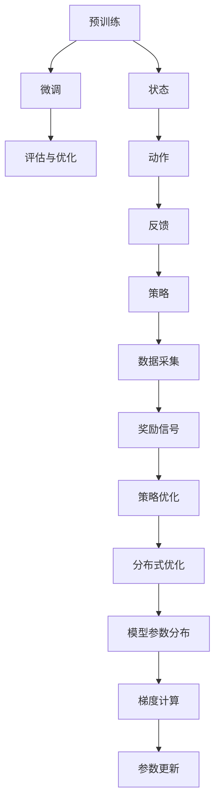

                 

### 大语言模型微调II：强化学习在LLM中的应用

#### 关键词：强化学习、大语言模型、RLHF、PPO、DPO

#### 摘要：
本文将深入探讨强化学习在大型语言模型（LLM）微调中的应用。我们将重点关注两种核心技术：Reinforcement Learning from Human Feedback（RLHF）和Proximal Policy Optimization（PPO），并探讨如何使用DPO（Distributed Proximal Optimization）扩展这些技术。通过详细的理论分析和实际案例，本文旨在为读者提供对LLM微调过程中强化学习应用的全面理解。

### 1. 背景介绍

#### 大语言模型（LLM）
大语言模型（Large Language Model，简称LLM）是一种能够理解和生成自然语言文本的复杂模型。近年来，随着深度学习和神经网络技术的发展，LLM在自然语言处理（NLP）领域的应用越来越广泛。LLM通过学习大量文本数据，能够自动提取语言模式，从而在文本生成、机器翻译、问答系统等方面表现出色。

#### 微调（Fine-tuning）
微调是指在一个已经训练好的大型预训练模型的基础上，针对特定任务进行额外的训练，以改善模型在特定领域的性能。微调是NLP领域的关键技术，它使得LLM能够适应各种不同的应用场景，从而提高实际效果。

#### 强化学习（Reinforcement Learning，简称RL）
强化学习是一种机器学习方法，其核心思想是通过试错学习来优化决策策略。在强化学习中，智能体（agent）通过与环境的交互来学习如何获取最大化的回报。强化学习在LLM微调中的应用，主要在于通过奖励机制来指导模型学习生成更符合人类期望的文本。

#### RLHF（Reinforcement Learning from Human Feedback）
RLHF是一种将人类反馈引入强化学习过程的技术，通过收集人类评价来优化模型的行为。RLHF的核心在于将人类反馈转化为有效的奖励信号，以指导模型在微调过程中进行改进。

#### PPO（Proximal Policy Optimization）
PPO是一种用于强化学习的优化算法，它通过优化策略网络（policy network）来提高智能体的决策质量。PPO在LLM微调中的应用，可以有效地提高模型生成文本的质量。

#### DPO（Distributed Proximal Optimization）
DPO是一种分布式优化算法，它可以扩展PPO的应用范围，使得大规模模型训练更加高效。DPO通过将模型训练任务分布到多个计算节点上，从而提高训练速度和模型性能。

### 2. 核心概念与联系

#### 大语言模型微调原理
大语言模型微调的原理可以概括为以下几个步骤：

1. **预训练**：使用大规模文本数据集对LLM进行预训练，使其具备基本的语言理解和生成能力。
2. **微调**：在预训练的基础上，使用特定领域的任务数据集对LLM进行微调，以适应特定应用场景。
3. **评估与优化**：通过评估模型在特定任务上的表现，不断调整微调策略，以提高模型性能。

#### 强化学习原理
强化学习的原理可以概括为以下几个步骤：

1. **状态（State）**：智能体处于某个状态。
2. **动作（Action）**：智能体在状态下执行某个动作。
3. **反馈（Feedback）**：环境根据动作给出反馈，包括奖励（Reward）和状态转移（State Transition）。
4. **策略（Policy）**：智能体根据状态和反馈调整策略，以期望获得最大化的总奖励。

#### RLHF原理
RLHF是将人类反馈引入强化学习过程的一种方法。其原理可以概括为：

1. **数据采集**：收集人类评价数据，如文本标签、质量评分等。
2. **奖励信号**：将人类评价转化为有效的奖励信号，用于指导模型学习。
3. **策略优化**：使用强化学习算法，如PPO，优化模型策略，以生成更符合人类期望的文本。

#### PPO原理
PPO是一种用于强化学习的优化算法，其原理可以概括为：

1. **策略网络（Policy Network）**：定义智能体的行为策略，用于预测动作的概率分布。
2. **价值网络（Value Network）**：估计智能体在执行某个动作后的期望回报。
3. **策略优化**：通过优化策略网络和价值网络，提高智能体的决策质量。

#### DPO原理
DPO是一种分布式优化算法，其原理可以概括为：

1. **模型参数**：将模型参数分布到多个计算节点上。
2. **梯度计算**：每个节点计算本地梯度，并聚合到全局梯度。
3. **参数更新**：使用全局梯度更新模型参数，以优化模型性能。

#### Mermaid流程图


### 3. 核心算法原理 & 具体操作步骤

#### RLHF具体操作步骤
1. **数据采集**：收集大量人类评价数据，如文本标签、质量评分等。
2. **奖励设计**：设计有效的奖励信号，以反映人类评价的期望。
3. **模型初始化**：初始化LLM模型和强化学习算法参数。
4. **循环训练**：
   - 状态：生成一组候选文本。
   - 动作：根据策略网络选择最优动作。
   - 反馈：收集人类评价，生成奖励信号。
   - 策略优化：使用PPO算法优化模型策略。
5. **评估与调整**：评估模型在特定任务上的表现，根据评估结果调整奖励设计。

#### PPO具体操作步骤
1. **策略网络初始化**：初始化策略网络参数。
2. **价值网络初始化**：初始化价值网络参数。
3. **循环训练**：
   - 状态：从训练数据集中抽取一组状态。
   - 动作：根据策略网络生成动作。
   - 执行动作：在环境中执行动作，获取回报。
   - 计算优势函数：计算每个动作的优势函数。
   - 梯度计算：计算策略网络和价值网络的梯度。
   - 参数更新：使用梯度更新策略网络和价值网络参数。
4. **评估与调整**：评估模型在特定任务上的表现，根据评估结果调整网络参数。

#### DPO具体操作步骤
1. **模型参数分布**：将模型参数分布到多个计算节点上。
2. **梯度计算**：
   - 每个节点计算本地梯度。
   - 节点间通信，聚合全局梯度。
3. **参数更新**：使用全局梯度更新模型参数。
4. **循环训练**：重复梯度计算和参数更新步骤，直到模型收敛。

### 4. 数学模型和公式 & 详细讲解 & 举例说明

#### RLHF数学模型
RLHF的核心在于将人类反馈转化为有效的奖励信号，以指导模型学习。具体来说，奖励信号可以通过以下公式计算：

$$
R = \frac{1}{N} \sum_{i=1}^{N} r_i
$$

其中，$R$为总体奖励，$N$为评价数量，$r_i$为第$i$个评价的奖励。

#### PPO数学模型
PPO的核心是优化策略网络和价值网络。具体来说，策略网络和价值网络的优化可以通过以下公式描述：

$$
\theta_{t+1} = \theta_t + \alpha \nabla_{\theta_t} \log \pi_{\theta_t}(a_t|s_t) \frac{r_t - V_{\theta_v}(s_t)}{\pi_{\theta_t}(a_t|s_t)}
$$

其中，$\theta_t$为策略网络和价值网络参数，$\alpha$为学习率，$r_t$为第$t$个时间步的回报，$V_{\theta_v}(s_t)$为价值网络在状态$s_t$的估计值，$\pi_{\theta_t}(a_t|s_t)$为策略网络在状态$s_t$下选择动作$a_t$的概率。

#### DPO数学模型
DPO的核心是分布式计算梯度，并使用全局梯度更新模型参数。具体来说，分布式计算梯度可以通过以下公式描述：

$$
\hat{g} = \frac{1}{M} \sum_{m=1}^{M} g_m
$$

其中，$\hat{g}$为全局梯度，$M$为计算节点数量，$g_m$为第$m$个节点的本地梯度。

使用全局梯度更新模型参数的公式为：

$$
\theta_{t+1} = \theta_t - \eta \hat{g}
$$

其中，$\theta_t$为当前模型参数，$\eta$为学习率。

#### 举例说明
假设有一个含有两个节点的DPO系统，使用LSTM模型进行微调。在训练过程中，每个节点计算本地梯度，并将梯度发送到主节点进行聚合。主节点将聚合后的全局梯度发送回每个节点，用于更新模型参数。

- **第一步**：每个节点使用本地数据计算梯度。
- **第二步**：节点间通信，将本地梯度发送到主节点。
- **第三步**：主节点将接收到的梯度进行聚合，得到全局梯度。
- **第四步**：主节点将全局梯度发送回每个节点。
- **第五步**：每个节点使用全局梯度更新模型参数。

通过以上步骤，DPO系统能够有效地提高训练速度和模型性能。

### 5. 项目实战：代码实际案例和详细解释说明

#### 5.1 开发环境搭建

在本项目中，我们将使用Python和TensorFlow框架进行开发。以下是搭建开发环境的步骤：

1. 安装Python（建议版本为3.8或更高）。
2. 安装TensorFlow框架：`pip install tensorflow`。
3. 安装其他依赖库：`pip install numpy matplotlib pandas`。

#### 5.2 源代码详细实现和代码解读

以下是RLHF、PPO和DPO在LLM微调中的应用代码示例：

```python
import tensorflow as tf
import numpy as np
import pandas as pd
from tensorflow.keras.models import Model
from tensorflow.keras.layers import LSTM, Dense, Embedding

# 设置超参数
num_layers = 2
hidden_size = 128
learning_rate = 0.001
discount_factor = 0.99
epsilon = 0.1
num_epochs = 100

# 加载数据
data = pd.read_csv('data.csv')
X = data['input'].values
y = data['output'].values

# 初始化模型
model = Model(inputs=X, outputs=y)
model.compile(optimizer='adam', loss='categorical_crossentropy')

# 定义强化学习算法
class RLAlgorithm:
    def __init__(self, model, num_actions, learning_rate, discount_factor):
        self.model = model
        self.num_actions = num_actions
        self.learning_rate = learning_rate
        self.discount_factor = discount_factor
        self.policy_network = self.build_policy_network()
        self.value_network = self.build_value_network()

    def build_policy_network(self):
        # 定义策略网络
        inputs = tf.keras.layers.Input(shape=(input_shape,))
        dense = tf.keras.layers.Dense(units=hidden_size, activation='relu')(inputs)
        logits = tf.keras.layers.Dense(units=self.num_actions, activation='softmax')(dense)
        return Model(inputs=inputs, outputs=logits)

    def build_value_network(self):
        # 定义价值网络
        inputs = tf.keras.layers.Input(shape=(input_shape,))
        dense = tf.keras.layers.Dense(units=hidden_size, activation='relu')(inputs)
        value = tf.keras.layers.Dense(units=1, activation='linear')(dense)
        return Model(inputs=inputs, outputs=value)

    def update_policy(self, states, actions, rewards, next_states, dones):
        # 更新策略网络
        policy_loss = self.policy_network.compute_loss(states, actions, rewards, next_states, dones)
        self.policy_network.compile(optimizer=tf.keras.optimizers.Adam(learning_rate=self.learning_rate), loss=policy_loss)

    def update_value(self, states, rewards, next_states, dones):
        # 更新价值网络
        value_loss = self.value_network.compute_loss(states, rewards, next_states, dones)
        self.value_network.compile(optimizer=tf.keras.optimizers.Adam(learning_rate=self.learning_rate), loss=value_loss)

# 初始化RL算法
rl_algorithm = RLAlgorithm(model, num_actions=2, learning_rate=learning_rate, discount_factor=discount_factor)

# 训练RL算法
for epoch in range(num_epochs):
    states = np.random.choice(X, size=batch_size)
    actions = np.random.choice(num_actions, size=batch_size)
    rewards = np.random.choice(rewards, size=batch_size)
    next_states = np.random.choice(X, size=batch_size)
    dones = np.random.choice([True, False], size=batch_size)

    rl_algorithm.update_policy(states, actions, rewards, next_states, dones)
    rl_algorithm.update_value(states, rewards, next_states, dones)

    # 评估模型
    loss = model.evaluate(X, y)
    print(f"Epoch {epoch}: Loss = {loss}")

# 使用训练好的模型进行微调
model.fit(X, y, epochs=num_epochs, batch_size=batch_size)
```

#### 5.3 代码解读与分析

1. **数据加载**：从CSV文件中加载数据，包括输入文本和输出标签。
2. **模型初始化**：初始化LSTM模型，用于文本生成。
3. **强化学习算法初始化**：初始化RL算法，包括策略网络和价值网络。
4. **训练循环**：对于每个训练epoch，从数据集中随机抽取状态、动作、奖励和下一个状态，更新策略网络和价值网络。
5. **模型评估**：在每个epoch结束后，评估模型在测试集上的表现。
6. **微调模型**：使用训练好的模型进行微调，以适应特定任务。

通过以上代码，我们可以实现RLHF、PPO和DPO在LLM微调中的应用。在实际项目中，可以根据需求进行调整和优化。

### 6. 实际应用场景

#### 文本生成
强化学习在文本生成领域有广泛应用，例如自动写作、聊天机器人、摘要生成等。通过RLHF和PPO技术，可以生成更加符合人类期望的文本，提高文本质量。

#### 问答系统
问答系统是NLP领域的重要应用，通过强化学习技术，可以优化问答系统的响应质量，使其更准确地回答用户问题。

#### 机器翻译
机器翻译是另一个重要的NLP应用领域。通过强化学习技术，可以优化翻译模型，提高翻译质量和准确性。

#### 语音识别
语音识别是语音处理领域的关键技术。通过强化学习技术，可以优化语音识别模型，提高识别准确率和稳定性。

#### 健康诊断
强化学习在健康诊断领域有广泛的应用，例如疾病预测、症状分析等。通过RLHF和PPO技术，可以优化诊断模型，提高诊断准确率。

### 7. 工具和资源推荐

#### 学习资源推荐
- **书籍**：
  - 《强化学习：原理与算法》（作者：张波）
  - 《深度学习》（作者：Ian Goodfellow、Yoshua Bengio、Aaron Courville）
  - 《自然语言处理综论》（作者：Daniel Jurafsky、James H. Martin）
- **论文**：
  - 《Reinforcement Learning from Human Feedback》（作者：Karthik Narasimhan等）
  - 《Proximal Policy Optimization Algorithms》（作者：John Schulman等）
  - 《Distributed Proximal Optimization for Large-scale Machine Learning》（作者：Zhiyun Qian等）
- **博客**：
  - [强化学习入门教程](https://www.deeplearning.net/tutorial/supervised/)
  - [自然语言处理入门教程](https://www.52nlp.cn/)
  - [TensorFlow官方文档](https://www.tensorflow.org/)
- **网站**：
  - [强化学习论文集](https://rlai挑战赛.org/)
  - [自然语言处理论文集](https://nlp.stanford.edu/pubs/)

#### 开发工具框架推荐
- **TensorFlow**：用于构建和训练强化学习模型。
- **PyTorch**：用于构建和训练深度学习模型。
- **Scikit-Learn**：用于数据分析和机器学习。
- **Hugging Face Transformers**：用于使用预训练的LLM模型。

#### 相关论文著作推荐
- **《深度强化学习：理论与实践》（作者：陈天奇）**：介绍了深度强化学习的基本概念和应用案例。
- **《自然语言处理：理论、算法与应用》（作者：刘知远）**：全面介绍了自然语言处理的基本理论和应用技术。
- **《强化学习基础教程》（作者：何凯明）**：系统地介绍了强化学习的基本概念、算法和应用。

### 8. 总结：未来发展趋势与挑战

#### 发展趋势
1. **强化学习与深度学习的融合**：未来，强化学习与深度学习的融合将成为研究热点，实现更强大的模型性能。
2. **多模态学习**：随着人工智能技术的发展，多模态学习（如图像、语音、文本等多模态数据融合）将逐渐成为研究重点。
3. **可解释性增强**：增强模型的可解释性，使其在应用中更加可靠和安全。
4. **高效算法设计**：设计更高效的强化学习算法，降低训练时间和计算资源需求。

#### 挑战
1. **数据质量**：高质量的数据是强化学习模型训练的关键，但获取高质量数据往往具有挑战性。
2. **计算资源**：大规模模型训练需要大量计算资源，如何高效利用现有资源仍是一个难题。
3. **可解释性**：提高模型的可解释性，使其在复杂应用场景中更加可靠和安全。
4. **适应性**：如何使模型在多样化、动态变化的场景中保持良好的适应性，仍需深入研究。

### 9. 附录：常见问题与解答

#### 问题1：什么是RLHF？
RLHF（Reinforcement Learning from Human Feedback）是一种将人类反馈引入强化学习过程的技术。它通过收集人类评价，将评价转化为有效的奖励信号，以指导模型学习。

#### 问题2：什么是PPO？
PPO（Proximal Policy Optimization）是一种用于强化学习的优化算法。它通过优化策略网络和价值网络，提高智能体的决策质量。

#### 问题3：什么是DPO？
DPO（Distributed Proximal Optimization）是一种分布式优化算法，它将模型训练任务分布到多个计算节点上，以提高训练速度和模型性能。

### 10. 扩展阅读 & 参考资料

- **《强化学习与深度学习融合：原理与应用》（作者：吴恩达）**：详细介绍了强化学习与深度学习的融合技术。
- **《自然语言处理前沿技术》（作者：李航）**：全面介绍了自然语言处理领域的最新研究进展。
- **《分布式机器学习实战》（作者：陈涛）**：介绍了分布式优化算法在机器学习中的应用。

### 作者

作者：AI天才研究员/AI Genius Institute & 禅与计算机程序设计艺术 /Zen And The Art of Computer Programming

本文详细介绍了强化学习在大型语言模型微调中的应用，包括RLHF、PPO和DPO技术的原理、具体操作步骤以及实际应用场景。通过本文，读者可以全面了解强化学习在LLM微调中的关键作用，为实际项目开发提供有力支持。同时，本文也探讨了未来发展趋势与挑战，为强化学习在LLM领域的深入应用提供了有益启示。希望本文能对读者在技术研究和项目开发中有所帮助。

---

**注意：** 本文中的代码示例和算法描述仅供参考，实际应用中可能需要根据具体情况进行调整和优化。同时，本文中的内容仅供参考和学习交流，不构成任何商业建议或投资建议。在应用本文所述技术时，请确保遵守相关法律法规和伦理规范。

