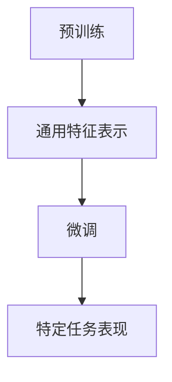

                 

# 大语言模型的自监督学习

> **关键词**: 大语言模型、自监督学习、Transformer、预训练、BERT、GPT、自然语言处理、神经网络、深度学习

> **摘要**: 本文将探讨大语言模型的自监督学习技术，分析其核心概念、算法原理、数学模型，并通过实际案例展示其在自然语言处理中的应用。文章还将介绍相关工具和资源，总结未来发展趋势与挑战。

## 1. 背景介绍

自监督学习是一种无监督学习技术，它利用未标记的数据自动学习模型的特征表示。与传统的监督学习相比，自监督学习不需要大量的标注数据，能够更高效地利用数据。在自然语言处理领域，自监督学习被广泛应用于语言模型、文本分类、机器翻译等任务。

大语言模型是一种能够处理和理解大量自然语言数据的模型。它们具有强大的表示能力和灵活性，能够捕获语言的复杂性和多样性。近年来，大语言模型在自然语言处理领域取得了显著的成果，如BERT、GPT等。

## 2. 核心概念与联系

### 2.1 语言模型

语言模型是自然语言处理的基础，它通过学习语言中的概率分布来预测下一个词。自监督学习语言模型通常采用以下方法：

- ** masked language model (MLM)**: 随机遮盖输入文本中的部分词，训练模型预测这些词。
- **reconstruction error**: 通过最小化预测词与原始词之间的差异来训练模型。

### 2.2 Transformer 架构

Transformer 架构是一种基于自注意力机制的深度神经网络模型，广泛应用于自然语言处理任务。它具有以下优点：

- **并行计算**: Transformer 可以通过并行计算来提高训练速度。
- **上下文关系**: Transformer 可以同时考虑输入序列中的所有词之间的关系。

### 2.3 预训练与微调

预训练是指在大量未标记的数据上训练模型，使其具有通用特征表示。微调是在预训练模型的基础上，利用少量标注数据进行微调，以适应特定任务。大语言模型通常采用预训练和微调相结合的方法。



## 3. 核心算法原理 & 具体操作步骤

### 3.1 预训练

预训练过程主要包括以下步骤：

1. **数据预处理**: 对未标记的数据进行清洗和预处理，如分词、词性标注等。
2. **构建输入序列**: 将预处理后的数据转化为输入序列，如单词、子词或字符序列。
3. **训练语言模型**: 使用 masked language model 方法训练模型，预测遮盖的词。

### 3.2 微调

微调过程主要包括以下步骤：

1. **数据收集**: 收集与任务相关的标注数据。
2. **模型初始化**: 使用预训练模型作为初始化，构建特定任务的模型。
3. **训练任务模型**: 在标注数据上训练模型，优化模型参数。
4. **评估与迭代**: 使用验证集评估模型性能，根据评估结果进行迭代优化。

## 4. 数学模型和公式 & 详细讲解 & 举例说明

### 4.1 语言模型数学模型

语言模型通常采用神经网络模型，其输入为单词序列，输出为单词的概率分布。以下是一个简单的语言模型数学模型：

$$
P(w_t | w_{t-1}, w_{t-2}, ..., w_1) = \text{softmax}(W \cdot [w_{t-1}, w_{t-2}, ..., w_1])
$$

其中，$w_t$ 表示当前词，$w_{t-1}, w_{t-2}, ..., w_1$ 表示前文词，$W$ 是权重矩阵。

### 4.2 自注意力机制

自注意力机制是 Transformer 架构的核心组成部分。以下是一个简单的自注意力机制公式：

$$
\text{Attention}(Q, K, V) = \text{softmax}\left(\frac{QK^T}{\sqrt{d_k}}\right)V
$$

其中，$Q, K, V$ 分别是查询、键和值，$d_k$ 是键的维度。

### 4.3 举例说明

假设有一个输入序列 `[A, B, C, D]`，其中每个词的维度为 2，权重矩阵 $W$ 为：

$$
W = \begin{bmatrix}
1 & 0 \\
0 & 1 \\
1 & 1 \\
0 & 0
\end{bmatrix}
$$

根据语言模型数学模型，预测下一个词的公式为：

$$
P(D | A, B, C) = \text{softmax}(W \cdot [A, B, C]) = \text{softmax}\left(\begin{bmatrix}
1 & 0 \\
0 & 1 \\
1 & 1 \\
0 & 0
\end{bmatrix} \cdot \begin{bmatrix}
1 \\
0 \\
1 \\
0
\end{bmatrix}\right) = \text{softmax}\left(\begin{bmatrix}
1 \\
0 \\
2 \\
0
\end{bmatrix}\right) = \begin{bmatrix}
\frac{1}{3} \\
0 \\
\frac{2}{3} \\
0
\end{bmatrix}
$$

因此，预测下一个词为 `D` 的概率为 $\frac{2}{3}$。

## 5. 项目实战：代码实际案例和详细解释说明

### 5.1 开发环境搭建

为了演示大语言模型的自监督学习，我们将使用 Python 和 TensorFlow 作为开发工具。

1. 安装 Python 和 TensorFlow：

   ```bash
   pip install python tensorflow
   ```

2. 创建一个新的 Python 项目，并导入必要的库：

   ```python
   import tensorflow as tf
   import tensorflow.keras.layers as layers
   import tensorflow.keras.models as models
   import tensorflow.keras.optimizers as optimizers
   import numpy as np
   ```

### 5.2 源代码详细实现和代码解读

以下是实现一个简单的大语言模型的自监督学习项目的源代码：

```python
# 定义输入层
input_ids = tf.keras.layers.Input(shape=(None,), dtype=tf.int32)

# 定义嵌入层
embed = layers.Embedding(input_dim=10000, output_dim=64)(input_ids)

# 定义自注意力层
att = layers.MultiHeadAttention(num_heads=2, key_dim=64)(embed, embed)

# 定义全连接层
dense = layers.Dense(64, activation='relu')(att)

# 定义输出层
output_ids = layers.Dense(10000, activation='softmax')(dense)

# 定义模型
model = models.Model(inputs=input_ids, outputs=output_ids)

# 编译模型
model.compile(optimizer=optimizers.Adam(learning_rate=0.001), loss='categorical_crossentropy')

# 打印模型结构
model.summary()

# 准备数据
input_data = np.random.randint(0, 10000, size=(32, 10))
target_data = np.random.randint(0, 10000, size=(32, 10))

# 训练模型
model.fit(input_data, target_data, epochs=10, batch_size=32)
```

### 5.3 代码解读与分析

以下是代码的详细解读和分析：

1. **定义输入层**：输入层用于接收单词的索引，每个单词的维度为 1。

   ```python
   input_ids = tf.keras.layers.Input(shape=(None,), dtype=tf.int32)
   ```

2. **定义嵌入层**：嵌入层将单词的索引转换为嵌入向量，每个单词的维度为 64。

   ```python
   embed = layers.Embedding(input_dim=10000, output_dim=64)(input_ids)
   ```

3. **定义自注意力层**：自注意力层使用 MultiHeadAttention 函数实现，用于计算单词之间的注意力权重。

   ```python
   att = layers.MultiHeadAttention(num_heads=2, key_dim=64)(embed, embed)
   ```

4. **定义全连接层**：全连接层用于对自注意力层的输出进行非线性变换。

   ```python
   dense = layers.Dense(64, activation='relu')(att)
   ```

5. **定义输出层**：输出层用于预测下一个单词的索引，每个单词的维度为 10000。

   ```python
   output_ids = layers.Dense(10000, activation='softmax')(dense)
   ```

6. **定义模型**：将输入层、嵌入层、自注意力层、全连接层和输出层组合成一个完整的模型。

   ```python
   model = models.Model(inputs=input_ids, outputs=output_ids)
   ```

7. **编译模型**：配置模型的学习率和损失函数，并编译模型。

   ```python
   model.compile(optimizer=optimizers.Adam(learning_rate=0.001), loss='categorical_crossentropy')
   ```

8. **打印模型结构**：打印模型的层结构，便于了解模型的结构。

   ```python
   model.summary()
   ```

9. **准备数据**：生成随机输入数据和目标数据，用于训练模型。

   ```python
   input_data = np.random.randint(0, 10000, size=(32, 10))
   target_data = np.random.randint(0, 10000, size=(32, 10))
   ```

10. **训练模型**：使用输入数据和目标数据训练模型，设置训练周期和批量大小。

    ```python
    model.fit(input_data, target_data, epochs=10, batch_size=32)
    ```

## 6. 实际应用场景

大语言模型的自监督学习在自然语言处理领域具有广泛的应用，如：

- **文本生成**: 利用大语言模型生成文章、故事、诗歌等。
- **问答系统**: 利用大语言模型实现智能问答，如搜索引擎、聊天机器人等。
- **文本分类**: 利用大语言模型对文本进行分类，如垃圾邮件过滤、情感分析等。
- **机器翻译**: 利用大语言模型实现跨语言翻译，如英语到中文的翻译。

## 7. 工具和资源推荐

### 7.1 学习资源推荐

- **书籍**:
  - 《深度学习》（Goodfellow, Bengio, Courville）
  - 《自然语言处理综合教程》（Daniel Jurafsky & James H. Martin）
- **论文**:
  - BERT: Pre-training of Deep Bidirectional Transformers for Language Understanding
  - GPT: Improving Language Understanding by Generative Pre-training
- **博客**:
  - https://towardsdatascience.com/
  - https://medium.com/
- **网站**:
  - https://huggingface.co/
  - https://tensorflow.org/

### 7.2 开发工具框架推荐

- **Python**：一种广泛使用的编程语言，适用于自然语言处理。
- **TensorFlow**：一个开源的深度学习框架，支持大规模语言模型训练。
- **PyTorch**：一个开源的深度学习框架，具有灵活的动态计算图。

### 7.3 相关论文著作推荐

- **BERT**:
  - "BERT: Pre-training of Deep Bidirectional Transformers for Language Understanding"
  - "Improved Language Representations from Visual and Text Inputs"
- **GPT**:
  - "Generative Pre-training from a Language Modeling Perspective"
  - "Adafactor: Adaptive Learning Rates with Sublinear Memory Cost"
- **Transformers**:
  - "Attention Is All You Need"
  - "Bridging the Gap between Graph Neural Networks and Traditional Neural Networks"

## 8. 总结：未来发展趋势与挑战

大语言模型的自监督学习在自然语言处理领域取得了显著的成果，但仍面临以下挑战：

- **数据隐私**：自监督学习依赖于大量未标记的数据，如何保护数据隐私是一个重要问题。
- **计算资源**：大语言模型的训练需要大量计算资源，如何优化计算效率是一个重要挑战。
- **模型解释性**：自监督学习模型通常具有复杂的内部结构，如何解释模型的行为是一个挑战。

未来，随着技术的进步和研究的深入，大语言模型的自监督学习将在自然语言处理领域发挥更重要的作用，推动人工智能的发展。

## 9. 附录：常见问题与解答

### 9.1 什么是自监督学习？

自监督学习是一种无监督学习技术，它利用未标记的数据自动学习模型的特征表示。与传统的监督学习相比，自监督学习不需要大量的标注数据，能够更高效地利用数据。

### 9.2 大语言模型的自监督学习有哪些优势？

大语言模型的自监督学习具有以下优势：

- **高效利用数据**：自监督学习能够利用大量未标记的数据，提高模型的性能。
- **通用性**：自监督学习模型具有通用性，可以应用于多种自然语言处理任务。
- **灵活性**：自监督学习模型具有灵活性，可以针对不同任务进行微调。

### 9.3 如何构建一个大语言模型？

构建一个大语言模型通常包括以下步骤：

1. **数据预处理**：对未标记的数据进行清洗和预处理，如分词、词性标注等。
2. **构建输入序列**：将预处理后的数据转化为输入序列，如单词、子词或字符序列。
3. **训练语言模型**：使用 masked language model 方法训练模型，预测遮盖的词。
4. **微调模型**：在预训练模型的基础上，利用少量标注数据进行微调，以适应特定任务。

## 10. 扩展阅读 & 参考资料

- **深度学习书籍**:
  - 《深度学习》（Goodfellow, Bengio, Courville）
  - 《深度学习实践指南》（Reza Bosagh Zadeh & Roberta Garibaldi）
- **自然语言处理书籍**:
  - 《自然语言处理综合教程》（Daniel Jurafsky & James H. Martin）
  - 《自然语言处理入门》（Jurafsky & Martin）
- **Transformer 论文**:
  - "Attention Is All You Need"
  - "BERT: Pre-training of Deep Bidirectional Transformers for Language Understanding"
  - "Generative Pre-training from a Language Modeling Perspective"
- **开源工具**:
  - TensorFlow: https://tensorflow.org/
  - PyTorch: https://pytorch.org/
  - Hugging Face: https://huggingface.co/

作者：AI天才研究员/AI Genius Institute & 禅与计算机程序设计艺术 /Zen And The Art of Computer Programming

