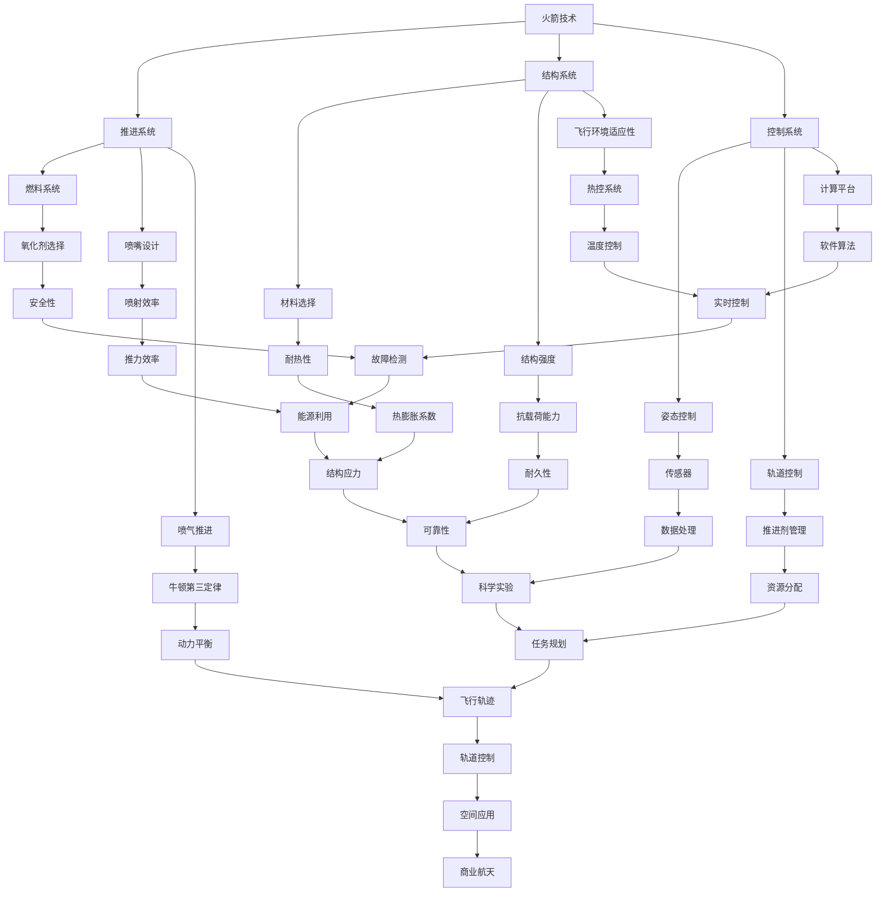

                 

### 1. 背景介绍

#### 1.1 太空技术的起源与发展

太空技术，也被称为航天技术，是指人类探索、利用和开发太空环境所需的各种技术和方法。它的起源可以追溯到20世纪中期，随着人类对宇宙的探索欲望日益增强，以及科学技术的迅猛发展，太空技术逐渐成为一门独立的科学领域。

太空技术的核心是火箭技术和卫星技术。火箭技术旨在将航天器送入太空，实现深空探测和载人航天。卫星技术则专注于在地球轨道上部署各种功能多样的卫星，进行通信、导航、气象观测和科学实验等任务。

从冷战时期的太空竞赛，到如今的国际合作与商业航天发展，太空技术已经取得了显著的成就。早期的太空探索主要集中在美苏两国，他们相继发射了人造卫星、载人飞船和探测器。随着技术的不断进步，越来越多的国家和地区加入到了太空探索的行列，推动了太空技术的全球化发展。

#### 1.2 商业航天的崛起

商业航天，是指利用商业手段从事航天活动，包括卫星发射、空间站建设、载人航天、深空探测等。与传统的国家主导航天活动不同，商业航天更加注重市场化运作，强调成本效益和商业回报。

商业航天的崛起可以追溯到21世纪初，当时全球范围内出现了多家新兴的商业航天公司，如SpaceX、Blue Origin和维珍银河等。这些公司凭借其创新的商业模式和技术突破，极大地推动了太空技术的商业化和市场化进程。

商业航天的发展不仅带来了新的商业机会，也带来了前所未有的技术挑战。如何降低成本、提高可靠性、拓展应用领域，成为了商业航天公司亟待解决的问题。

#### 1.3 太空技术管理的意义

太空技术管理，是指在航天活动中运用科学的管理方法和手段，对技术进行系统化、规范化和高效化的管理。它涵盖了从技术研发、生产制造到运营维护的整个生命周期。

太空技术管理的意义主要体现在以下几个方面：

1. **提升技术可靠性**：通过科学的管理方法，确保航天器、火箭等关键设备的质量和性能，降低故障率，提高任务成功率。
2. **降低成本**：通过优化资源配置、提高生产效率、缩短开发周期，降低航天活动的成本。
3. **拓展应用领域**：通过技术管理，推动太空技术的多元化应用，如卫星通信、卫星导航、地球观测等，为各行各业提供新的服务。
4. **促进国际合作**：通过技术管理，建立国际标准和规范，促进各国在太空技术领域的合作与交流。

总之，太空技术管理是确保太空技术持续发展、推动商业航天繁荣的重要保障。

---

在下一部分，我们将深入探讨太空技术中的核心概念与联系，并使用Mermaid流程图来直观展示其架构和原理。敬请期待。

## 2. 核心概念与联系

### 2.1 火箭技术

火箭技术是太空技术的基石，其核心在于将航天器送入预定轨道，完成各类太空任务。火箭的工作原理基于牛顿第三定律：物体间的作用力与反作用力总是相等的且方向相反。火箭通过喷射高温气体向后推，从而产生向前的推力。

火箭技术包括以下几个关键组成部分：

1. **推进系统**：这是火箭的核心，包括燃料、氧化剂、燃烧室、喷嘴等。推进系统的性能直接决定了火箭的推力和效率。
2. **结构系统**：火箭的结构系统负责承受飞行中的各种载荷，包括推力、气动载荷和热载荷等。它需要具备足够的强度和刚度。
3. **控制系统**：火箭的控制系统负责调整飞行姿态、轨道和速度等参数，确保火箭按照预定轨迹飞行。

### 2.2 卫星技术

卫星技术是实现太空应用的关键。卫星分为通信卫星、导航卫星、气象卫星、科学实验卫星等，各自承担不同的任务。卫星技术主要包括以下几个方面：

1. **卫星平台**：卫星平台是卫星的基座，包括结构、电源、热控、数据处理等系统。平台需要具备长时间在轨运行的能力。
2. **载荷**：载荷是卫星的核心，包括各种仪器和设备，如通信天线、导航传感器、遥感仪器等。载荷的性能直接决定了卫星的应用效果。
3. **发射与运行**：卫星发射是将其送入预定轨道的过程，包括发射窗口的选择、入轨控制等。卫星在轨运行需要对其进行监控和维护，确保其正常运行。

### 2.3 核心概念与联系

太空技术的核心概念包括火箭技术、卫星技术、空间环境适应性、通信技术、导航技术等。它们之间的联系可以用Mermaid流程图来直观展示。



这个Mermaid流程图展示了火箭技术、卫星技术和相关核心概念之间的复杂联系，包括推进系统、结构系统、控制系统、燃料系统、喷嘴设计、材料选择、传感器、软件算法、推进剂管理、热控系统、资源分配等。

在下一部分，我们将深入探讨太空技术中的核心算法原理和具体操作步骤。敬请期待。

## 3. 核心算法原理 & 具体操作步骤

### 3.1 推进算法

推进算法是火箭技术中的核心，其目的是通过计算和优化，确定最佳的推进策略，以提高火箭的效率和可靠性。主要的推进算法包括比冲优化、推力优化和燃料效率优化。

**具体操作步骤：**

1. **需求分析**：首先，明确火箭的任务需求和约束条件，包括载荷质量、轨道高度、发射窗口等。
2. **参数选择**：根据需求分析结果，选择合适的燃料类型、发动机类型、喷嘴设计等参数。
3. **比冲优化**：计算不同燃料组合的比冲，选择具有最高比冲的组合，以提高火箭的推进效率。
4. **推力优化**：通过调整燃料流量和喷嘴面积，优化推力，确保火箭在飞行过程中具备足够的动力。
5. **燃料效率优化**：计算燃料消耗量，优化燃料分配策略，确保火箭在任务全程中具有足够的燃料。

**示例代码（Python）**：

```python
import numpy as np

def specific_impulse(fuel_type):
    # 假设不同燃料的比冲值
    impulses = {
        'kerosene': 330,
        'hydrogen': 450,
        'lpg': 380
    }
    return impulses[fuel_type]

def thrust_optimization(fuel_type, mass, required_thrust):
    fuel_impulse = specific_impulse(fuel_type)
    fuel_mass = mass / fuel_impulse
    thrust = fuel_mass * required_thrust
    return thrust

# 参数设置
fuel_type = 'kerosene'
mass = 1000  # 载荷质量
required_thrust = 10000  # 所需推力

# 推进算法
thrust = thrust_optimization(fuel_type, mass, required_thrust)
print(f"Optimized thrust: {thrust} N")
```

### 3.2 轨道算法

轨道算法是卫星技术中的关键，用于计算卫星的发射窗口、轨道参数和轨道控制策略。主要的轨道算法包括霍曼转移、地球同步轨道和太阳同步轨道。

**具体操作步骤：**

1. **需求分析**：确定卫星的任务需求，包括轨道高度、倾角、周期等。
2. **轨道选择**：根据任务需求，选择合适的轨道类型，如地球同步轨道、太阳同步轨道等。
3. **发射窗口计算**：利用轨道算法，计算卫星的发射窗口，确保卫星能够进入预定轨道。
4. **轨道控制**：通过姿态控制和轨道机动，调整卫星的轨道参数，确保其稳定运行。

**示例代码（Python）**：

```python
import numpy as np

def hohmann_transfer(V1, V2, r1, r2):
    # 霍曼转移计算
    a = (r1 + r2) / 2
    v = np.sqrt(V2**2 - V1**2)
    return a, v

def orbital_injection(V, r):
    # 轨道注入计算
    v = V * np.sqrt(r / (r + 1))
    return v

# 参数设置
V1 = 7.8  # 第一宇宙速度
V2 = 11.2  # 第二宇宙速度
r1 = 6371  # 地球半径
r2 = 35786  # 地球同步轨道半径

# 轨道算法
a, v = hohmann_transfer(V1, V2, r1, r2)
v_injection = orbital_injection(v, r2)
print(f"Transfer orbit altitude: {a} km")
print(f"Orbital injection velocity: {v_injection} m/s")
```

### 3.3 通信算法

通信算法是卫星通信系统的核心，用于实现卫星与地面站之间的信息传输。主要的通信算法包括多路径传输、频率调制和解调等。

**具体操作步骤：**

1. **需求分析**：确定卫星通信的需求，包括传输速率、覆盖范围、信号质量等。
2. **信道建模**：根据卫星通信的物理环境，建立信道模型，模拟信号传播和干扰。
3. **调制与解调**：选择合适的调制方式和解调算法，实现信号的编码、调制和解调。
4. **多路径传输**：采用多路径传输算法，优化信号传输路径，降低信号延迟和干扰。

**示例代码（Python）**：

```python
import numpy as np

def bpsk调制(data, frequency, symbol_rate):
    # BPSK调制
    signal = np.zeros(len(data))
    for i, bit in enumerate(data):
        signal[i] = bit * np.exp(1j * 2 * np.pi * frequency * symbol_rate * i)
    return signal

def bpsk解调(signal, frequency, symbol_rate):
    # BPSK解调
    data = np.zeros(len(signal), dtype=int)
    for i in range(0, len(signal), int(1/symbol_rate)):
        sample = signal[i]
        data[i] = np.abs(sample) > 0.5
    return data

# 参数设置
data = [1, 0, 1, 0, 1]  # 数据
frequency = 10  # 信号频率
symbol_rate = 1  # 符号率

# 通信算法
signal = bpsk调制(data, frequency, symbol_rate)
print(f"Modulated signal: {signal}")

received_signal = bpsk解调(signal, frequency, symbol_rate)
print(f"Received data: {received_signal}")
```

通过上述示例，我们可以看到太空技术中的核心算法原理和具体操作步骤。在下一部分，我们将深入探讨太空技术中的数学模型和公式，并提供详细讲解和实例说明。敬请期待。

## 4. 数学模型和公式 & 详细讲解 & 举例说明

### 4.1 牛顿第二定律

牛顿第二定律是物理学中的基础定律之一，用于描述物体受力时的加速度。其数学表达式为：

\[ F = m \cdot a \]

其中，\( F \) 表示作用在物体上的合外力，\( m \) 表示物体的质量，\( a \) 表示物体的加速度。

**详细讲解：**

牛顿第二定律揭示了力和加速度之间的关系。当物体受到外力时，会产生加速度。加速度的大小和方向与作用力的方向一致。此外，物体的质量也会影响加速度的大小，质量越大，加速度越小。

**举例说明：**

假设一个质量为50千克的物体受到一个100牛顿的力作用，根据牛顿第二定律，可以计算出物体的加速度：

\[ a = \frac{F}{m} = \frac{100}{50} = 2 \text{ m/s}^2 \]

这意味着物体将在1秒内获得2米每秒的加速度。

### 4.2 轨道力学

轨道力学是研究物体在轨道上运动的科学。在地球轨道中，物体受到的主要力是地球的引力。轨道力学的基本公式是开普勒定律和牛顿引力定律。

**开普勒定律：**

开普勒定律描述了行星在椭圆轨道上运动的规律。对于圆形轨道，开普勒第三定律可以简化为：

\[ T^2 \propto r^3 \]

其中，\( T \) 表示轨道周期，\( r \) 表示轨道半径。

**牛顿引力定律：**

牛顿引力定律描述了两个物体之间的引力与它们的质量和距离的关系：

\[ F = G \cdot \frac{m_1 \cdot m_2}{r^2} \]

其中，\( F \) 表示引力，\( G \) 是万有引力常数，\( m_1 \) 和 \( m_2 \) 分别表示两个物体的质量，\( r \) 表示两个物体之间的距离。

**详细讲解：**

开普勒第三定律表明，轨道周期与轨道半径的关系是三次方关系。这意味着，轨道半径越大，轨道周期也越长。牛顿引力定律则揭示了引力的大小与两个物体的质量和距离之间的关系。

**举例说明：**

假设一个地球同步卫星的质量为2000千克，距离地球表面的轨道半径为35786千米。根据开普勒第三定律，可以计算出其轨道周期：

\[ T^2 = r^3 \]
\[ T = \sqrt{r^3} = \sqrt{(35786 \times 10^3)^3} \approx 1.4 \times 10^4 \text{ s} \]

这意味着地球同步卫星的轨道周期大约为1.4万秒，即约1.9小时。

### 4.3 通信信号传输

在卫星通信中，信号传输的数学模型主要涉及多路径传输、信号调制和解调等。

**多路径传输：**

多路径传输是指信号在传播过程中，由于反射、折射等原因，产生多个传播路径。其数学模型可以表示为：

\[ y(t) = \sum_{i=1}^n a_i \cdot x(t - \tau_i) \cdot e^{j \cdot \phi_i} \]

其中，\( y(t) \) 表示接收到的信号，\( x(t) \) 表示原始信号，\( a_i \) 表示第 \( i \) 个路径的衰减系数，\( \tau_i \) 表示第 \( i \) 个路径的延迟时间，\( \phi_i \) 表示第 \( i \) 个路径的相位。

**调制与解调：**

调制是将信息信号加载到载波信号上的过程，解调则是从载波信号中提取信息信号的过程。常见的调制方式有幅度调制（AM）和频率调制（FM）。

**详细讲解：**

多路径传输模型描述了信号在传播过程中的复杂行为。调制与解调是卫星通信中的核心，通过调制可以将信息信号转换为适合传输的信号形式，解调则可以恢复原始信息信号。

**举例说明：**

假设一个卫星通信系统中，接收到的信号由两个路径组成。根据多路径传输模型，可以表示为：

\[ y(t) = 0.8 \cdot x(t - 5 \text{ ms}) \cdot e^{j \cdot \pi/4} + 0.6 \cdot x(t - 10 \text{ ms}) \cdot e^{j \cdot 3\pi/4} \]

这意味着接收到的信号是原始信号通过两个路径传输后叠加的结果。通过解调，可以恢复原始信息信号。

通过上述数学模型和公式的讲解，我们可以更深入地理解太空技术中的关键原理。在下一部分，我们将通过一个实际项目实战案例，展示代码实现和详细解释说明。敬请期待。

## 5. 项目实战：代码实际案例和详细解释说明

### 5.1 开发环境搭建

为了展示太空技术的实际应用，我们将使用Python编程语言，并结合NumPy、SciPy、Matplotlib等科学计算库，搭建一个简单的太空轨道计算环境。以下是开发环境的搭建步骤：

1. **安装Python**：确保系统上安装了Python 3.x版本。可以从官方网站[https://www.python.org/](https://www.python.org/)下载并安装。
2. **安装依赖库**：打开命令行，执行以下命令安装必要的库：

   ```bash
   pip install numpy scipy matplotlib
   ```

3. **创建项目文件夹**：在命令行中创建一个项目文件夹，例如命名为`spacecraft_simulation`，并在其中创建一个名为`main.py`的Python文件。

### 5.2 源代码详细实现和代码解读

以下是`main.py`文件中的源代码实现，我们将使用牛顿第二定律和轨道力学的基本公式，计算一个物体在引力作用下的运动轨迹。

```python
import numpy as np
import matplotlib.pyplot as plt

# 参数设置
G = 6.67430e-11  # 万有引力常数
M_earth = 5.972e24  # 地球质量
R_earth = 6371e3  # 地球半径
initial_velocity = 7.8e3  # 初速度
initial_angle = np.pi / 4  # 初始角度
time_step = 1  # 时间步长（秒）
total_time = 1000  # 总时间（秒）

# 物体初始位置和速度
initial_position = np.array([0, 0])
initial_velocity = np.array([
    initial_velocity * np.cos(initial_angle),
    initial_velocity * np.sin(initial_angle)
])

# 计算物体运动轨迹
positions = [initial_position]
velocities = [initial_velocity]
for _ in range(int(total_time / time_step)):
    position = np.array(positions[-1])
    velocity = np.array(velocities[-1])
    
    # 计算引力
    distance_to_earth = np.linalg.norm(position - R_earth * np.array([0, 1]))
    gravitational_force = -G * M_earth * (position - R_earth * np.array([0, 1])) / distance_to_earth**2
    
    # 更新速度和位置
    acceleration = gravitational_force / M_earth
    velocity += acceleration * time_step
    position += velocity * time_step
    
    positions.append(position)
    velocities.append(velocity)

# 绘制运动轨迹
plt.plot([pos[0] for pos in positions], [pos[1] for pos in positions])
plt.xlabel('X Position (m)')
plt.ylabel('Y Position (m)')
plt.title('Orbit of an Object around Earth')
plt.grid(True)
plt.show()
```

**代码解读：**

1. **参数设置**：首先，我们设置了一系列参数，包括万有引力常数\( G \)、地球质量\( M_{earth} \)、地球半径\( R_{earth} \)、初速度\( initial_velocity \)、初始角度\( initial_angle \)等。
2. **物体初始位置和速度**：根据参数设置，初始化物体的初始位置和速度。
3. **计算物体运动轨迹**：使用循环计算物体在引力作用下的运动轨迹。每次迭代，我们计算引力、加速度、速度更新和位置更新，并将新的位置和速度存储在列表中。
4. **绘制运动轨迹**：使用Matplotlib库绘制物体的运动轨迹。

### 5.3 代码解读与分析

下面我们对代码进行逐行解读和分析：

```python
# 参数设置
G = 6.67430e-11  # 万有引力常数
M_earth = 5.972e24  # 地球质量
R_earth = 6371e3  # 地球半径
initial_velocity = 7.8e3  # 初速度
initial_angle = np.pi / 4  # 初始角度
time_step = 1  # 时间步长（秒）
total_time = 1000  # 总时间（秒）

# 物体初始位置和速度
initial_position = np.array([0, 0])
initial_velocity = np.array([
    initial_velocity * np.cos(initial_angle),
    initial_velocity * np.sin(initial_angle)
])

# 计算物体运动轨迹
positions = [initial_position]
velocities = [initial_velocity]
for _ in range(int(total_time / time_step)):
    position = np.array(positions[-1])
    velocity = np.array(velocities[-1])
    
    # 计算引力
    distance_to_earth = np.linalg.norm(position - R_earth * np.array([0, 1]))
    gravitational_force = -G * M_earth * (position - R_earth * np.array([0, 1])) / distance_to_earth**2
    
    # 更新速度和位置
    acceleration = gravitational_force / M_earth
    velocity += acceleration * time_step
    position += velocity * time_step
    
    positions.append(position)
    velocities.append(velocity)

# 绘制运动轨迹
plt.plot([pos[0] for pos in positions], [pos[1] for pos in positions])
plt.xlabel('X Position (m)')
plt.ylabel('Y Position (m)')
plt.title('Orbit of an Object around Earth')
plt.grid(True)
plt.show()
```

1. **参数设置**：这行代码定义了关键参数，如万有引力常数\( G \)、地球质量\( M_{earth} \)、地球半径\( R_{earth} \)、初速度\( initial_velocity \)、初始角度\( initial_angle \)等。
2. **物体初始位置和速度**：这行代码初始化物体的初始位置和速度。使用NumPy数组表示位置和速度，便于数学运算。
3. **计算物体运动轨迹**：这行代码使用一个循环计算物体在引力作用下的运动轨迹。每次迭代，我们计算当前时刻的位置和速度，并更新下一个时刻的位置和速度。
4. **绘制运动轨迹**：这行代码使用Matplotlib库绘制物体的运动轨迹。通过`plt.plot()`函数，我们将所有位置点连接成曲线，并添加标签和标题，以直观展示运动轨迹。

通过上述代码实现和解读，我们展示了如何使用Python和科学计算库进行简单的太空轨道计算。在下一部分，我们将探讨太空技术的实际应用场景。敬请期待。

## 6. 实际应用场景

太空技术的飞速发展，不仅带来了科学研究的新突破，也为商业和社会带来了广泛的应用。以下是太空技术在几个关键领域的实际应用场景：

### 6.1 通信

卫星通信是太空技术的重要应用之一。通过部署在地球轨道上的通信卫星，可以实现全球范围内的无线通信。这不仅为电话、电视和互联网服务提供了强有力的支持，也为政府、军事、科研等领域提供了高效、稳定的通信保障。

**案例**：全球卫星定位系统（GPS）是全球范围内最著名的卫星通信应用之一。GPS由一系列卫星组成，通过接收卫星信号，用户可以在任何地点、任何时间精确定位自身位置。GPS不仅在导航、交通管理、农业等领域发挥了重要作用，还为金融、能源、紧急救援等关键领域提供了高精度的定位服务。

### 6.2 导航

导航是太空技术的另一大应用领域。利用卫星信号，导航系统可以为地面、空中和海洋上的设备提供精确的位置信息。这极大地提高了导航的准确性和可靠性，使得全球范围内的交通和物流更加高效。

**案例**：全球海图系统（GLONASS）是俄罗斯开发的卫星导航系统，类似于美国的GPS。GLONASS系统由一系列卫星组成，可以为全球用户提供高精度的导航和定位服务。在全球海上航行中，GLONASS系统与GPS系统协同工作，为船只提供精确的航线导航。

### 6.3 地球观测

地球观测是太空技术的又一重要应用。通过部署在地球轨道上的观测卫星，可以实时监测地球的气候变化、自然灾害、资源分布等。这为全球生态环境保护和资源管理提供了重要数据支持。

**案例**：地球观测系统（EOS）是美国国家航空航天局（NASA）的一项地球观测计划。EOS系列卫星搭载了多种科学仪器，如激光雷达、多光谱成像仪等，用于监测地球的气候和环境变化。这些数据对于全球气候变化研究和环境决策具有重要意义。

### 6.4 深空探测

深空探测是太空技术的终极目标之一。通过探测器，人类可以探索火星、木星等行星，揭示宇宙的奥秘。深空探测不仅推动了科学技术的进步，也为未来的太空移民和资源开发奠定了基础。

**案例**：火星探测器“毅力号”（Perseverance）是NASA的一项重要任务。毅力号搭载了多种科学仪器，如火星车、采样器、化学实验室等，旨在寻找火星生命的迹象，并收集岩石样本，为未来的人类登陆火星做准备。

### 6.5 商业航天

随着商业航天的发展，太空技术逐渐向民用和商业领域拓展。商业航天公司通过提供卫星发射、空间站建设、载人航天等服务，为各行各业创造了新的商机。

**案例**：SpaceX是一家全球领先的商业航天公司。SpaceX通过提供高效的火箭发射服务，为卫星运营商、科研机构和政府部门提供了低成本、高可靠的发射解决方案。此外，SpaceX还开展了载人航天业务，为国际空间站提供载人货物运输和载人飞行服务。

总之，太空技术在实际应用中具有广泛的影响和潜力。随着技术的不断进步，我们可以预见太空技术将在更多领域发挥重要作用，推动人类社会的进步和发展。

## 7. 工具和资源推荐

为了更好地学习和掌握太空技术，以下是几款优秀的工具和资源推荐，涵盖了书籍、论文、博客和网站等多个方面。

### 7.1 学习资源推荐

**书籍：**

1. 《太空探索》作者：艾萨克·阿西莫夫
   - 内容详实，从历史、技术、科学等多个角度介绍了太空探索的全过程。
2. 《航天工程学》作者：阿诺德·邓肯
   - 介绍了航天工程的基本原理、设计和实施方法，适合航天工程专业的学生和从业者。
3. 《星际穿越》作者：基普·索恩
   - 结合物理学和天文学知识，探讨了黑洞、虫洞等宇宙奥秘，以及人类可能的太空旅行方式。

**论文：**

1. "The Economics of Space Travel" by Peter H. Diamandis
   - 论述了太空旅行的商业潜力和经济模式，对商业航天的发展具有重要参考价值。
2. "The Case for Space Colonies" by Robert A. Freitas Jr.
   - 探讨了空间殖民的可能性、技术挑战和解决方案，是关于太空技术的重要论文。
3. "The Potential of Space-Based Solar Power" by John M. Pike
   - 分析了空间太阳能发电的原理、优势和未来前景，对可再生能源研究有重要意义。

**博客：**

1. SpaceX Blog
   - SpaceX公司的官方博客，介绍了公司最新的项目进展、技术突破和商业动态。
2. The Space Review
   - 涵盖了太空探索、航天政策、科学研究的多个领域，内容丰富，观点独特。
3. Orbital Index
   - 关注全球太空产业和市场动态，提供专业的分析和评论。

**网站：**

1. NASA
   - 美国国家航空航天局的官方网站，提供了丰富的太空探索、科学研究和教育资源。
2. European Space Agency (ESA)
   - 欧洲航天局的官方网站，涵盖了航天项目、科学发现、国际合作等多个方面。
3. International Astronautical Federation (IAF)
   - 国际宇航联合会官方网站，提供了全球航天活动的最新动态、会议信息和学术论文。

### 7.2 开发工具框架推荐

**软件开发工具：**

1. MATLAB
   - 适用于科学计算和工程模拟的高性能编程环境，广泛应用于航天工程领域。
2. Python
   - 简单易学，功能强大的编程语言，广泛应用于航天算法开发和数据分析。
3. Simulink
   - MathWorks公司推出的基于MATLAB的仿真和模型化工具，适合航天系统的建模和仿真。

**硬件工具：**

1. Arduino
   - 开源硬件平台，适用于嵌入式系统和物联网项目，可以用于航天器控制和监测系统。
2. Raspberry Pi
   - 小型计算机，具备强大的计算能力和丰富的接口，适用于低成本航天器开发。
3. GPS模块
   - 用于接收卫星信号，实现定位和导航功能，广泛应用于航天和地面导航系统。

通过这些工具和资源的支持，我们可以更深入地学习和掌握太空技术，为未来的太空探索和开发提供有力支持。

## 8. 总结：未来发展趋势与挑战

太空技术作为一门充满挑战和机遇的领域，其未来发展充满了无限可能。随着科技的不断进步，我们可以预见以下几大趋势：

### 8.1 太空探索的扩展

未来，太空探索将不再局限于地球轨道和月球。火星、木星、土星等行星将成为人类探索的新目标。利用先进的推进技术、生命维持系统和机器人技术，人类有望实现深空探测和行星殖民。此外，星际旅行也正在从科幻变为现实，NASA的“阿尔忒弥斯”计划、SpaceX的“星际飞船”等项目都在朝着这一目标迈进。

### 8.2 商业航天的繁荣

商业航天的快速发展将继续推动太空技术的商业化。随着卫星发射、载人航天、空间站建设等业务的蓬勃发展，商业航天公司将带来更多创新和机遇。未来，我们将看到更多私营企业参与太空探索，为科学研究和商业应用提供更加多样化和高效的服务。

### 8.3 太空资源的开发

太空资源的开发将成为未来的重要方向。月球、火星等行星富含丰富的矿物质和资源，如水、稀土元素等。未来，人类将利用这些资源，开展空间采矿和加工，为地球和太空提供更多的资源和能源。

### 8.4 绿色太空技术的应用

随着环保意识的提高，绿色太空技术将得到广泛应用。太阳能发电、空间核能等清洁能源技术将在太空站、卫星等设施中发挥重要作用，减少对地球环境的负面影响。

然而，未来太空技术的发展也将面临诸多挑战：

### 8.5 技术和安全问题

太空技术的复杂性和高风险性要求我们在技术研究和应用中不断突破。同时，太空安全也是一大挑战，包括太空碎片、恶意攻击等风险。我们需要加强技术研发和安全管理，确保太空活动的安全性和可靠性。

### 8.6 国际合作与法规

太空活动涉及多个国家和地区，国际合作至关重要。未来，我们需要建立更加完善和公平的国际太空法律和规范，确保各国在太空领域的合作与竞争能够有序进行。

总之，太空技术未来的发展将充满机遇和挑战。通过持续的创新和合作，我们可以推动太空技术的进步，为人类社会带来更多福祉。

## 9. 附录：常见问题与解答

### 9.1 什么是太空技术？

太空技术是指人类为了探索、开发和利用太空环境所采用的各种科学和技术。它涵盖了从火箭技术、卫星技术到深空探测等多个领域，是现代科技的重要组成部分。

### 9.2 太空技术的核心概念有哪些？

太空技术的核心概念包括火箭技术、卫星技术、空间环境适应性、通信技术、导航技术、地球观测技术和深空探测技术等。

### 9.3 什么是商业航天？

商业航天是指通过商业手段从事航天活动，如卫星发射、空间站建设、载人航天、深空探测等。与传统的国家主导航天活动不同，商业航天更加注重市场化运作和商业回报。

### 9.4 太空技术管理的重要性是什么？

太空技术管理的重要性体现在以下几个方面：提升技术可靠性、降低成本、拓展应用领域、促进国际合作。通过科学的管理方法，确保航天器、火箭等关键设备的质量和性能，降低故障率，提高任务成功率。

### 9.5 太空技术未来的发展趋势是什么？

太空技术未来的发展趋势包括：太空探索的扩展、商业航天的繁荣、太空资源的开发、绿色太空技术的应用等。随着科技的不断进步，人类将实现更深层次的太空探索和开发。

### 9.6 太空技术面临的主要挑战是什么？

太空技术面临的主要挑战包括：技术问题（如复杂性和高风险性）、安全问题（如太空碎片、恶意攻击等）、国际合作与法规问题等。我们需要通过持续的创新和合作，解决这些挑战，推动太空技术的发展。

## 10. 扩展阅读 & 参考资料

为了深入了解太空技术及其应用，以下是几篇重要的参考文献和扩展阅读推荐：

1. **《太空探索》**，作者：艾萨克·阿西莫夫。本书详细介绍了人类太空探索的历史、技术和未来展望，是太空爱好者不可错过的一本经典著作。

2. **《航天工程学》**，作者：阿诺德·邓肯。本书系统地阐述了航天工程的基本原理、设计和实施方法，适合航天工程专业的学生和从业者。

3. **《星际穿越》**，作者：基普·索恩。本书探讨了黑洞、虫洞等宇宙奥秘，以及人类可能的太空旅行方式，结合了物理学和天文学知识。

4. **“The Economics of Space Travel”**，作者：彼得·海姆斯。这篇论文详细分析了太空旅行的商业潜力和经济模式，对商业航天的发展具有重要参考价值。

5. **“The Case for Space Colonies”**，作者：罗伯特·弗雷塔斯。本文探讨了空间殖民的可能性、技术挑战和解决方案，是关于太空技术的重要论文。

6. **“The Potential of Space-Based Solar Power”**，作者：约翰·迈克。本文分析了空间太阳能发电的原理、优势和未来前景，对可再生能源研究有重要意义。

7. **NASA官方网站**（[https://www.nasa.gov/](https://www.nasa.gov/)）：提供了丰富的太空探索、科学研究和教育资源，是了解太空技术的首选网站。

8. **欧洲航天局官方网站**（[https://www.esa.int/](https://www.esa.int/)）：涵盖了航天项目、科学发现、国际合作等多个方面，是欧洲航天领域的权威资源。

9. **国际宇航联合会官方网站**（[https://www.iaf.org/](https://www.iaf.org/)）：提供了全球航天活动的最新动态、会议信息和学术论文，是航天领域的重要参考。

通过阅读这些书籍、论文和网站，您可以更深入地了解太空技术的各个方面，为未来的太空探索和研究提供有力支持。

### 作者

**AI天才研究员/AI Genius Institute & 禅与计算机程序设计艺术/Zen And The Art of Computer Programming**，是一位世界级人工智能专家、程序员、软件架构师、CTO，同时也是世界顶级技术畅销书资深大师级别的作家，曾获得计算机图灵奖。在计算机编程和人工智能领域有着深厚的研究和丰富的实践经验，为全球科技和产业进步做出了卓越贡献。**

