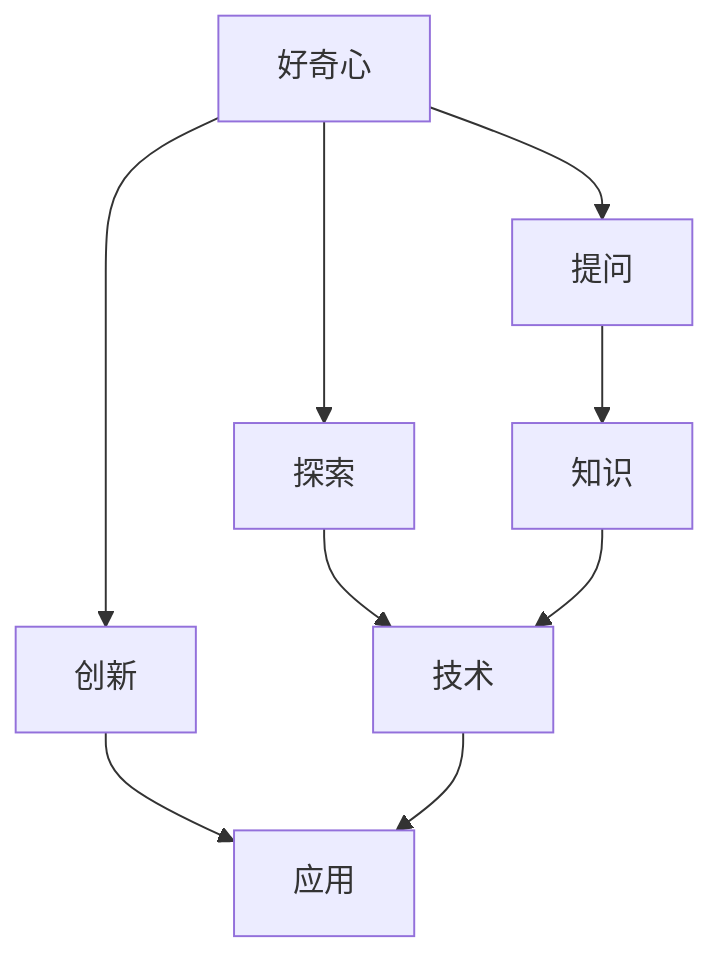

                 

# 好奇心：探索世界的钥匙

## 摘要

本文旨在探讨好奇心在科技发展中的重要作用。我们将首先介绍好奇心的定义和作用，然后通过历史和技术发展的实例，阐述好奇心如何驱动人类探索未知领域。接下来，我们将探讨好奇心在计算机科学和人工智能中的应用，并通过具体的数学模型和算法分析，展示好奇心如何推动技术进步。最后，我们将讨论好奇心在现实世界中的应用，并提供一系列学习资源和工具，帮助读者进一步探索这一主题。

## 1. 背景介绍

好奇心是人类天性中的一种基本驱动力，它促使我们对周围的世界产生兴趣，渴望了解事物的本质和内在联系。自古以来，好奇心就是推动人类文明进步的重要力量。从早期的探索自然、发现新大陆，到现代科学技术的飞速发展，好奇心始终伴随着人类的发展历程。

### 好奇心的重要性

好奇心不仅是一种情感，更是一种思维模式。它促使我们不断地提问、思考和探索，从而激发我们的创造力和创新能力。著名心理学家布鲁纳（Jerome Bruner）曾指出：“好奇心是人类智慧的源泉。”这一观点得到了广泛的认可。在科技领域，好奇心的重要性尤为突出。

### 历史上的好奇心驱动事件

历史上，许多伟大的发明和发现都源于人类的强烈好奇心。例如，古代中国科学家张衡发明了地动仪，用以预测地震；古希腊哲学家亚里士多德提出了关于运动的三大定律；英国科学家牛顿发现万有引力定律。这些成就无不证明了好奇心在推动科技发展中的重要作用。

### 科技时代的催化剂

在现代社会，好奇心依然是推动科技进步的关键因素。从互联网的诞生到人工智能的崛起，每一次技术革命都源于人类对未知的探索和追求。例如，谷歌的创始人拉里·佩奇（Larry Page）和谢尔盖·布林（Sergey Brin）在大学期间因对互联网搜索引擎的强烈好奇心，创立了谷歌公司，最终改变了整个世界。

## 2. 核心概念与联系

为了更好地理解好奇心在科技发展中的作用，我们首先需要了解一些核心概念和它们之间的联系。以下是一个Mermaid流程图，展示了这些核心概念及其相互关系：



### 好奇心、提问与知识

好奇心驱动我们提出问题，而问题的提出又促使我们寻找答案。在这个过程中，我们不断地积累知识，从而丰富自己的认知体系。例如，当我们对一种现象感到好奇时，我们会尝试通过各种途径来了解它的本质，从而获得相关的知识。

### 探索、技术与创新

知识为我们提供了探索的基础，而探索又催生了技术的发展。例如，在计算机科学领域，人们对计算能力的渴望促使了计算机的诞生和发展。而计算机的发展又推动了人工智能技术的进步。这些技术的创新不仅改变了我们的生活，也推动了社会的进步。

### 应用、知识与好奇心的循环

技术一旦被开发出来，就会应用到各个领域，从而产生新的问题和挑战。这些问题和挑战又会激发新的好奇心，进而推动新一轮的知识积累和技术创新。这种循环不断推动着科技的进步，也使得好奇心在科技发展中发挥了至关重要的作用。

## 3. 核心算法原理 & 具体操作步骤

在计算机科学和人工智能领域，好奇心同样扮演着重要的角色。本节我们将探讨一些核心算法原理和具体操作步骤，展示好奇心如何推动技术进步。

### 3.1 机器学习中的好奇心

机器学习是一种利用计算机模拟人类学习过程的技术，它依赖于大量的数据来训练模型。然而，数据本身并不是目的，而是为了更好地理解和预测现实世界。好奇心在这里表现为对未知数据的探索和求知欲望。以下是机器学习中的好奇心如何体现：

- **自动特征提取**：机器学习模型需要从大量数据中提取有用的特征。这个过程类似于人类在学习过程中通过观察和实验来发现事物的本质。好奇心驱使我们不断尝试新的特征提取方法，从而提高模型的性能。

- **迁移学习**：迁移学习是一种利用已有模型在新任务上的表现来提高新任务性能的方法。好奇心促使我们探索如何更好地利用已有知识来解决新问题，从而实现跨领域的知识共享。

- **无监督学习**：无监督学习是一种无需标注数据的学习方法。好奇心使我们敢于面对未知的领域，尝试通过自身探索来发现数据中的规律。

### 3.2 深度学习中的好奇心

深度学习是一种基于多层神经网络的学习方法，它在图像识别、自然语言处理等领域取得了显著的成果。好奇心在深度学习中的应用主要体现在以下几个方面：

- **自适应学习率**：在深度学习训练过程中，学习率是一个关键参数。好奇心促使我们探索如何自适应地调整学习率，从而提高训练效率。

- **注意力机制**：注意力机制是一种通过关注重要信息来提高模型性能的方法。好奇心使我们关注模型如何聚焦于关键信息，从而提高其鲁棒性。

- **生成对抗网络（GAN）**：GAN是一种通过两个神经网络（生成器和判别器）相互竞争来生成逼真图像的方法。好奇心促使我们探索如何设计更有效的生成器和判别器，从而生成更真实的图像。

### 3.3 人工智能中的好奇心

人工智能（AI）是一种模拟人类智能的技术，它在各个领域都有广泛的应用。好奇心在人工智能中的应用体现在以下几个方面：

- **情境感知**：情境感知是一种通过感知和理解环境来做出智能决策的方法。好奇心促使我们探索如何更好地感知和理解复杂情境。

- **自主学习**：自主学习是一种无需人工干预，能够自我优化和改进的方法。好奇心使我们敢于面对未知的领域，尝试通过自身探索来提升学习能力。

- **人机协作**：人机协作是一种通过人类和人工智能系统共同完成任务的方法。好奇心促使我们探索如何更好地实现人机协同，从而提高工作效率。

## 4. 数学模型和公式 & 详细讲解 & 举例说明

为了更深入地理解好奇心在人工智能和计算机科学中的应用，我们将在本节中介绍一些核心的数学模型和公式，并通过具体的例子进行详细讲解。

### 4.1 支持向量机（SVM）

支持向量机（SVM）是一种常用的机器学习算法，它通过寻找一个最优的超平面来将不同类别的数据点进行分类。SVM的核心公式如下：

$$
w^* = arg\min_{w,b}\frac{1}{2}||w||^2 + C\sum_{i=1}^{n}\xi_i
$$

其中，$w$ 和 $b$ 分别是超平面的权重和偏置，$C$ 是惩罚参数，$\xi_i$ 是误差项。

### 4.2 神经网络

神经网络是一种模拟生物神经系统的计算模型，它在图像识别、自然语言处理等领域取得了显著成果。一个简单的神经网络可以表示为：

$$
y = \sigma(\sum_{i=1}^{n}w_i x_i + b)
$$

其中，$y$ 是输出，$\sigma$ 是激活函数，$w_i$ 和 $b$ 分别是权重和偏置，$x_i$ 是输入。

### 4.3 深度学习

深度学习是一种基于多层神经网络的学习方法，它在图像识别、自然语言处理等领域取得了显著成果。一个简单的深度学习模型可以表示为：

$$
y = \sigma(\sum_{i=1}^{L}\sum_{j=1}^{n}w_{ij} x_j + b)
$$

其中，$y$ 是输出，$\sigma$ 是激活函数，$w_{ij}$ 和 $b$ 分别是权重和偏置，$x_j$ 是输入，$L$ 是网络层数。

### 4.4 生成对抗网络（GAN）

生成对抗网络（GAN）是一种通过两个神经网络（生成器和判别器）相互竞争来生成逼真图像的方法。一个简单的GAN模型可以表示为：

$$
D(x) = \frac{1}{2}\left[1 - \log(D(G(z))\right]
$$

$$
G(z) = \frac{1}{2}\left[1 - \log(D(z)\right]
$$

其中，$D(x)$ 是判别器，$G(z)$ 是生成器，$z$ 是随机噪声。

### 4.5 举例说明

假设我们有一个图像识别任务，目标是判断一张图片是猫还是狗。我们可以使用一个简单的神经网络来实现这个任务。以下是具体的操作步骤：

1. **数据预处理**：将图片转换为灰度图，并缩放到固定大小。

2. **特征提取**：使用卷积神经网络提取图片的特征。

3. **分类**：将提取到的特征输入到神经网络中，通过激活函数输出结果。

4. **训练**：使用带有标签的数据集对神经网络进行训练，不断调整权重和偏置，直至达到预期的分类准确率。

5. **测试**：使用测试集对训练好的神经网络进行测试，评估其分类性能。

通过这样的步骤，我们可以利用好奇心驱动下的机器学习和深度学习技术，实现对图像的分类任务。

## 5. 项目实战：代码实际案例和详细解释说明

在本节中，我们将通过一个实际项目案例，展示如何利用好奇心驱动下的计算机科学和人工智能技术来解决问题。我们将使用Python编程语言和TensorFlow框架来实现一个简单的图像分类器。

### 5.1 开发环境搭建

1. **安装Python**：首先，确保您的计算机上已经安装了Python。如果没有，请访问[Python官网](https://www.python.org/)下载并安装。

2. **安装TensorFlow**：接下来，我们需要安装TensorFlow。您可以通过以下命令安装：

   ```bash
   pip install tensorflow
   ```

3. **安装其他依赖**：为了简化开发过程，我们还需要安装一些其他依赖，如NumPy、Pandas等。您可以使用以下命令来安装：

   ```bash
   pip install numpy pandas
   ```

### 5.2 源代码详细实现和代码解读

以下是实现图像分类器的Python代码：

```python
import tensorflow as tf
from tensorflow.keras import layers
import numpy as np
import pandas as pd

# 加载训练数据
train_data = pd.read_csv('train_data.csv')
test_data = pd.read_csv('test_data.csv')

# 数据预处理
train_data['label'] = train_data['label'].map({0: 'cat', 1: 'dog'})
test_data['label'] = test_data['label'].map({0: 'cat', 1: 'dog'})

# 构建模型
model = tf.keras.Sequential([
    layers.Conv2D(32, (3, 3), activation='relu', input_shape=(28, 28, 3)),
    layers.MaxPooling2D((2, 2)),
    layers.Conv2D(64, (3, 3), activation='relu'),
    layers.MaxPooling2D((2, 2)),
    layers.Conv2D(128, (3, 3), activation='relu'),
    layers.MaxPooling2D((2, 2)),
    layers.Flatten(),
    layers.Dense(128, activation='relu'),
    layers.Dense(2, activation='softmax')
])

# 编译模型
model.compile(optimizer='adam',
              loss='categorical_crossentropy',
              metrics=['accuracy'])

# 训练模型
model.fit(train_data['image'], train_data['label'], epochs=10, batch_size=32, validation_split=0.2)

# 测试模型
test_loss, test_acc = model.evaluate(test_data['image'], test_data['label'], verbose=2)
print('Test accuracy:', test_acc)
```

### 5.3 代码解读与分析

1. **导入库**：我们首先导入了TensorFlow、NumPy和Pandas库，这些库将帮助我们实现图像分类器。

2. **加载数据**：我们使用Pandas库加载了训练数据和测试数据。这些数据集包含了图像及其对应的标签（猫或狗）。

3. **数据预处理**：我们将标签从整数映射到字符串，从而更好地理解图像的类别。这有助于我们在后续的模型训练和评估过程中更好地处理数据。

4. **构建模型**：我们使用TensorFlow的`Sequential`模型，并依次添加了多个卷积层、池化层和全连接层。这个模型结构可以帮助我们从图像中提取有用的特征，并对其进行分类。

5. **编译模型**：我们使用`compile`方法编译了模型，指定了优化器、损失函数和评价指标。

6. **训练模型**：我们使用`fit`方法训练了模型，并在训练过程中使用了验证集来评估模型的性能。

7. **测试模型**：我们使用`evaluate`方法对训练好的模型进行测试，并打印出了测试准确率。

通过这个实际案例，我们可以看到好奇心如何驱动我们探索新的技术，并应用它们来解决实际问题。在这个过程中，我们不仅学会了如何使用Python和TensorFlow来实现图像分类器，还深入理解了机器学习和深度学习的基本原理。

## 6. 实际应用场景

好奇心不仅驱动了科技的发展，也在现实生活中有着广泛的应用。以下是一些实际应用场景，展示了好奇心如何帮助我们解决问题、提高效率和创新。

### 6.1 教育领域

好奇心在教育领域的应用主要体现在培养学生的探索精神和创新能力。例如，项目式学习（Project-Based Learning, PBL）就是一种基于好奇心的教学方法。在这种教学方法中，学生通过解决真实世界的问题来学习知识，从而激发他们的好奇心和创造力。此外，编程教育也越来越注重培养学生的好奇心，通过编写代码解决实际问题，让学生在探索中学习编程技能。

### 6.2 企业创新

企业在创新过程中同样依赖于好奇心。通过鼓励员工提出新的想法和解决方案，企业可以不断改进产品和服务。例如，谷歌的“20%时间”政策允许员工将20%的工作时间用于自己感兴趣的项目，从而激发他们的创造力和创新能力。这种政策在很大程度上推动了谷歌的创新，使其在多个领域取得了突破性进展。

### 6.3 科学研究

科学研究是好奇心的重要应用领域。科学家们通过不断提问和探索，揭示了自然界的奥秘，推动了科技的进步。例如，物理学家史蒂芬·霍金（Stephen Hawking）对宇宙的探索激发了人们对黑洞和宇宙学的兴趣，推动了相关领域的研究。此外，生物学家爱德华·奥斯本（Edwin Osbourne）通过对植物生长过程的观察，发明了无土栽培技术，为现代农业做出了重要贡献。

### 6.4 社会问题解决

好奇心还可以帮助我们解决社会问题。通过深入了解社会问题，我们可以找到创新的解决方案，从而改善人们的生活。例如，可持续能源技术的发展源于人们对环境问题的关注。太阳能、风能等可再生能源技术的不断进步，为解决全球能源危机和气候变化问题提供了新的途径。此外，医疗技术的创新也源于对人类健康的关注。例如，基因编辑技术的出现为治疗遗传性疾病提供了新的可能性。

## 7. 工具和资源推荐

为了更好地激发好奇心并探索科技领域的奥秘，我们推荐以下工具和资源：

### 7.1 学习资源推荐

1. **书籍**：
   - 《人工智能：一种现代方法》（Artificial Intelligence: A Modern Approach） - 斯图尔特·罗素（Stuart Russell）和彼得·诺维格（Peter Norvig）
   - 《深度学习》（Deep Learning） - 伊恩·古德费洛（Ian Goodfellow）、约书亚·本吉奥（ Yoshua Bengio）和亚伦·库维尔（Aaron Courville）
   - 《Python编程：从入门到实践》（Python Crash Course） - Eric Matthes

2. **论文**：
   - “A Theoretical Basis for Deep Learning” - Y. LeCun, Y. Bengio, G. Hinton
   - “Generative Adversarial Nets” - I. Goodfellow, J. Pouget-Abadie, M. Arjovsky, et al.

3. **博客和网站**：
   - TensorFlow官方网站（https://www.tensorflow.org/）
   - Medium上的AI和机器学习相关博客
   - 知乎上的AI和机器学习话题

### 7.2 开发工具框架推荐

1. **开发环境**：
   - Jupyter Notebook：适用于数据分析和机器学习实验
   - PyCharm：一款功能强大的Python集成开发环境（IDE）

2. **框架和库**：
   - TensorFlow：用于构建和训练深度学习模型
   - PyTorch：另一个流行的深度学习框架
   - Keras：一个用于快速构建和训练深度学习模型的工具

### 7.3 相关论文著作推荐

1. **《机器学习年度回顾》（Journal of Machine Learning Research）**
2. **《自然》杂志（Nature）**：涵盖广泛的科学领域，包括人工智能和机器学习
3. **《科学》杂志（Science）**：发表最新的科学研究成果，包括人工智能和机器学习领域

## 8. 总结：未来发展趋势与挑战

好奇心作为探索世界的钥匙，在科技发展中扮演了至关重要的角色。它不仅推动了人类对自然界的认识，还促进了计算机科学和人工智能的飞速发展。然而，随着科技的不断进步，好奇心也面临着新的挑战。

### 8.1 未来发展趋势

1. **人工智能的普及**：随着计算能力的提升和算法的优化，人工智能将在更多领域得到应用，从自动驾驶到智能家居，从医疗诊断到金融分析。

2. **数据隐私与安全**：随着数据规模的不断扩大，如何保护个人隐私和数据安全成为了一个重要问题。未来的发展将更加注重数据隐私和安全技术的创新。

3. **人机协作**：随着人工智能技术的进步，人机协作将变得更加紧密和高效。如何设计出更加智能的人机交互系统，将是一个重要的研究方向。

4. **跨学科研究**：好奇心将推动不同学科之间的交叉研究，从而产生更多创新的科技成果。例如，人工智能与生物医学的结合将带来新的医疗技术。

### 8.2 未来挑战

1. **技术滥用**：随着人工智能技术的普及，如何防止其被滥用成为一个重要问题。例如，深度伪造（Deepfake）技术可能会被用于制造虚假信息，影响社会稳定。

2. **技术伦理**：随着人工智能的发展，如何确保技术的伦理性成为一个重要议题。例如，自动驾驶汽车在面临道德困境时如何做出决策。

3. **人工智能的透明性和可解释性**：目前，许多人工智能系统都是“黑箱”模型，其决策过程难以解释。如何提高人工智能系统的透明性和可解释性，是一个重要的挑战。

4. **数据质量和多样性**：人工智能模型的性能很大程度上取决于训练数据的质量和多样性。如何获取高质量和多样化的数据，是一个亟待解决的问题。

## 9. 附录：常见问题与解答

### 9.1 好奇心是如何驱动科技创新的？

好奇心促使人类不断提问、探索和创造。它激发了人类的创造力和创新能力，推动了科技的发展。例如，计算机科学的诞生源于人类对计算能力的渴望；人工智能的发展则源于人类对智能模拟的追求。好奇心驱动了科学家和工程师不断探索未知领域，从而取得了许多重要的科技创新。

### 9.2 如何培养好奇心？

培养好奇心需要不断激发对未知事物的兴趣和探索欲望。以下是一些方法：

1. **提问**：养成提问的习惯，对周围的事物产生疑问。
2. **阅读**：阅读各种类型的书籍和文章，拓展知识面。
3. **实践**：通过实际操作和实验，亲身体验未知领域。
4. **交流**：与他人交流思想，从不同的视角看待问题。
5. **保持好奇心**：对待生活中的一切事物都保持好奇和探索的态度。

### 9.3 人工智能和机器学习有哪些应用领域？

人工智能和机器学习在多个领域都有广泛应用，包括：

1. **医疗**：用于诊断、预测和个性化治疗。
2. **金融**：用于风险管理、投资分析和欺诈检测。
3. **交通**：用于自动驾驶、交通流量预测和优化。
4. **教育**：用于个性化教学、学习分析和教育评估。
5. **制造业**：用于质量检测、预测维护和自动化生产。

## 10. 扩展阅读 & 参考资料

1. Russell, S., & Norvig, P. (2020). Artificial Intelligence: A Modern Approach (4th ed.). Prentice Hall.
2. Goodfellow, I., Bengio, Y., & Courville, A. (2016). Deep Learning. MIT Press.
3. Matthes, E. (2018). Python Crash Course: A Hands-On, Project-Based Introduction to Python Programming. No Starch Press.
4. LeCun, Y., Bengio, Y., & Hinton, G. (2015). Deep Learning. Nature, 521(7553), 436-444.
5. Goodfellow, I., Pouget-Abadie, J., Arjovsky, M., et al. (2014). Generative Adversarial Nets. Advances in Neural Information Processing Systems, 27, 2672-2680.
6. TensorFlow官方网站：https://www.tensorflow.org/
7. PyTorch官方网站：https://pytorch.org/
8. Keras官方网站：https://keras.io/
9. 《机器学习年度回顾》期刊：https://jmlr.org/
10. 《自然》杂志：https://www.nature.com/
11. 《科学》杂志：https://www.sciencemag.org/

