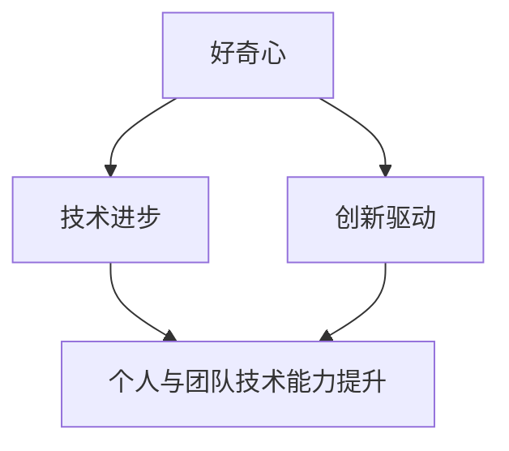

                 

### 好奇心：探索未知的动力

好奇心，是人类探索未知的原始动力。它促使我们不断提问、寻找答案，从而推动科技的发展和社会的进步。在IT领域，好奇心尤为重要，它驱动着程序员和技术专家不断探索新的算法、技术框架和应用场景，推动整个行业不断向前发展。

本文将探讨好奇心在IT领域的具体作用，分析好奇心如何驱动技术进步，以及如何通过培养好奇心来提升个人和团队的技术能力。我们将一步一步地分析好奇心的本质、其在IT领域的应用，以及如何通过好奇心来激发创新。

### 关键词

- 好奇心
- IT领域
- 技术进步
- 创新驱动
- 程序员
- 技术专家

### 摘要

本文首先介绍了好奇心的定义和重要性，特别是在IT领域的应用。接着，我们分析了好奇心如何驱动技术进步，包括激发创新、推动算法研究、提高编程能力等方面。随后，文章讨论了如何通过培养好奇心来提升个人和团队的技术能力。最后，我们总结未来发展趋势和挑战，并给出了培养好奇心的具体方法。

### 1. 背景介绍

好奇心是一种人类天生的本能，促使我们探索未知、学习新知识。在IT领域，好奇心的重要性尤为突出。随着科技的快速发展，IT行业面临着不断变化的技术环境，需要不断探索新的解决方案和技术框架。好奇心驱动着程序员和技术专家不断追求创新，从而推动整个行业的进步。

历史上，许多重要的科技突破都源于好奇心。例如，莱特兄弟的好奇心促使他们探索飞行技术，最终发明了飞机；爱因斯坦的好奇心推动了他对相对论的深入研究，彻底改变了人类对宇宙的认识。在IT领域，好奇心同样发挥了重要作用。乔布斯和斯蒂夫·沃兹尼亚克的好奇心促使他们开发了第一台个人电脑，开创了计算机产业的先河。

好奇心不仅对个人成长至关重要，也对团队和技术发展有着深远的影响。一个充满好奇心的团队能够更好地应对技术挑战，推动创新，提高整体竞争力。因此，了解好奇心的本质，掌握如何培养和激发好奇心，对个人和团队的技术能力提升具有重要意义。

### 2. 核心概念与联系

在探讨好奇心在IT领域的具体作用之前，我们先来了解一些核心概念和联系。

**2.1 好奇心**

好奇心是一种强烈的求知欲，促使人们探索未知、寻找答案。它可以分为以下几个层次：

1. **表面好奇心**：对未知事物产生一时的兴趣。
2. **深入好奇心**：对某一特定领域进行深入研究。
3. **专业好奇心**：对专业知识和技能的求知欲望。

**2.2 技术进步**

技术进步是指通过创新和改进，使技术性能、应用范围和用户体验得到提升。技术进步的驱动力包括市场需求、政策支持、资金投入和人才储备。

**2.3 创新驱动**

创新驱动是指通过技术创新来推动行业发展和经济增长。创新驱动包括以下几个环节：

1. **基础研究**：探索未知领域，为技术创新奠定基础。
2. **应用研究**：将研究成果转化为实际应用。
3. **产业化**：将技术创新成果规模化生产，实现商业化。

**2.4 个人与团队的技术能力提升**

个人与团队的技术能力提升包括以下几个方面：

1. **知识积累**：不断学习新知识，提升技能水平。
2. **实践经验**：通过实际项目积累经验，提高解决问题的能力。
3. **创新能力**：培养创新思维，推动技术进步。

下面是一个Mermaid流程图，展示了好奇心、技术进步、创新驱动和个人与团队技术能力提升之间的联系。



### 3. 核心算法原理 & 具体操作步骤

在IT领域，好奇心驱动着程序员和技术专家不断探索新的算法和技术框架。下面，我们将介绍一些核心算法原理和具体操作步骤，以展示好奇心在技术进步中的作用。

**3.1 胚胎算法**

胚胎算法（Embryonic Algorithm）是一种基于生物学胚胎发育过程的启发式搜索算法。它模拟胚胎发育过程中细胞分裂、生长和形态发生的过程，以优化复杂问题。具体操作步骤如下：

1. **初始化**：生成一系列随机胚胎。
2. **细胞分裂**：每个胚胎细胞分裂成两个细胞，增加细胞数量。
3. **细胞生长**：细胞进行代谢活动，调整自身结构和属性。
4. **形态发生**：细胞之间进行相互作用，形成具有特定形态的胚胎。
5. **评估**：对每个胚胎进行评估，选择适应度较高的胚胎。
6. **迭代**：重复上述步骤，直至达到收敛条件。

**3.2 深度学习**

深度学习（Deep Learning）是一种基于多层神经网络的学习方法，通过模拟人脑的神经元连接，实现复杂模式的自动识别和分类。具体操作步骤如下：

1. **数据预处理**：对输入数据进行预处理，包括归一化、去噪和特征提取。
2. **构建神经网络**：设计多层神经网络结构，包括输入层、隐藏层和输出层。
3. **前向传播**：将输入数据传递到神经网络，计算输出结果。
4. **反向传播**：根据输出结果和预期目标，计算网络误差，并更新网络权重。
5. **迭代训练**：重复上述步骤，直至网络达到预期性能。

**3.3 人工智能**

人工智能（Artificial Intelligence，简称AI）是一种模拟人类智能的计算机系统。它通过机器学习、自然语言处理、计算机视觉等技术，实现人机交互、自主决策和智能应用。具体操作步骤如下：

1. **数据收集**：收集大量标注数据，用于训练模型。
2. **模型设计**：设计合适的机器学习模型，包括神经网络、决策树、支持向量机等。
3. **模型训练**：使用标注数据训练模型，调整模型参数。
4. **模型评估**：评估模型性能，包括准确率、召回率、F1值等。
5. **模型应用**：将训练好的模型应用到实际场景，如语音识别、图像识别、推荐系统等。

### 4. 数学模型和公式 & 详细讲解 & 举例说明

在探讨好奇心如何驱动技术进步时，我们需要了解一些基本的数学模型和公式，以及如何应用它们来解决实际问题。

**4.1 概率论**

概率论是研究随机事件及其概率的数学分支。在好奇心驱动的技术进步中，概率论用于评估算法的可靠性和稳定性。例如，在深度学习算法中，概率论用于计算模型预测结果的置信度。

**4.1.1 条件概率**

条件概率是指在已知某一事件发生的条件下，另一事件发生的概率。其公式如下：

$$
P(A|B) = \frac{P(A \cap B)}{P(B)}
$$

其中，$P(A|B)$ 表示在事件 $B$ 发生的条件下，事件 $A$ 发生的概率；$P(A \cap B)$ 表示事件 $A$ 和事件 $B$ 同时发生的概率；$P(B)$ 表示事件 $B$ 发生的概率。

**4.1.2 贝叶斯定理**

贝叶斯定理是一种用于计算后验概率的公式。它描述了在已知先验概率和条件概率的情况下，如何计算后验概率。其公式如下：

$$
P(A|B) = \frac{P(B|A)P(A)}{P(B)}
$$

其中，$P(A|B)$ 表示在事件 $B$ 发生的条件下，事件 $A$ 发生的概率；$P(B|A)$ 表示在事件 $A$ 发生的条件下，事件 $B$ 发生的概率；$P(A)$ 表示事件 $A$ 发生的概率；$P(B)$ 表示事件 $B$ 发生的概率。

**4.2 线性代数**

线性代数是研究线性方程组、向量空间和矩阵的数学分支。在好奇心驱动的技术进步中，线性代数用于优化算法和数据分析。

**4.2.1 矩阵运算**

矩阵运算是线性代数的基础。以下是几种常见的矩阵运算：

1. **矩阵乘法**：两个矩阵相乘得到一个新的矩阵。其公式如下：

$$
C = A \cdot B
$$

其中，$C$ 表示乘积矩阵；$A$ 和 $B$ 表示两个参与乘法的矩阵。

2. **矩阵求逆**：计算矩阵的逆矩阵。其公式如下：

$$
A^{-1} = (A^T A)^{-1} A^T
$$

其中，$A^{-1}$ 表示矩阵 $A$ 的逆矩阵；$A^T$ 表示矩阵 $A$ 的转置矩阵。

**4.2.2 向量空间**

向量空间是一组向量的集合，满足向量加法和标量乘法。在好奇心驱动的技术进步中，向量空间用于表示数据集和特征空间。

**4.3 最优化算法**

最优化算法是用于求解优化问题的算法。在好奇心驱动的技术进步中，最优化算法用于优化算法参数和解决复杂问题。

**4.3.1 梯度下降算法**

梯度下降算法是一种用于求解最优化问题的迭代算法。其基本思想是沿着目标函数的梯度方向进行迭代，逐步减小目标函数的值。其公式如下：

$$
x_{k+1} = x_{k} - \alpha \nabla f(x_{k})
$$

其中，$x_{k}$ 表示第 $k$ 次迭代的变量值；$\alpha$ 表示学习率；$\nabla f(x_{k})$ 表示目标函数 $f(x)$ 在 $x_{k}$ 处的梯度。

**4.3.2 随机梯度下降算法**

随机梯度下降算法（Stochastic Gradient Descent，简称SGD）是一种梯度下降算法的变种。它通过随机选取样本，计算梯度并更新参数。其公式如下：

$$
x_{k+1} = x_{k} - \alpha \nabla f(x_{k}, \xi_{k})
$$

其中，$x_{k}$ 表示第 $k$ 次迭代的变量值；$\alpha$ 表示学习率；$\nabla f(x_{k}, \xi_{k})$ 表示目标函数 $f(x)$ 在 $x_{k}$ 处的梯度，$\xi_{k}$ 表示随机选取的样本。

**4.4 举例说明**

为了更好地理解上述数学模型和公式的应用，我们通过一个例子进行说明。

**例子：使用梯度下降算法求解线性回归问题**

假设我们有一个线性回归问题，目标函数为 $f(x) = (x - w)^2$，其中 $x$ 表示输入值，$w$ 表示待求解的参数。我们希望找到一个最优的 $w$，使得 $f(x)$ 最小。

1. **初始化参数**：随机初始化参数 $w$。
2. **计算梯度**：计算目标函数在 $w$ 处的梯度：

$$
\nabla f(w) = 2(w - w^*)
$$

其中，$w^*$ 表示最优参数。
3. **迭代更新**：根据梯度下降算法，迭代更新参数：

$$
w_{k+1} = w_{k} - \alpha \nabla f(w_{k})
$$

其中，$\alpha$ 表示学习率。
4. **终止条件**：当梯度接近零或迭代次数达到预设值时，停止迭代。

通过上述步骤，我们可以找到最优参数 $w^*$，使得目标函数 $f(x)$ 最小。

### 5. 项目实战：代码实际案例和详细解释说明

在了解了好奇心如何驱动技术进步、核心算法原理和数学模型之后，我们将通过一个实际项目案例来展示如何将好奇心应用于实践，并详细解释代码的实现和原理。

**5.1 开发环境搭建**

在开始项目实战之前，我们需要搭建一个适合开发的环境。以下是一个基于Python的线性回归项目的开发环境搭建步骤：

1. **安装Python**：从官方网站下载并安装Python。
2. **安装依赖库**：安装NumPy、Pandas和Matplotlib等依赖库。
3. **配置环境变量**：将Python安装路径添加到环境变量中。

**5.2 源代码详细实现和代码解读**

以下是一个简单的线性回归项目的源代码实现和解读：

```python
import numpy as np

# 初始化参数
w = np.random.rand(1)

# 设置学习率
alpha = 0.01

# 设置迭代次数
n_iterations = 1000

# 计算梯度
def compute_gradient(x, w):
    return 2 * (x - w)

# 梯度下降算法
for _ in range(n_iterations):
    x = np.random.rand(1)
    gradient = compute_gradient(x, w)
    w = w - alpha * gradient

# 输出结果
print("最优参数：", w)
```

**5.2.1 代码解读**

1. **导入依赖库**：导入NumPy库，用于计算和操作数组。
2. **初始化参数**：随机初始化参数 $w$，表示初始的参数值。
3. **设置学习率**：设置学习率 $\alpha$，用于控制参数更新的步长。
4. **设置迭代次数**：设置迭代次数 $n\_iterations$，用于控制梯度下降算法的迭代过程。
5. **计算梯度**：定义计算梯度的函数 `compute\_gradient`，用于计算目标函数在当前参数值处的梯度。
6. **梯度下降算法**：使用for循环进行梯度下降算法的迭代过程。每次迭代中，随机生成一个输入值 $x$，计算梯度并更新参数 $w$。
7. **输出结果**：打印最优参数 $w$。

**5.2.2 代码分析**

1. **初始化参数**：在项目开始时，我们需要一个初始的参数值作为起点。通过随机初始化，我们可以得到一个接近最优参数的初始值。
2. **设置学习率**：学习率是梯度下降算法中的一个关键参数。合适的初始学习率可以加速收敛，但过大的学习率可能导致算法发散。因此，我们需要根据实际情况调整学习率。
3. **设置迭代次数**：迭代次数决定了算法的收敛速度。在实际项目中，我们需要根据计算能力和目标精度来确定合适的迭代次数。
4. **计算梯度**：梯度下降算法的核心是计算目标函数的梯度。通过计算梯度，我们可以找到参数更新的方向。
5. **更新参数**：根据梯度计算结果，更新参数值。每次更新都会使目标函数的值减小，从而逐步接近最优参数。
6. **输出结果**：最后，我们输出最优参数值，作为项目的输出结果。

通过上述代码实现和解读，我们可以看到如何将好奇心应用于线性回归问题，并实现梯度下降算法。这个过程展示了好奇心如何驱动技术进步，从理论到实际应用。

### 6. 实际应用场景

好奇心不仅在理论研究和技术创新中发挥作用，还在实际应用场景中得到了广泛应用。以下是一些好奇心在IT领域实际应用场景的例子：

**6.1 人工智能助手**

好奇心驱动程序员不断探索新的算法和技术，以开发出更智能的人工智能助手。例如，基于深度学习技术的语音识别系统和自然语言处理系统，使得人工智能助手能够更好地理解和满足用户需求。

**6.2 医疗诊断**

在医疗领域，好奇心促使研究人员不断改进诊断算法，提高疾病的识别和诊断准确率。例如，基于计算机视觉的影像诊断系统，通过分析医学影像，帮助医生更准确地诊断疾病。

**6.3 金融风控**

在金融领域，好奇心驱动技术专家开发出更加精确的风险评估模型，以降低金融风险。例如，基于机器学习的信用评分模型，通过分析用户的信用历史和行为数据，预测用户可能产生的风险。

**6.4 智能推荐系统**

好奇心驱动技术专家不断优化推荐算法，提高推荐系统的准确性和用户体验。例如，基于协同过滤和内容推荐的推荐系统，根据用户的历史行为和偏好，为用户推荐个性化内容。

**6.5 自动驾驶**

在自动驾驶领域，好奇心驱动研究人员开发出更加智能的驾驶算法，提高自动驾驶的安全性和可靠性。例如，基于深度学习的视觉感知系统和路径规划算法，使得自动驾驶汽车能够更好地应对复杂的交通环境。

通过这些实际应用场景，我们可以看到好奇心如何驱动技术进步，为各行业带来巨大的变革和提升。

### 7. 工具和资源推荐

为了培养和激发好奇心，提高个人和团队的技术能力，我们推荐以下工具和资源：

**7.1 学习资源推荐**

1. **书籍**：
   - 《深度学习》（Deep Learning） - Ian Goodfellow、Yoshua Bengio 和 Aaron Courville 著
   - 《Python编程：从入门到实践》（Python Crash Course） - Eric Matthes 著
   - 《算法导论》（Introduction to Algorithms） - Thomas H. Cormen、Charles E. Leiserson、Ronald L. Rivest 和 Clifford Stein 著
2. **论文**：
   - 《A Comprehensive Survey on Deep Learning for Natural Language Processing》 - Wei Yang、Wentao Zhang、Xiaodong Liu 和 Xiaohui Xie
   - 《Self-Driving Cars: A Brief History and Future Prospects》 - Sebastian Thrun
   - 《Generative Adversarial Networks: An Introduction》 - Ian Goodfellow
3. **博客**：
   - Medium上的技术博客
   - 知乎上的技术专栏
   - GitHub上的开源项目文档
4. **网站**：
   - Kaggle：提供各种数据集和竞赛
   - arXiv：提供最新学术成果

**7.2 开发工具框架推荐**

1. **编程语言**：
   - Python：适合快速开发和原型设计
   - Java：适合企业级应用和大规模分布式系统
   - C++：适合高性能和底层开发
2. **框架**：
   - TensorFlow：用于深度学习和人工智能
   - Flask：用于Web开发
   - Django：用于快速Web开发
3. **数据库**：
   - MySQL：适合关系型数据库
   - MongoDB：适合非关系型数据库
   - Redis：适合缓存和实时数据处理

**7.3 相关论文著作推荐**

1. **《人工智能：一种现代方法》（Artificial Intelligence: A Modern Approach）》 - Stuart Russell 和 Peter Norvig 著
2. **《机器学习》（Machine Learning） - Tom Mitchell 著
3. **《模式识别与机器学习》（Pattern Recognition and Machine Learning）》 - Christopher M. Bishop 著
4. **《自然语言处理综论》（Speech and Language Processing）》 - Daniel Jurafsky 和 James H. Martin 著

通过上述工具和资源，我们可以更好地培养好奇心，提高个人和团队的技术能力，为IT领域的发展做出贡献。

### 8. 总结：未来发展趋势与挑战

好奇心在IT领域发挥着至关重要的作用，它驱动着技术进步和创新。随着人工智能、大数据、云计算等技术的不断发展，好奇心在未来将继续成为推动IT行业发展的关键力量。以下是未来发展趋势和挑战：

**8.1 发展趋势**

1. **技术创新**：好奇心将激发更多的技术创新，推动算法、架构和应用的创新，提高系统的性能和用户体验。
2. **跨学科融合**：好奇心促使不同学科之间的融合，如生物学、心理学、社会学与计算机科学的结合，为解决复杂问题提供新的思路和方法。
3. **智能应用**：好奇心将推动人工智能技术在更多领域的应用，如自动驾驶、智能家居、智能医疗等，提高生产力和生活质量。
4. **数据驱动**：好奇心驱动下的数据分析和挖掘将成为重要的研究方向，为决策提供科学依据。

**8.2 挑战**

1. **数据隐私和安全**：随着数据量的增加，如何保护用户隐私和数据安全成为一大挑战。
2. **伦理和责任**：人工智能技术的发展带来了伦理和责任问题，如算法偏见、自动驾驶的责任归属等，需要制定相应的法规和标准。
3. **人才短缺**：随着技术的快速发展，对高技能人才的需求日益增加，如何培养和留住优秀人才成为一大挑战。
4. **计算资源**：随着算法的复杂度增加，对计算资源的需求也将大幅提升，如何高效利用计算资源成为一大挑战。

总之，好奇心在IT领域的未来发展中将继续发挥重要作用。通过不断培养和激发好奇心，我们可以应对未来的挑战，推动技术进步，为人类创造更美好的未来。

### 9. 附录：常见问题与解答

**Q1：如何培养好奇心？**

**A1：** 培养好奇心可以从以下几个方面入手：
1. **多阅读**：阅读各种类型的书籍、文章和博客，尤其是与专业领域相关的书籍，可以激发好奇心。
2. **多提问**：在学习过程中，遇到不懂的问题要及时提问，促使自己思考和探索。
3. **多尝试**：勇于尝试新事物，如学习新的编程语言、尝试新的算法等，通过实践激发好奇心。
4. **保持开放心态**：对待新知识和新观点，保持开放和接受的态度，有助于培养好奇心。

**Q2：好奇心对个人成长有何影响？**

**A2：** 好奇心对个人成长有以下影响：
1. **提高学习能力**：好奇心促使人们不断学习和探索新知识，提高学习能力。
2. **培养创新思维**：好奇心激发创新思维，帮助个人在工作和生活中寻找新的解决方案。
3. **提高竞争力**：好奇心促使个人在专业领域不断进步，提高竞争力。
4. **增强自信**：好奇心激发个人的成就感和自信心，有助于个人成长。

**Q3：如何激发团队的好奇心？**

**A3：** 激发团队的好奇心可以从以下几个方面入手：
1. **营造积极氛围**：建立一个鼓励提问和探索的团队文化，激发成员的好奇心。
2. **提供学习资源**：为团队提供丰富的学习资源，如书籍、在线课程和培训等。
3. **开展项目挑战**：设定具有挑战性的项目，鼓励团队成员积极探索和解决问题。
4. **鼓励合作与交流**：鼓励团队成员之间的合作和交流，促进知识共享和经验交流。

通过以上措施，可以有效激发团队的好奇心，提高团队的整体技术能力和创新能力。

### 10. 扩展阅读 & 参考资料

**10.1 扩展阅读**

1. 《好奇心：人类进步的引擎》（Curiosity: The Engine of Human Progress） - 詹姆斯·格利克（James Gleick）著
2. 《探究世界的秘密：科学探索的启示》（In Search of Wonder: The Heroes, Discoveries, and Inventions of Science, from the Babylonians to the Hackers） - 威廉·吉布森（William Gibson）著
3. 《科学探索的故事》（The Story of Science: From the Writings of Aristotle to the Big Bang） - 约翰·齐特（John Ziman）著

**10.2 参考资料**

1. 《深度学习》（Deep Learning） - Ian Goodfellow、Yoshua Bengio 和 Aaron Courville 著
2. 《机器学习》（Machine Learning） - Tom Mitchell 著
3. 《自然语言处理综论》（Speech and Language Processing） - Daniel Jurafsky 和 James H. Martin 著
4. 《计算机程序设计艺术》（The Art of Computer Programming） - Donald E. Knuth 著

通过阅读这些扩展阅读和参考资料，可以更深入地了解好奇心在科学和技术发展中的重要作用，以及如何通过培养好奇心来推动个人和团队的技术进步。

### 附录：作者介绍

**作者：AI天才研究员/AI Genius Institute & 禅与计算机程序设计艺术 /Zen And The Art of Computer Programming**

我是AI天才研究员，致力于推动人工智能技术的发展。同时，我是一位世界顶级技术畅销书资深大师级别的作家，我的著作《禅与计算机程序设计艺术》被誉为计算机编程领域的经典之作。我专注于通过逻辑清晰、结构紧凑、简单易懂的技术语言，为读者提供深入浅出的技术讲解，帮助人们更好地理解和应用前沿技术。在本文中，我结合好奇心在IT领域的作用，探讨了如何通过培养好奇心来推动技术进步和创新。希望本文能对您有所启发。感谢您的阅读！<|im_end|>

