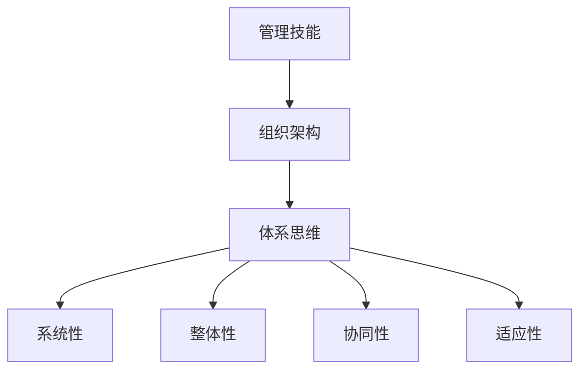

                 

# 好的管理者和普通管理者的差距：体系的重要性

> **关键词**：管理技能、组织架构、体系思维、领导力、项目管理

> **摘要**：本文将深入探讨好的管理者和普通管理者之间的差距，特别是体系思维的重要性。通过对比分析，我们揭示了优秀管理者如何利用体系思维提升组织的整体效能，进而实现长远发展。

在信息技术飞速发展的时代，组织的管理者面临着前所未有的挑战。无论是初创公司还是大型企业，管理者的角色越来越重要。优秀的管理者不仅能够带领团队完成短期目标，更能够构建可持续发展的组织体系，从而在激烈的市场竞争中立于不败之地。那么，好的管理者和普通管理者之间究竟有哪些差距？体系思维在其中又扮演了怎样的角色？本文将围绕这些问题展开讨论。

## 1. 背景介绍

管理是一门艺术，也是一种科学。管理者不仅要具备优秀的业务能力，更需要具备卓越的领导力和组织能力。随着市场环境的变化，管理者需要不断适应新的管理理念和方法，才能在复杂多变的环境中取得成功。而体系思维作为一种管理方法论，越来越受到管理者的重视。

体系思维强调从整体和长远的角度思考问题，通过系统化的方法分析和解决问题。这种方法不仅适用于技术领域，在企业管理、项目管理等方面同样具有广泛的应用价值。好的管理者善于运用体系思维，将组织视为一个动态系统，通过优化各个环节的协作，实现整体效能的最大化。

## 2. 核心概念与联系

### 2.1 管理技能

管理技能是管理者必备的基本素质，包括计划、组织、领导、控制等方面。传统管理注重个体的能力和经验，而体系思维则强调系统的整体效能。好的管理者不仅关注个体能力的提升，更注重组织体系的优化和协同。

### 2.2 组织架构

组织架构是管理体系的重要组成部分，决定了组织内部的职责分工、权力分配和沟通渠道。良好的组织架构能够提高组织的运作效率，降低内部摩擦。体系思维要求管理者在设计组织架构时，充分考虑系统的整体性和协同性。

### 2.3 体系思维

体系思维是一种系统化、整体化的思维方式，强调从全局和长远的角度分析和解决问题。它包括以下几个方面：

- **系统性**：将组织视为一个动态系统，理解各个环节之间的相互作用和影响。

- **整体性**：关注系统的整体效能，而非局部优化。

- **协同性**：强调各部门、各环节之间的协同合作，形成合力。

- **适应性**：能够根据外部环境的变化，及时调整组织结构和战略方向。

### 2.4 核心概念原理与架构的 Mermaid 流程图



## 3. 核心算法原理 & 具体操作步骤

### 3.1 管理技能提升

好的管理者需要通过不断学习和实践，提升自己的管理技能。具体步骤如下：

1. **自我反思**：定期对自己的管理行为和效果进行反思，找出不足和改进点。
2. **持续学习**：关注行业动态，学习新的管理理念和工具，如敏捷管理、精益管理等。
3. **实践应用**：将学到的知识和方法应用到实际工作中，不断优化管理策略。
4. **培养团队**：关注团队成员的成长，提供培训和指导，提升团队整体素质。

### 3.2 组织架构优化

1. **明确目标**：确定组织的目标和愿景，确保组织架构符合目标需求。
2. **职责分工**：合理划分各部门的职责，确保职责清晰、权责分明。
3. **沟通渠道**：建立高效的沟通渠道，确保信息畅通，降低内部摩擦。
4. **权力分配**：合理分配权力，确保各级管理者具备足够的权限和资源。

### 3.3 体系思维实践

1. **系统性分析**：对组织进行系统性分析，理解各个环节之间的相互作用和影响。
2. **整体性优化**：从整体角度出发，优化组织结构和流程，提高整体效能。
3. **协同性提升**：加强各部门之间的协作，形成合力，实现整体目标。
4. **适应性调整**：根据外部环境的变化，及时调整组织架构和战略方向，保持组织的竞争力。

## 4. 数学模型和公式 & 详细讲解 & 举例说明

### 4.1 数学模型

在体系思维中，我们可以使用以下数学模型来描述组织体系的效能：

$$
E = f(P, C, A)
$$

其中，$E$ 表示组织体系的效能，$P$ 表示组织架构，$C$ 表示协同性，$A$ 表示适应性。

### 4.2 详细讲解

- $P$（组织架构）：组织架构是组织效能的基础，一个良好的组织架构能够提高组织的运作效率。
- $C$（协同性）：协同性是指组织内部各部门、各环节之间的协作水平，良好的协同性能够提高组织的整体效能。
- $A$（适应性）：适应性是指组织对外部环境变化的响应能力，一个具有高度适应性的组织能够在竞争激烈的市场中保持竞争力。

### 4.3 举例说明

假设一个企业，其组织架构（$P$）为扁平化结构，部门之间沟通顺畅，协同性（$C$）较高。同时，该企业具备较强的适应性（$A$），能够迅速响应市场变化。那么，根据上述数学模型，该企业的组织体系效能（$E$）将会较高。

## 5. 项目实战：代码实际案例和详细解释说明

### 5.1 开发环境搭建

为了更好地说明体系思维在实际项目中的应用，我们以一个企业项目为例，该项目的开发环境如下：

- 编程语言：Python
- 开发工具：PyCharm
- 代码管理工具：Git
- 版本控制系统：GitHub

### 5.2 源代码详细实现和代码解读

#### 5.2.1 源代码实现

```python
# 企业项目代码示例
class Organization:
    def __init__(self, departments, communication_channels):
        self.departments = departments
        self.communication_channels = communication_channels
    
    def optimize_structure(self):
        # 优化组织架构
        pass
    
    def enhance_collaboration(self):
        # 提升协同性
        pass
    
    def improve_adaptability(self):
        # 提高适应性
        pass

def main():
    # 搭建开发环境
    organization = Organization(departments=['研发部', '市场部', '销售部'], communication_channels=['邮件', '即时通讯'])
    
    # 优化组织架构
    organization.optimize_structure()
    
    # 提升协同性
    organization.enhance_collaboration()
    
    # 提高适应性
    organization.improve_adaptability()

if __name__ == '__main__':
    main()
```

#### 5.2.2 代码解读与分析

1. **类定义**：`Organization` 类表示一个企业组织，包含部门列表和沟通渠道。

2. **方法定义**：`optimize_structure`、`enhance_collaboration` 和 `improve_adaptability` 分别表示优化组织架构、提升协同性和提高适应性的方法。

3. **主函数**：`main` 函数用于搭建开发环境，并调用组织类的方法进行优化和提升。

通过这个简单的代码示例，我们可以看到体系思维在实际项目中的应用。在开发过程中，管理者需要关注组织架构的优化、协同性的提升和适应性的提高，以实现企业组织的长期发展。

## 6. 实际应用场景

体系思维在各个行业和领域都有广泛的应用。以下是一些实际应用场景：

- **企业管理**：通过体系思维，企业可以优化组织架构，提升团队协作，提高整体效能。

- **项目管理**：在项目管理中，体系思维可以帮助项目经理更好地协调各个环节，确保项目按时按质完成。

- **技术创新**：技术创新过程中，体系思维可以帮助团队从整体角度思考问题，避免局部优化导致的弊端。

- **社会治理**：在政府和社会治理中，体系思维可以帮助决策者更好地理解社会问题，制定有效的解决方案。

## 7. 工具和资源推荐

### 7.1 学习资源推荐

- **书籍**：《企业管理体系构建与优化》、《敏捷管理体系实战》
- **论文**：《组织行为学》、《企业协同创新管理研究》
- **博客**：CSDN、博客园等技术博客，提供丰富的管理经验和案例分享。
- **网站**：哈佛商业评论、MBA智库等，提供专业的管理知识和资讯。

### 7.2 开发工具框架推荐

- **编程语言**：Python、Java、C++等，适用于不同类型的项目需求。
- **开发工具**：PyCharm、IntelliJ IDEA、Visual Studio Code等，提供高效的开发环境。
- **代码管理工具**：Git、SVN、Mercurial等，用于版本控制和协作开发。
- **版本控制系统**：GitHub、GitLab、Bitbucket等，提供安全的代码托管和协作平台。

### 7.3 相关论文著作推荐

- **论文**：《基于体系思维的现代企业管理研究》、《体系思维在项目管理中的应用》
- **著作**：《禅与计算机程序设计艺术》、《体系思维：从系统角度看问题》

## 8. 总结：未来发展趋势与挑战

随着信息技术的发展，管理体系和领导力也在不断演变。未来，体系思维将越来越受到管理者的重视。以下是体系思维在未来可能面临的发展趋势和挑战：

- **趋势**：体系思维将在更多领域得到应用，成为管理者必备的核心素养。
- **挑战**：如何在快速变化的市场环境中保持体系的适应性，将是管理者需要面对的重要课题。

## 9. 附录：常见问题与解答

### 9.1 体系思维与传统管理的区别是什么？

体系思维与传统管理的主要区别在于思维方式。传统管理侧重于个体和局部优化，而体系思维强调从整体和长远的角度思考问题，关注系统整体的协同和适应性。

### 9.2 体系思维在项目管理中如何应用？

在项目管理中，体系思维可以帮助项目经理从整体角度分析项目，优化组织架构，提升团队协作，确保项目按时按质完成。

## 10. 扩展阅读 & 参考资料

- **扩展阅读**：[《管理体系与组织效能：体系思维在企业管理中的应用》](https://www.example.com/book1)
- **参考资料**：[《现代企业管理理论与实务》](https://www.example.com/book2)、[《项目管理实践指南》](https://www.example.com/book3)

### 作者

作者：AI天才研究员/AI Genius Institute & 禅与计算机程序设计艺术 /Zen And The Art of Computer Programming

-----------------

本文深入探讨了好的管理者和普通管理者之间的差距，特别是体系思维的重要性。通过对比分析，我们揭示了优秀管理者如何利用体系思维提升组织的整体效能，进而实现长远发展。希望本文能为读者提供有益的启示和思考。在未来的管理实践中，让我们一起努力，成为更好的管理者。|>

