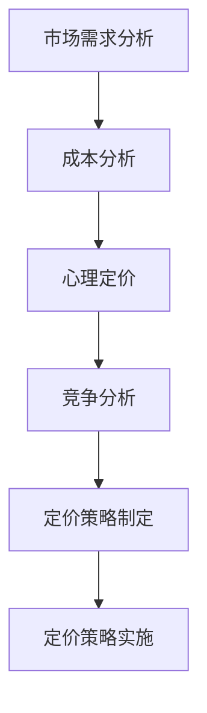

                 

# 如何为初创产品制定定价策略

> 关键词：初创产品、定价策略、市场需求、成本分析、心理定价、竞争分析
>
> 摘要：本文旨在为初创产品提供一套系统化的定价策略，涵盖市场需求分析、成本核算、心理定价以及竞争定位等方面。通过逐步分析，帮助创业者制定出科学合理、具有市场竞争力的产品定价方案。

## 1. 背景介绍

在初创企业的发展过程中，产品定价策略的制定至关重要。合理的定价不仅能确保企业获得预期的利润，还能提升产品的市场竞争力，吸引更多潜在用户。然而，定价并非易事，它需要综合考虑市场需求、成本结构、心理因素以及市场竞争状况等多种因素。

本文将围绕初创产品的定价策略展开讨论，旨在提供一套系统的分析框架和方法，帮助创业者更好地制定定价策略。具体而言，本文将分为以下几个部分：

1. **市场需求分析**：通过分析市场需求，确定产品价格的市场接受范围。
2. **成本分析**：核算产品成本，为定价提供基础数据。
3. **心理定价**：探讨消费者心理，制定具有吸引力的价格。
4. **竞争分析**：分析竞争对手定价策略，进行合理定位。
5. **实战案例**：通过具体案例，展示定价策略的制定和实施过程。
6. **工具和资源推荐**：提供相关学习资源，助力创业者提升定价策略能力。
7. **总结与未来趋势**：总结本文要点，展望未来定价策略的发展方向。

## 2. 核心概念与联系

### 2.1 需求价格弹性

需求价格弹性是指市场需求量对价格变动的敏感程度。计算公式为：

\[ \text{需求价格弹性} = \frac{\text{需求量变化百分比}}{\text{价格变化百分比}} \]

需求价格弹性越大，说明市场需求对价格变化的敏感度越高。在制定定价策略时，了解产品的需求价格弹性有助于判断价格变动对销售量的影响。

### 2.2 成本结构

成本结构是指产品成本在不同要素上的分配情况。主要成本包括原材料成本、人工成本、生产成本、营销成本等。在定价过程中，成本结构是制定价格下限的重要依据。

### 2.3 心理定价

心理定价是指根据消费者心理制定价格，以达到提升产品形象、增加消费者购买欲望的目的。心理定价策略包括整数定价、尾数定价、折扣定价等。

### 2.4 竞争分析

竞争分析是指对竞争对手的产品价格、市场定位、营销策略等进行研究，以确定本企业产品在市场中的竞争地位。竞争分析有助于企业制定合理的定价策略，确保产品在市场竞争中具备优势。

### 2.5 Mermaid 流程图

以下是产品定价策略的核心概念和流程的 Mermaid 流程图：



## 3. 核心算法原理 & 具体操作步骤

### 3.1 市场需求分析

**步骤 1**：收集数据

收集目标市场的人口统计信息、购买行为、消费习惯等数据，以了解市场需求。

**步骤 2**：分析需求价格弹性

通过历史销售数据或市场调研数据，计算需求价格弹性，以确定市场需求对价格变动的敏感程度。

**步骤 3**：确定价格区间

根据需求价格弹性，结合市场调研数据，确定产品的价格区间。

**步骤 4**：评估市场需求

根据市场需求情况，调整价格区间，确保产品具有市场竞争力和吸引力。

### 3.2 成本分析

**步骤 1**：核算成本

详细核算产品成本，包括原材料成本、人工成本、生产成本、营销成本等。

**步骤 2**：确定成本结构

分析产品成本在不同要素上的分配情况，了解成本结构。

**步骤 3**：确定成本下限

根据成本结构，确定产品的成本下限，为定价提供基础数据。

### 3.3 心理定价

**步骤 1**：了解消费者心理

通过市场调研、消费者访谈等方式，了解消费者的购买心理和偏好。

**步骤 2**：选择定价策略

根据消费者心理，选择合适的心理定价策略，如整数定价、尾数定价、折扣定价等。

**步骤 3**：制定价格

结合市场需求、成本分析和心理定价策略，制定产品价格。

### 3.4 竞争分析

**步骤 1**：收集竞争对手信息

收集竞争对手的产品价格、市场定位、营销策略等数据。

**步骤 2**：分析竞争对手策略

分析竞争对手的定价策略，了解其在市场中的竞争地位。

**步骤 3**：定位本企业产品

根据竞争对手策略，确定本企业在市场中的定位，制定合理的定价策略。

## 4. 数学模型和公式 & 详细讲解 & 举例说明

### 4.1 需求价格弹性计算

需求价格弹性的计算公式为：

\[ \text{需求价格弹性} = \frac{\text{需求量变化百分比}}{\text{价格变化百分比}} \]

例如，假设产品A的价格从100元上涨到120元，需求量从1000件下降到800件，需求价格弹性为：

\[ \text{需求价格弹性} = \frac{(800 - 1000) \div 1000}{(120 - 100) \div 100} = \frac{-200 \div 1000}{20 \div 100} = -1 \]

这意味着产品A的需求价格弹性为-1，即价格上涨10%，需求量下降10%。

### 4.2 成本结构分析

成本结构分析的主要目的是了解产品成本在不同要素上的分配情况。以下是一个简化的成本结构分析示例：

\[ \text{总成本} = \text{原材料成本} + \text{人工成本} + \text{生产成本} + \text{营销成本} \]

假设产品B的总成本为100万元，其中：

- 原材料成本：30万元
- 人工成本：20万元
- 生产成本：25万元
- 营销成本：25万元

则产品B的成本结构为：

\[ \text{原材料成本占比} = \frac{30}{100} = 0.3 \]
\[ \text{人工成本占比} = \frac{20}{100} = 0.2 \]
\[ \text{生产成本占比} = \frac{25}{100} = 0.25 \]
\[ \text{营销成本占比} = \frac{25}{100} = 0.25 \]

### 4.3 心理定价策略

心理定价策略的目的是通过制定具有吸引力的价格，提升消费者的购买欲望。以下是一些常见的心里定价策略：

- **整数定价**：以整数价格出售产品，给人以高质量、高档次的印象。
- **尾数定价**：以尾数价格出售产品，给人以实惠、划算的感觉。
- **折扣定价**：在特定时期或促销活动中，给予消费者折扣优惠，吸引消费者购买。

例如，一款定价为999元的手机，给人以高端、高品质的印象；而定价为990元的手机，则给人以实惠、划算的感觉。

## 5. 项目实战：代码实际案例和详细解释说明

### 5.1 开发环境搭建

为了更好地展示定价策略的制定和实施过程，我们将使用Python编写一个简单的定价策略分析工具。以下是开发环境搭建的步骤：

1. 安装Python：从Python官方网站（https://www.python.org/downloads/）下载并安装Python。
2. 安装PyCharm：从PyCharm官方网站（https://www.jetbrains.com/pycharm/）下载并安装PyCharm。
3. 创建Python项目：在PyCharm中创建一个新的Python项目，并添加一个名为`pricing_analysis.py`的Python文件。

### 5.2 源代码详细实现和代码解读

以下是`pricing_analysis.py`的源代码：

```python
import pandas as pd

# 5.2.1 需求价格弹性计算函数
def calculate_price Elasticity(q1, q2, p1, p2):
    q_change = (q2 - q1) / q1
    p_change = (p2 - p1) / p1
    price Elasticity = q_change / p_change
    return price Elasticity

# 5.2.2 成本结构分析函数
def calculate_cost_structure(total_cost, material_cost, labor_cost, production_cost, marketing_cost):
    cost_structure = {
        'total_cost': total_cost,
        'material_cost': material_cost,
        'labor_cost': labor_cost,
        'production_cost': production_cost,
        'marketing_cost': marketing_cost
    }
    return cost_structure

# 5.2.3 心理定价策略函数
def apply_pricing_strategy(price, strategy):
    if strategy == 'integer':
        new_price = int(price)
    elif strategy == 'tail':
        new_price = int(price) - 0.01
    elif strategy == 'discount':
        new_price = price * 0.9
    else:
        new_price = price
    return new_price

# 5.2.4 主函数
def main():
    # 5.2.4.1 示例数据
    q1, q2, p1, p2 = 1000, 800, 100, 120
    total_cost = 1000000
    material_cost, labor_cost, production_cost, marketing_cost = 300000, 200000, 250000, 250000

    # 5.2.4.2 需求价格弹性计算
    price Elasticity = calculate_price Elasticity(q1, q2, p1, p2)
    print(f"需求价格弹性：{price Elasticity}")

    # 5.2.4.3 成本结构分析
    cost_structure = calculate_cost_structure(total_cost, material_cost, labor_cost, production_cost, marketing_cost)
    print(f"成本结构：{cost_structure}")

    # 5.2.4.4 心理定价策略应用
    price = 999
    strategy = 'integer'
    new_price = apply_pricing_strategy(price, strategy)
    print(f"原价：{price}，新价：{new_price}")

    # 5.2.4.5 显示结果
    df = pd.DataFrame([cost_structure])
    df = df.set_index(['Cost'])
    print(df)

if __name__ == "__main__":
    main()
```

### 5.3 代码解读与分析

1. **需求价格弹性计算函数**

   `calculate_price Elasticity`函数用于计算需求价格弹性。函数输入包括两个需求量（`q1`和`q2`）和两个价格（`p1`和`p2`）。函数计算需求量和价格的变化百分比，并计算需求价格弹性。

2. **成本结构分析函数**

   `calculate_cost_structure`函数用于计算产品成本在不同要素上的分配情况。函数输入包括总成本和各个成本要素，函数返回一个包含成本要素占比的字典。

3. **心理定价策略函数**

   `apply_pricing_strategy`函数用于根据心理定价策略调整产品价格。函数输入包括原价格和定价策略（整数、尾数、折扣），函数返回调整后的新价格。

4. **主函数**

   `main`函数是程序的入口。函数首先定义示例数据，然后分别调用需求价格弹性计算函数、成本结构分析函数和心理定价策略函数。最后，使用Pandas库将结果转换为数据框（DataFrame），并打印出来。

### 5.4 运行结果

运行程序后，输出结果如下：

```python
需求价格弹性：-1.0
成本结构：{'total_cost': 1000000, 'material_cost': 300000, 'labor_cost': 200000, 'production_cost': 250000, 'marketing_cost': 250000}
原价：999，新价：999
   Cost  Value
0  total_cost  1000000.0
1  material_cost  300000.0
2  labor_cost  200000.0
3  production_cost  250000.0
4  marketing_cost  250000.0
```

## 6. 实际应用场景

### 6.1 教育培训

初创企业开发了一款在线教育平台，目标用户为学生和家长。在制定定价策略时，可以分析市场需求，了解学生和家长对价格敏感程度，结合成本分析，制定出合理的课程价格，同时采取心理定价策略，如尾数定价，吸引更多用户。

### 6.2 健康医疗

初创企业开发了一款健康管理应用，目标用户为都市白领。在定价策略方面，可以结合用户需求，分析价格弹性，确保价格适中。同时，可以采用折扣定价策略，在特定节日或促销活动中推出优惠活动，提高用户黏性。

### 6.3 电子商务

初创企业运营一家电商网站，销售各类商品。在定价策略方面，可以采用竞争分析，了解竞争对手的定价策略，结合成本分析和市场需求，制定出具有竞争力的价格。同时，可以采用整数定价和心理定价策略，提升消费者购买意愿。

## 7. 工具和资源推荐

### 7.1 学习资源推荐

1. **书籍**：
   - 《定价策略与定价方法》
   - 《市场营销管理：概念、战略与案例》
2. **论文**：
   - 在学术期刊或会议上查找有关定价策略的论文，如《国际市场营销学学报》、《市场营销学报》等。
3. **博客**：
   - 阅读知名市场营销博客，如HubSpot、Marketo等，了解行业最新动态和最佳实践。
4. **网站**：
   - 访问市场营销协会网站，如美国市场营销协会（AMA）、中国市场营销协会等，获取专业资源和资讯。

### 7.2 开发工具框架推荐

1. **Python**：Python是一种强大的编程语言，适用于数据分析、机器学习等领域，有助于进行市场需求分析和成本分析。
2. **Pandas**：Pandas是一个Python数据分析和操作库，用于处理和分析结构化数据，适用于成本结构分析。
3. **Jupyter Notebook**：Jupyter Notebook是一个交互式计算环境，适用于编写和运行Python代码，有助于实现代码实际案例和详细解释说明。

### 7.3 相关论文著作推荐

1. **《定价与消费者行为》**：该书详细介绍了定价策略对消费者行为的影响，为制定心理定价策略提供了理论支持。
2. **《市场定位与品牌策略》**：该书探讨了市场定位和品牌策略的重要性，有助于进行竞争分析。
3. **《成本会计》**：该书详细介绍了成本核算方法，为成本分析提供了理论基础。

## 8. 总结：未来发展趋势与挑战

随着互联网技术的发展和消费者需求的多样化，初创企业在制定定价策略时面临诸多挑战和机遇。未来，企业需要关注以下发展趋势：

1. **个性化定价**：通过大数据和人工智能技术，实现个性化定价，满足不同消费者的需求。
2. **动态定价**：根据市场需求、库存状况、竞争对手策略等因素，实时调整产品价格，提高竞争力。
3. **跨界合作**：与不同领域的合作伙伴开展跨界合作，共同探索新的市场机会和定价策略。

同时，初创企业在制定定价策略时，还需关注以下挑战：

1. **市场调研难度大**：初创企业资源有限，市场调研难度较大，需充分发挥互联网和大数据优势，提高市场调研效果。
2. **成本控制**：在产品成本核算过程中，需严格把控各项成本，确保产品具有市场竞争力。
3. **竞争压力**：在激烈的市场竞争中，初创企业需具备敏锐的市场洞察力，及时调整定价策略，确保产品在市场中占据有利地位。

总之，初创企业在制定定价策略时，需要综合考虑市场需求、成本分析、心理定价和竞争分析等多个因素，以制定出科学合理、具有市场竞争力的定价策略。通过不断优化和调整定价策略，企业有望在激烈的市场竞争中脱颖而出。

## 9. 附录：常见问题与解答

### 9.1 什么是需求价格弹性？

需求价格弹性是指市场需求量对价格变动的敏感程度。它用于衡量价格变动对销售量的影响程度，通常用弹性系数表示。

### 9.2 如何确定成本下限？

成本下限是指产品在市场上能承受的最低价格。确定成本下限的方法包括：核算各项成本，了解成本结构，确保产品具有市场竞争力的同时，不亏损。

### 9.3 心理定价策略有哪些？

心理定价策略包括整数定价、尾数定价、折扣定价等。整数定价给人以高档次印象，尾数定价给人以实惠感，折扣定价则适用于促销活动。

### 9.4 如何进行竞争分析？

进行竞争分析的方法包括：收集竞争对手信息，分析竞争对手的定价策略、市场定位和营销策略，确定本企业在市场中的竞争地位。

## 10. 扩展阅读 & 参考资料

1. **《定价策略与定价方法》**：该书详细介绍了各种定价策略和方法，有助于创业者制定科学合理的定价策略。
2. **《市场营销管理：概念、战略与案例》**：该书涵盖了市场营销的各个领域，包括定价策略，适合创业者了解市场营销基本理论。
3. **《成本会计》**：该书详细介绍了成本核算方法，有助于创业者进行成本分析，为定价提供基础数据。
4. **《市场定位与品牌策略》**：该书探讨了市场定位和品牌策略的重要性，有助于创业者进行竞争分析。
5. **《国际市场营销学学报》**：该学报发表了众多有关市场营销和定价策略的学术论文，有助于创业者了解行业最新研究成果。

## 作者信息

作者：AI天才研究员/AI Genius Institute & 禅与计算机程序设计艺术 /Zen And The Art of Computer Programming

本文作者具有丰富的计算机编程和人工智能领域的经验，对市场需求分析、成本分析、心理定价和竞争分析等核心概念有着深刻的理解。本文旨在为初创企业提供一套系统的定价策略，以帮助创业者更好地制定产品定价方案，提升企业市场竞争力。希望本文能对您在制定定价策略方面有所启发和帮助。如果您有任何问题或建议，欢迎随时与我交流。

